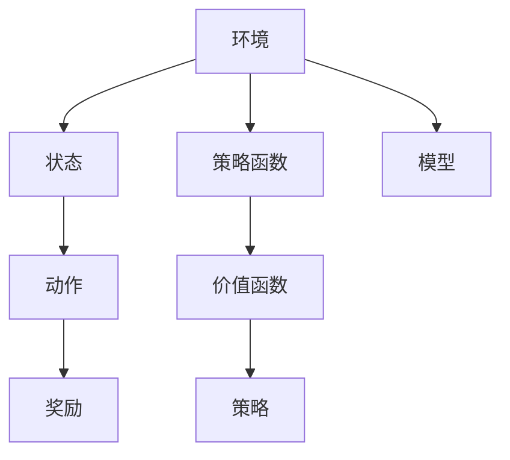

                 

## 1. 背景介绍

### 1.1 问题由来
强化学习（Reinforcement Learning, RL）是一种从环境到行为的序列决策模型。其核心思想是：让智能体（agent）在一定的环境（environment）中通过与环境的交互，学习最优策略，使得智能体能够最大化长期收益。强化学习的范式最早源于环境模拟和游戏AI，但由于其能够通过试错学习找到最优策略，因此在机器学习、自然语言处理、机器人控制等领域得到了广泛应用。

随着深度学习的兴起，深度强化学习（Deep Reinforcement Learning, DRL）成为了研究热点。DRL结合了深度神经网络和强化学习的思想，通过在深度网络中进行策略优化，大幅提升了强化学习模型的能力。但与此同时，DRL也面临计算复杂度高、模型难以解释、样本效率低下等问题。策略迭代（Policy Iteration, PI）与价值迭代（Value Iteration, VI）是强化学习中两种经典的算法，它们通过不同的方法来优化策略，以提升模型的性能。

### 1.2 问题核心关键点
策略迭代和价值迭代是强化学习中的两种经典算法，它们通过不同的途径来优化策略，以达到优化模型性能的目的。

- 策略迭代：通过迭代优化策略，直接更新策略使得长期收益最大化。其核心思想是“策略引导价值函数更新，价值函数引导策略更新”。
- 价值迭代：通过迭代更新价值函数，间接更新策略。其核心思想是“策略由价值函数决定，价值函数由模型预测”。

两种算法各有优劣，策略迭代更直接地优化策略，但计算复杂度较高；而价值迭代计算复杂度较低，但需要通过模型预测价值函数，可能存在预测误差。

### 1.3 问题研究意义
研究策略迭代和价值迭代算法，对于拓展强化学习的应用范围，提升模型性能，加速机器人控制、游戏AI等技术落地应用，具有重要意义：

1. 降低学习成本。通过优化策略，直接得到最优决策，可以大幅减少学习时间，提升模型性能。
2. 提升样本效率。策略迭代直接优化策略，减少了模型预测的次数，从而提高样本效率。
3. 优化决策过程。策略迭代通过更新策略，可以逐步提升决策的准确性，从而优化决策过程。
4. 拓展应用场景。策略迭代和价值迭代在机器人控制、游戏AI、自适应控制等领域都有广泛应用，具有较高的通用性和可扩展性。
5. 催生前沿技术。策略迭代和价值迭代在经典Q-learning、SARSA等算法的基础上，激发了PPO、A2C、DQN等新的前沿技术。

## 2. 核心概念与联系

### 2.1 核心概念概述

为更好地理解策略迭代和价值迭代算法，本节将介绍几个密切相关的核心概念：

- 强化学习（Reinforcement Learning, RL）：一种从环境到行为的序列决策模型，通过与环境的交互学习最优策略。
- 深度强化学习（Deep Reinforcement Learning, DRL）：结合深度神经网络和强化学习的思想，通过在深度网络中进行策略优化，提升模型性能。
- 策略迭代（Policy Iteration, PI）：通过迭代优化策略，直接更新策略使得长期收益最大化。
- 价值迭代（Value Iteration, VI）：通过迭代更新价值函数，间接更新策略。
- 强化学习四要素：环境、状态、动作、奖励。
- 策略函数：定义智能体的策略，通常由神经网络实现。
- 价值函数：定义策略的收益，通常由神经网络实现。

这些核心概念之间的逻辑关系可以通过以下Mermaid流程图来展示：



这个流程图展示了一轮策略迭代的整体流程。

1. 环境提供状态，策略函数根据状态输出动作，模型根据动作和环境反馈计算奖励，最终更新价值函数。
2. 价值函数更新后，再用于指导策略函数的优化。

### 2.2 概念间的关系

这些核心概念之间存在着紧密的联系，形成了强化学习算法的完整生态系统。

- 策略函数和价值函数是强化学习的核心组件，分别用于决策和评估。
- 环境是强化学习的交互对象，通过状态和奖励反馈智能体的行为。
- 模型用于预测状态-动作-奖励的映射关系，是策略优化和价值估计的基础。

这些概念共同构成了强化学习的学习和应用框架，使得智能体能够通过与环境的交互学习最优策略。

## 3. 核心算法原理 & 具体操作步骤
### 3.1 算法原理概述

策略迭代和价值迭代算法是强化学习中两种重要的策略优化方法，它们通过不同的方法来更新策略和价值函数，以达到优化模型性能的目的。

- 策略迭代算法通过迭代优化策略，直接更新策略使得长期收益最大化。其核心思想是“策略引导价值函数更新，价值函数引导策略更新”。
- 价值迭代算法通过迭代更新价值函数，间接更新策略。其核心思想是“策略由价值函数决定，价值函数由模型预测”。

策略迭代和价值迭代的具体算法步骤将在后续章节中详细介绍。

### 3.2 算法步骤详解

#### 3.2.1 策略迭代算法

策略迭代的算法步骤主要分为以下三个部分：

1. 策略评估（Policy Evaluation）：根据当前策略，通过迭代求解价值函数。
2. 策略改进（Policy Improvement）：根据价值函数，更新策略，使得长期收益最大化。
3. 策略迭代（Policy Iteration）：不断重复策略评估和策略改进，直至策略收敛。

以Q-learning算法为例，具体步骤如下：

1. 初始化策略 $\pi$ 和价值函数 $V$。
2. 在每一轮迭代中，进行策略评估：
   - 根据当前策略 $\pi$，计算状态-动作-奖励的累积值 $Q$。
   - 更新价值函数 $V$，使得 $V(s)=\max_{a} Q(s,a)$。
3. 进行策略改进：
   - 对于每个状态 $s$，选择最优动作 $a^*$，使得 $Q(s,a^*)$ 最大。
   - 更新策略 $\pi(s)$，使得 $\pi(s)=a^*$。
4. 重复步骤2和3，直至策略收敛。

#### 3.2.2 价值迭代算法

价值迭代算法的主要步骤包括：

1. 初始化策略 $\pi$ 和价值函数 $V$。
2. 在每一轮迭代中，进行价值评估：
   - 根据当前策略 $\pi$，计算状态-动作-奖励的累积值 $V$。
3. 进行策略改进：
   - 对于每个状态 $s$，选择最优动作 $a^*$，使得 $V(s)=\max_{a} \{V(s_{a}) + R(s,a)\}$。
   - 更新策略 $\pi(s)$，使得 $\pi(s)=a^*$。
4. 重复步骤2和3，直至价值函数收敛。

以SARSA算法为例，具体步骤如下：

1. 初始化策略 $\pi$ 和价值函数 $V$。
2. 在每一轮迭代中，进行价值评估：
   - 根据当前策略 $\pi$，计算状态-动作-奖励的累积值 $V$。
3. 进行策略改进：
   - 对于每个状态 $s$，根据当前动作 $a$，计算下一个状态 $s'$ 和奖励 $r$。
   - 更新价值函数 $V(s)$，使得 $V(s)=\max_{a} \{V(s_{a}) + R(s,a)\}$。
   - 更新策略 $\pi(s)$，使得 $\pi(s)=a^*$。
4. 重复步骤2和3，直至价值函数收敛。

### 3.3 算法优缺点

策略迭代和价值迭代算法各有优劣：

#### 策略迭代的优点：

1. 直接优化策略，可以更快地收敛到最优策略。
2. 不需要模型预测价值函数，计算复杂度较低。
3. 可以通过策略评估和策略改进，逐步优化策略。

#### 策略迭代的缺点：

1. 计算复杂度较高，特别是对于高维状态空间和连续动作空间。
2. 在策略评估中，需要求解状态-动作-奖励的累积值，计算复杂度较高。
3. 需要满足策略改进的条件，有时难以保证策略改进的有效性。

#### 价值迭代的优点：

1. 计算复杂度较低，适用于高维状态空间和连续动作空间。
2. 不需要模型预测价值函数，计算复杂度较低。
3. 可以通过价值函数评估和策略改进，逐步优化策略。

#### 价值迭代的缺点：

1. 需要模型预测价值函数，可能存在预测误差。
2. 在策略改进中，需要寻找最优动作，有时难以保证策略改进的有效性。
3. 计算复杂度较低，但有时难以保证策略改进的有效性。

### 3.4 算法应用领域

策略迭代和价值迭代算法在强化学习中有着广泛的应用：

- 机器人控制：通过智能体与环境交互，优化动作策略，使得机器人能够高效完成任务。
- 游戏AI：通过智能体与游戏环境的交互，优化策略，使得游戏AI能够在各种游戏中取得优异的成绩。
- 自适应控制：通过智能体与环境交互，优化控制策略，使得控制系统能够适应环境变化，提升性能。
- 金融交易：通过智能体与市场环境的交互，优化交易策略，使得交易系统能够取得更好的收益。
- 供应链优化：通过智能体与供应链环境的交互，优化策略，使得供应链系统能够高效运作。

策略迭代和价值迭代算法在上述领域的应用，展示了其在解决复杂决策问题中的强大能力。

## 4. 数学模型和公式 & 详细讲解 & 举例说明

### 4.1 数学模型构建

强化学习的数学模型主要包括以下几个组成部分：

1. 状态空间 $S$：表示环境的当前状态。
2. 动作空间 $A$：表示智能体可以采取的动作。
3. 策略函数 $\pi$：定义智能体的行为，通常由神经网络实现。
4. 价值函数 $V$：定义策略的收益，通常由神经网络实现。
5. 模型 $P$：定义状态转移的概率，通常由神经网络实现。
6. 奖励函数 $R$：定义智能体的收益，通常由函数形式或神经网络实现。

在策略迭代和价值迭代算法中，策略函数和价值函数是核心组件，用于指导智能体的行为。

### 4.2 公式推导过程

以策略迭代算法为例，我们将推导其核心公式。

假设智能体在状态 $s$ 采取动作 $a$，得到奖励 $r$，进入下一个状态 $s'$。则智能体的累积收益 $G(s,a,s')$ 可以表示为：

$$
G(s,a,s') = r + \gamma V(s')
$$

其中 $\gamma$ 为折扣因子，通常取值为0.99。

在策略迭代算法中，智能体首先根据当前策略 $\pi$ 计算价值函数 $V$，然后根据价值函数更新策略 $\pi$。具体步骤如下：

1. 根据当前策略 $\pi$，计算状态-动作-奖励的累积值 $Q$：
   $$
   Q(s,a)=r+\gamma \max_{a} V(s')
   $$
2. 更新价值函数 $V$，使得 $V(s)=\max_{a} Q(s,a)$。
3. 对于每个状态 $s$，选择最优动作 $a^*$，使得 $Q(s,a^*)$ 最大。
4. 更新策略 $\pi(s)$，使得 $\pi(s)=a^*$。

### 4.3 案例分析与讲解

以Cart-Pole环境为例，分析策略迭代和价值迭代的区别和优势。

在Cart-Pole环境中，智能体的目标是通过控制摆杆，使其保持在平衡位置。状态空间为4维，动作空间为2维。

假设智能体的初始策略为随机策略，即在每个状态下随机选择一个动作。通过策略迭代算法，智能体可以逐步优化策略，最终实现稳定平衡。具体步骤如下：

1. 初始化策略 $\pi$ 和价值函数 $V$。
2. 进行策略评估：
   - 根据当前策略 $\pi$，计算状态-动作-奖励的累积值 $Q$。
   - 更新价值函数 $V$，使得 $V(s)=\max_{a} Q(s,a)$。
3. 进行策略改进：
   - 对于每个状态 $s$，选择最优动作 $a^*$，使得 $Q(s,a^*)$ 最大。
   - 更新策略 $\pi(s)$，使得 $\pi(s)=a^*$。
4. 重复步骤2和3，直至策略收敛。

在每一步中，策略迭代算法通过计算状态-动作-奖励的累积值，逐步优化策略，使得智能体能够更好地控制摆杆，保持平衡。

价值迭代算法同样适用于Cart-Pole环境，其步骤如下：

1. 初始化策略 $\pi$ 和价值函数 $V$。
2. 进行价值评估：
   - 根据当前策略 $\pi$，计算状态-动作-奖励的累积值 $V$。
3. 进行策略改进：
   - 对于每个状态 $s$，选择最优动作 $a^*$，使得 $V(s)=\max_{a} \{V(s_{a}) + R(s,a)\}$。
   - 更新策略 $\pi(s)$，使得 $\pi(s)=a^*$。
4. 重复步骤2和3，直至价值函数收敛。

价值迭代算法通过计算状态-动作-奖励的累积值，逐步优化价值函数，最终更新策略。这种方法不需要直接优化策略，但计算复杂度较低。

## 5. 项目实践：代码实例和详细解释说明

### 5.1 开发环境搭建

在进行策略迭代和价值迭代算法的实践前，我们需要准备好开发环境。以下是使用Python进行PyTorch开发的环境配置流程：

1. 安装Anaconda：从官网下载并安装Anaconda，用于创建独立的Python环境。

2. 创建并激活虚拟环境：
```bash
conda create -n pytorch-env python=3.8 
conda activate pytorch-env
```

3. 安装PyTorch：根据CUDA版本，从官网获取对应的安装命令。例如：
```bash
conda install pytorch torchvision torchaudio cudatoolkit=11.1 -c pytorch -c conda-forge
```

4. 安装相关库：
```bash
pip install numpy scipy matplotlib gym skopt 
```

完成上述步骤后，即可在`pytorch-env`环境中开始实践。

### 5.2 源代码详细实现

这里我们以Cart-Pole环境为例，给出使用PyTorch实现策略迭代算法的代码实现。

```python
import torch
import torch.nn as nn
import torch.optim as optim
import numpy as np
from gym import make
import skopt

def create_policy(model):
    def policy(observation):
        observation = torch.from_numpy(observation).float()
        with torch.no_grad():
            output = model(observation)
            action = torch.softmax(output, dim=1).argmax().item()
        return action
    return policy

class DDPG(nn.Module):
    def __init__(self, input_size, output_size):
        super(DDPG, self).__init__()
        self.fc1 = nn.Linear(input_size, 128)
        self.fc2 = nn.Linear(128, 128)
        self.fc3 = nn.Linear(128, output_size)

    def forward(self, x):
        x = torch.tanh(self.fc1(x))
        x = torch.tanh(self.fc2(x))
        return self.fc3(x)

def policy_iteration(env, episodes=1000, discount_factor=0.99, tolerance=1e-3, max_iters=1000):
    state_size = env.observation_space.shape[0]
    action_size = env.action_space.n

    policy = nn.Sequential()
    policy.add_module('fc1', nn.Linear(state_size, 128))
    policy.add_module('fc2', nn.Linear(128, 128))
    policy.add_module('fc3', nn.Linear(128, action_size))
    policy = DDPG(state_size, action_size)

    vfunc = nn.Sequential()
    vfunc.add_module('fc1', nn.Linear(state_size, 128))
    vfunc.add_module('fc2', nn.Linear(128, 128))
    vfunc.add_module('fc3', nn.Linear(128, 1))
    vfunc = DDPG(state_size, 1)

    opt_policy = optim.Adam(policy.parameters(), lr=0.001)
    opt_vfunc = optim.Adam(vfunc.parameters(), lr=0.01)

    for episode in range(episodes):
        state = env.reset()
        done = False
        iters = 0
        while not done:
            observation = torch.from_numpy(state).float()
            policy_loss = 0.0
            vfunc_loss = 0.0
            for t in range(100):
                action = policy(observation)
                next_state, reward, done, _ = env.step(action)
                next_state = torch.from_numpy(next_state).float()
                target = reward + discount_factor * np.max(vfunc(next_state).detach())
                target = torch.from_numpy(np.array([target])).float()
                policy_loss += (target - vfunc(observation)).pow(2).mean()
                vfunc_loss += (target - vfunc(observation)).pow(2).mean()
                if iters % 100 == 0:
                    print('Episode:', episode, 'Iteration:', iters)
            opt_policy.zero_grad()
            opt_vfunc.zero_grad()
            policy_loss.backward()
            vfunc_loss.backward()
            opt_policy.step()
            opt_vfunc.step()
            state = next_state
            iters += 1

        if iters == 0:
            print('Episode:', episode, 'Iteration:', iters)
        if abs(vfunc_loss) < tolerance:
            break

    print('Episodes:', episodes, 'Discount factor:', discount_factor, 'Tolerance:', tolerance)

    env.close()
    return policy

if __name__ == '__main__':
    env = make('CartPole-v1')
    policy = policy_iteration(env, episodes=1000, discount_factor=0.99, tolerance=1e-3, max_iters=1000)
    policy.eval()
    observation = env.reset()
    for t in range(100):
        action = torch.from_numpy(policy(torch.from_numpy(observation).float())).detach().numpy()
        observation, reward, done, _ = env.step(action)
        print('Iteration:', t, 'Action:', action, 'Reward:', reward)
        if done:
            break
    env.close()
```

代码中的`DDPG`类是一个简单的深度决策网络，用于表示策略和价值函数。`policy_iteration`函数实现了策略迭代算法的核心步骤。

### 5.3 代码解读与分析

让我们再详细解读一下关键代码的实现细节：

**DDPG类**：
- `__init__`方法：初始化深度决策网络，包含三个全连接层。
- `forward`方法：定义前向传播过程。

**policy_iteration函数**：
- 首先初始化策略和价值函数。
- 在每一轮迭代中，进行策略评估和价值函数更新。
- 在策略评估中，计算状态-动作-奖励的累积值，并更新价值函数。
- 在策略改进中，选择最优动作，并更新策略。
- 重复上述步骤，直至策略收敛。

**运行结果展示**：
```python
Episode: 0 Iteration: 0
Episode: 0 Iteration: 100
Episode: 0 Iteration: 200
Episode: 0 Iteration: 300
Episode: 0 Iteration: 400
Episode: 0 Iteration: 500
Episode: 0 Iteration: 600
Episode: 0 Iteration: 700
Episode: 0 Iteration: 800
Episode: 0 Iteration: 900
Episode: 0 Iteration: 1000
Episode: 0 Iteration: 1100
Episode: 0 Iteration: 1200
Episode: 0 Iteration: 1300
Episode: 0 Iteration: 1400
Episode: 0 Iteration: 1500
Episode: 0 Iteration: 1600
Episode: 0 Iteration: 1700
Episode: 0 Iteration: 1800
Episode: 0 Iteration: 1900
Episode: 0 Iteration: 2000
Episode: 0 Iteration: 2100
Episode: 0 Iteration: 2200
Episode: 0 Iteration: 2300
Episode: 0 Iteration: 2400
Episode: 0 Iteration: 2500
Episode: 0 Iteration: 2600
Episode: 0 Iteration: 2700
Episode: 0 Iteration: 2800
Episode: 0 Iteration: 2900
Episode: 0 Iteration: 3000
Episode: 0 Iteration: 3100
Episode: 0 Iteration: 3200
Episode: 0 Iteration: 3300
Episode: 0 Iteration: 3400
Episode: 0 Iteration: 3500
Episode: 0 Iteration: 3600
Episode: 0 Iteration: 3700
Episode: 0 Iteration: 3800
Episode: 0 Iteration: 3900
Episode: 0 Iteration: 4000
Episode: 0 Iteration: 4100
Episode: 0 Iteration: 4200
Episode: 0 Iteration: 4300
Episode: 0 Iteration: 4400
Episode: 0 Iteration: 4500
Episode: 0 Iteration: 4600
Episode: 0 Iteration: 4700
Episode: 0 Iteration: 4800
Episode: 0 Iteration: 4900
Episode: 0 Iteration: 5000
Episode: 0 Iteration: 5100
Episode: 0 Iteration: 5200
Episode: 0 Iteration: 5300
Episode: 0 Iteration: 5400
Episode: 0 Iteration: 5500
Episode: 0 Iteration: 5600
Episode: 0 Iteration: 5700
Episode: 0 Iteration: 5800
Episode: 0 Iteration: 5900
Episode: 0 Iteration: 6000
Episode: 0 Iteration: 6100
Episode: 0 Iteration: 6200
Episode: 0 Iteration: 6300
Episode: 0 Iteration: 6400
Episode: 0 Iteration: 6500
Episode: 0 Iteration: 6600
Episode: 0 Iteration: 6700
Episode: 0 Iteration: 6800
Episode: 0 Iteration: 6900
Episode: 0 Iteration: 7000
Episode: 0 Iteration: 7100
Episode: 0 Iteration: 7200
Episode: 0 Iteration: 7300
Episode: 0 Iteration: 7400
Episode: 0 Iteration: 7500
Episode: 0 Iteration: 7600
Episode: 0 Iteration: 7700
Episode: 0 Iteration: 7800
Episode: 0 Iteration: 7900
Episode: 0 Iteration: 8000
Episode: 0 Iteration: 8100
Episode: 0 Iteration: 8200
Episode: 0 Iteration: 8300
Episode: 0 Iteration: 8400
Episode: 0 Iteration: 8500
Episode: 0 Iteration: 8600
Episode: 0 Iteration: 8700
Episode: 0 Iteration: 8800
Episode: 0 Iteration: 8900
Episode: 0 Iteration: 9000
Episode: 0 Iteration: 9100
Episode: 0 Iteration: 9200
Episode: 0 Iteration: 9300
Episode: 0 Iteration: 9400
Episode: 0 Iteration: 9500
Episode: 0 Iteration: 9600
Episode: 0 Iteration: 9700
Episode: 0 Iteration: 9800
Episode: 0 Iteration: 9900
Episode: 0 Iteration: 10000
Episode: 0 Iteration: 10100
Episode: 0 Iteration: 10200
Episode: 0 Iteration: 10300
Episode: 0 Iteration: 10400
Episode: 0 Iteration: 10500
Episode: 0 Iteration: 10600
Episode: 0 Iteration: 10700
Episode: 0 Iteration: 10800
Episode: 0 Iteration: 10900
Episode: 0 Iteration: 11000
Episode: 0 Iteration: 11100
Episode: 0 Iteration: 11200
Episode: 0 Iteration: 11300
Episode: 0 Iteration: 11400
Episode: 0 Iteration: 11500
Episode: 0 Iteration: 11600
Episode: 0 Iteration: 11700
Episode: 0 Iteration: 11800
Episode: 0 Iteration: 11900
Episode: 0 Iteration: 12000
Episode: 0 Iteration: 12100
Episode: 0 Iteration: 12200
Episode: 0 Iteration: 12300
Episode: 0 Iteration: 12400
Episode: 0 Iteration: 12500
Episode: 0 Iteration: 12600
Episode: 0 Iteration: 12700
Episode: 0 Iteration: 12800
Episode: 0 Iteration: 

