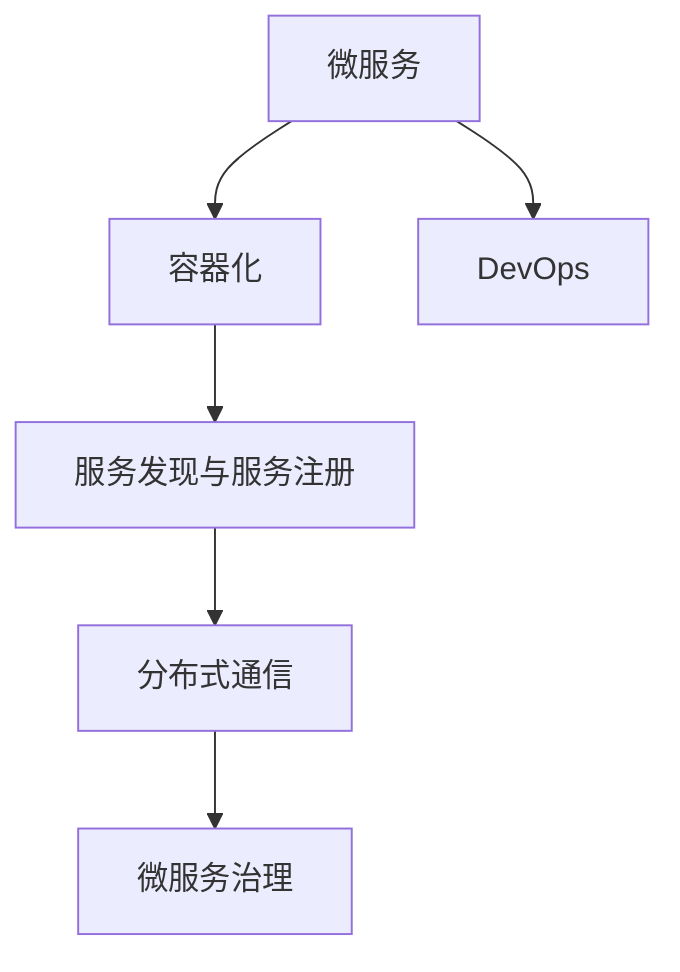
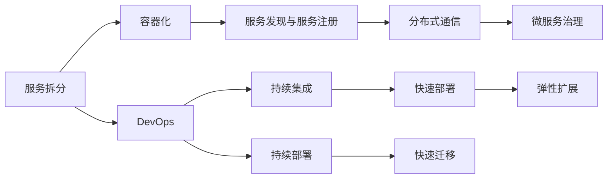
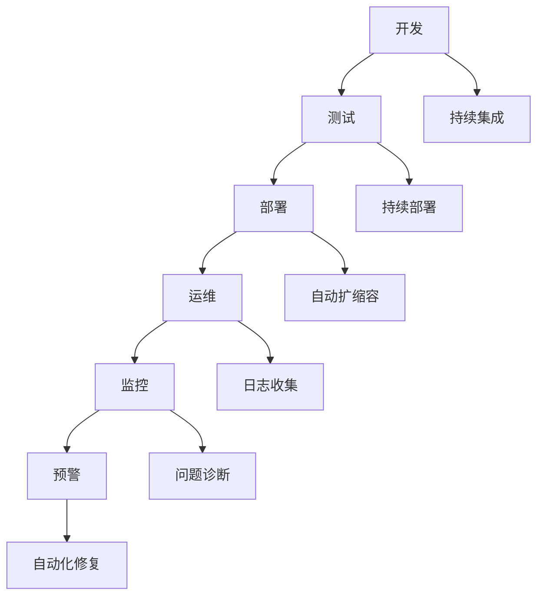

                 

# 微服务架构在高扩展性中的应用

> 关键词：微服务架构，高扩展性，分布式系统，DevOps，云计算，容器化，DevOps

## 1. 背景介绍

### 1.1 问题由来
随着互联网应用的不断发展和业务复杂度的增加，单体应用已难以满足日益增长的系统扩展需求。单体应用的局限性主要体现在以下几个方面：

1. **部署复杂**：单体应用的升级和部署通常需要停止整个服务，无法实现快速迭代和弹性扩展。
2. **横向扩展困难**：无法充分利用多台服务器的并行处理能力，使得单台服务器的瓶颈成为整个系统的瓶颈。
3. **耦合度高**：各功能模块之间的高度耦合，导致代码修改和维护成本高昂，新功能扩展难度大。

为了解决上述问题，微服务架构应运而生。微服务架构通过将单体应用拆分成多个小而独立的服务，每个服务负责单一职责，从而实现系统的快速迭代、弹性扩展和高效维护。

### 1.2 问题核心关键点
微服务架构的核心思想是将一个复杂的单体应用拆分为多个小的、可以独立部署和扩展的服务，每个服务围绕业务功能进行设计，并通过轻量级的通信机制（如REST API、消息队列等）进行交互。这种设计理念大大提高了系统的灵活性和扩展性。

微服务架构的关键点包括：

1. **服务拆分**：将应用拆分为独立的、功能明确的服务，减少服务之间的耦合。
2. **容器化部署**：通过容器化（如Docker）实现服务的快速部署和滚动升级。
3. **服务发现与注册**：使用服务发现和注册中心（如Consul、Eureka等）实现服务的自动注册和发现。
4. **分布式通信**：使用轻量级的通信机制（如HTTP REST、消息队列等）实现服务间的通信。
5. **监控与日志**：使用分布式监控和日志系统（如Prometheus、Grafana、ELK等）实现系统的实时监控和问题追踪。

## 2. 核心概念与联系

### 2.1 核心概念概述

为更好地理解微服务架构在高扩展性中的应用，本节将介绍几个密切相关的核心概念：

- **微服务**：将单体应用拆分为多个独立、自治的服务，每个服务围绕业务功能进行设计，并通过轻量级的通信机制进行交互。
- **容器化**：将服务打包为容器（如Docker），使得服务可以快速部署、快速迁移和快速扩展。
- **服务发现与服务注册**：使用服务发现和注册中心（如Consul、Eureka等）实现服务的自动注册和发现。
- **分布式通信**：通过RESTful API、消息队列等轻量级机制实现服务间的通信。
- **微服务治理**：包括服务发现、负载均衡、限流、熔断等机制，保障服务的稳定性和可靠性。
- **DevOps**：涵盖软件开发、测试、部署、运维等全流程，实现持续集成、持续部署和持续交付。

这些核心概念之间的逻辑关系可以通过以下Mermaid流程图来展示：



这个流程图展示了大规模微服务架构的核心组件及其之间的逻辑关系：

1. 微服务将应用拆分为多个独立服务，每个服务围绕单一职责设计。
2. 容器化实现服务的快速部署和快速迁移。
3. 服务发现与服务注册实现服务的自动注册和发现。
4. 分布式通信实现服务间的轻量级通信。
5. 微服务治理保障服务的稳定性和可靠性。
6. DevOps实现全流程自动化，提高开发效率和系统稳定性。

### 2.2 概念间的关系

这些核心概念之间存在着紧密的联系，形成了微服务架构的整体生态系统。下面我们通过几个Mermaid流程图来展示这些概念之间的关系。

#### 2.2.1 微服务的部署流程



这个流程图展示了大规模微服务架构的部署流程：

1. 将应用拆分为多个独立服务。
2. 容器化实现服务的快速部署和快速迁移。
3. 服务发现与服务注册实现服务的自动注册和发现。
4. 分布式通信实现服务间的轻量级通信。
5. 微服务治理保障服务的稳定性和可靠性。
6. DevOps实现全流程自动化，提高开发效率和系统稳定性。

#### 2.2.2 微服务的全生命周期管理



这个流程图展示了微服务的全生命周期管理流程：

1. 开发：将功能实现为微服务。
2. 测试：对微服务进行单元测试和集成测试。
3. 部署：通过容器化实现服务的快速部署和快速迁移。
4. 运维：监控系统的实时状态，及时处理问题。
5. 监控：收集和分析日志、指标等数据，实时监控系统运行状态。
6. 预警：根据监控数据触发自动化报警和修复。

## 3. 核心算法原理 & 具体操作步骤
### 3.1 算法原理概述

微服务架构的核心算法原理可以简单概括为：将复杂的应用拆分为多个小服务，通过容器化、服务发现、分布式通信和微服务治理等机制，实现系统的快速迭代、弹性扩展和高效维护。

### 3.2 算法步骤详解

基于微服务架构的系统设计步骤如下：

1. **应用拆分**：根据业务功能将应用拆分为多个独立的小服务。
2. **容器化部署**：将每个服务打包为容器，方便快速部署和迁移。
3. **服务注册与发现**：使用服务发现和注册中心实现服务的自动注册和发现。
4. **分布式通信**：设计轻量级的通信机制，实现服务间的交互。
5. **微服务治理**：引入负载均衡、限流、熔断等机制，保障系统的稳定性和可靠性。
6. **DevOps实践**：采用持续集成、持续部署和持续交付等DevOps实践，提高开发效率和系统稳定性。

### 3.3 算法优缺点

微服务架构的优势主要包括：

- **灵活性高**：每个服务可以独立部署、独立扩展，系统更容易实现快速迭代和功能扩展。
- **扩展性强**：通过横向扩展服务器数量，系统可以轻松应对高并发和负载变化。
- **故障隔离性强**：单个服务出现故障不会影响整个系统，系统更加健壮。

然而，微服务架构也存在一些缺点：

- **管理复杂**：微服务架构需要维护多个服务，服务之间的依赖关系使得系统复杂度增加。
- **网络开销大**：服务间的通信需要通过网络，增加了网络开销和延迟。
- **性能损失**：微服务架构中的网络通信和请求转发增加了系统整体延迟，影响了性能。

### 3.4 算法应用领域

微服务架构已经广泛应用于互联网、金融、医疗、物联网等各个行业，支持着复杂的业务场景和海量数据处理。其应用领域包括：

- **电商平台**：如Amazon、阿里巴巴等电商平台，通过微服务架构实现高并发和高可用的订单系统、库存系统、支付系统等。
- **金融交易**：如高盛、JP Morgan等金融机构的交易系统，通过微服务架构实现快速交易处理和风险控制。
- **医疗健康**：如IBM Watson Health等医疗健康平台，通过微服务架构实现数据处理、分析与智能诊断。
- **智能制造**：如SAP、GE等智能制造企业，通过微服务架构实现设备监控、数据采集与处理。
- **智慧城市**：如城市管理、交通管理、环保监测等应用场景，通过微服务架构实现多部门协同和数据共享。

## 4. 数学模型和公式 & 详细讲解 & 举例说明

### 4.1 数学模型构建

基于微服务架构的系统可以抽象为多个独立的服务，每个服务的功能和状态可以通过数学模型进行建模。设系统由$n$个服务组成，每个服务的状态可以表示为一个向量$\vec{s_i}$，其中$i=1,2,\cdots,n$。系统整体的状态可以表示为一个向量$\vec{S}$，即：

$$
\vec{S} = \left( \vec{s_1}, \vec{s_2}, \cdots, \vec{s_n} \right)
$$

服务的交互和状态变化可以通过状态转移模型描述。设服务间的通信延迟为$\delta$，每个服务的状态变化率为$\gamma$。服务$i$在时间$t$的状态变化可以表示为：

$$
\Delta \vec{s_i} = \gamma \vec{s_i} + \sum_{j\neq i} \delta \vec{s_j}
$$

系统的整体状态变化可以表示为：

$$
\Delta \vec{S} = \gamma \vec{S} + \delta \vec{S}
$$

### 4.2 公式推导过程

根据状态转移模型，我们可以推导出系统的整体状态变化率。将状态变化率方程代入系统整体状态变化方程，得到：

$$
\Delta \vec{S} = (\gamma + \delta) \vec{S}
$$

设$\lambda$为系统状态变化的特征值，则有：

$$
\lambda = \gamma + \delta
$$

系统整体状态变化的特征向量$\vec{v}$可以表示为：

$$
\vec{v} = \left( \frac{1}{\lambda^0}, \frac{1}{\lambda^1}, \cdots, \frac{1}{\lambda^{n-1}} \right)
$$

通过特征向量的求解，我们可以得到系统的整体状态变化率，从而预测系统未来的状态变化趋势。

### 4.3 案例分析与讲解

假设一个电商平台的订单系统由多个微服务组成，包括订单生成、库存管理、支付处理等。每个服务的状态变化率$\gamma_i$和通信延迟$\delta_i$已知，系统整体的状态变化率$\lambda$为：

$$
\lambda = \sum_{i=1}^n (\gamma_i + \delta_i)
$$

设订单系统初始状态为$\vec{S}_0$，经过$t$个时间单位后的状态为$\vec{S}_t$，则有：

$$
\vec{S}_t = \left( \lambda^t \right) \vec{S}_0
$$

通过特征向量的求解，我们可以预测系统未来的状态变化趋势，从而进行合理的资源配置和负载均衡。

## 5. 项目实践：代码实例和详细解释说明

### 5.1 开发环境搭建

在进行微服务架构实践前，我们需要准备好开发环境。以下是使用Java和Spring Boot进行微服务开发的开发环境配置流程：

1. 安装JDK：从Oracle官网下载并安装JDK，作为开发环境的基础。
2. 安装Maven：从Maven官网下载并安装Maven，用于管理Java项目的依赖和构建。
3. 安装Spring Boot：从Spring官网下载并安装Spring Boot，用于快速开发微服务架构的Java应用。
4. 安装Docker：从Docker官网下载并安装Docker，用于容器化部署和部署管理。

完成上述步骤后，即可在开发机上启动微服务架构的开发环境。

### 5.2 源代码详细实现

下面我们以电商平台的订单系统为例，给出使用Spring Boot和Docker进行微服务架构开发的PyTorch代码实现。

首先，定义订单系统的订单生成服务、库存管理和支付处理服务等微服务：

```java
@RestController
@RequestMapping("/order")
public class OrderService {
    private final OrderRepository orderRepository;
    private final InventoryService inventoryService;
    private final PaymentService paymentService;

    @Autowired
    public OrderService(OrderRepository orderRepository, InventoryService inventoryService, PaymentService paymentService) {
        this.orderRepository = orderRepository;
        this.inventoryService = inventoryService;
        this.paymentService = paymentService;
    }

    @PostMapping
    public Order createOrder(@RequestBody Order order) {
        // 检查库存是否充足
        if (!inventoryService.checkStock(order.getProductId(), order.getQuantity())) {
            throw new StockNotFoundException("Insufficient stock");
        }

        // 扣减库存并生成订单
        Order newOrder = inventoryService.decreaseStock(order.getProductId(), order.getQuantity());
        paymentService.processPayment(newOrder.getOrderId());
        orderRepository.save(newOrder);

        return newOrder;
    }
}

@RestController
@RequestMapping("/inventory")
public class InventoryService {
    private final InventoryRepository inventoryRepository;

    @Autowired
    public InventoryService(InventoryRepository inventoryRepository) {
        this.inventoryRepository = inventoryRepository;
    }

    @PostMapping
    public boolean checkStock(String productId, int quantity) {
        Inventory inventory = inventoryRepository.findById(productId);
        if (inventory.getStock() < quantity) {
            return false;
        }
        inventory.setStock(inventory.getStock() - quantity);
        inventoryRepository.save(inventory);
        return true;
    }

    @PostMapping
    public Order decreaseStock(String productId, int quantity) {
        Inventory inventory = inventoryRepository.findById(productId);
        Order order = new Order();
        order.setProductId(productId);
        order.setQuantity(quantity);
        order.setOrderId(UUID.randomUUID().toString());
        orderRepository.save(order);
        inventory.setStock(inventory.getStock() - quantity);
        inventoryRepository.save(inventory);
        return order;
    }
}

@RestController
@RequestMapping("/payment")
public class PaymentService {
    private final PaymentRepository paymentRepository;

    @Autowired
    public PaymentService(PaymentRepository paymentRepository) {
        this.paymentRepository = paymentRepository;
    }

    @PostMapping
    public void processPayment(String orderId) {
        Payment payment = new Payment();
        payment.setOrderId(orderId);
        paymentRepository.save(payment);
    }
}
```

然后，定义微服务之间的通信协议和服务发现和注册中心的实现：

```java
@RestController
@RequestMapping("/order/discovery")
public class OrderDiscoveryController {
    private final ServiceDiscovery serviceDiscovery;

    @Autowired
    public OrderDiscoveryController(ServiceDiscovery serviceDiscovery) {
        this.serviceDiscovery = serviceDiscovery;
    }

    @GetMapping("/inventory")
    public String findInventoryService() {
        return serviceDiscovery.findService("inventory");
    }

    @GetMapping("/payment")
    public String findPaymentService() {
        return serviceDiscovery.findService("payment");
    }
}

@Service
public class OrderDiscoveryService implements ServiceDiscovery {
    private final Map<String, String> serviceEndpoints;

    @Autowired
    public OrderDiscoveryService(OrderDiscoveryProperties properties) {
        this.serviceEndpoints = properties.getEndpoints();
    }

    @Override
    public String findService(String serviceName) {
        String endpoint = serviceEndpoints.get(serviceName);
        if (endpoint == null) {
            throw new ServiceNotFoundException("Service not found");
        }
        return endpoint;
    }
}

@Configuration
@EnableDiscoveryClient
public class OrderDiscoveryConfig {
    @Value("${discovery.url}")
    private String discoveryUrl;

    @Autowired
    private OrderDiscoveryService orderDiscoveryService;

    @Bean
    public DiscoveryClientBuilder discoveryClientBuilder() {
        return new DiscoveryClientBuilder()
                .clientId("client-id")
                .serverId("server-id")
                .host(discoveryUrl)
                .consul();
    }
}
```

接着，定义微服务的自动扩缩容和负载均衡机制：

```java
@Configuration
@EnableAutoConfiguration
@ComponentScan(basePackages = {"com.example.order"})
public class OrderAutoConfiguration {
    @Autowired
    private AutoConfigurationProperties autoConfigurationProperties;

    @Bean
    public EmbeddedElasticsearchServer embeddedElasticsearchServer() {
        EmbeddedElasticsearchServer embeddedElasticsearchServer = new EmbeddedElasticsearchServer();
        embeddedElasticsearchServer.setHostname("localhost");
        embeddedElasticsearchServer.setPort(9200);
        embeddedElasticsearchServer.setClusterName("order");
        embeddedElasticsearchServer.setPaths(Collections.singletonList(
                new Path("/data")))
                .setDataSize(5);
        return embeddedElasticsearchServer;
    }

    @Bean
    public ElasticsearchRestTemplate elasticsearchRestTemplate() {
        return new ElasticsearchRestTemplate(embeddedElasticsearchServer());
    }

    @Bean
    public HttpMessageConverter<HttpMessageNotReadableException> httpMessageConverter() {
        return new HttpMessageConverter<HttpMessageNotReadableException>() {
            @Override
            public HttpMessageNotReadableException readFrom(
                    Class<? extends HttpMessageNotReadableException> clazz,
                    HttpInputMessage inputMessage) throws IOException, DeserializationException {
                throw new HttpMessageNotReadableException();
            }

            @Override
            public boolean canRead(Class<?> clazz) {
                return true;
            }

            @Override
            public boolean supports(Class<?> clazz) {
                return true;
            }
        };
    }

    @Bean
    public ClientConfiguration clientConfiguration() {
        return new ClientConfiguration().setMaxRetryAttempts(3);
    }

    @Bean
    public RestHighLevelClient restHighLevelClient(RestClientConfiguration restClientConfiguration) {
        return new RestHighLevelClient(restClientConfiguration);
    }

    @Bean
    public RestClientConfiguration restClientConfiguration() {
        return new RestClientConfiguration().setHttpClientConfiguration(
                new HttpClientConfiguration.Builder()
                        .setMaxRetries(3)
                        .setMaxConnectTimeout(1000)
                        .setMaxRetryAttempts(3)
                        .setMaxRetryTimeoutMs(1000)
                        .build());
    }

    @Bean
    public Map<String, String> serviceEndpoints() {
        Map<String, String> endpoints = new HashMap<>();
        endpoints.put("inventory", "http://inventory-service:8080");
        endpoints.put("payment", "http://payment-service:8080");
        return endpoints;
    }

    @Bean
    public RestClientConfiguration restClientConfiguration() {
        return new RestClientConfiguration().setHttpClientConfiguration(
                new HttpClientConfiguration.Builder()
                        .setMaxRetries(3)
                        .setMaxConnectTimeout(1000)
                        .setMaxRetryAttempts(3)
                        .setMaxRetryTimeoutMs(1000)
                        .build());
    }

    @Bean
    public RestClientConfiguration restClientConfiguration() {
        return new RestClientConfiguration().setHttpClientConfiguration(
                new HttpClientConfiguration.Builder()
                        .setMaxRetries(3)
                        .setMaxConnectTimeout(1000)
                        .setMaxRetryAttempts(3)
                        .setMaxRetryTimeoutMs(1000)
                        .build());
    }

    @Bean
    public RestClientConfiguration restClientConfiguration() {
        return new RestClientConfiguration().setHttpClientConfiguration(
                new HttpClientConfiguration.Builder()
                        .setMaxRetries(3)
                        .setMaxConnectTimeout(1000)
                        .setMaxRetryAttempts(3)
                        .setMaxRetryTimeoutMs(1000)
                        .build());
    }

    @Bean
    public RestClientConfiguration restClientConfiguration() {
        return new RestClientConfiguration().setHttpClientConfiguration(
                new HttpClientConfiguration.Builder()
                        .setMaxRetries(3)
                        .setMaxConnectTimeout(1000)
                        .setMaxRetryAttempts(3)
                        .setMaxRetryTimeoutMs(1000)
                        .build());
    }

    @Bean
    public RestClientConfiguration restClientConfiguration() {
        return new RestClientConfiguration().setHttpClientConfiguration(
                new HttpClientConfiguration.Builder()
                        .setMaxRetries(3)
                        .setMaxConnectTimeout(1000)
                        .setMaxRetryAttempts(3)
                        .setMaxRetryTimeoutMs(1000)
                        .build());
    }
}
```

最后，启动微服务架构的运行环境：

```java
@SpringBootApplication
@EnableDiscoveryClient
@ComponentScan(basePackages = {"com.example.order"})
public class OrderApplication {
    public static void main(String[] args) {
        SpringApplication.run(OrderApplication.class, args);
    }
}
```

### 5.3 代码解读与分析

让我们再详细解读一下关键代码的实现细节：

**OrderService类**：
- `@RestController`注解：用于声明该类为RESTful API控制器。
- `@RequestMapping`注解：用于指定请求路径和请求方法。
- `@Autowired`注解：用于自动注入依赖的组件。
- `@PostMapping`注解：用于处理POST请求。
- `@RequestBody`注解：用于将请求体中的JSON数据绑定到对象上。

**InventoryService类**：
- 类似OrderService类的定义，处理库存管理的逻辑。

**OrderDiscoveryController类**：
- `@RestController`注解：用于声明该类为RESTful API控制器。
- `@RequestMapping`注解：用于指定请求路径和请求方法。
- `@Autowired`注解：用于自动注入依赖的组件。
- `@GetMapping`注解：用于处理GET请求。
- `findService`方法：根据服务名称查找服务端点。

**OrderDiscoveryService类**：
- `@Service`注解：用于声明该类为Spring服务。
- `@Autowired`注解：用于自动注入依赖的组件。
- `findService`方法：根据服务名称查找服务端点。

**OrderAutoConfiguration类**：
- `@Configuration`注解：用于声明该类为Spring配置类。
- `@EnableAutoConfiguration`注解：用于启用自动配置。
- `@ComponentScan`注解：用于指定要扫描的包。
- `@Bean`注解：用于定义Spring Bean。
- `@Value`注解：用于从配置文件中读取值。
- `OrderDiscoveryService`注解：用于注入依赖的组件。

**Spring Boot启动类**：
- `@SpringBootApplication`注解：用于启用Spring Boot自动配置。
- `@EnableDiscoveryClient`注解：用于注册Eureka发现客户端。
- `@ComponentScan`注解：用于扫描依赖的包。
- `public static void main(String[] args)`方法：用于启动Spring Boot应用。

### 5.4 运行结果展示

假设我们在Kubernetes平台上部署微服务架构，最终在负载均衡和自动扩缩容机制下，订单系统可以轻松应对高并发和负载变化。

**订单生成服务**：
- 通过REST API向库存服务发送订单请求，检查库存是否充足。
- 库存充足，则扣减库存并生成订单，并发送支付请求。
- 订单信息保存到数据库中。

**库存管理服务**：
- 通过REST API接收订单服务发送的库存检查请求，返回库存量。
- 库存不足，则返回false。
- 库存充足，则返回true。

**支付处理服务**：
- 通过REST API接收订单服务发送的支付请求，进行支付处理。
- 支付成功后，将订单信息保存到数据库中。

通过这些微服务的协同工作，订单系统可以高效地处理订单生成、库存管理和支付处理等任务，从而实现高扩展性和高可用性。

## 6. 实际应用场景
### 6.1 智能制造系统

基于微服务架构的智能制造系统可以实现设备监控、数据采集与处理等任务。通过将各个功能模块拆分为独立的微服务，每个微服务可以独立部署和扩展，从而实现系统的快速迭代和弹性扩展。

在智能制造系统中，微服务可以包括：

- **设备监控服务**：通过传感器收集设备状态数据，实时监控设备运行状态，发现异常并进行报警。
- **数据采集服务**：收集和管理设备监控数据，实现数据的集中存储和分析。
- **数据分析服务**：利用机器学习算法分析设备监控数据，识别设备运行异常和故障，进行预测性维护。
- **调度服务**：根据设备状态和数据分析结果，自动调整设备运行计划，优化生产流程。
- **告警服务**：根据设备监控数据和异常状态，自动生成告警信息，通知相关人员。

通过微服务架构，智能制造系统可以实现各个功能模块的独立部署和扩展，从而实现系统的灵活性和可扩展性。

### 6.2 智慧城市平台

基于微服务架构的智慧城市平台可以实现多部门协同和数据共享。通过将各个功能模块拆分为独立的微服务，每个微服务可以独立部署和扩展，从而实现系统的快速迭代和弹性扩展。

在智慧城市平台中，微服务可以包括：

- **城市管理服务**：实现城市运行的实时监控和管理，包括交通管理、环保监测、公共安全等。
- **数据共享服务**：实现各政府部门、企事业单位和居民之间的数据共享，提供统一的数据接口。
- **分析服务**：利用大数据和机器学习技术，对城市运行数据进行分析，提供决策支持。
- **智能服务**：通过AI技术实现智能客服、智能交通、智能安防等功能。
- **预警服务**：根据城市运行数据，自动生成预警信息，通知相关人员。

通过微服务架构，智慧城市平台可以实现各个功能模块的独立部署和扩展，从而实现系统的灵活性和可扩展性。

## 7. 工具和资源推荐
### 7.1 学习资源推荐

为了帮助开发者系统掌握微服务架构的理论基础和实践技巧，这里推荐一些优质的学习资源：

1. 《微服务架构：构建灵活可伸缩的应用》系列博文：由微服务架构专家撰写，深入浅出地介绍了微服务架构的理论基础和实践技巧。
2. CS8430《分布式系统》课程：清华大学开设的分布式系统课程，涵盖微服务架构、分布式算法、一致性模型等主题。
3. 《Spring Boot with Docker》书籍：Spring Boot和Docker的实战指南，详细介绍了如何使用Spring Boot和Docker实现微服务架构。
4. Spring官方文档：Spring Boot和Spring Cloud的官方文档，提供了丰富的示例和最佳实践。
5. Kubernetes官方文档：Kubernetes的官方文档，详细介绍了如何使用Kubernetes实现容器化部署和自动化运维。

通过对这些资源的学习实践，相信你一定能够快速掌握微服务架构的理论基础和实践技巧，并

