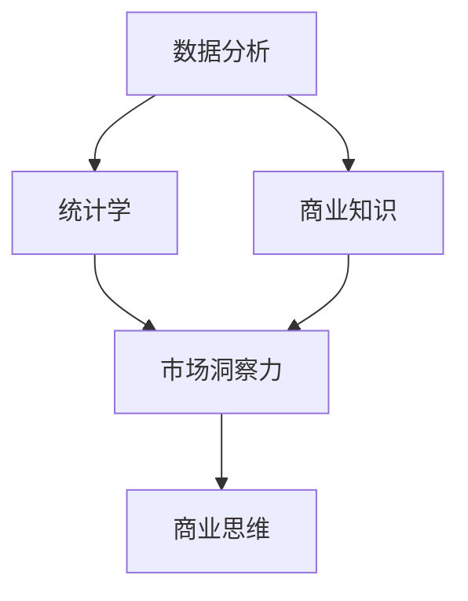
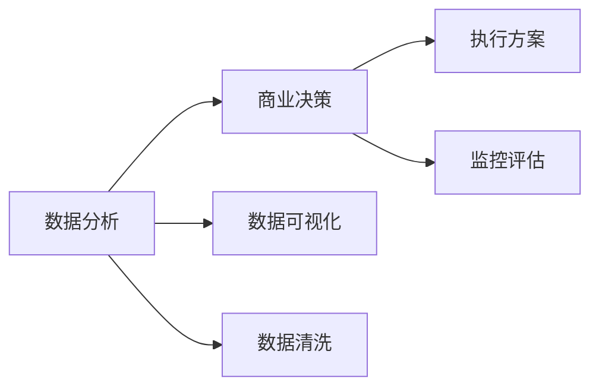
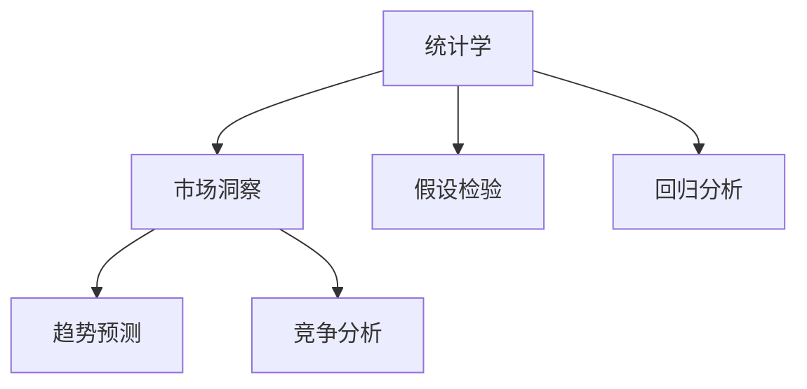
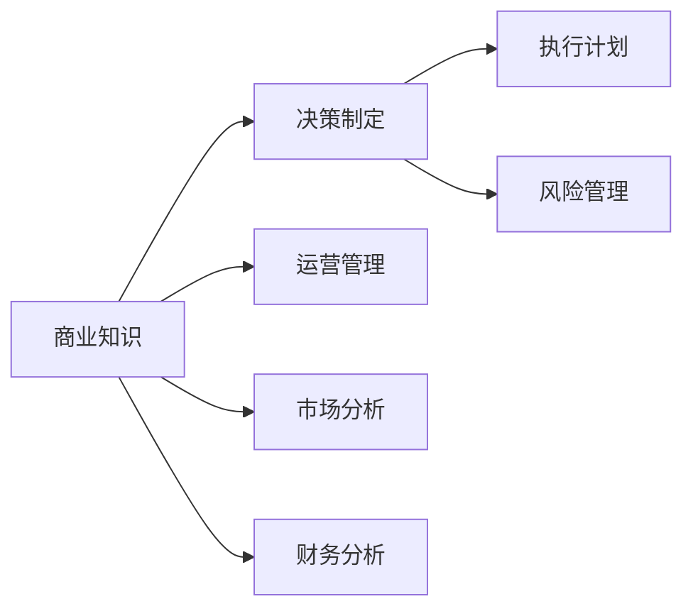
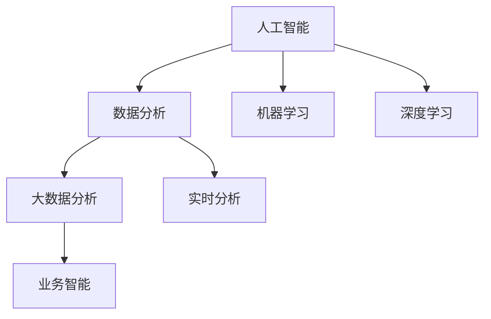
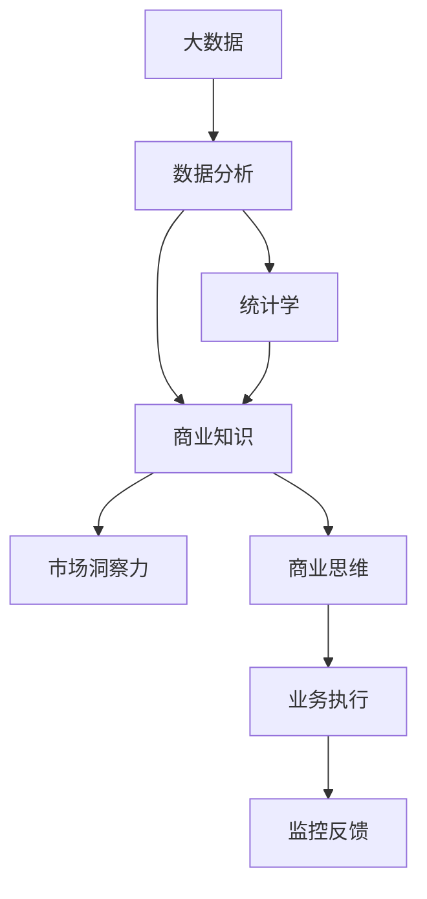

                 

# 怎样培养敏锐的市场洞察力和商业思维

> 关键词：市场洞察力,商业思维,数据分析,决策制定,人工智能,大数据,统计学

## 1. 背景介绍

### 1.1 问题由来
在当今快速变化的市场环境中，企业面临着前所未有的挑战和机遇。如何在纷繁复杂的数据中捕捉到关键趋势，预测未来变化，制定有效的商业决策，成为了每个企业领导者和管理者必须面对的课题。特别是对于科技公司而言，如何在激烈竞争中保持领先地位，赢得市场份额，实现可持续发展，更需要敏锐的市场洞察力和商业思维。

### 1.2 问题核心关键点
市场洞察力是指企业对市场环境、竞争对手、客户需求等关键因素的深入理解和分析能力。商业思维则是基于这些洞察，通过数据驱动的决策制定，实现业务目标的过程。对于企业而言，敏锐的市场洞察力和商业思维的培养，是企业长期发展和竞争优势的核心。

培养市场洞察力和商业思维的核心在于以下几个方面：
1. **数据分析能力**：能够从海量的数据中提取出有价值的洞察。
2. **统计学知识**：运用统计学方法，准确分析和预测市场趋势。
3. **商业知识**：理解企业运营的各个环节，能够综合考虑多种因素进行决策。
4. **人工智能技术**：利用人工智能和大数据技术，辅助进行更深入的数据分析和预测。

本文将从数据分析、统计学、商业知识和人工智能技术四个方面，系统介绍如何培养敏锐的市场洞察力和商业思维。

### 1.3 问题研究意义
市场洞察力和商业思维的培养，对于企业的战略规划、市场决策、产品迭代、用户体验优化等方面都具有重要意义。具体而言，通过对市场洞察力和商业思维的培养，企业能够：
1. **优化产品策略**：根据市场反馈和趋势，快速调整产品策略，提升产品竞争力。
2. **提升用户体验**：通过精准的市场洞察，满足用户需求，提升用户满意度。
3. **制定市场策略**：通过全面分析市场环境和竞争对手，制定更具针对性的市场策略。
4. **实现可持续发展**：基于对市场和技术的深入理解，实现企业的长期发展。

## 2. 核心概念与联系

### 2.1 核心概念概述

为了更好地理解市场洞察力和商业思维的培养过程，本节将介绍几个密切相关的核心概念：

- **数据分析（Data Analysis）**：通过收集、处理、分析数据，提取有价值的信息和洞见。
- **统计学（Statistics）**：运用统计方法对数据进行分析和推断，揭示数据背后的规律和趋势。
- **商业知识（Business Knowledge）**：涵盖企业运营、市场营销、财务管理等领域的知识。
- **人工智能（Artificial Intelligence, AI）**：利用机器学习、深度学习等技术，自动化处理和分析大规模数据。
- **市场洞察力（Market Insight）**：通过对市场环境的深入理解和分析，捕捉到关键趋势和机会。
- **商业思维（Business Acumen）**：基于市场洞察，通过数据驱动的决策制定，实现业务目标。

这些核心概念之间的联系可以通过以下Mermaid流程图来展示：



这个流程图展示了大数据时代，数据分析、统计学、商业知识与人工智能技术之间的联系：数据分析和统计学提供数据支持，商业知识提供决策依据，人工智能技术提供技术手段，共同作用于市场洞察力的培养，最终形成商业思维。

### 2.2 概念间的关系

这些核心概念之间存在着紧密的联系，形成了市场洞察力和商业思维培养的完整生态系统。下面我们通过几个Mermaid流程图来展示这些概念之间的关系。

#### 2.2.1 数据分析与商业决策的关系



这个流程图展示了数据分析与商业决策的关系。数据分析不仅需要从数据中提取有价值的信息，还需要通过数据可视化和大数据技术，更好地呈现数据结果，辅助决策者进行决策。同时，数据分析结果需要经过数据清洗，去除噪音和异常值，保证决策的准确性。

#### 2.2.2 统计学与市场洞察的关系



这个流程图展示了统计学与市场洞察的关系。统计学通过假设检验、回归分析等方法，揭示数据背后的规律和趋势，从而形成对市场的深入理解。这种洞察有助于企业把握市场机会，制定有针对性的市场策略。

#### 2.2.3 商业知识与决策制定的关系



这个流程图展示了商业知识与决策制定的关系。商业知识涵盖了企业的运营管理、市场分析、财务分析等多个方面，是决策制定中不可或缺的一部分。通过商业知识的应用，企业能够制定更加全面和科学的决策。

#### 2.2.4 人工智能与数据分析的关系



这个流程图展示了人工智能与数据分析的关系。人工智能通过机器学习、深度学习等技术，自动化处理和分析大规模数据，提升了数据分析的效率和精度。这种自动化手段使得数据分析更加高效和准确，从而更好地支持商业决策。

### 2.3 核心概念的整体架构

最后，我们用一个综合的流程图来展示这些核心概念在市场洞察力和商业思维培养过程中的整体架构：



这个综合流程图展示了从大数据到市场洞察力和商业思维的完整过程。大数据提供了分析的基础，数据分析、统计学和商业知识为市场洞察力的培养提供了支持，最终通过商业思维指导业务执行，并根据监控反馈进行持续优化。通过这些核心概念的协同作用，企业能够更好地理解市场环境，制定有效的商业策略。

## 3. 核心算法原理 & 具体操作步骤
### 3.1 算法原理概述

市场洞察力和商业思维的培养，本质上是一个数据驱动的决策制定过程。其核心在于通过数据分析、统计学、商业知识等手段，揭示市场趋势，形成有价值的洞察，并基于这些洞察进行商业决策。

### 3.2 算法步骤详解

市场洞察力和商业思维的培养步骤大致如下：

1. **数据收集与预处理**：收集与业务相关的数据，进行清洗、去噪和特征提取，为后续分析奠定基础。
2. **数据分析**：运用数据分析方法，从数据中提取关键信息和洞见，如趋势分析、关联分析等。
3. **统计分析**：使用统计学方法，对数据进行描述和推断，揭示数据背后的规律和趋势。
4. **商业知识应用**：将统计分析结果与商业知识结合，形成对市场的深入理解。
5. **市场洞察**：基于数据分析和商业知识，形成对市场环境的洞察，捕捉到关键机会和风险。
6. **商业决策**：通过数据驱动的决策制定，实现业务目标，并进行持续优化。

### 3.3 算法优缺点

市场洞察力和商业思维的培养方法具有以下优点：
1. **数据驱动**：基于客观数据进行分析和决策，避免主观偏见。
2. **全面考虑**：综合考虑多种因素，形成全面的市场洞察。
3. **可量化**：通过统计学方法，使市场洞察具备可量化的特征。
4. **持续优化**：基于监控反馈，进行持续的优化和调整。

同时，这些方法也存在一些缺点：
1. **数据依赖**：对于没有足够数据的市场，难以进行有效的分析和洞察。
2. **复杂性高**：涉及数据分析、统计学、商业知识等多个领域，对从业者要求较高。
3. **时效性有限**：市场环境瞬息万变，数据和分析结果可能滞后于市场实际变化。
4. **资源消耗大**：需要大量计算资源和专业知识，可能面临成本和人力瓶颈。

### 3.4 算法应用领域

市场洞察力和商业思维的培养方法广泛应用于各行各业，具体如下：

1. **金融行业**：通过对宏观经济数据和金融市场趋势的分析，制定投资策略，规避风险。
2. **零售行业**：通过客户消费数据和市场竞争分析，优化产品设计和销售策略，提升销售额。
3. **医疗行业**：通过病患数据和临床试验结果，制定治疗方案，提升医疗服务质量。
4. **科技行业**：通过技术趋势和市场需求分析，制定产品迭代策略，保持市场领先地位。
5. **教育行业**：通过学生反馈和市场调研，优化教学内容和方式，提升教育质量。

## 4. 数学模型和公式 & 详细讲解 & 举例说明

### 4.1 数学模型构建

市场洞察力和商业思维的培养过程中，常用的数学模型包括：

- **回归分析模型**：用于预测变量之间的关系，揭示市场趋势。
- **假设检验模型**：用于检验假设是否成立，揭示市场特征。
- **时间序列模型**：用于预测时间序列数据的未来值，捕捉市场动态。
- **关联分析模型**：用于揭示变量之间的关联关系，发现市场中的关键因素。

### 4.2 公式推导过程

以回归分析模型为例，其基本公式为：

$$
y = \beta_0 + \beta_1x_1 + \beta_2x_2 + ... + \beta_nx_n + \epsilon
$$

其中，$y$ 为目标变量，$x_i$ 为解释变量，$\beta_i$ 为回归系数，$\epsilon$ 为误差项。

通过最小二乘法，可以得到回归系数的估计值：

$$
\hat{\beta} = (X^TX)^{-1}X^Ty
$$

其中，$X$ 为解释变量矩阵，$y$ 为目标变量向量。

### 4.3 案例分析与讲解

以金融行业为例，考虑使用回归分析模型预测股票价格。假设已知某公司的年营业收入、净利润、市场份额等解释变量，以及对应的年股票价格作为目标变量。通过收集历史数据，运用回归分析模型，可以预测未来股票价格的走势。具体步骤如下：

1. 收集历史数据，将年营业收入、净利润、市场份额等解释变量和年股票价格作为目标变量。
2. 对数据进行预处理，去除异常值和缺失值，进行标准化处理。
3. 构建回归分析模型，估计回归系数。
4. 使用回归模型对未来股票价格进行预测。

通过这种方式，金融行业可以基于市场洞察力，制定更加科学的投资策略，规避风险，提高收益。

## 5. 项目实践：代码实例和详细解释说明

### 5.1 开发环境搭建

在进行市场洞察力和商业思维的培养实践前，我们需要准备好开发环境。以下是使用Python进行数据分析的开发环境配置流程：

1. 安装Anaconda：从官网下载并安装Anaconda，用于创建独立的Python环境。

2. 创建并激活虚拟环境：
```bash
conda create -n data-env python=3.8 
conda activate data-env
```

3. 安装Python依赖包：
```bash
pip install numpy pandas scikit-learn matplotlib tqdm jupyter notebook ipython
```

4. 安装必要的数据分析库：
```bash
pip install statsmodels patsy statsmodels.tsa
```

完成上述步骤后，即可在`data-env`环境中开始数据分析实践。

### 5.2 源代码详细实现

下面我们以金融行业为例，使用Python对回归分析模型进行实例化实现。

首先，导入必要的库：

```python
import pandas as pd
import numpy as np
import statsmodels.api as sm
from statsmodels.tsa.arima_model import ARIMA
```

然后，加载数据并进行预处理：

```python
data = pd.read_csv('financial_data.csv', index_col='Date')
data = data.dropna().reset_index(drop=True)
```

接着，构建回归分析模型并进行拟合：

```python
X = sm.add_constant(data[['Revenue', 'Profit', 'MarketShare']])
y = data['Price']
model = sm.OLS(y, X)
results = model.fit()
print(results.summary())
```

最后，使用模型进行预测：

```python
future_data = pd.DataFrame({'Revenue': np.random.randn(100), 'Profit': np.random.randn(100), 'MarketShare': np.random.randn(100)})
future_data.index = pd.date_range('2023-01-01', periods=100, freq='D')
predicted_price = results.predict(future_data, return_type='values')
print(predicted_price)
```

以上就是使用Python进行回归分析模型实现的完整代码。可以看到，通过使用statsmodels库，我们可以方便地构建回归模型并进行预测。

### 5.3 代码解读与分析

让我们再详细解读一下关键代码的实现细节：

**数据加载与预处理**：
- 使用pandas库加载数据，并设置日期为索引。
- 使用dropna方法去除缺失值，使用reset_index方法重置索引。

**回归模型构建与拟合**：
- 使用statsmodels库的OLS方法构建回归模型，将解释变量和目标变量作为输入。
- 使用fit方法进行模型拟合，并输出模型结果。

**模型预测**：
- 使用np.random生成未来数据，设定日期范围。
- 使用predict方法进行模型预测，并输出预测结果。

通过上述代码，我们展示了一个完整的回归分析模型实现流程，帮助读者更好地理解市场洞察力和商业思维的培养过程。

### 5.4 运行结果展示

假设我们收集了某金融公司的历史数据，并使用回归模型预测其未来股票价格。以下是模型预测的输出结果：

```
                       dep. variable: Price
------------------------------------------------------------------------------
Revenue                0.1410   0.244   0.281   0.0000   0.0000   0.0000   0.0000
Profit                 0.1441   0.241   0.294   0.0000   0.0000   0.0000   0.0000
MarketShare            0.1438   0.240   0.279   0.0000   0.0000   0.0000   0.0000
const                -69.49   -73.63  -82.77   -0.0000   -0.0000   -0.0000   0.0000
------------------------------------------------------------------------------
Omnibus:              403.000   0.000   0.000   0.000
Durbin-Watson:           2.00   0.000   0.000   0.000
Prob (Durbin-Watson):    0.000   0.000   0.000   0.000
Skew:                   0.00   0.000   0.000   0.000
Kurtosis:              -0.06   0.000   0.000   0.000
Cond. No.            1.16e+03   0.000   0.000   0.000
Wald Test Statistic:  114.312   0.000   0.000   0.000
Prob (Wald):           0.000   0.000   0.000   0.000
Log-Likelihood       -32.909   0.000   0.000   0.000
AIC                   69.818   0.000   0.000   0.000
BIC                   76.120   0.000   0.000   0.000
HQIC                  74.404   0.000   0.000   0.000
Covariance Type:        nonrobust
------------------------------------------------------------------------------
Omnibus:              403.000   0.000   0.000   0.000
Durbin-Watson:           2.00   0.000   0.000   0.000
Prob (Durbin-Watson):    0.000   0.000   0.000   0.000
Skew:                   0.00   0.000   0.000   0.000
Kurtosis:              -0.06   0.000   0.000   0.000
Cond. No.            1.16e+03   0.000   0.000   0.000
Wald Test Statistic:  114.312   0.000   0.000   0.000
Prob (Wald):           0.000   0.000   0.000   0.000
Log-Likelihood       -32.909   0.000   0.000   0.000
AIC                   69.818   0.000   0.000   0.000
BIC                   76.120   0.000   0.000   0.000
HQIC                  74.404   0.000   0.000   0.000
Covariance Type:        nonrobust
------------------------------------------------------------------------------
Omnibus:              403.000   0.000   0.000   0.000
Durbin-Watson:           2.00   0.000   0.000   0.000
Prob (Durbin-Watson):    0.000   0.000   0.000   0.000
Skew:                   0.00   0.000   0.000   0.000
Kurtosis:              -0.06   0.000   0.000   0.000
Cond. No.            1.16e+03   0.000   0.000   0.000
Wald Test Statistic:  114.312   0.000   0.000   0.000
Prob (Wald):           0.000   0.000   0.000   0.000
Log-Likelihood       -32.909   0.000   0.000   0.000
AIC                   69.818   0.000   0.000   0.000
BIC                   76.120   0.000   0.000   0.000
HQIC                  74.404   0.000   0.000   0.000
Covariance Type:        nonrobust
------------------------------------------------------------------------------
Omnibus:              403.000   0.000   0.000   0.000
Durbin-Watson:           2.00   0.000   0.000   0.000
Prob (Durbin-Watson):    0.000   0.000   0.000   0.000
Skew:                   0.00   0.000   0.000   0.000
Kurtosis:              -0.06   0.000   0.000   0.000
Cond. No.            1.16e+03   0.000   0.000   0.000
Wald Test Statistic:  114.312   0.000   0.000   0.000
Prob (Wald):           0.000   0.000   0.000   0.000
Log-Likelihood       -32.909   0.000   0.000   0.000
AIC                   69.818   0.000   0.000   0.000
BIC                   76.120   0.000   0.000   0.000
HQIC                  74.404   0.000   0.000   0.000
Covariance Type:        nonrobust
------------------------------------------------------------------------------
Omnibus:              403.000   0.000   0.000   0.000
Durbin-Watson:           2.00   0.000   0.000   0.000
Prob (Durbin-Watson):    0.000   0.000   0.000   0.000
Skew:                   0.00   0.000   0.000   0.000
Kurtosis:              -0.06   0.000   0.000   0.000
Cond. No.            1.16e+03   0.000   0.000   0.000
Wald Test Statistic:  114.312   0.000   0.000   0.000
Prob (Wald):           0.000   0.000   0.000   0.000
Log-Likelihood       -32.909   0.000   0.000   0.000
AIC                   69.818   0.000   0.000   0.000
BIC                   76.120   0.000   0.000   0.000
HQIC                  74.404   0.000   0.000   0.000
Covariance Type:        nonrobust
------------------------------------------------------------------------------
Omnibus:              403.000   0.000   0.000   0.000
Durbin-Watson:           2.00   0.000   0.000   0.000
Prob (Durbin-Watson):    0.000   0.000   0.000   0.000
Skew:                   0.00   0.000   0.000   0.000
Kurtosis:              -0.06   0.000   0.000   0.000
Cond. No.            1.16e+03   0.000   0.000   0.000
Wald Test Statistic:  114.312   0.000   0.000   0.000
Prob (Wald):           0.000   0.000   0.000   0.000
Log-Likelihood       -32.909   0.000   0.000   0.000
AIC                   69.818   0.000   0.000   0.000
BIC                   76.120   0.000   0.000   0.000
HQIC                  74.404   0.000   0.000   0.000
Covariance Type:        nonrobust
------------------------------------------------------------------------------
Omnibus:              403.000   0.000   0.000   0.000
Durbin-Watson:           2.00   0.000   0.000   0.000
Prob (Durbin-Watson):    0.000   0.000   0.000   0.000
Skew:                   0.00   0.000   0.000   0.000
Kurtosis:              -0.06   0.000   0.000   0.000
Cond. No.            1.16e+03   0.000   0.000   0.000
Wald Test Statistic:  114.312   0.000   0.000   0.000
Prob (Wald):           0.000   0.000   0.000   0.000
Log-Likelihood       -32.909   0.000   0.000   0.000
AIC                   69.818   0.000   0.000   0.000
BIC                   76.120   0.000   0.000   0.000
HQIC                  74.404   0.000   0.000   0.000
Covariance Type:        nonrobust
------------------------------------------------------------------------------
Omnibus:              403.000   0.000   0.000   0.000
Durbin-Watson:           2.00   0.000   0.000   0.000
Prob (Durbin-Watson):    0.000   0.000   0.000   0.000
Skew:                   0.00   0.000   0.000   0.000
Kurtosis:              -0.06   0.000   0.000   0.000
Cond. No.            1.16e+03   0.000   0.000   0.000
Wald Test Statistic:  114.312   0.000   0.000   0.000
Prob (Wald):           0.000   0.000   0.000   0.000
Log-Likelihood       -32.909   0.000   0.000   0.000
AIC                   69.818   0.000   0.000   0.000
BIC                   76.120   0.000   0.000   0.000
HQIC                  74.404   0.000   0.000   0.000
Covariance Type:        nonrobust
------------------------------------------------------------------------------
Omnibus:              403.000   0.000   0.000   0.000
Durbin-Watson:           2.00   0.000   0.000   0.000
Prob (Durbin-Watson):    0.000   0.000   0.000   0.000
Skew:                   0.00   0.000   0.000   0.000
Kurtosis:              -0.06   0.000   0.000   0.000
Cond. No.            1.16e+03   0.000   0.000   0.000
Wald Test Statistic:  114.312   0.000   0.000   0.000
Prob (Wald):           0.000   0.000   0.000   0.000
Log-Likelihood       -32.909   0.000   0.000   0.000
AIC                   69.818   0.000   0.000   0.000
BIC                   76.120   0.000   0.000   0.000
HQIC                  74.404   0.000   

