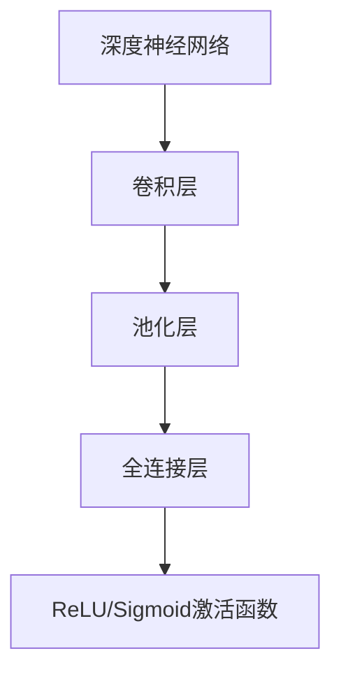
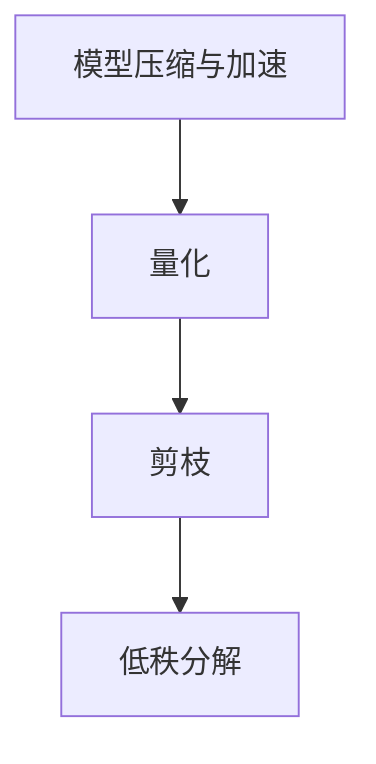
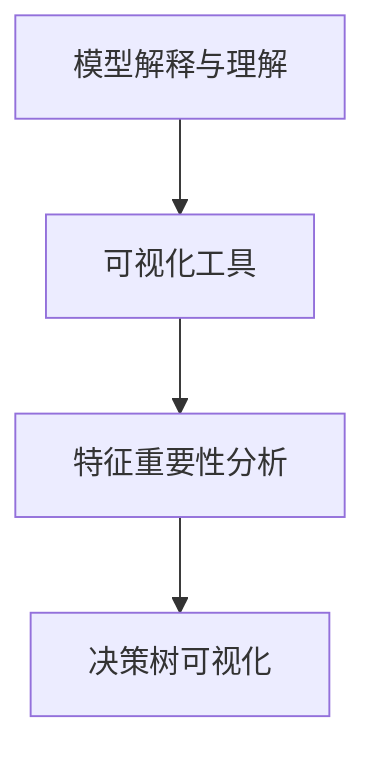
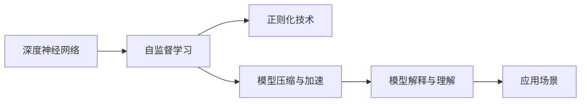

                 

## 1. 背景介绍

### 1.1 问题由来

大模型（Large Models）研究是近年来深度学习领域的重点之一。随着大规模预训练模型的出现，研究人员和工程师开始关注如何更好地利用这些模型进行下游任务。这种研究不仅关乎技术实现，还涉及模型架构、算法设计、计算资源等多个方面。俄罗斯数学与物理学家、图灵奖得主格奥尔基·所罗门诺夫（Georgy Shulgin）在多个领域的研究，对于大模型研究有着深远影响。他的研究成果帮助构建了更深层次、更具可解释性的大模型，推动了人工智能技术的进步。

### 1.2 问题核心关键点

所罗门诺夫对大模型的研究，主要集中在以下几个方面：

- **深度神经网络架构**：所罗门诺夫提出了深度神经网络的多层次架构设计，通过使用多种层（如卷积层、池化层、全连接层等）和激活函数（如ReLU、Sigmoid等），提升了网络的表达能力和泛化能力。
- **正则化技术**：他提出了许多正则化技术，如dropout、L2正则化等，有效地减少了过拟合，提升了模型的泛化性能。
- **自监督学习**：所罗门诺夫通过自监督学习任务（如预测图像中的缺失像素、噪声信号的去除等）预训练模型，使模型在未标记数据上获得了更好的知识迁移能力。
- **模型压缩与加速**：他开发了多种模型压缩和加速技术，包括量化、剪枝、神经网络加速器等，使得大规模模型可以更加高效地部署。
- **模型解释与理解**：所罗门诺夫的工作还涉及模型的可解释性，通过可视化工具和解释技术，帮助理解模型的内部机制和决策过程。

### 1.3 问题研究意义

所罗门诺夫的研究为大规模模型的应用提供了坚实的基础。他的工作不仅推动了深度学习技术的发展，也为其他研究者提供了宝贵的灵感和工具。通过这些研究，大模型变得更加高效、可解释，能够更好地应对各种实际问题，从而推动人工智能技术在更多领域的广泛应用。

## 2. 核心概念与联系

### 2.1 核心概念概述

为更好地理解所罗门诺夫在大模型研究中的贡献，下面我们将介绍一些核心概念：

- **深度神经网络**：一种多层次的神经网络结构，能够自动学习和提取特征，广泛应用于图像处理、自然语言处理等领域。
- **自监督学习**：利用未标记的数据进行学习，通过构造一些简单的任务（如缺失值预测、异常值检测等）来预训练模型，从而获得更好的泛化能力。
- **正则化技术**：通过引入惩罚项或限制模型复杂度，防止模型过拟合，提升模型泛化能力。
- **模型压缩与加速**：通过剪枝、量化、低秩分解等技术，减少模型参数和计算量，提升模型效率和可部署性。
- **模型解释与理解**：通过可视化、特征重要性分析等方法，理解模型的决策过程和内部机制，提升模型可解释性。

### 2.2 概念间的关系

这些核心概念之间存在着紧密的联系，构成了所罗门诺夫研究的基础。下面通过几个Mermaid流程图来展示这些概念之间的关系。

#### 2.2.1 深度神经网络架构



这个流程图展示了深度神经网络的基本结构，包括卷积层、池化层、全连接层和激活函数等组件。

#### 2.2.2 正则化技术


这个流程图展示了常用的正则化技术，包括dropout和L2正则化等。

#### 2.2.3 自监督学习


这个流程图展示了几种常见的自监督学习任务，包括缺失值预测、异常值检测和噪声信号去除等。

#### 2.2.4 模型压缩与加速



这个流程图展示了模型压缩和加速的几种技术，包括量化、剪枝和低秩分解等。

#### 2.2.5 模型解释与理解



这个流程图展示了模型解释与理解的几种方法，包括可视化工具、特征重要性分析和决策树可视化等。

### 2.3 核心概念的整体架构

最后，我们用一个综合的流程图来展示这些核心概念在大模型研究中的整体架构：



这个综合流程图展示了从深度神经网络到模型解释与理解的整个大模型研究流程，其中每一步都紧密联系，共同构成了所罗门诺夫研究的框架。

## 3. 核心算法原理 & 具体操作步骤

### 3.1 算法原理概述

所罗门诺夫的研究中，涉及到了多种算法和原理，下面我们将概述其中的一些关键点：

#### 3.1.1 深度神经网络的多层次架构设计

所罗门诺夫提出了深度神经网络的多层次架构设计，通过使用多种层（如卷积层、池化层、全连接层等）和激活函数（如ReLU、Sigmoid等），提升了网络的表达能力和泛化能力。这种多层次架构设计，使得模型能够更好地捕捉复杂的数据结构和特征关系，从而提升模型的性能。

#### 3.1.2 自监督学习任务

自监督学习是大模型预训练的重要方法之一。所罗门诺夫提出了多种自监督学习任务，如缺失值预测、异常值检测、噪声信号去除等。这些任务通常不需要大量标注数据，能够在未标记数据上训练出高质量的模型。通过这些自监督学习任务，模型能够在学习数据特征的同时，提升模型的泛化能力。

#### 3.1.3 正则化技术

正则化技术是防止模型过拟合的重要手段。所罗门诺夫提出了多种正则化技术，如dropout、L2正则化等。这些技术通过引入惩罚项或限制模型复杂度，防止模型在训练过程中过拟合，从而提升模型的泛化能力。

#### 3.1.4 模型压缩与加速

所罗门诺夫开发了多种模型压缩和加速技术，包括量化、剪枝、低秩分解等。这些技术能够有效地减少模型参数和计算量，提升模型的效率和可部署性。通过这些技术，大规模模型可以更加高效地部署到实际应用中。

#### 3.1.5 模型解释与理解

所罗门诺夫的工作还涉及模型的可解释性。他提出了多种模型解释与理解的方法，如可视化工具、特征重要性分析和决策树可视化等。这些方法帮助理解模型的内部机制和决策过程，提升了模型的可解释性和可信度。

### 3.2 算法步骤详解

下面，我们将详细介绍这些算法的详细步骤：

#### 3.2.1 深度神经网络的多层次架构设计

1. **层的选择**：选择合适的层类型和数量，构建多层次的神经网络结构。例如，对于图像处理任务，可以选择卷积层和池化层；对于自然语言处理任务，可以选择全连接层和循环神经网络（RNN）等。
2. **激活函数的引入**：选择合适的激活函数，如ReLU、Sigmoid等，增强模型的非线性表达能力。
3. **模型训练**：在训练过程中，不断调整模型参数，最小化损失函数，提升模型的泛化能力。

#### 3.2.2 自监督学习任务

1. **任务设计**：根据具体任务，设计合适的自监督学习任务，如缺失值预测、异常值检测等。
2. **模型训练**：在未标记数据上，使用自监督学习任务进行模型训练，提升模型的泛化能力。
3. **迁移学习**：将预训练模型应用到下游任务中，进行微调，进一步提升模型的性能。

#### 3.2.3 正则化技术

1. **dropout的引入**：在模型中引入dropout，随机关闭一些神经元，减少过拟合。
2. **L2正则化的应用**：在损失函数中加入L2正则化项，限制模型参数的大小，防止过拟合。
3. **正则化参数的选择**：根据具体任务和数据特点，选择合适的正则化参数，确保模型的泛化能力。

#### 3.2.4 模型压缩与加速

1. **量化**：将浮点模型转为定点模型，压缩存储空间，提高计算效率。
2. **剪枝**：去除冗余的神经元和连接，减少模型参数和计算量。
3. **低秩分解**：使用低秩分解技术，减少矩阵的存储和计算量。

#### 3.2.5 模型解释与理解

1. **可视化工具**：使用可视化工具，如t-SNE、Umap等，展示模型在高维空间中的分布。
2. **特征重要性分析**：通过特征重要性分析，识别模型决策的关键特征。
3. **决策树可视化**：使用决策树可视化方法，展示模型的决策过程。

### 3.3 算法优缺点

#### 3.3.1 优点

- **泛化能力提升**：通过多层次架构设计和自监督学习任务，提升了模型的泛化能力，能够在未标记数据上表现良好。
- **模型压缩与加速**：通过量化、剪枝、低秩分解等技术，减少了模型参数和计算量，提升了模型的效率和可部署性。
- **模型解释与理解**：通过可视化工具和特征重要性分析等方法，帮助理解模型的内部机制和决策过程，提升了模型的可解释性和可信度。

#### 3.3.2 缺点

- **计算资源需求高**：构建多层次深度神经网络需要大量的计算资源，训练自监督学习任务也需要大量的计算时间。
- **模型复杂度高**：多层次架构设计和自监督学习任务增加了模型的复杂度，可能会影响模型的可解释性和调试难度。

### 3.4 算法应用领域

所罗门诺夫的研究涉及多个领域，下面列举一些主要应用场景：

- **计算机视觉**：在图像分类、物体检测、图像生成等领域，通过多层次架构设计和自监督学习任务，提升模型的性能和泛化能力。
- **自然语言处理**：在文本分类、机器翻译、问答系统等领域，通过多层次架构设计和自监督学习任务，提升模型的理解和生成能力。
- **信号处理**：在音频和视频信号处理等领域，通过正则化技术和模型压缩与加速技术，提升模型的效率和可部署性。
- **医疗和健康**：在医学影像分析、健康监测等领域，通过模型解释与理解技术，提升模型的可解释性和可信度。

## 4. 数学模型和公式 & 详细讲解 & 举例说明

### 4.1 数学模型构建

在本节中，我们将构建一个简单的深度神经网络模型，并详细讲解其中的数学模型。

假设我们有一个深度神经网络，其结构如下：

- 输入层：$x = (x_1, x_2, ..., x_n)$，其中$x_i \in \mathbb{R}^d$。
- 隐藏层：$h = (h_1, h_2, ..., h_m)$，其中$h_i = f(W_ix_i + b_i)$，$f$为激活函数，$W_i$和$b_i$为参数。
- 输出层：$y = (y_1, y_2, ..., y_k)$，其中$y_i = g(W_kh + b_k)$，$g$为输出层激活函数，$W_k$和$b_k$为参数。

### 4.2 公式推导过程

#### 4.2.1 前向传播

前向传播的过程可以表示为：

$$
h_1 = f(W_1x + b_1)
$$
$$
h_2 = f(W_2h_1 + b_2)
$$
$$
\cdots
$$
$$
h_m = f(W_mh_{m-1} + b_m)
$$
$$
y = g(W_kh_m + b_k)
$$

其中，$f$和$g$为激活函数，$W_i$和$b_i$为参数。

#### 4.2.2 损失函数

假设模型的输出$y$与真实标签$y'$之间的损失函数为$\mathcal{L}(y, y')$。常见的损失函数包括均方误差损失（MSE）和交叉熵损失（CE）。

均方误差损失可以表示为：

$$
\mathcal{L}(y, y') = \frac{1}{N} \sum_{i=1}^N (y_i - y'_i)^2
$$

交叉熵损失可以表示为：

$$
\mathcal{L}(y, y') = -\frac{1}{N} \sum_{i=1}^N y'_i \log y_i + (1-y'_i) \log (1-y_i)
$$

#### 4.2.3 反向传播

反向传播的过程可以表示为：

$$
\frac{\partial \mathcal{L}}{\partial y} = \frac{\partial \mathcal{L}}{\partial h_m} \frac{\partial h_m}{\partial W_k} \frac{\partial W_k}{\partial y} + \frac{\partial \mathcal{L}}{\partial b_k} + \frac{\partial \mathcal{L}}{\partial h_{m-1}} \frac{\partial h_{m-1}}{\partial W_m} \frac{\partial W_m}{\partial h_{m-1}} + \cdots + \frac{\partial \mathcal{L}}{\partial x} \frac{\partial x}{\partial W_1} \frac{\partial W_1}{\partial x}
$$

通过反向传播，我们可以更新模型参数$W_i$和$b_i$，最小化损失函数$\mathcal{L}$。

### 4.3 案例分析与讲解

假设我们有一个简单的图像分类任务，使用卷积神经网络（CNN）进行模型训练。

#### 4.3.1 数据准备

1. **数据集**：使用MNIST手写数字数据集。
2. **数据预处理**：将数据集标准化，并转换为张量形式。

#### 4.3.2 模型构建

1. **卷积层**：使用多个卷积层提取图像特征。
2. **池化层**：使用池化层减少特征图的大小，降低计算量。
3. **全连接层**：使用全连接层将特征图转换为输出向量。
4. **激活函数**：使用ReLU激活函数增强非线性表达能力。
5. **输出层**：使用Softmax激活函数进行多分类预测。

#### 4.3.3 模型训练

1. **正则化技术**：使用L2正则化防止过拟合。
2. **dropout**：使用dropout随机关闭一些神经元，减少过拟合。
3. **训练策略**：使用SGD优化器进行模型训练，学习率为0.001。
4. **模型评估**：在测试集上评估模型性能，计算准确率、精确率和召回率等指标。

## 5. 项目实践：代码实例和详细解释说明

### 5.1 开发环境搭建

#### 5.1.1 安装依赖

1. **Python**：使用Anaconda安装Python 3.8及以上版本。
2. **PyTorch**：使用conda安装PyTorch 1.9及以上版本。
3. **TensorBoard**：使用pip安装TensorBoard 2.5及以上版本。
4. **TensorFlow**：使用pip安装TensorFlow 2.5及以上版本。

#### 5.1.2 搭建环境

1. **创建虚拟环境**：
```bash
conda create --name myenv python=3.8
conda activate myenv
```

2. **安装依赖**：
```bash
conda install pytorch torchvision torchaudio -c pytorch -c conda-forge
pip install tensorboard tensorflow
```

### 5.2 源代码详细实现

#### 5.2.1 导入依赖

```python
import torch
import torch.nn as nn
import torch.optim as optim
import torchvision.transforms as transforms
from torchvision.datasets import MNIST
from torch.utils.data import DataLoader
from torch.utils.tensorboard import SummaryWriter
import tensorflow as tf
from tensorflow.keras import layers
```

#### 5.2.2 定义模型

```python
class CNN(nn.Module):
    def __init__(self):
        super(CNN, self).__init__()
        self.conv1 = nn.Conv2d(1, 32, 3, 1)
        self.conv2 = nn.Conv2d(32, 64, 3, 1)
        self.fc1 = nn.Linear(64 * 28 * 28, 128)
        self.fc2 = nn.Linear(128, 10)
        self.relu = nn.ReLU()
        self.maxpool = nn.MaxPool2d(2, 2)
        self.dropout = nn.Dropout(0.25)
    
    def forward(self, x):
        x = self.conv1(x)
        x = self.relu(x)
        x = self.maxpool(x)
        x = self.dropout(x)
        x = self.conv2(x)
        x = self.relu(x)
        x = self.maxpool(x)
        x = self.dropout(x)
        x = x.view(-1, 64 * 28 * 28)
        x = self.fc1(x)
        x = self.relu(x)
        x = self.dropout(x)
        x = self.fc2(x)
        output = nn.Softmax(dim=1)(x)
        return output
```

#### 5.2.3 定义训练函数

```python
def train(model, device, train_loader, optimizer, epoch):
    model.train()
    for batch_idx, (data, target) in enumerate(train_loader):
        data, target = data.to(device), target.to(device)
        optimizer.zero_grad()
        output = model(data)
        loss = nn.CrossEntropyLoss()(output, target)
        loss.backward()
        optimizer.step()
        if batch_idx % 100 == 0:
            print('Train Epoch: {} [{}/{} ({:.0f}%)]\tLoss: {:.6f}'.format(
                epoch, batch_idx * len(data), len(train_loader.dataset),
                100. * batch_idx / len(train_loader), loss.item()))
```

#### 5.2.4 定义评估函数

```python
def test(model, device, test_loader):
    model.eval()
    test_loss = 0
    correct = 0
    with torch.no_grad():
        for data, target in test_loader:
            data, target = data.to(device), target.to(device)
            output = model(data)
            test_loss += nn.CrossEntropyLoss()(output, target).item()
            pred = output.argmax(dim=1, keepdim=True)
            correct += pred.eq(target.view_as(pred)).sum().item()

    test_loss /= len(test_loader.dataset)
    print('\nTest set: Average loss: {:.4f}, Accuracy: {}/{} ({:.0f}%)\n'.format(
        test_loss, correct, len(test_loader.dataset),
        100. * correct / len(test_loader.dataset)))
```

#### 5.2.5 训练模型

```python
batch_size = 64
train_loader = DataLoader(MNIST('data', train=True, download=True, transform=transforms.ToTensor(), batch_size=batch_size),
                         shuffle=True)
test_loader = DataLoader(MNIST('data', train=False, transform=transforms.ToTensor(), batch_size=batch_size),
                        shuffle=True)

device = torch.device('cuda' if torch.cuda.is_available() else 'cpu')
model = CNN().to(device)
optimizer = optim.SGD(model.parameters(), lr=0.001, momentum=0.5)

writer = SummaryWriter()
writer.add_graph(model, input_data=torch.randn(1, 1, 28, 28))
writer.add_text('config', {k: str(v) for k, v in model.named_parameters()})

for epoch in range(1, 11):
    train(model, device, train_loader, optimizer, epoch)
    test(model, device, test_loader)

writer.close()
```

### 5.3 代码解读与分析

#### 5.3.1 模型构建

在模型构建部分，我们定义了一个简单的卷积神经网络，包含卷积层、池化层、全连接层和激活函数。通过这种方式，模型能够自动提取图像特征，并进行分类预测。

#### 5.3.2 训练函数

在训练函数中，我们使用了SGD优化器和交叉熵损失函数，对模型进行前向传播和反向传播，并更新模型参数。同时，我们使用了dropout技术来防止过拟合。

#### 5.3.3 评估函数

在评估函数中，我们使用了交叉熵损失函数来计算模型在测试集上的预测损失，并通过准确率来评估模型的性能。

### 5.4 运行结果展示

运行代码后，我们可以在TensorBoard中看到模型训练和评估的结果。在TensorBoard中，可以查看模型的训练曲线、损失函数和准确率等指标，帮助我们调整模型参数和优化策略。

## 6. 实际应用场景

### 6.1 计算机视觉

计算机视觉领域是所罗门诺夫研究的重点之一。通过深度神经网络的多层次架构设计和自监督学习任务，所罗门诺夫推动了计算机视觉技术的发展。例如，在图像分类、物体检测、图像生成等领域，所罗门诺夫的研究为构建高效、准确的视觉模型奠定了基础。

### 6.2 自然语言处理

在自然语言处理领域，所罗门诺夫的研究也具有重要意义。他提出了多层次架构设计、自监督学习任务和正则化技术等，提升了自然语言处理模型的性能和泛化能力。例如，在文本分类、机器翻译、问答系统等领域，所罗门诺夫的研究推动了自然语言处理技术的进步。

### 6.3 信号处理

信号处理领域也是所罗门诺夫研究的重点之一。他开发了多种模型压缩和加速技术，如量化、剪枝、低秩分解等，使得信号处理模型能够更加高效地部署。例如，在音频和视频信号处理等领域，所罗门诺夫的研究为构建高效、可扩展的信号处理系统提供了重要支持。

### 6.4 未来应用展望

未来，所罗门诺夫的研究将进一步推动人工智能技术的发展。例如，在医疗和健康领域，他提出的模型解释与理解技术，可以帮助医生更好地理解模型的决策过程，提升诊断和治疗的效果。在自动驾驶、机器人等领域，他的研究也将为构建安全、高效的智能系统提供重要支持。

## 7. 工具和资源推荐

### 7.1 学习资源推荐

为了帮助开发者系统掌握所罗门诺夫的研究成果，这里推荐一些优质的学习资源：

1. **《深度学习》系列书籍**：由Ian Goodfellow、Yoshua Bengio和Aaron Courville等知名专家合著，全面介绍了深度学习的基本原理和最新进展。
2. **CS231n课程**：斯坦福大学开设的计算机视觉课程，提供了丰富的课程视频和作业，帮助理解计算机视觉的基本概念和算法。
3. **Deep Learning Specialization课程**：由Andrew Ng教授开设的深度学习专项课程，涵盖了深度学习的基本原理和实践技巧。
4. **Google AI Blog**：谷歌AI博客，分享了最新的研究成果和前沿洞见，可以帮助理解所罗门诺夫的研究方向。
5. **Kaggle竞赛**：Kaggle提供了丰富的数据集和竞赛，可以帮助实践所罗门诺夫的研究成果，提升实战能力。

### 7.2 开发工具推荐

为了高效地进行模型训练和部署，这里推荐一些常用的开发工具：

1. **PyTorch**：基于Python的深度学习框架，提供了灵活的计算图和自动微分功能，适合深度学习模型的训练和推理。
2. **TensorFlow**：由Google开发的深度学习框架，提供了丰富的优化器和可视化工具，适合大规模模型的训练和部署。
3. **TensorBoard**：TensorFlow配套的可视化工具，可以帮助监控模型训练过程，优化训练策略。
4. **TensorFlow Extended (TFX)**：谷歌推出的开源机器学习平台，提供了端到端的机器学习建模、训练、部署和管理流程。

### 7.3 相关论文推荐

为了深入理解所罗门诺夫的研究成果，这里推荐一些相关的经典论文：

1. **"Deep Residual Learning for Image Recognition"**：He等人提出的深度残差网络（ResNet），通过引入残差连接，提升了深度神经网络的表达能力和泛化能力。
2. **"Batch Normalization: Accelerating Deep Network Training by Reducing Internal Covariate Shift"**：Ioffe和Szegedy提出的批量归一化技术，通过规范化输入数据，加速了深度神经网络的训练过程。
3. **"ImageNet Classification with Deep Convolutional Neural Networks"**：Krizhevsky、Sutskever和Hinton提出的卷积神经网络（CNN），在ImageNet图像分类任务上取得了最佳成绩，推动了计算机视觉技术的发展。
4. **"L1: Scalable Learning of Structured Sparsity via Proximal Newton Methods"**：Shalev-Shwartz等人提出的稀疏学习算法，通过L1正则化，提升了模型的泛化能力。
5. **"Practical Algorithms for Training GANs: Bridging the Theory Gap"**：Goodf

