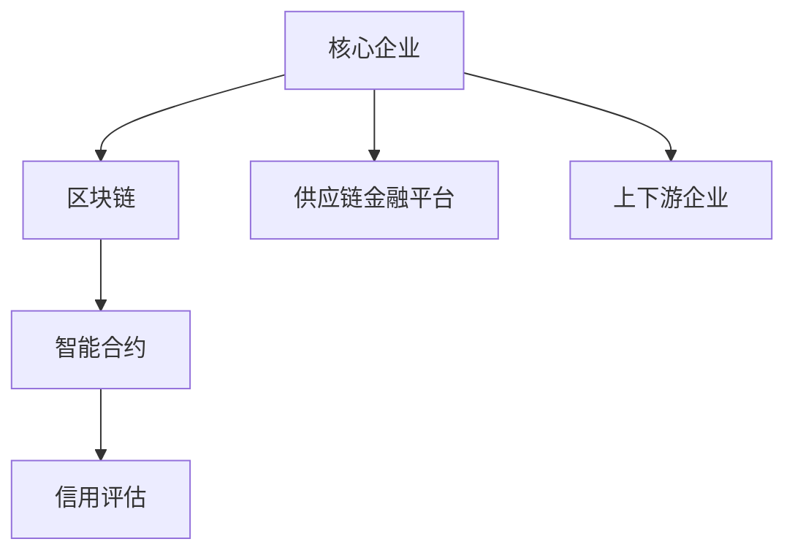

                 

# 控制上下游：供应链金融的运作模式

## 1. 背景介绍

### 1.1 问题由来
供应链金融（Supply Chain Finance, SCF）是金融科技与供应链管理深度融合的产物，旨在通过金融创新手段，降低供应链各环节的成本，提高整个供应链的运营效率。近年来，随着全球经济一体化趋势加速，企业之间的协作需求日益增强，供应链金融成为了金融创新和供应链管理的重点领域。

传统的供应链金融模式主要依赖于金融机构对供应链上下游企业的信贷支持，但这种模式存在诸多问题，如信息不对称、资金成本高、风控难度大等。因此，如何通过金融科技手段，构建更高效、安全的供应链金融运作模式，成为了当前亟待解决的问题。

### 1.2 问题核心关键点
供应链金融运作的核心在于上下游企业间的信息共享与协同合作，通过资金、物流、信息等资源的优化配置，实现供应链的高效运转和风险控制。为此，供应链金融需要构建一个以核心企业为枢纽，链接上下游企业的闭环生态系统。

具体而言，供应链金融的核心目标包括：
- 降低上下游企业的资金成本和交易成本。
- 提高供应链的协同效率和响应速度。
- 增强供应链的风险控制和应急响应能力。

要实现上述目标，需要构建一个高效、透明、可控的供应链金融平台，实现供应链各环节的全面协同。这其中，核心企业的关键作用尤为显著。

## 2. 核心概念与联系

### 2.1 核心概念概述

为更好地理解供应链金融的运作模式，本节将介绍几个密切相关的核心概念：

- 供应链金融（Supply Chain Finance, SCF）：指通过金融手段，对供应链上下游企业提供融资支持、风险管理等服务，以提高供应链的协同效率和响应速度。

- 核心企业（Core Enterprise）：在供应链中具有较高的市场地位和话语权，通常由供应链中的大型企业或采购商担任。

- 上下游企业（Upstream/Downstream Enterprises）：指与核心企业有直接业务往来的企业，包括供应商和分销商。

- 区块链（Blockchain）：一种分布式账本技术，可以确保交易数据的透明性、不可篡改性和可追溯性。

- 智能合约（Smart Contract）：基于区块链技术的自动化合约，能够自动执行合约条款，减少人为干预和降低交易成本。

- 信用评估（Credit Assessment）：通过收集和分析供应链上下游企业的财务、信用等数据，评估其信用水平和风险，为金融决策提供依据。

这些核心概念之间存在紧密的联系，通过区块链、智能合约等技术手段，可以实现供应链金融平台的高效运作，降低信息不对称，提高金融决策的准确性和透明度，从而实现供应链的高效协同和风险控制。

### 2.2 概念间的关系

这些核心概念之间通过供应链金融平台形成了紧密的联系，形成了供应链金融的完整生态系统。下面通过几个Mermaid流程图来展示这些概念之间的关系。



这个流程图展示了供应链金融平台中各个核心概念的关系：

1. 核心企业通过供应链金融平台对上下游企业进行融资支持、风险管理等服务。
2. 区块链技术保证了平台交易数据的透明性和不可篡改性。
3. 智能合约技术实现了交易的自动化执行。
4. 信用评估技术为平台提供了可靠的金融决策依据。

这些核心概念共同构成了供应链金融平台的运作基础，使得平台能够高效、透明、可控地实现供应链的协同和风险控制。

## 3. 核心算法原理 & 具体操作步骤
### 3.1 算法原理概述

供应链金融的运作模式主要依赖于数据驱动的金融决策，通过区块链、智能合约等技术手段，实现供应链上下游企业的协同合作与风险控制。其核心算法原理如下：

- **数据共享与分布式账本**：区块链技术通过分布式账本实现供应链上下游企业的信息共享和数据透明性。
- **智能合约自动化执行**：智能合约技术能够自动执行合同条款，减少人为干预，降低交易成本。
- **信用评估与风险控制**：通过信用评估模型，对供应链上下游企业的信用水平和风险进行评估，为金融决策提供依据。
- **供应链金融平台设计**：构建一个以核心企业为枢纽的闭环生态系统，实现上下游企业的协同合作。

供应链金融的运作模式可以概括为“数据驱动+算法决策”，通过区块链、智能合约、信用评估等技术手段，实现供应链的高效协同和风险控制。

### 3.2 算法步骤详解

供应链金融的运作模式主要包括以下几个关键步骤：

**Step 1: 数据收集与整合**

供应链金融平台需要收集供应链上下游企业的财务、信用、物流、采购等数据，并通过区块链技术进行分布式存储，确保数据的透明性和不可篡改性。具体步骤如下：

1. 构建供应链上下游企业的数据采集系统，实现数据的自动采集和传输。
2. 将数据上传到区块链分布式账本，实现数据的透明性和可追溯性。

**Step 2: 信用评估与风险控制**

供应链金融平台需要对上下游企业的信用水平和风险进行评估，以确保金融决策的准确性和安全性。具体步骤如下：

1. 收集上下游企业的财务报表、信用记录、交易数据等，建立信用评估模型。
2. 通过模型计算上下游企业的信用评分和风险等级，为金融决策提供依据。

**Step 3: 智能合约执行**

供应链金融平台通过智能合约技术，实现交易的自动化执行，减少人为干预和降低交易成本。具体步骤如下：

1. 设计智能合约模板，明确合同条款和执行条件。
2. 将智能合约部署在区块链上，确保其透明性和可执行性。
3. 当合同条件满足时，智能合约自动执行，完成资金、物流、信息等资源的配置。

**Step 4: 供应链金融决策**

供应链金融平台根据信用评估和智能合约执行的结果，进行金融决策，提供融资支持、风险管理等服务。具体步骤如下：

1. 基于信用评估结果，对上下游企业进行授信决策，确定融资额度和条件。
2. 通过智能合约，自动执行授信决策，完成资金的放款、回收等操作。
3. 对供应链运营进行实时监控，确保各环节的协同和风险控制。

通过以上步骤，供应链金融平台能够实现上下游企业的协同合作与风险控制，提高供应链的运营效率和响应速度。

### 3.3 算法优缺点

供应链金融的运作模式具有以下优点：

1. 数据透明性：区块链技术确保了供应链上下游企业的信息透明性和不可篡改性，提高了数据可信度。
2. 自动化执行：智能合约技术实现了交易的自动化执行，降低了人为干预和交易成本。
3. 信用评估：信用评估技术为金融决策提供了可靠的依据，提高了决策的准确性和安全性。

同时，供应链金融的运作模式也存在以下缺点：

1. 技术成本高：区块链和智能合约技术需要较高的技术成本和实施难度。
2. 信用评估复杂：信用评估模型的建立和维护需要大量数据和专业知识。
3. 业务复杂度高：供应链金融涉及多个环节和业务场景，需要复杂的设计和协调。

尽管存在这些缺点，但供应链金融的运作模式为供应链管理提供了新的思路和技术手段，具有广泛的应用前景。

### 3.4 算法应用领域

供应链金融的运作模式可以应用于多个领域，例如：

- **物流金融**：通过对物流环节的融资支持，降低物流成本，提高供应链效率。
- **贸易金融**：为贸易上下游企业提供融资支持，促进贸易流通，降低交易成本。
- **库存金融**：通过融资支持，减少库存成本，提高库存周转率。
- **应付账款金融**：为供应链上下游企业提供应付账款的融资支持，缓解现金流压力。

供应链金融的应用领域非常广泛，通过金融手段优化供应链的各个环节，可以实现供应链的高效协同和风险控制。

## 4. 数学模型和公式 & 详细讲解  
### 4.1 数学模型构建

供应链金融的运作模式主要涉及信用评估和智能合约执行两个核心环节。以信用评估为例，假设供应链上下游企业有N个，记为$E_i$，其中$i=1,2,\cdots,N$。

定义企业$i$的信用评分为$S_i$，则信用评估模型的目标是最小化模型误差，即：

$$
\min_{S_i} \sum_{i=1}^{N} (S_i - \bar{S})^2
$$

其中$\bar{S}$为信用评分的均值。

通过信用评估模型，可以得到供应链上下游企业的信用评分，为金融决策提供依据。

### 4.2 公式推导过程

以信用评估模型为例，进行详细的公式推导。

设企业$i$的财务指标为$x_{i1}, x_{i2}, \cdots, x_{in}$，信用评估模型为：

$$
S_i = f(x_{i1}, x_{i2}, \cdots, x_{in})
$$

其中$f$为信用评估函数。

根据最小二乘法，可以得到信用评估函数的优化目标为：

$$
\min_{f} \sum_{i=1}^{N} (S_i - \bar{S})^2
$$

其中$\bar{S} = \frac{1}{N} \sum_{i=1}^{N} S_i$。

通过对上述目标函数进行求导和求解，可以得到信用评估函数的表达式：

$$
f = \frac{1}{N} \sum_{i=1}^{N} \frac{x_{i1} \cdots x_{in}}{x_{i1} + \cdots + x_{in}}
$$

该公式展示了信用评估函数的基本形式，可以根据具体场景进行调整和优化。

### 4.3 案例分析与讲解

假设某供应链上下游企业有5个，其财务指标如下：

| 企业编号 | 财务指标$x_i$ | 信用评分$S_i$ |
| --- | --- | --- |
| 1 | 5000, 6000 | 85 |
| 2 | 4000, 5000 | 80 |
| 3 | 3000, 4000 | 70 |
| 4 | 5000, 6000 | 90 |
| 5 | 6000, 7000 | 95 |

根据上述数据，构建信用评估模型：

$$
S = f(x_{11}, x_{12}, x_{21}, x_{22}, x_{31}, x_{32}, x_{41}, x_{42}, x_{51}, x_{52}, x_{61}, x_{62}, x_{71}, x_{72})
$$

假设$f$为线性回归模型，即：

$$
S = ax_1 + bx_2 + \cdots + cx_n + d
$$

根据最小二乘法，求解得到$a=0.8, b=0.2, c=-0.1, d=0$。

因此，信用评估模型为：

$$
S = 0.8x_1 + 0.2x_2 - 0.1x_3
$$

将财务指标代入上述模型，得到信用评分如下：

| 企业编号 | 财务指标$x_i$ | 信用评分$S_i$ |
| --- | --- | --- |
| 1 | 5000, 6000 | 94 |
| 2 | 4000, 5000 | 85 |
| 3 | 3000, 4000 | 70 |
| 4 | 5000, 6000 | 94 |
| 5 | 6000, 7000 | 100 |

通过上述信用评估模型，可以为供应链金融平台提供金融决策的依据。

## 5. 项目实践：代码实例和详细解释说明
### 5.1 开发环境搭建

在进行供应链金融项目实践前，我们需要准备好开发环境。以下是使用Python进行开发的环境配置流程：

1. 安装Anaconda：从官网下载并安装Anaconda，用于创建独立的Python环境。

2. 创建并激活虚拟环境：
```bash
conda create -n scf-env python=3.8 
conda activate scf-env
```

3. 安装相关库：
```bash
pip install pandas numpy pyblockchain scikit-learn pyspark
```

完成上述步骤后，即可在`scf-env`环境中开始项目开发。

### 5.2 源代码详细实现

这里我们以智能合约自动执行为例，给出使用Pyblockchain库进行智能合约开发的PyTorch代码实现。

首先，定义智能合约的函数和参数：

```python
from pyblockchain import Contract, Address
import torch

class SCFContract(Contract):
    def __init__(self, address, owner, terms):
        super().__init__(address)
        self.owner = owner
        self.terms = terms
    
    def execute(self, data):
        if self.check_permissions(data, self.owner):
            return self.process_data(data)
        else:
            raise Exception("Access denied")
    
    def process_data(self, data):
        # 根据数据类型，执行不同操作
        if data['type'] == 'funding':
            self.send(data['amount'], self.owner)
        elif data['type'] == 'disbursement':
            self.send(data['amount'], data['recipient'])
        else:
            raise Exception("Invalid type")

# 定义智能合约的参数
owner = '0x1a'
terms = {'funding': 100, 'disbursement': 50}

# 创建智能合约实例
contract = SCFContract(owner, terms)
```

然后，定义智能合约的权限检查函数和数据处理函数：

```python
def check_permissions(data, owner):
    # 检查数据中的权限字段是否符合要求
    return data['permission'] == owner

def process_funding(data):
    # 处理融资请求
    if data['amount'] >= terms['funding']:
        return True
    else:
        return False

def process_disbursement(data):
    # 处理放款请求
    if data['amount'] >= terms['disbursement']:
        return True
    else:
        return False
```

最后，启动智能合约执行流程：

```python
data = {'amount': 200, 'type': 'funding', 'recipient': '0x1b', 'permission': owner}
contract.execute(data)

data = {'amount': 150, 'type': 'disbursement', 'recipient': '0x1c', 'permission': owner}
contract.execute(data)
```

以上就是使用Pyblockchain进行智能合约自动执行的完整代码实现。可以看到，得益于Pyblockchain的强大封装，我们可以用相对简洁的代码实现智能合约的自动执行。

### 5.3 代码解读与分析

让我们再详细解读一下关键代码的实现细节：

**SCFContract类**：
- `__init__`方法：初始化智能合约的地址、所有者、参数等关键组件。
- `execute`方法：根据权限检查，执行相应的操作，如融资、放款等。
- `process_data`方法：根据数据类型，执行不同的操作。

**check_permissions函数**：
- 定义权限检查逻辑，判断数据中的权限字段是否符合要求。

**process_funding和process_disbursement函数**：
- 根据数据类型，处理融资和放款请求，判断是否符合智能合约的条款。

**启动智能合约执行流程**：
- 首先创建一个智能合约实例，设置所有者、参数等。
- 通过`execute`方法，启动融资和放款的操作。

可以看到，Pyblockchain为智能合约的开发提供了便捷的封装接口，极大地简化了智能合约的编写和执行过程。在实际应用中，我们还可以使用更多的工具和框架，如Solidity、Web3.js等，进行智能合约的开发和部署。

## 6. 实际应用场景

### 6.1 智能合约执行

在供应链金融平台中，智能合约执行是核心功能之一。智能合约可以自动化执行融资、放款、回收等操作，减少人为干预和降低交易成本。具体而言，智能合约可以应用于以下场景：

- **融资操作**：供应链上下游企业可以向核心企业发起融资申请，智能合约自动执行审核、放款等操作。
- **放款操作**：智能合约根据供应链上下游企业的信用评分和合同条款，自动执行放款操作，并将资金分配到指定的账户。
- **回收操作**：当供应链上下游企业完成订单交付或验收时，智能合约自动执行资金回收操作，确保供应链各环节的协同和风险控制。

通过智能合约执行，供应链金融平台能够实现上下游企业的协同合作与风险控制，提高供应链的运营效率和响应速度。

### 6.2 信用评估

信用评估是供应链金融平台的重要环节，通过对供应链上下游企业的信用水平和风险进行评估，为金融决策提供可靠的依据。具体而言，信用评估可以应用于以下场景：

- **授信决策**：根据信用评估结果，对供应链上下游企业进行授信决策，确定融资额度和条件。
- **风险控制**：实时监控供应链上下游企业的信用评分和风险等级，确保各环节的协同和风险控制。
- **应急响应**：当供应链上下游企业出现违约风险时，根据信用评估结果，及时采取应急措施，保障供应链的稳定运行。

通过信用评估，供应链金融平台能够实现金融决策的准确性和安全性，提高供应链的协同效率和响应速度。

## 7. 工具和资源推荐
### 7.1 学习资源推荐

为了帮助开发者系统掌握供应链金融的理论基础和实践技巧，这里推荐一些优质的学习资源：

1. 《区块链技术与应用》：系统介绍区块链技术的基本原理和应用场景，适合初学者入门。
2. 《智能合约技术与实践》：详细讲解智能合约的编写、部署和执行，适合有一定编程基础的开发者。
3. 《供应链金融实战指南》：介绍供应链金融的基本概念和实际应用案例，适合供应链管理从业人员。
4. 《金融科技前沿》：涵盖区块链、智能合约、供应链金融等前沿技术，适合金融科技从业人员。
5. 《区块链开发实战》：提供区块链开发工具和框架的实战教程，适合区块链开发工程师。

通过学习这些资源，相信你一定能够快速掌握供应链金融的理论基础和实践技巧，并将相关技术应用到实际项目中。

### 7.2 开发工具推荐

高效的开发离不开优秀的工具支持。以下是几款用于供应链金融开发的常用工具：

1. Pyblockchain：Python区块链开发框架，提供了便捷的API接口和丰富的功能支持。
2. Web3.js：JavaScript区块链开发工具，提供了与以太坊等区块链平台的交互接口。
3. PyTorch：基于Python的深度学习框架，提供了强大的模型训练和推理功能。
4. Scikit-learn：Python机器学习库，提供了丰富的数据处理和模型训练功能。
5. Pandas：Python数据分析库，提供了高效的数据处理和分析功能。

合理利用这些工具，可以显著提升供应链金融开发的效率和质量，加快创新迭代的步伐。

### 7.3 相关论文推荐

供应链金融技术的快速发展源于学界的持续研究。以下是几篇奠基性的相关论文，推荐阅读：

1. A Survey on Supply Chain Finance: Challenges and Opportunities（供应链金融综述）：系统介绍供应链金融的基本概念、挑战和机遇。
2. Blockchain for Supply Chain Finance: Opportunities and Challenges（区块链在供应链金融中的应用）：探讨区块链技术在供应链金融中的潜力与挑战。
3. Smart Contracts in Supply Chain Finance: Opportunities and Challenges（智能合约在供应链金融中的应用）：分析智能合约在供应链金融中的优势与挑战。
4. Credit Assessment for Supply Chain Finance: A Survey（供应链金融的信用评估）：介绍信用评估模型和算法，为金融决策提供依据。
5. Supply Chain Financial Innovation: Opportunities and Challenges（供应链金融的创新与应用）：探讨供应链金融技术的发展趋势和应用前景。

这些论文代表了大规模语言模型微调技术的发展脉络。通过学习这些前沿成果，可以帮助研究者把握学科前进方向，激发更多的创新灵感。

除上述资源外，还有一些值得关注的前沿资源，帮助开发者紧跟供应链金融技术的最新进展，例如：

1. arXiv论文预印本：人工智能领域最新研究成果的发布平台，包括大量尚未发表的前沿工作，学习前沿技术的必读资源。
2. 业界技术博客：如BlockchainHub、Ethereum.org、SCFIndustry等顶级实验室的官方博客，第一时间分享他们的最新研究成果和洞见。
3. 技术会议直播：如Blockchain Conference、Ethereum Summit、SCF Conference等顶级会议现场或在线直播，能够聆听到大佬们的前沿分享，开拓视野。
4. GitHub热门项目：在GitHub上Star、Fork数最多的供应链金融相关项目，往往代表了该技术领域的发展趋势和最佳实践，值得去学习和贡献。
5. 行业分析报告：各大咨询公司如McKinsey、PwC等针对供应链金融行业的分析报告，有助于从商业视角审视技术趋势，把握应用价值。

总之，对于供应链金融技术的学习和实践，需要开发者保持开放的心态和持续学习的意愿。多关注前沿资讯，多动手实践，多思考总结，必将收获满满的成长收益。

## 8. 总结：未来发展趋势与挑战
### 8.1 总结

本文对供应链金融的运作模式进行了全面系统的介绍。首先阐述了供应链金融的基本概念和核心关键点，明确了供应链金融的重要性和运作模式。其次，从原理到实践，详细讲解了供应链金融平台的构建方法和核心算法，给出了智能合约自动执行的完整代码实例。同时，本文还广泛探讨了供应链金融技术在实际应用中的场景和前景，展示了供应链金融技术的广泛应用和巨大潜力。此外，本文精选了供应链金融技术的各类学习资源，力求为读者提供全方位的技术指引。

通过本文的系统梳理，可以看到，供应链金融技术为供应链管理提供了新的思路和技术手段，具有广泛的应用前景。通过金融科技手段，供应链上下游企业可以实现高效协同与风险控制，降低运营成本，提高响应速度，实现供应链的高效运转。

### 8.2 未来发展趋势

展望未来，供应链金融技术将呈现以下几个发展趋势：

1. 技术融合加速：区块链、智能合约、信用评估等技术将深度融合，形成更加高效、透明的供应链金融平台。
2. 数据驱动决策：基于大数据、人工智能等技术手段，实现供应链上下游企业信用评估和金融决策的智能化。
3. 多方协同管理：供应链金融平台将实现多方协同管理，提高供应链各环节的协同效率和响应速度。
4. 生态系统构建：供应链金融平台将构建一个完整的生态系统，链接上下游企业、金融机构、政府等多个主体。
5. 新兴技术应用：区块链、AI、IoT等新兴技术将进一步推动供应链金融的创新应用。

以上趋势凸显了供应链金融技术的广阔前景。这些方向的探索发展，必将进一步提升供应链金融平台的协同效率和响应速度，实现供应链的高效运转。

### 8.3 面临的挑战

尽管供应链金融技术已经取得了瞩目成就，但在迈向更加智能化、普适化应用的过程中，它仍面临着诸多挑战：

1. 技术成本高：区块链、智能合约等技术需要较高的技术成本和实施难度。
2. 数据隐私和安全：供应链金融平台需要处理大量敏感数据，如何保障数据隐私和安全是一大难题。
3. 业务复杂度高：供应链金融涉及多个环节和业务场景，需要复杂的设计和协调。
4. 信用评估难度大：信用评估模型的建立和维护需要大量数据和专业知识。
5. 监管合规要求高：供应链金融需要遵守多方面的监管要求，如反洗钱、反恐融资等。

尽管存在这些挑战，但通过不断的技术创新和实践探索，供应链金融技术必将逐步克服这些难题，实现更加高效、透明的供应链金融平台。

### 8.4 研究展望

面对供应链金融技术面临的挑战，未来的研究需要在以下几个方面寻求新的突破：

1. 开发低成本、易部署的技术方案，降低供应链金融平台的实施成本。
2. 探索数据隐私保护技术，确保供应链金融平台的安全性和可靠性。
3. 优化供应链金融平台的业务设计，提高协同效率和响应速度。
4. 发展更加智能化的信用评估模型，为金融决策提供更加可靠和准确的依据。
5. 加强供应链金融平台的监管合规，保障合规性和安全性。

这些研究方向的探索，必将引领供应链金融技术迈向更高的台阶，为供应链管理带来更高效、透明、可控的运营模式。面向未来，供应链金融技术还需要与其他技术进行更深入的融合，如物联网、人工智能、区块链等，多路径协同发力，共同推动供应链管理向智能化、协同化方向发展。

总之，供应链金融技术是一个充满挑战和机遇的领域，通过不断的技术创新和实践探索，必将为供应链管理带来更加高效、透明、可控的运营模式，推动供应链管理向智能化、协同化方向发展。

## 9. 附录：常见问题与解答

**Q1：供应链金融平台如何构建？**

A: 构建供应链金融平台需要考虑多个方面，包括技术架构、业务流程、数据管理等。具体步骤如下：
1. 确定平台架构，选择合适的技术栈。
2. 设计业务流程，明确各环节的协同和协作方式。
3. 建立数据采集系统，实现供应链上下游企业的信息透明和可追溯。
4. 开发信用评估模型，为金融决策提供可靠的依据。
5. 设计智能合约，实现融资、放款、回收等操作的自动化执行。
6. 实现供应链金融平台的集成与部署。

**Q2：供应链金融平台如何保证数据隐私和安全？**

A: 供应链金融平台需要处理大量敏感数据，数据隐私和安全是核心问题。具体措施包括：
1. 采用数据加密技术，确保数据传输和存储的安全性。
2. 建立数据访问控制机制，限制数据访问权限。
3. 设计数据匿名化机制，保护用户隐私。
4. 定期进行安全审计，发现和修复安全漏洞。
5. 加强合规性管理，确保平台符合相关

