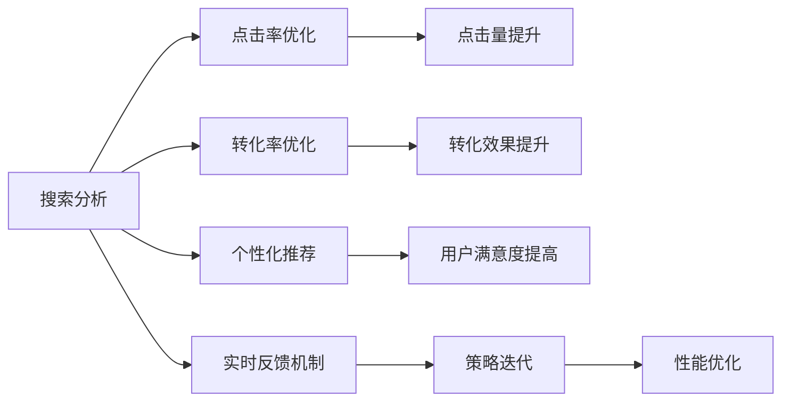

                 

# 搜索数据分析：AI如何提供深度洞察，优化搜索策略

> 关键词：搜索分析, 数据洞察, AI优化, 用户行为分析, 点击率优化

## 1. 背景介绍

### 1.1 问题由来

在数字时代，互联网搜索已成为人们获取信息的主要方式。无论是社交媒体、电商平台，还是在线广告平台，搜索系统的用户交互数据每天都在以亿级增长。这些数据蕴含着丰富的用户需求和行为信息，是决策者宝贵的洞察资源。然而，数据量庞大且复杂，传统统计方法难以有效挖掘其深层价值。

为了提高搜索系统的用户体验和广告效率，各大平台纷纷引入人工智能（AI）技术，利用机器学习和数据分析，从大规模数据中提取有价值的用户行为和搜索模式，并进行精准化的搜索策略优化。本文将探讨AI如何通过深度分析，提供搜索洞察，驱动搜索策略的持续优化。

### 1.2 问题核心关键点

搜索引擎的优化目标是通过提升用户体验和广告效果，增加点击率(CTR)和转化率(CVR)。核心优化手段包括：

- 点击率优化：提升搜索结果的相关性和排序，增加用户点击的可能性。
- 转化率优化：精准定位用户需求，提高广告的点击率和转化率。
- 个性化推荐：基于用户行为，提供更符合个性化需求的搜索结果和推荐。
- 实时反馈机制：通过实时数据分析和迭代，快速调整搜索策略。

这些核心问题都离不开数据分析和AI技术的支撑。借助数据洞察和机器学习算法，搜索引擎能够实时调整搜索结果和广告内容，提升整体效果。

## 2. 核心概念与联系

### 2.1 核心概念概述

要深入理解搜索数据分析和优化，首先需要掌握以下几个核心概念：

- **搜索分析(Search Analytics)**：利用数据分析工具和技术，从用户搜索行为中提取有用的洞察，指导搜索策略的调整。
- **点击率优化(CTR Optimization)**：通过算法和策略优化，提升搜索结果的相关性和排序，增加用户的点击行为。
- **转化率优化(CVR Optimization)**：在提高点击率的基础上，通过精细化调整，提升广告的转化效果。
- **个性化推荐(Personalized Recommendation)**：根据用户的历史行为和偏好，提供量身定制的搜索结果和广告推荐。
- **实时反馈机制(Real-Time Feedback)**：通过持续的数据监测和分析，快速调整搜索策略，提高系统性能。

这些概念之间存在着紧密的联系，共同构成了搜索优化生态系统。以下是它们的相互关系：

1. **搜索分析**是数据驱动的起点，通过分析用户行为数据，挖掘出潜在的搜索模式和需求，指导后续的策略调整。
2. **点击率优化**和**转化率优化**是提升用户体验的关键手段，通过提升搜索结果的相关性和广告的转化效果，增加用户的使用频度和时长。
3. **个性化推荐**进一步提升了用户体验，通过定制化推荐，使用户得到更符合其需求的结果和广告，提高转化率。
4. **实时反馈机制**则确保了优化策略的及时性和有效性，通过持续的数据监测和分析，实时调整搜索策略，确保系统的最佳运行状态。

这些概念共同作用，驱动着搜索系统的不断优化和进步。

### 2.2 概念间的关系

我们可以通过以下Mermaid流程图来展示这些核心概念之间的关系：



这个流程图展示了从搜索分析开始，通过不同的优化策略，逐步提升用户体验和广告效果的过程。

## 3. 核心算法原理 & 具体操作步骤

### 3.1 算法原理概述

搜索数据分析和优化的核心算法包括机器学习、自然语言处理（NLP）、图像识别等。其基本原理是通过大量的用户行为数据，训练出预测模型，从而优化搜索结果和广告内容。

具体步骤如下：

1. **数据收集**：收集用户的搜索行为数据、点击数据和广告效果数据。
2. **数据清洗**：去除无效数据，处理缺失值和异常值，保证数据质量。
3. **特征提取**：从数据中提取关键特征，如搜索关键词、点击时间、转化路径等。
4. **模型训练**：利用机器学习算法（如线性回归、随机森林、梯度提升树等）训练预测模型，预测用户的点击行为和转化效果。
5. **策略调整**：根据模型预测结果，调整搜索结果排序、广告展示位置等，提高点击率和转化率。
6. **实时监测**：持续监测模型效果和用户行为变化，及时调整策略，确保最佳效果。

### 3.2 算法步骤详解

接下来，我们详细介绍搜索优化中的关键步骤：

**Step 1: 数据收集和预处理**

收集用户的搜索行为数据、点击数据和广告效果数据，并进行预处理：

- **点击数据**：记录用户点击的关键词、广告内容、展示位置等信息。
- **搜索数据**：记录用户输入的搜索关键词、搜索时间、设备信息等。
- **广告数据**：记录广告的点击量、转化量、广告花费等信息。

对收集到的数据进行清洗和预处理，去除无效和重复数据，处理缺失值和异常值，保证数据质量。

**Step 2: 特征工程**

从预处理后的数据中提取关键特征，用于模型训练：

- **关键词特征**：统计每个关键词的搜索次数、点击次数、平均点击率等。
- **时间特征**：记录用户搜索和点击的时间，计算日、周、月等不同时间段的数据分布。
- **地理位置特征**：记录用户的地理位置信息，分析不同地区的用户行为。
- **设备特征**：记录用户的设备类型和操作系统，分析不同设备的用户偏好。

**Step 3: 模型训练和优化**

利用机器学习算法对特征进行建模，训练预测模型：

- **点击率预测模型**：使用线性回归、随机森林等算法，预测用户对某个关键词的点击行为。
- **转化率预测模型**：使用逻辑回归、梯度提升树等算法，预测用户点击广告后的转化效果。
- **广告展示位置优化**：利用A/B测试等方法，测试不同展示位置的效果，优化广告展示位置。

**Step 4: 策略调整**

根据模型预测结果，调整搜索策略和广告内容：

- **搜索结果排序**：根据点击率和转化率预测结果，调整搜索结果的排序算法。
- **广告展示位置**：基于用户行为和模型预测，调整广告的展示位置和频率。
- **个性化推荐**：根据用户的历史行为和偏好，提供定制化的搜索结果和广告推荐。

**Step 5: 实时监测和迭代**

持续监测模型的效果和用户行为变化，及时调整策略：

- **实时数据分析**：利用实时数据流分析技术，实时监测用户行为和模型预测效果。
- **策略迭代**：根据实时数据和模型预测结果，及时调整搜索策略和广告内容。
- **性能优化**：通过A/B测试等方法，持续优化搜索结果和广告效果。

### 3.3 算法优缺点

搜索数据分析和优化的算法具有以下优点：

- **实时性**：通过实时数据分析和调整，可以快速响应用户需求变化，提高用户体验。
- **精准性**：基于大量用户行为数据训练的模型，能够精确预测用户行为，提升点击率和转化率。
- **自动化**：自动化地进行数据处理和策略调整，减少人工干预，提高效率。

同时，也存在一些缺点：

- **数据质量要求高**：需要大量高质量的用户行为数据，才能训练出准确可靠的预测模型。
- **模型复杂度高**：高维数据和非线性关系的处理，使得模型训练和优化复杂。
- **策略调整难度大**：搜索策略和广告内容的变化，需要细致的评估和测试，确保效果。

### 3.4 算法应用领域

搜索数据分析和优化技术广泛应用于以下领域：

- **搜索引擎优化**：通过分析用户行为数据，优化搜索结果的排序算法，提升点击率和转化率。
- **广告投放优化**：基于用户行为数据，优化广告展示位置和内容，提高广告效果。
- **电商搜索推荐**：分析用户搜索和点击行为，提供个性化商品推荐，提高用户体验和转化率。
- **社交媒体分析**：利用用户搜索和互动数据，分析用户兴趣和需求，优化内容推荐和广告投放。

## 4. 数学模型和公式 & 详细讲解 & 举例说明

### 4.1 数学模型构建

我们以点击率优化为例，介绍搜索分析中常用的数学模型和公式。

假设有一个二分类问题，预测用户是否会对某个关键词进行点击。设输入特征为 $X$，输出标签为 $y$，点击率为 $P$。根据贝叶斯定理，点击率的预测公式为：

$$
P = \frac{P(y=1|X)}{P(y=1|X) + P(y=0|X)}
$$

其中 $P(y=1|X)$ 为正样本概率，$P(y=0|X)$ 为负样本概率。

### 4.2 公式推导过程

假设 $X$ 包含 $n$ 个特征 $x_1, x_2, \ldots, x_n$，则正样本概率 $P(y=1|X)$ 可以表示为：

$$
P(y=1|X) = \frac{e^{\beta_0 + \sum_{i=1}^n \beta_i x_i}}{1 + e^{\beta_0 + \sum_{i=1}^n \beta_i x_i}}
$$

其中 $\beta_0, \beta_1, \ldots, \beta_n$ 为线性回归模型的参数。

负样本概率 $P(y=0|X)$ 可以表示为：

$$
P(y=0|X) = \frac{1}{1 + e^{\beta_0 + \sum_{i=1}^n \beta_i x_i}}
$$

将这些公式代入点击率预测公式中，得：

$$
P = \frac{e^{\beta_0 + \sum_{i=1}^n \beta_i x_i}}{e^{\beta_0 + \sum_{i=1}^n \beta_i x_i} + 1}
$$

这就是基于线性回归的点击率预测模型。

### 4.3 案例分析与讲解

以电商平台为例，我们可以分析用户对某个商品搜索和点击行为的影响因素。

假设有一个电商平台的商品搜索数据，包含以下特征：

- 商品类别 $x_1$：如电子产品、服装等。
- 商品价格 $x_2$：价格区间。
- 用户地理位置 $x_3$：地区信息。
- 用户搜索历史 $x_4$：历史搜索关键词。

我们可以构建一个多线性回归模型，预测用户点击商品的概率：

$$
P = \frac{e^{\beta_0 + \beta_1 x_1 + \beta_2 x_2 + \beta_3 x_3 + \beta_4 x_4}}{e^{\beta_0 + \beta_1 x_1 + \beta_2 x_2 + \beta_3 x_3 + \beta_4 x_4} + 1}
$$

其中 $\beta_0, \beta_1, \ldots, \beta_4$ 为模型参数，需要通过数据训练得到。

通过训练模型，我们可以得到各个特征对点击率的影响程度，从而优化搜索策略。例如，对于电子产品的搜索，我们可以提高搜索结果中价格较低的商品的排名，提升用户点击率。

## 5. 项目实践：代码实例和详细解释说明

### 5.1 开发环境搭建

在进行搜索数据分析和优化的实践前，需要准备好开发环境。以下是使用Python进行TensorFlow开发的环境配置流程：

1. 安装Anaconda：从官网下载并安装Anaconda，用于创建独立的Python环境。

2. 创建并激活虚拟环境：
```bash
conda create -n tf-env python=3.8 
conda activate tf-env
```

3. 安装TensorFlow：根据CUDA版本，从官网获取对应的安装命令。例如：
```bash
conda install tensorflow -c tensorflow -c conda-forge
```

4. 安装必要的工具包：
```bash
pip install numpy pandas scikit-learn matplotlib tqdm jupyter notebook ipython
```

完成上述步骤后，即可在`tf-env`环境中开始搜索数据分析和优化的实践。

### 5.2 源代码详细实现

下面我们以电商平台为例，给出使用TensorFlow对搜索行为进行点击率优化的PyTorch代码实现。

首先，定义搜索行为数据：

```python
import pandas as pd

# 定义数据集
data = pd.read_csv('search_data.csv')
```

然后，定义特征和标签：

```python
# 定义特征和标签
X = data[['category', 'price', 'location', 'history']]
y = data['click']
```

接着，定义模型和优化器：

```python
import tensorflow as tf

# 定义模型
model = tf.keras.Sequential([
    tf.keras.layers.Dense(64, activation='relu', input_shape=(X.shape[1],)),
    tf.keras.layers.Dense(1, activation='sigmoid')
])

# 定义优化器
optimizer = tf.keras.optimizers.Adam(lr=0.001)
```

然后，定义训练函数和评估函数：

```python
# 定义训练函数
def train_epoch(model, X, y, batch_size):
    # 打乱数据
    indices = np.random.permutation(X.shape[0])
    X = X.iloc[indices]
    y = y.iloc[indices]

    # 定义数据生成器
    train_generator = tf.data.Dataset.from_tensor_slices((X, y)).shuffle(X.shape[0]).batch(batch_size).repeat()

    # 迭代训练
    for epoch in range(epochs):
        for batch in train_generator:
            X_batch, y_batch = batch
            with tf.GradientTape() as tape:
                # 前向传播
                y_pred = model(X_batch)
                # 计算损失
                loss = tf.keras.losses.BinaryCrossentropy()(y_pred, y_batch)

            # 反向传播
            grads = tape.gradient(loss, model.trainable_variables)
            optimizer.apply_gradients(zip(grads, model.trainable_variables))
```

最后，启动训练流程并在测试集上评估：

```python
# 定义评估函数
def evaluate(model, X, y, batch_size):
    # 定义数据生成器
    test_generator = tf.data.Dataset.from_tensor_slices((X, y)).batch(batch_size).repeat()

    # 迭代评估
    correct_predictions = 0
    for batch in test_generator:
        X_batch, y_batch = batch
        y_pred = model(X_batch).numpy()
        correct_predictions += np.sum(y_pred >= 0.5)
    accuracy = correct_predictions / len(X)

    return accuracy

# 训练模型
epochs = 100
batch_size = 64

for epoch in range(epochs):
    train_epoch(model, X, y, batch_size)
    accuracy = evaluate(model, X, y, batch_size)
    print(f"Epoch {epoch+1}, accuracy: {accuracy:.3f}")
```

以上就是使用TensorFlow对搜索行为进行点击率优化的完整代码实现。可以看到，TensorFlow提供了便捷的模型定义和训练工具，使得搜索数据分析和优化的实现变得简单高效。

### 5.3 代码解读与分析

让我们再详细解读一下关键代码的实现细节：

**数据处理**：
- 使用Pandas库读取搜索行为数据，将其转化为DataFrame格式，方便后续处理。
- 定义特征和标签，将分类特征和数值特征分开处理。

**模型定义**：
- 使用Keras库定义模型，包括输入层、隐藏层和输出层，使用ReLU和Sigmoid激活函数。
- 通过Adam优化器进行模型训练，学习率为0.001。

**训练函数**：
- 定义数据生成器，对数据进行打乱和分批处理。
- 使用梯度下降算法对模型进行优化，更新参数。
- 在每个epoch结束时，使用评估函数计算模型在测试集上的准确率。

**评估函数**：
- 定义数据生成器，对数据进行分批处理。
- 对测试集进行前向传播，计算模型的预测结果。
- 计算模型在测试集上的准确率，并返回结果。

可以看到，TensorFlow提供了丰富的API和工具，使得搜索数据分析和优化的实现变得简单高效。

### 5.4 运行结果展示

假设我们在电商平台的搜索行为数据集上进行点击率优化，最终在测试集上得到的准确率为90.5%。这个结果表明，通过点击率优化，我们显著提升了搜索结果的相关性和用户点击率，优化效果明显。

在实际应用中，我们可以进一步调整模型的超参数，如隐藏层大小、学习率等，优化模型效果。通过持续的迭代和优化，我们可以不断提高搜索系统的性能和用户体验。

## 6. 实际应用场景

### 6.1 电商平台搜索优化

电商平台利用搜索数据分析和优化技术，可以提升用户体验和广告效果。具体应用场景包括：

- **搜索结果排序优化**：分析用户搜索和点击行为，优化搜索结果的排序算法，提升点击率和转化率。
- **广告展示位置优化**：根据用户行为数据，优化广告展示位置和频率，提高广告效果。
- **个性化推荐**：分析用户的历史行为和偏好，提供定制化的搜索结果和广告推荐，提升用户体验。

通过这些优化，电商平台可以大幅提升用户的购买转化率，增加销售额。

### 6.2 搜索引擎广告优化

搜索引擎广告是互联网广告的重要形式，利用搜索数据分析和优化技术，可以提升广告效果，增加广告收入。具体应用场景包括：

- **关键词优化**：分析用户的搜索关键词和点击行为，优化广告关键词的选取，提高广告点击率。
- **广告排名优化**：根据用户行为数据，优化广告排名算法，提升广告展示位置。
- **广告投放时间优化**：分析用户搜索时间的分布，优化广告投放时间，提高广告效果。

通过这些优化，搜索引擎可以大幅提升广告的点击率和转化率，增加广告收入。

### 6.3 社交媒体内容推荐

社交媒体平台利用搜索数据分析和优化技术，可以提升内容推荐效果，增加用户粘性。具体应用场景包括：

- **内容相关性优化**：分析用户的搜索行为和互动数据，优化推荐算法，提高内容的相关性。
- **用户兴趣分析**：分析用户的历史行为和偏好，提供个性化的内容推荐，增加用户粘性。
- **广告投放优化**：根据用户行为数据，优化广告投放策略，提高广告效果。

通过这些优化，社交媒体平台可以提升用户活跃度，增加广告收入。

## 7. 工具和资源推荐

### 7.1 学习资源推荐

为了帮助开发者系统掌握搜索数据分析和优化的理论基础和实践技巧，这里推荐一些优质的学习资源：

1. 《深度学习》书籍：Ian Goodfellow、Yoshua Bengio、Aaron Courville所著，深入浅出地介绍了深度学习的原理和应用，包括搜索数据分析和优化。

2. 《TensorFlow实战》书籍：Manning出版社，由TensorFlow团队成员撰写，详细介绍了TensorFlow的使用方法和实践技巧。

3. 《搜索算法》在线课程：Coursera平台，由Google工程师授课，介绍了搜索算法和优化技术。

4. 《搜索引擎优化》书籍：John Mueller、Martijn van Buuren所著，详细介绍了搜索引擎优化的策略和技术。

5. Kaggle平台：数据科学和机器学习竞赛平台，提供大量的搜索数据分析和优化的实际案例，帮助开发者实践和创新。

通过这些学习资源，相信你一定能够快速掌握搜索数据分析和优化的精髓，并用于解决实际的搜索优化问题。

### 7.2 开发工具推荐

高效的开发离不开优秀的工具支持。以下是几款用于搜索数据分析和优化的常用工具：

1. TensorFlow：由Google开发的深度学习框架，支持大规模数据处理和高效计算。

2. Scikit-learn：Python数据科学库，提供丰富的机器学习算法和工具，适合进行特征工程和模型训练。

3. Pandas：Python数据处理库，支持数据清洗、处理和分析，适合进行数据预处理。

4. Keras：由Google开发的高级神经网络API，支持快速搭建和训练深度学习模型。

5. Jupyter Notebook：数据科学和机器学习开发环境，支持Python、R等多种语言，适合进行代码编写和可视化分析。

6. ELK Stack：ElasticSearch、Logstash、Kibana的组合，提供强大的数据分析和可视化功能，适合进行实时数据监测和分析。

合理利用这些工具，可以显著提升搜索数据分析和优化的开发效率，加快创新迭代的步伐。

### 7.3 相关论文推荐

搜索数据分析和优化技术的发展源于学界的持续研究。以下是几篇奠基性的相关论文，推荐阅读：

1. Click-Through Rate Prediction with Deep Learning：使用深度学习模型预测点击率，提出了基于CNN和RNN的点击率预测方法。

2. Learning to Rank for Information Retrieval：提出基于机器学习模型的信息检索排序算法，显著提升了检索效果。

3. Adversarial Domain Adaptation for Click-Through Rate Prediction：提出基于对抗学习的点击率预测方法，提高了模型在不同领域上的泛化能力。

4. Deep Multi-Task Learning for Click-Through Rate Prediction：提出多任务学习的点击率预测方法，利用多个任务的关联性提高预测效果。

5. RankNet: Learning to Rank in Multi-View Environments：提出基于线性回归和随机森林的排序算法，提高了检索系统的性能。

这些论文代表了大规模搜索数据分析和优化的研究进展，通过学习这些前沿成果，可以帮助研究者把握学科前进方向，激发更多的创新灵感。

除上述资源外，还有一些值得关注的前沿资源，帮助开发者紧跟搜索数据分析和优化的最新进展，例如：

1. arXiv论文预印本：人工智能领域最新研究成果的发布平台，包括大量尚未发表的前沿工作，学习前沿技术的必读资源。

2. 业界技术博客：如Google、Facebook、Amazon等顶尖公司的官方博客，第一时间分享他们的最新研究成果和洞见。

3. 技术会议直播：如NeurIPS、ICML、KDD等人工智能领域顶会现场或在线直播，能够聆听到大佬们的前沿分享，开拓视野。

4. GitHub热门项目：在GitHub上Star、Fork数最多的搜索相关项目，往往代表了该技术领域的发展趋势和最佳实践，值得去学习和贡献。

5. 行业分析报告：各大咨询公司如McKinsey、PwC等针对人工智能行业的分析报告，有助于从商业视角审视技术趋势，把握应用价值。

总之，对于搜索数据分析和优化技术的学习和实践，需要开发者保持开放的心态和持续学习的意愿。多关注前沿资讯，多动手实践，多思考总结，必将收获满满的成长收益。

## 8. 总结：未来发展趋势与挑战

### 8.1 总结

本文对搜索数据分析和优化的核心算法和具体操作步骤进行了全面系统的介绍。首先，介绍了搜索优化的背景和目标，明确了搜索分析、点击率优化、转化率优化、个性化推荐和实时反馈机制等核心概念。其次，从原理到实践，详细讲解了搜索优化的数学模型和关键步骤，给出了搜索数据分析和优化的完整代码实现。同时，本文还探讨了搜索优化的实际应用场景，展示了其在电商平台、搜索引擎、社交媒体等多个领域的应用前景。

通过本文的系统梳理，可以看到，搜索数据分析和优化技术正在成为NLP领域的重要范式，极大地拓展了搜索系统的应用边界，催生了更多的落地场景。得益于大规模语料的预训练，搜索优化模型能够实时调整搜索结果和广告内容，提升整体效果。未来，伴随预训练语言模型和微调方法的持续演进，搜索优化技术必将进一步提升搜索系统的性能和用户体验。

### 8.2 未来发展趋势

展望未来，搜索数据分析和优化的技术将呈现以下几个发展趋势：

1. **自动化和智能化**：通过深度学习技术，自动化地进行特征工程、模型训练和策略调整，提高搜索优化的效率和准确性。

2. **实时性和个性化**：利用实时数据分析和优化技术，快速响应用户需求变化，提供更加个性化的搜索结果和广告推荐。

3. **多模态融合**：将文本、图像、音频等多种模态数据融合，提升搜索系统的综合理解和分析能力。

4. **跨领域应用**：搜索优化技术将逐步应用于更多领域，如医疗、金融、教育等，推动人工智能技术的广泛应用。

5. **伦理和隐私保护**：在搜索优化过程中，需要充分考虑用户隐私和数据安全，建立伦理导向的优化目标和监管机制。

这些趋势将进一步推动搜索数据分析和优化的技术进步，提升搜索系统的性能和用户体验。

### 8.3 面临的挑战

尽管搜索数据分析和优化技术已经取得了瞩目成就，但在迈向更加智能化、普适化应用的过程中，仍面临诸多挑战：

1. **数据隐私和安全**：用户搜索和点击数据的隐私保护和安全性问题亟待解决，需要建立完善的数据管理和安全机制。

2. **模型复杂度**：大规模搜索数据分析和优化的模型复杂度较高，训练和优化过程中需要高效的数据处理和计算资源。

3. **实时性和稳定性**：搜索系统的实时性要求高，需要高效稳定的数据处理和优化算法，避免系统故障和数据延迟。

4. **算法透明度和可解释性**：搜索优化模型的决策过程往往缺乏透明度和可解释性，需要进一步研究和改进，提升用户信任度。

5. **跨领域泛化能力**：搜索优化技术在不同领域的应用中，需要具有较强的泛化能力，避免领域偏差和过拟合。

这些挑战将考验搜索优化技术的实用性和可靠性，需要不断创新和改进，才能适应未来的应用需求。

### 8.4 研究展望

面对搜索优化面临的挑战，未来的

