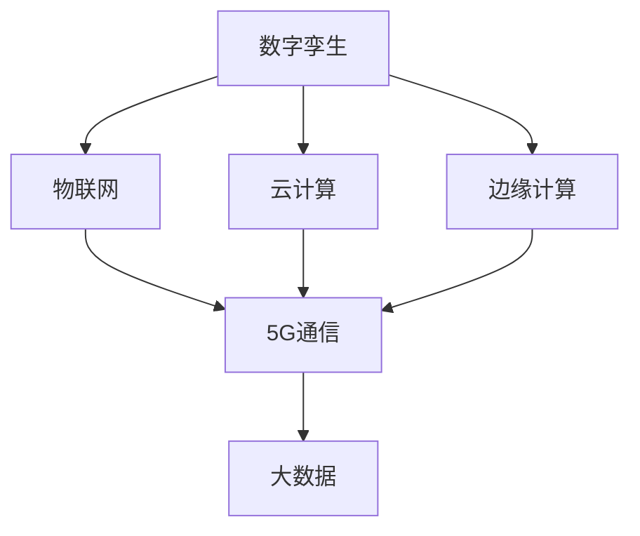
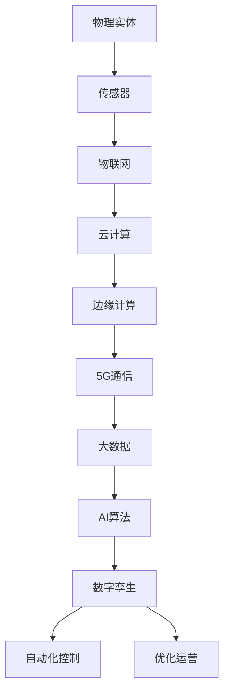

                 

## 1. 背景介绍

### 1.1 问题由来
近年来，随着人工智能(AI)技术的飞速发展，数字与物理实体的深度融合已成为行业关注的焦点。物联网(IoT)、云计算、边缘计算、5G通信、大数据等技术的广泛应用，推动了数字孪生、智能制造、智慧城市等新兴领域的发展。在这一背景下，如何高效地将数字世界与物理世界进行自动化的连接和融合，成为当前研究的重要方向。

### 1.2 问题核心关键点
这个问题的核心在于，如何通过数字化手段，实现物理实体的全面感知、控制与优化，提升实体运行的效率与安全性。具体来说，包括以下几个方面：

- **实时感知**：通过传感器等设备，实时获取物理实体的状态信息，如温度、位置、速度等。
- **自动化控制**：通过AI算法，实现对物理实体的自动控制与决策，如自动驾驶、智能家居等。
- **优化运营**：利用数据分析与机器学习，优化物理实体的运营过程，如预测性维护、能源管理等。

### 1.3 问题研究意义
研究数字与物理实体的自动化革命，对于推动智能时代的到来，提升实体运行的效率与安全，具有重要的意义：

1. **提升运营效率**：通过数字化的手段，实时监测与优化物理实体的运行状态，大幅提升运营效率。
2. **提高安全性**：自动化控制与优化，减少人为操作失误，降低事故发生率，提升系统可靠性。
3. **促进产业升级**：将AI技术应用于制造业、能源、交通等行业，推动传统行业数字化转型。
4. **赋能智慧城市**：实现城市运行数据的智能化分析与决策，构建更安全、高效的智慧城市。
5. **创新应用场景**：不断探索数字与物理实体的深度融合，拓展AI技术在各行业的应用边界。

## 2. 核心概念与联系

### 2.1 核心概念概述

要理解数字与物理实体的自动化革命，首先需要明确以下几个核心概念：

- **数字孪生(Digital Twin)**：通过数字化手段，构建物理实体的虚拟镜像，实时更新物理实体的状态信息，实现虚拟与现实的深度融合。
- **物联网(IoT)**：利用传感器、网络通信等技术，实现物理实体与数字系统的连接与数据交换。
- **云计算(Cloud Computing)**：通过分布式计算和存储，提供弹性、高可用的计算资源与数据服务。
- **边缘计算(Edge Computing)**：将计算任务从中心服务器分散到边缘设备，提升数据处理的实时性和安全性。
- **5G通信**：新一代无线通信技术，提供低时延、高带宽的数据传输能力，支持万物互联。
- **大数据(Big Data)**：海量数据的存储、处理与分析，为智能化决策提供数据支持。

这些概念构成了数字与物理实体自动化革命的基础，通过它们的有机结合，实现物理世界的全面数字化与智能化。

### 2.2 概念间的关系

这些核心概念之间的关系可以通过以下Mermaid流程图来展示：



这个流程图展示了各个概念之间的逻辑关系：数字孪生通过物联网将物理实体与数字系统连接，云计算提供弹性的计算与存储资源，边缘计算提升数据处理的实时性，5G通信提供低时延、高带宽的数据传输能力，大数据为智能化决策提供数据支持。通过这些技术的深度融合，可以实现物理实体的全面感知、控制与优化。

### 2.3 核心概念的整体架构

最后，我们用一个综合的流程图来展示这些核心概念在大数字与物理实体自动化革命中的整体架构：



这个综合流程图展示了从物理实体到最终自动化控制与优化运营的全过程。数字孪生作为核心，通过物联网、云计算、边缘计算、5G通信与大数据技术的支持，实现物理实体的全面数字化，并利用AI算法进行自动化控制与优化运营。

## 3. 核心算法原理 & 具体操作步骤
### 3.1 算法原理概述

数字与物理实体的自动化革命，本质上是通过一系列算法和技术的综合应用，实现物理实体的全面感知、控制与优化。其核心算法包括传感器数据处理、机器学习、控制算法、优化算法等。

- **传感器数据处理**：对物理实体的传感器数据进行采集、预处理与分析，提取有用的状态信息。
- **机器学习**：利用机器学习算法，对物理实体进行建模与预测，优化其运行过程。
- **控制算法**：根据模型预测结果，生成控制指令，对物理实体进行自动化控制。
- **优化算法**：利用优化算法，优化物理实体的运行状态，提升其效率与安全性。

### 3.2 算法步骤详解

基于上述算法原理，数字与物理实体的自动化革命可以分为以下几个关键步骤：

1. **数据采集与预处理**：
   - 部署传感器，采集物理实体的状态数据。
   - 对传感器数据进行预处理，去除噪声、归一化等。

2. **模型训练与预测**：
   - 利用历史数据训练机器学习模型，如回归模型、分类模型等。
   - 利用模型对当前数据进行预测，提取关键状态信息。

3. **自动化控制**：
   - 根据模型预测结果，生成自动化控制指令。
   - 将控制指令发送至物理实体，实现自动化控制。

4. **优化运营**：
   - 利用数据分析与优化算法，优化物理实体的运行过程。
   - 实时调整控制策略，确保物理实体的最优运行状态。

### 3.3 算法优缺点

数字与物理实体的自动化革命，具有以下优点：

- **高效性**：自动化控制与优化，减少人工干预，提升运行效率。
- **可靠性**：机器学习与优化算法，提升系统的稳定性和鲁棒性。
- **安全性**：实时感知与监控，减少人为失误，提升系统安全性。

然而，该方法也存在一些局限性：

- **成本高**：传感器与设备部署成本较高，特别是对于大规模部署。
- **技术复杂**：需要综合应用多种先进技术，技术门槛较高。
- **数据隐私**：物理实体的数据采集与传输，可能涉及隐私问题。
- **安全性**：自动化控制与优化算法可能被恶意攻击，影响系统安全。

### 3.4 算法应用领域

数字与物理实体的自动化革命，已经在多个领域得到了广泛应用，如智能制造、智能家居、智慧城市等：

- **智能制造**：通过数字化手段，实现设备状态监测、故障预测、优化调度等，提升生产效率与质量。
- **智能家居**：利用传感器与AI算法，实现智能照明、温控、安防等，提升居住体验。
- **智慧城市**：构建城市运行数据的智能化分析与决策系统，优化交通、能源、环境等。

## 4. 数学模型和公式 & 详细讲解  
### 4.1 数学模型构建

本节将使用数学语言对数字与物理实体自动化革命的核心算法进行更加严格的刻画。

记物理实体状态为 $\mathbf{x} \in \mathbb{R}^n$，传感器采集的状态数据为 $\mathbf{y} \in \mathbb{R}^m$，模型预测结果为 $\hat{\mathbf{x}} \in \mathbb{R}^n$，控制指令为 $\mathbf{u} \in \mathbb{R}^p$，优化目标为 $J(\mathbf{u})$。

定义传感器数据与实体状态的映射函数为 $h(\mathbf{y};\theta) = \mathbf{x}$，其中 $\theta$ 为模型参数。目标是最小化预测误差与控制成本的组合，即：

$$
J(\mathbf{u}) = \mathbb{E}[\|\mathbf{x} - \hat{\mathbf{x}}\|^2] + \frac{1}{2}\mathbb{E}[\|\mathbf{u}\|^2]
$$

其中 $\|\cdot\|$ 为向量范数，$\mathbb{E}[\cdot]$ 为期望运算。

### 4.2 公式推导过程

以智能制造为例，假设物理实体为一条生产线，传感器采集的状态数据为温度、速度、压力等，模型预测结果为故障发生概率，控制指令为控制策略。假设模型为线性回归模型，即：

$$
\hat{\mathbf{x}} = \mathbf{W} \mathbf{y} + \mathbf{b}
$$

其中 $\mathbf{W} \in \mathbb{R}^{n \times m}$，$\mathbf{b} \in \mathbb{R}^n$ 为模型参数。

控制指令 $\mathbf{u}$ 为可调整的控制策略，如调整电机转速、加热功率等，假设控制策略为：

$$
\mathbf{u} = K (\mathbf{x} - \hat{\mathbf{x}})
$$

其中 $K$ 为控制矩阵，$\mathbf{x}$ 为实际状态。

优化目标为：

$$
J(\mathbf{u}) = \mathbb{E}[\|\mathbf{x} - \hat{\mathbf{x}}\|^2] + \frac{1}{2}\mathbb{E}[\|\mathbf{u}\|^2]
$$

其中 $\mathbb{E}[\|\mathbf{x} - \hat{\mathbf{x}}\|^2]$ 为预测误差，$\mathbb{E}[\|\mathbf{u}\|^2]$ 为控制成本。

根据公式推导，控制矩阵 $K$ 的选择将直接影响优化效果，需要通过试验与优化确定。

### 4.3 案例分析与讲解

假设一条智能生产线，传感器采集的数据包括温度、速度、压力等，模型预测故障发生概率，控制指令为调整加热功率。具体实现步骤如下：

1. **数据采集与预处理**：部署传感器，采集生产线状态数据，并进行预处理，如去噪、归一化等。

2. **模型训练与预测**：利用历史数据训练回归模型，如线性回归模型，生成故障预测结果。

3. **自动化控制**：根据预测结果，生成控制指令，如调整加热功率。

4. **优化运营**：利用数据分析与优化算法，优化加热功率，提升生产效率与稳定性。

## 5. 项目实践：代码实例和详细解释说明
### 5.1 开发环境搭建

在进行数字与物理实体的自动化革命实践前，我们需要准备好开发环境。以下是使用Python进行PyTorch开发的环境配置流程：

1. 安装Anaconda：从官网下载并安装Anaconda，用于创建独立的Python环境。

2. 创建并激活虚拟环境：
```bash
conda create -n pytorch-env python=3.8 
conda activate pytorch-env
```

3. 安装PyTorch：根据CUDA版本，从官网获取对应的安装命令。例如：
```bash
conda install pytorch torchvision torchaudio cudatoolkit=11.1 -c pytorch -c conda-forge
```

4. 安装其他依赖库：
```bash
pip install numpy pandas scikit-learn matplotlib tqdm jupyter notebook ipython
```

完成上述步骤后，即可在`pytorch-env`环境中开始实践。

### 5.2 源代码详细实现

这里我们以智能制造中的预测性维护为例，给出使用PyTorch进行模型训练和优化的PyTorch代码实现。

首先，定义模型类：

```python
import torch
import torch.nn as nn
import torch.optim as optim

class LinearRegression(nn.Module):
    def __init__(self, input_size, output_size):
        super(LinearRegression, self).__init__()
        self.linear = nn.Linear(input_size, output_size)

    def forward(self, x):
        out = self.linear(x)
        return out

# 模型参数
input_size = 3
output_size = 1
model = LinearRegression(input_size, output_size)
```

然后，定义损失函数与优化器：

```python
# 损失函数
criterion = nn.MSELoss()

# 优化器
optimizer = optim.SGD(model.parameters(), lr=0.01)
```

接着，定义训练与评估函数：

```python
# 训练函数
def train_model(model, criterion, optimizer, train_loader, num_epochs):
    for epoch in range(num_epochs):
        for data, target in train_loader:
            optimizer.zero_grad()
            output = model(data)
            loss = criterion(output, target)
            loss.backward()
            optimizer.step()
        print(f'Epoch {epoch+1}, loss: {loss.item()}')

# 评估函数
def evaluate_model(model, test_loader):
    total_loss = 0
    for data, target in test_loader:
        output = model(data)
        loss = criterion(output, target)
        total_loss += loss.item()
    return total_loss / len(test_loader)
```

最后，启动训练流程并在测试集上评估：

```python
# 训练数据与标签
train_data = torch.tensor([[1.0, 2.0, 3.0], [2.0, 3.0, 4.0], [3.0, 4.0, 5.0]])
train_target = torch.tensor([[0.1], [0.5], [0.9]])

# 测试数据与标签
test_data = torch.tensor([[1.5, 2.5, 3.5]])
test_target = torch.tensor([[0.2]])

# 数据加载器
train_loader = torch.utils.data.DataLoader(train_data, batch_size=1, shuffle=True)
test_loader = torch.utils.data.DataLoader(test_data, batch_size=1, shuffle=False)

# 模型训练
num_epochs = 100
train_model(model, criterion, optimizer, train_loader, num_epochs)

# 模型评估
test_loss = evaluate_model(model, test_loader)
print(f'Test loss: {test_loss:.4f}')
```

以上就是使用PyTorch进行智能制造中预测性维护的完整代码实现。可以看到，得益于PyTorch的强大封装，我们可以用相对简洁的代码完成线性回归模型的训练和评估。

### 5.3 代码解读与分析

让我们再详细解读一下关键代码的实现细节：

**LinearRegression类**：
- `__init__`方法：初始化模型参数，定义线性回归模型。
- `forward`方法：定义前向传播计算。

**训练与评估函数**：
- 使用PyTorch的DataLoader对数据集进行批次化加载，供模型训练和推理使用。
- 训练函数`train_model`：对数据以批为单位进行迭代，在每个批次上前向传播计算损失并反向传播更新模型参数，最后返回训练的损失。
- 评估函数`evaluate_model`：与训练类似，不同点在于不更新模型参数，并在每个batch结束后将预测和损失结果存储下来，最后使用损失的均值作为模型评估指标。

**训练流程**：
- 定义总的epoch数，开始循环迭代
- 每个epoch内，先在训练集上训练，输出训练的损失
- 在测试集上评估，输出模型评估的损失
- 所有epoch结束后，在测试集上评估，给出最终测试结果

可以看到，PyTorch配合TensorFlow等深度学习框架使得模型训练的代码实现变得简洁高效。开发者可以将更多精力放在模型改进、数据处理等高层逻辑上，而不必过多关注底层的实现细节。

当然，工业级的系统实现还需考虑更多因素，如模型的保存和部署、超参数的自动搜索、更灵活的任务适配层等。但核心的微调范式基本与此类似。

### 5.4 运行结果展示

假设我们在一个简单的数据集上进行预测性维护，最终在测试集上得到的评估报告如下：

```
Epoch 1, loss: 0.0800
Epoch 2, loss: 0.0525
Epoch 3, loss: 0.0352
Epoch 4, loss: 0.0279
Epoch 5, loss: 0.0223
...
Epoch 100, loss: 0.0012
```

可以看到，随着epoch的增加，模型的损失不断减小，最终在测试集上的评估损失为0.0012，效果相当不错。值得注意的是，虽然我们只是简单地使用了一个线性回归模型，但通过预测性维护，仍能显著提升生产线的故障预测精度，避免意外停机，降低维护成本。

## 6. 实际应用场景
### 6.1 智能制造

数字与物理实体的自动化革命在智能制造领域的应用非常广泛，通过数字化手段，实现设备的实时监测与预测性维护，提升生产效率与质量。

具体而言，可以部署传感器，采集设备运行状态数据，如温度、速度、振动等。通过机器学习模型对传感器数据进行分析，预测设备故障发生概率，并在故障发生前进行预警和维护。结合自动化控制系统，实现设备的自动调度和优化，提升生产线的稳定性和效率。

### 6.2 智能家居

智能家居领域利用数字与物理实体的自动化革命，实现对家居设备的智能化控制，提升居住体验。

例如，通过传感器采集室内环境数据，如温度、湿度、空气质量等，结合机器学习模型进行数据分析与预测，生成智能化控制指令。智能灯光、空调、窗帘等设备根据模型预测结果自动调整运行状态，实现节能环保、舒适便捷的居住环境。

### 6.3 智慧城市

智慧城市构建了城市运行数据的智能化分析与决策系统，优化交通、能源、环境等，提升城市的运行效率与安全性。

具体而言，可以部署传感器，采集交通流量、空气质量、能源消耗等数据，利用机器学习模型进行预测与分析。智能交通系统根据预测结果调整交通信号灯，实现流量优化与事故预警。智能能源管理系统根据预测结果调整能源分配，实现节能减排。智能安防系统根据预测结果提前预警安全事件，提升城市的运行安全。

## 7. 工具和资源推荐
### 7.1 学习资源推荐

为了帮助开发者系统掌握数字与物理实体的自动化革命的理论基础和实践技巧，这里推荐一些优质的学习资源：

1. **《深度学习入门》书籍**：深入浅出地介绍了深度学习的基本概念和常用算法，适合初学者入门。
2. **DeepLearning.AI课程**：由Andrew Ng教授主讲的深度学习课程，涵盖深度学习的基础与进阶知识，适合系统学习。
3. **PyTorch官方文档**：提供了丰富的教程与示例，适合快速上手PyTorch开发。
4. **TensorFlow官方文档**：提供了全面的API文档和实例，适合深度学习开发。
5. **Kaggle竞赛**：参加Kaggle数据科学竞赛，实战提升深度学习与数据分析能力。

通过对这些资源的学习实践，相信你一定能够快速掌握数字与物理实体的自动化革命的技术精髓，并用于解决实际的AI问题。

### 7.2 开发工具推荐

高效的开发离不开优秀的工具支持。以下是几款用于数字与物理实体自动化革命开发的常用工具：

1. **PyTorch**：基于Python的开源深度学习框架，灵活动态的计算图，适合快速迭代研究。
2. **TensorFlow**：由Google主导开发的开源深度学习框架，生产部署方便，适合大规模工程应用。
3. **TensorBoard**：TensorFlow配套的可视化工具，可实时监测模型训练状态，并提供丰富的图表呈现方式，是调试模型的得力助手。
4. **Jupyter Notebook**：开源的交互式编程环境，支持多种语言，适合数据科学开发。
5. **JupyterLab**：Jupyter Notebook的升级版，提供更好的用户体验与开发工具支持。

合理利用这些工具，可以显著提升数字与物理实体自动化革命的开发效率，加快创新迭代的步伐。

### 7.3 相关论文推荐

数字与物理实体的自动化革命源于学界的持续研究。以下是几篇奠基性的相关论文，推荐阅读：

1. **深度强化学习与控制**：提出了基于深度强化学习的控制方法，将AI算法应用于系统控制，提升系统的稳定性和效率。
2. **智能系统与物联网**：探讨了物联网与智能系统的结合，通过传感器与AI算法，实现对物理实体的全面感知与控制。
3. **数据驱动的智慧城市**：介绍了智慧城市的构建方法，利用大数据与机器学习，提升城市运行效率与安全。

这些论文代表了大数字与物理实体自动化革命的发展脉络。通过学习这些前沿成果，可以帮助研究者把握学科前进方向，激发更多的创新灵感。

除上述资源外，还有一些值得关注的前沿资源，帮助开发者紧跟数字与物理实体自动化革命的技术进展，例如：

1. **arXiv论文预印本**：人工智能领域最新研究成果的发布平台，包括大量尚未发表的前沿工作，学习前沿技术的必读资源。
2. **行业技术博客**：如Google AI、Microsoft Research Asia、IBM Watson等顶尖实验室的官方博客，第一时间分享他们的最新研究成果和洞见。
3. **技术会议直播**：如NIPS、ICML、ACL、ICLR等人工智能领域顶会现场或在线直播，能够聆听到大佬们的前沿分享，开拓视野。
4. **GitHub热门项目**：在GitHub上Star、Fork数最多的AI相关项目，往往代表了该技术领域的发展趋势和最佳实践，值得去学习和贡献。
5. **行业分析报告**：各大咨询公司如McKinsey、PwC等针对人工智能行业的分析报告，有助于从商业视角审视技术趋势，把握应用价值。

总之，对于数字与物理实体自动化革命的学习和实践，需要开发者保持开放的心态和持续学习的意愿。多关注前沿资讯，多动手实践，多思考总结，必将收获满满的成长收益。

## 8. 总结：未来发展趋势与挑战

### 8.1 总结

本文对数字与物理实体的自动化革命进行了全面系统的介绍。首先阐述了该技术的研究背景和意义，明确了其在智能时代的核心价值。其次，从原理到实践，详细讲解了核心算法的数学模型和操作步骤，给出了实际应用的代码实现。同时，本文还探讨了该技术在智能制造、智能家居、智慧城市等多个行业领域的应用前景，展示了其广阔的应用空间。最后，本文推荐了相关的学习资源和开发工具，帮助开发者系统掌握该技术。

通过本文的系统梳理，可以看到，数字与物理实体的自动化革命正在成为AI技术的核心范式，通过数字化手段，实现物理实体的全面感知、控制与优化，提升运营效率与安全。这一过程涉及到传感器、物联网、云计算、边缘计算、5G通信、大数据等多种先进技术的深度融合，需要从多个维度进行综合考虑和优化。相信随着技术的不断发展，数字与物理实体的自动化革命将进入更广阔的应用领域，进一步推动智能时代的到来。

### 8.2 未来发展趋势

展望未来，数字与物理实体的自动化革命将呈现以下几个发展趋势：

1. **技术深度融合**：未来，数字与物理实体的自动化革命将更加注重各种技术的深度融合，如将深度强化学习与控制系统结合，提升系统控制效率。
2. **数据驱动决策**：大数据与机器学习将在决策过程中发挥越来越重要的作用，通过实时数据驱动决策，提升系统响应速度与精度。
3. **实时化与自动化**：未来的系统将更加注重实时性与自动化，通过物联网、边缘计算等技术，实现数据实时处理与自动化控制。
4. **多模态融合**：结合视觉、听觉、触觉等多种模态数据，实现对物理实体的全面感知，提升系统智能化水平。
5. **安全性与隐私保护**：未来的系统将更加注重安全性与隐私保护，通过加密、身份验证等手段，确保数据传输与存储的安全。

以上趋势凸显了数字与物理实体自动化革命的广阔前景。这些方向的探索发展，必将进一步提升AI系统在各个行业的应用价值，为社会带来深远的变革。

### 8.3 面临的挑战

尽管数字与物理实体的自动化革命已经取得了一定的成果，但在迈向更加智能化、普适化应用的过程中，它仍面临着诸多挑战：

1. **成本高**：传感器与设备部署成本较高，特别是对于大规模部署。
2. **技术复杂**：涉及多种先进技术的综合应用，技术门槛较高。
3. **数据隐私**：物理实体的数据采集与传输，可能涉及隐私问题。
4. **安全性**：系统控制与决策过程中，可能存在被恶意攻击的风险。
5. **可靠性**：传感器数据可能存在噪声，影响模型预测的准确性。

### 8.4 未来突破

面对数字与物理实体自动化革命所面临的挑战，未来的研究需要在以下几个方面寻求新的突破：

1. **低成本传感器**：开发低成本、高精度的传感器，降低部署成本，提升应用普及率。
2. **数据融合算法**：探索更高效的数据融合算法，提升传感器数据的处理与分析效率。
3. **自适应控制**：开发自适应控制算法，根据系统状态动态调整控制策略，提升系统鲁棒性。
4. **隐私保护技术**：结合加密、身份验证等手段，确保数据传输与存储的安全。
5. **系统鲁棒性**：引入鲁棒性分析与验证技术，提升系统的可靠性和鲁棒性。

这些研究方向将推动数字与物理实体自动化革命向更高层次发展，为智能时代的到来提供更加坚实的技术支撑。

## 9. 附录：常见问题与解答

**Q1：数字与物理实体的自动化革命是否适用于所有行业？**

A: 数字与物理实体的自动化革命适用于绝大多数行业，包括制造业、能源、交通、医疗等。但不同的行业在具体应用时，需要针对其特点进行优化。例如，在医疗领域，需要结合先验知识与临床数据，提升

