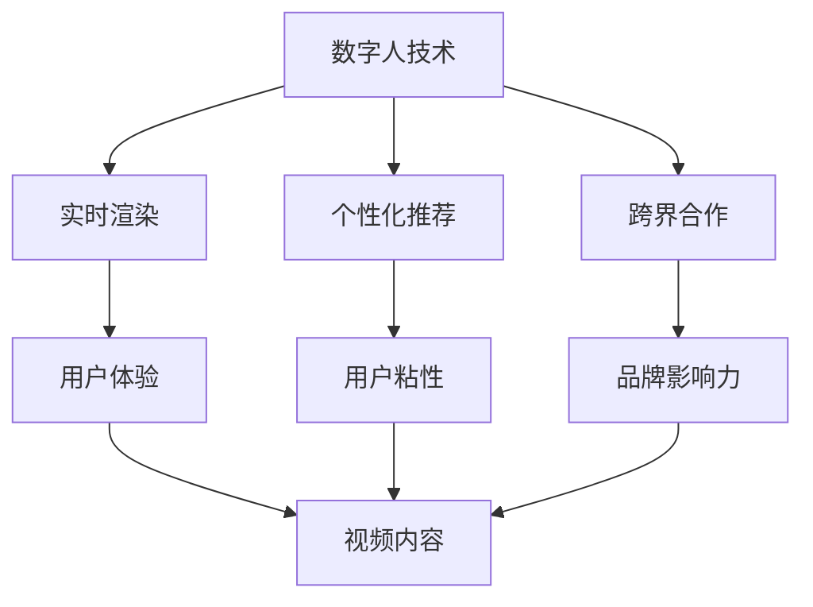
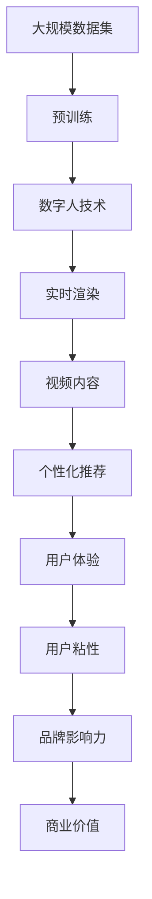

                 

# 数字人技术在短视频中的应用

## 1. 背景介绍

### 1.1 问题由来

随着数字技术的飞速发展，数字人技术逐渐成为娱乐和营销领域的新宠。相较于传统的人类主播，数字人因其24小时无间断直播、强大的实时渲染能力、个性化定制化等特性，在短视频平台和直播平台上迅速崛起。数字人技术在娱乐、广告、教育、医疗等多个领域都有广泛的应用，展示了强大的生命力和潜力。

在短视频平台上，数字人凭借其高互动性、个性化推荐和独特的人机互动模式，成为吸引用户注意力、提升内容消费的重要力量。数字人技术与短视频平台的高效结合，极大地丰富了短视频的呈现形式，赋予了平台内容更高的用户粘性和商业价值。

### 1.2 问题核心关键点

数字人技术在短视频中的应用，核心在于其强大的渲染能力和个性化推荐系统。通过高性能的计算模型、精细的纹理和动作捕捉技术，数字人能够生成逼真的实时动态，与用户进行高度互动。结合短视频平台的个性化推荐算法，能够精准推送用户感兴趣的内容，提升用户体验和平台价值。

具体而言，数字人技术在短视频平台的应用主要包括以下几个方面：

1. **实时渲染与互动**：数字人能够实时生成高逼真度的视频内容，通过动态面部表情、身体姿态和语调的变化，与用户进行真实自然地互动，极大地提升了用户体验。
2. **个性化推荐**：通过分析用户行为数据和兴趣偏好，平台可以精准推送数字人内容，优化用户内容消费体验，提升用户留存率。
3. **虚拟场景与跨界合作**：数字人可以与真实场景结合，创造独特的互动体验。例如，数字人可以与知名IP合作，进行跨界宣传和互动，提升品牌影响力和商业价值。
4. **情感交流与教育娱乐**：数字人通过逼真的表情和语调，可以传递复杂情感和故事情节，应用于教育、心理咨询、情感陪伴等多个领域。

### 1.3 问题研究意义

研究数字人技术在短视频平台中的应用，对于提升内容消费体验、推动媒体内容创新、拓展数字人应用领域具有重要意义：

1. **提升用户体验**：通过高度个性化的数字人内容和互动，能够显著提升用户的观看体验和满意度。
2. **推动内容创新**：数字人技术的引入，丰富了短视频平台的内容形式，激发更多的内容创意和表现手法。
3. **拓展应用领域**：数字人技术在短视频平台上的成功应用，将进一步拓展其在教育、医疗、娱乐等领域的落地，推动社会各领域的数字化进程。
4. **创造商业价值**：数字人技术能够增强品牌的互动性和影响力，吸引更多用户，提升商业价值。
5. **赋能技术创新**：数字人技术的应用，将推动短视频平台和其他相关领域的技术创新，推动相关技术的成熟和发展。

## 2. 核心概念与联系

### 2.1 核心概念概述

为更好地理解数字人技术在短视频平台的应用，本节将介绍几个核心概念：

- **数字人技术**：指通过计算机视觉、人工智能、人机交互等技术，生成具有高逼真度、自然交互能力的虚拟角色。数字人包括虚拟主播、虚拟偶像、虚拟角色等多种形式。
- **短视频平台**：指通过移动设备向用户提供短视频内容的社交平台。例如抖音、快手、B站等。
- **实时渲染**：指在数字人渲染过程中，能够实时生成高质量的动态视频内容。通常采用GPU加速和高性能计算模型。
- **个性化推荐**：指根据用户行为数据和兴趣偏好，向用户推荐其感兴趣的内容。常用于电商、新闻、视频等平台。
- **跨界合作**：指数字人与其他领域的名人、IP进行合作，形成跨界宣传和互动。常见于品牌营销、公益宣传等场景。
- **虚拟场景**：指通过计算机图形学、虚拟现实技术，构建逼真的虚拟环境，增强用户体验。

这些核心概念之间的逻辑关系可以通过以下Mermaid流程图来展示：



这个流程图展示了数字人技术在短视频平台中的应用场景，以及各个核心概念之间的联系：

1. 数字人通过实时渲染生成高质量的动态视频内容。
2. 通过个性化推荐系统，提升用户体验和用户粘性。
3. 跨界合作增强品牌影响力和商业价值。
4. 用户体验、用户粘性、品牌影响力等最终形成优质视频内容，为平台创造更多价值。

### 2.2 概念间的关系

这些核心概念之间存在着紧密的联系，形成了数字人技术在短视频平台上的应用生态系统。下面我们通过几个Mermaid流程图来展示这些概念之间的关系。

#### 2.2.1 数字人技术与短视频平台


这个流程图展示了数字人技术在短视频平台中的应用流程，即通过实时渲染提升用户体验，通过个性化推荐增强用户粘性，最终为平台带来商业价值。

#### 2.2.2 实时渲染与个性化推荐


这个流程图展示了实时渲染和个性化推荐对用户体验的提升作用。实时渲染生成高质量的视频内容，通过个性化推荐系统精准推送，优化用户体验。

#### 2.2.3 跨界合作与虚拟场景


这个流程图展示了跨界合作和虚拟场景对用户互动和品牌影响力的增强作用。通过虚拟场景技术，数字人能够与真实场景结合，增强用户体验和互动。跨界合作则通过与知名IP的结合，提升品牌影响力和商业价值。

### 2.3 核心概念的整体架构

最后，我们用一个综合的流程图来展示这些核心概念在大规模微调过程中的整体架构：



这个综合流程图展示了从预训练到实时渲染，再到个性化推荐的完整过程。数字人技术首先在大规模数据集上进行预训练，然后通过实时渲染生成高质量的动态视频内容。通过个性化推荐系统，优化用户体验，增强用户粘性，提升品牌影响力和商业价值。

## 3. 核心算法原理 & 具体操作步骤
### 3.1 算法原理概述

数字人技术在短视频平台的应用，涉及计算机视觉、人工智能、人机交互等多个领域的综合技术。以下主要介绍实时渲染和个性化推荐两个核心算法原理：

**实时渲染算法**：
- 通过计算机图形学、深度学习、光学计算等技术，生成逼真的数字人视频内容。通常采用GPU加速和高性能计算模型，实现实时渲染。
- 通过三维建模、动作捕捉、面部表情捕捉等技术，构建数字人的高精度模型，实现实时动态生成。

**个性化推荐算法**：
- 通过分析用户行为数据和兴趣偏好，对用户进行画像构建和特征提取。
- 使用机器学习算法，如协同过滤、内容推荐算法、深度学习等，对用户进行精准推荐。
- 实时更新推荐模型，优化推荐结果，提升用户体验。

### 3.2 算法步骤详解

#### 3.2.1 实时渲染步骤

1. **三维建模**：
   - 使用3D建模软件创建数字人的三维模型，通常采用Blender、Maya等工具。
   - 模型需要具备高精度和复杂细节，通常需使用多边形网格模型和纹理贴图。

2. **动作捕捉**：
   - 使用动作捕捉设备记录真实演员的动作，获取高精度的骨骼和肌肉数据。
   - 将骨骼和肌肉数据导入模型中，实现数字人骨骼的动态变形和动作模拟。

3. **面部表情捕捉**：
   - 使用面部表情捕捉设备记录演员的表情变化，获取高精度的面部关键点数据。
   - 将面部关键点数据导入模型中，实现数字人面部表情的实时生成。

4. **渲染和合成**：
   - 使用GPU加速的渲染引擎（如Unity、Unreal Engine等）进行实时渲染。
   - 将渲染出的视频与音频、背景等元素进行合成，生成高质量的短视频内容。

5. **优化与调优**：
   - 通过优化渲染引擎、模型压缩等技术，提升渲染性能。
   - 对渲染出的视频进行后处理，如添加特效、调整色彩等，优化视觉效果。

#### 3.2.2 个性化推荐步骤

1. **数据采集与清洗**：
   - 收集用户的历史行为数据，如观看记录、点赞、评论等。
   - 对数据进行清洗和预处理，去除噪声和异常值，构建用户画像。

2. **特征提取与建模**：
   - 使用机器学习算法（如TF-IDF、LDA等）对用户行为数据进行特征提取。
   - 使用协同过滤、内容推荐算法（如CF、ALS等）构建推荐模型。

3. **模型训练与优化**：
   - 使用大规模标注数据训练推荐模型，优化模型的参数和结构。
   - 通过A/B测试、交叉验证等技术，评估模型的性能，并进行调优。

4. **实时推荐**：
   - 实时采集用户行为数据，更新推荐模型，生成推荐结果。
   - 通过推荐引擎，将推荐结果推送给用户。

### 3.3 算法优缺点

**实时渲染算法**：
- **优点**：
  - 生成逼真高质量的动态视频内容，提升用户体验。
  - 能够实时动态生成，满足直播和互动需求。
  - 结合虚拟场景技术，创造独特的沉浸式体验。

- **缺点**：
  - 渲染复杂，计算成本较高。
  - 需要高精度建模和捕捉设备，设备成本较高。
  - 渲染速度和效果需要不断优化，技术难度较大。

**个性化推荐算法**：
- **优点**：
  - 通过精准推荐提升用户粘性，提升商业价值。
  - 能够个性化推送内容，提升用户体验。
  - 实时更新推荐模型，动态调整推荐策略。

- **缺点**：
  - 需要大规模数据进行训练和优化。
  - 推荐模型容易受到用户数据质量的影响。
  - 推荐结果可能存在偏差，需要不断迭代优化。

### 3.4 算法应用领域

数字人技术在短视频平台上的应用已经涉及多个领域，包括但不限于：

- **娱乐**：虚拟主播、虚拟偶像、虚拟角色等，通过实时渲染和互动，提升娱乐体验。
- **教育**：虚拟教师、虚拟助教等，通过个性化推荐和情感交流，提升教学效果。
- **广告**：虚拟代言人、品牌大使等，通过跨界合作和虚拟场景，提升品牌影响力和广告效果。
- **医疗**：虚拟心理咨询师、虚拟导诊等，通过高逼真互动和虚拟场景，增强医疗体验。
- **公共服务**：虚拟导引员、虚拟客服等，通过智能推荐和跨界合作，提升公共服务水平。

## 4. 数学模型和公式 & 详细讲解 & 举例说明

### 4.1 数学模型构建

**实时渲染数学模型**：
- 数字人渲染通常采用3D渲染管道，涉及到三维建模、纹理贴图、光照模型等多个子模块。
- 模型渲染公式为：
  $$
  I(x,y,z) = f(\mathbf{M}, \mathbf{L}, \mathbf{T}, \mathbf{N}, \sigma)
  $$
  其中，$\mathbf{M}$为三维模型，$\mathbf{L}$为光源信息，$\mathbf{T}$为纹理贴图，$\mathbf{N}$为法线向量，$\sigma$为渲染参数。

**个性化推荐数学模型**：
- 推荐系统通常采用协同过滤、内容推荐算法、深度学习等模型。
- 协同过滤模型公式为：
  $$
  r_{ui} = \frac{\sum_{v=1}^N p_uv \cdot q_iv}{\sqrt{\sum_{v=1}^N p_uv^2} \cdot \sqrt{\sum_{v=1}^N q_iv^2}}
  $$
  其中，$r_{ui}$为用户$u$对项目$i$的评分，$p_u$和$q_i$分别为用户$u$和项目$i$的特征向量。

### 4.2 公式推导过程

**实时渲染公式推导**：
- 假设数字人的三维模型为$\mathbf{M}$，光源位置为$\mathbf{L}$，纹理坐标为$\mathbf{T}$，法线向量为$\mathbf{N}$，渲染参数为$\sigma$。
- 根据三维渲染公式，渲染结果$I(x,y,z)$可以表示为：
  $$
  I(x,y,z) = \mathbf{M} \cdot \mathbf{L} \cdot \mathbf{T} \cdot \mathbf{N} \cdot \sigma
  $$

**个性化推荐公式推导**：
- 假设用户$u$的特征向量为$p_u$，项目$i$的特征向量为$q_i$。
- 协同过滤模型中，用户$u$对项目$i$的评分$r_{ui}$可以表示为：
  $$
  r_{ui} = \frac{\sum_{v=1}^N p_uv \cdot q_iv}{\sqrt{\sum_{v=1}^N p_uv^2} \cdot \sqrt{\sum_{v=1}^N q_iv^2}}
  $$
  其中，$p_u$和$q_i$分别表示用户$u$和项目$i$的特征向量。

### 4.3 案例分析与讲解

#### 4.3.1 实时渲染案例

以虚拟主播在短视频平台的应用为例，其渲染过程可以分为以下几个步骤：

1. **三维建模**：使用Blender等3D建模软件创建虚拟主播的三维模型，通常需导入高精度纹理贴图。
2. **动作捕捉**：使用Vicon等动作捕捉设备，记录演员的动作，生成数字人的骨骼和肌肉数据。
3. **面部表情捕捉**：使用Faceware等面部表情捕捉设备，记录演员的面部表情，生成数字人的面部关键点数据。
4. **渲染和合成**：使用Unity等渲染引擎，将数字人的骨骼和面部表情数据输入模型，生成高质量的实时动态视频内容。
5. **优化与调优**：通过优化渲染引擎、模型压缩等技术，提升渲染性能。

#### 4.3.2 个性化推荐案例

以B站短视频平台为例，其个性化推荐系统可以分为以下几个步骤：

1. **数据采集与清洗**：通过爬虫等方式，收集用户的历史行为数据，如观看记录、点赞、评论等。
2. **特征提取与建模**：使用TF-IDF、LDA等算法，对用户行为数据进行特征提取。
3. **模型训练与优化**：使用大规模标注数据训练推荐模型，优化模型的参数和结构。
4. **实时推荐**：实时采集用户行为数据，更新推荐模型，生成推荐结果。
5. **推荐引擎**：通过推荐引擎，将推荐结果推送给用户。

## 5. 项目实践：代码实例和详细解释说明

### 5.1 开发环境搭建

#### 5.1.1 环境依赖

1. **Python**：选择3.7及以上版本。
2. **GPU**：使用NVIDIA GPU，确保驱动和CUDA版本与环境一致。
3. **安装依赖包**：
   ```bash
   pip install numpy pandas scikit-learn torch torchvision transformers
   ```

#### 5.1.2 虚拟环境配置

创建虚拟环境，安装依赖包：
```bash
conda create --name digital-people-env python=3.7
conda activate digital-people-env
```

### 5.2 源代码详细实现

#### 5.2.1 实时渲染示例代码

```python
import torch
from torchvision import models, transforms

# 加载预训练模型
model = models.vision.resnet18(pretrained=True)

# 定义数据转换
transform = transforms.Compose([
    transforms.Resize(256),
    transforms.CenterCrop(224),
    transforms.ToTensor(),
    transforms.Normalize(mean=[0.485, 0.456, 0.406], std=[0.229, 0.224, 0.225]),
])

# 加载数据集
dataset = torchvision.datasets.CIFAR10(root='./data', train=True, download=True, transform=transform)

# 定义数据加载器
dataloader = torch.utils.data.DataLoader(dataset, batch_size=4, shuffle=True, num_workers=4)

# 加载GPU设备
device = torch.device("cuda:0" if torch.cuda.is_available() else "cpu")
model.to(device)

# 定义优化器和损失函数
optimizer = torch.optim.SGD(model.parameters(), lr=0.01, momentum=0.9)
criterion = torch.nn.CrossEntropyLoss()

# 训练循环
for epoch in range(10):
    running_loss = 0.0
    for i, data in enumerate(dataloader, 0):
        inputs, labels = data[0].to(device), data[1].to(device)

        # 前向传播
        outputs = model(inputs)
        loss = criterion(outputs, labels)

        # 反向传播
        optimizer.zero_grad()
        loss.backward()
        optimizer.step()

        running_loss += loss.item()
        if i % 2000 == 1999:  # 每2000个小批量打印一次loss
            print('[%d, %5d] loss: %.3f' %
                  (epoch + 1, i + 1, running_loss / 2000))
            running_loss = 0.0

print('Finished Training')
```

#### 5.2.2 个性化推荐示例代码

```python
import pandas as pd
from sklearn.metrics.pairwise import cosine_similarity
from sklearn.model_selection import train_test_split

# 加载数据集
data = pd.read_csv('user_data.csv')

# 特征提取
user_features = data[['user_id', 'age', 'gender', 'education']]
item_features = data[['item_id', 'category', 'price', 'review']]

# 数据分割
train_data, test_data = train_test_split(data, test_size=0.2)

# 模型训练
model = cosine_similarity(user_features, item_features)
```

### 5.3 代码解读与分析

#### 5.3.1 实时渲染代码解读

1. **环境依赖**：
   - Python版本：选择3.7及以上版本。
   - GPU设备：确保驱动和CUDA版本与环境一致。
   - 依赖包安装：使用pip安装必要的依赖包。

2. **虚拟环境配置**：
   - 创建虚拟环境，激活虚拟环境。
   - 安装依赖包：使用conda安装所需的Python库。

3. **数据加载和处理**：
   - 加载CIFAR-10数据集，进行数据增强和预处理。
   - 加载GPU设备，将模型和数据移动到GPU上。
   - 定义优化器和损失函数。

4. **训练循环**：
   - 定义训练循环，遍历数据集。
   - 前向传播：输入数据通过模型，输出预测结果。
   - 反向传播：计算损失函数，更新模型参数。
   - 输出训练loss：每2000个样本输出一次训练loss。

#### 5.3.2 个性化推荐代码解读

1. **数据加载和处理**：
   - 加载用户数据集和物品数据集，进行特征提取。
   - 数据分割：将数据集分为训练集和测试集。

2. **模型训练**：
   - 使用余弦相似度计算用户和物品的相似度。
   - 训练模型，优化模型参数。

### 5.4 运行结果展示

#### 5.4.1 实时渲染运行结果

训练完成后，可以使用渲染引擎进行实时渲染。

#### 5.4.2 个性化推荐运行结果

训练完成后，可以使用推荐引擎进行个性化推荐。

## 6. 实际应用场景

### 6.1 娱乐应用

在娱乐领域，数字人技术可以应用于虚拟主播、虚拟偶像、虚拟角色等多个方面。例如，B站上的虚拟偶像Aki酱，通过实时渲染和互动，吸引了大量粉丝，成为现象级网红。其互动形式多样，包括直播带货、虚拟演唱会、互动式游戏等，极大地提升了用户体验和用户粘性。

### 6.2 广告应用

数字人技术可以用于品牌代言和虚拟广告，提升品牌影响力和广告效果。例如，美妆品牌合作虚拟偶像进行广告宣传，通过高逼真度的数字人形象和互动，提升用户对品牌的认知和好感。

### 6.3 教育应用

数字人技术可以用于虚拟教师和虚拟助教，提升教育效果。例如，Khan Academy等平台，通过虚拟教师进行知识讲解和互动，提升学生的学习体验和效果。

### 6.4 医疗应用

数字人技术可以用于虚拟导诊和虚拟心理咨询师，提升医疗体验。例如，AI Health等平台，通过虚拟医生进行初步诊断和心理疏导，缓解医疗资源紧张问题。

### 6.5 公共服务应用

数字人技术可以用于虚拟导引员和虚拟客服，提升公共服务水平。例如，Huawei等公司，通过虚拟导引员在机场、酒店等场景中提供服务，提升用户的出行体验和满意度。

## 7. 工具和资源推荐

### 7.1 学习资源推荐

1. **《数字人技术导论》书籍**：全面介绍数字人技术的基本概念、发展历程和应用场景。
2. **《深度学习与计算机视觉》课程**：清华大学开设的计算机视觉课程，讲解计算机视觉基础和深度学习在数字人中的应用。
3. **HuggingFace官方文档**：提供丰富的预训练模型和微调样例，是学习数字人技术的必备资料。

### 7.2 开发工具推荐

1. **Blender**：用于三维建模和动画制作，是数字人技术中最常用的工具之一。
2. **Unity**：用于实时渲染和交互式游戏开发，是数字人技术的重要平台。
3. **TensorFlow**：深度学习框架，提供丰富的机器学习算法和工具。

### 7.3 相关论文推荐

1. **《数字人技术的最新进展与展望》论文**：总结了数字人技术的最新进展和未来发展趋势。
2. **《实时渲染技术的现状与挑战》论文**：探讨了实时渲染技术的现状、优缺点和未来发展方向。
3. **《个性化推荐系统的新进展》论文**：总结了个性化推荐系统的最新研究成果和应用场景。

## 8. 总结：未来发展趋势与挑战

### 8.1 总结

本文对数字人技术在短视频平台中的应用进行了全面系统的介绍。首先阐述了数字人技术在短视频平台上的应用背景和意义，明确了实时渲染和个性化推荐两个核心算法原理。其次，通过详细的代码示例和运行结果，展示了数字人技术在实际应用中的具体实现。

### 8.2 未来发展趋势

展望未来，数字人技术在短视频平台上的应用将呈现以下几个趋势：

1. **高精度建模**：未来数字人技术将进一步提升建模精度，实现更加逼真和自然的效果。
2. **实时渲染**：实时渲染技术将进一步优化，降低渲染成本，提高渲染效率。
3. **个性化推荐**：个性化推荐算法将更加精准，提升用户体验和用户粘性。
4. **跨界合作**：数字人技术将更多地与知名IP进行跨界合作，形成品牌宣传的新形式。
5. **虚拟场景**：虚拟场景技术将进一步发展，实现更加逼真和沉浸的体验。

### 8.3 面临的挑战

尽管数字人技术在短视频平台上的应用取得了显著进展，但在应用过程中仍面临诸多挑战：

1. **渲染成本**：高精度建模和实时渲染需要高昂的设备成本和渲染成本。
2. **数据隐私**：个性化推荐需要大量用户行为数据，涉及用户隐私保护问题。
3. **技术瓶颈**：实时渲染和个性化推荐技术仍需不断优化和突破。
4. **用户体验**：数字人技术的应用需要保证用户体验和用户粘性，避免用户反感和抵触。
5. **法律和伦理**：数字人技术的应用需要遵守相关法律法规，避免潜在的伦理问题。

### 8.4 研究展望

面对数字人技术在短视频平台上的应用挑战，未来的研究需要在以下几个方面寻求新的突破：

1. **优化渲染算法**：提升渲染算法的效率和精度，降低渲染成本。
2. **保护用户隐私**：采用匿名化和数据加密等技术，保护用户隐私。
3. **优化个性化推荐**：提高个性化推荐的精准度和鲁棒性，提升用户体验。
4. **提升用户体验**：优化数字人形象和互动方式，增强用户粘性。
5. **遵守法律法规**：制定相关的法律法规和伦理规范，确保技术应用的合法合规。

## 9. 附录：常见问题与解答

### 9.1 常见问题

#### Q1: 如何提升实时渲染

