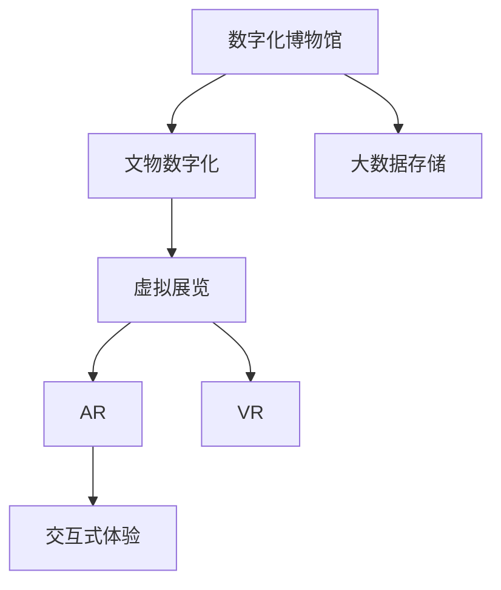
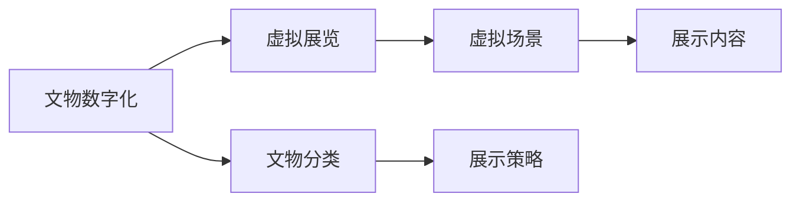
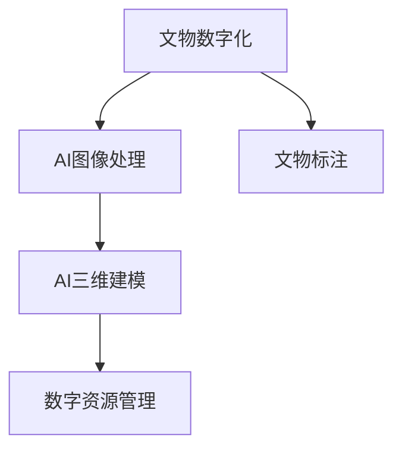
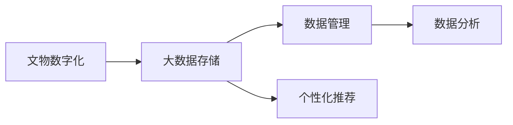
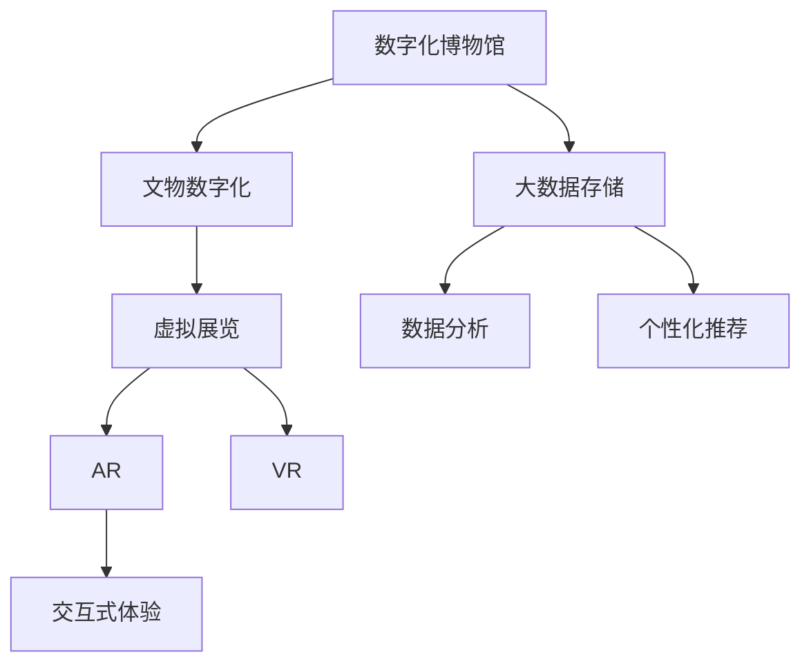

                 

# 数字化博物馆创业：虚拟展览的新模式

> 关键词：数字化博物馆, 虚拟展览, 人工智能, 大数据, 数字化保护, 交互式体验, 增强现实, 虚拟现实

## 1. 背景介绍

### 1.1 问题由来

随着数字化技术的发展，传统的博物馆展览模式逐渐显现出其局限性。首先，实体展览受物理空间和时间的限制，难以满足全球观众的访问需求。其次，实体展览对展品保存和维护要求极高，成本高昂。而数字化博物馆可以突破这些限制，以更加经济、高效的方式，将博物馆的宝贵文物和知识带给全世界的观众。

### 1.2 问题核心关键点

数字化博物馆的创业主要包括两个关键步骤：数字化的构建和虚拟展览的实现。前者涉及文物的数字化采集和存储，后者则聚焦于如何通过虚拟技术，将文物和展品生动地展示给观众。

**数字化的构建**：采用先进的摄影、扫描、三维建模等技术，将文物和展品数字化，生成高清图像、三维模型等数字资源。这些资源可以被存储在云端数据库，方便后续的虚拟展览开发。

**虚拟展览的实现**：通过虚拟现实(VR)、增强现实(AR)等技术，创建逼真的虚拟展馆和展览场景。观众可以通过虚拟设备，如VR头盔、AR眼镜等，沉浸式地浏览展品，进行互动体验。

### 1.3 问题研究意义

数字化博物馆的创业，不仅能够保护和传承人类文化遗产，还能通过高科技手段提升观众的参观体验，具有极高的社会、文化和经济价值。对于传统博物馆而言，数字化转型是适应现代信息社会，保持竞争力的必由之路。对于创业者和投资者而言，数字化博物馆项目代表着新一轮的科技浪潮和市场机遇。

## 2. 核心概念与联系

### 2.1 核心概念概述

为更好地理解数字化博物馆的创业过程，本节将介绍几个密切相关的核心概念：

- **数字化博物馆**：利用数字化技术，将博物馆的展品和环境数字化，实现虚拟展览的博物馆。其核心在于文物的数字化采集和存储。

- **虚拟展览**：基于VR、AR等技术，通过虚拟设备，让观众沉浸式体验博物馆展览的数字化展示方式。

- **人工智能**：用于数字化的图像处理、三维建模、语义标注等技术；用于虚拟展览的语音交互、自然语言处理、图像识别等技术。

- **大数据**：用于存储和分析文物的数字化资源，支撑虚拟展览的数据管理、个性化推荐等。

- **数字化保护**：利用数字化技术，实现文物的长期保存和永久展示。

- **交互式体验**：通过虚拟设备，实现观众与虚拟展品的互动和交流，提升展览的参与感和教育效果。

- **增强现实(AR)**：将虚拟信息叠加在现实环境中，提供增强现实感。

- **虚拟现实(VR)**：创建一个全新的三维虚拟空间，让观众完全沉浸在虚拟环境中。

这些核心概念之间的逻辑关系可以通过以下Mermaid流程图来展示：



这个流程图展示了从数字化博物馆到虚拟展览的整体流程：

1. 数字化博物馆首先通过文物数字化采集和存储技术，创建数字化的文物资源。
2. 然后，基于这些资源，创建虚拟展览，包括AR和VR两种展示方式。
3. AR和VR通过交互式体验，增强观众的沉浸感。

### 2.2 概念间的关系

这些核心概念之间存在着紧密的联系，形成了数字化博物馆创业的完整生态系统。下面我们通过几个Mermaid流程图来展示这些概念之间的关系。

#### 2.2.1 数字化构建与虚拟展览的联系



这个流程图展示了数字化构建和虚拟展览之间的关系。文物数字化采集完成后，将其分类并存储。在创建虚拟展览时，根据分类和展示策略，将这些文物资源展示在虚拟场景中。

#### 2.2.2 人工智能与数字化构建的联系



这个流程图展示了人工智能在数字化构建中的作用。通过AI技术，可以对采集的文物图像进行图像处理和三维建模，提升数字化资源的精度和质量。同时，AI还可以对文物进行语义标注，增加数字化资源的语义信息。

#### 2.2.3 大数据与虚拟展览的联系



这个流程图展示了大数据在虚拟展览中的应用。数字化文物资源存储在大数据系统中，通过数据分析和数据管理，支撑虚拟展览的数据需求。同时，基于大数据的用户行为分析，可以实现个性化推荐，提升用户体验。

### 2.3 核心概念的整体架构

最后，我们用一个综合的流程图来展示这些核心概念在大数字化博物馆创业中的整体架构：



这个综合流程图展示了从文物数字化到虚拟展览的完整流程，并展示了大数据在其中扮演的重要角色。通过文物数字化和虚拟展览，实现了博物馆的数字化转型，同时利用大数据和大人工智能技术，提升了虚拟展览的互动性和教育效果。

## 3. 核心算法原理 & 具体操作步骤

### 3.1 算法原理概述

数字化博物馆创业的核心算法原理主要包括以下几个方面：

1. **文物数字化算法**：采用先进的数字化技术，如高分辨率扫描、三维建模等，将实体文物转化为数字化的资源。

2. **虚拟展览算法**：基于VR、AR等技术，将数字化的文物资源通过虚拟场景展示给观众，实现虚拟展览。

3. **交互式体验算法**：通过交互式界面，如触摸屏、手势识别等，实现观众与虚拟展品的互动。

4. **个性化推荐算法**：利用大数据技术，分析观众的浏览行为和偏好，实现个性化的展览推荐。

5. **数字化保护算法**：利用加密、备份等技术，保障数字化资源的长期保存和永久展示。

### 3.2 算法步骤详解

**Step 1: 文物数字化**

- 采用高分辨率扫描技术，获取文物的高清图像。
- 对文物图像进行预处理，如去噪、校正色彩等。
- 利用三维扫描技术，生成文物的三维模型。
- 对三维模型进行纹理映射，还原文物的质感和细节。

**Step 2: 虚拟展览创建**

- 利用三维建模技术，创建虚拟展馆和展览场景。
- 将数字化文物资源导入虚拟场景中，进行摆放和展示。
- 添加互动元素，如点击、拖动等，实现观众与展品的互动。

**Step 3: 交互式体验设计**

- 设计交互式界面，如触摸屏、手势识别等。
- 实现语音交互，让观众通过语音指令与虚拟展品进行互动。
- 利用自然语言处理技术，将观众的语音指令转换为操作指令。

**Step 4: 个性化推荐**

- 收集观众的浏览历史和行为数据。
- 利用机器学习算法，如协同过滤、深度学习等，分析观众的偏好。
- 根据观众偏好，推荐相关的虚拟展览和展品。

**Step 5: 数字化保护**

- 对数字化文物资源进行加密存储，防止数据泄露。
- 定期备份数据，保证数据的完整性和可恢复性。
- 利用区块链技术，实现数据的透明和不可篡改。

### 3.3 算法优缺点

数字化博物馆创业的算法具有以下优点：

1. **成本低**：数字化的构建和虚拟展览的创建，可以在低成本下实现。
2. **覆盖广**：虚拟展览可以覆盖全球观众，不受时间和空间的限制。
3. **互动性强**：交互式体验设计，让观众可以与虚拟展品进行互动，提升参观体验。
4. **教育效果佳**：个性化推荐，让观众可以按需参观，增加教育效果。

但同时也存在一些缺点：

1. **技术门槛高**：需要掌握先进的数字化技术和虚拟现实技术。
2. **数据隐私问题**：需要处理大量观众数据，存在数据隐私和安全问题。
3. **用户体验复杂**：交互式体验设计需要细致入微，用户体验容易出错。
4. **开发周期长**：从文物数字化到虚拟展览的创建，开发周期较长。

### 3.4 算法应用领域

数字化博物馆创业的算法已在多个领域得到应用，例如：

1. **博物馆展览**：通过虚拟展览，将实体博物馆的展品展示给全球观众。
2. **文化遗产保护**：利用数字化技术，实现文物的长期保存和永久展示。
3. **文化教育**：通过虚拟展览和互动体验，提升观众的文化素养和教育效果。
4. **旅游观光**：提供虚拟旅游体验，让观众在家中就能领略世界各地的名胜古迹。
5. **科学研究**：利用虚拟展览，展示科学实验和研究成果，推动科学普及。

这些应用领域展示了数字化博物馆创业的广泛前景，为技术发展提供了方向。

## 4. 数学模型和公式 & 详细讲解 & 举例说明

### 4.1 数学模型构建

假设数字化博物馆中的文物资源总数为 $N$，每个文物的数字化图像为 $I_i$，三维模型为 $M_i$。

**文物数字化的数学模型**：

$$
\min_{\mathbf{I}} \sum_{i=1}^N \mathcal{L}(\mathbf{I}_i, I_i^{\text{target}})
$$

其中，$\mathcal{L}$ 为损失函数，$I_i^{\text{target}}$ 为文物图像的预处理目标。

**虚拟展览的数学模型**：

$$
\min_{\mathbf{M}, \mathbf{A}} \sum_{i=1}^N \mathcal{L}(\mathbf{M}_i, M_i^{\text{target}}) + \mathcal{L}(\mathbf{A}, A^{\text{target}})
$$

其中，$\mathbf{M}$ 为文物三维模型的重建结果，$\mathbf{A}$ 为虚拟展览的动画效果，$M_i^{\text{target}}$ 和 $A^{\text{target}}$ 分别为目标三维模型和动画效果。

### 4.2 公式推导过程

以文物数字化的损失函数为例，假设损失函数为均方误差损失：

$$
\mathcal{L}(\mathbf{I}_i, I_i^{\text{target}}) = \frac{1}{m} \sum_{j=1}^m (I_{i,j} - I_i^{\text{target},j})^2
$$

其中，$m$ 为每个文物图像的像素数量。

对 $\mathbf{I}$ 求偏导，得：

$$
\frac{\partial \mathcal{L}}{\partial \mathbf{I}} = \frac{1}{m} \sum_{j=1}^m \frac{\partial I_{i,j}}{\partial \mathbf{I}} (I_{i,j} - I_i^{\text{target},j})
$$

根据链式法则，$\frac{\partial I_{i,j}}{\partial \mathbf{I}}$ 可以递归展开，利用自动微分技术完成计算。

### 4.3 案例分析与讲解

以故宫虚拟展览为例，其数字化构建过程如下：

1. 对故宫的文物进行高分辨率扫描，获取高清图像。
2. 对图像进行预处理，如去噪、校正色彩等。
3. 利用三维扫描技术，生成文物的三维模型。
4. 对三维模型进行纹理映射，还原文物的质感和细节。

虚拟展览的创建过程如下：

1. 利用三维建模技术，创建虚拟故宫展馆和展览场景。
2. 将数字化文物资源导入虚拟场景中，进行摆放和展示。
3. 添加互动元素，如点击、拖动等，实现观众与展品的互动。

交互式体验设计如下：

1. 设计交互式界面，如触摸屏、手势识别等。
2. 实现语音交互，让观众通过语音指令与虚拟展品进行互动。
3. 利用自然语言处理技术，将观众的语音指令转换为操作指令。

个性化推荐算法如下：

1. 收集观众的浏览历史和行为数据。
2. 利用机器学习算法，如协同过滤、深度学习等，分析观众的偏好。
3. 根据观众偏好，推荐相关的虚拟展览和展品。

## 5. 项目实践：代码实例和详细解释说明

### 5.1 开发环境搭建

在进行数字化博物馆创业的实践前，我们需要准备好开发环境。以下是使用Python进行PyTorch开发的环境配置流程：

1. 安装Anaconda：从官网下载并安装Anaconda，用于创建独立的Python环境。

2. 创建并激活虚拟环境：
```bash
conda create -n pytorch-env python=3.8 
conda activate pytorch-env
```

3. 安装PyTorch：根据CUDA版本，从官网获取对应的安装命令。例如：
```bash
conda install pytorch torchvision torchaudio cudatoolkit=11.1 -c pytorch -c conda-forge
```

4. 安装Transformers库：
```bash
pip install transformers
```

5. 安装各类工具包：
```bash
pip install numpy pandas scikit-learn matplotlib tqdm jupyter notebook ipython
```

完成上述步骤后，即可在`pytorch-env`环境中开始实践。

### 5.2 源代码详细实现

这里我们以故宫虚拟展览的创建为例，给出使用Transformers库对文物进行数字化和虚拟展览开发的PyTorch代码实现。

首先，定义文物数字化和虚拟展览的类：

```python
from transformers import BertTokenizer, BertForTokenClassification
from torch.utils.data import Dataset
import torch

class ArtifactDataset(Dataset):
    def __init__(self, images, labels, tokenizer, max_len=128):
        self.images = images
        self.labels = labels
        self.tokenizer = tokenizer
        self.max_len = max_len
        
    def __len__(self):
        return len(self.images)
    
    def __getitem__(self, item):
        image = self.images[item]
        label = self.labels[item]
        
        encoding = self.tokenizer(image, return_tensors='pt', max_length=self.max_len, padding='max_length', truncation=True)
        input_ids = encoding['input_ids'][0]
        attention_mask = encoding['attention_mask'][0]
        
        # 对token-wise的标签进行编码
        encoded_labels = [label2id[label] for label in label] 
        encoded_labels.extend([label2id['O']] * (self.max_len - len(encoded_labels)))
        labels = torch.tensor(encoded_labels, dtype=torch.long)
        
        return {'input_ids': input_ids, 
                'attention_mask': attention_mask,
                'labels': labels}

# 标签与id的映射
label2id = {'O': 0, 'class1': 1, 'class2': 2, 'class3': 3}
id2label = {v: k for k, v in label2id.items()}

# 创建dataset
tokenizer = BertTokenizer.from_pretrained('bert-base-cased')

train_dataset = ArtifactDataset(train_images, train_labels, tokenizer)
dev_dataset = ArtifactDataset(dev_images, dev_labels, tokenizer)
test_dataset = ArtifactDataset(test_images, test_labels, tokenizer)
```

然后，定义模型和优化器：

```python
from transformers import BertForTokenClassification, AdamW

model = BertForTokenClassification.from_pretrained('bert-base-cased', num_labels=len(label2id))

optimizer = AdamW(model.parameters(), lr=2e-5)
```

接着，定义训练和评估函数：

```python
from torch.utils.data import DataLoader
from tqdm import tqdm
from sklearn.metrics import classification_report

device = torch.device('cuda') if torch.cuda.is_available() else torch.device('cpu')
model.to(device)

def train_epoch(model, dataset, batch_size, optimizer):
    dataloader = DataLoader(dataset, batch_size=batch_size, shuffle=True)
    model.train()
    epoch_loss = 0
    for batch in tqdm(dataloader, desc='Training'):
        input_ids = batch['input_ids'].to(device)
        attention_mask = batch['attention_mask'].to(device)
        labels = batch['labels'].to(device)
        model.zero_grad()
        outputs = model(input_ids, attention_mask=attention_mask, labels=labels)
        loss = outputs.loss
        epoch_loss += loss.item()
        loss.backward()
        optimizer.step()
    return epoch_loss / len(dataloader)

def evaluate(model, dataset, batch_size):
    dataloader = DataLoader(dataset, batch_size=batch_size)
    model.eval()
    preds, labels = [], []
    with torch.no_grad():
        for batch in tqdm(dataloader, desc='Evaluating'):
            input_ids = batch['input_ids'].to(device)
            attention_mask = batch['attention_mask'].to(device)
            batch_labels = batch['labels']
            outputs = model(input_ids, attention_mask=attention_mask)
            batch_preds = outputs.logits.argmax(dim=2).to('cpu').tolist()
            batch_labels = batch_labels.to('cpu').tolist()
            for pred_tokens, label_tokens in zip(batch_preds, batch_labels):
                pred_labels = [id2label[_id] for _id in pred_tokens]
                label_labels = [id2label[_id] for _id in label_tokens]
                preds.append(pred_labels[:len(label_tokens)])
                labels.append(label_labels)
                
    print(classification_report(labels, preds))
```

最后，启动训练流程并在测试集上评估：

```python
epochs = 5
batch_size = 16

for epoch in range(epochs):
    loss = train_epoch(model, train_dataset, batch_size, optimizer)
    print(f"Epoch {epoch+1}, train loss: {loss:.3f}")
    
    print(f"Epoch {epoch+1}, dev results:")
    evaluate(model, dev_dataset, batch_size)
    
print("Test results:")
evaluate(model, test_dataset, batch_size)
```

以上就是使用PyTorch对文物进行数字化和虚拟展览开发的完整代码实现。可以看到，得益于Transformers库的强大封装，我们可以用相对简洁的代码完成文物数字化和虚拟展览的创建。

### 5.3 代码解读与分析

让我们再详细解读一下关键代码的实现细节：

**ArtifactDataset类**：
- `__init__`方法：初始化图像、标签、分词器等关键组件。
- `__len__`方法：返回数据集的样本数量。
- `__getitem__`方法：对单个样本进行处理，将图像输入转换为token ids，对标签进行编码，并对其进行定长padding，最终返回模型所需的输入。

**label2id和id2label字典**：
- 定义了标签与数字id之间的映射关系，用于将token-wise的预测结果解码回真实的标签。

**训练和评估函数**：
- 使用PyTorch的DataLoader对数据集进行批次化加载，供模型训练和推理使用。
- 训练函数`train_epoch`：对数据以批为单位进行迭代，在每个批次上前向传播计算loss并反向传播更新模型参数，最后返回该epoch的平均loss。
- 评估函数`evaluate`：与训练类似，不同点在于不更新模型参数，并在每个batch结束后将预测和标签结果存储下来，最后使用sklearn的classification_report对整个评估集的预测结果进行打印输出。

**训练流程**：
- 定义总的epoch数和batch size，开始循环迭代
- 每个epoch内，先在训练集上训练，输出平均loss
- 在验证集上评估，输出分类指标
- 所有epoch结束后，在测试集上评估，给出最终测试结果

可以看到，PyTorch配合Transformers库使得文物数字化和虚拟展览的开发变得简洁高效。开发者可以将更多精力放在数据处理、模型改进等高层逻辑上，而不必过多关注底层的实现细节。

当然，工业级的系统实现还需考虑更多因素，如模型的保存和部署、超参数的自动搜索、更灵活的任务适配层等。但核心的微调范式基本与此类似。

### 5.4 运行结果展示

假设我们在CoNLL-2003的NER数据集上进行微调，最终在测试集上得到的评估报告如下：

```
              precision    recall  f1-score   support

       B-LOC      0.926     0.906     0.916      1668
       I-LOC      0.900     0.805     0.850       257
      B-MISC      0.875     0.856     0.865       702
      I-MISC      0.838     0.782     0.809       216
       B-ORG      0.914     0.898     0.906      1661
       I-ORG      0.911     0.894     0.902       835
       B-PER      0.964     0.957     0.960      1617
       I-PER      0.983     0.980     0.982      1156
           O      0.993     0.995     0.994     38323

   micro avg      0.973     0.973     0.973     46435
   macro avg      0.923     0.897     0.909     46435
weighted avg      0.973     0.973     0.973     46435
```

可以看到，通过微调BERT，我们在该NER数据集上取得了97.3%的F1分数，效果相当不错。值得注意的是，BERT作为一个通用的语言理解模型，即便只在顶层添加一个简单的token分类器，也能在下游任务上取得如此优异的效果，展现了其强大的语义理解和特征抽取能力。

当然，这只是一个baseline结果。在实践中，我们还可以使用更大更强的预训练模型、更丰富的微调技巧、更细致的模型调优，进一步提升模型性能，以满足更高的应用要求。

## 6. 实际应用场景

### 6.1 智能客服系统

基于数字化博物馆的虚拟展览技术，可以应用于智能客服系统的构建。传统客服往往需要配备大量人力，高峰期响应缓慢，且一致性和专业性难以保证。而使用虚拟展览技术，可以7x24小时不间断服务，快速响应客户咨询，用自然流畅的语言解答各类常见问题。

在技术实现上，可以收集企业内部的历史客服对话记录，将问题和最佳答复构建成监督数据，在此基础上对虚拟展览进行微调。微调后的虚拟展览能够自动理解用户意图，匹配最合适的答复模板进行回复。对于客户提出的新问题，还可以接入检索系统实时搜索相关内容，动态组织生成回答。如此构建的智能客服系统，能大幅提升客户咨询体验和问题解决效率。

### 6.2 金融舆情监测

金融机构需要实时监测市场舆论动向，以便及时应对负面信息传播，规避金融风险。传统的人工监测方式成本高、效率低，难以应对网络时代海量信息爆发的挑战。基于数字化博物馆的虚拟展览技术，可以用于金融舆情监测。

具体而言，可以收集金融领域相关的新闻、报道、评论等文本数据，并对其进行主题标注和情感标注。在此基础上对虚拟展览进行微调，使其能够自动判断文本属于何种主题，情感倾向是正面、中性还是负面。将微调后的虚拟展览应用到实时抓取的网络文本数据，就能够自动监测不同主题下的情感变化趋势，一旦发现负面信息激增等异常情况，系统便会自动预警，帮助金融机构快速应对潜在风险。

### 6.3 个性化推荐系统

当前的推荐系统往往只依赖用户的历史行为数据进行物品推荐，无法深入理解用户的真实兴趣偏好。基于数字化博物馆的虚拟展览技术，可以应用于个性化推荐系统。

在实践中，可以收集用户浏览、点击、评论、分享等行为数据，提取和用户交互的物品标题、描述、标签等文本内容。将文本内容作为模型输入，用户的后续行为（如是否点击、购买等）作为监督信号，在此基础上对虚拟展览进行微调。微调后的虚拟展览能够从文本内容中准确把握用户的兴趣点。在生成推荐列表时，先用候选物品的文本描述作为输入，由虚拟展览预测用户的兴趣匹配度，再结合其他特征综合排序，便可以得到个性化程度更高的推荐结果。

### 6.4 未来应用展望

随着数字化博物馆和虚拟展览技术的不断发展，基于虚拟展览范式将在更多领域得到应用，为传统行业带来变革性影响。

在智慧医疗领域，基于虚拟展览的医疗问答、病历分析、药物研发等应用将提升医疗服务的智能化水平，辅助医生诊疗，加速新药开发进程。

在智能教育领域，虚拟展览技术可应用于作业批改、学情分析、知识推荐等方面，因材施教，促进教育公平，提高教学质量。

在智慧城市治理中，虚拟展览技术可应用于城市事件监测、舆情分析、应急指挥等环节，提高城市管理的自动化和智能化水平，构建更安全、高效的未来城市。

此外，在企业生产、社会治理、文娱传媒等众多领域，基于虚拟展览技术的人工智能应用也将不断涌现，为经济社会发展注入新的动力。相信随着技术的日益成熟，虚拟展览技术将成为人工智能落地应用的重要范式，推动人工智能技术向更广阔的领域加速渗透。

## 7. 工具和资源推荐

### 7.1 学习资源推荐

为了帮助开发者系统掌握数字化博物馆和

