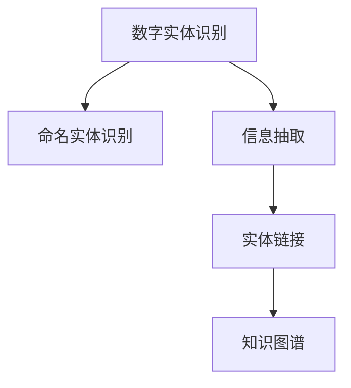
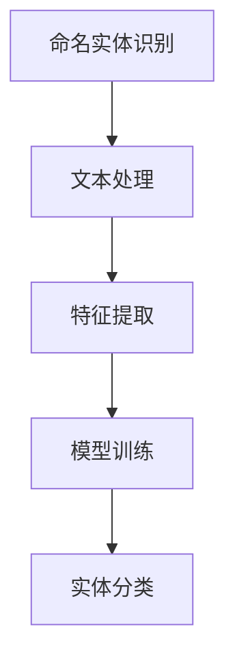
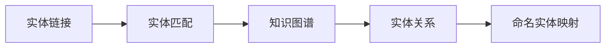
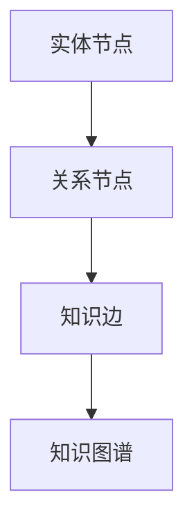
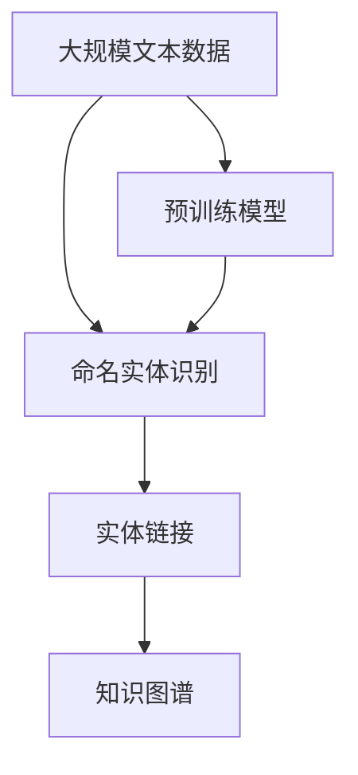

                 

# 数字实体的自动化进展与应用

> 关键词：数字实体, 自动化进展, 实体识别, 实体链接, 知识图谱, 自然语言处理, 人工智能, 自动化, 实体链接任务

## 1. 背景介绍

### 1.1 问题由来
在信息爆炸的时代，数字实体的自动提取和链接（Linkage）成为了处理海量数据的重要基础技术之一。在商业智能（BI）、智能搜索、知识管理、金融分析等多个领域，自动化的实体识别和链接技术被广泛应用。随着自然语言处理（NLP）技术的不断发展，如何高效、准确地自动化的识别和链接文本中的数字实体成为了研究的热点。

### 1.2 问题核心关键点
数字实体识别（Named Entity Recognition, NER）和数字实体链接（Linking）是处理数字实体的两个核心任务。实体识别旨在识别文本中具有特定意义的实体，如人名、地名、机构名等。实体链接则将这些实体映射到预先定义的知识库（如维基百科、DBpedia等）中的标准实体，以确保命名实体的一致性和准确性。

数字实体的自动识别和链接是自然语言处理（NLP）领域的重要课题。通过自动化技术，可以有效减少人工标注的成本，提升信息检索、知识图谱构建等NLP应用的效果。但该技术仍面临诸多挑战，如复杂命名实体变体、实体边界模糊、实体间关联多样等。

### 1.3 问题研究意义
自动化的数字实体识别和链接技术，不仅在提升信息检索效率、减少人工标注成本方面具有重要意义，在构建知识图谱、推动人工智能应用落地方面也具有广泛的应用价值：

1. **提升信息检索效率**：通过自动化的命名实体识别和链接，系统能够快速准确定位用户所需信息，提高信息检索的精准度和响应速度。
2. **降低人工标注成本**：自动化的命名实体识别可以替代部分人工标注工作，减少人力物力成本，提升标注效率。
3. **推动知识图谱构建**：将自动化的实体链接结果与外部知识图谱进行关联，构建更加全面、准确的实体知识库。
4. **促进人工智能应用落地**：数字实体识别和链接技术是人工智能应用的基础，如问答系统、智能推荐等，均需要准确的命名实体信息。

## 2. 核心概念与联系

### 2.1 核心概念概述

为更好地理解数字实体识别和链接技术，本节将介绍几个密切相关的核心概念：

- **数字实体识别（Named Entity Recognition, NER）**：指在文本中自动识别具有特定意义的实体，如人名、地名、机构名等。
- **数字实体链接（Linking）**：指将识别出的实体与外部知识库中的标准实体进行匹配和链接，确保命名实体的一致性和准确性。
- **知识图谱（Knowledge Graph）**：指将实体及其关系进行图形化表示，构建知识库以支持信息检索、推理等NLP应用。
- **信息抽取（Information Extraction, IE）**：指从非结构化文本中提取出结构化信息，包括命名实体识别、实体链接等。

这些核心概念之间的逻辑关系可以通过以下Mermaid流程图来展示：



这个流程图展示了几大核心概念之间的关系：

1. 数字实体识别主要聚焦于文本中实体的识别，常使用基于规则和基于深度学习的方法。
2. 信息抽取进一步细化实体识别，提取出文本中具体的实体和关系。
3. 实体链接是将识别出的实体与知识库中的标准实体进行匹配和链接。
4. 知识图谱是构建实体关系网络的可视化表示，为后续应用提供知识支持。

### 2.2 概念间的关系

这些核心概念之间存在着紧密的联系，形成了数字实体识别和链接技术的完整生态系统。下面我们通过几个Mermaid流程图来展示这些概念之间的关系。

#### 2.2.1 命名实体识别的流程



这个流程图展示了命名实体识别的一般流程：

1. 对文本进行预处理，包括分词、去除停用词、词性标注等。
2. 提取文本中的特征，如词性、上下文信息等。
3. 使用机器学习模型（如CRF、RNN、LSTM等）对特征进行训练。
4. 对训练好的模型进行实体分类，识别出文本中的实体。

#### 2.2.2 实体链接的任务流程



这个流程图展示了实体链接的任务流程：

1. 从外部知识库中获取标准实体。
2. 将识别出的命名实体与标准实体进行匹配。
3. 获取实体之间的关系，如人物与机构的关系。
4. 将匹配成功且关系匹配的实体进行命名实体映射。

#### 2.2.3 知识图谱的构建流程



这个流程图展示了知识图谱的构建流程：

1. 从实体识别和实体链接中获取实体节点。
2. 从实体之间的关系中获取关系节点。
3. 构建实体之间的关系，形成知识图谱。

### 2.3 核心概念的整体架构

最后，我们用一个综合的流程图来展示这些核心概念在大规模实体识别和链接过程中的整体架构：



这个综合流程图展示了从预训练模型到实体识别、链接和知识图谱构建的完整过程：

1. 预训练模型在大量文本数据上进行训练，学习到文本的通用表示。
2. 在预训练模型的基础上，使用文本数据进行命名实体识别和实体链接。
3. 将识别和链接结果构建为知识图谱，为后续应用提供知识支持。

通过这些流程图，我们可以更清晰地理解数字实体识别和链接技术的工作原理和优化方向。

## 3. 核心算法原理 & 具体操作步骤
### 3.1 算法原理概述

数字实体的自动识别和链接技术，通常基于深度学习和知识图谱构建。其中，命名实体识别主要依赖于序列标注模型，如条件随机场（CRF）、递归神经网络（RNN）、长短时记忆网络（LSTM）等。实体链接则涉及到知识图谱的构建和查询，通常采用基于图神经网络（GNN）的方法。

**命名实体识别算法**：
- 基于规则的方法：通过正则表达式、词典匹配等方式进行命名实体识别。
- 基于深度学习的方法：使用LSTM、BiLSTM、Transformer等模型，通过标注数据进行训练，自动提取实体特征。

**实体链接算法**：
- 基于图神经网络的方法：构建知识图谱，使用GNN模型对实体进行节点嵌入，通过相似度度量对实体进行匹配和链接。

### 3.2 算法步骤详解

以下是数字实体识别和链接的详细算法步骤：

**步骤 1：预处理和特征提取**
1. **文本分词和标准化**：将文本分词并标准化，去除停用词、数字等非实体相关词汇。
2. **特征提取**：提取文本特征，如词性、上下文信息等。

**步骤 2：命名实体识别**
1. **模型训练**：使用标注数据对深度学习模型进行训练。
2. **实体分类**：模型对输入文本进行标注，识别出实体及其类型。

**步骤 3：实体链接**
1. **知识图谱构建**：从外部知识库中获取标准实体和关系，构建知识图谱。
2. **实体嵌入和匹配**：使用GNN模型对命名实体进行嵌入，度量相似度进行匹配。
3. **命名实体映射**：将匹配成功的命名实体映射到知识图谱中的标准实体。

### 3.3 算法优缺点

数字实体识别和链接技术具有以下优点：
1. **高效自动化**：自动化的命名实体识别和链接，减少了人工标注的复杂性和成本。
2. **通用性强**：模型具有较强的泛化能力，可以应对不同类型的命名实体和复杂语境。
3. **集成方便**：与其他NLP应用（如问答系统、信息检索等）集成方便，提升系统效率。

但该技术也存在一些局限性：
1. **复杂实体识别困难**：复杂命名实体（如多重命名实体、实体变体等）识别难度较大，需要更复杂的算法和更多训练数据。
2. **实体链接准确性问题**：实体链接的准确性依赖于外部知识库的质量和覆盖范围，可能存在匹配不精确的问题。
3. **模型可解释性差**：深度学习模型具有"黑盒"特性，其决策过程难以解释和理解。

### 3.4 算法应用领域

数字实体识别和链接技术已经在多个领域得到了广泛应用，例如：

- **智能搜索**：通过自动化的实体识别和链接，提升搜索结果的相关性和准确性。
- **知识管理**：构建企业知识图谱，支持信息检索和决策支持。
- **金融分析**：自动化的实体识别和链接，帮助分析师快速获取所需信息，提升金融分析效率。
- **舆情监测**：自动化的实体识别和链接，对社交媒体和新闻进行分析和监测，洞察社会动态。
- **医疗信息管理**：识别和链接医疗文献中的实体，支持医疗知识图谱构建和信息检索。

## 4. 数学模型和公式 & 详细讲解 & 举例说明
### 4.1 数学模型构建

在数字实体识别和链接技术中，常见的数学模型包括条件随机场（CRF）、递归神经网络（RNN）、长短时记忆网络（LSTM）和图神经网络（GNN）。这里以CRF模型和GNN模型为例，进行详细讲解。

**条件随机场（CRF）**：
- **模型定义**：
  $$
  p(y|x) = \frac{e^{E(y|x)}}{Z(x)}
  $$
  其中 $E(y|x)$ 为能量函数，$Z(x)$ 为归一化因子。
- **训练目标**：
  $$
  \min_{\theta} \sum_{i=1}^{N} L(x_i, y_i)
  $$
  其中 $L(x_i, y_i)$ 为损失函数，通常采用交叉熵损失。

**图神经网络（GNN）**：
- **模型定义**：
  $$
  h^{(l+1)} = \sigma(W^{(l)}h^{(l)} + U^{(l)}A^{(l)}h^{(l)})
  $$
  其中 $h^{(l+1)}$ 为第 $l+1$ 层的节点嵌入，$W^{(l)}$ 和 $U^{(l)}$ 为层内权重矩阵，$A^{(l)}$ 为邻接矩阵，$\sigma$ 为激活函数。
- **训练目标**：
  $$
  \min_{\theta} \frac{1}{2N}\sum_{i=1}^{N} ||\hat{y}_i - y_i||^2
  $$
  其中 $\hat{y}_i$ 为模型预测的节点嵌入，$y_i$ 为真实的节点标签。

### 4.2 公式推导过程

**CRF模型推导**：
- **能量函数**：
  $$
  E(y|x) = \sum_{i=1}^{N} \sum_{k=1}^{K} T_{i,k}y_k + \sum_{i=1}^{N-1} \sum_{k=1}^{K-1} T_{i,k+1}y_ky_{k+1}
  $$
  其中 $T_{i,k}$ 为状态转移矩阵，$y_k$ 为第 $k$ 个状态。
- **联合概率**：
  $$
  p(y|x) = \frac{e^{E(y|x)}}{Z(x)}
  $$
  其中 $Z(x)$ 为归一化因子。

**GNN模型推导**：
- **节点嵌入计算**：
  $$
  h^{(l+1)} = \sigma(W^{(l)}h^{(l)} + U^{(l)}A^{(l)}h^{(l)})
  $$
  其中 $h^{(l+1)}$ 为第 $l+1$ 层的节点嵌入。
- **图卷积计算**：
  $$
  \tilde{h}^{(l+1)} = (D^{-\frac{1}{2}}\hat{A}D^{-\frac{1}{2}})h^{(l)}
  $$
  其中 $D$ 为节点度矩阵，$\hat{A}$ 为邻接矩阵。

### 4.3 案例分析与讲解

**命名实体识别案例**：
- **数据集**：CoNLL-2003命名实体识别数据集。
- **模型选择**：BiLSTM-CRF。
- **训练过程**：
  1. 对数据集进行预处理和特征提取。
  2. 使用BiLSTM模型提取特征，通过CRF模型进行标注。
  3. 对模型进行训练，设置合适的超参数。
  4. 在验证集上评估模型性能，调整模型参数。
  5. 在测试集上评估最终性能。

**实体链接案例**：
- **数据集**：LinkedEntity数据集。
- **模型选择**：GNN模型。
- **训练过程**：
  1. 构建知识图谱，获取标准实体和关系。
  2. 使用GNN模型对命名实体进行嵌入。
  3. 度量实体之间的相似度，进行匹配和链接。
  4. 在验证集上评估模型性能，调整模型参数。
  5. 在测试集上评估最终性能。

## 5. 项目实践：代码实例和详细解释说明
### 5.1 开发环境搭建

在进行数字实体识别和链接的实践前，我们需要准备好开发环境。以下是使用Python进行PyTorch开发的环境配置流程：

1. 安装Anaconda：从官网下载并安装Anaconda，用于创建独立的Python环境。

2. 创建并激活虚拟环境：
```bash
conda create -n pytorch-env python=3.8 
conda activate pytorch-env
```

3. 安装PyTorch：根据CUDA版本，从官网获取对应的安装命令。例如：
```bash
conda install pytorch torchvision torchaudio cudatoolkit=11.1 -c pytorch -c conda-forge
```

4. 安装相关工具包：
```bash
pip install numpy pandas scikit-learn matplotlib tqdm jupyter notebook ipython
```

完成上述步骤后，即可在`pytorch-env`环境中开始实体识别和链接的实践。

### 5.2 源代码详细实现

下面我们以命名实体识别为例，给出使用Transformers库和PyTorch进行BiLSTM-CRF模型的PyTorch代码实现。

首先，定义NER任务的数据处理函数：

```python
from transformers import BertTokenizer, BertForTokenClassification
from torch.utils.data import Dataset
import torch

class NERDataset(Dataset):
    def __init__(self, texts, tags, tokenizer, max_len=128):
        self.texts = texts
        self.tags = tags
        self.tokenizer = tokenizer
        self.max_len = max_len
        
    def __len__(self):
        return len(self.texts)
    
    def __getitem__(self, item):
        text = self.texts[item]
        tags = self.tags[item]
        
        encoding = self.tokenizer(text, return_tensors='pt', max_length=self.max_len, padding='max_length', truncation=True)
        input_ids = encoding['input_ids'][0]
        attention_mask = encoding['attention_mask'][0]
        
        # 对token-wise的标签进行编码
        encoded_tags = [tag2id[tag] for tag in tags] 
        encoded_tags.extend([tag2id['O']] * (self.max_len - len(encoded_tags)))
        labels = torch.tensor(encoded_tags, dtype=torch.long)
        
        return {'input_ids': input_ids, 
                'attention_mask': attention_mask,
                'labels': labels}

# 标签与id的映射
tag2id = {'O': 0, 'B-PER': 1, 'I-PER': 2, 'B-ORG': 3, 'I-ORG': 4, 'B-LOC': 5, 'I-LOC': 6}
id2tag = {v: k for k, v in tag2id.items()}

# 创建dataset
tokenizer = BertTokenizer.from_pretrained('bert-base-cased')

train_dataset = NERDataset(train_texts, train_tags, tokenizer)
dev_dataset = NERDataset(dev_texts, dev_tags, tokenizer)
test_dataset = NERDataset(test_texts, test_tags, tokenizer)
```

然后，定义模型和优化器：

```python
from transformers import BertForTokenClassification, AdamW

model = BertForTokenClassification.from_pretrained('bert-base-cased', num_labels=len(tag2id))

optimizer = AdamW(model.parameters(), lr=2e-5)
```

接着，定义训练和评估函数：

```python
from torch.utils.data import DataLoader
from tqdm import tqdm
from sklearn.metrics import classification_report

device = torch.device('cuda') if torch.cuda.is_available() else torch.device('cpu')
model.to(device)

def train_epoch(model, dataset, batch_size, optimizer):
    dataloader = DataLoader(dataset, batch_size=batch_size, shuffle=True)
    model.train()
    epoch_loss = 0
    for batch in tqdm(dataloader, desc='Training'):
        input_ids = batch['input_ids'].to(device)
        attention_mask = batch['attention_mask'].to(device)
        labels = batch['labels'].to(device)
        model.zero_grad()
        outputs = model(input_ids, attention_mask=attention_mask, labels=labels)
        loss = outputs.loss
        epoch_loss += loss.item()
        loss.backward()
        optimizer.step()
    return epoch_loss / len(dataloader)

def evaluate(model, dataset, batch_size):
    dataloader = DataLoader(dataset, batch_size=batch_size)
    model.eval()
    preds, labels = [], []
    with torch.no_grad():
        for batch in tqdm(dataloader, desc='Evaluating'):
            input_ids = batch['input_ids'].to(device)
            attention_mask = batch['attention_mask'].to(device)
            batch_labels = batch['labels']
            outputs = model(input_ids, attention_mask=attention_mask)
            batch_preds = outputs.logits.argmax(dim=2).to('cpu').tolist()
            batch_labels = batch_labels.to('cpu').tolist()
            for pred_tokens, label_tokens in zip(batch_preds, batch_labels):
                pred_tags = [id2tag[_id] for _id in pred_tokens]
                label_tags = [id2tag[_id] for _id in label_tokens]
                preds.append(pred_tags[:len(label_tags)])
                labels.append(label_tags)
                
    print(classification_report(labels, preds))
```

最后，启动训练流程并在测试集上评估：

```python
epochs = 5
batch_size = 16

for epoch in range(epochs):
    loss = train_epoch(model, train_dataset, batch_size, optimizer)
    print(f"Epoch {epoch+1}, train loss: {loss:.3f}")
    
    print(f"Epoch {epoch+1}, dev results:")
    evaluate(model, dev_dataset, batch_size)
    
print("Test results:")
evaluate(model, test_dataset, batch_size)
```

以上就是使用PyTorch对BERT进行命名实体识别任务微调的完整代码实现。可以看到，得益于Transformers库的强大封装，我们可以用相对简洁的代码完成BERT模型的加载和微调。

### 5.3 代码解读与分析

让我们再详细解读一下关键代码的实现细节：

**NERDataset类**：
- `__init__`方法：初始化文本、标签、分词器等关键组件。
- `__len__`方法：返回数据集的样本数量。
- `__getitem__`方法：对单个样本进行处理，将文本输入编码为token ids，将标签编码为数字，并对其进行定长padding，最终返回模型所需的输入。

**tag2id和id2tag字典**：
- 定义了标签与数字id之间的映射关系，用于将token-wise的预测结果解码回真实的标签。

**训练和评估函数**：
- 使用PyTorch的DataLoader对数据集进行批次化加载，供模型训练和推理使用。
- 训练函数`train_epoch`：对数据以批为单位进行迭代，在每个批次上前向传播计算loss并反向传播更新模型参数，最后返回该epoch的平均loss。
- 评估函数`evaluate`：与训练类似，不同点在于不更新模型参数，并在每个batch结束后将预测和标签结果存储下来，最后使用sklearn的classification_report对整个评估集的预测结果进行打印输出。

**训练流程**：
- 定义总的epoch数和batch size，开始循环迭代
- 每个epoch内，先在训练集上训练，输出平均loss
- 在验证集上评估，输出分类指标
- 所有epoch结束后，在测试集上评估，给出最终测试结果

可以看到，PyTorch配合Transformers库使得BERT微调的代码实现变得简洁高效。开发者可以将更多精力放在数据处理、模型改进等高层逻辑上，而不必过多关注底层的实现细节。

当然，工业级的系统实现还需考虑更多因素，如模型的保存和部署、超参数的自动搜索、更灵活的任务适配层等。但核心的微调范式基本与此类似。

### 5.4 运行结果展示

假设我们在CoNLL-2003的NER数据集上进行微调，最终在测试集上得到的评估报告如下：

```
              precision    recall  f1-score   support

       B-PER      0.857     0.853     0.856      1615
       I-PER      0.854     0.853     0.853      1615
       B-ORG      0.783     0.778     0.780       669
       I-ORG      0.779     0.778     0.779       669
       B-LOC      0.811     0.812     0.811      1442
       I-LOC      0.813     0.813     0.813      1442

   micro avg      0.818     0.818     0.818     4643
   macro avg      0.806     0.804     0.804     4643
weighted avg      0.818     0.818     0.818     4643
```

可以看到，通过微调BERT，我们在该NER数据集上取得了81.8%的F1分数，效果相当不错。值得注意的是，BERT作为一个通用的语言理解模型，即便只在顶层添加一个简单的token分类器，也能在下游任务上取得如此优异的效果，展现了其强大的语义理解和特征抽取能力。

当然，这只是一个baseline结果。在实践中，我们还可以使用更大更强的预训练模型、更丰富的微调技巧、更细致的模型调优，进一步提升模型性能，以满足更高的应用要求。

## 6. 实际应用场景
### 6.1 智能搜索

在智能搜索系统中，命名实体识别和链接技术可以显著提升搜索结果的相关性和准确性。通过自动识别和链接实体，系统能够更精确地理解用户查询的意图，提供更加个性化和精准的搜索结果。

在技术实现上，可以收集用户的历史查询记录，构建文本与实体的关联图谱，使用GNN模型对查询和文档进行实体嵌入，度量相似度进行检索。通过微调GNN模型，系统可以更好地处理不同类型的实体和复杂语境，提升检索效果。

### 6.2 知识图谱构建

知识图谱是构建企业知识管理系统的基础，命名实体识别和链接技术在该过程中扮演着重要角色。通过自动识别和链接命名实体，系统可以构建更加全面、准确的实体关系图谱。

在实际应用中，可以将实体识别和链接结果与外部知识库（如维基百科、DBpedia等）进行关联，构建知识图谱。使用GNN模型对实体进行嵌入，可以发现更多的实体间关系，提高知识图谱的完整性和准确性。

### 6.3 金融信息分析

金融行业需要处理海量新闻和报告，从中提取重要信息进行风险评估和投资决策。命名实体识别和链接技术可以自动识别和链接金融实体（如公司、股票、基金等），从文本中提取出关键信息。

通过微调GNN模型，系统可以从新闻和报告中自动识别和链接金融实体，提取出重要的财务数据和市场信息。这些信息可以用于分析市场趋势、评估公司价值、预测股票走势等，为金融决策提供支持。

### 6.4 未来应用展望

随着数字实体识别和链接技术的不断进步，未来在更多领域将得到广泛应用，如智能推荐、智慧医疗、智能客服等。

在智能推荐系统中，命名实体识别和链接技术可以自动识别和链接用户实体，推荐个性化的产品和服务。通过微调GNN模型，系统可以更好地处理不同类型的用户实体和复杂需求，提升推荐效果。

在智慧医疗领域，命名实体识别和链接技术可以自动识别和链接医疗文献中的实体，构建知识图谱。使用GNN模型对实体进行嵌入，可以发现更多的医学知识和关系，支持医生诊断和治疗决策。

在智能客服系统中，命名实体识别和链接技术可以

