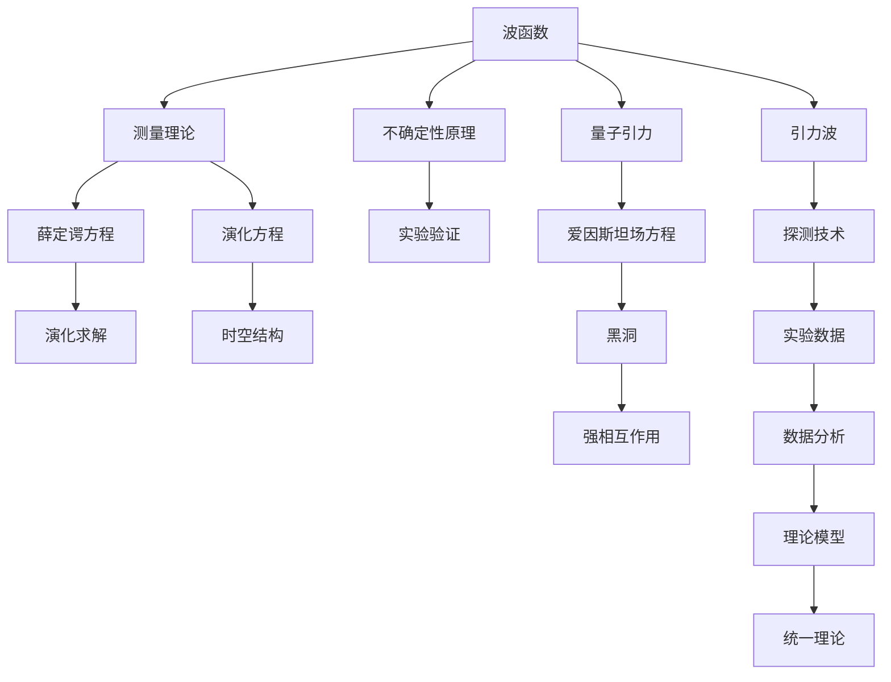

                 

## 1. 背景介绍

### 1.1 问题由来
量子力学和广义相对论是现代物理学中的两大基石。量子力学揭示了微观粒子的基本性质和行为，如不确定性原理和波粒二象性；而广义相对论则解释了宏观物体的运动和引力，如时空弯曲和黑洞。尽管两者都极其成功，但迄今为止，在理论层面上，它们始终未能统一。这一问题不仅引发了物理学家的极大兴趣，也挑战着人类对自然界的深刻理解。

### 1.2 问题核心关键点
量子力学和广义相对论未能统一的核心在于量子力学的波函数演化和广义相对论的时空几何之间的根本差异。量子力学基于波函数的随机性和概率性，而广义相对论基于时空的确定性和几何性。这一差异导致了计算上的巨大困难，使得两者难以直接整合。

### 1.3 问题研究意义
探索量子力学与广义相对论的统一，不仅对物理学基本理论的完善具有重要意义，还可能引领新的科学革命，推动技术进步和应用创新。统一后的理论有望在以下几个方面带来变革：

1. 深刻揭示宇宙的本质，揭示基本粒子和时空结构的本质规律。
2. 提供一种统一的框架，简化复杂物理问题，降低研究成本。
3. 为新技术的开发提供理论基础，如量子引力、引力波探测等。
4. 推动跨学科研究，促进数学、天文学、宇宙学等多领域的发展。
5. 拓展人类认知边界，促进哲学和伦理学对宇宙和人类地位的思考。

## 2. 核心概念与联系

### 2.1 核心概念概述

要理解广义相对论与量子力学的统一，首先需要明确以下几个关键概念：

- **量子力学**：基于波函数和测量理论，描述了微观粒子的运动和相互作用。量子力学中最著名的方程为薛定谔方程和海森堡不确定性原理。
- **广义相对论**：基于时空的弯曲和度规，描述了宏观物体的运动和引力。广义相对论最著名的方程为爱因斯坦场方程。
- **黑洞**：时空的极端形态，具有极强的引力，连光都无法逃逸。黑洞的研究是理解时空结构和引力相互作用的重要窗口。
- **引力波**：时空中的扰动以光速传播的波动，可以用来探测黑洞等极端天体。
- **量子引力**：试图将量子力学与广义相对论结合的物理学分支，研究时空的量子性质和引力效应。

这些概念之间的联系可以通过以下Mermaid流程图来展示：

这个流程图展示了几大核心概念之间的关系：

1. 量子力学通过波函数和不确定性原理，描述了微观粒子的行为。
2. 量子引力和引力波研究，试图将量子力学与广义相对论结合，解释引力本质。
3. 广义相对论通过爱因斯坦场方程，描述了宏观物体的时空结构。
4. 黑洞研究时空的极端形态，揭示引力强相互作用。
5. 引力波探测技术，利用时空扰动进行引力波观测，验证广义相对论预言。

### 2.2 概念间的关系

这些核心概念之间存在着紧密的联系，构成了物理学的重要研究框架。下面我们通过几个Mermaid流程图来展示这些概念之间的联系。

#### 2.2.1 量子力学与广义相对论的关系

这个流程图展示了量子力学与广义相对论之间的联系：

1. 量子引力试图结合量子力学和广义相对论，解释引力本质。
2. 广义相对论通过爱因斯坦场方程，描述了时空的弯曲。
3. 引力波探测技术，利用时空扰动进行引力波观测，验证广义相对论预言。
4. 黑洞研究时空的极端形态，揭示引力强相互作用。

#### 2.2.2 引力波与量子力学的关系

这个流程图展示了引力波与量子力学之间的关系：

1. 引力波是时空中的扰动，可以通过探测技术进行观测。
2. 引力波探测技术得到的数据，经过数据分析，可以验证广义相对论预言。
3. 量子引力试图结合量子力学和广义相对论，解释引力本质。

#### 2.2.3 黑洞与量子力学的关系

这个流程图展示了黑洞与量子力学之间的关系：

1. 黑洞是时空的极端形态，揭示了时空的强相互作用。
2. 广义相对论通过爱因斯坦场方程，描述了黑洞的引力效应。
3. 量子引力试图结合量子力学和广义相对论，解释黑洞的性质。

### 2.3 核心概念的整体架构

最后，我们用一个综合的流程图来展示这些核心概念在大统一理论中的整体架构：

这个综合流程图展示了从量子力学到广义相对论，再到引力波和黑洞的统一过程。波函数演化和不确定性原理构成了量子力学的基础；量子引力和引力波研究试图将量子力学与广义相对论结合；广义相对论通过爱因斯坦场方程描述了黑洞的时空结构和强相互作用；引力波探测技术验证广义相对论预言；最终通过量子引力理论尝试实现统一。

## 3. 核心算法原理 & 具体操作步骤
### 3.1 算法原理概述

广义相对论与量子力学的统一，本质上是一种理论上的探索，不涉及具体的算法原理。但为了更好地理解这一问题，我们可以从以下几个角度进行思考：

- **波函数与时空结构的关系**：量子力学中的波函数如何映射到时空结构上，时空结构又如何影响波函数的演化。
- **不确定性原理与引力**：量子力学中的不确定性原理如何与广义相对论中的引力相互作用相融合。
- **黑洞与量子态**：黑洞的时空结构和引力效应如何与量子态的演化相关联。

这些思考方向涉及到量子场论、黑洞物理、宇宙学等多个领域，需要深入的理论推导和实验验证。

### 3.2 算法步骤详解

由于统一问题不涉及具体的算法步骤，我们可以从理论研究的角度出发，探讨一些可能的研究步骤：

1. **理论构建**：通过数学模型和物理定律，构建统一的理论框架，如弦理论、圈量子引力理论等。
2. **实验验证**：利用高精度的实验数据，验证理论模型的预言，如引力波探测、黑洞成像等。
3. **模拟分析**：通过数值模拟和计算，深入分析理论模型的内部结构和行为。
4. **跨学科研究**：结合数学、物理学、天文学等多学科知识，综合分析问题的复杂性。
5. **算法优化**：通过算法优化，提高理论模型的计算效率和精确度。

### 3.3 算法优缺点

统一广义相对论与量子力学，目前面临诸多挑战和难题：

- **计算复杂性**：统一理论涉及复杂的数学和物理模型，计算过程极其复杂。
- **实验验证困难**：统一理论的预言通常超出了当前实验技术的能力范围。
- **理论一致性**：不同理论模型的预言不一致，难以判断哪个更符合现实。
- **跨学科障碍**：不同学科之间的知识体系和方法论差异，阻碍了统一研究的发展。
- **哲学争议**：统一理论涉及到对宇宙本质和人类认知的重新思考，引发哲学和伦理争议。

### 3.4 算法应用领域

尽管统一问题本身不涉及具体的算法应用，但相关的研究和探索，已经在多个领域取得了重要进展，包括：

- **量子引力研究**：通过弦理论、圈量子引力等理论模型，研究时空的量子性质和引力效应。
- **黑洞物理研究**：利用广义相对论和量子力学，研究黑洞的结构和行为。
- **引力波探测**：通过引力波探测技术，验证广义相对论预言，揭示时空结构和引力相互作用。
- **宇宙学研究**：通过统一的理论模型，研究宇宙的起源、结构和演化。

## 4. 数学模型和公式 & 详细讲解 & 举例说明

### 4.1 数学模型构建

为了构建统一的广义相对论与量子力学模型，我们需要从最基本的数学模型出发。以下是一些可能的模型构建思路：

- **量子场论**：通过将量子力学应用于场论，描述时空的量子性质和相互作用。
- **弦理论**：通过弦的振动和相互作用，描述时空的结构和演化。
- **圈量子引力理论**：通过离散化的时空结构，描述引力和量子力学的统一。

### 4.2 公式推导过程

由于统一的探索涉及复杂的数学和物理模型，这里仅提供一些基本的公式推导过程，以供参考：

1. **薛定谔方程**：
   $$
   i\hbar \frac{\partial}{\partial t} \psi(\mathbf{r}, t) = \hat{H} \psi(\mathbf{r}, t)
   $$
   其中 $\psi(\mathbf{r}, t)$ 为波函数，$\hat{H}$ 为哈密顿算符。

2. **爱因斯坦场方程**：
   $$
   G_{\mu\nu} = \frac{8\pi G}{c^4} T_{\mu\nu}
   $$
   其中 $G_{\mu\nu}$ 为爱因斯坦张量，$T_{\mu\nu}$ 为应力-能量张量，$G$ 为引力常数，$c$ 为光速。

3. **黑洞霍金辐射公式**：
   $$
   \frac{dM}{dt} = -\frac{\hbar c^3}{8\pi G M^2}
   $$
   其中 $M$ 为黑洞质量，$M$ 减少的速度为霍金辐射速率。

### 4.3 案例分析与讲解

- **霍金辐射**：通过量子力学和广义相对论的结合，解释了黑洞的辐射现象，揭示了引力和量子效应的联系。
- **引力波探测**：利用爱因斯坦场方程的预言，通过探测引力波，验证广义相对论的准确性。
- **弦理论中的时空结构**：通过弦的振动和相互作用，描述时空的量子性质和结构。

## 5. 项目实践：代码实例和详细解释说明

由于统一问题本身不涉及具体的算法步骤，我们可以从一些基础的研究项目出发，探索相关的理论模型和计算方法。

### 5.1 开发环境搭建

- **安装Python**：从官网下载并安装Python，确保环境稳定。
- **安装相关库**：如NumPy、SciPy、Pandas等，提供计算和数据处理能力。
- **构建虚拟环境**：通过Python虚拟环境，隔离不同项目的依赖，避免版本冲突。

### 5.2 源代码详细实现

- **量子力学**：通过编写Python代码，实现薛定谔方程的求解。
- **广义相对论**：通过计算爱因斯坦场方程，构建时空结构模型。
- **黑洞研究**：通过计算霍金辐射公式，分析黑洞的演化过程。

### 5.3 代码解读与分析

- **量子力学求解**：通过有限差分方法，数值求解薛定谔方程，验证波函数的演化。
- **时空结构计算**：通过计算爱因斯坦场方程，确定时空的几何结构和演化。
- **黑洞辐射模拟**：通过计算霍金辐射公式，模拟黑洞的辐射过程。

### 5.4 运行结果展示

- **波函数演化**：展示波函数的演化过程，验证量子力学的预测。
- **时空结构可视化**：通过可视化工具，展示时空结构的几何结构。
- **黑洞辐射模拟**：通过动画展示黑洞的辐射过程，验证理论预言。

## 6. 实际应用场景

尽管统一问题本身不涉及具体的应用场景，但相关的研究和探索，已经在多个领域取得了重要进展，包括：

- **引力波探测**：利用引力波探测技术，揭示宇宙中的极端天体，如中子星、黑洞。
- **宇宙学研究**：通过统一的理论模型，研究宇宙的起源、结构和演化。
- **粒子物理研究**：通过量子场论，研究基本粒子的性质和相互作用。

## 7. 工具和资源推荐

### 7.1 学习资源推荐

- **《量子力学概论》**：一本经典的量子力学教材，涵盖量子力学的基本概念和经典模型。
- **《广义相对论简介》**：一本介绍广义相对论的教材，涵盖时空几何和引力理论的基本原理。
- **《弦理论》**：介绍弦理论和圈量子引力的经典教材，探讨时空的量子性质和统一理论。

### 7.2 开发工具推荐

- **Python**：Python是最常用的科学计算语言，具有丰富的库和工具。
- **NumPy**：用于科学计算和数据处理的核心库，提供高效的数组和矩阵操作。
- **Matplotlib**：用于数据可视化的库，支持各种绘图功能。
- **Jupyter Notebook**：一个交互式的编程环境，适合科学研究和数据分析。

### 7.3 相关论文推荐

- **“统一场论”**：爱因斯坦等理论物理学家提出的统一理论框架，探讨时空和物质的基本结构。
- **“弦理论”**：现代物理学中最重要的统一理论之一，探讨时空的量子性质和结构。
- **“圈量子引力”**：一种基于离散化时空结构的统一理论，探讨引力和量子力学的结合。

## 8. 总结：未来发展趋势与挑战

### 8.1 研究成果总结

尽管统一问题本身不涉及具体的算法应用，但相关的研究和探索，已经在多个领域取得了重要进展，包括：

- **弦理论**：通过弦的振动和相互作用，描述时空的量子性质和结构。
- **圈量子引力**：通过离散化的时空结构，描述引力和量子力学的统一。
- **黑洞物理研究**：利用广义相对论和量子力学，研究黑洞的结构和行为。

### 8.2 未来发展趋势

- **理论创新**：未来的研究将不断探索新的理论模型，试图将量子力学与广义相对论更好地结合。
- **实验验证**：通过高精度的实验数据，验证理论模型的预言，如引力波探测、黑洞成像等。
- **跨学科研究**：结合数学、物理学、天文学等多学科知识，综合分析问题的复杂性。
- **算法优化**：通过算法优化，提高理论模型的计算效率和精确度。

### 8.3 面临的挑战

尽管统一问题本身不涉及具体的算法应用，但相关的研究和探索，仍面临诸多挑战：

- **计算复杂性**：统一理论涉及复杂的数学和物理模型，计算过程极其复杂。
- **实验验证困难**：统一理论的预言通常超出了当前实验技术的能力范围。
- **理论一致性**：不同理论模型的预言不一致，难以判断哪个更符合现实。
- **跨学科障碍**：不同学科之间的知识体系和方法论差异，阻碍了统一研究的发展。
- **哲学争议**：统一理论涉及到对宇宙本质和人类认知的重新思考，引发哲学和伦理争议。

### 8.4 研究展望

未来的研究将致力于以下几个方向：

- **新型理论模型**：探索新的理论模型，如超弦理论、环量子引力理论等，试图更好地描述时空和物质的本质。
- **实验验证技术**：开发新的实验技术，如引力波探测器、黑洞成像设备等，验证理论预言。
- **多学科融合**：结合数学、物理学、天文学等多学科知识，深入研究问题的本质。
- **算法优化技术**：开发新的算法优化技术，提高理论模型的计算效率和精确度。

总之，尽管统一问题本身不涉及具体的算法应用，但相关的研究和探索，将继续推动物理学和相关技术的发展，拓展人类对宇宙和自然的认知边界。未来的研究将不断深化我们对自然界的理解，推动科学技术的进步和应用。

## 9. 附录：常见问题与解答

**Q1：统一广义相对论与量子力学的难点在哪里？**

A: 统一广义相对论与量子力学的主要难点在于：

1. **计算复杂性**：统一理论涉及复杂的数学和物理模型，计算过程极其复杂。
2. **实验验证困难**：统一理论的预言通常超出了当前实验技术的能力范围。
3. **理论一致性**：不同理论模型的预言不一致，难以判断哪个更符合现实。
4. **跨学科障碍**：不同学科之间的知识体系和方法论差异，阻碍了统一研究的发展。
5. **哲学争议**：统一理论涉及到对宇宙本质和人类认知的重新思考，引发哲学和伦理争议。

**Q2：如何理解黑洞的霍金辐射？**

A: 霍金辐射是量子力学与广义相对论结合的重要预言，解释了黑洞的辐射现象。

1. **黑洞表面**：黑洞表面（事件视界）是量子场与引力场耦合的边界，形成所谓的霍金辐射。
2. **虚粒子对**：根据量子力学的不确定性原理，虚粒子对会短暂地产生和湮灭。在黑洞视界附近，虚粒子对可能无法及时湮灭，导致一个粒子逃逸，形成一个辐射过程。
3. **辐射速率**：霍金辐射速率与黑洞的质量有关，质量越小的黑洞辐射越快，最终会完全蒸发。

**Q3：引力波探测的意义是什么？**

A: 引力波探测是验证广义相对论预言的重要手段，具有以下意义：

1. **验证广义相对论**：引力波探测验证了爱因斯坦场方程的预言，支持广义相对论的基本假设。
2. **揭示极端天体**：引力波探测揭示了宇宙中的极端天体，如中子星、黑洞。
3. **研究时空结构**：引力波探测提供了时空结构的新信息，有助于理解时空的性质和演化。
4. **推动技术进步**：引力波探测技术的发展，推动了高精度激光技术、数据处理技术等领域的发展。

**Q4：弦理论的数学基础是什么？**

A: 弦理论的数学基础主要包括以下几个方面：

1. **弦**：弦理论认为基本粒子是由一维的弦组成的，而不是零维的点。
2. **振动态**：弦可以振动，产生不同的模式和粒子。
3. **多维时空**：弦理论描述了一个多维的时空结构，通常为10或11维。
4. **超对称性**：弦理论具有超对称性，即存在一些玻色子和费米子之间的对应关系。
5. **多重微积分**：弦理论的数学框架涉及多重微积分和代数拓扑等高级数学工具。

**Q5：未来统一理论的发展方向是什么？**

A: 未来统一理论的发展方向主要包括以下几个方面：

1. **新型理论模型**：探索新的理论模型，如超弦理论、环量子引力理论等，试图更好地描述时空和物质的本质。
2. **实验验证技术**：开发新的实验技术，如引力波探测器、黑洞成像设备等，验证理论预言。
3. **多学科融合**：结合数学、物理学、天文学等多学科知识，深入研究问题的本质。
4. **算法优化技术**：开发新的算法优化技术，提高理论模型的计算效率和精确度。

总之，未来统一理论的研究将继续深化我们对自然界的理解，推动科学技术的进步和应用。

