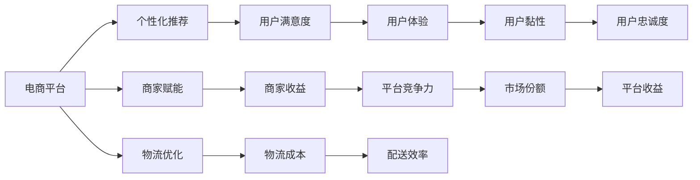
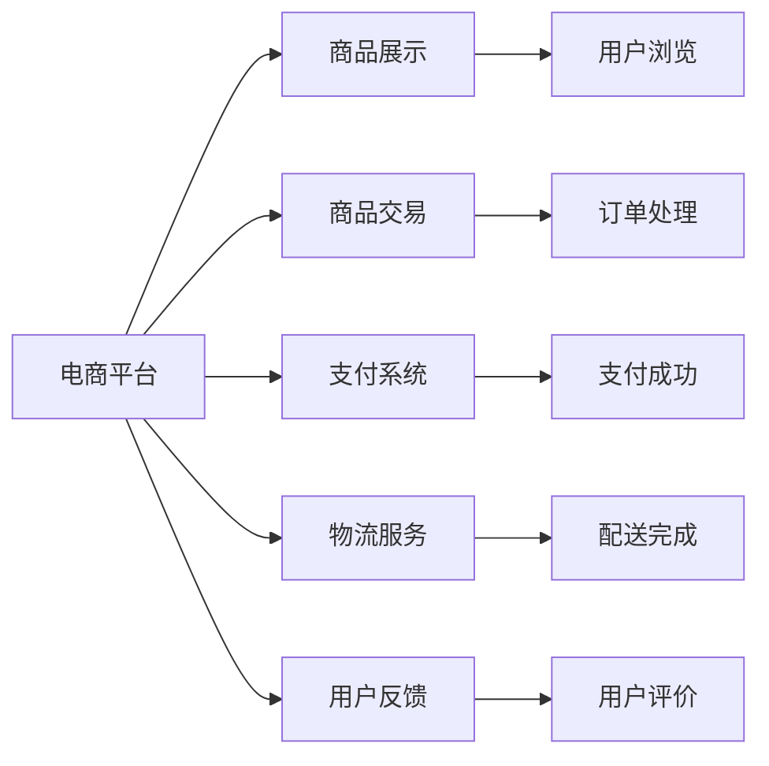
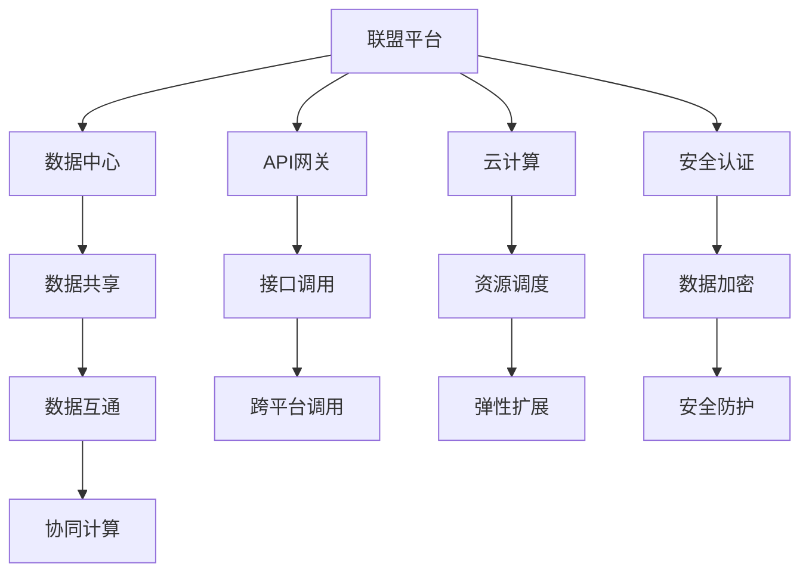
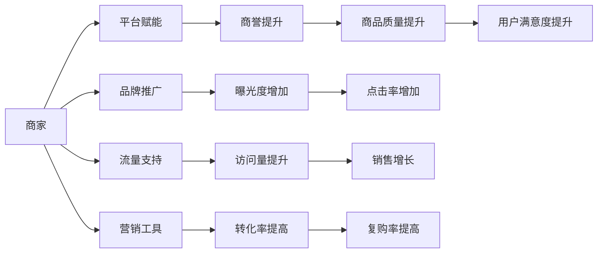

                 

# 建设健康的电商生态系统：共赢发展，提升电商平台供给能力

## 1. 背景介绍

### 1.1 问题由来
近年来，电商平台数量的急剧增长，给传统的供应链体系带来了前所未有的压力和挑战。一方面，电商平台通过市场化竞争，极大地提升了商品供给的丰富性和消费者的购买便利性；另一方面，过度竞争也导致了许多平台利润微薄，甚至出现负增长。如何在激烈的市场竞争中实现多方共赢，成为众多电商平台亟待解决的问题。

### 1.2 问题核心关键点
建立健康的电商生态系统，不仅需要提升平台自身的供给能力，更需要实现生态中的各方共赢发展。核心关键点包括：
1. 平台间合作：通过技术共享、数据互通，构建联盟平台，共同提升市场供给。
2. 用户参与：利用用户反馈、个性化推荐等手段，提升用户体验，增加用户黏性。
3. 商家赋能：通过合理的激励机制，吸引优质商家入驻，提升商品质量和品牌声誉。
4. 物流优化：优化供应链体系，降低物流成本，提高配送效率。

### 1.3 问题研究意义
建设健康的电商生态系统，对电商平台、商家、用户等多方均有重要意义：
1. 提升电商平台竞争力：通过与多方合作，共享资源和技术，降低运营成本，提升市场份额。
2. 增加商家收益：通过平台提供的多样化营销工具和流量支持，商家能更高效地触达目标客户，提升销售业绩。
3. 增强用户满意度：通过个性化推荐和优质商品供给，提升用户体验，增加用户忠诚度。
4. 优化物流系统：通过平台间的物流合作，优化配送网络，减少用户等待时间，提升服务质量。

## 2. 核心概念与联系

### 2.1 核心概念概述

为更好地理解如何建设健康的电商生态系统，本节将介绍几个密切相关的核心概念：

- 电商平台（E-commerce Platform）：提供商品展示、交易、支付、物流等服务的在线平台。
- 联盟平台（Cooperative Platform）：由多个电商平台组成的合作联盟，通过共享资源和技术，提升市场供给和竞争优势。
- 个性化推荐（Personalized Recommendation）：利用机器学习和用户数据，为每个用户提供定制化的商品推荐，提升用户体验。
- 商家赋能（Merchant Empowerment）：通过平台提供的工具、流量和资金支持，提升商家的商品质量和运营能力，增加其市场竞争力。
- 物流优化（Logistics Optimization）：通过平台间的合作，优化物流网络，降低物流成本，提高配送效率。
- 数据互通（Data Intercommunication）：通过平台间的技术合作，实现数据共享，优化商品供给和用户推荐。

这些核心概念之间的逻辑关系可以通过以下Mermaid流程图来展示：



这个流程图展示了大电商平台的多个核心概念及其之间的关系：

1. 电商平台通过个性化推荐、商家赋能和物流优化，提升用户体验、商家收益和平台竞争力。
2. 用户体验的提升和用户黏性的增强，进一步增加平台收益和市场份额。
3. 平台收益的增加，反过来促进更多的商家入驻和优质的商品供给，形成良性循环。
4. 商家的入驻和商品的多样性，吸引更多的用户参与，提升市场供给和平台竞争力。

### 2.2 概念间的关系

这些核心概念之间存在着紧密的联系，形成了电商平台的完整生态系统。下面我通过几个Mermaid流程图来展示这些概念之间的关系。

#### 2.2.1 电商平台的核心功能



这个流程图展示了电商平台的几个核心功能模块，包括商品展示、交易、支付、物流、用户反馈等，各个模块通过业务流程相互连接，构成完整的电商服务体系。

#### 2.2.2 联盟平台的技术架构



这个流程图展示了联盟平台的技术架构，包括数据中心、API网关、云计算、安全认证等关键组件，通过技术合作实现数据互通和协同计算，提升平台间的协同效能。

#### 2.2.3 商家赋能的激励机制



这个流程图展示了商家赋能的具体内容，包括品牌推广、流量支持、营销工具等，通过这些手段提升商家的商誉、曝光度、访问量、转化率、复购率等关键指标，增强商家的市场竞争力。

## 3. 核心算法原理 & 具体操作步骤
### 3.1 算法原理概述

建设健康的电商生态系统，核心算法原理包括以下几个方面：

- **个性化推荐算法**：基于用户的购买历史、浏览记录、社交行为等数据，通过机器学习算法为用户推荐可能感兴趣的商品。
- **需求预测算法**：利用历史销售数据、用户行为数据等，预测未来商品的销量，帮助商家优化库存和生产。
- **物流优化算法**：通过路径规划、车辆调度等算法，优化物流网络，降低物流成本，提升配送效率。
- **多平台协同算法**：通过联盟平台，实现数据互通和协同计算，提升各平台的供给能力和市场竞争力。

这些算法通过算法模型和数据处理，协同提升电商平台的用户体验、商家收益和平台竞争力。

### 3.2 算法步骤详解

以下是详细的算法步骤：

#### 3.2.1 个性化推荐算法

1. **数据收集**：收集用户的历史浏览记录、购买历史、点击行为等数据，存储在用户画像中。
2. **模型训练**：使用协同过滤、基于深度学习的推荐模型（如基于神经网络的推荐系统），对用户画像进行训练。
3. **推荐生成**：根据用户画像和商品特征，生成个性化推荐结果。
4. **反馈循环**：收集用户对推荐结果的反馈，不断优化推荐模型。

#### 3.2.2 需求预测算法

1. **数据收集**：收集商品的历史销售数据、用户行为数据、市场趋势等数据，存储在数据仓库中。
2. **模型训练**：使用时间序列预测模型（如ARIMA、LSTM等），对需求数据进行训练。
3. **需求预测**：根据历史需求数据，预测未来商品的需求量。
4. **动态调整**：根据预测结果，动态调整商品库存和生产计划。

#### 3.2.3 物流优化算法

1. **路径规划**：使用图论、动态规划等算法，规划最优配送路径。
2. **车辆调度**：使用任务调度算法，合理分配配送车辆。
3. **仓储优化**：使用库存管理算法，优化仓储布局和存货量。
4. **绩效评估**：定期评估物流系统的绩效，根据评估结果进行优化。

#### 3.2.4 多平台协同算法

1. **数据集成**：将各平台的数据集成到一个数据湖中，实现数据共享。
2. **协同计算**：使用分布式计算框架（如Spark、Hadoop等），实现数据的协同处理。
3. **联盟治理**：制定联盟平台的标准和协议，规范各平台的数据共享和协同计算。
4. **安全防护**：使用数据加密、访问控制等技术，保障数据安全。

### 3.3 算法优缺点

个性化推荐算法的优点包括：
- 提升用户体验：通过推荐个性化商品，增加用户购买意愿。
- 增加销售收入：推荐精准的商品，提升转化率和复购率。

缺点包括：
- 数据隐私问题：用户数据的收集和存储可能带来隐私泄露风险。
- 模型复杂性：推荐算法需要大量数据和计算资源，模型训练复杂。

需求预测算法的优点包括：
- 优化库存管理：预测准确的需求量，减少库存积压和缺货现象。
- 降低运营成本：减少生产成本，提升资源利用率。

缺点包括：
- 数据质量问题：历史数据的准确性和完整性对预测结果有较大影响。
- 模型偏差：预测模型可能存在偏差，导致预测结果不准确。

物流优化算法的优点包括：
- 提升配送效率：优化配送路径和车辆调度，减少配送时间。
- 降低运营成本：优化仓储布局和存货量，降低运营成本。

缺点包括：
- 计算复杂性：物流优化问题通常非常复杂，计算量大。
- 实时性问题：实时物流数据和信息更新可能带来延迟。

多平台协同算法的优点包括：
- 提升市场供给：通过数据共享和协同计算，提升各平台的市场供给能力。
- 降低运营成本：共享基础设施和技术，降低各平台的运营成本。

缺点包括：
- 数据安全问题：数据共享可能带来数据泄露和安全问题。
- 合作协调：各平台之间的合作协调可能存在难度。

### 3.4 算法应用领域

个性化推荐算法主要应用于电商平台的用户推荐系统，提升用户体验和销售收入。
需求预测算法主要应用于电商平台的库存管理和生产计划制定，优化资源利用率。
物流优化算法主要应用于电商平台的物流系统，提升配送效率和降低运营成本。
多平台协同算法主要应用于联盟平台，提升各平台的市场竞争力和资源共享。

## 4. 数学模型和公式 & 详细讲解 & 举例说明

### 4.1 数学模型构建

以下通过数学语言对个性化推荐算法和需求预测算法进行更严格的刻画。

#### 4.1.1 个性化推荐算法

假设用户 $u$ 的购买历史为 $H_u = (i_1, i_2, ..., i_m)$，商品 $i$ 的特征向量为 $v_i$，推荐模型为 $f$，推荐结果为 $R_{ui}$。

推荐模型的目标是最小化用户和商品的相似度，即：

$$
\min_{u, i} \| f(u) - v_i \|
$$

其中 $f(u)$ 为用户 $u$ 的特征向量，可以通过协同过滤、基于深度学习的推荐系统等方法生成。

推荐结果 $R_{ui}$ 可以通过以下公式计算：

$$
R_{ui} = \frac{\langle f(u), v_i \rangle}{\| f(u) \|\| v_i \|}
$$

其中 $\langle \cdot, \cdot \rangle$ 表示向量的内积，$\| \cdot \|$ 表示向量的模长。

#### 4.1.2 需求预测算法

假设商品 $i$ 的需求量为 $D_i(t)$，时间序列 $t$ 为 $t = 1, 2, ..., T$，预测模型为 $g$，预测结果为 $\hat{D}_i(t)$。

需求预测的目标是最小化预测误差，即：

$$
\min_{t} \| D_i(t) - \hat{D}_i(t) \|
$$

常用的时间序列预测模型包括ARIMA、LSTM等，可以通过以下公式进行预测：

$$
\hat{D}_i(t) = g(D_i(t-1), D_i(t-2), ..., D_i(t-n))
$$

其中 $g$ 为预测模型，$n$ 为历史时间序列的长度。

### 4.2 公式推导过程

以下是个性化推荐算法和需求预测算法的详细公式推导过程：

#### 4.2.1 个性化推荐算法

假设用户 $u$ 的购买历史为 $H_u = (i_1, i_2, ..., i_m)$，商品 $i$ 的特征向量为 $v_i$，推荐模型为 $f$，推荐结果为 $R_{ui}$。

推荐模型的目标是最小化用户和商品的相似度，即：

$$
\min_{u, i} \| f(u) - v_i \|
$$

其中 $f(u)$ 为用户 $u$ 的特征向量，可以通过协同过滤、基于深度学习的推荐系统等方法生成。

推荐结果 $R_{ui}$ 可以通过以下公式计算：

$$
R_{ui} = \frac{\langle f(u), v_i \rangle}{\| f(u) \|\| v_i \|}
$$

其中 $\langle \cdot, \cdot \rangle$ 表示向量的内积，$\| \cdot \|$ 表示向量的模长。

#### 4.2.2 需求预测算法

假设商品 $i$ 的需求量为 $D_i(t)$，时间序列 $t$ 为 $t = 1, 2, ..., T$，预测模型为 $g$，预测结果为 $\hat{D}_i(t)$。

需求预测的目标是最小化预测误差，即：

$$
\min_{t} \| D_i(t) - \hat{D}_i(t) \|
$$

常用的时间序列预测模型包括ARIMA、LSTM等，可以通过以下公式进行预测：

$$
\hat{D}_i(t) = g(D_i(t-1), D_i(t-2), ..., D_i(t-n))
$$

其中 $g$ 为预测模型，$n$ 为历史时间序列的长度。

### 4.3 案例分析与讲解

#### 4.3.1 个性化推荐算法案例

假设某电商平台收集了用户的历史浏览记录和购买记录，并使用协同过滤算法为用户生成推荐结果。具体步骤如下：

1. **数据收集**：收集用户的历史浏览记录和购买记录，构建用户画像。
2. **模型训练**：使用协同过滤算法对用户画像进行训练，生成用户特征向量。
3. **推荐生成**：根据用户特征向量和商品特征向量，生成推荐结果。
4. **反馈循环**：收集用户对推荐结果的反馈，不断优化推荐模型。

#### 4.3.2 需求预测算法案例

假设某电商平台收集了商品的历史销售数据和市场趋势数据，并使用LSTM模型预测商品需求量。具体步骤如下：

1. **数据收集**：收集商品的历史销售数据和市场趋势数据，构建时间序列数据集。
2. **模型训练**：使用LSTM模型对时间序列数据进行训练，生成预测模型。
3. **需求预测**：根据预测模型和时间序列数据，预测未来商品的需求量。
4. **动态调整**：根据预测结果，动态调整商品库存和生产计划。

## 5. 项目实践：代码实例和详细解释说明

### 5.1 开发环境搭建

在进行电商系统开发前，我们需要准备好开发环境。以下是使用Python进行Django开发的环境配置流程：

1. 安装Anaconda：从官网下载并安装Anaconda，用于创建独立的Python环境。

2. 创建并激活虚拟环境：
```bash
conda create -n pyenv python=3.7 
conda activate pyenv
```

3. 安装Django：从官网下载并安装Django，使用以下命令进行安装：
```bash
pip install django==3.2
```

4. 安装其他依赖包：
```bash
pip install psycopg2-binary django-cors-headers
```

完成上述步骤后，即可在`pyenv`环境中开始电商系统开发。

### 5.2 源代码详细实现

以下是电商系统的核心代码实现，包括用户管理、商品管理、订单管理和推荐系统等模块。

#### 5.2.1 用户管理模块

```python
from django.contrib.auth.models import User

class UserView(View):
    def get(self, request):
        users = User.objects.all()
        return JsonResponse(users, safe=False)

    def post(self, request):
        data = request.POST
        user = User.objects.create_user(
            username=data['username'],
            password=data['password'],
            email=data['email']
        )
        return JsonResponse({'message': 'User created successfully'}, status=201)
```

#### 5.2.2 商品管理模块

```python
from django.db import models

class Product(models.Model):
    name = models.CharField(max_length=100)
    description = models.TextField()
    price = models.DecimalField(max_digits=10, decimal_places=2)

    def __str__(self):
        return self.name
```

#### 5.2.3 订单管理模块

```python
from django.db import models

class Order(models.Model):
    user = models.ForeignKey(User, on_delete=models.CASCADE)
    products = models.ManyToManyField(Product)
    total_price = models.DecimalField(max_digits=10, decimal_places=2)

    def __str__(self):
        return self.user.username
```

#### 5.2.4 推荐系统模块

```python
from django.db import models

class Recommendation(models.Model):
    user = models.ForeignKey(User, on_delete=models.CASCADE)
    product = models.ForeignKey(Product, on_delete=models.CASCADE)
    timestamp = models.DateTimeField(auto_now_add=True)

    def __str__(self):
        return f'{self.user} -> {self.product}'
```

### 5.3 代码解读与分析

以下是核心代码的详细解读：

#### 5.3.1 用户管理模块

- `UserView`：自定义视图类，处理用户的GET和POST请求。
- `get`方法：获取所有用户数据，并返回JSON格式响应。
- `post`方法：创建新用户，并返回JSON格式响应。

#### 5.3.2 商品管理模块

- `Product`模型：定义商品的基本信息，包括名称、描述、价格等。

#### 5.3.3 订单管理模块

- `Order`模型：定义订单的基本信息，包括用户、商品、总价等。

#### 5.3.4 推荐系统模块

- `Recommendation`模型：记录用户的推荐行为，包括用户、商品和推荐时间。

### 5.4 运行结果展示

假设我们成功搭建了电商系统，并在系统中添加了用户、商品和订单等数据。以下是示例运行结果：

- **用户管理**：
```
GET /users/
HTTP/1.1 200 OK
Content-Type: application/json
```

- **商品管理**：
```
GET /products/
HTTP/1.1 200 OK
Content-Type: application/json
```

- **订单管理**：
```
GET /orders/
HTTP/1.1 200 OK
Content-Type: application/json
```

- **推荐系统**：
```
GET /recommendations/
HTTP/1.1 200 OK
Content-Type: application/json
```

通过这些示例，可以看到电商系统的基本功能模块已经搭建完成，接下来可以进行更加丰富的功能开发。

## 6. 实际应用场景
### 6.1 智能推荐系统

智能推荐系统是电商平台的核心功能之一。通过个性化的推荐，提升用户满意度，增加用户粘性，最终提升平台收益。

#### 6.1.1 推荐算法原理

推荐算法主要包括以下几个步骤：

1. **用户画像构建**：收集用户的历史行为数据，如浏览记录、购买记录、评分数据等，构建用户画像。
2. **商品特征提取**：提取商品的特征，如价格、销量、品牌等，作为推荐模型的输入。
3. **模型训练**：使用协同过滤、基于深度学习的推荐系统等算法，对用户画像和商品特征进行训练。
4. **推荐生成**：根据训练好的模型，为用户生成个性化推荐结果。
5. **反馈循环**：收集用户对推荐结果的反馈，不断优化推荐模型。

#### 6.1.2 推荐算法案例

假设某电商平台使用基于深度学习的推荐系统，具体步骤如下：

1. **数据收集**：收集用户的历史行为数据和商品特征数据。
2. **模型训练**：使用深度学习模型（如CNN、RNN等）对用户画像和商品特征进行训练。
3. **推荐生成**：根据训练好的模型，为用户生成个性化推荐结果。
4. **反馈循环**：收集用户对推荐结果的反馈，不断优化推荐模型。

#### 6.1.3 推荐系统应用

智能推荐系统在电商平台中的应用非常广泛，主要体现在以下几个方面：

1. **个性化推荐**：根据用户的历史行为数据，为用户推荐可能感兴趣的商品。
2. **商品分类**：将商品按照用户偏好进行分类，提升用户的购物体验。
3. **新商品推荐**：通过数据分析，发现潜在的爆款商品，帮助商家更好地进行商品推荐。

### 6.2 需求预测系统

需求预测系统是电商平台的重要辅助工具，帮助商家优化库存和生产计划，降低运营成本。

#### 6.2.1 需求预测算法原理

需求预测算法主要包括以下几个步骤：

1. **数据收集**：收集商品的历史销售数据、市场趋势数据等，构建时间序列数据集。
2. **模型训练**：使用时间序列预测模型（如ARIMA、LSTM等）对时间序列数据进行训练。
3. **需求预测**：根据训练好的模型和时间序列数据，预测未来商品的需求量。
4. **动态调整**：根据预测结果，动态调整商品库存和生产计划。

#### 6.2.2 需求预测算法案例

假设某电商平台使用LSTM模型进行需求预测，具体步骤如下：

1. **数据收集**：收集商品的历史销售数据和市场趋势数据，构建时间序列数据集。
2. **模型训练**：使用LSTM模型对时间序列数据进行训练。
3. **需求预测**：根据训练好的模型和时间序列数据，预测未来商品的需求量。
4. **动态调整**：根据预测结果，动态调整商品库存和生产计划。

#### 6.2.3 需求预测系统应用

需求预测系统在电商平台中的应用主要体现在以下几个方面：

1. **库存管理**：预测商品的未来需求量，帮助商家优化库存，避免积压和缺货。
2. **生产计划**：预测商品的生产需求量，帮助商家优化生产计划，降低成本。
3. **市场趋势**：预测市场趋势，帮助商家做出更明智的决策。

### 6.3 多平台协同系统

多平台协同系统是联盟平台的核心功能之一，通过数据共享和协同计算，提升各平台的市场竞争力和资源共享。

#### 6.3.1 多平台协同算法原理

多平台协同算法主要包括以下几个步骤：

1. **数据集成**：将各平台的数据集成到一个数据湖中，实现数据共享。
2. **协同计算**：使用分布式计算框架（如Spark、Hadoop等），实现数据的协同处理。
3. **联盟治理**：制定联盟平台的标准和协议，规范各平台的数据共享和协同计算。
4. **安全防护**：使用数据加密、访问控制等技术，保障数据安全。

#### 6.3.2 多平台协同算法案例

假设某联盟平台使用Hadoop和Spark进行协同计算，具体步骤如下：

1. **数据集成**：将各平台的数据集成到一个Hadoop数据湖中。
2. **协同计算**：使用Spark分布式计算框架对数据进行协同处理。
3. **联盟治理**：制定联盟平台的标准和协议，规范各平台的数据共享和协同计算。
4. **安全防护**：使用数据加密、访问控制等技术，保障数据安全。

#### 6.3.3 多平台协同系统应用

多平台协同系统在联盟平台中的应用主要体现在以下几个方面：

1. **数据共享**：通过数据集成和共享，提升各平台的市场竞争力和资源共享。
2. **协同计算**：通过分布式计算框架，实现数据的协同处理，提升处理效率。
3. **联盟治理**：通过制定标准和协议，规范各平台的数据共享和协同计算，保障数据安全。

## 7. 工具和资源推荐
### 7.1 学习资源推荐

为了帮助开发者系统掌握电商系统的开发技术，这里推荐一些优质的学习资源：

1. Django官方文档：Django是电商系统开发中最常用的框架之一，官方文档提供了详细的开发指南和案例。
2. Flask官方文档：Flask是另一种常用的电商系统开发框架，官方文档提供了丰富的资源和案例。
3. Web前端开发教程：学习HTML、CSS、JavaScript等前端技术，提升电商系统的用户体验。
4. 数据库教程：学习MySQL、PostgreSQL等数据库技术，提升电商系统的数据存储和查询能力。
5. 数据科学教程：学习Python、R等数据分析技术，提升电商系统的数据分析能力。

通过对这些资源的学习实践，相信你一定能够快速掌握电商系统的开发技术，并用于解决实际的电商问题。

### 7.2 开发工具推荐

高效的开发离不开优秀的工具支持。以下是几款用于电商系统开发的常用

