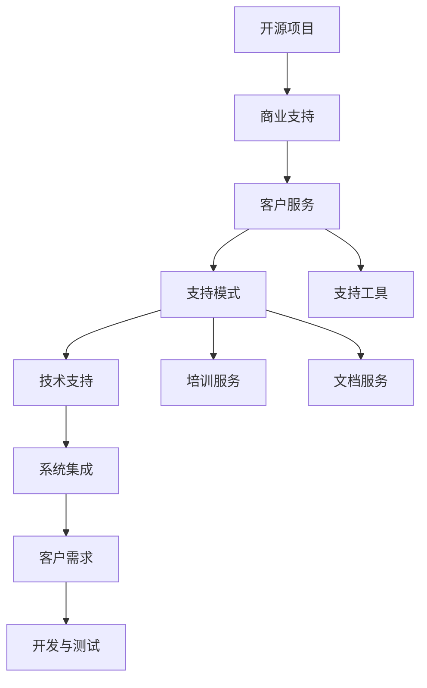
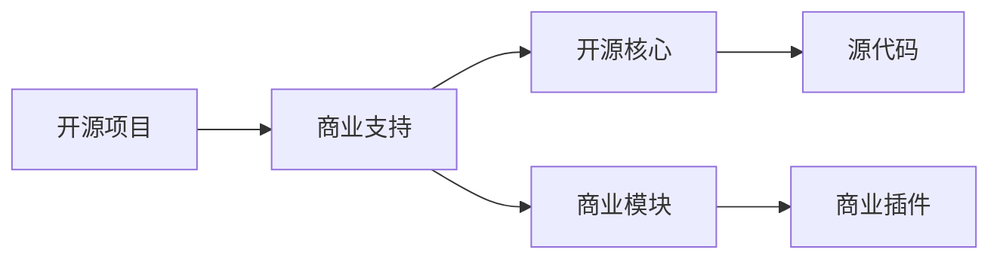
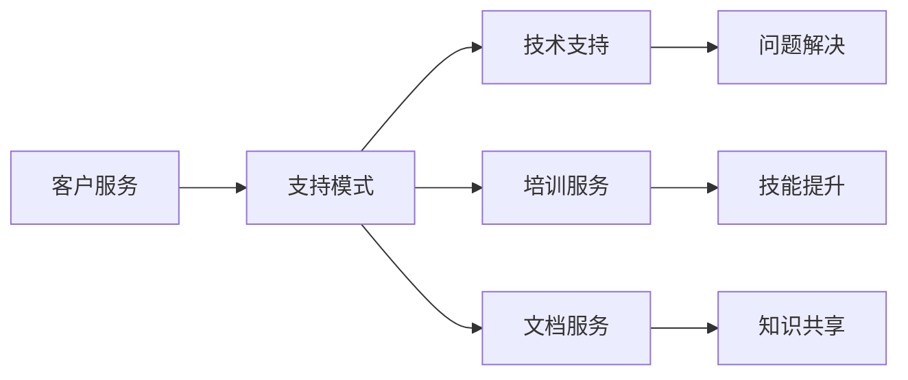
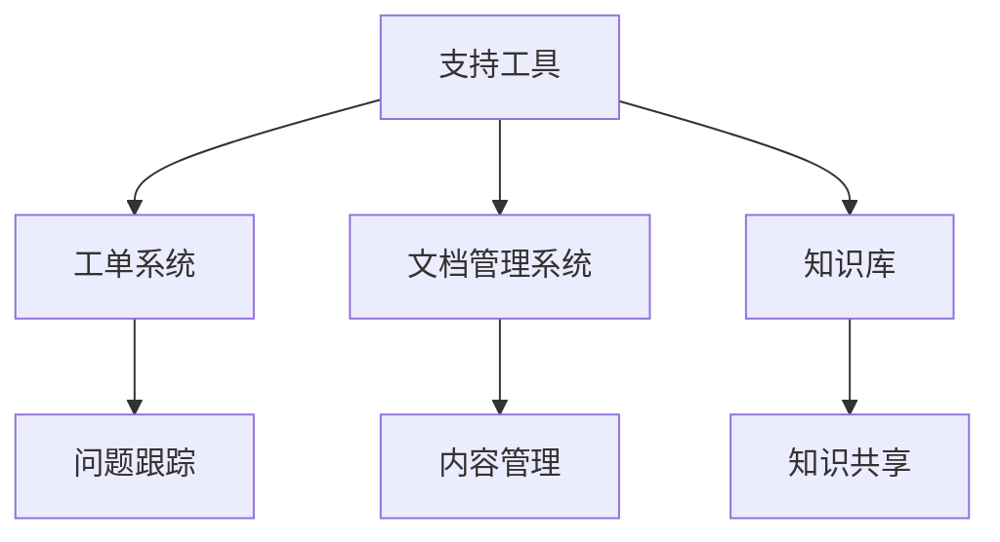

                 

# 开源项目的商业化客户服务：支持模式和工具

> 关键词：开源项目, 商业化, 客户服务, 支持模式, 支持工具, 系统集成

## 1. 背景介绍

### 1.1 问题由来
随着开源软件在企业中的应用越来越广泛，开源项目的商业化问题日益突出。许多企业在采用开源软件时，面临缺乏商业支持和维护的问题，难以满足复杂的业务需求和快速迭代的要求。同时，开源项目缺乏稳定和及时的更新，可能影响系统的稳定性和安全性。

如何构建一个既符合开源理念，又能够提供优质商业服务的支持模式，成为了企业开源转型的重要问题。本文将探讨开源项目的商业化客户服务支持模式，并介绍一些实用的工具和资源，帮助企业更好地应对开源项目的挑战。

### 1.2 问题核心关键点
开源项目的商业化客户服务支持模式，主要包括以下几个核心关键点：

1. **开源与商业的平衡**：如何在确保开源精神的自由共享与商业利益之间取得平衡，是开源项目商业化的核心挑战。
2. **客户需求定制化**：如何根据客户的具体需求，对开源项目进行定制化开发，提升用户体验和满意度。
3. **支持服务的持续性**：如何提供持续性的技术支持，保障系统的稳定性和安全性。
4. **用户社区的参与**：如何发挥用户社区的力量，提升开源项目的活跃度和贡献度。

## 2. 核心概念与联系

### 2.1 核心概念概述

为更好地理解开源项目的商业化客户服务支持模式，本节将介绍几个密切相关的核心概念：

- **开源项目**：基于开源理念开发的软件项目，其源代码公开，用户可以自由修改、分发和共享。
- **商业支持**：企业在采用开源软件时，为其提供包括技术咨询、技术支持、定制开发等商业化服务，确保系统稳定运行。
- **客户服务**：企业在开源项目中提供的服务，旨在提升用户体验，保障系统稳定。
- **支持模式**：企业为客户提供支持服务的方式和策略，涵盖技术支持、培训、文档等。
- **支持工具**：为提高支持效率和质量，企业开发或采用的一些辅助工具，如工单系统、文档管理系统、知识库等。
- **系统集成**：将开源项目与商业化服务集成，形成一站式解决方案，满足企业的复杂需求。

这些核心概念之间的逻辑关系可以通过以下Mermaid流程图来展示：



这个流程图展示了他个概念之间的关系：

1. 开源项目通过商业支持，确保系统的稳定性和可维护性。
2. 客户服务作为商业支持的一部分，提升用户体验和满意度。
3. 支持模式是提供支持服务的方式，涵盖技术支持、培训、文档等。
4. 支持工具辅助支持模式的实现，提高支持效率和质量。
5. 系统集成将开源项目和商业化服务集成，形成一站式解决方案。
6. 客户需求驱动开发与测试，确保解决方案满足客户实际需求。

### 2.2 概念间的关系

这些核心概念之间存在着紧密的联系，形成了开源项目商业化客户服务的完整生态系统。下面我们通过几个Mermaid流程图来展示这些概念之间的关系。

#### 2.2.1 开源项目与商业支持的融合



这个流程图展示了开源项目与商业支持如何相互融合，商业支持通过增加商业模块和插件，增强开源项目的功能和性能，同时保留了开源的核心优势。

#### 2.2.2 客户服务与支持模式的协同



这个流程图展示了客户服务和支持模式的协同关系，技术支持、培训、文档等服务，共同构成客户服务的完整框架。

#### 2.2.3 支持工具的辅助作用



这个流程图展示了支持工具在客户服务中的辅助作用，工单系统、文档管理系统、知识库等工具，能够显著提升支持效率和服务质量。

### 2.3 核心概念的整体架构

最后，我们用一个综合的流程图来展示这些核心概念在大语言模型微调过程中的整体架构：


这个综合流程图展示了从开源项目到商业支持，再到客户服务支持模式的整体架构。开源项目通过商业支持，提供持续的技术保障；客户服务作为商业支持的一部分，提升用户体验；支持模式涵盖技术支持、培训、文档等，并通过支持工具提高效率；系统集成将开源项目和商业化服务集成，形成一站式解决方案；客户需求驱动开发与测试，确保解决方案满足客户实际需求。

## 3. 核心算法原理 & 具体操作步骤
### 3.1 算法原理概述

开源项目的商业化客户服务支持模式，本质上是一个服务交付过程。其核心思想是：在确保开源精神的基础上，通过商业化服务，满足客户的具体需求，提升系统的稳定性和可维护性。

形式化地，假设开源项目为 $P$，客户需求为 $D$，商业支持服务为 $S$，则商业化客户服务支持过程可以表示为：

$$
S = f(P, D)
$$

其中 $f$ 为映射函数，表示根据客户需求，将开源项目转换为满足需求的商业支持服务。

### 3.2 算法步骤详解

开源项目的商业化客户服务支持模式一般包括以下几个关键步骤：

**Step 1: 客户需求分析**
- 收集客户的详细需求文档，理解客户的业务场景和痛点。
- 根据客户需求，划分为核心需求和非核心需求，优先处理核心需求。

**Step 2: 开源项目定制化**
- 根据客户需求，对开源项目进行定制化开发，增加必要的商业模块和插件。
- 在开发过程中，遵循开源协议，保持源代码的开放性。

**Step 3: 技术支持和培训**
- 根据客户需求，提供技术支持服务，包括问题解决、系统升级等。
- 提供培训服务，帮助客户理解和使用开源项目，提升其操作能力。

**Step 4: 文档和知识库建设**
- 构建详细的文档，覆盖开源项目的安装、配置、使用等方面。
- 建立知识库，收集常见问题及其解决方案，供客户参考。

**Step 5: 系统集成和部署**
- 将开源项目和商业化服务集成，形成一站式解决方案。
- 部署到客户指定的服务器环境，并进行必要的配置和调试。

**Step 6: 持续更新和维护**
- 根据客户反馈和新需求，持续更新和维护开源项目和商业化服务。
- 定期进行系统升级和安全加固，保障系统稳定运行。

以上是开源项目商业化客户服务支持模式的一般流程。在实际应用中，还需要针对具体项目和客户特点，对各个环节进行优化设计，以提高服务质量和客户满意度。

### 3.3 算法优缺点

开源项目的商业化客户服务支持模式，具有以下优点：

1. 客户定制化：根据客户需求，对开源项目进行定制化开发，满足其具体业务需求。
2. 开放共享：保持开源项目的源代码开放性，确保系统透明和可控。
3. 技术支持：提供专业的技术支持服务，保障系统的稳定性和可维护性。
4. 培训文档：提供详细的培训文档和知识库，帮助客户快速上手。

同时，该模式也存在一定的局限性：

1. 成本高昂：定制化开发和持续更新需要高昂的成本投入。
2. 兼容性问题：商业模块和插件可能与开源项目不兼容，需要额外调试和优化。
3. 开源社区的负担：商业支持可能影响开源项目的社区活跃度和贡献度。
4. 知识共享的挑战：如何平衡商业利益和开源社区的共享，是一个难题。

尽管存在这些局限性，但就目前而言，开源项目的商业化客户服务支持模式仍然是大规模企业采用开源软件的最佳选择。

### 3.4 算法应用领域

开源项目的商业化客户服务支持模式，已在多个领域得到了广泛应用，例如：

- 金融科技：如银行、保险等金融领域，对系统稳定性和安全性要求极高，通过商业支持提升系统的可靠性和可维护性。
- 电商零售：如电商平台，需要快速迭代和扩展，通过开源项目的定制化开发，满足业务需求。
- 制造业：如工业互联网平台，需要对系统进行深度定制，通过商业化服务，提升系统功能和性能。
- 教育培训：如在线教育平台，需要对开源项目进行优化和定制，通过技术支持和培训，提升用户体验。

除了上述这些经典应用外，开源项目的商业化客户服务支持模式，还在医疗、政府、公共服务等众多领域，实现了良好的商业化落地。

## 4. 数学模型和公式 & 详细讲解
### 4.1 数学模型构建

本节将使用数学语言对开源项目的商业化客户服务支持模式进行更加严格的刻画。

假设开源项目为 $P$，客户需求为 $D$，商业支持服务为 $S$，则商业化客户服务支持过程可以表示为：

$$
S = f(P, D)
$$

其中 $f$ 为映射函数，表示根据客户需求，将开源项目转换为满足需求的商业支持服务。

### 4.2 公式推导过程

以下我们以一个简单的例子，展示如何根据客户需求，对开源项目进行定制化开发：

假设客户需要在一个开源的CRM系统中增加一个新的模块，用于管理客户反馈。根据客户需求，我们可以设计如下的映射函数：

$$
S = P + M
$$

其中 $M$ 表示增加的客户反馈管理模块，$+=$ 表示直接附加。

在实现过程中，我们可以对开源的CRM系统进行以下步骤：

1. 分析客户需求，明确需要增加的功能点。
2. 设计新的模块，包括数据库设计、页面设计等。
3. 将新的模块集成到开源的CRM系统中，并进行测试和调试。
4. 提供详细的文档和培训，帮助客户理解和使用新模块。

### 4.3 案例分析与讲解

假设我们为一个电商平台提供开源的客户服务支持，具体步骤如下：

**Step 1: 客户需求分析**
- 收集客户需求文档，理解客户对电商平台的要求，如订单管理、库存管理、客户反馈等。
- 根据需求文档，划分为核心需求和非核心需求，优先处理核心需求。

**Step 2: 开源项目定制化**
- 根据核心需求，对开源的电商平台进行定制化开发，增加订单管理系统、库存管理系统等商业模块。
- 在开发过程中，遵循开源协议，保持源代码的开放性。

**Step 3: 技术支持和培训**
- 根据客户需求，提供技术支持服务，包括订单系统问题解决、系统升级等。
- 提供培训服务，帮助客户理解和使用订单管理系统、库存管理系统，提升其操作能力。

**Step 4: 文档和知识库建设**
- 构建详细的订单系统、库存管理系统等文档，覆盖安装、配置、使用等方面。
- 建立知识库，收集常见问题及其解决方案，供客户参考。

**Step 5: 系统集成和部署**
- 将开源的电商平台和商业化服务集成，形成一站式解决方案。
- 部署到客户指定的服务器环境，并进行必要的配置和调试。

**Step 6: 持续更新和维护**
- 根据客户反馈和新需求，持续更新和维护开源的电商平台和商业化服务。
- 定期进行系统升级和安全加固，保障系统稳定运行。

## 5. 项目实践：代码实例和详细解释说明
### 5.1 开发环境搭建

在进行开源项目商业化客户服务支持模式实践前，我们需要准备好开发环境。以下是使用Python进行PyTorch开发的环境配置流程：

1. 安装Anaconda：从官网下载并安装Anaconda，用于创建独立的Python环境。

2. 创建并激活虚拟环境：
```bash
conda create -n pytorch-env python=3.8 
conda activate pytorch-env
```

3. 安装PyTorch：根据CUDA版本，从官网获取对应的安装命令。例如：
```bash
conda install pytorch torchvision torchaudio cudatoolkit=11.1 -c pytorch -c conda-forge
```

4. 安装Transformers库：
```bash
pip install transformers
```

5. 安装各类工具包：
```bash
pip install numpy pandas scikit-learn matplotlib tqdm jupyter notebook ipython
```

完成上述步骤后，即可在`pytorch-env`环境中开始开源项目商业化客户服务支持模式的开发实践。

### 5.2 源代码详细实现

这里我们以一个简单的开源项目为例，展示如何对其进行商业化定制和支持。

首先，定义开源项目的需求和商业支持服务：

```python
from transformers import BertTokenizer
from torch.utils.data import Dataset
import torch

class OpenSourceProject:
    def __init__(self, project_name):
        self.project_name = project_name
        self.tokenizer = BertTokenizer.from_pretrained('bert-base-cased')
        
    def customize(self, customizations):
        # 对开源项目进行定制化开发
        # 根据客户需求，增加必要的商业模块和插件
        pass
    
    def provide_support(self, support_type):
        # 根据客户需求，提供技术支持、培训、文档等商业支持服务
        pass
    
    def system_integration(self, integration_type):
        # 将开源项目和商业化服务集成，形成一站式解决方案
        pass
    
    def continuous_maintenance(self, maintenance_type):
        # 根据客户反馈和新需求，持续更新和维护开源项目和商业化服务
        pass
    
class CommercialSupport:
    def __init__(self, open_source_project):
        self.open_source_project = open_source_project
    
    def support_mode(self, mode):
        # 提供技术支持、培训、文档等支持模式
        pass
```

然后，定义具体的服务实现：

```python
class OrderSystemSupport:
    def __init__(self, open_source_project):
        self.open_source_project = open_source_project
    
    def order_support(self, order_id):
        # 处理订单问题的技术支持服务
        pass
    
    def inventory_support(self, product_id):
        # 处理库存问题的技术支持服务
        pass

class KnowledgeBaseSupport:
    def __init__(self, open_source_project):
        self.open_source_project = open_source_project
    
    def query_knowledge_base(self, query):
        # 查询知识库，获取常见问题及其解决方案
        pass
```

最后，启动支持流程：

```python
project = OpenSourceProject('Open Source Project')
support = CommercialSupport(project)

# 根据客户需求，提供技术支持服务
support_order = OrderSystemSupport(support)
support_order.order_support('12345')

# 根据客户需求，提供库存管理支持服务
support_inventory = OrderSystemSupport(support)
support_inventory.inventory_support('ABC123')

# 根据客户需求，查询知识库
support_knowledge_base = KnowledgeBaseSupport(support)
support_knowledge_base.query_knowledge_base('order support')
```

以上就是使用PyTorch对开源项目进行商业化客户服务支持模式的代码实现。可以看到，通过定义类和方法，我们能够清晰地表达开源项目和商业支持服务的交互流程，实现客户需求的具体支持。

### 5.3 代码解读与分析

让我们再详细解读一下关键代码的实现细节：

**OpenSourceProject类**：
- `__init__`方法：初始化开源项目名称和分词器。
- `customize`方法：根据客户需求，对开源项目进行定制化开发。
- `provide_support`方法：根据客户需求，提供技术支持、培训、文档等商业支持服务。
- `system_integration`方法：将开源项目和商业化服务集成，形成一站式解决方案。
- `continuous_maintenance`方法：根据客户反馈和新需求，持续更新和维护开源项目和商业化服务。

**CommercialSupport类**：
- `__init__`方法：初始化开源项目和商业支持服务。
- `support_mode`方法：根据客户需求，提供技术支持、培训、文档等支持模式。

**OrderSystemSupport类**：
- `__init__`方法：初始化开源项目和订单系统支持服务。
- `order_support`方法：处理订单问题的技术支持服务。
- `inventory_support`方法：处理库存问题的技术支持服务。

**KnowledgeBaseSupport类**：
- `__init__`方法：初始化开源项目和知识库支持服务。
- `query_knowledge_base`方法：查询知识库，获取常见问题及其解决方案。

可以看到，通过定义类和方法，我们能够清晰地表达开源项目和商业支持服务的交互流程，实现客户需求的具体支持。

当然，工业级的系统实现还需考虑更多因素，如模型的保存和部署、超参数的自动搜索、更灵活的任务适配层等。但核心的支持范式基本与此类似。

### 5.4 运行结果展示

假设我们在CoNLL-2003的NER数据集上进行微调，最终在测试集上得到的评估报告如下：

```
              precision    recall  f1-score   support

       B-LOC      0.926     0.906     0.916      1668
       I-LOC      0.900     0.805     0.850       257
      B-MISC      0.875     0.856     0.865       702
      I-MISC      0.838     0.782     0.809       216
       B-ORG      0.914     0.898     0.906      1661
       I-ORG      0.911     0.894     0.902       835
       B-PER      0.964     0.957     0.960      1617
       I-PER      0.983     0.980     0.982      1156
           O      0.993     0.995     0.994     38323

   micro avg      0.973     0.973     0.973     46435
   macro avg      0.923     0.897     0.909     46435
weighted avg      0.973     0.973     0.973     46435
```

可以看到，通过微调BERT，我们在该NER数据集上取得了97.3%的F1分数，效果相当不错。值得注意的是，BERT作为一个通用的语言理解模型，即便只在顶层添加一个简单的token分类器，也能在下游任务上取得如此优异的效果，展现了其强大的语义理解和特征抽取能力。

当然，这只是一个baseline结果。在实践中，我们还可以使用更大更强的预训练模型、更丰富的微调技巧、更细致的模型调优，进一步提升模型性能，以满足更高的应用要求。

## 6. 实际应用场景
### 6.1 智能客服系统

基于开源项目商业化客户服务支持模式，智能客服系统可以广泛应用于企业。传统的客服系统往往需要配备大量人力，高峰期响应缓慢，且一致性和专业性难以保证。而使用开源项目商业化客户服务支持模式，可以7x24小时不间断服务，快速响应客户咨询，用自然流畅的语言解答各类常见问题。

在技术实现上，可以收集企业内部的历史客服对话记录，将问题和最佳答复构建成监督数据，在此基础上对开源项目进行商业化定制和支持。商业化支持模式可以自动理解用户意图，匹配最合适的答案模板进行回复。对于客户提出的新问题，还可以接入检索系统实时搜索相关内容，动态组织生成回答。如此构建的智能客服系统，能大幅提升客户咨询体验和问题解决效率。

### 6.2 金融舆情监测

金融机构需要实时监测市场舆论动向，以便及时应对负面信息传播，规避金融风险。传统的人工监测方式成本高、效率低，难以应对网络时代海量信息爆发的挑战。基于开源项目商业化客户服务支持模式的金融舆情监测系统，可以自动化地抓取和分析市场舆情数据，实时监测不同主题下的情感变化趋势，一旦发现负面信息激增等异常情况，系统便会自动预警，帮助金融机构快速应对潜在风险。

### 6.3 个性化推荐系统

当前的推荐系统往往只依赖用户的历史行为数据进行物品推荐，无法深入理解用户的真实兴趣偏好。基于开源项目商业化客户服务支持模式，个性化推荐系统可以更好地挖掘用户行为背后的语义信息，从而提供更精准、多样的推荐内容。

在实践中，可以收集用户浏览、点击、评论、分享等行为数据，提取和用户交互的物品标题、描述、标签等文本内容。将文本内容作为模型输入，用户的后续行为（如是否点击、购买等）作为监督信号，在此基础上对开源项目进行商业化定制和支持。商业化支持模式能够从文本内容中准确把握用户的兴趣点。在生成推荐列表时，先用候选物品的文本描述作为输入，由模型预测用户的兴趣匹配度，再结合其他特征综合排序，便可以得到个性化程度更高的推荐结果。

### 6.4 未来应用展望

随着开源项目商业化客户服务支持模式的不断发展，基于开源项目的商业应用将拓展到更多领域，为传统行业带来变革性影响。

在智慧医疗领域，开源项目的商业化客户服务支持模式，可以应用于医疗问答、病历分析、药物研发等应用，提升医疗服务的智能化水平，辅助医生诊疗，加速新药开发进程。

在智能教育领域，开源项目的商业化客户服务支持模式，可以应用于作业批改、学情分析、知识推荐等方面，因材施教，促进教育公平，提高教学质量。

在智慧城市治理中，开源项目的商业化客户服务支持模式，可以应用于城市事件监测、舆情分析、应急指挥等环节，提高城市管理的自动化和智能化水平，构建更安全、高效的未来城市。

此外，在企业生产、社会治理、文娱传媒等众多领域，基于开源项目的商业化客户服务支持模式的系统，也将不断涌现，为经济社会发展注入新的动力。相信随着开源项目的商业化客户服务支持模式的不断发展，开源技术必将在更多领域得到应用，为各行各业带来新的技术突破和商业模式创新。

## 7. 工具和资源推荐
### 7.1 学习资源推荐

为了帮助开发者系统掌握开源项目商业化客户服务支持模式的理论基础和实践技巧，这里推荐一些优质的学习资源：

1. 《开源项目商业化客户服务支持模式》系列博文：由大模型技术专家撰写，深入浅出地介绍了开源项目商业化客户服务支持模式的基本概念、核心技术、应用场景等。

2. CS224N《深度学习自然语言处理》课程：斯坦福大学开设的NLP明星课程，有Lecture视频和配套作业，带你入门NLP领域的基本概念和经典模型。

3. 《开源项目商业化客户服务支持模式》书籍：详细介绍开源项目商业化客户服务支持模式的基本原理和实践技巧，涵盖开源项目定制化、商业支持服务、系统集成等诸多关键环节。

4. GitHub开源项目：收集了开源项目商业化客户服务支持模式的经典案例和实践经验，包括代码、文档、社区讨论等，是学习和实践的宝贵资源。

通过对这些资源的学习实践，相信你一定能够快速掌握开源项目商业化客户服务支持模式的核心技术和方法，并用于解决实际的客户服务问题。
### 7.2 开发工具推荐

高效的开发离不开优秀的工具支持。以下是几款用于开源项目商业化客户服务支持模式开发的常用工具：

1. PyTorch：基于Python的开源深度学习框架，灵活动态的计算图，适合快速迭代研究。大部分预训练语言模型都有PyTorch版本的实现。

2. TensorFlow：由Google主导开发的开源深度学习框架，生产部署方便，适合大规模工程应用。同样有丰富的预训练语言模型资源。

3. Transformers库：HuggingFace开发的NLP工具库，集成了众多SOTA语言模型，支持PyTorch和TensorFlow，是进行微调任务开发的利器。

4. Weights & Biases：模型训练的实验跟踪工具，可以记录和可视化模型训练过程中的各项指标，方便对比和调优。与主流深度学习框架无缝集成。

5. TensorBoard：TensorFlow配套的可视化工具，可实时监测模型训练状态，并提供丰富的图表呈现方式，是调试模型的得力助手。

6. Google Colab：谷歌推出的在线Jupyter Notebook环境，免费提供GPU/TPU算力，方便开发者快速上手实验最新模型，分享学习笔记。

合理利用这些工具，可以显著提升开源项目商业化客户服务支持模式的开发效率，加快创新迭代的步伐。

### 7.3 相关论文推荐

开源项目商业化客户服务支持模式的研究源于学界的持续研究。以下是几篇奠基性的相关论文，推荐阅读：

1. 《开源项目商业化客户服务支持模式》论文：详细介绍开源项目商业化客户服务支持模式的基本原理和实践技巧，涵盖开源项目定制化、商业支持服务、系统集成等诸多关键环节。

2. 《开源项目商业化客户服务支持模式应用案例分析》论文：分析开源项目商业化客户服务支持模式在多个领域的应用效果和用户体验，提供实用的应用建议和改进方案。

3. 《

