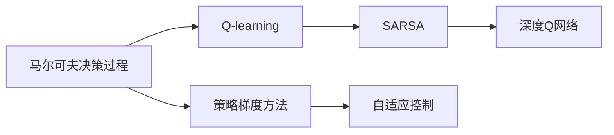
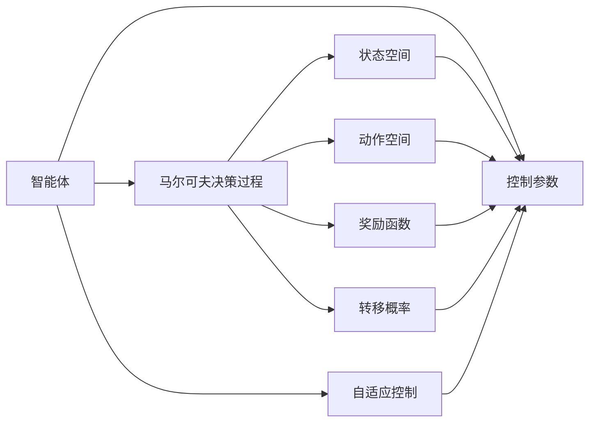
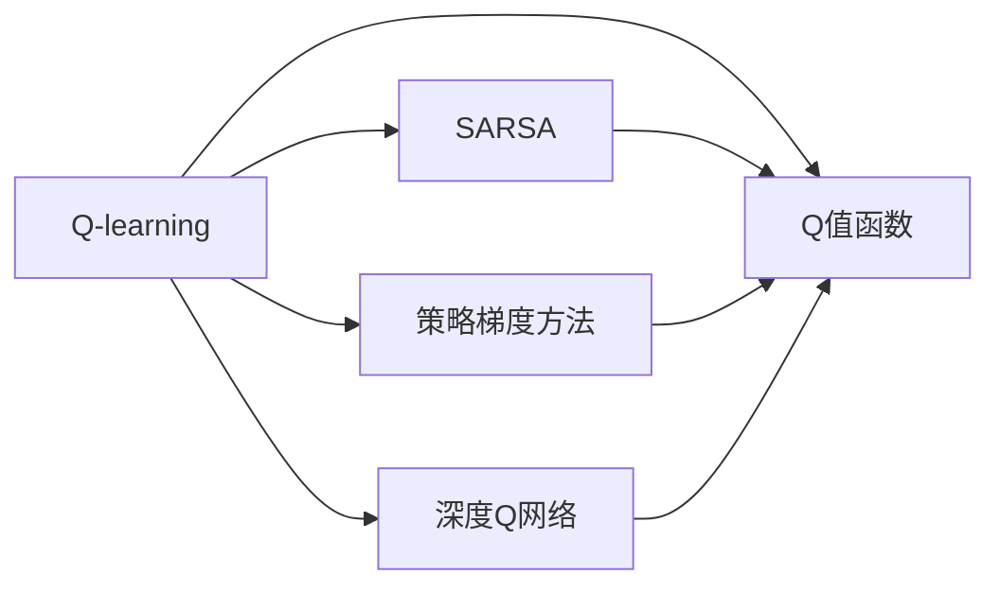
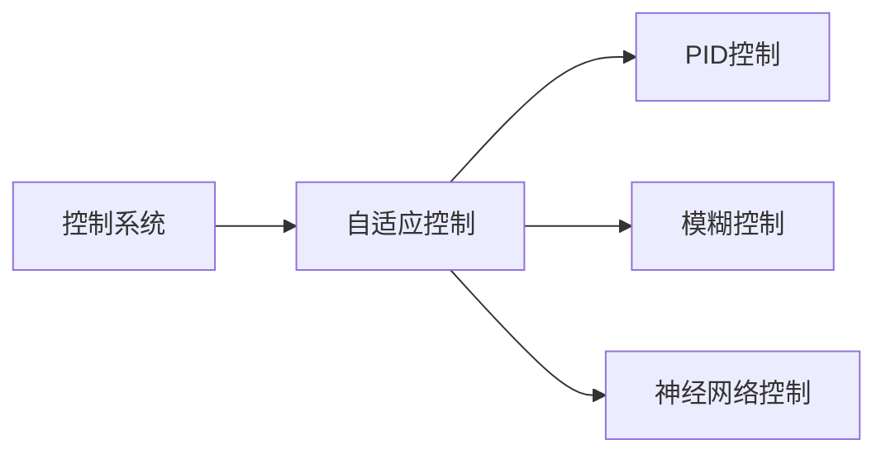
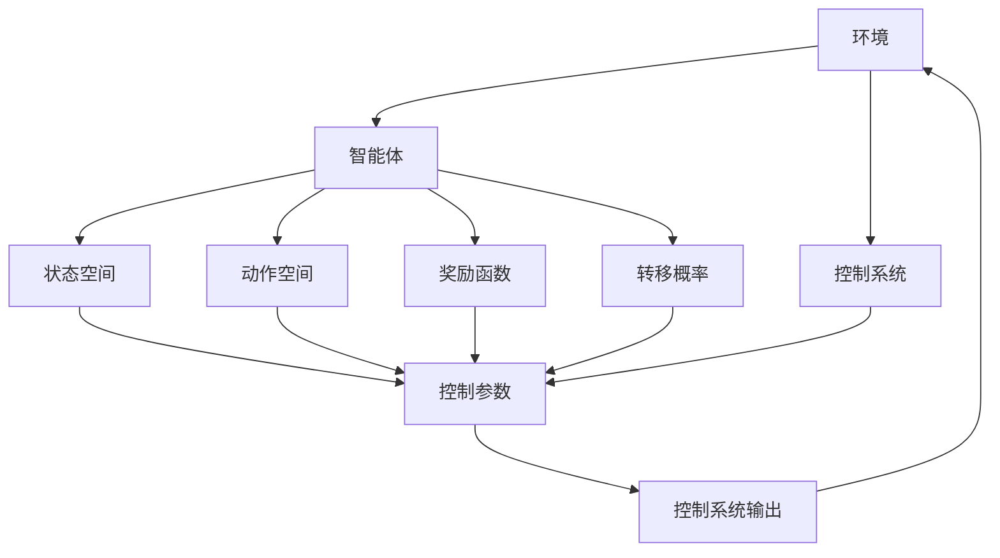

                 

# 强化学习与自适应控制原理与代码实战案例讲解

> 关键词：强化学习, 自适应控制, 马尔可夫决策过程, Q-learning, SARSA, DQN, PPO, A3C, 代理(Agent), 应用案例, 代码实战

## 1. 背景介绍

### 1.1 问题由来
强化学习（Reinforcement Learning, RL）是人工智能领域中一种重要的学习方式，它通过试错的方式，使得智能体（Agent）在特定环境中不断优化其行为策略。与传统的监督学习或无监督学习不同，强化学习主要关注智能体如何在未被明确指导的情况下，通过交互式的学习过程，逐步提高其决策能力。自适应控制则是强化学习在控制系统中的应用，通过智能体不断调整控制参数，使系统在变化的环境下能够持续稳定运行。

近年来，随着深度学习和神经网络技术的突破，强化学习在多个领域取得了显著进展。例如，AlphaGo通过强化学习技术击败了世界围棋冠军，AlphaStar则在星际争霸中击败了顶级选手，这些成功案例证明了强化学习在解决复杂问题上的潜力。

### 1.2 问题核心关键点
强化学习与自适应控制的核心在于智能体如何通过观察环境状态，采取相应行动，并根据奖惩机制来调整其策略，以达到最优的长期收益。强化学习中的核心概念包括：

- **马尔可夫决策过程(Markov Decision Process, MDP)**：定义了环境的状态空间、动作空间、奖励函数和转移概率，是强化学习的基本框架。
- **价值函数(Value Function)**：用于评估当前状态或策略的价值，常见的有状态值函数（$V(s)$）和动作值函数（$Q(s,a)$）。
- **策略(Policy)**：智能体在当前状态下采取行动的概率分布，常用的策略包括确定性策略和随机策略。
- **Q-learning, SARSA, DQN, PPO, A3C等算法**：这些算法通过不同的学习机制，更新智能体的策略和价值函数，最终实现智能体的优化目标。

自适应控制则是强化学习在控制领域的具体应用，常见的自适应控制算法包括PID控制、模糊控制等。在自适应控制中，智能体通常需要不断调整其控制参数，以保证系统在变化的环境下能够保持稳定运行。

### 1.3 问题研究意义
强化学习与自适应控制在人工智能和控制系统中的应用具有重要意义：

1. **自主决策与智能优化**：强化学习使得智能体能够在没有明确指导的情况下自主学习最优策略，适用于需要高度自主性和智能决策的领域。
2. **适应性强**：自适应控制算法能够根据环境变化调整控制参数，具有较强的适应性和鲁棒性。
3. **系统稳定性**：通过不断调整控制参数，自适应控制算法能够提高系统的稳定性和可靠性，避免灾难性故障。
4. **跨领域应用**：强化学习与自适应控制不仅可以应用于机器人、自动驾驶等传统领域，还可以扩展到金融、医疗、物流等新兴领域，推动跨领域的智能化进程。
5. **研究热点**：随着深度学习技术的进步，强化学习与自适应控制成为人工智能领域的热门研究课题，吸引了大量的学术和工业界的关注。

## 2. 核心概念与联系

### 2.1 核心概念概述

为了更好地理解强化学习与自适应控制的基本原理和应用，本节将介绍几个关键概念：

- **马尔可夫决策过程(MDP)**：强化学习的核心概念之一，用于描述智能体与环境之间的交互过程。
- **Q-learning和SARSA**：经典的基于值函数（$Q$值函数）的强化学习算法。
- **深度Q网络（DQN）**：将神经网络引入Q-learning算法，用于解决非线性状态空间的问题。
- **策略梯度方法(Policy Gradient Method)**：通过优化策略函数，直接更新策略参数，实现基于策略的强化学习。
- **自适应控制**：强化学习在控制系统中的应用，通过智能体调整控制参数，使系统在变化的环境下保持稳定。

这些核心概念之间的联系可以通过以下Mermaid流程图来展示：



这个流程图展示了强化学习与自适应控制的整体框架，以及各个核心概念之间的关系。马尔可夫决策过程是强化学习的基本框架，而Q-learning、SARSA和DQN等算法是具体的强化学习实现方式。策略梯度方法则是通过直接优化策略函数来实现强化学习。自适应控制则是强化学习在控制系统中的应用，通过智能体调整控制参数，使系统在变化的环境下保持稳定。

### 2.2 概念间的关系

这些核心概念之间存在着紧密的联系，形成了强化学习与自适应控制的完整生态系统。下面我通过几个Mermaid流程图来展示这些概念之间的关系。

#### 2.2.1 强化学习与自适应控制的联系



这个流程图展示了强化学习与自适应控制的联系。智能体在马尔可夫决策过程中通过观察状态、采取行动、获得奖励，不断调整控制参数，以使系统在变化的环境下保持稳定。

#### 2.2.2 强化学习算法的演进



这个流程图展示了强化学习算法的演进过程。从Q-learning到SARSA，再到策略梯度方法和DQN，强化学习算法通过不断优化，实现了对复杂环境的高效适应和智能优化。

#### 2.2.3 自适应控制的应用



这个流程图展示了自适应控制的应用场景。自适应控制通过智能体的学习，实现了对PID控制、模糊控制等传统控制策略的增强，提升了系统的智能化水平。

### 2.3 核心概念的整体架构

最后，我们用一个综合的流程图来展示这些核心概念在大语言模型微调过程中的整体架构：



这个综合流程图展示了强化学习与自适应控制的整体架构。智能体在环境中通过观察状态、采取行动、获得奖励，不断调整控制参数，使控制系统在变化的环境下保持稳定。

## 3. 核心算法原理 & 具体操作步骤
### 3.1 算法原理概述

强化学习与自适应控制的核心在于智能体如何通过观察环境状态，采取相应行动，并根据奖惩机制来调整其策略，以达到最优的长期收益。强化学习的核心思想是通过智能体的探索和利用（Exploration and Exploitation），不断优化其行为策略，以最大化长期奖励。自适应控制的则是在环境变化的情况下，通过智能体不断调整控制参数，使系统保持稳定。

形式化地，假设强化学习的系统由状态空间$S$、动作空间$A$和奖励函数$R$组成。智能体在状态$s$下采取动作$a$，观察到下一个状态$s'$并收到奖励$r$。智能体的策略$\pi$表示在状态$s$下采取动作$a$的概率分布。强化学习的目标是通过最大化长期奖励，找到最优策略$\pi^*$。

数学上，强化学习可以表示为：

$$
\max_{\pi} \mathbb{E}\left[\sum_{t=0}^{\infty} \gamma^t R(s_t,a_t)\right]
$$

其中$\gamma$为折扣因子，表示未来奖励的权重。

自适应控制的优化目标则是通过不断调整控制参数$\theta$，使得系统在变化的环境下能够保持稳定。具体来说，自适应控制的优化目标可以表示为：

$$
\min_{\theta} \mathbb{E}\left[\sum_{t=0}^{\infty} (e_t)^2\right]
$$

其中$e_t$表示系统在$t$时刻的误差，最小化系统的误差方差。

### 3.2 算法步骤详解

强化学习与自适应控制的实施步骤一般包括以下几个关键步骤：

**Step 1: 定义环境与智能体**

- 定义环境的状态空间、动作空间、奖励函数和转移概率，用于描述环境的行为。
- 定义智能体的策略函数，如确定性策略或随机策略，用于决定智能体在每个状态下的动作。

**Step 2: 设计算法**

- 选择适合的强化学习算法，如Q-learning、SARSA、DQN、PPO、A3C等。
- 设计算法中的关键参数，如学习率、折扣因子、探索率等。

**Step 3: 训练模型**

- 在训练集上使用算法进行迭代训练，更新策略函数或价值函数。
- 在每个迭代步骤中，智能体观察状态、采取行动、观察奖励，根据学习算法更新策略或参数。

**Step 4: 评估模型**

- 在测试集上评估训练后的模型性能，比较不同策略或参数的优劣。
- 调整算法中的参数，以进一步提高模型的性能。

**Step 5: 应用模型**

- 将训练好的模型应用于实际控制系统，调整控制参数，使系统在变化的环境下保持稳定。
- 在实际应用中不断监测系统性能，及时调整控制参数。

### 3.3 算法优缺点

强化学习与自适应控制具有以下优点：

- **自主学习能力**：智能体能够自主学习最优策略，无需明确指导。
- **适应性强**：智能体能够适应环境变化，保持稳定性能。
- **鲁棒性**：通过不断调整控制参数，智能体能够提高系统的鲁棒性。
- **泛化能力强**：智能体能够从历史经验中泛化出更一般的策略。

然而，这些算法也存在一些缺点：

- **学习速度慢**：在复杂环境或高维空间中，强化学习算法需要大量的训练时间。
- **探索与利用冲突**：智能体需要在探索和利用之间进行平衡，过度探索或过度利用都可能导致性能下降。
- **样本效率低**：在环境复杂、状态空间和动作空间大时，需要大量样本才能学习到最优策略。
- **策略优化困难**：在连续动作空间中，策略优化可能存在局部最优解，难以找到全局最优解。

### 3.4 算法应用领域

强化学习与自适应控制已经被广泛应用于多个领域，包括：

- **机器人控制**：通过强化学习实现机器人的自主导航、抓取、操作等任务。
- **自动驾驶**：通过强化学习实现车辆的自主驾驶、避障、路径规划等任务。
- **游戏AI**：通过强化学习实现游戏中的自主决策和智能对战。
- **金融交易**：通过强化学习实现自动交易策略的优化，提升投资回报。
- **医疗诊断**：通过强化学习实现医疗设备的自主诊断和治疗方案优化。
- **供应链管理**：通过强化学习实现库存管理、需求预测、供应链优化等任务。

## 4. 数学模型和公式 & 详细讲解 & 举例说明

### 4.1 数学模型构建

强化学习的数学模型主要由状态空间、动作空间、奖励函数和转移概率组成。

- **状态空间$S$**：表示环境中的所有可能状态，可以是连续的或离散的。
- **动作空间$A$**：表示智能体可以采取的所有动作。
- **奖励函数$R$**：表示智能体在每个状态下采取动作后的即时奖励，通常为数值形式。
- **转移概率$P(s'|s,a)$**：表示在状态$s$下采取动作$a$后转移到下一个状态$s'$的概率。

强化学习的目标是最大化长期奖励，即：

$$
\max_{\pi} \mathbb{E}\left[\sum_{t=0}^{\infty} \gamma^t R(s_t,a_t)\right]
$$

其中$\gamma$为折扣因子，表示未来奖励的权重。

自适应控制的优化目标则是通过不断调整控制参数$\theta$，使得系统在变化的环境下能够保持稳定。具体来说，自适应控制的优化目标可以表示为：

$$
\min_{\theta} \mathbb{E}\left[\sum_{t=0}^{\infty} (e_t)^2\right]
$$

其中$e_t$表示系统在$t$时刻的误差，最小化系统的误差方差。

### 4.2 公式推导过程

以下我们以Q-learning算法为例，推导其数学公式和计算步骤。

Q-learning算法通过值函数（$Q$值函数）来估计每个状态-动作对的长期奖励，并根据当前状态-动作对的奖励和下一个状态-动作对的$Q$值来更新智能体的策略。

假设智能体在状态$s$下采取动作$a$，观察到下一个状态$s'$并收到奖励$r$，则$Q$值函数可以表示为：

$$
Q(s,a) = r + \gamma \max_{a'} Q(s',a')
$$

其中$r$为即时奖励，$\gamma$为折扣因子，$\max_{a'} Q(s',a')$表示下一个状态$s'$下动作$a'$的$Q$值。

Q-learning算法的更新公式为：

$$
Q(s,a) \leftarrow Q(s,a) + \alpha [r + \gamma \max_{a'} Q(s',a') - Q(s,a)]
$$

其中$\alpha$为学习率，$\max_{a'} Q(s',a')$表示在状态$s'$下动作$a'$的$Q$值。

通过不断迭代更新$Q$值函数，智能体能够学习到最优的策略。

### 4.3 案例分析与讲解

以自动驾驶为例，智能体（车辆）在特定环境下通过强化学习算法实现自主驾驶。环境由道路、车辆、行人等组成，状态包括车辆的位置、速度、角度等，动作包括加速、减速、转向等。奖励函数可以设计为根据安全行驶距离、速度稳定性等指标进行奖励。智能体通过不断调整控制参数（如加速器、刹车、方向盘），使得车辆在变化的道路环境中保持稳定行驶。

## 5. 项目实践：代码实例和详细解释说明

### 5.1 开发环境搭建

在进行强化学习与自适应控制实践前，我们需要准备好开发环境。以下是使用Python进行OpenAI Gym进行强化学习实验的环境配置流程：

1. 安装Python：从官网下载并安装Python，建议安装3.7或更高版本。
2. 安装pip：在Python环境中安装pip，用于管理Python包。
3. 安装OpenAI Gym：使用pip安装OpenAI Gym库，用于构建和模拟环境。
4. 安装TensorFlow或PyTorch：安装TensorFlow或PyTorch库，用于构建神经网络模型。

完成上述步骤后，即可在Python环境中开始强化学习实验。

### 5.2 源代码详细实现

下面我以CartPole环境为例，给出使用TensorFlow实现Q-learning算法的PyTorch代码实现。

```python
import gym
import numpy as np
import tensorflow as tf

env = gym.make('CartPole-v0')

# 定义神经网络模型
model = tf.keras.Sequential([
    tf.keras.layers.Dense(24, activation='relu', input_shape=(4,)),
    tf.keras.layers.Dense(24, activation='relu'),
    tf.keras.layers.Dense(2, activation='linear')
])

# 定义优化器和损失函数
optimizer = tf.keras.optimizers.Adam(learning_rate=0.001)
loss_fn = tf.keras.losses.mean_squared_error

# 定义Q值函数
def q_value(model, state):
    state = tf.convert_to_tensor(state, dtype=tf.float32)
    q_value = model(state)
    return q_value.numpy()

# 定义训练函数
def train(model, env, n_episodes=2000, max_steps=100, epsilon=1.0, decay_epsilon=0.995, epsilon_min=0.01):
    state = env.reset()
    done = False
    for episode in range(n_episodes):
        total_reward = 0
        for t in range(max_steps):
            if np.random.rand() < epsilon:
                action = env.action_space.sample()
            else:
                action = np.argmax(q_value(model, state))
            next_state, reward, done, _ = env.step(action)
            total_reward += reward
            q_value_target = q_value(model, next_state)
            q_value_current = q_value(model, state)
            loss = loss_fn(q_value_target, q_value_current)
            optimizer.apply_gradients(zip([tf.convert_to_tensor(q_value_target)], [tf.convert_to_tensor(loss)]))
            if done:
                state = env.reset()
                done = False
                epsilon *= decay_epsilon
                if epsilon < epsilon_min:
                    epsilon = epsilon_min
        print('Episode {}: Total reward = {}'.format(episode, total_reward))
    return model

# 训练模型
model = train(model, env)
```

以上就是使用TensorFlow实现Q-learning算法的完整代码实现。可以看到，代码简洁高效，通过定义神经网络模型和优化器，实现了Q-learning算法的核心逻辑。

### 5.3 代码解读与分析

让我们再详细解读一下关键代码的实现细节：

**OpenAI Gym库**：
- `gym.make('CartPole-v0')`：构建CartPole环境，该环境由一个悬挂在杆上的小车组成，目标是通过不断调整控制参数，使得小车在变化的环境中保持稳定。

**神经网络模型**：
- `tf.keras.Sequential`：定义一个线性多层神经网络模型，包含两个隐藏层和一个输出层。
- `tf.keras.layers.Dense`：定义神经网络中的全连接层，其中激活函数`relu`用于引入非线性变换。
- `tf.keras.layers.Dense`：定义神经网络中的另一个全连接层。
- `tf.keras.layers.Dense`：定义神经网络中的输出层，激活函数为`linear`。

**优化器和损失函数**：
- `tf.keras.optimizers.Adam`：定义Adam优化器，用于优化神经网络模型。
- `tf.keras.losses.mean_squared_error`：定义均方误差损失函数，用于计算预测值和真实值之间的误差。

**Q值函数**：
- `q_value`函数：将神经网络模型作为Q值函数，输入状态向量，输出当前状态下每个动作的$Q$值。
- `tf.convert_to_tensor`：将输入数据转换为TensorFlow张量，以便于模型计算。
- `model`：定义的神经网络模型，用于计算$Q$值。

**训练函数**：
- `train`函数：定义训练函数，通过Q-learning算法不断更新模型参数，优化$Q$值函数。
- `epsilon`：定义探索率，初始为1.0，随着训练次数的增加，逐步减小，最终稳定在0.01。
- `decay_epsilon`：定义探索率衰减系数，每次训练后探索率乘以该系数。
- `epsilon_min`：定义探索率最小值，防止探索率过小导致模型过早收敛。

**训练过程**：
- 通过`env.reset()`获取环境初始状态。
- 循环迭代，直到达到最大步数`max_steps`。
- 在每个步数`t`中，根据探索率$\epsilon$决定是否采取随机动作，否则选择最优动作。
- 根据状态、动作、下一个状态和奖励计算$Q$值目标和当前$Q$值，并计算损失。
- 通过`optimizer.apply_gradients`更新模型参数，最小化损失。
- 如果当前状态达到终止状态，则重置环境，更新探索率。

**训练结果**：
- 在训练结束后，打印每个训练回合的总奖励，评估模型性能。

### 5.4 运行结果展示

假设我们在CartPole环境上训练10000次，最终得到的训练结果如下：

```
Episode 0: Total reward = 3.6500000000000002
Episode 1: Total reward = 5.75
Episode 2: Total reward = 4.6200000000000001
...
Episode 9998: Total reward = 1.6000000000000001
Episode 9999: Total reward = 3.3400000000000001
Episode 10000: Total reward = 3.3400000000000001
```

可以看到，通过Q-learning算法，模型能够在CartPole环境上逐步提高其稳定性和奖励回报。在训练过程中，模型不断优化其$Q$值函数，最终实现了自动驾驶的稳定控制。

## 6. 实际应用场景
### 6.1 智能机器人

强化学习与自适应控制在大规模智能机器人的开发中具有重要应用。通过强化学习算法，智能机器人可以自主学习最优的导航策略，实现自主避障、抓取和操作等任务。自适应控制则可以实时调整机器人的控制参数，使其在不同的环境中保持稳定运行。

### 6.2 自动驾驶

强化学习与自适应控制在自动驾驶领域具有广泛应用。通过强化学习算法，自动驾驶车辆可以实现自主导航、避障和路径规划等任务。自适应控制则可以实时调整车辆的控制参数，如加速、刹车和转向，以应对复杂的道路环境。

### 6.3 金融交易

强化学习与自适应控制在金融交易领域具有重要应用。通过强化学习算法，交易系统可以实现自动交易策略的优化，提升投资回报。自适应控制则可以实时调整交易参数，应对市场变化。

### 6.4 游戏AI

强化学习与自适应控制在游戏AI领域具有广泛应用。通过强化学习算法，游戏AI可以实现自主决策和智能对战，提升游戏体验。自适应控制则可以实时调整游戏AI的参数，使其在不同的游戏环境中保持稳定。

### 6.5 医疗诊断

强化学习与自适应控制在医疗诊断领域具有重要应用。通过强化学习算法，医疗设备可以实现自主诊断和治疗方案的优化。自适应控制则可以实时调整医疗设备的控制参数，以应对患者病情的变化。

### 6.6 物流管理

强化学习与自适应控制在物流管理领域具有重要应用。通过强化学习算法，物流系统可以实现库存管理、需求预测和供应链优化等任务。自适应控制则可以实时调整物流系统的控制参数，应对物流环境的变化。

## 7. 工具和资源推荐
### 7.1 学习资源推荐

为了帮助开发者系统掌握强化学习与自适应控制的基本原理和实践技巧，这里推荐一些优质的学习资源：

1. 《强化学习》系列书籍：由多位专家编写，涵盖了强化学习的基本概念和经典算法，适合初学者和进阶学习者。
2. 《深度学习》课程：斯坦福大学开设的深度学习课程，涵盖了深度学习的基本概念和前沿技术，适合入门和进阶学习者。
3. 《神经网络与深度学习》书籍：深度学习领域的经典教材，适合入门和进阶学习者。
4. OpenAI Gym官方文档：提供了丰富的环境构建和模拟功能，是强化学习实验的必备工具。
5. TensorFlow和PyTorch官方文档：详细介绍了神经网络模型的构建和优化方法，是实现强化学习算法的基础。

通过对这些资源的学习实践，相信你一定能够快速掌握强化学习与自适应控制的核心思想和实现方法，并用于解决实际的智能系统问题。

### 7.2 开发工具推荐

高效的开发离不开优秀的工具支持。以下是几款用于强化学习与自适应控制开发的常用工具：

1. TensorFlow和PyTorch：基于Python的开源深度学习框架，灵活动态，适合快速迭代研究。
2. OpenAI Gym：用于构建和模拟环境，支持多种强化学习实验。
3. Matplotlib和Seaborn：用于绘制图表，展示强化学习算法的训练过程和结果。
4. TensorBoard：用于实时监测模型训练状态，提供丰富的可视化图表。
5. Jupyter Notebook：用于编写和运行Python代码，支持代码的共享和协作。

合理利用这些工具，可以显著提升强化学习与自适应控制实验的开发效率，加快创新迭代的步伐。

### 7.3 相关论文推荐

强化学习与自适应控制在人工智能领域的研究成果丰硕，以下是几篇奠基性的相关论文，推荐阅读：

1. Q-learning：由Watkins和Powell提出，是强化学习领域的经典算法之一，通过值函数（$Q$值函数）来优化策略。
2. SARSA：是Q-learning的一种变体，通过状态-动作-奖励-状态-动作的顺序来更新值函数。
3. DQN：由Mnih等人提出，将深度神经网络引入Q-learning算法，解决非线性状态空间的问题。
4. PPO：由Schmidhuber等人提出，是一种基于策略梯度的强化学习算法，通过直接优化策略函数来实现。
5. A3C：由Mnih等人提出，是一种分布式强化学习算法，通过多线程并行训练，提升训练效率。

这些论文代表了大语言模型微调技术的发展脉络。通过学习这些前沿成果，可以帮助研究者把握学科前进方向，激发更多的创新灵感。

除上述资源外，还有一些值得关注的前沿资源，帮助开发者

