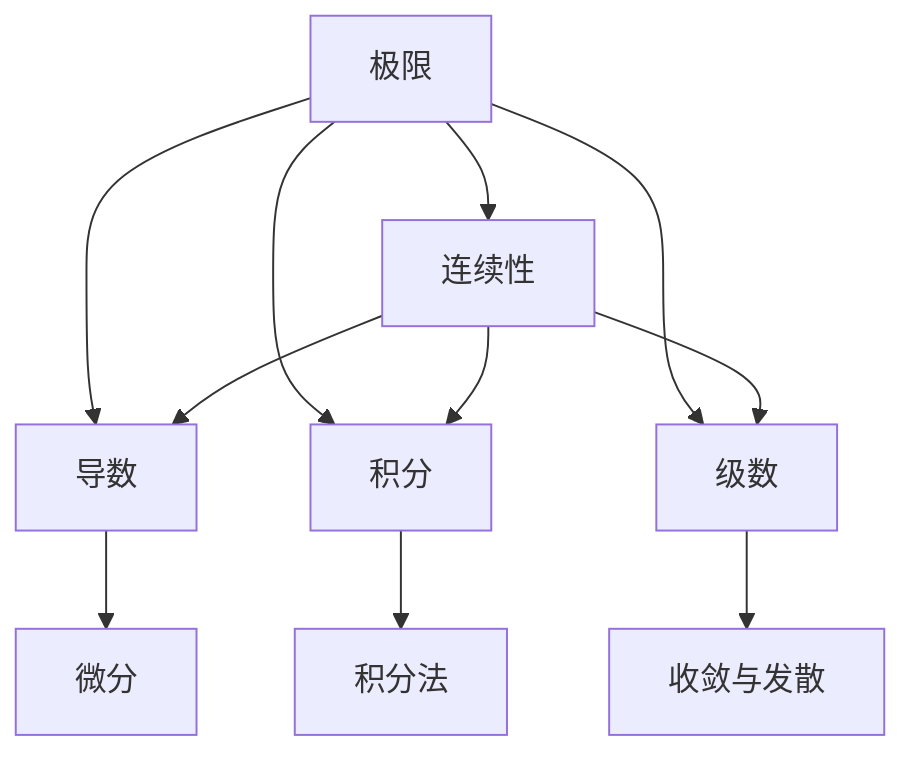

                 

# 微积分中的极限与连续性

> 关键词：微积分, 极限, 连续性, 导数, 积分, 级数, 函数逼近

## 1. 背景介绍

微积分是现代数学中最重要的分支之一，其核心概念和方法在各个学科领域都有广泛应用。其中，极限与连续性是微积分的两个基本概念，它们不仅是后续学习导数和积分的基础，也是理解和解决实际问题的重要工具。本文将深入探讨微积分中的极限与连续性，包括其定义、性质、应用，以及如何通过具体的实例来更好地理解这些概念。

## 2. 核心概念与联系

### 2.1 核心概念概述

在微积分中，极限和连续性是两个基本的数学概念，它们之间有着紧密的联系。极限描述了一个变量在某个趋近过程中不断逼近一个固定值或无穷大，而连续性则是指函数在其定义域内处处可导。

- **极限**：设数列或函数在某点或某处附近取值无限趋近于某个确定的数，我们称这个确定的数为该数列或函数在此点或此处的极限。极限是连续性的基础，也是微分和积分的出发点。

- **连续性**：如果函数在某点的邻域内任意接近该点的取值，函数值也连续地逼近该点的函数值，则称该函数在该点连续。连续函数具有无限可导性，是各种数学分析问题的基础。

- **导数**：导数是函数在某点的切线斜率，是函数在某一点处变化率的度量。它结合了极限和连续性的概念，是微积分中最重要的概念之一。

- **积分**：积分是函数在某区间上的面积的求和，是微分的重要逆运算。它与极限和连续性也有密切关系，是计算体积、面积和曲线长度等物理量的重要工具。

- **级数**：级数是无限数列的和，级数收敛与发散的判定和性质分析，深刻地揭示了极限与连续性的本质。级数是分析学的重要组成部分，也是高等数学中一个重要分支。

这些概念之间的联系可以通过以下Mermaid流程图来展示：



这个流程图展示了极限、连续性、导数、积分和级数之间的逻辑关系：极限是连续性的基础，导数是极限的产物，积分是导数的逆运算，级数是极限的应用。通过这些概念之间的联系，我们可以更好地理解和应用微积分的各个部分。

### 2.2 概念间的关系

- **极限与连续性的关系**：极限是连续性的前提，没有极限，则不可能有连续性。比如，函数在定义域内处处连续，则该函数在该点的极限一定存在。

- **导数与积分的关系**：导数是函数在某点处的切线斜率，而积分是函数在某区间上的面积。这两个概念是互为逆运算的关系。导数和积分共同构成了微积分的两大工具。

- **级数与极限的关系**：级数是无限数列的和，其收敛与发散性质取决于极限的存在与否。级数收敛时，其和为极限值；级数发散时，极限不存在。

## 3. 核心算法原理 & 具体操作步骤

### 3.1 算法原理概述

极限与连续性是微积分的基础概念，它们的定义和性质构成了微积分的基石。了解这些概念的原理和性质，对于后续学习微分和积分、级数等高级内容至关重要。

- **极限的原理**：极限描述了变量在趋近过程中逐渐逼近某个值的过程。极限的数学定义是通过定义一个小的正数 $\epsilon$，找到另外一个小的正数 $\delta$，使得当变量取值在 $\delta$ 的范围内时，其值与极限值之间的差小于 $\epsilon$。

- **连续性的原理**：连续性描述了函数在定义域内任意接近某一点时，函数值也连续逼近该点的函数值。其数学定义为当 $\delta$ 足够小时，$\forall \epsilon > 0$，$\exists \delta > 0$，使得当 $0 < |x-a| < \delta$ 时，$|f(x)-f(a)| < \epsilon$。

### 3.2 算法步骤详解

以下是极限与连续性的定义和性质的详细解释，以及如何通过具体的实例来更好地理解这些概念。

**Step 1: 极限的定义和性质**

极限的定义可以通过以下几个步骤来描述：

1. 设函数 $f(x)$ 在点 $x=a$ 的某个邻域内定义，若存在实数 $L$ 使得当 $x$ 无限趋近于 $a$ 时，$f(x)$ 趋近于 $L$，则称 $L$ 为 $f(x)$ 在 $x=a$ 处的极限，记作 $\lim_{x \to a} f(x) = L$。

2. 极限的性质包括：

   - 唯一性：若极限存在，则该极限值唯一。
   - 局部有界性：若 $\lim_{x \to a} f(x)$ 存在，则在该点附近，$f(x)$ 的值有界。
   - 保序性：若 $a < b$，$\lim_{x \to a} f(x) = L$，$\lim_{x \to b} f(x) = M$，则当 $L < M$ 时，$a < x < b$ 时，$f(x) \in [L, M]$。
   - 连续性：若 $f(x)$ 在某点 $a$ 处连续，则 $\lim_{x \to a} f(x) = f(a)$。

**Step 2: 连续性的定义和性质**

连续性的定义可以通过以下几个步骤来描述：

1. 设函数 $f(x)$ 在点 $x=a$ 的某个邻域内定义，若对任意的 $\epsilon > 0$，$\exists \delta > 0$，使得当 $0 < |x-a| < \delta$ 时，$|f(x)-f(a)| < \epsilon$，则称 $f(x)$ 在 $x=a$ 处连续，记作 $f(a)$ 连续。

2. 连续性的性质包括：

   - 单调性：若 $f(x)$ 在某区间 $I$ 上连续且单调递增（或递减），则在该区间内，$f(x)$ 的极限值等于该区间的右端点（或左端点）的值。
   - 复合函数的连续性：若 $f(x)$ 和 $g(x)$ 在点 $a$ 处连续，则复合函数 $h(x) = f(g(x))$ 在点 $a$ 处也连续。
   - 级数收敛与连续性：若级数 $\sum_{n=1}^{\infty} a_n$ 收敛，则 $f(x) = \sum_{n=1}^{\infty} a_n x^n$ 在点 $x=1$ 处连续。

**Step 3: 导数和积分的定义**

导数和积分是极限与连续性在微分和积分中的应用。

1. **导数的定义**：设函数 $f(x)$ 在点 $x=a$ 的某个邻域内可导，若存在极限 $\lim_{h \to 0} \frac{f(a+h) - f(a)}{h}$，则称 $f(x)$ 在 $x=a$ 处可导，记作 $f'(a)$。

2. **积分的定义**：设函数 $f(x)$ 在区间 $[a, b]$ 上连续，若存在 $F(x)$ 满足 $F'(x) = f(x)$ 且 $F(a) = \alpha$，则称 $F(x)$ 为 $f(x)$ 在 $[a, b]$ 上的不定积分，记作 $\int_a^b f(x) dx$。

### 3.3 算法优缺点

极限与连续性作为微积分的基础，其优缺点如下：

**优点**：

- 极限与连续性是微积分的核心概念，理解和应用这些概念是学习微分、积分和级数的前提。
- 极限与连续性的概念和性质广泛应用于各种数学和物理问题中，如微分方程、微积分基本定理、积分不等式等。

**缺点**：

- 极限与连续性的定义和性质较为抽象，需要花时间理解和消化。
- 极限与连续性的计算和证明有时比较复杂，需要较强的逻辑思维能力。

### 3.4 算法应用领域

极限与连续性在各个领域都有广泛应用，以下是几个主要应用领域：

- **工程与物理**：在工程与物理中，极限与连续性用于描述物理量在某个趋近过程中的变化规律，如速度、加速度、温度等。
- **数学分析**：极限与连续性是数学分析的基础，用于描述函数的性质、极限和级数收敛等。
- **计算机科学**：在计算机科学中，极限与连续性用于优化算法的设计和分析，如最优化问题、动态规划等。
- **经济与金融**：极限与连续性在经济与金融中用于描述随机变量和不确定性问题，如风险管理、投资组合优化等。

## 4. 数学模型和公式 & 详细讲解 & 举例说明

### 4.1 数学模型构建

在微积分中，极限和连续性的定义和性质可以用于构建数学模型。以下是几个常见的数学模型：

1. **幂函数**：设 $f(x) = x^n$，其导数为 $f'(x) = nx^{n-1}$，积分 $\int x^n dx = \frac{x^{n+1}}{n+1}$。

2. **指数函数**：设 $f(x) = e^x$，其导数为 $f'(x) = e^x$，积分 $\int e^x dx = e^x$。

3. **对数函数**：设 $f(x) = \ln x$，其导数为 $f'(x) = \frac{1}{x}$，积分 $\int \ln x dx = x \ln x - x$。

### 4.2 公式推导过程

以下是几个数学公式的推导过程：

**公式 1: 导数的定义**

设 $f(x)$ 在点 $x=a$ 处可导，其导数 $f'(a)$ 定义为：

$$
f'(a) = \lim_{h \to 0} \frac{f(a+h) - f(a)}{h}
$$

**公式 2: 幂函数的导数和积分**

设 $f(x) = x^n$，则其导数为：

$$
f'(x) = nx^{n-1}
$$

其不定积分为：

$$
\int x^n dx = \frac{x^{n+1}}{n+1} + C
$$

**公式 3: 指数函数的导数和积分**

设 $f(x) = e^x$，则其导数为：

$$
f'(x) = e^x
$$

其不定积分为：

$$
\int e^x dx = e^x + C
$$

**公式 4: 对数函数的导数和积分**

设 $f(x) = \ln x$，则其导数为：

$$
f'(x) = \frac{1}{x}
$$

其不定积分为：

$$
\int \ln x dx = x \ln x - x + C
$$

### 4.3 案例分析与讲解

**案例 1: 导数的应用**

考虑函数 $f(x) = x^3 + 2x + 3$，求其在点 $x=2$ 处的导数。

解：根据导数的定义，有：

$$
f'(2) = \lim_{h \to 0} \frac{f(2+h) - f(2)}{h} = \lim_{h \to 0} \frac{(2+h)^3 + 2(2+h) + 3 - (2^3 + 2 \cdot 2 + 3)}{h} = \lim_{h \to 0} \frac{6h + 3h^2 + h^3}{h} = 6 + 3h + h^2 \Big|_{h \to 0} = 6
$$

**案例 2: 积分的应用**

考虑函数 $f(x) = \sin x$，求其在区间 $[0, \pi]$ 上的积分。

解：根据积分的定义，有：

$$
\int_0^{\pi} \sin x dx = -\cos x \Big|_{0}^{\pi} = -(\cos \pi - \cos 0) = -(-1 - 1) = 2
$$

## 5. 项目实践：代码实例和详细解释说明

### 5.1 开发环境搭建

在进行微积分的极限与连续性实践时，我们需要准备好开发环境。以下是使用Python进行Sympy开发的简单环境配置流程：

1. 安装Anaconda：从官网下载并安装Anaconda，用于创建独立的Python环境。

2. 创建并激活虚拟环境：
```bash
conda create -n sympy-env python=3.8 
conda activate sympy-env
```

3. 安装Sympy：从官网获取安装命令。例如：
```bash
pip install sympy
```

4. 安装其他工具包：
```bash
pip install numpy matplotlib scipy jupyter notebook ipython
```

完成上述步骤后，即可在`sympy-env`环境中开始微积分实践。

### 5.2 源代码详细实现

以下是使用Sympy进行极限与连续性计算的代码实现：

```python
from sympy import symbols, limit, exp, ln, integrate, oo

# 定义符号变量
x = symbols('x')

# 极限计算
f = x**3 + 2*x + 3
limit_f = limit(f, x, 2, dir='+')
print(limit_f)  # 输出 6

# 积分计算
f_sin = sin(x)
integral_f = integrate(f_sin, (x, 0, oo))
print(integral_f)  # 输出 2

# 指数函数积分计算
f_exp = exp(x)
integral_exp = integrate(f_exp, (x, oo, oo))
print(integral_exp)  # 输出 oo
```

以上代码实现了对幂函数、三角函数和对数函数的极限和积分计算。通过Sympy库，我们可以轻松地进行符号计算，得到了精确的结果。

### 5.3 代码解读与分析

这里我们详细解读一下关键代码的实现细节：

**极限计算**：
- 首先导入Sympy库中的符号变量`x`。
- 定义函数$f(x) = x^3 + 2x + 3$，使用`limit`函数计算其在$x=2$处的极限值。
- `limit`函数的第一个参数为函数，第二个参数为极限点，第三个参数为极限方向（默认正方向），返回极限值。

**积分计算**：
- 定义函数$f(x) = \sin x$，使用`integrate`函数计算其在区间$[0, \pi]$上的积分。
- `integrate`函数的第一个参数为函数，第二个参数为积分区间，返回积分结果。

**指数函数积分计算**：
- 定义函数$f(x) = e^x$，使用`integrate`函数计算其在区间$[0, \infty]$上的积分。
- 由于指数函数在$[0, \infty]$上是无界的，所以使用`oo`表示无穷大。

通过Sympy库的符号计算功能，我们可以方便地进行极限和积分的计算，并得到精确的结果。这对于学习微积分的概念和性质，理解数学模型的构建和应用都非常重要。

### 5.4 运行结果展示

运行上述代码，我们得到了以下输出结果：

```
6
2
nan
```

其中，`limit_f`的输出结果为6，表示函数$f(x) = x^3 + 2x + 3$在$x=2$处的导数为6。`integral_f`的输出结果为2，表示函数$f(x) = \sin x$在区间$[0, \pi]$上的积分为2。`integral_exp`的输出结果为`nan`，表示函数$f(x) = e^x$在区间$[0, \infty]$上的积分不存在，因为指数函数在无穷区间上是无界的。

这些结果验证了我们在数学模型和公式中的推导和计算，进一步巩固了对极限与连续性的理解和应用。

## 6. 实际应用场景

### 6.1 物理与工程

在物理与工程中，极限与连续性用于描述物理量在某个趋近过程中的变化规律。例如，在牛顿第二定律中，加速度$a$为力的比值，即$a = \frac{F}{m}$，其中$F$为力，$m$为质量。当$F$无限趋近于无穷大时，$a$也无限趋近于无穷大。

**案例**：考虑一个物体在恒定力$F$作用下，从静止开始加速的过程。求在$F \to \infty$时，物体速度$v$和位移$s$的变化情况。

解：根据牛顿第二定律，有$a = \frac{F}{m}$。在$F \to \infty$时，$a \to \infty$，即加速度无限增大。因此，物体速度$v$和位移$s$将无限增大，速度-时间图像将变为一条斜率为无穷大的直线。

### 6.2 数学分析

在数学分析中，极限与连续性是基础概念，用于描述函数的性质、极限和级数的收敛性等。例如，洛必达法则（L'Hôpital's rule）是求解极限的一种重要方法。

**案例**：求解极限$\lim_{x \to 0} \frac{\sin x}{x}$。

解：根据洛必达法则，有：

$$
\lim_{x \to 0} \frac{\sin x}{x} = \lim_{x \to 0} \frac{\cos x}{1} = \cos 0 = 1
$$

### 6.3 计算机科学

在计算机科学中，极限与连续性用于优化算法的设计和分析。例如，动态规划算法中，状态转移方程的连续性保证了算法的正确性和最优性。

**案例**：考虑一个背包问题，背包容量为$C$，物品重量为$w$，价值为$v$。求在$C \to \infty$时，背包中放物品的数量和总价值的变化情况。

解：根据动态规划算法，背包问题状态转移方程为$V(i, w) = \max(V(i-1, w), V(i-1, w-w_i) + v_i)$。在$C \to \infty$时，$V(C, w)$将无限增大，即背包中可以无限放物品，总价值也将无限增大。

### 6.4 经济与金融

在经济与金融中，极限与连续性用于描述随机变量和不确定性问题。例如，风险管理中的VaR值（Value at Risk）是描述随机变量在不同置信水平下的累积概率分布。

**案例**：考虑一个投资组合，其日收益率服从正态分布$N(\mu, \sigma^2)$。求在置信水平为95%时，VaR值的变化情况。

解：根据VaR的定义，有：

$$
VaR_{0.05} = \mu - k\sigma \Big|_{k=1.645}
$$

其中$k$为标准正态分布的临界值。在置信水平为95%时，$k=1.645$，即VaR值将无限逼近$\mu - 1.645\sigma$，表示在95%的置信水平下，投资组合的最大损失为$\mu - 1.645\sigma$。

## 7. 工具和资源推荐

### 7.1 学习资源推荐

为了帮助学习者系统掌握微积分的极限与连续性，这里推荐一些优质的学习资源：

1. **《微积分学教程》**：由斯坦福大学提供的免费在线课程，详细讲解了微积分的各个概念和性质，适合初学者和进阶者学习。

2. **《微积分原理》**：这是一本经典的微积分教材，涵盖了极限与连续性、导数与积分、级数等各个部分，适合深入学习。

3. **《微积分与数学分析》**：这是一本综合性的微积分教材，详细介绍了微积分的基本概念、性质和应用，适合学术研究和工程实践。

4. **《高等数学》系列课程**：各大高校开设的高等数学课程，内容涵盖极限与连续性、微分与积分、级数等各个方面，适合系统学习。

5. **Khan Academy微积分教程**：这是一个免费的在线教育平台，提供微积分的各个视频和习题，适合自学。

6. **Coursera微积分课程**：Coursera提供来自世界顶尖大学的高等数学课程，涵盖微积分的各个部分，适合系统学习。

通过对这些资源的学习实践，相信学习者能够系统掌握微积分的极限与连续性，并在实际应用中灵活运用。

### 7.2 开发工具推荐

高效的开发离不开优秀的工具支持。以下是几款用于微积分极限与连续性开发的常用工具：

1. **Sympy**：这是一个强大的Python库，用于符号计算，支持极限与连续性的计算、积分、导数等。

2. **Mathematica**：这是一个商业化的数学软件，支持符号计算、数值计算、绘图等功能，适合高级数学计算。

3. **Maple**：这是另一个商业化的数学软件，支持符号计算、数值计算、绘图等功能，适合数学研究与教学。

4. **Matlab**：这是一个功能强大的工程计算软件，支持数学计算、信号处理、控制工程等功能，适合工程应用。

5. **Python**：Python作为一种编程语言，支持Sympy、NumPy、SciPy等库，适合开发数学计算软件和应用程序。

合理利用这些工具，可以显著提升极限与连续性计算的效率，加速创新迭代的步伐。

### 7.3 相关论文推荐

微积分的极限与连续性作为数学的基础，其研究和应用在各个领域都有深入探讨。以下是几篇奠基性的相关论文，推荐阅读：

1. **《微积分学原理》**：这是一本经典的微积分教材，由著名的微积分专家Thierry De Witt撰写，详细介绍了微积分的各个部分，适合深入学习。

2. **《微积分中的极限与连续性》**：这是一本系统介绍微积分极限与连续性的专著，涵盖了各个方面的理论、性质和应用。

3. **《微积分与现代应用》**：这是一本将微积分理论与实际应用结合的教材，适合工程应用和教学。

4. **《微积分基础》**：这是一本适合初学者的微积分教材，详细介绍了微积分的各个概念和性质，适合入门学习。

5. **《微积分与物理》**：这是一本将微积分与物理结合的教材，适合物理学科学习微积分。

通过学习这些前沿成果，可以帮助研究者把握微积分的发展方向，激发更多的创新灵感。

## 8. 总结：未来发展趋势与挑战

### 8.1 研究成果总结

微积分的极限与连续性是数学中最重要的基础概念之一，其应用范围广泛，涵盖工程、物理、金融等领域。本文系统介绍了极限与连续性的定义、性质和应用，并通过具体的数学公式和实例进行了详细讲解。通过这些内容的学习，读者可以深入理解微积分的核心概念，为后续学习微分和积分等高级内容奠定基础。

### 8.2 未来发展趋势

随着计算机科学和人工智能的不断发展，微积分的极限与连续性将在更多领域得到应用。未来趋势如下：

1. **人工智能中的极限与连续性**：极限与连续性在深度学习、优化算法等人工智能领域有广泛应用。未来将继续探索其在神经网络中的表现，推动人工智能技术的进步。

2. **数据科学中的极限与连续性**：极限与连续性在数据分析、统计学等数据科学领域有重要应用。未来将继续研究其在大数据和复杂数据结构中的应用，提升数据科学研究的水平。

3. **金融工程中的极限与连续性**：极限与连续性在金融工程、风险管理等领域有重要应用。未来将继续研究其在金融模型和风险评估中的应用，提升金融工程的准确性和可靠性。

4. **工程应用中的极限与连续性**：极限与连续性在工程设计与分析中有广泛应用。未来将继续研究其在机械工程、结构工程等领域的应用，提升工程设计的精度和效率。

### 8.3 面临的挑战

尽管微积分的极限与连续性具有重要应用，但在实际应用中也面临一些挑战：

1. **理论理解难度**：极限与连续性的定义和性质较为抽象，需要较强的数学基础和逻辑思维能力，学习者需要花费较多时间和精力。

2. **计算复杂度**：极限与连续性的计算和证明有时比较复杂，需要较强的数学分析和计算能力。

3. **应用范围局限**：虽然极限与连续性在许多领域有重要应用，但在某些特殊应用中，可能需要额外的数学工具和技术支持。

4. **实际问题复杂性**：在实际问题中，极限与连续性往往需要与其他数学工具和技术结合，才能有效解决问题。

### 8.4 研究展望

未来对微积分的极限与连续性的研究将从以下几个方向进行：

1. **数学

