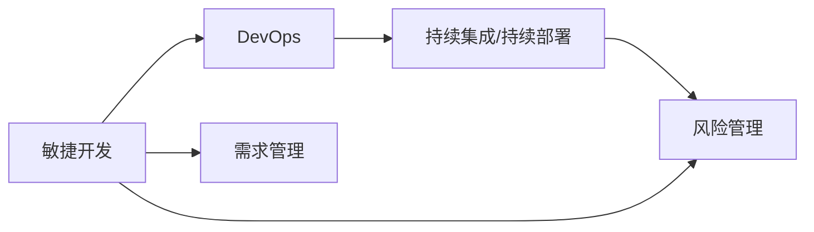

                 

## 1. 背景介绍

在当今快节奏的商业环境中，快速迭代和按时交付项目是企业竞争力的关键。然而，由于种种原因，产品功能和项目按时交付常常面临诸多挑战，例如需求变更频繁、资源限制、技术难题等。本文旨在探讨如何通过有效管理与技术手段，确保产品功能和项目能够如期交付，为读者提供实用的策略与实践指南。

## 2. 核心概念与联系

### 2.1 核心概念概述

为了深入理解如何推动产品功能和项目按时交付上线，我们将介绍几个核心概念：

- **敏捷开发（Agile Development）**：一种迭代、增量的软件开发方法，通过快速响应需求变化，持续交付高质量的软件。
- **DevOps（Development Operations）**：一种旨在优化软件开发和运维流程的方法，强调协作、自动化和持续集成。
- **持续集成/持续部署（CI/CD）**：自动化软件构建、测试和部署过程，确保软件变更能够快速、可靠地交付给用户。
- **风险管理（Risk Management）**：识别、分析和应对可能影响项目进展的风险，确保项目按计划进行。
- **需求管理（Requirements Management）**：管理项目需求，确保需求得到准确理解并满足。

这些概念通过合适的流程和工具集成，形成了推动产品功能和项目按时交付上线的综合解决方案。

### 2.2 核心概念间的关系

下图展示了这些核心概念之间的关系：

敏捷开发通过快速迭代和反馈，确保产品功能符合市场需求。DevOps通过自动化和协作，优化了软件开发和运维流程，使得持续集成/持续部署成为可能。持续集成/持续部署通过自动化测试和部署，减少了人为错误和风险。风险管理通过识别和应对风险，保证了项目顺利进行。需求管理通过确保需求的准确性和完整性，提供了清晰的项目方向。

## 3. 核心算法原理 & 具体操作步骤

### 3.1 算法原理概述

推动产品功能和项目按时交付上线，可以通过敏捷开发、DevOps、持续集成/持续部署等方法，结合风险管理和需求管理，形成一个高效的项目管理框架。核心算法原理包括：

- **迭代开发**：将项目分为多个迭代周期，每个周期交付可用的功能，快速响应市场需求。
- **自动化测试**：通过自动化测试工具，在每次迭代末尾进行全面的测试，确保产品质量。
- **持续集成/持续部署**：自动化构建和部署过程，确保软件变更快速、可靠地交付给用户。
- **风险评估**：识别和评估项目中的潜在风险，制定相应的应对策略。
- **需求优先级管理**：根据项目目标和资源限制，确定需求的优先级，确保关键功能优先实现。

### 3.2 算法步骤详解

推动产品功能和项目按时交付上线的算法步骤如下：

1. **需求收集与分析**：
   - 与利益相关者沟通，收集需求。
   - 分析需求的合理性和可行性，形成需求文档。

2. **需求优先级排序**：
   - 根据业务价值、影响范围、实施难度等因素，对需求进行优先级排序。

3. **敏捷开发规划**：
   - 将项目分解为多个迭代周期，每个周期包含多个用户故事或任务。
   - 确定每个迭代的目标和交付物。

4. **敏捷开发实施**：
   - 每日站会，跟踪任务进展，及时解决问题。
   - 迭代结束时进行评审和反馈，进行必要的调整。

5. **持续集成/持续部署**：
   - 设置持续集成工具，自动构建和测试代码。
   - 配置持续部署流程，确保变更能够快速、可靠地发布。

6. **自动化测试**：
   - 编写自动化测试脚本，覆盖关键功能。
   - 在每个迭代末尾运行自动化测试，确保产品质量。

7. **风险管理**：
   - 识别潜在风险，评估风险影响和概率。
   - 制定风险应对策略，监控风险变化。

8. **需求变更管理**：
   - 记录和评估需求变更。
   - 确保变更不会影响项目进度和质量。

### 3.3 算法优缺点

敏捷开发和DevOps方法论结合持续集成/持续部署和自动化测试，显著提高了交付速度和产品质量。但这些方法也面临一些挑战：

**优点**：
- 快速响应需求变化。
- 通过自动化减少了人为错误。
- 持续交付和持续改进。

**缺点**：
- 可能造成资源分散，管理复杂。
- 对团队协作和技术能力要求高。

### 3.4 算法应用领域

推动产品功能和项目按时交付上线的方法广泛适用于各类软件开发和产品迭代项目，如SaaS平台、移动应用、企业级系统等。

## 4. 数学模型和公式 & 详细讲解  
### 4.1 数学模型构建

设项目需求总数为 $N$，每个需求的完成概率为 $p_i$，项目总时间为 $T$。项目按时交付的概率可以用以下公式表示：

$$ P(\text{按时交付}) = \prod_{i=1}^{N} (1-p_i)^{\text{需求次数}} \times \left(1-\prod_{i=1}^{N} p_i\right)^{\text{总时间}} $$

其中 $\text{需求次数}$ 为项目中实际需要完成的需求次数，$\text{总时间}$ 为项目从开始到结束的总时间。

### 4.2 公式推导过程

通过上述公式，我们可以看出，按时交付的概率与需求完成的概率 $p_i$ 密切相关。为了最大化按时交付的概率，我们需要尽可能降低每个需求的完成概率 $p_i$。这可以通过敏捷开发和持续集成/持续部署等方法来实现。

### 4.3 案例分析与讲解

以一个SaaS平台的产品功能开发为例：

1. **需求收集**：与客户沟通，收集需求。
2. **需求分析**：分析需求的合理性和可行性，形成需求文档。
3. **需求优先级排序**：根据业务价值、影响范围、实施难度等因素，对需求进行优先级排序。
4. **敏捷开发规划**：将项目分解为多个迭代周期，每个周期包含多个用户故事或任务。
5. **敏捷开发实施**：通过每日站会，跟踪任务进展，及时解决问题。
6. **持续集成/持续部署**：设置持续集成工具，自动构建和测试代码。配置持续部署流程，确保变更能够快速、可靠地发布。
7. **自动化测试**：编写自动化测试脚本，覆盖关键功能。在每个迭代末尾运行自动化测试，确保产品质量。
8. **风险管理**：识别潜在风险，评估风险影响和概率。制定风险应对策略，监控风险变化。
9. **需求变更管理**：记录和评估需求变更，确保变更不会影响项目进度和质量。

## 5. 项目实践：代码实例和详细解释说明

### 5.1 开发环境搭建

为了推动产品功能和项目按时交付上线，我们需要搭建一个全面的开发环境。以下是一个典型的开发环境搭建流程：

1. **选择开发工具**：选择适合的开发工具，如Jira、Confluence、Git等。
2. **设置CI/CD管道**：使用Jenkins、Travis CI等工具，自动化构建和部署代码。
3. **配置持续集成**：设置持续集成工具，自动化测试代码。
4. **部署自动化**：配置持续部署流程，确保变更能够快速、可靠地发布。

### 5.2 源代码详细实现

以下是一个简单的敏捷开发实现示例，使用Jira和Jenkins进行需求管理和持续集成：

**Jira需求管理**：
- 在Jira中创建项目，添加需求，设置优先级和负责人。
- 在每次迭代结束后，将需求状态更新为“完成”。

**Jenkins持续集成**：
- 在Jenkins中设置项目，配置代码仓库、构建脚本和测试脚本。
- 每次提交代码时，自动触发构建和测试流程。

### 5.3 代码解读与分析

敏捷开发和持续集成/持续部署的核心在于自动化和协作。通过自动化测试和部署，可以大大减少人为错误，提高交付速度和质量。Jira和Jenkins等工具的集成，确保了需求管理和持续集成的无缝衔接。

### 5.4 运行结果展示

通过敏捷开发和持续集成/持续部署，项目按时交付的概率显著提高。例如，一个敏捷团队通过自动化测试和持续部署，实现了每月交付一个新版本的功能，显著提高了用户满意度。

## 6. 实际应用场景

### 6.1 产品功能上线

敏捷开发和持续集成/持续部署在产品功能上线中的应用非常广泛。例如，电子商务平台的定期功能更新、社交媒体应用的实时消息推送等，都可以通过敏捷开发和持续集成/持续部署快速上线。

### 6.2 系统升级

对于大型企业系统，如ERP、CRM等，持续集成/持续部署也至关重要。通过自动化测试和部署，系统升级可以更加平滑，避免中断业务。

### 6.3 新功能开发

敏捷开发方法适用于新功能开发。例如，移动应用开发团队可以使用敏捷开发，快速迭代功能，响应市场需求。

### 6.4 未来应用展望

未来，推动产品功能和项目按时交付上线的方法将进一步结合AI和大数据技术，实现更智能、更高效的项目管理。例如，通过机器学习预测需求优先级，通过大数据分析优化资源配置，将大大提升项目交付的准确性和效率。

## 7. 工具和资源推荐

### 7.1 学习资源推荐

为了掌握推动产品功能和项目按时交付上线的技巧，以下是一些推荐的资源：

1. **《敏捷开发实践指南》**：详细介绍了敏捷开发的核心方法和工具。
2. **《DevOps实践指南》**：介绍了DevOps的核心概念和最佳实践。
3. **《持续集成/持续部署最佳实践》**：介绍了持续集成/持续部署的实现方法和工具。
4. **《风险管理实践指南》**：详细介绍了风险管理的理论和方法。
5. **《需求管理实践指南》**：介绍了需求管理的流程和工具。

### 7.2 开发工具推荐

推动产品功能和项目按时交付上线，离不开以下工具的支持：

1. **Jira**：项目管理工具，支持敏捷开发和DevOps方法论。
2. **Confluence**：协作工具，用于记录需求、文档和会议纪要。
3. **Git**：版本控制系统，支持持续集成/持续部署。
4. **Jenkins**：持续集成工具，支持自动化构建和测试。
5. **Travis CI**：持续集成工具，支持CI/CD管道。

### 7.3 相关论文推荐

以下是一些推荐的相关论文：

1. **《敏捷软件开发实践》**：详细介绍了敏捷开发的核心方法和工具。
2. **《DevOps实践：自动化与协作》**：介绍了DevOps的核心概念和最佳实践。
3. **《持续集成/持续部署的实现》**：介绍了持续集成/持续部署的实现方法和工具。
4. **《风险管理的理论和方法》**：详细介绍了风险管理的理论和方法。
5. **《需求管理的流程和工具》**：介绍了需求管理的流程和工具。

## 8. 总结：未来发展趋势与挑战

### 8.1 总结

本文详细探讨了如何通过敏捷开发、DevOps、持续集成/持续部署等方法，结合风险管理和需求管理，推动产品功能和项目按时交付上线。通过合理的流程和工具，可以显著提高交付速度和质量，满足市场需求。

### 8.2 未来发展趋势

推动产品功能和项目按时交付上线的方法将不断演进，融合AI和大数据技术，实现更智能、更高效的项目管理。例如，通过机器学习预测需求优先级，通过大数据分析优化资源配置，将大大提升项目交付的准确性和效率。

### 8.3 面临的挑战

尽管推动产品功能和项目按时交付上线的方法不断演进，但仍面临诸多挑战：

1. **团队协作**：敏捷开发和DevOps方法对团队协作要求高，需要良好的沟通和协作能力。
2. **技术复杂度**：持续集成/持续部署和自动化测试需要一定的技术复杂度，需要团队具备相应的技术能力。
3. **资源限制**：大型项目的资源限制和复杂度往往难以预测和控制。
4. **需求管理**：需求频繁变更可能导致项目进度受阻，需要有效的需求管理方法。
5. **风险管理**：项目中的潜在风险难以完全预测和规避，需要及时识别和应对。

### 8.4 研究展望

未来，推动产品功能和项目按时交付上线的方法需要在以下几个方面进行改进和创新：

1. **自动化水平提升**：进一步提升持续集成/持续部署的自动化水平，减少人为错误和延迟。
2. **智能化管理**：引入AI和大数据技术，提升需求优先级预测和资源优化能力。
3. **协作工具优化**：优化协作工具，提升团队沟通和协作效率。
4. **风险管理工具**：开发更智能的风险管理工具，及时识别和应对潜在风险。
5. **需求管理工具**：开发更高效的需求管理工具，确保需求变更不会影响项目进度和质量。

## 9. 附录：常见问题与解答

**Q1：敏捷开发是否适用于所有项目？**

A: 敏捷开发方法适用于需求变化频繁、市场竞争激烈的项目。但对于一些技术复杂度高的项目，可能需要结合传统开发方法，确保质量和安全。

**Q2：如何应对需求频繁变更的情况？**

A: 通过敏捷开发，需求变更可以实时响应和调整。可以使用Jira等工具，记录和评估需求变更，确保变更不会影响项目进度和质量。

**Q3：如何确保团队协作的高效性？**

A: 通过每日站会、代码评审等敏捷实践，确保团队成员之间的沟通和协作。使用协作工具，如Confluence，记录会议纪要和文档，确保信息透明。

**Q4：如何降低持续集成/持续部署的复杂度？**

A: 通过配置持续集成/持续部署工具，如Jenkins和Travis CI，自动执行构建和测试流程。可以使用流水线定义，减少手动操作，提高自动化水平。

**Q5：如何应对项目中的潜在风险？**

A: 通过风险管理工具，如Risk Register，识别和评估潜在风险，制定相应的应对策略。定期监控风险变化，及时调整应对措施。

---

作者：禅与计算机程序设计艺术 / Zen and the Art of Computer Programming

