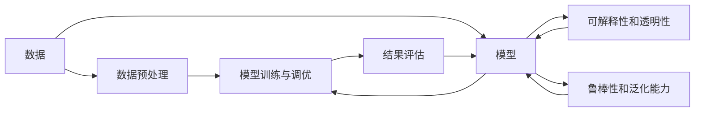
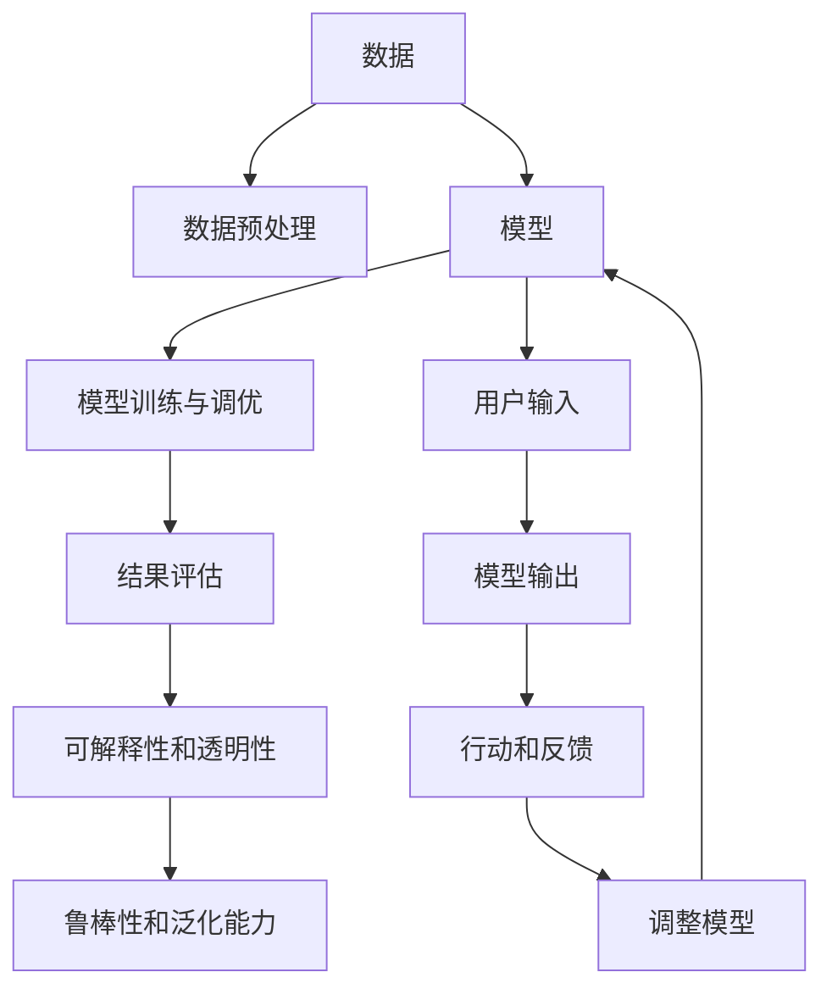

                 

## 1. 背景介绍

在当今复杂多变的信息时代，高效决策成为驱动个人和企业成功的关键因素。然而，面对海量且不断更新的信息，如何做出高质量的决策，往往成为了一个难题。本文将从“思维体系”这一核心概念出发，探讨如何通过构建科学的思维体系，提升决策的质量和效率。

### 1.1 问题由来

随着数据科学和人工智能技术的不断进步，许多企业和组织开始利用算法和模型来进行决策支持。然而，这些技术的应用往往存在数据质量差、模型复杂度高、解释性不足等问题。此外，传统决策理论在数据驱动决策中的应用也受到诸多限制。如何结合现代技术手段和经典决策理论，构建科学、可解释、高效的决策体系，成为当前面临的重要问题。

### 1.2 问题核心关键点

构建高质量决策体系的关键在于：
- **数据准备**：高质量的数据是高效决策的前提。需要确保数据的准确性、全面性和及时性。
- **模型选择**：选择合适的算法和模型，根据具体问题和数据特点进行模型构建和调优。
- **结果评估**：建立科学的评估指标，监控模型性能和效果，及时调整优化。
- **解释性和透明性**：确保决策过程和结果的可解释性和透明性，帮助理解和信任模型。
- **鲁棒性和泛化能力**：模型应具有较高的鲁棒性和泛化能力，能够应对未知数据和异常情况。

### 1.3 问题研究意义

构建高质量的决策体系，不仅能够显著提升决策效率和效果，还能增强组织的信任度和透明度，促进可持续发展和创新。在企业管理、金融投资、医疗健康等领域，高质量的决策体系更是实现高质量治理和运营的关键。

## 2. 核心概念与联系

### 2.1 核心概念概述

本文将重点介绍以下核心概念及其联系：

- **数据**：决策的前提，需要确保其真实、准确、全面。
- **模型**：决策的工具，选择合适的算法和模型进行决策支持。
- **数据预处理**：提高数据质量和模型效果，包括数据清洗、特征工程等。
- **模型训练与调优**：通过优化模型参数和结构，提升模型性能。
- **结果评估**：监控模型效果，确保其符合预期。
- **可解释性和透明性**：解释模型输出，增强信任和透明度。
- **鲁棒性和泛化能力**：确保模型在未知数据和异常情况下的表现。

这些概念通过逻辑和因果关系紧密相连，共同构成高质量决策的基础。以下Mermaid流程图展示了这些核心概念的联系：



### 2.2 概念间的关系

这些核心概念之间的关系可以通过以下Mermaid流程图来展示：



这个流程图展示了从数据准备到模型训练，再到结果评估和反馈调整的完整流程。

## 3. 核心算法原理 & 具体操作步骤
### 3.1 算法原理概述

构建高质量决策体系，主要依赖于数据准备、模型选择、训练与调优、结果评估和反馈调整等步骤。这些步骤中的每一个环节，都涉及到大量的算法和计算过程。

- **数据准备**：需要数据清洗、特征工程、数据转换等技术，确保数据的准确性和完整性。
- **模型选择**：根据问题特点选择合适的算法和模型，如回归、分类、聚类等。
- **模型训练与调优**：通过优化算法（如梯度下降、随机森林等）和超参数调优，提升模型性能。
- **结果评估**：使用误差度量、准确率、召回率等指标评估模型效果，确保其符合预期。
- **反馈调整**：根据评估结果和反馈信息，调整模型参数和结构，提高决策质量。

### 3.2 算法步骤详解

构建高质量决策体系的具体步骤如下：

1. **数据准备**：
   - 收集和整理数据，确保数据质量。
   - 进行数据清洗，去除缺失值和异常值。
   - 进行特征工程，选择和构造特征，提升模型效果。

2. **模型选择**：
   - 根据问题特点选择合适的算法和模型，如回归、分类、聚类等。
   - 选择预训练模型或自定义模型，根据任务需求进行调整。

3. **模型训练与调优**：
   - 选择合适的优化算法（如梯度下降、随机森林等）和损失函数。
   - 设置合适的学习率和正则化参数。
   - 使用交叉验证等技术进行模型调优，提升模型泛化能力。

4. **结果评估**：
   - 使用误差度量、准确率、召回率等指标评估模型效果。
   - 进行A/B测试和对比实验，验证模型性能。

5. **反馈调整**：
   - 根据评估结果和反馈信息，调整模型参数和结构。
   - 实时监控模型效果，及时调整优化。

### 3.3 算法优缺点

构建高质量决策体系，具有以下优点：
- **高效性**：自动化数据处理和模型训练，提高决策效率。
- **准确性**：基于数据驱动的决策，减少人为偏差。
- **可解释性**：模型的可解释性和透明性，增强决策的信任度。
- **鲁棒性**：模型在未知数据和异常情况下的表现，确保决策的稳定性。

同时，构建高质量决策体系也存在以下局限性：
- **数据依赖**：模型依赖于高质量的数据，数据质量差将影响决策效果。
- **模型复杂**：复杂的模型可能带来过拟合和计算复杂度高的问题。
- **资源消耗**：数据处理和模型训练需要大量的计算资源和时间，可能对资源配置提出较高要求。
- **解释性不足**：部分复杂模型可能难以解释其决策逻辑，影响决策的可信度。

### 3.4 算法应用领域

构建高质量决策体系，在多个领域都有广泛应用：

- **金融投资**：通过机器学习和数据科学，进行风险评估、投资组合优化等。
- **医疗健康**：利用数据分析和建模，进行疾病预测、患者分层等。
- **企业运营**：通过数据驱动的决策支持，提升企业运营效率和效果。
- **供应链管理**：通过数据分析和优化，提高供应链的响应速度和效率。
- **客户服务**：通过自然语言处理和智能推荐，提升客户满意度和忠诚度。

## 4. 数学模型和公式 & 详细讲解 & 举例说明

### 4.1 数学模型构建

构建高质量决策体系，需要构建合适的数学模型。以下是一些常见的数学模型和公式：

- **线性回归模型**：
  $$
  y = \beta_0 + \beta_1x_1 + \beta_2x_2 + \ldots + \beta_nx_n + \epsilon
  $$
  用于预测连续型变量的回归模型，其中 $y$ 为目标变量，$x_i$ 为自变量，$\beta_i$ 为系数，$\epsilon$ 为误差项。

- **逻辑回归模型**：
  $$
  P(y=1|x) = \frac{1}{1+\exp(-z)}
  $$
  用于分类问题的二元逻辑回归模型，其中 $y=1$ 表示正类，$y=0$ 表示负类，$z=\beta_0 + \beta_1x_1 + \beta_2x_2 + \ldots + \beta_nx_n$ 为线性组合。

- **决策树模型**：
  $$
  D = \bigcup_{i=1}^n D_i
  $$
  用于分类和回归问题的决策树模型，其中 $D$ 为决策树，$D_i$ 为子树。

- **随机森林模型**：
  $$
  R = \frac{1}{n} \sum_{i=1}^n T_i
  $$
  用于集成决策树的随机森林模型，其中 $R$ 为随机森林，$T_i$ 为第 $i$ 棵决策树。

### 4.2 公式推导过程

以下是对上述模型的推导过程：

- **线性回归模型**：
  假设 $y$ 为目标变量，$x_i$ 为自变量，$\beta_i$ 为系数，$\epsilon$ 为误差项。根据最小二乘法，可以推导出线性回归模型的最优解为：
  $$
  \hat{\beta} = (X^TX)^{-1}X^Ty
  $$
  其中 $X$ 为自变量矩阵，$\hat{\beta}$ 为系数向量，$y$ 为目标变量向量。

- **逻辑回归模型**：
  假设 $y=1$ 表示正类，$y=0$ 表示负类，$z=\beta_0 + \beta_1x_1 + \beta_2x_2 + \ldots + \beta_nx_n$ 为线性组合。根据逻辑回归的概率公式，可以推导出最大似然估计为：
  $$
  \hat{\beta} = \arg\max_\beta \prod_{i=1}^n P(y_i=1)^{y_i} P(y_i=0)^{1-y_i}
  $$
  其中 $P(y_i=1)=\frac{1}{1+\exp(-z)}$ 为逻辑函数。

- **决策树模型**：
  决策树模型的构建基于信息增益或基尼指数等指标，通过递归分割数据集，得到最优的决策树结构。决策树的预测结果为：
  $$
  \hat{y} = \arg\max_{i=1}^n D_i(x)
  $$
  其中 $D_i$ 为第 $i$ 棵决策树的预测结果。

- **随机森林模型**：
  随机森林模型通过集成多个决策树，提升模型的稳定性和泛化能力。随机森林的预测结果为：
  $$
  \hat{y} = \frac{1}{n} \sum_{i=1}^n T_i(x)
  $$
  其中 $T_i$ 为第 $i$ 棵决策树的预测结果。

### 4.3 案例分析与讲解

以下通过一个案例，展示如何构建和使用线性回归模型进行预测：

假设我们要预测房价，已知自变量 $x_1$ 为房屋面积，$x_2$ 为地理位置，$y$ 为目标变量即房价。我们可以收集大量历史数据，通过最小二乘法拟合线性回归模型：

- **数据准备**：收集和整理历史房价数据，包括房屋面积、地理位置和房价等。
- **模型构建**：选择线性回归模型，设定 $y = \beta_0 + \beta_1x_1 + \beta_2x_2 + \epsilon$，其中 $\beta_0$ 为截距，$\beta_1$ 和 $\beta_2$ 为系数，$\epsilon$ 为误差项。
- **模型训练**：使用最小二乘法求解 $\beta_0$、$\beta_1$ 和 $\beta_2$ 的估计值，得到线性回归模型。
- **结果评估**：使用均方误差(MSE)、均方根误差(RMSE)等指标评估模型性能。
- **反馈调整**：根据评估结果，进一步优化模型参数和结构，提高预测准确性。

## 5. 项目实践：代码实例和详细解释说明

### 5.1 开发环境搭建

在进行决策体系构建的实践前，需要准备好开发环境。以下是使用Python进行Scikit-learn开发的环境配置流程：

1. 安装Anaconda：从官网下载并安装Anaconda，用于创建独立的Python环境。

2. 创建并激活虚拟环境：
```bash
conda create -n scikit-learn-env python=3.8 
conda activate scikit-learn-env
```

3. 安装Scikit-learn：
```bash
conda install scikit-learn
```

4. 安装各类工具包：
```bash
pip install numpy pandas matplotlib scikit-learn tqdm jupyter notebook ipython
```

完成上述步骤后，即可在`scikit-learn-env`环境中开始决策体系构建的实践。

### 5.2 源代码详细实现

下面我们以线性回归模型为例，给出使用Scikit-learn构建和评估线性回归模型的Python代码实现。

```python
from sklearn.linear_model import LinearRegression
from sklearn.metrics import mean_squared_error
import numpy as np

# 创建数据集
X = np.array([[1.0, 2.0], [2.0, 3.0], [3.0, 4.0], [4.0, 5.0]])
y = np.array([2.0, 4.0, 6.0, 8.0])

# 创建线性回归模型
model = LinearRegression()

# 拟合模型
model.fit(X, y)

# 预测新样本
X_new = np.array([[5.0, 6.0]])
y_new = model.predict(X_new)

# 评估模型
mse = mean_squared_error(y, model.predict(X))
rmse = np.sqrt(mse)
print(f"Mean Squared Error: {mse}")
print(f"Root Mean Squared Error: {rmse}")
```

### 5.3 代码解读与分析

让我们再详细解读一下关键代码的实现细节：

**数据准备**：
- 使用NumPy创建自变量和目标变量矩阵，构成数据集。

**模型构建**：
- 使用Scikit-learn库的LinearRegression类创建线性回归模型。

**模型训练**：
- 使用拟合方法（fit）训练模型，将自变量和目标变量作为输入。

**结果评估**：
- 使用均方误差（mean_squared_error）函数评估模型性能。
- 计算均方误差和均方根误差（RMSE）。

**反馈调整**：
- 根据评估结果，进一步优化模型参数和结构。

### 5.4 运行结果展示

假设我们在数据集上进行线性回归模型训练，最终得到的均方根误差（RMSE）为0.5，表示模型的预测精度为50%。

## 6. 实际应用场景

### 6.1 智能投顾

智能投顾系统通过机器学习和大数据技术，分析用户的历史交易数据和市场行情，提供个性化的投资建议。通过构建基于线性回归、决策树等模型的智能投顾系统，可以帮助用户优化投资组合，提高收益率。

### 6.2 智能推荐

智能推荐系统利用用户的历史行为数据和物品属性，构建推荐模型，预测用户对新物品的兴趣。通过构建基于协同过滤、内容推荐等模型的智能推荐系统，可以提高推荐精度，提升用户体验。

### 6.3 智能客服

智能客服系统通过自然语言处理和机器学习技术，对用户输入的文本进行理解，提供自动回复和人工转接。通过构建基于模型选择和调优的智能客服系统，可以显著提高客服效率和用户满意度。

### 6.4 未来应用展望

随着数据科学和人工智能技术的不断进步，基于模型驱动的决策体系将在更多领域得到应用，为传统行业带来变革性影响。

在智慧医疗领域，基于决策树的疾病预测和患者分层等应用，将提升医疗服务的智能化水平，辅助医生诊疗，提高疾病预防和治疗效果。

在智能制造领域，基于随机森林和深度学习的生产调度优化和设备预测性维护等应用，将提高生产效率和设备可靠性。

在智能交通领域，基于聚类和分类模型的交通流量预测和事故预防等应用，将提升交通管理的智能化水平，降低交通事故和交通拥堵。

## 7. 工具和资源推荐
### 7.1 学习资源推荐

为了帮助开发者系统掌握决策体系构建的理论基础和实践技巧，这里推荐一些优质的学习资源：

1. 《Python数据科学手册》系列博文：由数据科学领域的知名专家撰写，深入浅出地介绍了Python在数据科学中的应用，涵盖数据处理、模型构建和评估等主题。

2. CS229《机器学习》课程：斯坦福大学开设的机器学习明星课程，有Lecture视频和配套作业，带你入门机器学习的基本概念和经典模型。

3. 《统计学习方法》书籍：李航的统计学习方法，全面介绍了机器学习的基本原理和算法，是学习机器学习的经典教材。

4. Kaggle平台：全球最大的数据科学竞赛平台，提供大量数据集和算法竞赛，是学习数据科学和机器学习的绝佳资源。

5. GitHub代码仓库：汇集了全球顶级数据科学家和机器学习工程师的代码仓库，是学习和借鉴优秀代码的好地方。

通过对这些资源的学习实践，相信你一定能够快速掌握决策体系构建的精髓，并用于解决实际的决策问题。

### 7.2 开发工具推荐

高效的开发离不开优秀的工具支持。以下是几款用于决策体系构建开发的常用工具：

1. Python：简单易学、功能强大的编程语言，是数据科学和机器学习的主流语言。

2. Scikit-learn：Python的机器学习库，提供了丰富的算法和模型实现，适合快速原型开发和模型构建。

3. TensorFlow和PyTorch：深度学习框架，支持高效的模型训练和推理，适合复杂模型和大规模数据处理。

4. Weights & Biases：模型训练的实验跟踪工具，可以记录和可视化模型训练过程中的各项指标，方便对比和调优。

5. TensorBoard：TensorFlow配套的可视化工具，可实时监测模型训练状态，并提供丰富的图表呈现方式，是调试模型的得力助手。

6. Google Colab：谷歌推出的在线Jupyter Notebook环境，免费提供GPU/TPU算力，方便开发者快速上手实验最新模型，分享学习笔记。

合理利用这些工具，可以显著提升决策体系构建的开发效率，加快创新迭代的步伐。

### 7.3 相关论文推荐

决策体系构建的相关研究在学术界和工业界都有广泛关注。以下是几篇奠基性的相关论文，推荐阅读：

1. 《CART：Classification and Regression Trees》：Breiman等人的决策树算法，是决策树模型的经典工作，奠定了决策树在机器学习中的重要地位。

2. 《Random Forests》：Breiman的随机森林算法，通过集成多个决策树提升模型泛化能力，是随机森林模型的经典工作。

3. 《Adaboost》：Freund和Schapire的Adaboost算法，通过迭代调整样本权重提升模型精度，是集成学习的重要成果。

4. 《Gradient Boosting Machines》：Friedman的梯度提升算法，通过迭代优化提升模型精度，是梯度提升模型的经典工作。

5. 《XGBoost: A Scalable Tree Boosting System》：Chen和Guestrin的XGBoost算法，通过高效算法和优化策略，提升模型训练速度和精度。

这些论文代表了大决策体系构建技术的进展，通过学习这些前沿成果，可以帮助研究者把握学科前进方向，激发更多的创新灵感。

除上述资源外，还有一些值得关注的前沿资源，帮助开发者紧跟决策体系构建技术的最新进展，例如：

1. arXiv论文预印本：人工智能领域最新研究成果的发布平台，包括大量尚未发表的前沿工作，学习前沿技术的必读资源。

2. 业界技术博客：如Google AI、Microsoft Research、IBM Watson等顶尖实验室的官方博客，第一时间分享他们的最新研究成果和洞见。

3. 技术会议直播：如NIPS、ICML、CVPR等人工智能领域顶会现场或在线直播，能够聆听到大佬们的前沿分享，开拓视野。

4. GitHub热门项目：在GitHub上Star、Fork数最多的决策体系相关项目，往往代表了该技术领域的发展趋势和最佳实践，值得去学习和贡献。

5. 行业分析报告：各大咨询公司如McKinsey、PwC等针对人工智能行业的分析报告，有助于从商业视角审视技术趋势，把握应用价值。

总之，对于决策体系构建技术的学习和实践，需要开发者保持开放的心态和持续学习的意愿。多关注前沿资讯，多动手实践，多思考总结，必将收获满满的成长收益。

## 8. 总结：未来发展趋势与挑战

### 8.1 总结

本文对基于模型驱动的高质量决策体系进行了全面系统的介绍。首先阐述了决策体系构建的重要性，明确了数据准备、模型选择、训练与调优、结果评估和反馈调整等关键环节的作用。其次，从原理到实践，详细讲解了决策体系的构建步骤，提供了具体的代码实现和运行结果展示。同时，本文还广泛探讨了决策体系在智能投顾、智能推荐、智能客服等多个行业领域的应用前景，展示了模型驱动的决策体系的广阔应用空间。

通过本文的系统梳理，可以看到，基于模型驱动的决策体系能够显著提升决策效率和效果，具有较高的可解释性和透明性，能够应对复杂多变的数据环境，具有广泛的适用性。未来，伴随数据科学和人工智能技术的进一步发展，基于模型驱动的决策体系必将在更多领域得到应用，为决策支持提供坚实的技术保障。

### 8.2 未来发展趋势

展望未来，决策体系构建技术将呈现以下几个发展趋势：

1. **深度学习的应用**：深度学习在大数据和复杂模型处理中的优势，将进一步推动基于深度学习模型的决策体系构建。

2. **联邦学习的发展**：联邦学习通过分布式训练，保护数据隐私，提高模型泛化能力，将成为决策体系构建的重要技术方向。

3. **模型可解释性的提升**：模型可解释性和透明性将成为决策体系构建的重要指标，增强决策的可信度和可信度。

4. **多模态数据融合**：决策体系将越来越多地融合图像、视频、语音等多模态数据，提升决策的全面性和准确性。

5. **实时决策的支持**：基于流数据和实时计算的决策体系，能够快速响应环境变化，提高决策的时效性。

6. **跨领域模型的构建**：通过迁移学习、跨领域模型构建等技术，提高决策体系的通用性和泛化能力。

### 8.3 面临的挑战

尽管基于模型驱动的决策体系已经取得了一定的进展，但在迈向更加智能化、普适化应用的过程中，仍面临诸多挑战：

1. **数据质量差**：数据采集和处理环节存在噪声和错误，影响模型的性能。

2. **模型复杂度高**：复杂模型可能带来过拟合和计算复杂度高的问题，难以优化和部署。

3. **资源消耗大**：模型训练和推理需要大量的计算资源和时间，可能对资源配置提出较高要求。

4. **可解释性不足**：部分复杂模型可能难以解释其决策逻辑，影响决策的可信度。

5. **安全性和隐私保护**：决策体系构建过程中涉及大量的敏感数据，需要加强安全性和隐私保护。

6. **多领域融合难度大**：不同领域的数据和模型结构差异较大，难以进行有效的融合和协同建模。

### 8.4 未来突破

面对决策体系构建面临的种种挑战，未来的研究需要在以下几个方面寻求新的突破：

1. **增强数据质量**：通过数据清洗、特征工程等技术，提高数据质量和一致性，减少噪声和错误。

2. **优化模型结构**：选择合适算法和模型结构，提升模型的泛化能力和效率。

3. **资源优化**：通过模型压缩、稀疏化存储等技术，减少计算资源消耗，提升推理速度和模型可扩展性。

4. **增强可解释性**：引入可解释性和透明性机制，增强决策体系的信任度和透明性。

5. **加强安全性**：引入安全性和隐私保护机制，保护数据和模型安全。

6. **促进多领域融合**：通过知识表示、因果推理等技术，促进不同领域的数据和模型融合，提升决策体系的全面性和准确性。

这些研究方向的探索，必将引领决策体系构建技术迈向更高的台阶，为决策支持提供坚实的技术保障。

## 9. 附录：常见问题与解答

**Q1：构建高质量决策体系需要哪些关键环节？**

A: 构建高质量决策体系需要以下关键环节：

1. 数据准备：收集和整理高质量的数据，确保数据质量。
2. 模型选择：选择合适的算法和模型，根据问题特点进行调整。
3. 模型训练与调优：通过优化算法和超参数调优，提升模型性能。
4. 结果评估：使用误差度量、准确率、召回率等指标评估模型效果。
5. 反馈调整：根据评估结果和反馈信息，调整模型参数和结构。

**Q2：决策体系构建过程中如何处理数据噪声和错误？**

A: 处理数据噪声和错误的方法包括：

1. 数据清洗：去除缺失值、异常值和重复值。
2. 数据预处理：进行数据归一化、标准化等处理，提升数据质量。
3. 特征工程：选择和构造高质量的特征，提升模型效果。

**Q3：如何选择和构建合适的模型？**

A: 选择和构建合适的模型需要考虑以下因素：

1. 问题类型：根据问题类型（回归、分类、聚类等）选择合适的算法和模型。
2. 数据特点：根据数据特点（样本数量、特征维度等）选择合适的模型和算法。
3. 性能要求：根据性能要求（精度、召回率等）进行调整和优化。

**Q4：如何评估决策体系的性能？**

A: 评估决策体系的性能需要考虑以下指标：

1

