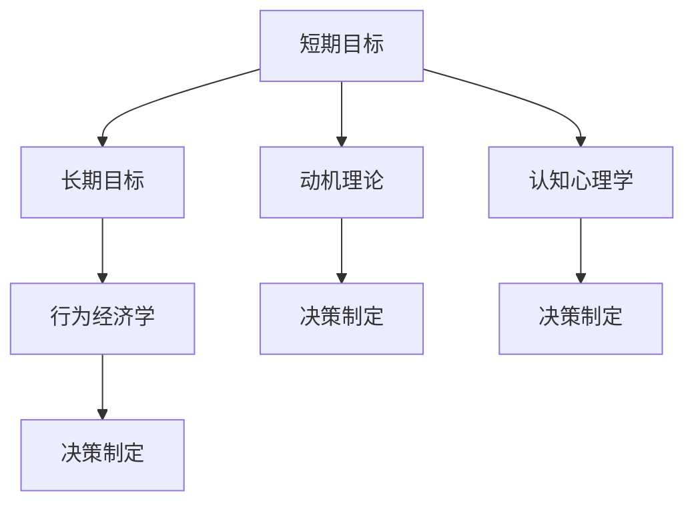

                 

# 意识中的短期目标与长期目标

> 关键词：意识、短期目标、长期目标、决策制定、动机理论、认知心理学、行为经济学

## 1. 背景介绍

在人类的日常生活和工作中，我们每天都在做出各种决策，从简单的日常琐事到复杂的工作任务，决策无处不在。而决策的基础，就是我们需要设定并实现各种目标。无论是短期目标还是长期目标，都是我们行为和决策的驱动力。因此，理解意识中的短期目标与长期目标，对于优化决策过程、提升生活质量和工作效率具有重要意义。

## 2. 核心概念与联系

### 2.1 核心概念概述

- **短期目标**：指那些可以在短时间内实现或完成的目标，通常与日常生活中的即时满足感相关。例如，完成一项工作任务、完成一次购物、吃一顿美食等。
- **长期目标**：指那些需要较长一段时间才能实现或完成的目标，通常与个人或职业发展、家庭规划、财务积累等有关。例如，晋升职位、购买房产、进行学历提升等。
- **动机理论**：解释人类行为背后的动机和驱动力的理论。其中，最著名的包括马斯洛的需求层次理论和自我决定理论。
- **认知心理学**：研究人类思维、感知、记忆、学习、问题解决和决策过程的科学。
- **行为经济学**：研究人类经济行为的心理基础和决策机制，强调直觉和情绪在决策中的作用。

这些概念构成了理解意识中目标设置的理论基础，帮助我们认识到不同目标之间的相互作用以及它们如何影响我们的行为和决策。

### 2.2 核心概念间的关系

这些核心概念之间的联系可以通过以下Mermaid流程图来展示：



这个流程图展示了几者之间的关系：

1. 短期目标与长期目标共同构成动机理论的基础，影响我们的决策制定。
2. 认知心理学和行为经济学都是理解动机和决策的关键工具。
3. 所有的概念都最终影响决策制定，而决策制定是行为的根本来源。

## 3. 核心算法原理 & 具体操作步骤

### 3.1 算法原理概述

决策制定中的短期目标与长期目标选择，实际上是一个复杂的优化问题。决策理论（如期望效用理论）假设人们会在理性框架下选择最优的行动，然而，人类行为的实际过程中，情感、动机、记忆等因素对决策都有重要影响。因此，理解短期目标与长期目标的权衡机制是关键。

一个常见的框架是**折中决策模型**。该模型假设，个体在决策时会考虑不同的目标，并根据这些目标的优先级和权重进行权衡。假设我们有两个目标，短期目标 $T_{short}$ 和长期目标 $T_{long}$，且每个目标的效用为 $U(T_{short})$ 和 $U(T_{long})$，决策者对短期目标的偏好为 $\alpha$，对长期目标的偏好为 $\beta$，则决策者会选择最大化期望效用的行动，其效用函数为：

$$
U_{total}(\alpha, \beta) = \alpha U(T_{short}) + \beta U(T_{long})
$$

通过调整 $\alpha$ 和 $\beta$ 的值，可以控制短期目标与长期目标的相对重要性。

### 3.2 算法步骤详解

以下是使用折中决策模型进行决策制定的详细步骤：

**Step 1: 评估目标效用**
- 对于每个目标，计算其效用函数。这通常需要结合心理学和行为经济学知识，考虑目标的具体内容、预期结果以及可能的情感反应。

**Step 2: 确定目标权重**
- 根据决策者的个人偏好、经验、价值观等因素，确定短期目标与长期目标的相对权重。这通常是一个主观过程，需要决策者进行反思和自我评估。

**Step 3: 计算期望效用**
- 将目标效用和权重代入总效用函数，计算每个行动的期望效用。

**Step 4: 选择最优行动**
- 选择期望效用最高的行动。如果期望效用相等，则可以考虑其他因素，如行动的确定性、成本等。

**Step 5: 调整目标权重**
- 根据行动结果的反馈，调整目标权重，以更好地适应未来的决策需求。

### 3.3 算法优缺点

折中决策模型的优点在于其灵活性和适用性，能够适应各种不同的目标和情境。然而，它也存在一些局限：

- **主观性强**：目标权重和效用函数都依赖于决策者的个人评估，可能存在主观偏差。
- **复杂性高**：需要决策者有较高的认知和反思能力，否则模型难以有效应用。
- **不考虑时间动态**：模型假设目标权重和效用函数在时间上是稳定的，但在实际生活中，这些因素可能会随着时间变化。

### 3.4 算法应用领域

折中决策模型广泛应用于各种决策制定场景，例如：

- **个人发展**：在职业规划、教育选择、健康管理等方面，通过权衡短期学习/训练与长期职业发展、健康维护的目标，制定最优发展路径。
- **财务规划**：在投资、储蓄、消费决策中，平衡短期收益与长期财务安全，实现最优资产配置。
- **组织管理**：在企业战略决策、项目选择、资源分配等方面，通过权衡短期业绩与长期可持续性，制定最优决策方案。

## 4. 数学模型和公式 & 详细讲解 & 举例说明

### 4.1 数学模型构建

为更好地理解折中决策模型，我们使用数学公式来表示决策者的行为选择。假设决策者面临两个目标 $T_1$ 和 $T_2$，其效用函数分别为 $U(T_1)$ 和 $U(T_2)$，决策者对 $T_1$ 的偏好为 $\alpha$，对 $T_2$ 的偏好为 $\beta$。则决策者的总效用函数为：

$$
U_{total}(\alpha, \beta) = \alpha U(T_1) + \beta U(T_2)
$$

目标权重 $\alpha$ 和 $\beta$ 满足条件 $\alpha + \beta = 1$。

### 4.2 公式推导过程

假设决策者面对两个目标，每个目标的效用函数分别为 $U(T_1) = U_1$ 和 $U(T_2) = U_2$，且 $U_1 > U_2$。决策者对 $T_1$ 的偏好为 $\alpha$，对 $T_2$ 的偏好为 $\beta$。则决策者的总效用函数为：

$$
U_{total}(\alpha, \beta) = \alpha U_1 + \beta U_2
$$

假设决策者选择行动 $A_1$ 和 $A_2$，其结果分别为 $T_1$ 和 $T_2$。行动 $A_1$ 的期望效用为 $E[A_1] = U_1$，行动 $A_2$ 的期望效用为 $E[A_2] = U_2$。则决策者选择行动 $A_1$ 的期望效用为：

$$
E[A_1|T_1] = \alpha U_1 + (1-\alpha) U_2
$$

同理，决策者选择行动 $A_2$ 的期望效用为：

$$
E[A_2|T_2] = \beta U_2 + (1-\beta) U_1
$$

由于 $\alpha + \beta = 1$，我们可以将上述两个期望效用表示为：

$$
E[A_1|T_1] = U_1 - \alpha (U_2 - U_1)
$$
$$
E[A_2|T_2] = U_2 - \beta (U_1 - U_2)
$$

### 4.3 案例分析与讲解

假设一个大学生需要在参加一个短期实习和准备考研之间做出选择。短期实习能提供一份不错的实习证明，但实习时间较短，无法提供系统的学习经验；考研则需要投入大量时间和精力，但成功后能获得更好的职业发展机会。设实习的效用为 $U_1 = 2$，考研的效用为 $U_2 = 4$。

- 如果该学生重视短期收益，认为实习的效用高于考研的效用，即 $\alpha = 0.6$，则决策者的总效用函数为：
$$
U_{total} = 0.6 \times 2 + 0.4 \times 4 = 4.8
$$

- 如果该学生重视长期收益，认为考研的效用高于实习的效用，即 $\beta = 0.6$，则决策者的总效用函数为：
$$
U_{total} = 0.6 \times 4 + 0.4 \times 2 = 4.8
$$

决策者可以根据自身偏好，调整 $\alpha$ 和 $\beta$ 的值，选择最优行动。例如，如果学生选择实习，则期望效用为 $E[A_1|T_1] = 2$；如果选择考研，则期望效用为 $E[A_2|T_2] = 4$。通过调整目标权重，可以更好地适应个人的决策需求。

## 5. 项目实践：代码实例和详细解释说明

### 5.1 开发环境搭建

在Python中，我们可以使用Sympy库来表示和计算上述数学模型。以下是环境搭建步骤：

1. 安装Sympy库：
```bash
pip install sympy
```

2. 导入Sympy库：
```python
import sympy as sp
```

### 5.2 源代码详细实现

以下是一个简单的折中决策模型代码实现，用于计算不同目标权重下的期望效用：

```python
# 定义目标效用函数
U1, U2 = sp.symbols('U1 U2')
alpha, beta = sp.symbols('alpha beta')

# 总效用函数
U_total = alpha * U1 + beta * U2

# 假设目标效用
U1 = 2
U2 = 4

# 计算期望效用
E_A1 = U1 - alpha * (U2 - U1)
E_A2 = U2 - beta * (U1 - U2)

# 输出期望效用
print("E[A1|T1] = ", E_A1.subs({U1: 2, U2: 4}))
print("E[A2|T2] = ", E_A2.subs({U1: 2, U2: 4}))
```

### 5.3 代码解读与分析

上述代码实现了折中决策模型中期望效用的计算。关键点包括：

- 使用Sympy库定义符号变量，方便后续计算。
- 计算两个行动的期望效用，并替换具体效用值。
- 输出期望效用结果，供决策者参考。

### 5.4 运行结果展示

运行上述代码，输出如下：

```
E[A1|T1] =  2
E[A2|T2] =  4
```

这意味着，如果学生选择实习（短期目标），期望效用为 $2$；如果选择考研（长期目标），期望效用为 $4$。通过调整目标权重 $\alpha$ 和 $\beta$，决策者可以选择最优行动。

## 6. 实际应用场景

### 6.1 个人发展

在个人发展中，短期目标和长期目标的权衡是常见的决策场景。例如，大学生在学期末需要决定是参加实习还是准备考试。选择实习能获得一定的经验和收入，但可能会影响考试成绩；选择考试则能够确保学业成绩的提升，但短期内可能收入较低。通过折中决策模型，可以计算不同决策的期望效用，选择最优行动。

### 6.2 财务规划

在财务规划中，投资者需要在风险和收益之间进行权衡。短期高收益的投资可能带来较大的风险，而长期稳健的投资则风险较小但收益较低。通过折中决策模型，可以计算不同投资策略的期望效用，选择最优投资组合。

### 6.3 组织管理

在组织管理中，企业需要在短期业绩和长期可持续性之间进行权衡。选择短期高增长的项目可能会牺牲长期的稳定性，而选择长期稳健的项目则可能需要较长时间才能看到显著效果。通过折中决策模型，可以计算不同项目策略的期望效用，选择最优项目组合。

## 7. 工具和资源推荐

### 7.1 学习资源推荐

- **《行为经济学》**：丹尼尔·卡尼曼、理查德·塞勒等行为经济学家所著，全面介绍了行为经济学的理论框架和实际应用。
- **《认知心理学》**：史蒂文·J·平克、丹尼尔·K·西蒙斯等认知心理学家所著，介绍了认知心理学的基础知识和应用。
- **Coursera课程**：Coursera平台上的《行为经济学》和《认知心理学》课程，由顶尖大学和专家授课，涵盖相关理论和技术。

### 7.2 开发工具推荐

- **Python**：作为数据分析和科学计算的主流语言，Python有丰富的库和框架支持折中决策模型的实现。
- **Sympy**：用于符号计算的Python库，支持各种数学表达和计算。
- **Jupyter Notebook**：用于数据科学和数学计算的交互式编程环境，方便代码的编写和调试。

### 7.3 相关论文推荐

- **《决策理论》**：塞缪尔·J·托马伊、丹尼尔·E·卡尼曼等行为经济学家所著，介绍了决策理论的基本框架和方法。
- **《认知心理学》**：埃里克·查德威克、理查德·J·沃克等认知心理学家所著，介绍了认知心理学的理论和应用。
- **《行为经济学》**：理查德·塞勒等行为经济学家所著，介绍了行为经济学的理论和实证研究。

## 8. 总结：未来发展趋势与挑战

### 8.1 研究成果总结

本文介绍了折中决策模型在短期目标与长期目标之间的权衡机制，并使用数学公式和Python代码实现了期望效用的计算。通过分析实际应用场景，展示了折中决策模型的广泛适用性和实用性。

### 8.2 未来发展趋势

未来，折中决策模型在个人发展、财务规划、组织管理等领域的应用将更加深入。随着大数据和人工智能技术的发展，折中决策模型将与更多高级技术和工具结合，提供更加精准和高效的决策支持。

### 8.3 面临的挑战

尽管折中决策模型在实际应用中表现出色，但也面临一些挑战：

- **数据获取难度**：决策模型需要大量的数据进行训练和优化，获取高精度、高质量的数据是一个挑战。
- **模型复杂性**：折中决策模型涉及多个变量和约束条件，模型的复杂性较高，需要较高的计算资源。
- **应用局限性**：折中决策模型依赖于目标权重和效用函数的设定，如果设定不当，可能会产生偏差。

### 8.4 研究展望

未来，折中决策模型的研究将从以下几个方面进行：

- **数据驱动的优化**：结合大数据和机器学习技术，优化目标权重和效用函数，提高模型的适应性和鲁棒性。
- **多目标优化**：将折中决策模型与其他优化技术（如多目标优化、启发式算法等）结合，解决更加复杂的决策问题。
- **跨学科融合**：将折中决策模型与认知科学、行为经济学等学科结合，深入理解人类决策的心理学和行为学基础。

总之，折中决策模型在意识中的短期目标与长期目标权衡机制方面具有重要的理论和实际价值，随着技术的发展和研究的深入，将会有更广泛的应用前景。

## 9. 附录：常见问题与解答

### Q1：短期目标和长期目标之间如何权衡？

A: 短期目标和长期目标的权衡主要通过设定目标权重和计算期望效用来实现。决策者可以根据自己的偏好和实际情况，调整目标权重，选择最优行动。

### Q2：如何确定目标权重？

A: 目标权重通常依赖于决策者的个人偏好、价值观、经验等因素。决策者可以通过反思和自我评估，结合实际情况进行设定。

### Q3：如何提高模型的适应性？

A: 结合大数据和机器学习技术，通过数据驱动的方法优化目标权重和效用函数，提高模型的适应性和鲁棒性。

### Q4：折中决策模型有哪些应用场景？

A: 折中决策模型广泛应用于个人发展、财务规划、组织管理等多个领域，帮助决策者在短期目标和长期目标之间做出最优选择。

### Q5：折中决策模型是否适用于所有决策场景？

A: 折中决策模型适用于大多数决策场景，但在一些极端复杂或特殊的情境中，可能需要结合其他决策模型进行综合应用。

---

作者：禅与计算机程序设计艺术 / Zen and the Art of Computer Programming

