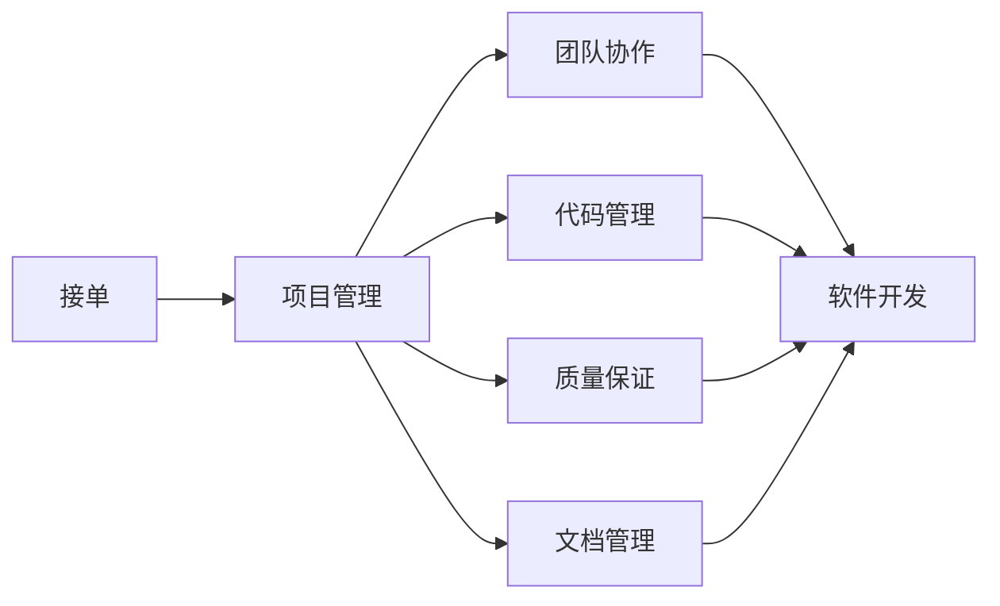

                 

# 技术外包：从接单到建立工作室

技术外包已成为IT行业中越来越常见的现象，尤其是随着互联网的普及和全球化进程的加速。本文将深入探讨技术外包的各个方面，从接单到建立工作室，全面剖析其工作原理和操作流程。

## 1. 背景介绍

### 1.1 技术外包的兴起

随着互联网和软件行业的快速发展，技术外包需求日益增长。大型企业、中小型创业公司以及个人开发者都开始寻求外包服务来优化自身业务流程，提高工作效率。技术外包不仅能够帮助企业降低成本、快速交付，还能提供高质量的软件开发、系统维护和咨询服务。

### 1.2 技术外包的主要形式

技术外包主要包括以下几种形式：
- **软件开发外包**：企业将部分或全部软件开发工作外包给第三方，由他们完成需求分析、设计、编码、测试和部署。
- **系统维护外包**：企业将已有的软件系统维护任务外包，包括性能优化、bug修复、功能扩展等。
- **咨询服务外包**：企业聘请外部专家提供技术咨询，帮助解决复杂的技术问题，或者参与项目评估和风险管理。
- **测试外包**：企业将软件测试任务外包给专业的测试公司，包括单元测试、集成测试、性能测试等。
- **云服务外包**：企业将部分或全部云服务管理工作外包，由第三方管理云平台和云服务，如AWS、Azure和Google Cloud。

## 2. 核心概念与联系

### 2.1 核心概念概述

为了更好地理解技术外包的工作原理，我们首先需要了解以下几个核心概念：

- **接单**：客户将任务需求提交给外包服务商，服务商选择适合的团队并承接任务。
- **项目管理**：制定项目计划、分配资源、跟踪进度、协调沟通等，确保项目按时交付。
- **团队协作**：多个开发人员协同工作，共同完成任务，提高效率和质量。
- **代码管理**：使用版本控制工具如Git、SVN等，管理代码库、分支和合并，确保代码安全和一致性。
- **质量保证**：通过代码审查、单元测试、集成测试等手段，确保软件质量和稳定性。
- **文档管理**：编写和维护项目文档，包括需求文档、设计文档、技术文档、用户手册等。

### 2.2 核心概念的联系

技术外包的成功实现需要依赖于以上核心概念的协同工作。接单是技术外包的起点，项目管理是关键环节，团队协作和代码管理是基础保障，质量保证是核心目标，文档管理则是成果交付的重要手段。以下是一个简化的Mermaid流程图，展示技术外包过程中各个概念的联系：



## 3. 核心算法原理 & 具体操作步骤

### 3.1 算法原理概述

技术外包的核心算法原理基于项目管理方法和软件开发方法论，主要包括：

- **敏捷开发**：采用迭代开发和持续集成的方法，快速响应需求变更，提高交付速度和质量。
- **瀑布模型**：按照线性顺序进行需求分析、设计、编码、测试和部署，每个阶段严格遵循上一阶段的工作成果。
- **精益开发**：以最小的资源投入和最短的时间实现最大价值，强调快速交付和持续改进。
- **DevOps**：将开发和运维流程紧密集成，实现自动化部署、持续监控和快速反馈。

### 3.2 算法步骤详解

技术外包的操作流程大致分为以下几个步骤：

#### 第一步：接单和需求分析

- **接单**：客户提交项目需求，外包服务商初步评估可行性，选择合适团队。
- **需求分析**：与客户进行详细沟通，理解项目背景、功能需求、技术要求和交付时间等，编写需求文档。

#### 第二步：项目规划和资源分配

- **项目规划**：根据需求文档，制定项目计划，包括时间表、里程碑和关键路径。
- **资源分配**：确定项目所需的人力资源、技术资源和物理资源，分配到具体的开发团队。

#### 第三步：软件开发和质量保证

- **软件开发**：团队按照项目计划进行迭代开发，每个迭代完成一个功能模块，进行单元测试和代码审查。
- **质量保证**：通过持续集成工具如Jenkins、Travis CI等，确保每次提交的代码经过自动化测试和质量检查。

#### 第四步：系统集成和测试

- **系统集成**：将各个模块进行整合，确保系统无缝运行，进行集成测试和性能测试。
- **系统部署**：将系统部署到客户指定的环境，进行功能和性能测试。

#### 第五步：交付和售后支持

- **交付**：向客户提供完整的项目交付物，包括软件产品、技术文档、用户手册等。
- **售后支持**：提供后续的技术支持和维护服务，处理客户的反馈和问题。

### 3.3 算法优缺点

技术外包的优点包括：

- **降低成本**：通过外包可以大幅降低企业的人力成本、设备成本和运营成本。
- **提高效率**：外包服务商通常具备高效的项目管理能力和专业的团队，能够快速响应需求，提高项目交付速度。
- **获取优质资源**：外包服务商能够提供高质量的技术支持和专业人才，帮助企业解决复杂的技术问题。
- **专注核心业务**：企业可以将非核心业务外包，专注于自身核心业务的发展和创新。

技术外包的缺点包括：

- **信息不对称**：客户和外包服务商之间存在信息不对称，可能导致沟通不畅和需求变更困难。
- **质量控制困难**：外包服务商的质量保证体系可能不如内部团队，导致软件质量和安全性存在隐患。
- **知识产权风险**：外包服务商可能会涉及商业机密和技术泄露，导致知识产权风险。
- **依赖性强**：客户对外部团队的依赖性强，可能导致项目延迟或失败的风险。

### 3.4 算法应用领域

技术外包广泛应用于以下几个领域：

- **互联网和移动应用**：电商、社交、游戏、金融等行业，需要快速开发和迭代。
- **企业级软件**：ERP、CRM、OA等企业管理系统，需要稳定可靠的系统支持。
- **数据科学和机器学习**：数据挖掘、预测分析、自然语言处理等，需要专业的数据科学团队支持。
- **云计算**：云基础设施管理、云应用开发和云安全服务等，需要专业的云计算技术支持。
- **物联网**：传感器数据采集、设备管理、数据分析和应用开发，需要专业的物联网技术支持。

## 4. 数学模型和公式 & 详细讲解 & 举例说明

### 4.1 数学模型构建

技术外包的数学模型可以抽象为一个复杂的系统，其中包含多个变量和参数，以下是主要的数学模型：

- **任务量模型**：描述项目所需的工作量，包括需求分析、设计、编码、测试等各个阶段的工作量。
- **资源量模型**：描述项目所需的人力资源、技术资源和物理资源。
- **进度模型**：描述项目进度和关键路径，包括各个迭代的任务和时间节点。
- **成本模型**：描述项目成本和预算，包括人工成本、设备成本、技术支持成本等。

### 4.2 公式推导过程

以任务量模型为例，假设任务量为 $T$，人力资源为 $L$，技术资源为 $S$，物理资源为 $P$，每个迭代需要 $t_i$ 天完成，迭代数为 $n$，则任务量模型可以表示为：

$$
T = \sum_{i=1}^{n} t_i
$$

其中 $t_i$ 表示第 $i$ 个迭代所需的时间。

### 4.3 案例分析与讲解

假设客户需要一个电商系统，需要一个月完成开发和测试，外包服务商提供的团队包括5名开发人员和2名测试人员，开发人员每人每天能完成1个任务单元，测试人员每人每天能完成1.2个任务单元。根据任务量模型，可以计算出每个迭代所需的时间和任务单元数，进而分配到具体的开发和测试任务。

## 5. 项目实践：代码实例和详细解释说明

### 5.1 开发环境搭建

要实现技术外包的项目管理，需要搭建相应的开发环境。以下是使用JIRA和Git进行项目管理和代码协作的开发环境配置：

1. **安装JIRA**：从官网下载并安装JIRA，创建和管理项目、任务和用户。
2. **配置Git**：安装Git并配置SSH密钥，确保与远程仓库进行安全通信。
3. **部署代码管理工具**：安装GitHub或GitLab，创建代码库和仓库，配置CI/CD流程。

### 5.2 源代码详细实现

以下是一个使用JIRA和Git进行项目管理的示例代码：

```python
from jira import JIRA
from git import Repo

# 初始化JIRA
jira = JIRA('https://jira.example.com', username='user', password='pass')

# 获取项目信息
project = jira.project('PROJ-001')
issues = jira.search('project={}'.format(project.key))

# 创建任务
issue = jira.create_issue(issuetype=project.issuetype,
                          summary='任务1',
                          description='任务详细描述')

# 分配任务给开发人员
jira.add_assignee(issue.key, 'dev1')

# 执行任务
# ...

# 提交代码到Git仓库
repo = Repo.clone_from('https://github.com/example/example', 'myproject')
commits = repo.git.log('-h', '--pretty=%h')

# 更新任务状态
jira.update_issue(issue.key, status='In Progress')
```

### 5.3 代码解读与分析

上述代码实现了JIRA任务和Git仓库的基本操作，包括创建任务、分配任务、提交代码和更新任务状态。代码通过JIRA和Git的API接口，实现了任务管理和代码协作的自动化。在实际应用中，还需要结合项目管理和质量保证工具，如Jenkins、Travis CI等，实现持续集成和自动化测试，确保项目的质量和进度。

### 5.4 运行结果展示

假设我们通过上述代码成功创建了一个任务，并将其分配给开发人员。开发人员完成了任务，并提交了代码。此时，我们可以使用JIRA查看任务的状态，确认是否已经进入下一个迭代：


## 6. 实际应用场景

### 6.1 电商系统开发

电商平台需要快速迭代和扩展，技术外包可以提供高效的软件开发支持。外包服务商可以组建专业的开发团队，使用敏捷开发方法，快速响应需求变更，开发高性能、易扩展的电商系统。

### 6.2 企业级软件维护

企业级软件需要稳定可靠的系统支持，技术外包可以提供专业的系统维护服务，包括性能优化、安全加固、功能扩展等。外包服务商可以提供24/7的技术支持，确保系统的高可用性和稳定性。

### 6.3 数据科学和机器学习项目

数据科学和机器学习项目需要专业的数据科学团队，技术外包可以提供高质量的数据科学支持和解决方案。外包服务商可以提供数据清洗、特征工程、模型训练和评估等全流程服务，帮助企业快速实现商业价值。

### 6.4 云计算平台管理

云计算平台需要专业的技术支持和运维服务，技术外包可以提供全面的云服务管理解决方案。外包服务商可以提供云基础设施管理、云应用开发和云安全服务等，确保云平台的高效和安全运行。

## 7. 工具和资源推荐

### 7.1 学习资源推荐

为了帮助开发者系统掌握技术外包的理论基础和实践技巧，以下是一些优质的学习资源：

1. **《敏捷项目管理》**：详细介绍了敏捷开发和项目管理的方法论，帮助开发者掌握敏捷开发的核心思想。
2. **《DevOps实践指南》**：介绍了DevOps的基本概念、实践和工具，帮助开发者实现开发和运维的紧密集成。
3. **《软件测试权威指南》**：介绍了软件测试的基本方法和工具，帮助开发者进行高质量的软件测试。
4. **《项目管理和质量保证》**：介绍了项目管理的基本原则和质量保证的方法，帮助开发者实现高效的项目管理和质量保障。
5. **《JIRA高级管理》**：详细介绍了JIRA的高级功能和配置方法，帮助开发者高效管理项目和任务。

### 7.2 开发工具推荐

技术外包的开发工具推荐以下几款：

1. **JIRA**：用于项目管理、任务管理和团队协作的强大工具，支持敏捷开发和DevOps实践。
2. **Git**：版本控制工具，支持分布式版本管理和代码协作。
3. **Jenkins**：持续集成和持续部署工具，支持自动化测试和部署。
4. **Travis CI**：基于Git的持续集成平台，支持自动化构建和测试。
5. **AWS、Azure和Google Cloud**：云基础设施和云服务管理平台，支持高效的管理和部署。

### 7.3 相关论文推荐

以下是几篇关于技术外包的知名论文，推荐阅读：

1. **《软件外包：从接单到交付》**：分析了技术外包从接单到交付的全流程，探讨了技术外包的成功因素。
2. **《敏捷开发和项目管理的实践》**：介绍了敏捷开发和项目管理的方法和工具，提供了实际的案例和应用经验。
3. **《DevOps实践和工具》**：详细介绍了DevOps的实践方法和工具，提供了DevOps转型的成功经验。
4. **《软件测试和质量保证》**：介绍了软件测试和质量保证的基本方法和工具，提供了实际的软件测试案例。

## 8. 总结：未来发展趋势与挑战

### 8.1 总结

本文对技术外包从接单到建立工作室的各个方面进行了全面系统的介绍。首先阐述了技术外包的兴起和主要形式，明确了技术外包在降低成本、提高效率、获取优质资源等方面的优势。其次，从接单到交付的全流程，详细讲解了技术外包的实现步骤和关键环节，提供了具体的项目管理和代码协作工具。最后，探讨了技术外包的未来发展趋势和面临的挑战，提出了相关的学习资源和推荐工具。

通过本文的系统梳理，可以看到，技术外包已成为IT行业的重要组成部分，通过接单和项目管理，能够实现高效的软件开发和系统维护，降低企业的运营成本，提升项目的交付速度和质量。未来，随着云计算和DevOps的普及，技术外包将变得更加高效和自动化，成为企业数字化转型的重要助力。

### 8.2 未来发展趋势

展望未来，技术外包将呈现以下几个发展趋势：

1. **自动化和智能化**：技术外包将越来越多地采用自动化和智能化工具，如AI、机器学习等，提升效率和质量。
2. **跨领域合作**：技术外包将跨领域合作，将软件开发、系统维护、数据科学、云计算等技术整合，提供一体化的解决方案。
3. **全球化服务**：技术外包将打破地域限制，提供全球化服务，帮助企业实现全球化发展。
4. **区块链技术应用**：技术外包将引入区块链技术，确保任务接单和需求管理的透明和可追溯性。
5. **持续集成和持续部署**：技术外包将采用持续集成和持续部署的方法，实现高效的自动化构建和测试。

### 8.3 面临的挑战

尽管技术外包已经取得了显著进展，但在迈向更加智能化和自动化的过程中，它仍面临以下挑战：

1. **信息不对称**：客户和外包服务商之间存在信息不对称，可能导致沟通不畅和需求变更困难。
2. **质量控制困难**：外包服务商的质量保证体系可能不如内部团队，导致软件质量和安全性存在隐患。
3. **知识产权风险**：外包服务商可能会涉及商业机密和技术泄露，导致知识产权风险。
4. **依赖性强**：客户对外部团队的依赖性强，可能导致项目延迟或失败的风险。
5. **文化差异**：不同国家和文化背景的外包服务商可能存在文化差异，影响团队协作和沟通效率。

### 8.4 研究展望

面对技术外包面临的挑战，未来的研究需要在以下几个方面寻求新的突破：

1. **建立透明和可追溯的信息系统**：引入区块链技术，建立透明和可追溯的信息系统，确保任务接单和需求管理的透明和可追溯性。
2. **引入人工智能和机器学习**：引入AI和机器学习技术，实现智能化的任务分配和质量控制，提高效率和质量。
3. **跨领域合作与协同开发**：探索跨领域合作与协同开发的方法，整合多种技术，提供一体化的解决方案。
4. **引入区块链技术**：引入区块链技术，确保任务接单和需求管理的透明和可追溯性。
5. **建立全球化服务体系**：建立全球化服务体系，提供高质量的技术支持和专业人才，帮助企业实现全球化发展。

总之，技术外包在未来将进一步自动化、智能化和全球化，成为企业数字化转型的重要助力。但是，如何在自动化和智能化过程中避免信息不对称、质量控制困难、知识产权风险等问题，将是未来的重要研究方向。

## 9. 附录：常见问题与解答

**Q1：技术外包的接单流程是怎样的？**

A: 技术外包的接单流程包括以下几个步骤：
1. 客户提交项目需求，包括项目背景、功能需求、技术要求和交付时间等。
2. 外包服务商初步评估项目需求和可行性，选择适合的团队。
3. 与客户进行详细沟通，确认需求和技术细节，制定项目计划和预算。
4. 签订合同和协议，明确双方的权利和义务。
5. 正式接单并启动项目。

**Q2：如何选择合适的技术外包服务商？**

A: 选择合适的技术外包服务商需要考虑以下几个方面：
1. 服务商的专业能力和资质。选择有经验、有资质的服务商，能够提供高质量的技术支持和服务。
2. 服务商的项目管理能力和资源配置。选择有良好的项目管理能力和服务商，能够按时交付项目。
3. 服务商的客户服务和售后支持。选择有良好的客户服务和售后支持的服务商，能够及时解决客户的问题和反馈。
4. 服务商的案例和口碑。选择有成功案例和良好口碑的服务商，能够保证项目质量和效果。

**Q3：技术外包的质量控制和测试管理有哪些关键点？**

A: 技术外包的质量控制和测试管理需要考虑以下几个关键点：
1. 代码审查和自动化测试。通过代码审查和自动化测试，确保代码质量和系统稳定性。
2. 持续集成和持续部署。采用持续集成和持续部署的方法，实现高效的自动化构建和测试。
3. 性能测试和负载测试。通过性能测试和负载测试，确保系统的高可用性和稳定性。
4. 用户测试和反馈。通过用户测试和反馈，了解用户需求和体验，改进系统功能和服务。

**Q4：如何实现高效的技术外包项目管理？**

A: 实现高效的技术外包项目管理需要考虑以下几个方面：
1. 采用敏捷开发和敏捷项目管理方法。采用敏捷开发和敏捷项目管理方法，快速响应需求变更，提高项目交付速度。
2. 建立透明和可追溯的信息系统。引入区块链技术，建立透明和可追溯的信息系统，确保任务接单和需求管理的透明和可追溯性。
3. 引入自动化和智能化工具。引入AI和机器学习技术，实现智能化的任务分配和质量控制，提高效率和质量。
4. 建立跨领域合作与协同开发机制。探索跨领域合作与协同开发的方法，整合多种技术，提供一体化的解决方案。
5. 持续监控和反馈。通过持续监控和反馈，及时发现和解决问题，确保项目进度和质量。

**Q5：如何规避技术外包的风险？**

A: 规避技术外包的风险需要考虑以下几个方面：
1. 选择合适的服务商。选择有经验、有资质、有良好口碑的服务商，能够提供高质量的技术支持和服务。
2. 签订合同和协议。签订明确的合同和协议，明确双方的权利和义务，规避知识产权风险。
3. 引入区块链技术。引入区块链技术，确保任务接单和需求管理的透明和可追溯性，规避信息不对称和需求变更困难的风险。
4. 持续监控和反馈。通过持续监控和反馈，及时发现和解决问题，规避项目延迟和失败的风险。

总之，技术外包是IT行业的重要组成部分，通过接单和项目管理，能够实现高效的软件开发和系统维护，降低企业的运营成本，提升项目的交付速度和质量。但是，如何在自动化和智能化过程中避免信息不对称、质量控制困难、知识产权风险等问题，将是未来的重要研究方向。

---

作者：禅与计算机程序设计艺术 / Zen and the Art of Computer Programming

