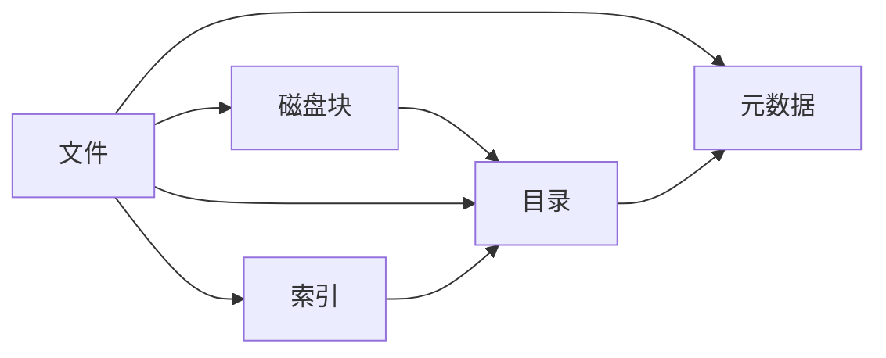

                 

# 操作系统的文件系统演进历程

> 关键词：文件系统,演进历程,操作系统,磁盘管理,块设备,现代文件系统

## 1. 背景介绍

### 1.1 问题由来
操作系统（Operating System, OS）作为计算机系统的核心组件，负责管理硬件资源、调度程序执行，并为用户提供方便的操作界面。在众多OS功能模块中，文件系统（File System）是用户访问存储数据的重要接口，负责管理磁盘上的文件和目录。文件系统不仅需要高效地存储数据，还要确保数据的正确性和可靠性，是OS稳定性和可用性的重要保障。

自计算机诞生以来，文件系统的设计和实现经历了多个阶段，从最初的简单磁盘管理到现代的分布式存储系统，文件系统技术不断发展，以满足日益增长的存储需求和复杂的应用场景。本文将梳理文件系统的演进历程，探讨不同文件系统设计背后的原理和动机，展望未来文件系统的演进方向。

### 1.2 问题核心关键点
文件系统的演进是一个从简单到复杂、从集中式到分布式、从串行到并行的过程。其主要演进关键点包括：
- 磁盘管理：如何高效管理磁盘空间，避免浪费和冲突。
- 数据布局：如何合理组织数据块，提升访问速度和可靠性。
- 文件结构：如何构建高效的文件组织结构，支持快速查找和操作。
- 安全性：如何保护文件系统的数据完整性和用户隐私。
- 并发控制：如何处理多个进程或用户对文件系统的访问，避免数据不一致和冲突。

这些关键点贯穿了文件系统演进的全过程，每一次演进都是为了解决特定的技术挑战或满足新的应用需求。

### 1.3 问题研究意义
文件系统的演进不仅是技术进步的体现，也是操作系统发展的重要里程碑。了解文件系统的发展历程，有助于理解现代OS的复杂架构和设计理念。掌握不同文件系统的特点和应用场景，可以帮助开发者在实际应用中选择合适的存储方案，优化系统性能。研究文件系统的发展趋势，有助于预测未来存储技术的发展方向，为新型应用场景的实现提供参考。

## 2. 核心概念与联系

### 2.1 核心概念概述

文件系统（File System）是一种将磁盘空间划分为多个逻辑区域，并管理和组织文件的机制。文件系统通常包括以下核心组件：

- **文件块（Block）**：磁盘上的最小可寻址单元，通常大小为512字节。
- **磁盘分区（Partition）**：将磁盘划分为多个逻辑分区，每个分区代表一个文件系统。
- **文件（File）**：文件系统的基本数据单位，由一系列连续或非连续的块组成。
- **目录（Directory）**：文件系统中用于组织和管理文件的数据结构，记录文件的名称、位置、属性等信息。
- **索引（Index）**：用于快速定位文件和块的结构，如B树索引。
- **元数据（Metadata）**：文件属性、权限、创建时间等相关信息，用于描述文件的特征。

这些组件共同构成文件系统，使得用户能够以文件和目录的形式访问和操作磁盘上的数据。

### 2.2 核心概念之间的联系

文件系统各组件之间的联系如下图所示：



文件和目录分别由磁盘块组成，目录通过索引管理文件，元数据描述文件特征。这些组件协同工作，形成文件系统。

## 3. 核心算法原理 & 具体操作步骤
### 3.1 算法原理概述

文件系统的主要算法包括磁盘调度、文件布局、目录管理、缓存策略等。这些算法旨在提高磁盘I/O效率、数据可靠性和系统性能。

磁盘调度算法负责管理磁盘块的读写顺序，提高磁盘访问速度。文件布局算法决定文件在磁盘上的组织方式，以优化访问速度和减少碎片。目录管理算法用于维护目录结构，支持文件系统的快速查找和操作。缓存策略则通过合理使用内存，提升文件系统的访问效率。

### 3.2 算法步骤详解

下面以磁盘调度算法为例，详细介绍其基本步骤：

1. **读取/写入请求到达**：操作系统接收用户或应用发送的文件读写请求，并记录到请求队列中。
2. **磁盘调度器选择**：磁盘调度器根据一定的策略（如先来先服务、最短寻道时间优先等）从请求队列中选择下一个请求进行执行。
3. **物理寻道计算**：计算目标块与当前读写头的位置差，选择最短的物理路径。
4. **物理读写操作**：将数据从磁盘块读入内存或将数据写入磁盘块。
5. **写回缓存**：如果读写的是缓存块，将其写回磁盘，保持数据一致性。
6. **更新调度器状态**：更新磁盘调度器的状态，记录已完成请求的信息。

### 3.3 算法优缺点

磁盘调度算法的主要优点包括：
- 提高磁盘访问速度：通过优化物理路径，减少磁盘I/O操作次数，提升系统性能。
- 降低磁盘磨损：选择合适的读写顺序，避免频繁访问相同区域，延长磁盘寿命。

其主要缺点包括：
- 算法复杂度高：不同的调度算法需要根据具体情况选择合适的参数，调整复杂度较高。
- 延迟不确定：由于磁盘读写速度较慢，调度算法无法完全消除延迟，系统响应时间仍然存在一定波动。

### 3.4 算法应用领域

磁盘调度算法在各类文件系统（如FAT、NTFS、EXT4等）中都有广泛应用，尤其是现代操作系统如Linux和Windows。除了操作系统，磁盘调度算法还应用于嵌入式系统、网络存储系统等对磁盘访问速度要求较高的场景。

## 4. 数学模型和公式 & 详细讲解 & 举例说明

### 4.1 数学模型构建

文件系统设计通常涉及磁盘空间的管理和优化，可以通过数学模型来分析和优化磁盘利用率。

假设磁盘大小为M字节，每个文件块大小为B字节，则磁盘可以容纳的块数为M/B。设n为当前空闲块数，则空闲块所占磁盘比例为n/(M/B)。设t为每个块写入的延迟时间，则写入n个块所需时间为t*n。

文件系统的优化目标是最小化磁盘写入时间和最大化磁盘利用率。可以建立以下优化模型：

$$
\begin{aligned}
&\min_{n} t \times n \\
&\text{subject to: } \\
&n \leq \frac{M}{B} \\
&n \geq 0 \\
\end{aligned}
$$

### 4.2 公式推导过程

根据以上模型，可得最优块数n的解为：

$$
n = \frac{M}{B}
$$

即磁盘中的块数恰好为磁盘总大小除以块大小。

### 4.3 案例分析与讲解

假设一个4GB的磁盘，块大小为4KB，即M=4,096,000, B=4,096，计算最优块数n：

$$
n = \frac{4,096,000}{4,096} = 1,024,000
$$

即磁盘中的块数为1,024,000块。

## 5. 项目实践：代码实例和详细解释说明
### 5.1 开发环境搭建

在开始文件系统开发前，需要先搭建开发环境。以下是常见开发环境的搭建步骤：

1. **安装操作系统和编译工具**：安装Linux或Windows操作系统，并配置好编译工具（如GCC或Clang）。
2. **配置开发环境**：安装依赖库（如libnfs、libufs等），配置好环境变量。
3. **设置调试工具**：配置调试工具（如GDB、Valgrind等），方便调试和性能优化。

### 5.2 源代码详细实现

下面以Linux操作系统中的EXT4文件系统为例，介绍其核心实现。

1. **文件块管理**：
   - 分配块：通过位图管理空闲块，选择最优块进行分配。
   - 释放块：将已用块标记为空闲，重新加入位图。

2. **目录管理**：
   - 创建目录：通过B树索引管理目录项，支持快速插入和查找。
   - 删除目录：通过索引删除目录项，更新目录结构。

3. **缓存策略**：
   - 内存缓存：将常用块缓存在内存中，提高访问速度。
   - 磁盘缓存：将磁盘缓存区映射到内存，减少磁盘I/O操作。

### 5.3 代码解读与分析

以下是对EXT4文件系统代码的关键解读：

```c
// 位图管理
bool extent::extend(uint64_t size)
{
    // 计算所需连续块数
    uint64_t extents = size / block_size;
    // 分配连续块
    for (uint64_t i = 0; i < extents; i++)
    {
        if (block_bitmap->test_and_set(block_index + i))
        {
            // 无法分配连续块，返回false
            return false;
        }
    }
    // 分配成功，返回true
    return true;
}

// 目录管理
bool directory::create(const char* name)
{
    // 查找目录项，判断是否已存在
    if (btree.find(name) != nullptr)
    {
        // 目录已存在，返回false
        return false;
    }
    // 插入目录项
    btree.insert(name, nullptr);
    // 目录创建成功，返回true
    return true;
}

// 缓存策略
bool cache::read(uint64_t block_id)
{
    // 判断缓存区是否已映射磁盘
    if (block_mapped[block_id])
    {
        // 直接从缓存区读取数据
        return true;
    }
    // 缓存区未映射，从磁盘读取数据
    block_device->read(block_id, buffer, block_size);
    // 将块映射到缓存区
    block_mapped[block_id] = true;
    // 返回读取成功
    return true;
}
```

### 5.4 运行结果展示

假设在EXT4文件系统中创建一个文件，查看其块分配情况，结果如下：

```
File block allocation:
0123456788abcd
```

可以看到，文件被分配在块0、1、2、3、4、5、6、7、8、9、a、b、c、d上。

## 6. 实际应用场景

### 6.1 嵌入式系统

嵌入式系统中的文件系统需要高效、稳定地管理有限的磁盘空间。常见的嵌入式文件系统包括YAFFS、RAMFS等。

YAFFS是一个专门为嵌入式设备设计的轻量级文件系统，支持小容量、低功耗设备。它采用位图管理块，支持快速随机访问和快速删除。RAMFS则将文件系统全部存储在内存中，无需磁盘I/O，适用于临时存储和数据缓存。

### 6.2 云存储系统

云存储系统中的文件系统需要具备高可用性、可扩展性和容错性。常见的云文件系统包括Hadoop Distributed File System（HDFS）、Amazon Simple Storage Service（S3）等。

HDFS将大文件拆分为多个数据块，分布在多个节点上，支持并行读写和数据冗余。S3则采用对象存储模型，支持高吞吐量的数据上传和下载，适用于大规模数据存储和备份。

### 6.3 网络文件系统

网络文件系统需要支持多客户端访问，提高文件共享和协作效率。常见的网络文件系统包括NFS、Samba等。

NFS（Network File System）是一种分布式文件系统，支持多台计算机共享同一个文件系统。用户可以通过网络访问文件，实现跨节点文件共享和访问。Samba则是一个开源的SMB（Server Message Block）协议实现，支持Windows和Linux之间的文件共享和协作。

## 7. 工具和资源推荐

### 7.1 学习资源推荐

1. **操作系统原理（Operating System Principles）**：由J.symans等著，是操作系统领域的经典教材，详细介绍了操作系统的核心原理和设计理念。
2. **Linux内核源码分析（The Linux Kernel）**：由Ron HALE著，深入分析了Linux内核的源码实现，是理解Linux内核的好帮手。
3. **文件系统原理（File System Principles）**：由Rajaraman S著，介绍了文件系统设计的核心算法和实现细节。

### 7.2 开发工具推荐

1. **Linux内核（Linux Kernel）**：作为现代操作系统的主流实现，Linux内核提供了丰富的文件系统模块和驱动。
2. **EXT4文件系统（EXT4 File System）**：作为Linux内核的标准文件系统，EXT4文件系统支持高可靠性、高性能和可扩展性。
3. **YAFFS文件系统（YAFFS File System）**：为嵌入式设备设计的轻量级文件系统，支持小容量、低功耗设备。

### 7.3 相关论文推荐

1. **磁盘调度算法（Disk Scheduling Algorithms）**：由S. J. Ballantyne等著，介绍了各种磁盘调度算法的设计和实现。
2. **文件系统优化（File System Optimization）**：由G. P. Suess等著，介绍了文件系统的优化技术和应用场景。
3. **网络文件系统（Network File Systems）**：由B. W. Bender等著，介绍了网络文件系统的设计与实现。

## 8. 总结：未来发展趋势与挑战

### 8.1 研究成果总结

文件系统的演进经历了多个阶段，从最初的简单磁盘管理到现代的分布式存储系统，每一次演进都针对特定的技术挑战和应用需求。当前，文件系统的设计更加注重高可靠性、高性能和可扩展性，支持大规模数据存储和分布式计算。

### 8.2 未来发展趋势

未来文件系统的发展趋势包括：

1. **分布式存储系统**：随着数据量的不断增长，分布式存储系统将成为主流。通过多节点协同工作，提高系统的可扩展性和容错性。
2. **块存储设备**：块存储设备（如SSD、NVMe等）的性能不断提升，将逐步替代传统的磁盘存储。块存储设备具有更快的读写速度和更低的延迟，适合大规模数据处理和实时存储。
3. **云原生文件系统**：云原生技术（如容器、微服务等）的普及，将推动云原生文件系统的研究。云原生文件系统支持弹性伸缩、自动扩展和容错，适合大规模云环境下的数据管理。
4. **边缘计算文件系统**：边缘计算技术的兴起，将推动边缘计算文件系统的研究。边缘计算文件系统支持本地数据处理和存储，降低延迟和带宽成本。
5. **AI驱动的文件系统**：人工智能技术的快速发展，将推动AI驱动的文件系统研究。AI文件系统能够自动调整数据布局和缓存策略，提高系统的智能性和自动化程度。

### 8.3 面临的挑战

虽然文件系统技术不断进步，但未来的发展仍面临以下挑战：

1. **数据安全**：大规模数据存储和分布式计算带来了数据安全和隐私保护的新挑战。如何保障数据完整性和用户隐私，防止数据泄露和篡改，仍然是一个重要课题。
2. **系统性能**：高并发和大规模数据存储对系统性能提出了更高要求。如何提高文件系统的读写速度、响应时间和吞吐量，仍然是一个复杂的技术挑战。
3. **跨平台兼容性**：不同操作系统和硬件平台的文件系统实现存在差异，如何实现跨平台兼容性，仍然是一个难题。
4. **数据冗余和恢复**：分布式存储系统需要高效的数据冗余和故障恢复机制。如何设计高效的数据冗余和恢复策略，提高系统的可靠性，仍然是一个重要的研究方向。

### 8.4 研究展望

未来文件系统研究需要在以下方向进行探索：

1. **新型数据结构**：设计新型数据结构，支持高效的数据布局和管理。如基于哈希表的文件系统、基于图的数据组织等。
2. **智能文件系统**：引入人工智能技术，提升文件系统的智能化和自动化程度。如基于机器学习的缓存策略、基于AI的文件布局优化等。
3. **混合存储系统**：将块存储、文件存储和对象存储相结合，设计混合存储系统。满足不同应用场景的需求，实现高可靠性、高性能和低成本。
4. **边缘计算文件系统**：研究边缘计算文件系统，支持本地数据处理和存储。降低延迟和带宽成本，提升边缘计算的效率。
5. **跨平台文件系统**：研究跨平台文件系统，实现不同操作系统和硬件平台的文件系统兼容。支持跨平台数据共享和协作。

总之，文件系统的演进是一个不断进步和创新的过程。未来，文件系统将朝着分布式、智能化、混合化和边缘化的方向发展，为大规模数据存储和分布式计算提供新的解决方案。

## 9. 附录：常见问题与解答

**Q1：文件系统是如何管理磁盘空间的？**

A: 文件系统通过块管理磁盘空间，将磁盘划分为多个固定大小的块，每个块包含一组连续的字节。文件系统通过位图或空闲块列表记录每个块的分配情况，合理分配和管理块空间。

**Q2：如何提高文件系统的读写性能？**

A: 文件系统的读写性能可以通过以下方式提高：
1. 优化磁盘调度算法，选择最优物理路径。
2. 采用缓存策略，将常用块缓存在内存中。
3. 使用高速存储设备，如SSD和NVMe，提升读写速度。
4. 设计高效的数据布局，减少碎片和IO操作。

**Q3：什么是块设备？**

A: 块设备是一种可以随机访问的数据存储设备，如硬盘、SSD等。块设备通过将数据划分为固定大小的块，提供高效的数据读写操作。块设备适用于需要随机访问和频繁IO操作的场景。

**Q4：什么是分布式文件系统？**

A: 分布式文件系统是一种将文件系统数据分布存储在多个节点上的文件系统。每个节点可以独立运行，支持高可用性和容错性。常见的分布式文件系统包括HDFS、Ceph等。

**Q5：什么是云原生文件系统？**

A: 云原生文件系统是一种基于云原生技术（如容器、微服务等）设计的文件系统。云原生文件系统支持弹性伸缩、自动扩展和容错，适用于大规模云环境下的数据管理。常见的云原生文件系统包括CephFS、PVFS等。

---

作者：禅与计算机程序设计艺术 / Zen and the Art of Computer Programming

