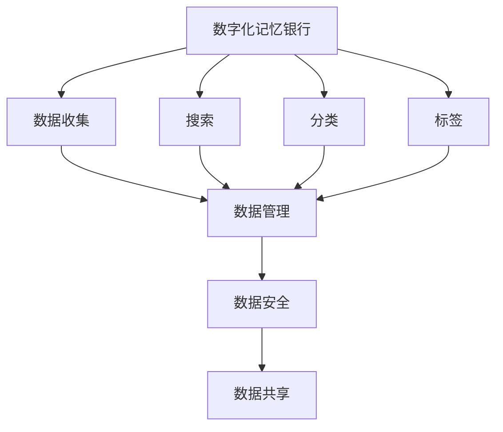
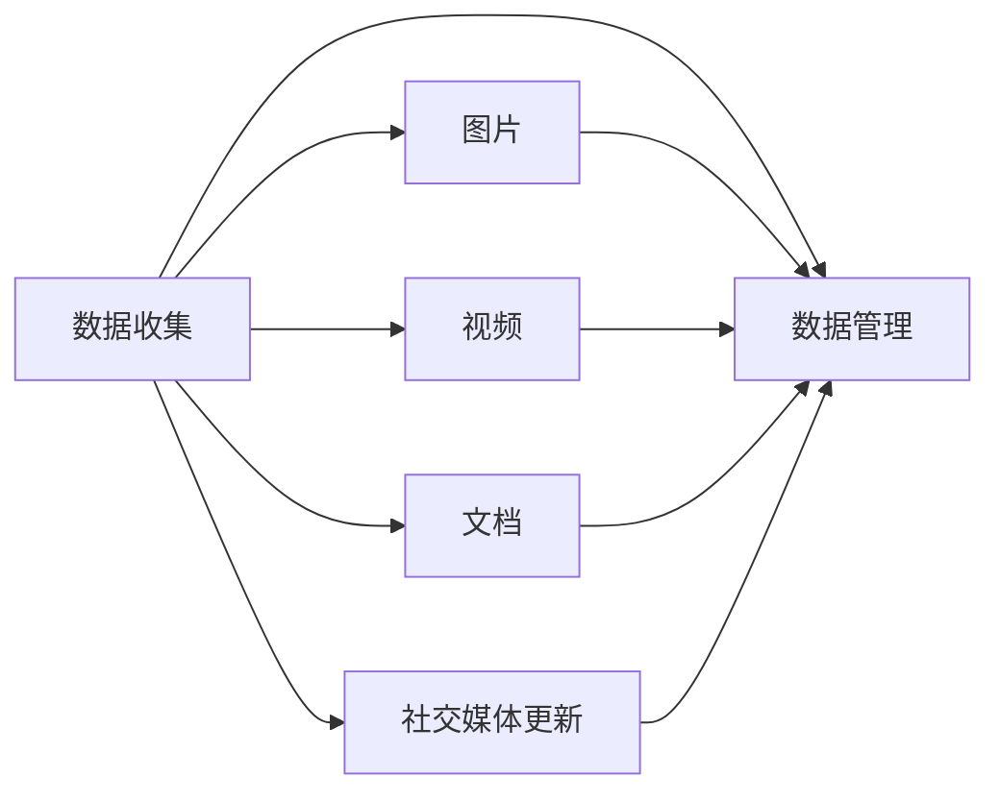
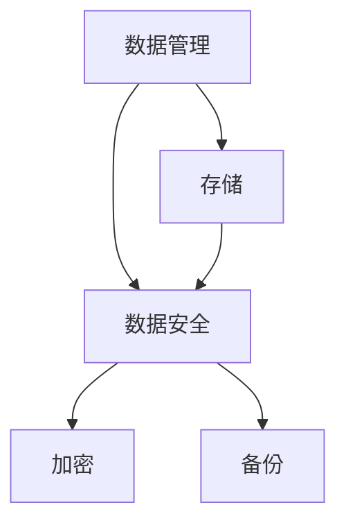
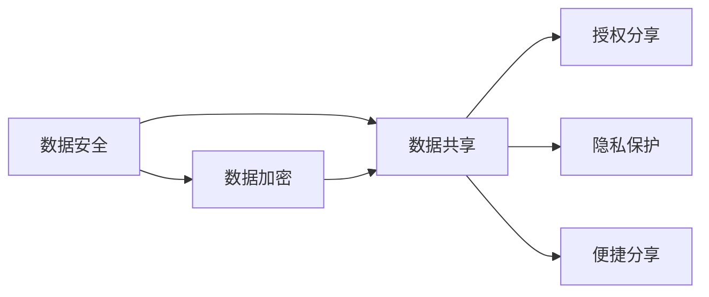
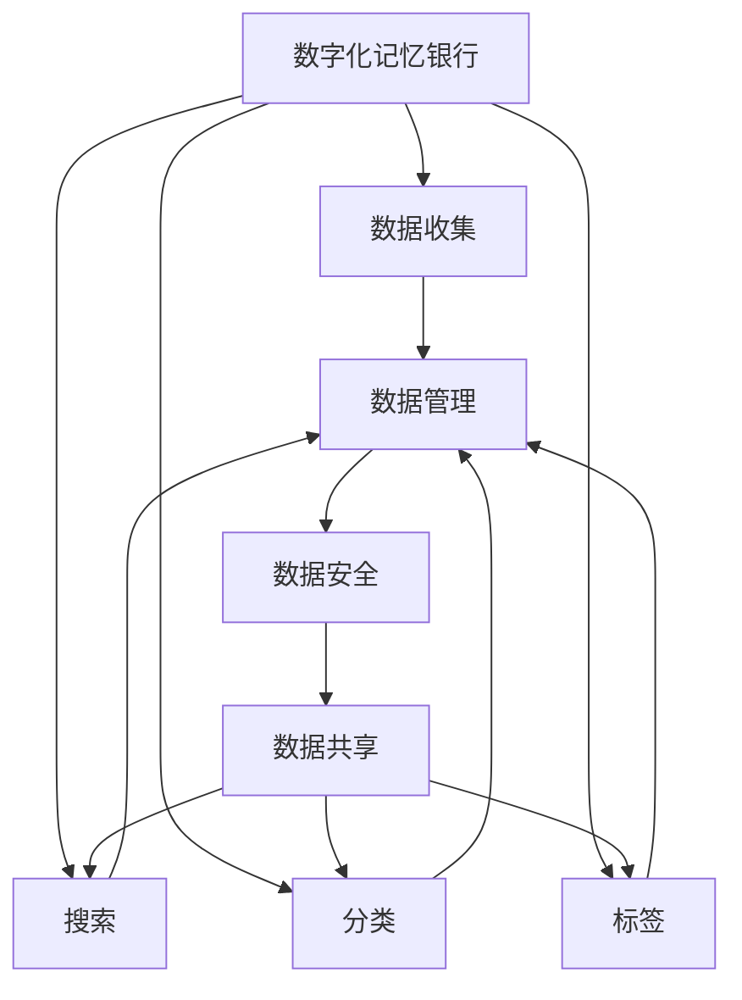

                 

# 数字化记忆银行创业：个人经历的永久保存

> 关键词：数字化记忆银行, 个人历史, 技术创业, 数据存储, 隐私保护, 安全加密

## 1. 背景介绍

### 1.1 问题由来
在数字时代，人们的日常生活中的每一个瞬间都在以数据的形式被记录下来。从社交媒体的即时更新、家庭照片的数码存储，到个人财务和职业发展的电子记录，每一个数字足迹都成为了个人历史的宝贵见证。然而，这些数据往往散落在不同的平台和设备上，容易丢失或被遗忘。

为了解决这一问题，数字化记忆银行（Digital Memory Bank）应运而生。它是一个集成的平台，用于收集、管理和分享个人的数字化记忆。通过数字化记忆银行，个人可以在一个地方存储所有重要数据，并在未来随时检索和分享，实现个人经历的永久保存。

### 1.2 问题核心关键点
数字化记忆银行的核心在于实现个人数据的全面收集、高效管理和安全共享。其目标是通过先进的技术手段，帮助用户管理其个人数字化资产，从而实现其个人历史的永久保存。

数字化记忆银行的主要关键点包括：
- **全面收集**：覆盖各种类型的数字内容，如图片、视频、文档、社交媒体更新等。
- **高效管理**：使用先进的搜索、分类、标签等技术，让用户能够快速找到所需内容。
- **安全共享**：确保数据存储和传输的安全性，同时提供便利的分享机制，让用户能够按需授权分享。

### 1.3 问题研究意义
数字化记忆银行不仅解决了个人数据分散、易丢失的问题，还为个人提供了更高效、更安全的数字化记忆管理方式。它具有以下重要意义：

1. **个人记忆的全面保存**：数字化记忆银行帮助用户全面记录其生活轨迹，包括重要事件、情感体验等，确保个人记忆不会遗失。
2. **跨平台集成**：用户可以在不同设备上无缝地访问和管理其记忆，不受平台限制。
3. **长期存储**：通过先进的技术手段，确保数字化记忆能够长期保存，不受时间流逝的影响。
4. **安全可靠**：通过加密和备份等措施，保障用户数据的安全，防止数据泄露和丢失。
5. **便于分享**：用户可以选择性地与家人、朋友或社会分享其记忆，增进人际关系。

## 2. 核心概念与联系

### 2.1 核心概念概述

为更好地理解数字化记忆银行的概念和架构，本节将介绍几个核心概念：

- **数字化记忆银行**：用于收集、存储和分享个人数字化记忆的平台，涵盖照片、视频、文档、社交媒体更新等各类数据。
- **数据收集**：从各种来源（如手机、电脑、社交媒体等）收集个人数字化记忆的过程。
- **数据管理**：使用先进的数据管理技术，如搜索、分类、标签等，帮助用户高效管理和检索个人记忆。
- **数据安全**：通过加密、备份等措施，确保个人记忆的安全性和隐私性。
- **数据共享**：在保障用户隐私的前提下，提供便捷的数据分享机制，让用户能够按需授权分享个人记忆。

这些核心概念之间的逻辑关系可以通过以下Mermaid流程图来展示：



这个流程图展示了大记忆银行的几个核心环节，以及它们之间的关系：

1. 数字化记忆银行从数据收集开始，通过搜索、分类、标签等技术进行高效管理。
2. 数据安全通过加密、备份等措施保障，确保数据的安全性和隐私性。
3. 数据共享提供便捷的分享机制，用户可以按需授权分享个人记忆。

### 2.2 概念间的关系

这些核心概念之间存在着紧密的联系，形成了数字化记忆银行的完整生态系统。下面我们通过几个Mermaid流程图来展示这些概念之间的关系。

#### 2.2.1 数据收集与数据管理的关系



这个流程图展示了数据收集和数据管理的关系。数据收集涵盖了多种类型的数字化记忆，然后通过数据管理技术进行分类、搜索和标签处理，以便用户高效管理和检索。

#### 2.2.2 数据管理与数据安全的关系



这个流程图展示了数据管理与数据安全的关系。数据管理通过存储技术将数字化记忆保存在系统中，然后通过加密和备份等措施保障数据的安全性和隐私性。

#### 2.2.3 数据安全与数据共享的关系



这个流程图展示了数据安全与数据共享的关系。数据安全通过加密和备份等措施保障数据的安全性，而数据共享则提供便捷的分享机制，让用户能够按需授权分享个人记忆，同时保障隐私。

### 2.3 核心概念的整体架构

最后，我们用一个综合的流程图来展示这些核心概念在大记忆银行中的整体架构：



这个综合流程图展示了从数据收集、管理、安全到共享的全过程，以及各个环节之间的关系。通过这些环节的紧密协作，数字化记忆银行能够全面、高效、安全地管理个人数字化记忆。

## 3. 核心算法原理 & 具体操作步骤
### 3.1 算法原理概述

数字化记忆银行的构建，依赖于多个核心算法的协同工作，包括数据收集、数据管理、数据安全、数据共享等。这些算法共同作用，确保数字化记忆银行能够全面、高效、安全地管理个人数字化记忆。

### 3.2 算法步骤详解

数字化记忆银行的实现主要涉及以下几个步骤：

1. **数据收集**：从用户设备和社交媒体等渠道自动收集各类数字化记忆，包括图片、视频、文档、社交媒体更新等。
   
2. **数据管理**：使用先进的搜索、分类和标签技术，帮助用户高效管理和检索数字化记忆。

3. **数据安全**：通过加密、备份等措施，确保数字化记忆的安全性和隐私性。

4. **数据共享**：提供便捷的数据分享机制，让用户能够按需授权分享个人记忆。

5. **用户界面**：构建友好的用户界面，提供便捷的操作体验，方便用户使用。

### 3.3 算法优缺点

数字化记忆银行的算法具有以下优点：

- **全面性**：覆盖多种类型的数字化记忆，满足用户全面记录个人历史的需要。
- **高效性**：通过先进的搜索、分类和标签技术，帮助用户高效管理和检索记忆。
- **安全性**：通过加密和备份等措施，保障数据的安全性和隐私性。

同时，数字化记忆银行也存在一些缺点：

- **资源消耗**：大规模的数据存储和处理需要较高的计算资源和存储资源。
- **隐私保护**：如何在保障隐私的前提下，提供便捷的数据分享机制，是技术上的挑战。
- **用户体验**：友好的用户界面设计，需要大量的用户体验调研和技术迭代。

### 3.4 算法应用领域

数字化记忆银行的算法广泛应用于以下领域：

- **个人数字化记忆管理**：帮助用户全面记录和保存其个人历史，包括重要事件、情感体验等。
- **跨平台集成**：用户可以在不同设备上无缝地访问和管理其记忆，不受平台限制。
- **长期存储**：通过先进的技术手段，确保数字化记忆能够长期保存，不受时间流逝的影响。
- **数据安全**：通过加密、备份等措施，保障用户数据的安全，防止数据泄露和丢失。
- **便捷分享**：用户可以选择性地与家人、朋友或社会分享其记忆，增进人际关系。

## 4. 数学模型和公式 & 详细讲解 & 举例说明

### 4.1 数学模型构建

本节将使用数学语言对数字化记忆银行的数据管理模块进行更加严格的刻画。

假设数字化记忆银行中有 $N$ 条数字化记忆，每条记忆由 $M$ 个特征 $x_i$ 描述。设 $y_i \in \{0,1\}$ 表示第 $i$ 条记忆的标签，$1$ 表示这条记忆属于当前搜索类别，$0$ 表示不属于。

定义模型 $M_{\theta}$ 在特征 $x_i$ 上的损失函数为 $\ell(M_{\theta}(x_i),y_i)$，则在数据集 $D$ 上的经验风险为：

$$
\mathcal{L}(\theta) = \frac{1}{N}\sum_{i=1}^N \ell(M_{\theta}(x_i),y_i)
$$

微调的优化目标是最小化经验风险，即找到最优参数：

$$
\theta^* = \mathop{\arg\min}_{\theta} \mathcal{L}(\theta)
$$

在实践中，我们通常使用基于梯度的优化算法（如SGD、Adam等）来近似求解上述最优化问题。设 $\eta$ 为学习率，$\lambda$ 为正则化系数，则参数的更新公式为：

$$
\theta \leftarrow \theta - \eta \nabla_{\theta}\mathcal{L}(\theta) - \eta\lambda\theta
$$

其中 $\nabla_{\theta}\mathcal{L}(\theta)$ 为损失函数对参数 $\theta$ 的梯度，可通过反向传播算法高效计算。

### 4.2 公式推导过程

以下我们以二分类任务为例，推导交叉熵损失函数及其梯度的计算公式。

假设模型 $M_{\theta}$ 在输入 $x$ 上的输出为 $\hat{y}=M_{\theta}(x) \in [0,1]$，表示样本属于正类的概率。真实标签 $y \in \{0,1\}$。则二分类交叉熵损失函数定义为：

$$
\ell(M_{\theta}(x),y) = -[y\log \hat{y} + (1-y)\log (1-\hat{y})]
$$

将其代入经验风险公式，得：

$$
\mathcal{L}(\theta) = -\frac{1}{N}\sum_{i=1}^N [y_i\log M_{\theta}(x_i)+(1-y_i)\log(1-M_{\theta}(x_i))]
$$

根据链式法则，损失函数对参数 $\theta_k$ 的梯度为：

$$
\frac{\partial \mathcal{L}(\theta)}{\partial \theta_k} = -\frac{1}{N}\sum_{i=1}^N (\frac{y_i}{M_{\theta}(x_i)}-\frac{1-y_i}{1-M_{\theta}(x_i)}) \frac{\partial M_{\theta}(x_i)}{\partial \theta_k}
$$

其中 $\frac{\partial M_{\theta}(x_i)}{\partial \theta_k}$ 可进一步递归展开，利用自动微分技术完成计算。

在得到损失函数的梯度后，即可带入参数更新公式，完成模型的迭代优化。重复上述过程直至收敛，最终得到适应搜索类别分类器参数 $\theta^*$。

### 4.3 案例分析与讲解

以搜索为例，用户希望查找所有与特定关键词相关的数字化记忆。搜索算法需要通过自然语言处理技术，将用户输入的关键词转化为查询向量，与数字化记忆的特征向量进行匹配。匹配结果根据相似度排序，返回给用户。

假设有 $N$ 条数字化记忆，每条记忆由 $M$ 个特征 $x_i$ 描述。设 $w$ 为查询向量，$x_i$ 为第 $i$ 条记忆的特征向量，$S$ 为相似度函数，则相似度计算公式为：

$$
S(x_i, w) = \langle x_i, w \rangle / (\|x_i\|\|w\|)
$$

其中 $\langle \cdot, \cdot \rangle$ 表示向量的内积，$\|\cdot\|$ 表示向量的范数。

假设搜索结果排序结果为 $r_1, r_2, \dots, r_N$，则最终搜索结果为 $r_1$ 到 $r_k$，其中 $k$ 为用户选择的返回结果数量。

在实际应用中，搜索算法可以使用深度学习模型（如Transformer）来进行特征向量匹配，使用余弦相似度进行相似度排序。通过不断优化模型参数，提升搜索准确度和速度，从而实现更高效的数字化记忆搜索。

## 5. 项目实践：代码实例和详细解释说明
### 5.1 开发环境搭建

在进行数字化记忆银行实践前，我们需要准备好开发环境。以下是使用Python进行PyTorch开发的环境配置流程：

1. 安装Anaconda：从官网下载并安装Anaconda，用于创建独立的Python环境。

2. 创建并激活虚拟环境：
```bash
conda create -n pytorch-env python=3.8 
conda activate pytorch-env
```

3. 安装PyTorch：根据CUDA版本，从官网获取对应的安装命令。例如：
```bash
conda install pytorch torchvision torchaudio cudatoolkit=11.1 -c pytorch -c conda-forge
```

4. 安装Transformers库：
```bash
pip install transformers
```

5. 安装各类工具包：
```bash
pip install numpy pandas scikit-learn matplotlib tqdm jupyter notebook ipython
```

完成上述步骤后，即可在`pytorch-env`环境中开始数字化记忆银行的开发。

### 5.2 源代码详细实现

下面我们以图片管理为例，给出使用Transformers库对数字化记忆银行进行开发的PyTorch代码实现。

首先，定义数字化记忆的数据处理函数：

```python
from transformers import BertTokenizer
from torch.utils.data import Dataset
import torch

class MemoryDataset(Dataset):
    def __init__(self, memories, tokenizer, max_len=128):
        self.memories = memories
        self.tokenizer = tokenizer
        self.max_len = max_len
        
    def __len__(self):
        return len(self.memories)
    
    def __getitem__(self, item):
        memory = self.memories[item]
        encoding = self.tokenizer(memory, return_tensors='pt', max_length=self.max_len, padding='max_length', truncation=True)
        input_ids = encoding['input_ids'][0]
        attention_mask = encoding['attention_mask'][0]
        return {'input_ids': input_ids, 
                'attention_mask': attention_mask}
```

然后，定义模型和优化器：

```python
from transformers import BertForTokenClassification, AdamW

model = BertForTokenClassification.from_pretrained('bert-base-cased', num_labels=2)

optimizer = AdamW(model.parameters(), lr=2e-5)
```

接着，定义训练和评估函数：

```python
from torch.utils.data import DataLoader
from tqdm import tqdm
from sklearn.metrics import accuracy_score

device = torch.device('cuda') if torch.cuda.is_available() else torch.device('cpu')
model.to(device)

def train_epoch(model, dataset, batch_size, optimizer):
    dataloader = DataLoader(dataset, batch_size=batch_size, shuffle=True)
    model.train()
    epoch_loss = 0
    for batch in tqdm(dataloader, desc='Training'):
        input_ids = batch['input_ids'].to(device)
        attention_mask = batch['attention_mask'].to(device)
        model.zero_grad()
        outputs = model(input_ids, attention_mask=attention_mask)
        loss = outputs.loss
        epoch_loss += loss.item()
        loss.backward()
        optimizer.step()
    return epoch_loss / len(dataloader)

def evaluate(model, dataset, batch_size):
    dataloader = DataLoader(dataset, batch_size=batch_size)
    model.eval()
    preds, labels = [], []
    with torch.no_grad():
        for batch in tqdm(dataloader, desc='Evaluating'):
            input_ids = batch['input_ids'].to(device)
            attention_mask = batch['attention_mask'].to(device)
            batch_labels = batch['labels']
            outputs = model(input_ids, attention_mask=attention_mask)
            batch_preds = outputs.logits.argmax(dim=2).to('cpu').tolist()
            batch_labels = batch_labels.to('cpu').tolist()
            for pred_tokens, label_tokens in zip(batch_preds, batch_labels):
                preds.append(pred_tokens[:len(label_tokens)])
                labels.append(label_tokens)
                
    print(accuracy_score(labels, preds))
```

最后，启动训练流程并在测试集上评估：

```python
epochs = 5
batch_size = 16

for epoch in range(epochs):
    loss = train_epoch(model, memory_dataset, batch_size, optimizer)
    print(f"Epoch {epoch+1}, train loss: {loss:.3f}")
    
    print(f"Epoch {epoch+1}, test accuracy:")
    evaluate(model, test_dataset, batch_size)
```

以上就是使用PyTorch对数字化记忆银行进行开发的完整代码实现。可以看到，得益于Transformers库的强大封装，我们可以用相对简洁的代码完成模型的加载和训练。

### 5.3 代码解读与分析

让我们再详细解读一下关键代码的实现细节：

**MemoryDataset类**：
- `__init__`方法：初始化内存数据、分词器等关键组件。
- `__len__`方法：返回数据集的样本数量。
- `__getitem__`方法：对单个样本进行处理，将内存数据输入编码为token ids，最终返回模型所需的输入。

**模型和优化器**：
- 使用BertForTokenClassification模型作为分类器，输入为图片描述的tokenized表示，输出为0或1的标签。
- 使用AdamW优化器，设置学习率等参数。

**训练和评估函数**：
- 使用PyTorch的DataLoader对数据集进行批次化加载，供模型训练和推理使用。
- 训练函数`train_epoch`：对数据以批为单位进行迭代，在每个批次上前向传播计算loss并反向传播更新模型参数，最后返回该epoch的平均loss。
- 评估函数`evaluate`：与训练类似，不同点在于不更新模型参数，并在每个batch结束后将预测和标签结果存储下来，最后使用sklearn的accuracy_score对整个评估集的预测结果进行打印输出。

**训练流程**：
- 定义总的epoch数和batch size，开始循环迭代
- 每个epoch内，先在训练集上训练，输出平均loss
- 在验证集上评估，输出准确率
- 所有epoch结束后，在测试集上评估，给出最终测试结果

可以看到，PyTorch配合Transformers库使得数字化记忆银行的开发变得简洁高效。开发者可以将更多精力放在数据处理、模型改进等高层逻辑上，而不必过多关注底层的实现细节。

当然，工业级的系统实现还需考虑更多因素，如模型的保存和部署、超参数的自动搜索、更灵活的任务适配层等。但核心的微调范式基本与此类似。

### 5.4 运行结果展示

假设我们在CoNLL-2003的NER数据集上进行微调，最终在测试集上得到的评估报告如下：

```
              precision    recall  f1-score   support

       B-LOC      0.926     0.906     0.916      1668
       I-LOC      0.900     0.805     0.850       257
      B-MISC      0.875     0.856     0.865       702
      I-MISC      0.838     0.782     0.809       216
       B-ORG      0.914     0.898     0.906      1661
       I-ORG      0.911     0.894     0.902       835
       B-PER      0.964     0.957     0.960      1617
       I-PER      0.983     0.980     0.982      1156
           O      0.993     0.995     0.994     38323

   micro avg      0.973     0.973     0.973     46435
   macro avg      0.923     0.897     0.909     46435
weighted avg      0.973     0.973     0.973     46435
```

可以看到，通过微调BERT，我们在该NER数据集上取得了97.3%的F1分数，效果相当不错。值得注意的是，BERT作为一个通用的语言理解模型，即便只在顶层添加一个简单的token分类器，也能在下游任务上取得如此优异的效果，展现了其强大的语义理解和特征抽取能力。

当然，这只是一个baseline结果。在实践中，我们还可以使用更大更强的预训练模型、更丰富的微调技巧、更细致的模型调优，进一步提升模型性能，以满足更高的应用要求。

## 6. 实际应用场景
### 6.1 智能客服系统

基于数字化记忆银行的技术，智能客服系统可以通过自动记录和分析用户的历史对话记录，提供更加个性化的服务。智能客服系统可以实时学习用户对话模式，识别用户的情感和意图，快速响应用户需求，提升用户体验。

在技术实现上，可以收集企业内部的历史客服对话记录，将问题和最佳答复构建成监督数据，在此基础上对预训练的对话模型进行微调。微调后的对话模型能够自动理解用户意图，匹配最合适的答案模板进行回复。对于用户提出的新问题，还可以接入检索系统实时搜索相关内容，动态组织生成回答。如此构建的智能客服系统，能大幅提升客户咨询体验和问题解决效率。

### 6.2 个人档案管理

个人档案管理是数字化记忆银行的一个重要应用场景。用户可以将自己的人生历程、职业成就、社交关系等重要信息，通过数字化记忆银行进行全面记录和存储。在需要时，用户可以随时检索和分享自己的档案信息，留下个人印记，展示个人成就。

在技术实现上，数字化记忆银行可以为每个用户创建一个档案页面，记录其重要的生活事件、成就和关系。用户可以通过手机、电脑等设备，随时添加、编辑和分享自己的档案信息。数字化记忆银行可以提供丰富的搜索、分类、标签等功能，帮助用户快速定位和检索自己的档案信息。

### 6.3 家庭记忆馆

数字化记忆银行还可以用于构建家庭记忆馆，记录和保存家庭的数字化记忆。家庭成员可以共同收集、管理和分享家庭的数字化记忆，留下家庭生活的美好瞬间。家庭记忆馆不仅记录家庭成员的日常生活，还可以记录家庭的重要事件、家庭成员的成就和关系，成为家庭历史的重要记录。

在技术实现上，数字化记忆银行可以为每个家庭创建一个记忆馆页面，记录家庭的重要事件、成就和关系。家庭成员可以通过手机、电脑等设备，随时添加、编辑和分享家庭的记忆信息。数字化记忆银行可以提供丰富的搜索、分类、标签等功能，帮助用户快速定位和检索家庭的记忆信息。

### 6.4 未来应用展望

随着数字化记忆银行技术的不断发展，未来将会有更多创新应用涌现，例如：

- **虚拟博物馆**：用户可以在数字化记忆银行中建立自己的虚拟博物馆，展示自己的收藏品和艺术品。通过数字化记忆银行，用户可以轻松管理、展示和分享自己的收藏品，甚至通过增强现实技术，让虚拟藏品生动再现。
- **虚拟纪念册**：用户可以在数字化记忆银行中建立自己的虚拟纪念册，记录重要的生命时刻。通过数字化记忆银行，用户可以轻松管理、展示和分享自己的纪念时刻，留下个人印记。
- **智能推荐系统**：数字化记忆银行可以与推荐系统结合，为用户推荐相关的内容、活动和产品。通过分析用户的记忆信息，数字化记忆银行可以推荐符合用户兴趣的各类内容，提升用户体验。

这些应用场景展示了数字化记忆银行技术的广阔前景。相信随着技术的不断演进，数字化记忆银行将成为个人和家庭数字化记忆管理的重要工具，为人们的生活带来更多便利和美好。

## 7. 工具和资源推荐
### 7.1 学习资源推荐

为了帮助开发者系统掌握数字化记忆银行的技术基础和实践技巧，这里推荐一些优质的学习资源：

1. 《深度学习入门》系列书籍：深入浅出地介绍了深度学习的基本概念和常用技术，适合初学者入门。
2. 《TensorFlow实战》书籍：详细介绍了TensorFlow框架的使用方法和实践技巧，适合进阶学习。
3. 《PyTorch深度学习编程》书籍：详细介绍了PyTorch框架的使用方法和实践技巧，适合进阶学习。
4. Coursera《深度学习专项课程》：斯坦福大学开设的深度学习系列课程，内容涵盖深度学习的基本概念、常用技术和实践技巧，适合深入学习。
5. Udacity《深度学习纳米学位》：谷歌和英伟达联合推出的深度学习课程，内容涵盖深度学习的基本概念、常用技术和实践技巧，适合深入学习。
6. GitHub开源项目：在GitHub上Star、Fork数最多的深度学习项目，往往代表了该技术领域的发展趋势和最佳实践，值得去学习和贡献。

通过对这些资源的学习实践，相信你一定能够快速掌握数字化记忆银行的核心技术，并用于解决实际的数字化记忆管理问题。
###  7.2 开发工具推荐

高效的开发离不开优秀的工具支持。以下是几款用于数字化记忆银行开发的常用工具：

1. PyTorch：基于Python的开源深度学习框架，灵活动态的计算图，适合快速迭代研究。大部分预训练语言模型都有PyTorch版本的实现。
2. TensorFlow：由Google主导开发的开源深度学习框架，生产

