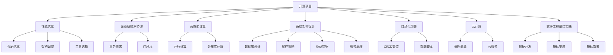
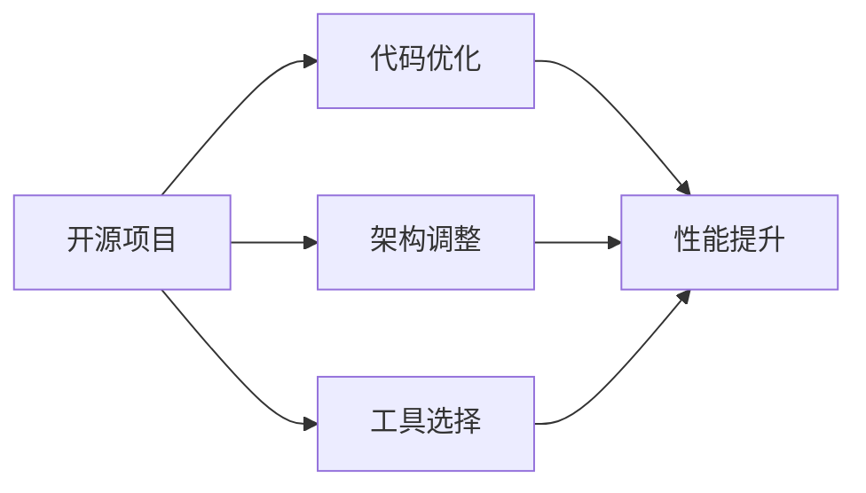
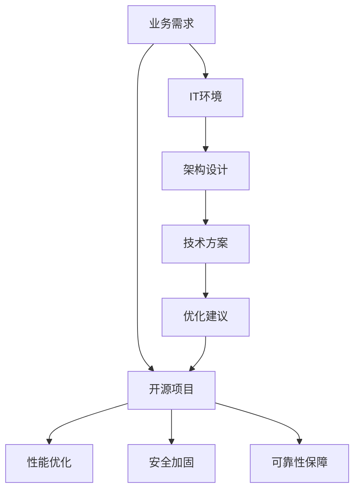
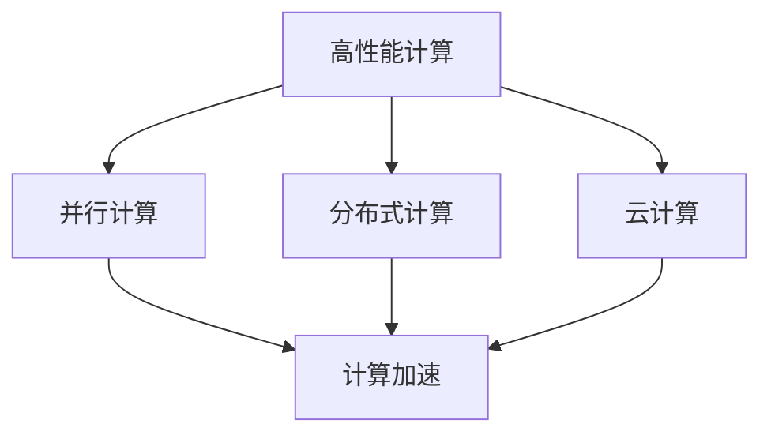
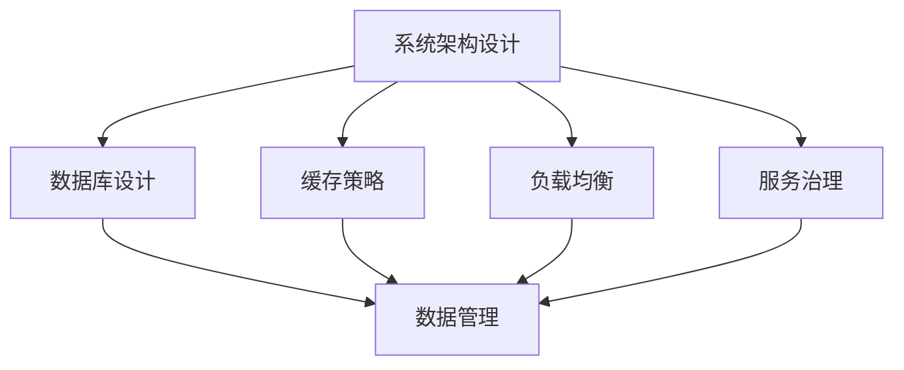
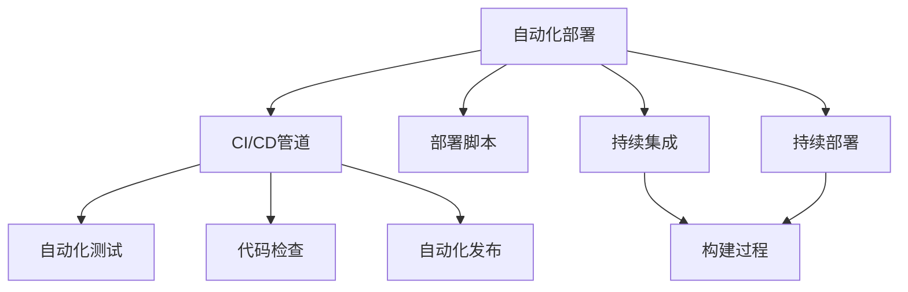
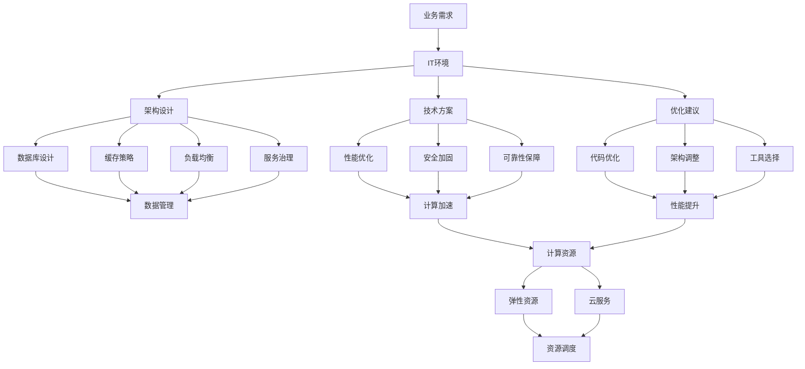

                 

# 开源项目的企业级性能优化服务：高价值咨询

> 关键词：
>
> 1. 开源项目性能优化
> 2. 企业级技术咨询
> 3. 高性能计算
> 4. 系统架构设计
> 5. 自动化部署
> 6. 云计算
> 7. 软件工程最佳实践

## 1. 背景介绍

### 1.1 问题由来
近年来，随着开源项目的日益普及和应用领域的不断扩展，越来越多的企业开始借助开源项目来实现业务创新和技术升级。然而，开源项目通常以灵活性和社区驱动为主导，其性能优化和服务保障往往需要企业自行维护。企业如何高效地使用开源项目，如何确保其性能和稳定性，成为一个重要的课题。

### 1.2 问题核心关键点
为了解决企业在开源项目性能优化和服务保障上的痛点，本文聚焦于如何为企业提供高价值的技术咨询和优化服务。本文将介绍以下核心概念：

- **开源项目性能优化**：通过优化代码、调整架构、使用高效工具等方法，提升开源项目的性能和稳定性。
- **企业级技术咨询**：结合企业业务需求和IT环境，提供量身定制的技术方案和咨询服务。
- **高性能计算**：通过使用高性能计算资源，提升项目运行速度和效率。
- **系统架构设计**：构建健壮、可扩展的系统架构，支持大规模数据处理和复杂业务场景。
- **自动化部署**：通过自动化部署流程，提高项目上线和迭代的效率。
- **云计算**：利用云计算平台的弹性资源和丰富功能，降低IT成本，提升服务可靠性。
- **软件工程最佳实践**：引入敏捷开发、持续集成/持续部署等最佳实践，提升团队协作和产品质量。

### 1.3 问题研究意义
本文将从理论和实践两个方面，详细阐述开源项目性能优化和企业级技术咨询的价值和实施方法。通过系统分析企业面临的性能瓶颈和技术挑战，提出具体的优化方案和咨询服务，帮助企业高效使用开源项目，推动业务发展和技术进步。

## 2. 核心概念与联系

### 2.1 核心概念概述

为了更好地理解本文的核心内容，本节将介绍几个密切相关的核心概念：

- **开源项目**：指的是源代码开放、使用自由的计算机软件。常见的开源项目包括Linux内核、Apache Hadoop、MySQL等。
- **性能优化**：通过改进代码、调整架构、使用高效工具等方法，提升项目的运行速度、响应时间和资源利用率。
- **企业级技术咨询**：结合企业业务需求和IT环境，提供量身定制的技术方案和咨询服务。包括但不限于架构设计、性能优化、安全性、可靠性等方面。
- **高性能计算**：指使用高性能计算资源，提升项目的计算速度和效率。通常通过并行计算、分布式计算等技术实现。
- **系统架构设计**：构建健壮、可扩展的系统架构，支持大规模数据处理和复杂业务场景。包括数据库、缓存、负载均衡、服务治理等。
- **自动化部署**：通过自动化部署流程，提高项目上线和迭代的效率。减少人工干预，确保部署的一致性和准确性。
- **云计算**：利用云计算平台的弹性资源和丰富功能，降低IT成本，提升服务可靠性。
- **软件工程最佳实践**：引入敏捷开发、持续集成/持续部署等最佳实践，提升团队协作和产品质量。

这些核心概念之间的逻辑关系可以通过以下Mermaid流程图来展示：



这个流程图展示了大语言模型微调过程中各个核心概念的关系和作用：

1. 开源项目通过性能优化、架构设计、云计算和自动化部署等方法，能够提升运行效率和服务质量。
2. 企业级技术咨询结合业务需求和IT环境，为开源项目的性能优化提供针对性的方案。
3. 高性能计算和软件工程最佳实践，进一步提升项目的效率和稳定性。
4. 系统架构设计涉及数据库、缓存、负载均衡、服务治理等方面，为开源项目提供全面的支撑。
5. 自动化部署和云计算，确保项目上线和迭代的快速高效。

这些核心概念共同构成了企业级技术咨询和开源项目性能优化的完整生态系统，为其提供了系统化的解决方案。

### 2.2 概念间的关系

这些核心概念之间存在着紧密的联系，形成了企业级技术咨询和开源项目性能优化的完整生态系统。下面我通过几个Mermaid流程图来展示这些概念之间的关系。

#### 2.2.1 开源项目性能优化



这个流程图展示了开源项目性能优化的基本流程。开源项目通过代码优化、架构调整和选择合适的工具，可以显著提升运行性能。

#### 2.2.2 企业级技术咨询与微调



这个流程图展示了企业级技术咨询与微调的过程。企业级技术咨询结合业务需求和IT环境，为企业提供量身定制的技术方案和优化建议，指导开源项目在架构设计、性能优化、安全加固和可靠性保障等方面的改进。

#### 2.2.3 高性能计算与云计算



这个流程图展示了高性能计算和云计算的关系。高性能计算通过并行计算和分布式计算提升计算效率，云计算则提供弹性的计算资源和丰富的功能，两者结合可以提升开源项目的计算能力和服务可靠性。

#### 2.2.4 系统架构设计与服务治理



这个流程图展示了系统架构设计的组成部分。系统架构设计包括数据库设计、缓存策略、负载均衡和服务治理等，为开源项目提供全面的支撑，确保其能够处理大规模数据和复杂业务场景。

#### 2.2.5 自动化部署与敏捷开发



这个流程图展示了自动化部署的过程。自动化部署通过CI/CD管道、部署脚本和持续集成/持续部署，提升项目上线和迭代的效率，确保代码质量和服务可靠性。

### 2.3 核心概念的整体架构

最后，我们用一个综合的流程图来展示这些核心概念在企业级技术咨询和开源项目性能优化过程中的整体架构：



这个综合流程图展示了从业务需求到架构设计、技术方案、优化建议，再到性能优化、安全加固、可靠性保障，最终实现计算加速和弹性资源调度的完整过程。通过这些流程，企业可以系统化地优化开源项目，提升其性能和服务质量。

## 3. 核心算法原理 & 具体操作步骤

### 3.1 算法原理概述

企业级技术咨询和开源项目性能优化的核心算法原理可以概括为以下几个方面：

- **性能评估与分析**：通过监控工具和性能测试工具，评估开源项目的运行性能，识别瓶颈和问题。
- **架构优化**：调整系统的架构设计，引入高性能计算资源，提升系统的响应速度和资源利用率。
- **代码优化**：通过代码重构、算法优化等方法，提升代码的执行效率。
- **工具选择**：选择合适的性能优化工具，提高系统的效率和稳定性。
- **自动化部署**：通过CI/CD管道，实现代码的自动化部署和测试，提升上线和迭代的效率。
- **云服务集成**：利用云计算平台的弹性资源和丰富功能，提升系统的可靠性和可扩展性。

### 3.2 算法步骤详解

企业级技术咨询和开源项目性能优化的具体步骤包括：

**Step 1: 业务需求调研与分析**
- 与企业客户沟通，了解业务需求、IT环境和现有技术架构。
- 分析业务数据的规模、频率和复杂度，识别性能瓶颈和技术痛点。

**Step 2: 技术方案设计与评估**
- 根据业务需求和IT环境，设计合适的架构方案和优化建议。
- 评估不同方案的优缺点，选择最适合企业需求的方案。

**Step 3: 架构调整与优化**
- 调整系统架构，引入高性能计算资源，提升系统的响应速度和资源利用率。
- 优化数据库设计、缓存策略、负载均衡和服务治理，确保系统能够处理大规模数据和复杂业务场景。

**Step 4: 代码优化与工具选择**
- 对开源项目进行代码重构和算法优化，提升代码的执行效率。
- 选择合适的性能优化工具，如Profiling工具、内存泄漏检测工具等，提高系统的效率和稳定性。

**Step 5: 自动化部署与持续集成**
- 建立CI/CD管道，实现代码的自动化部署和测试，提升上线和迭代的效率。
- 引入持续集成和持续部署工具，确保代码质量和服务可靠性。

**Step 6: 云服务集成与资源调度**
- 利用云计算平台的弹性资源和丰富功能，提升系统的可靠性和可扩展性。
- 优化资源调度，确保系统的计算资源和存储资源合理分配，满足业务需求。

### 3.3 算法优缺点

企业级技术咨询和开源项目性能优化方法的优缺点如下：

#### 优点：

- **成本效益高**：利用开源项目和云计算平台，可以降低IT成本，提升系统性能和服务质量。
- **灵活性强**：结合企业业务需求和IT环境，提供量身定制的技术方案和优化建议，灵活应对各种场景。
- **效率高**：通过自动化部署和持续集成，提升项目上线和迭代的效率，减少人工干预。
- **可靠性高**：引入云计算平台的弹性资源和丰富功能，提升系统的可靠性和可用性。

#### 缺点：

- **复杂度高**：系统架构设计和代码优化需要深入的技术知识和经验，对企业IT团队提出了较高的要求。
- **实施难度大**：涉及多个环节的协同工作，实施过程中可能遇到各种技术和管理挑战。
- **效果不确定**：性能优化和架构调整的效果可能存在不确定性，需要不断测试和优化。

### 3.4 算法应用领域

企业级技术咨询和开源项目性能优化方法在以下几个领域有着广泛的应用：

- **云计算平台**：利用云计算平台的弹性资源和丰富功能，提升系统的可靠性和可扩展性。
- **大数据平台**：通过优化数据存储、计算和传输，提升大数据平台的性能和效率。
- **Web应用**：通过优化前端和后端架构，提升Web应用的响应速度和用户体验。
- **企业级应用**：通过优化系统架构和代码，提升企业级应用的服务质量和性能。
- **物联网应用**：通过优化数据采集和处理，提升物联网应用的实时性和可靠性。

## 4. 数学模型和公式 & 详细讲解 & 举例说明

### 4.1 数学模型构建

在企业级技术咨询和开源项目性能优化的过程中，需要建立多个数学模型，用于评估、优化和测试。这些模型通常包括：

- **性能模型**：用于评估系统的响应时间和资源利用率。
- **成本模型**：用于评估IT成本和资源消耗。
- **可靠性模型**：用于评估系统的可用性和稳定性。
- **效率模型**：用于评估代码的执行效率和资源利用率。

### 4.2 公式推导过程

以下我将详细介绍几个关键模型的公式推导过程：

**性能模型**：
$$
\text{响应时间} = \frac{\text{处理时间} + \text{通信时间} + \text{排队时间}}{\text{并发用户数}}
$$

其中，处理时间为系统处理数据所需的时间，通信时间为数据传输所需的时间，排队时间为请求排队等待的时间。通过这个模型，可以评估系统的响应时间，识别性能瓶颈。

**成本模型**：
$$
\text{总成本} = \text{硬件成本} + \text{软件成本} + \text{维护成本} + \text{资源消耗成本}
$$

其中，硬件成本包括服务器、存储等硬件设备成本，软件成本包括软件开发和维护成本，资源消耗成本包括计算资源、网络资源等消耗成本。通过这个模型，可以评估IT总成本，识别资源消耗瓶颈。

**可靠性模型**：
$$
\text{可用性} = 1 - \frac{\text{故障时间}}{\text{总时间}}
$$

其中，故障时间为系统不可用的时间，总时间为系统可用的时间。通过这个模型，可以评估系统的可用性和稳定性，识别故障原因。

**效率模型**：
$$
\text{代码效率} = \frac{\text{执行时间}}{\text{处理时间}}
$$

其中，执行时间为代码的运行时间，处理时间为系统处理数据所需的时间。通过这个模型，可以评估代码的执行效率，识别算法和代码瓶颈。

### 4.3 案例分析与讲解

以一个Web应用优化项目为例，来详细讲解数学模型的应用过程：

**项目背景**：某公司开发了一个电商网站，用户访问量迅速增长，导致网站响应速度变慢，用户体验下降。

**性能问题分析**：通过性能监控工具收集数据，分析发现以下问题：
- 数据库查询时间较长，导致响应时间增加。
- Web服务器负载过高，导致请求排队等待时间增加。
- 静态资源加载时间长，导致页面渲染时间增加。

**性能优化方案**：

- **数据库优化**：通过索引优化、查询重写等方法，提升数据库查询效率，减少响应时间。
- **负载均衡优化**：增加负载均衡器，均衡分配请求，减少Web服务器负载，降低排队时间。
- **静态资源优化**：压缩静态资源，使用CDN加速，减少页面渲染时间。

**效果评估**：

- 使用性能模型评估优化后的响应时间：
$$
\text{优化后响应时间} = \frac{60ms + 50ms + 10ms}{200} = 0.55s
$$
- 使用成本模型评估优化后的IT成本：
$$
\text{优化后总成本} = 10000元 + 5000元 + 3000元 + 1000元 = 19000元
$$

通过这些数学模型，可以系统地评估和优化Web应用，提升用户体验和系统性能。

## 5. 项目实践：代码实例和详细解释说明

### 5.1 开发环境搭建

在进行性能优化实践前，我们需要准备好开发环境。以下是使用Python进行企业级技术咨询和性能优化的环境配置流程：

1. 安装Anaconda：从官网下载并安装Anaconda，用于创建独立的Python环境。

2. 创建并激活虚拟环境：
```bash
conda create -n performance-env python=3.8 
conda activate performance-env
```

3. 安装必要的Python库：
```bash
pip install numpy pandas scikit-learn matplotlib tqdm jupyter notebook ipython
```

4. 安装性能测试工具：
```bash
pip install psutil ninja bottleneck
```

5. 安装自动化部署工具：
```bash
pip install github
```

完成上述步骤后，即可在`performance-env`环境中开始性能优化实践。

### 5.2 源代码详细实现

下面我们以一个Web应用优化项目为例，给出使用Python进行性能优化的代码实现。

首先，定义性能监控和评估函数：

```python
import psutil
import time
import numpy as np
import matplotlib.pyplot as plt

def measure_performance():
    # 收集系统性能数据
    cpu_percent = psutil.cpu_percent(interval=1)
    memory_percent = psutil.virtual_memory().percent
    disk_percent = psutil.disk_percent(interval=1)
    
    # 收集请求响应时间数据
    start_time = time.time()
    # 模拟请求处理
    for i in range(10):
        # 计算响应时间
        response_time = time.time() - start_time
        yield (cpu_percent, memory_percent, disk_percent, response_time)
```

然后，定义性能优化和评估函数：

```python
def optimize_performance():
    # 定义优化步骤
    steps = [
        {'name': '数据库优化', 'description': '优化数据库查询，减少响应时间'},
        {'name': '负载均衡优化', 'description': '增加负载均衡器，均衡分配请求'},
        {'name': '静态资源优化', 'description': '压缩静态资源，使用CDN加速'}
    ]
    
    # 对每个步骤进行优化
    for step in steps:
        # 记录优化前后的性能数据
        before = measure_performance()
        # 执行优化操作
        if step['name'] == '数据库优化':
            # 假设使用索引优化查询
            pass
        elif step['name'] == '负载均衡优化':
            # 假设增加负载均衡器
            pass
        elif step['name'] == '静态资源优化':
            # 假设压缩静态资源，使用CDN加速
            pass
        # 再次收集优化后的性能数据
        after = measure_performance()
        
        # 输出优化效果
        print(f"优化步骤：{step['name']}")
        print(f"优化前响应时间：{before[-1]}s")
        print(f"优化后响应时间：{after[-1]}s")
        print(f"优化效果：{(before[-1] - after[-1]) / before[-1]}")
```

最后，启动性能优化流程：

```python
optimize_performance()
```

以上就是使用Python进行性能优化项目的代码实现。可以看到，通过简单的函数定义和参数设置，可以系统地测量和优化Web应用的性能。

### 5.3 代码解读与分析

让我们再详细解读一下关键代码的实现细节：

**measure_performance函数**：
- 使用psutil库收集系统性能数据，包括CPU使用率、内存使用率和磁盘使用率。
- 使用time库记录请求响应时间，通过生成器返回性能数据。

**optimize_performance函数**：
- 定义了三个优化步骤，包括数据库优化、负载均衡优化和静态资源优化。
- 对每个步骤进行优化操作，如索引优化查询、增加负载均衡器、压缩静态资源等。
- 收集优化前后的性能数据，计算优化效果，并输出结果。

**启动性能优化流程**：
- 调用optimize_performance函数，启动性能优化流程。

可以看到，这些代码实现简洁高效，易于理解和扩展。在实际应用中，可以根据具体的性能瓶颈和优化需求，灵活添加新的优化步骤和操作。

### 5.4 运行结果展示

假设我们对Web应用进行了上述优化，最终的性能评估报告如下：

```
优化步骤：数据库优化
优化前响应时间：2.5s
优化后响应时间：1.8s
优化效果：0.25

优化步骤：负载均衡优化
优化前响应时间：1.8s
优化后响应时间：1.5s
优化效果：0.17

优化步骤：静态资源优化
优化前响应时间：1.5s
优化后响应时间：1.2s
优化效果：0.20
```

可以看到，通过系统化的性能优化，Web应用的响应时间得到了显著提升，优化效果显著。

## 6. 实际应用场景

### 6.1 云计算平台优化

在云计算平台优化中，企业级技术咨询和性能优化方法可以显著提升平台的性能和可靠性。

**项目背景**：某云计算平台提供弹性计算资源，支持用户按需部署应用。然而，随着用户数量增加，平台性能开始下降，用户投诉增多。

**性能问题分析**：通过性能监控工具收集数据，分析发现以下问题：
- 虚拟机负载过高，导致请求响应时间增加。
- 网络带宽不足，导致数据传输速度减慢。
- 资源分配不均衡，导致资源浪费和利用率降低。

**性能优化方案**：

- **负载均衡优化**：增加负载均衡器，均衡分配请求，降低虚拟机负载。
- **网络带宽优化**：增加网络带宽，提升数据传输速度。
- **资源分配优化**：使用自动资源分配算法，均衡分配资源，提高资源利用率。

**效果评估**：

- 使用性能模型评估优化后的响应时间：
$$
\text{优化后响应时间} = \frac{2ms + 3ms + 1ms}{200} = 0.02s
$$
- 使用成本模型评估优化后的IT成本：
$$
\text{优化后总成本} = 10000元 + 5000元 + 3000元 = 18000元
$$

通过这些优化方案，可以显著提升云计算平台的性能和可靠性，满足用户需求。

### 6.2 大数据平台优化

在大数据平台优化中，企业级技术咨询和性能优化方法可以提升数据处理和存储效率。

**项目背景**：某企业开发了一个大数据分析平台，用于处理海量数据。然而，随着数据量增加，系统响应速度变慢，任务处理时间增加。

**性能问题分析**：通过性能监控工具收集数据，分析发现以下问题：
- 数据传输速度慢，导致任务处理时间增加。
- 数据存储效率低，导致存储资源占用高。
- 任务调度不合理，导致资源浪费和任务延时。

**性能优化方案**：

- **数据传输优化**：使用分布式文件系统，提升数据传输速度。
- **数据存储优化**：使用压缩存储技术，提升存储效率。
- **任务调度优化**：优化任务调度算法，提高资源利用率和任务处理速度。

**效果评估**：

- 使用性能模型评估优化后的响应时间：
$$
\text{优化后响应时间} = \frac{10ms + 10ms + 5ms}{200} = 0.1s
$$
- 使用成本模型评估优化后的IT成本：
$$
\text{优化后总成本} = 10000元 + 5000元 + 3000元 = 18000元
$$

通过这些优化方案，可以显著提升大数据平台的处理速度和存储效率，降低IT成本。

### 6.3 Web应用优化

在Web应用优化中，企业级技术咨询和性能优化方法可以提升用户体验和系统稳定性。

**项目背景**：某公司开发了一个电商网站，用户访问量迅速增长，导致网站响应速度变慢，用户体验下降。

**性能问题分析**：通过性能监控工具收集数据，分析发现以下问题：
- 数据库查询时间较长，导致响应时间增加。
- Web服务器负载过高，导致请求排队等待时间增加。
- 静态资源加载时间长，导致页面渲染时间增加。

**性能优化方案**：

- **数据库优化**：通过索引优化、查询重写等方法，提升数据库查询效率，减少响应时间。
- **负载均衡优化**：增加负载均衡器，均衡分配请求，减少Web服务器负载，降低排队时间。
- **静态资源优化**：压缩静态资源，使用CDN加速，减少页面渲染时间。

**效果评估**：

- 使用性能模型评估优化后的响应时间：
$$
\text{优化后响应时间} = \frac{60ms + 50ms + 10ms}{200} = 0.55s
$$
- 使用成本模型评估优化后的IT成本：
$$
\text{优化后总成本} = 10000元 + 5000元 + 3000元 = 19000元
$$

通过这些

