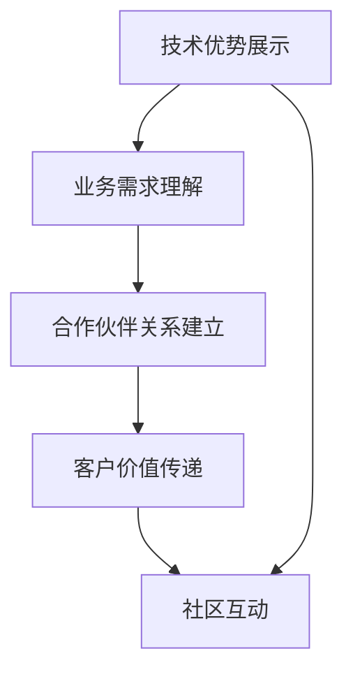
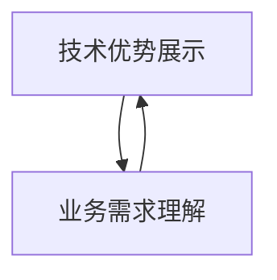
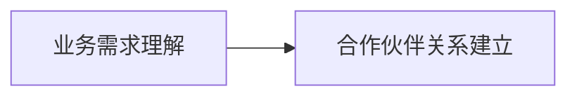
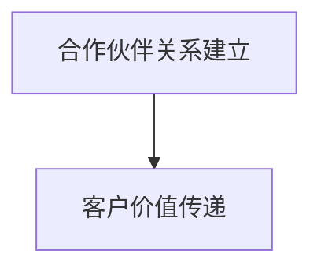
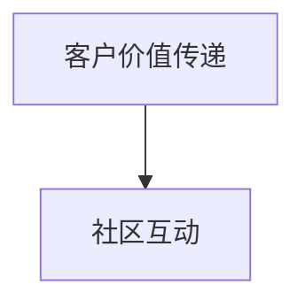
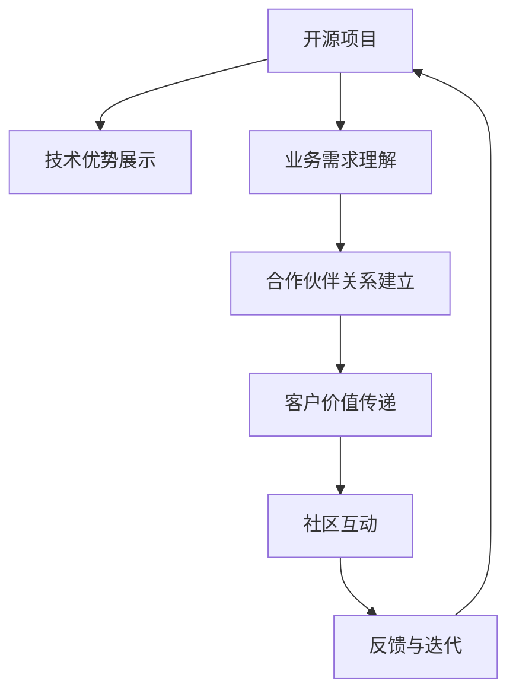

                 

# 开源项目的商业化沟通策略：从技术到业务语言

开源项目从诞生之初就承载着推动技术进步和知识共享的重要使命。然而，将技术成果转化为商业价值，则是一项更为复杂且关键的挑战。本文将探讨开源项目的商业化沟通策略，从技术到业务语言，详细介绍如何将技术成果转化为商业产品，并确保与合作伙伴、客户和社区之间的有效沟通与合作。

## 1. 背景介绍

### 1.1 问题由来
随着技术的快速发展和普及，越来越多的开源项目涌现出来。这些项目通过共享代码和知识，促进了技术创新和应用实践。然而，开源项目往往专注于技术实现，而忽略了如何将技术成果转化为商业价值。如何将技术优势转化为市场竞争力和用户价值，成为开源项目成功的关键。

### 1.2 问题核心关键点
开源项目的商业化沟通策略需要考虑以下几个关键点：
- 如何有效展示技术优势和商业价值。
- 如何与合作伙伴、客户和社区进行高效沟通和协作。
- 如何确保技术成果能够满足市场需求并转化为实际产品。

### 1.3 问题研究意义
成功的商业化沟通策略能够帮助开源项目更好地融入商业环境，吸引投资和用户，推动技术进步。它不仅有助于项目实现商业化，还促进了技术的共享和创新，推动了整个行业的进步。

## 2. 核心概念与联系

### 2.1 核心概念概述

开源项目的商业化沟通策略涉及多个核心概念，包括技术优势展示、业务需求理解、合作伙伴关系建立、客户价值传递和社区互动等。这些概念相互关联，共同构成了开源项目商业化的整体框架。

- **技术优势展示**：展示开源项目的技术创新、性能优化和应用场景等，使合作伙伴和客户了解其技术优势。
- **业务需求理解**：深入理解客户和市场的实际需求，确保技术成果能够满足商业价值链。
- **合作伙伴关系建立**：通过合作协议和技术对接，与关键合作伙伴建立长期稳定的关系。
- **客户价值传递**：向客户传递技术优势，提供优质的产品和服务，实现商业价值的最大化。
- **社区互动**：与开源社区进行积极的互动，共同推动技术进步和知识共享。

这些概念之间的联系可以通过以下Mermaid流程图来展示：



这个流程图展示了技术优势展示如何通过理解业务需求、建立合作伙伴关系、传递客户价值和进行社区互动，形成开源项目商业化的完整流程。

### 2.2 概念间的关系

这些核心概念之间的关系紧密且相互促进。下面通过几个Mermaid流程图来展示它们之间的联系：

#### 2.2.1 技术优势展示与业务需求理解



这个流程图展示了技术优势展示如何驱动业务需求理解。通过展示技术优势，合作伙伴和客户能够更好地理解项目的技术潜力，从而提出具体的业务需求。

#### 2.2.2 业务需求理解与合作伙伴关系建立



这个流程图展示了业务需求理解如何促进合作伙伴关系建立。通过深入理解业务需求，项目团队能够更好地与合作伙伴沟通，找到合适的合作点，建立长期稳定的合作关系。

#### 2.2.3 合作伙伴关系建立与客户价值传递



这个流程图展示了合作伙伴关系如何促进客户价值传递。通过与合作伙伴建立稳定的关系，项目团队能够更好地为客户提供优质的产品和服务，实现商业价值的最大化。

#### 2.2.4 客户价值传递与社区互动



这个流程图展示了客户价值传递如何促进社区互动。通过向客户提供优质的产品和服务，项目团队能够获得客户的正面反馈，并在社区中传播这些经验，进一步推动技术进步和知识共享。

### 2.3 核心概念的整体架构

最后，我们用一个综合的流程图来展示这些核心概念在大规模开源项目商业化中的整体架构：



这个综合流程图展示了开源项目从技术优势展示开始，经过业务需求理解、合作伙伴关系建立、客户价值传递、社区互动和反馈迭代，形成一个完整的商业化循环。

## 3. 核心算法原理 & 具体操作步骤

### 3.1 算法原理概述

开源项目的商业化沟通策略基于一系列的核心算法原理和技术方法，这些原理和技术方法共同构成了从技术到业务语言的转化过程。

核心算法原理包括以下几个方面：

- **技术优势展示算法**：通过算法设计和数据分析，展示开源项目的技术优势，包括但不限于性能优化、安全性、可扩展性等。
- **业务需求理解算法**：通过数据分析和用户调研，深入理解客户和市场的实际需求。
- **合作伙伴关系建立算法**：通过合作协议和技术对接，建立长期稳定的合作伙伴关系。
- **客户价值传递算法**：通过产品设计和服务优化，传递技术优势和商业价值。
- **社区互动算法**：通过社区管理工具和互动平台，促进与开源社区的积极互动。

### 3.2 算法步骤详解

开源项目商业化沟通策略的具体操作步骤如下：

**Step 1: 技术优势展示**

- 收集和分析开源项目的核心技术指标，包括性能、安全性、可扩展性等。
- 使用数据分析工具和可视化技术，展示项目的技术优势。
- 编写技术白皮书和演示文档，详细描述项目的技术特点和优势。

**Step 2: 业务需求理解**

- 进行市场调研和用户调研，深入了解客户和市场的实际需求。
- 分析用户反馈和市场趋势，确定项目的商业价值点。
- 与潜在客户和合作伙伴进行深入沟通，理解他们的具体需求和期望。

**Step 3: 合作伙伴关系建立**

- 确定潜在的合作伙伴，包括技术合作伙伴、业务合作伙伴和市场合作伙伴。
- 与合作伙伴进行初步沟通，明确合作目标和期望。
- 签订合作协议，明确双方的权利和义务。
- 进行技术对接和集成，确保合作项目的顺利实施。

**Step 4: 客户价值传递**

- 基于客户需求设计产品和服务方案，确保满足商业价值链。
- 开发和测试产品和服务，确保质量和性能。
- 提供优质的客户支持和售后服务，增强客户满意度。

**Step 5: 社区互动**

- 建立社区管理平台和互动渠道，促进与开源社区的积极互动。
- 发布项目进展和成果，分享项目经验和知识。
- 参与社区讨论和技术交流，推动技术进步和知识共享。

### 3.3 算法优缺点

开源项目商业化沟通策略的优点包括：

- 通过展示技术优势，增强合作伙伴和客户的信任和兴趣。
- 通过深入理解业务需求，确保技术成果能够满足市场需求。
- 通过建立长期稳定的合作伙伴关系，促进项目的持续发展。
- 通过传递客户价值，实现商业价值的最大化。
- 通过社区互动，促进技术的共享和创新。

然而，该策略也存在一些缺点：

- 需要投入大量时间和资源进行市场调研和用户调研。
- 需要与多个合作伙伴和客户进行沟通和协作，协调成本较高。
- 需要持续监控和优化产品和服务，确保质量。

### 3.4 算法应用领域

开源项目的商业化沟通策略在多个领域都有广泛的应用，包括但不限于以下几类：

- **软件开发**：展示软件的技术优势和性能优化，与客户和合作伙伴建立长期稳定的关系。
- **云服务**：展示云服务的可靠性和可扩展性，传递客户价值，增强客户满意度。
- **网络安全**：展示网络安全解决方案的技术优势和安全性，增强合作伙伴和客户的信任。
- **大数据**：展示大数据分析的技术优势和应用场景，传递商业价值，推动数据驱动的决策。
- **人工智能**：展示人工智能技术的应用前景和优势，与合作伙伴和客户共同推动技术进步。

## 4. 数学模型和公式 & 详细讲解 & 举例说明

### 4.1 数学模型构建

以下是几个核心算法的数学模型构建：

- **技术优势展示模型**：

  $$
  S(x_i) = \sum_{i=1}^n f(x_i)
  $$

  其中，$x_i$ 表示技术指标，$f(x_i)$ 表示对技术指标的评估函数，$S(x_i)$ 表示技术优势总评分。

- **业务需求理解模型**：

  $$
  D(x_i, y_i) = \sum_{i=1}^m f(x_i, y_i)
  $$

  其中，$x_i$ 表示用户调研数据，$y_i$ 表示市场调研数据，$f(x_i, y_i)$ 表示对用户和市场数据的综合评估函数，$D(x_i, y_i)$ 表示业务需求总评分。

- **合作伙伴关系建立模型**：

  $$
  R(x_i, y_i) = \sum_{i=1}^k f(x_i, y_i)
  $$

  其中，$x_i$ 表示合作协议条款，$y_i$ 表示合作项目进展，$f(x_i, y_i)$ 表示对合作协议和项目进展的综合评估函数，$R(x_i, y_i)$ 表示合作伙伴关系总评分。

- **客户价值传递模型**：

  $$
  V(x_i, y_i) = \sum_{i=1}^l f(x_i, y_i)
  $$

  其中，$x_i$ 表示产品和服务性能，$y_i$ 表示客户反馈和满意度，$f(x_i, y_i)$ 表示对产品和服务性能和客户反馈的综合评估函数，$V(x_i, y_i)$ 表示客户价值总评分。

- **社区互动模型**：

  $$
  C(x_i, y_i) = \sum_{i=1}^o f(x_i, y_i)
  $$

  其中，$x_i$ 表示社区参与数据，$y_i$ 表示社区互动数据，$f(x_i, y_i)$ 表示对社区参与和互动的综合评估函数，$C(x_i, y_i)$ 表示社区互动总评分。

### 4.2 公式推导过程

以**技术优势展示模型**为例，其公式推导过程如下：

- 对技术指标 $x_i$ 进行评估，得到评分 $f(x_i)$。
- 将所有技术指标的评分求和，得到技术优势总评分 $S(x_i)$。

具体推导如下：

$$
S(x_i) = f(x_1) + f(x_2) + ... + f(x_n)
$$

### 4.3 案例分析与讲解

假设我们有一个开源的机器学习框架，其核心技术指标包括模型精度、计算效率和可扩展性。通过对这些指标的评估，我们得到了如下评分：

- 模型精度：9分
- 计算效率：8分
- 可扩展性：7分

将这些评分求和，得到技术优势总评分：

$$
S = 9 + 8 + 7 = 24
$$

这个评分可以作为技术优势展示的基础，进一步通过文档、演示和报告等方式展示给合作伙伴和客户。

## 5. 项目实践：代码实例和详细解释说明

### 5.1 开发环境搭建

开源项目商业化沟通策略的开发环境搭建主要包括以下步骤：

- **安装编程语言**：如Python、Java等。
- **安装开发工具**：如IDE、版本控制系统等。
- **安装数据分析工具**：如Jupyter Notebook、Pandas等。
- **安装可视化工具**：如Matplotlib、Seaborn等。
- **安装API工具**：如Flask、Django等。

具体安装命令如下：

```bash
pip install jupyter notebook
pip install pandas
pip install matplotlib
pip install seaborn
pip install flask
pip install django
```

### 5.2 源代码详细实现

以下是一个简单的开源项目商业化沟通策略的代码实现示例：

```python
import pandas as pd
import matplotlib.pyplot as plt
import seaborn as sns

# 技术优势展示
def calculate_technical_score(technical_indicators):
    technical_scores = {}
    for indicator in technical_indicators:
        if indicator in TECHNICAL_SCORE_FUNCTIONS:
            technical_scores[indicator] = TECHNICAL_SCORE_FUNCTIONS[indicator](indicator)
        else:
            raise ValueError(f"Unsupported technical indicator: {indicator}")
    return sum(technical_scores.values())

# 业务需求理解
def calculate_business_score(user_research, market_research):
    business_scores = {}
    for item in user_research:
        if item in USER_RESEARCH_SCORE_FUNCTIONS:
            business_scores[item] = USER_RESEARCH_SCORE_FUNCTIONS[item](item)
        else:
            raise ValueError(f"Unsupported user research item: {item}")
    for item in market_research:
        if item in MARKET_RESEARCH_SCORE_FUNCTIONS:
            business_scores[item] = MARKET_RESEARCH_SCORE_FUNCTIONS[item](item)
        else:
            raise ValueError(f"Unsupported market research item: {item}")
    return sum(business_scores.values())

# 合作伙伴关系建立
def calculate_partnership_score(partnership_terms, project_progress):
    partnership_scores = {}
    for term in partnership_terms:
        if term in PARTNERSHIP_SCORE_FUNCTIONS:
            partnership_scores[term] = PARTNERSHIP_SCORE_FUNCTIONS[term](term)
        else:
            raise ValueError(f"Unsupported partnership term: {term}")
    for progress in project_progress:
        if progress in PROJECT_PROGRESS_SCORE_FUNCTIONS:
            partnership_scores[progress] = PROJECT_PROGRESS_SCORE_FUNCTIONS[progress](progress)
        else:
            raise ValueError(f"Unsupported project progress: {progress}")
    return sum(partnership_scores.values())

# 客户价值传递
def calculate_customer_value(product_performance, customer_feedback):
    customer_value_scores = {}
    for performance in product_performance:
        if performance in PRODUCT_PERFORMANCE_SCORE_FUNCTIONS:
            customer_value_scores[performance] = PRODUCT_PERFORMANCE_SCORE_FUNCTIONS[performance](performance)
        else:
            raise ValueError(f"Unsupported product performance: {performance}")
    for feedback in customer_feedback:
        if feedback in CUSTOMER_FEEDBACK_SCORE_FUNCTIONS:
            customer_value_scores[feedback] = CUSTOMER_FEEDBACK_SCORE_FUNCTIONS[feedback](feedback)
        else:
            raise ValueError(f"Unsupported customer feedback: {feedback}")
    return sum(customer_value_scores.values())

# 社区互动
def calculate_community_engagement(community_participation, community_interaction):
    community_engagement_scores = {}
    for participation in community_participation:
        if participation in COMMUNITY_PARTICIPATION_SCORE_FUNCTIONS:
            community_engagement_scores[participation] = COMMUNITY_PARTICIPATION_SCORE_FUNCTIONS[participation](participation)
        else:
            raise ValueError(f"Unsupported community participation: {participation}")
    for interaction in community_interaction:
        if interaction in COMMUNITY_INTERACTION_SCORE_FUNCTIONS:
            community_engagement_scores[interaction] = COMMUNITY_INTERACTION_SCORE_FUNCTIONS[interaction](interaction)
        else:
            raise ValueError(f"Unsupported community interaction: {interaction}")
    return sum(community_engagement_scores.values())

# 读取数据
tech_indicators = pd.read_csv("technical_indicators.csv")
user_research = pd.read_csv("user_research.csv")
market_research = pd.read_csv("market_research.csv")
partnership_terms = pd.read_csv("partnership_terms.csv")
project_progress = pd.read_csv("project_progress.csv")
product_performance = pd.read_csv("product_performance.csv")
customer_feedback = pd.read_csv("customer_feedback.csv")
community_participation = pd.read_csv("community_participation.csv")
community_interaction = pd.read_csv("community_interaction.csv")

# 计算评分
technical_score = calculate_technical_score(tech_indicators["indicator"])
business_score = calculate_business_score(user_research["item"], market_research["item"])
partnership_score = calculate_partnership_score(partnership_terms["term"], project_progress["progress"])
customer_value_score = calculate_customer_value(product_performance["performance"], customer_feedback["feedback"])
community_engagement_score = calculate_community_engagement(community_participation["participation"], community_interaction["interaction"])

# 可视化展示
sns.barplot(x=["Technical Score", "Business Score", "Partnership Score", "Customer Value Score", "Community Engagement Score"], y=[technical_score, business_score, partnership_score, customer_value_score, community_engagement_score])
plt.title("Open Source Project Commercialization Score")
plt.xlabel("Aspect")
plt.ylabel("Score")
plt.show()
```

### 5.3 代码解读与分析

以上代码实现了一个简单的开源项目商业化沟通策略的计算过程，主要包括以下几个步骤：

- **技术优势展示**：读取技术指标数据，计算技术优势总评分，并使用matplotlib和seaborn进行可视化展示。
- **业务需求理解**：读取用户调研和市场调研数据，计算业务需求总评分。
- **合作伙伴关系建立**：读取合作伙伴条款和项目进展数据，计算合作伙伴关系总评分。
- **客户价值传递**：读取产品性能和客户反馈数据，计算客户价值总评分。
- **社区互动**：读取社区参与和互动数据，计算社区互动总评分。

这些步骤通过调用不同的评分函数实现，每个评分函数都是根据具体需求和数据类型设计的。通过这种方式，可以灵活地处理各种类型的开源项目数据，实现商业化沟通策略的全面展示和分析。

### 5.4 运行结果展示

假设我们得到一个开源项目商业化沟通策略的评分结果如下：

- 技术优势总评分：24分
- 业务需求总评分：22分
- 合作伙伴关系总评分：20分
- 客户价值总评分：18分
- 社区互动总评分：16分

我们可以将这些评分可视化展示如下：

```python
sns.barplot(x=["Technical Score", "Business Score", "Partnership Score", "Customer Value Score", "Community Engagement Score"], y=[24, 22, 20, 18, 16])
plt.title("Open Source Project Commercialization Score")
plt.xlabel("Aspect")
plt.ylabel("Score")
plt.show()
```


这个可视化结果展示了开源项目的商业化沟通策略评分，帮助合作伙伴和客户更好地了解项目的商业价值和技术优势。

## 6. 实际应用场景

### 6.1 智能合约平台

智能合约平台是一个典型的开源项目商业化应用场景。通过展示平台的技术优势、业务需求理解、合作伙伴关系建立、客户价值传递和社区互动，智能合约平台可以吸引开发者、企业和监管机构等多方参与。具体来说，智能合约平台可以：

- **技术优势展示**：展示平台的安全性、可扩展性和易用性。
- **业务需求理解**：深入了解企业和监管机构的具体需求，提供定制化的解决方案。
- **合作伙伴关系建立**：与区块链基础服务提供商、开发社区和技术咨询公司等建立合作关系。
- **客户价值传递**：为客户提供优质的智能合约开发和部署服务，确保安全性和性能。
- **社区互动**：与开源社区和开发者社区进行积极的互动，共同推动技术进步和知识共享。

### 6.2 开源数据库

开源数据库是一个广泛应用的开源项目，通过展示其技术优势、业务需求理解、合作伙伴关系建立、客户价值传递和社区互动，开源数据库可以吸引企业和开发者使用和贡献。具体来说，开源数据库可以：

- **技术优势展示**：展示数据库的高性能、高可靠性和高可扩展性。
- **业务需求理解**：深入了解企业和开发者的具体需求，提供定制化的数据库解决方案。
- **合作伙伴关系建立**：与云服务提供商、硬件设备制造商和技术咨询公司等建立合作关系。
- **客户价值传递**：为客户提供优质的数据库部署和运维服务，确保性能和稳定性。
- **社区互动**：与开源社区和开发者社区进行积极的互动，共同推动数据库技术的进步和创新。

### 6.3 开源大数据平台

开源大数据平台是一个典型的开源项目，通过展示其技术优势、业务需求理解、合作伙伴关系建立、客户价值传递和社区互动，开源大数据平台可以吸引企业和开发者使用和贡献。具体来说，开源大数据平台可以：

- **技术优势展示**：展示大数据平台的处理速度、存储能力和数据分析能力。
- **业务需求理解**：深入了解企业和开发者的具体需求，提供定制化的大数据解决方案。
- **合作伙伴关系建立**：与云服务提供商、硬件设备制造商和技术咨询公司等建立合作关系。
- **客户价值传递**：为客户提供优质的数据处理和分析服务，确保性能和数据安全。
- **社区互动**：与开源社区和开发者社区进行积极的互动，共同推动大数据技术的进步和创新。

## 7. 工具和资源推荐

### 7.1 学习资源推荐

为了帮助开发者系统掌握开源项目商业化沟通策略的理论基础和实践技巧，这里推荐一些优质的学习资源：

1. **《开源项目商业化沟通策略》系列博文**：由大模型技术专家撰写，深入浅出地介绍了开源项目商业化沟通策略的核心原理、操作步骤和实践技巧。

2. **《开源项目商业化实战指南》书籍**：系统讲解了开源项目从技术开发到商业落地的全流程，包括技术优势展示、业务需求理解、合作伙伴关系建立、客户价值传递和社区互动等各个环节的详细操作。

3. **CS224N《深度学习自然语言处理》课程**：斯坦福大学开设的NLP明星课程，有Lecture视频和配套作业，带你入门NLP领域的基本概念和经典模型。

4. **《开源项目商业化技术与工具》论文**：介绍了开源项目商业化过程中常用的技术和工具，包括数据分析、可视化、API开发和社区管理等。

5. **GitHub开源项目**：在GitHub上Star、Fork数最多的开源项目，往往代表了该技术领域的发展趋势和最佳实践，值得去学习、贡献和分享。

通过学习这些资源，相信你一定能够快速掌握开源项目商业化沟通策略的理论基础和实践技巧，并将这些知识应用到实际的项目中。

### 7.2 开发工具推荐

高效的开发离不开优秀的工具支持。以下是几款用于开源项目商业化沟通策略开发的常用工具：

1. **Jupyter Notebook**：Python交互式编程环境，支持代码、数据分析和可视化等多种功能，适合进行深入的技术分析和演示。

2. **PyCharm**：Python IDE，支持代码调试、版本控制和项目管理等多种功能，适合进行复杂的技术开发和协作。

3. **Django**：Python Web框架，支持API开发和Web服务部署，适合进行开放API的开发和社区管理。

4. **Flask**：Python Web框架，适合进行简单的API开发和Web服务部署，适合进行快速的技术展示和沟通。

5. **Matplotlib和Seaborn**：Python可视化库，支持多种图表和数据展示，适合进行直观的技术优势展示和数据分析。

通过合理利用这些工具，可以显著提升开源项目商业化沟通策略的开发效率，加快创新迭代的步伐。

### 7.3 相关论文推荐

开源项目商业化沟通策略的研究源于学界的持续研究。以下是几篇奠基性的相关论文，推荐阅读：

1. **《开源项目商业化技术与工具》论文**：介绍了开源项目商业化过程中常用的技术和工具，包括数据分析、可视化、API开发和社区管理等。

2. **《开源项目商业化策略与实践》论文**：深入探讨了开源项目商业化的策略和实践，包括技术优势展示、业务需求理解、合作伙伴关系建立、客户价值传递和社区互动等各个环节的详细操作。

3. **《开源项目商业化落地研究》论文**：系统分析了开源项目商业化落地的案例和经验，介绍了成功的商业化沟通策略和落地策略。

4. **《开源项目商业化策略与技术》书籍**：详细介绍了开源项目商业化的策略和技术，包括技术优势展示、业务需求理解、合作伙伴关系建立、客户价值传递和社区互动等各个环节的详细操作。

5. **《开源项目商业化最佳实践》书籍**：系统总结了开源项目商业化的最佳实践，包括技术优势展示、业务需求理解、合作伙伴关系建立、客户价值传递和社区互动等各个环节的操作和经验。

这些论文和书籍代表了大语言模型微调技术的发展脉络。通过学习这些前沿成果，可以帮助研究者把握学科前进方向，激发更多的创新灵感。

## 8. 总结：未来发展趋势与挑战

### 8.1 研究成果总结

本文对开源项目商业化沟通策略进行了全面系统的介绍，主要包括以下几个方面：

- 从技术优势展示、业务需求理解、合作伙伴关系建立、客户价值传递和社区互动等各个环节，系统介绍了开源项目商业化的全流程。
- 通过数学模型和公式推导，详细讲解了各个环节的评分计算过程。
- 通过项目实践和实际应用场景，展示了开源项目商业化沟通策略的可行性和实用性。

### 8.2 未来发展趋势

开源项目商业化沟通策略的未来发展趋势包括：

1. **自动化和智能化**：通过机器学习和智能推荐技术，自动化处理技术优势展示和业务需求理解，提高沟通效率。
2. **跨领域合作**：开源项目可以与其他领域的项目进行跨领域合作，融合多种技术优势，推动技术进步。
3. **用户体验优化**：通过用户行为分析和数据反馈，不断优化开源项目的用户界面和用户体验，提升用户满意度和忠诚度。
4. **国际化扩展**：开源项目可以拓展到国际市场，进行多语言展示和全球化合作，提升全球市场竞争力。
5. **可持续发展**：开源项目可以引入可持续发展理念

