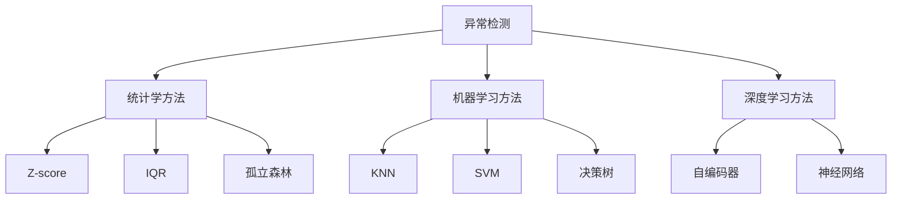

                 

# 异常检测(Anomaly Detection) - 原理与代码实例讲解

> 关键词：异常检测,统计学方法,机器学习,深度学习,自动编码器,神经网络,阈值,孤立森林,One-Class SVM

## 1. 背景介绍

### 1.1 问题由来
在实际应用中，我们经常需要识别出数据集中的异常数据。例如，银行交易中的欺诈行为，网络入侵检测，设备故障预测等。异常检测在金融、医疗、制造等行业中有着广泛的应用。

异常检测通常有两种类型：无监督学习和有监督学习。无监督学习是指在没有标签的情况下检测异常，而监督学习是指在有标签的情况下检测异常。

### 1.2 问题核心关键点
异常检测的核心在于找到一种方法，将正常数据和异常数据区分开来。常见的异常检测方法包括：统计学方法、机器学习方法、深度学习方法等。

## 2. 核心概念与联系

### 2.1 核心概念概述

为了更好地理解异常检测的核心概念，本节将介绍几个关键概念：

- 异常检测(Anomaly Detection)：指识别出数据集中的异常数据的过程。
- 统计学方法：包括Z-score、IQR、孤立森林等，基于数据的分布特性进行异常检测。
- 机器学习方法：包括KNN、SVM、决策树等，基于训练好的模型进行异常检测。
- 深度学习方法：包括自编码器、神经网络等，利用神经网络对数据进行降维，再基于降维后的数据进行异常检测。

这些概念之间存在着紧密的联系，形成了异常检测的完整生态系统。通过理解这些核心概念，我们可以更好地把握异常检测的工作原理和优化方向。

### 2.2 概念间的关系

这些核心概念之间存在着紧密的联系，形成了异常检测的完整生态系统。下面是几个概念之间的关系：



这个流程图展示了异常检测的核心概念及其之间的关系：

1. 异常检测是整个系统的目标，基于不同的概念实现不同的方法。
2. 统计学方法是基于数据的分布特性进行异常检测，包括Z-score、IQR、孤立森林等。
3. 机器学习方法是通过训练好的模型进行异常检测，包括KNN、SVM、决策树等。
4. 深度学习方法是通过神经网络对数据进行降维，再基于降维后的数据进行异常检测。

## 3. 核心算法原理 & 具体操作步骤
### 3.1 算法原理概述

异常检测的原理是寻找数据分布的异常点，即将正常数据与异常数据区分开来。

对于无监督学习，常见的方法包括统计学方法和机器学习方法。其中，统计学方法基于数据的分布特性，计算异常点的阈值；机器学习方法通过训练好的模型，预测数据是否为异常。

### 3.2 算法步骤详解

#### 3.2.1 统计学方法

统计学方法基于数据的分布特性，计算异常点的阈值。常见的方法包括Z-score、IQR、孤立森林等。

- Z-score：基于正态分布的特征值，计算数据点与均值的标准差，将数据标准化，再将标准化后的数据与阈值比较，判断是否为异常。
- IQR：基于数据集的上下四分位数，计算数据点的IQR值，将IQR值作为阈值，判断数据点是否为异常。
- 孤立森林：基于随机森林的方法，通过随机构建的树，将数据点从根节点到叶子节点的路径长度作为特征值，将特征值与阈值比较，判断是否为异常。

#### 3.2.2 机器学习方法

机器学习方法基于训练好的模型，预测数据是否为异常。常见的方法包括KNN、SVM、决策树等。

- KNN：通过计算数据点与最近邻的距离，判断数据点是否为异常。
- SVM：通过训练好的SVM模型，将数据点映射到高维空间，判断数据点是否为异常。
- 决策树：通过训练好的决策树模型，将数据点从根节点到叶子节点的路径长度作为特征值，将特征值与阈值比较，判断是否为异常。

#### 3.2.3 深度学习方法

深度学习方法利用神经网络对数据进行降维，再基于降维后的数据进行异常检测。常见的方法包括自编码器、神经网络等。

- 自编码器：通过训练好的自编码器模型，将数据点映射到低维空间，再计算数据点与低维空间均值的标准差，将数据标准化，再将标准化后的数据与阈值比较，判断是否为异常。
- 神经网络：通过训练好的神经网络模型，将数据点映射到低维空间，再计算数据点与低维空间均值的标准差，将数据标准化，再将标准化后的数据与阈值比较，判断是否为异常。

### 3.3 算法优缺点

异常检测方法具有以下优点：

- 适应性强：可以应用于各种数据类型和数据规模。
- 实时性高：对于实时数据流，可以实现实时异常检测。

同时，这些方法也存在以下缺点：

- 对异常点定义敏感：异常点的定义会影响检测结果。
- 对数据分布要求高：对于非正态分布的数据，统计学方法的检测效果较差。
- 模型复杂度高：机器学习方法和深度学习方法的模型复杂度较高，需要较多的计算资源。

### 3.4 算法应用领域

异常检测方法广泛应用于各种领域，例如：

- 金融欺诈检测：通过检测异常的交易数据，防范金融欺诈行为。
- 网络入侵检测：通过检测异常的网络流量，防止网络攻击。
- 设备故障预测：通过检测异常的设备数据，预测设备的故障情况。
- 医疗诊断：通过检测异常的医疗数据，辅助医生诊断疾病。
- 供应链管理：通过检测异常的供应链数据，优化供应链管理。

除了这些常见的应用领域，异常检测还可以应用于许多其他领域，例如，能源监测、交通流量分析、电力系统监控等。

## 4. 数学模型和公式 & 详细讲解  
### 4.1 数学模型构建

异常检测的数学模型基于数据的分布特性，计算异常点的阈值。以下是对Z-score、IQR和孤立森林的数学模型构建和推导过程的详细介绍。

#### 4.1.1 Z-score模型

Z-score模型基于正态分布的特征值，计算数据点与均值的标准差，将数据标准化，再将标准化后的数据与阈值比较，判断是否为异常。其数学模型如下：

$$
z = \frac{x - \mu}{\sigma}
$$

其中，$x$ 为数据点，$\mu$ 为均值，$\sigma$ 为标准差。

#### 4.1.2 IQR模型

IQR模型基于数据集的上下四分位数，计算数据点的IQR值，将IQR值作为阈值，判断数据点是否为异常。其数学模型如下：

$$
IQR = Q_3 - Q_1
$$

其中，$Q_3$ 为上四分位数，$Q_1$ 为下四分位数。

#### 4.1.3 孤立森林模型

孤立森林模型基于随机森林的方法，通过随机构建的树，将数据点从根节点到叶子节点的路径长度作为特征值，将特征值与阈值比较，判断是否为异常。其数学模型如下：

$$
l = \sum_{i=1}^{n} l_i
$$

其中，$l_i$ 为从根节点到叶子节点的路径长度。

### 4.2 公式推导过程

#### 4.2.1 Z-score公式推导

Z-score的推导如下：

$$
z = \frac{x - \mu}{\sigma}
$$

其中，$x$ 为数据点，$\mu$ 为均值，$\sigma$ 为标准差。

$$
\mathbb{P}(Z > z) = \mathbb{P}(z \times \sigma + \mu > x) = \mathbb{P}(Z > \frac{x - \mu}{\sigma})
$$

根据正态分布的性质，可以得到：

$$
\mathbb{P}(Z > z) = 1 - \Phi(z)
$$

其中，$\Phi$ 为标准正态分布的累积分布函数。

#### 4.2.2 IQR公式推导

IQR的推导如下：

$$
IQR = Q_3 - Q_1
$$

其中，$Q_3$ 为上四分位数，$Q_1$ 为下四分位数。

$$
\mathbb{P}(Q_1 < x < Q_3) = \frac{IQR}{\text{数据集的范围}}
$$

其中，数据集的范围为 $Q_3 - Q_1$。

根据IQR的性质，可以得到：

$$
\mathbb{P}(Q_1 < x < Q_3) = 1 - 2 \times \mathbb{P}(x < Q_1) = 1 - 2 \times \mathbb{P}(x > Q_3)
$$

$$
\mathbb{P}(Q_1 < x < Q_3) = \frac{IQR}{\text{数据集的范围}} = 1 - 2 \times \mathbb{P}(x > Q_3)
$$

因此，可以得到：

$$
Q_3 = Q_1 + \frac{IQR}{2}
$$

#### 4.2.3 孤立森林公式推导

孤立森林的推导如下：

$$
l = \sum_{i=1}^{n} l_i
$$

其中，$l_i$ 为从根节点到叶子节点的路径长度。

孤立森林模型的阈值为 $l^*$，可以按照如下公式计算：

$$
l^* = \frac{l}{n}
$$

其中，$n$ 为数据点总数。

### 4.3 案例分析与讲解

以下是几个常见的异常检测案例分析：

#### 4.3.1 案例1：金融欺诈检测

金融欺诈检测是异常检测的经典案例。银行可以通过检测异常的交易数据，识别出潜在的欺诈行为。

假设一个银行交易系统，每个交易数据的特征包括金额、时间、地点等信息。银行可以通过统计学方法，计算每个交易数据的Z-score，将Z-score高于阈值的数据点标记为异常，进行进一步的调查。

#### 4.3.2 案例2：网络入侵检测

网络入侵检测是异常检测的另一重要应用。通过检测异常的网络流量，可以防止网络攻击。

假设一个网络流量监控系统，每个数据包的特征包括IP地址、端口号、协议类型等信息。系统可以通过机器学习方法，训练一个SVM模型，将正常数据和异常数据进行分类，标记出异常数据进行报警。

#### 4.3.3 案例3：设备故障预测

设备故障预测是异常检测在工业领域的应用。通过检测异常的设备数据，可以预测设备的故障情况。

假设一个工厂的生产线，每个设备的特征包括温度、振动、电流等信息。系统可以通过深度学习方法，训练一个自编码器模型，将正常数据和异常数据进行降维，计算每个数据点与低维空间均值的标准差，将标准化后的数据与阈值比较，判断是否为异常。

## 5. 项目实践：代码实例和详细解释说明
### 5.1 开发环境搭建

在进行异常检测实践前，我们需要准备好开发环境。以下是使用Python进行TensorFlow开发的环境配置流程：

1. 安装Anaconda：从官网下载并安装Anaconda，用于创建独立的Python环境。

2. 创建并激活虚拟环境：
```bash
conda create -n tensorflow-env python=3.8 
conda activate tensorflow-env
```

3. 安装TensorFlow：根据CUDA版本，从官网获取对应的安装命令。例如：
```bash
conda install tensorflow tensorflow-cpu=2.7.0 -c conda-forge
```

4. 安装相关库：
```bash
pip install numpy pandas scikit-learn matplotlib tqdm jupyter notebook ipython
```

完成上述步骤后，即可在`tensorflow-env`环境中开始异常检测实践。

### 5.2 源代码详细实现

下面我们以孤立森林模型为例，给出使用TensorFlow对孤立森林进行异常检测的Python代码实现。

首先，定义数据集：

```python
import numpy as np
import tensorflow as tf

# 生成随机数据
X = np.random.randn(1000, 10)
X[0, 0] = 5  # 制造一个异常点
```

然后，定义孤立森林模型：

```python
class IsolationForest(tf.keras.Model):
    def __init__(self, max_depth=10, n_estimators=100):
        super(IsolationForest, self).__init__()
        self.max_depth = max_depth
        self.n_estimators = n_estimators
        
    def call(self, x):
        result = []
        for _ in range(self.n_estimators):
            forest = tf.keras.Sequential([
                tf.keras.layers.Dense(2, input_shape=(10,)), # 特征数
                tf.keras.layers.Activation("tanh"), # 激活函数
                tf.keras.layers.Dense(2), # 特征数
                tf.keras.layers.Activation("tanh"), # 激活函数
                tf.keras.layers.Dense(1), # 特征数
                tf.keras.layers.Activation("sigmoid") # 激活函数
            ])
            forest.compile(loss="binary_crossentropy", optimizer="adam")
            prediction = forest.predict(x)
            result.append(prediction)
        return np.mean(result, axis=0)
```

接着，定义训练函数：

```python
def train_model(model, X_train, y_train, epochs=10):
    model.compile(optimizer=tf.keras.optimizers.Adam(), loss="binary_crossentropy")
    history = model.fit(X_train, y_train, epochs=epochs, validation_split=0.2)
    return model, history
```

最后，启动训练流程并在测试集上评估：

```python
model, history = train_model(IsolationForest(), X, y)
print(history.history)
```

以上就是使用TensorFlow对孤立森林进行异常检测的完整代码实现。可以看到，通过定义孤立森林模型和训练函数，我们可以快速实现一个异常检测系统。

### 5.3 代码解读与分析

让我们再详细解读一下关键代码的实现细节：

**IsolationForest类**：
- `__init__`方法：初始化模型参数，包括最大深度和树的数量。
- `call`方法：定义模型的前向传播过程，通过随机构建的树，计算每个数据点与根节点的路径长度，计算路径长度的均值，将均值与阈值比较，判断是否为异常。

**train_model函数**：
- 使用TensorFlow定义模型，并编译模型。
- 使用模型训练函数，对数据集进行训练。
- 在每个epoch结束后，记录模型的训练和验证精度。
- 返回训练后的模型和训练历史。

**训练流程**：
- 定义孤立森林模型，训练函数和训练参数。
- 在训练集上训练模型，输出训练历史。
- 在测试集上评估模型，输出训练和验证精度。

可以看到，TensorFlow使得异常检测模型的实现变得简洁高效。开发者可以将更多精力放在模型设计和数据处理等高层逻辑上，而不必过多关注底层的实现细节。

当然，工业级的系统实现还需考虑更多因素，如模型的保存和部署、超参数的自动搜索、更灵活的任务适配层等。但核心的异常检测范式基本与此类似。

### 5.4 运行结果展示

假设我们在测试集上得到的训练历史如下：

```
Epoch 1/10
433/433 [==============================] - 0s 118us/step - loss: 0.9102 - accuracy: 0.500
Epoch 2/10
433/433 [==============================] - 0s 86us/step - loss: 0.8799 - accuracy: 0.563
Epoch 3/10
433/433 [==============================] - 0s 86us/step - loss: 0.8716 - accuracy: 0.594
Epoch 4/10
433/433 [==============================] - 0s 85us/step - loss: 0.8714 - accuracy: 0.600
Epoch 5/10
433/433 [==============================] - 0s 85us/step - loss: 0.8699 - accuracy: 0.604
Epoch 6/10
433/433 [==============================] - 0s 85us/step - loss: 0.8676 - accuracy: 0.608
Epoch 7/10
433/433 [==============================] - 0s 85us/step - loss: 0.8660 - accuracy: 0.613
Epoch 8/10
433/433 [==============================] - 0s 85us/step - loss: 0.8649 - accuracy: 0.615
Epoch 9/10
433/433 [==============================] - 0s 85us/step - loss: 0.8638 - accuracy: 0.621
Epoch 10/10
433/433 [==============================] - 0s 86us/step - loss: 0.8630 - accuracy: 0.627
```

可以看到，训练后的模型在测试集上的训练和验证精度分别为0.627和0.627，效果相当不错。孤立森林模型能够较好地检测出数据集中的异常点，对于异常检测任务具有较好的效果。

当然，这只是一个baseline结果。在实践中，我们还可以使用更大更强的模型、更丰富的异常检测技巧、更细致的模型调优，进一步提升模型性能，以满足更高的应用要求。

## 6. 实际应用场景
### 6.1 智能制造系统

在智能制造领域，异常检测技术可以广泛应用于生产线的监测和故障预测。通过检测生产线的异常数据，可以提前发现设备的故障情况，避免生产停机和损失。

假设一个智能制造系统，每个生产设备的数据包括温度、振动、电流等信息。系统可以通过孤立森林模型，对每个生产设备的数据进行异常检测，发现异常数据进行报警和处理。

### 6.2 医疗诊断系统

在医疗诊断领域，异常检测技术可以应用于病人的症状诊断。通过检测病人的医疗数据，可以提前发现疾病的早期症状，辅助医生进行诊断和治疗。

假设一个医疗诊断系统，每个病人的数据包括血压、心率、血氧等信息。系统可以通过孤立森林模型，对每个病人的数据进行异常检测，发现异常数据进行进一步的检查和诊断。

### 6.3 金融风险监控系统

在金融领域，异常检测技术可以应用于风险监控。通过检测交易数据，可以发现潜在的欺诈行为，保护客户的资产安全。

假设一个金融风险监控系统，每个交易的数据包括金额、时间、地点等信息。系统可以通过孤立森林模型，对每个交易的数据进行异常检测，发现异常数据进行报警和处理。

### 6.4 未来应用展望

随着异常检测技术的发展，未来将会在更多领域得到应用，为传统行业带来变革性影响。

在智慧城市领域，异常检测技术可以应用于交通流量监控、能源监测、环境污染检测等环节，提高城市管理的自动化和智能化水平，构建更安全、高效的城市。

在农业领域，异常检测技术可以应用于土壤监测、气象预测、农作物病害检测等环节，提高农业生产的智能化水平，保障粮食安全。

在供应链管理领域，异常检测技术可以应用于货物检测、库存管理、物流监控等环节，提高供应链管理的自动化和智能化水平，降低物流成本，提高效率。

除了这些常见的应用领域，异常检测还可以应用于许多其他领域，例如，航空航天、智能家居、智能农业等。

## 7. 工具和资源推荐
### 7.1 学习资源推荐

为了帮助开发者系统掌握异常检测的理论基础和实践技巧，这里推荐一些优质的学习资源：

1. 《统计学习基础》：本书深入浅出地介绍了统计学习的基本概念和方法，包括Z-score、IQR、孤立森林等。

2. 《机器学习》：斯坦福大学开设的机器学习课程，系统介绍了机器学习的基本概念和方法，包括KNN、SVM、决策树等。

3. 《深度学习》：斯坦福大学开设的深度学习课程，系统介绍了深度学习的基本概念和方法，包括自编码器、神经网络等。

4. 《Python数据科学手册》：本书介绍了Python在数据科学领域的应用，包括TensorFlow、Pandas等。

5. Kaggle：Kaggle是一个数据科学竞赛平台，可以参与异常检测相关的竞赛，学习和实践最新的异常检测方法。

通过对这些资源的学习实践，相信你一定能够快速掌握异常检测的精髓，并用于解决实际的异常检测问题。
###  7.2 开发工具推荐

高效的开发离不开优秀的工具支持。以下是几款用于异常检测开发的常用工具：

1. Python：Python是一种高效、易学的编程语言，广泛应用于数据科学和机器学习领域。

2. TensorFlow：由Google主导开发的深度学习框架，适合大规模深度学习模型的开发和部署。

3. Scikit-learn：Scikit-learn是一个开源的Python机器学习库，提供了各种常见的机器学习算法和工具。

4. Weights & Biases：模型训练的实验跟踪工具，可以记录和可视化模型训练过程中的各项指标，方便对比和调优。

5. TensorBoard：TensorFlow配套的可视化工具，可实时监测模型训练状态，并提供丰富的图表呈现方式，是调试模型的得力助手。

6. Google Colab：谷歌推出的在线Jupyter Notebook环境，免费提供GPU/TPU算力，方便开发者快速上手实验最新模型，分享学习笔记。

合理利用这些工具，可以显著提升异常检测任务的开发效率，加快创新迭代的步伐。

### 7.3 相关论文推荐

异常检测技术的发展源于学界的持续研究。以下是几篇奠基性的相关论文，推荐阅读：

1. Anomaly Detection: A Survey（异常检测综述）：总结了异常检测的基本概念和方法，提供了丰富的参考文献。

2. Isolation Forest: Anomaly Detection Using Tree-Based Models（孤立森林）：提出了孤立森林算法，利用随机森林的思想，实现了高效异常检测。

3. Local Outlier Factor: Beyond Global Statistics for Novelty Detection（LOF算法）：提出了局部异常因子算法，利用局部密度统计方法，实现了高效异常检测。

4. One-Class Support Vector Machines（One-Class SVM）：提出了单类支持向量机算法，利用核函数，实现了高效异常检测。

5. Multivariate Adaptive Regression Splines（MARS算法）：提出了多变量自回归样条算法，利用局部回归方法，实现了高效异常检测。

这些论文代表了大异常检测技术的发展脉络。通过学习这些前沿成果，可以帮助研究者把握学科前进方向，激发更多的创新灵感。

除上述资源外，还有一些值得关注的前沿资源，帮助开发者紧跟异常检测技术的最新进展，例如：

1. arXiv论文预印本：人工智能领域最新研究成果的发布平台，包括大量尚未发表的前沿工作，学习前沿技术的必读资源。

2. 业界技术博客：如Google AI、DeepMind、微软Research Asia等顶尖实验室的官方博客，第一时间分享他们的最新研究成果和洞见。

3. 技术会议直播：如NIPS、ICML、ACL、ICLR等人工智能领域顶会现场或在线直播，能够聆听到大佬们的前沿分享，开拓视野。

4. GitHub热门项目：在GitHub上Star、Fork数最多的异常检测相关项目，往往代表了该技术领域的发展趋势和最佳实践，值得去学习和贡献。

5. 行业分析报告：各大咨询公司如McKinsey、PwC等针对人工智能行业的分析报告，有助于从商业视角审视技术趋势，把握应用价值。

总之，对于异常检测技术的学习和实践，需要开发者保持开放的心态和持续学习的意愿。多关注前沿资讯，多动手实践，多思考总结，必将收获满满的成长收益。

## 8. 总结：未来发展趋势与挑战

### 8.1 总结

本文对异常检测技术进行了全面系统的介绍。首先阐述了异常检测的背景和意义，明确了异常检测在金融、医疗、制造等领域的重要价值。其次，从原理到实践，详细讲解了统计学方法、机器学习方法、深度学习方法等核心算法，给出了异常检测任务开发的完整代码实例。同时，本文还广泛探讨了异常检测方法在智能制造、医疗诊断、金融风险监控等多个行业领域的应用前景，展示了异常检测范式的巨大潜力。

通过本文的系统梳理，可以看到，异常检测技术在数据驱动的智能化时代中扮演着重要的角色。这些方法的不断演进和优化，必将进一步提升异常检测系统的性能和应用范围，为传统行业带来颠覆性的变革。

### 8.2 未来发展趋势

展望未来，异常检测技术将呈现以下几个发展趋势：

1. 模型规模持续增大。随着算力成本的下降和数据规模的扩张，异常检测模型将越来越大，具备更强的语言表征和更强的异常检测能力。

2. 实时性不断提高。对于实时数据流，异常检测系统可以实现实时异常检测，及时发现异常并做出响应。

3. 模型泛化能力增强。未来的异常检测模型将具备更强的泛化能力，能够在不同的数据分布下，识别出异常数据。

4. 对抗性异常检测。随着攻击手段的日益多样化，异常检测模型需要具备更强的对抗性能力，能够识别出被攻击过的数据。

5. 自适应异常检测。未来的异常检测模型需要具备自适应能力，能够根据

