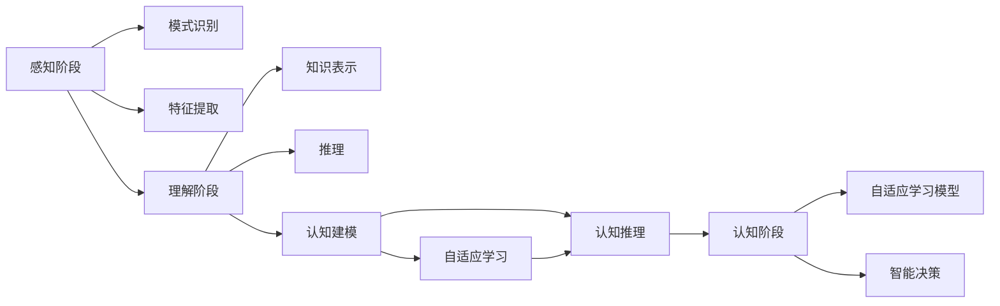
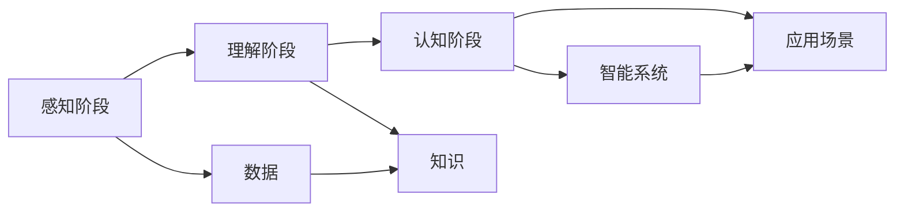

                 

# 张钹院士：人工智能的三个阶段

> 关键词：人工智能，三个阶段，张钹院士，认知科学，机器学习

## 1. 背景介绍

### 1.1 问题由来

在人工智能的发展历程中，张钹院士的研究和贡献占据了举足轻重的地位。他通过对认知科学的深刻理解和前沿研究，推动了人工智能的认知化和智能化，为这个领域带来了深远的影响。张钹院士认为，人工智能的发展可以大致分为三个阶段，每个阶段都有其独特的特点和挑战。本文将深入探讨这三个阶段，以及张钹院士在这一领域中的贡献和观点。

### 1.2 问题核心关键点

1. **认知科学与人工智能的结合**：张钹院士强调认知科学对人工智能的重要性，认为认知科学为人工智能提供了理论基础，使其能够更加理解人类的认知过程和智能行为。
2. **人工智能的三个阶段**：他将人工智能的发展分为三个阶段，每个阶段都面对不同的挑战和机遇，需要不同的技术和方法论。
3. **知识表示和推理**：张钹院士提出，知识表示和推理是人工智能的核心问题，需要通过逻辑、符号和模型等多种方法进行解决。
4. **学习与认知的结合**：他主张将学习与认知结合，提出自适应学习模型，使人工智能系统能够不断更新和适应新的环境。

### 1.3 问题研究意义

了解张钹院士对人工智能的三个阶段的划分及其重要贡献，对于人工智能的研究者和实践者具有重要的理论和实践指导意义。通过对这三个阶段的深入理解，可以帮助研究者更好地把握人工智能的发展脉络，探索未来的研究方向。

## 2. 核心概念与联系

### 2.1 核心概念概述

张钹院士提出的三个阶段是人工智能发展的重要里程碑，每个阶段都有其独特的概念和技术。

1. **感知阶段**：感知阶段的目标是使计算机具备感知能力，能够识别和理解自然语言和图像等形式的输入信息。这一阶段的重点是模式识别和特征提取。
2. **理解阶段**：理解阶段的目标是使计算机具备理解能力，能够通过知识表示和推理，在更深层次上理解输入信息。这一阶段的重点是知识表示、推理和认知建模。
3. **认知阶段**：认知阶段的目标是使计算机具备认知能力，能够进行自适应学习和智能决策。这一阶段的重点是学习与认知的结合、自适应学习模型和认知推理。

### 2.2 概念间的关系

这些核心概念通过张钹院士的研究形成了人工智能发展的脉络。以下是它们之间的关系：



感知阶段通过模式识别和特征提取，为理解阶段提供了数据基础。理解阶段通过知识表示和推理，实现了从数据到知识的转换，为认知阶段奠定了理论基础。认知阶段则在此基础上，通过自适应学习模型和智能决策，实现了人工智能的智能化和自适应性。

### 2.3 核心概念的整体架构

张钹院士提出的三个阶段形成了人工智能发展的整体架构，如下图所示：



感知阶段通过数据获取和特征提取，为理解阶段提供了原始信息。理解阶段通过知识表示和推理，实现了对数据的理解和抽象，为认知阶段提供了知识基础。认知阶段则在此基础上，通过智能系统在实际应用场景中不断学习与适应，实现了人工智能的全面智能化。

## 3. 核心算法原理 & 具体操作步骤

### 3.1 算法原理概述

张钹院士提出的三个阶段中，每个阶段都有其核心的算法原理和技术方法。

1. **感知阶段**：感知阶段的核心算法是模式识别和特征提取，主要通过统计学方法和机器学习算法实现。
2. **理解阶段**：理解阶段的核心算法是知识表示和推理，主要通过符号计算和逻辑推理方法实现。
3. **认知阶段**：认知阶段的核心算法是自适应学习和认知推理，主要通过自适应学习模型和认知推理技术实现。

### 3.2 算法步骤详解

#### 3.2.1 感知阶段

感知阶段的主要步骤包括数据获取、特征提取和模式识别。以下是详细步骤：

1. **数据获取**：收集大量的自然语言文本、图像等形式的输入数据。
2. **特征提取**：使用统计学方法和机器学习算法，提取数据中的关键特征。
3. **模式识别**：通过分类器、聚类算法等方法，对提取的特征进行模式识别和分类。

#### 3.2.2 理解阶段

理解阶段的主要步骤包括知识表示、推理和认知建模。以下是详细步骤：

1. **知识表示**：使用符号计算和逻辑推理方法，将知识表示为符号表达式。
2. **推理**：通过逻辑推理算法，如前向链推理、回溯推理等，对知识进行推理和验证。
3. **认知建模**：使用认知建模技术，将推理结果映射到认知模型中，实现知识的抽象和理解。

#### 3.2.3 认知阶段

认知阶段的主要步骤包括自适应学习、认知推理和智能决策。以下是详细步骤：

1. **自适应学习**：通过自适应学习模型，使人工智能系统能够不断学习新的知识和经验，适应新的环境。
2. **认知推理**：使用认知推理技术，如因果推理、归纳推理等，对新的输入信息进行理解和推理。
3. **智能决策**：通过智能决策算法，如决策树、神经网络等，对推理结果进行决策和行动。

### 3.3 算法优缺点

#### 3.3.1 感知阶段

**优点**：模式识别和特征提取方法能够处理大量的输入数据，提取关键特征，为后续的理解和认知提供数据基础。

**缺点**：数据获取和特征提取需要大量的计算资源，且容易受到输入数据的噪声和干扰。

#### 3.3.2 理解阶段

**优点**：知识表示和推理方法能够将知识抽象成符号表达式，进行逻辑推理，具有较强的理论基础和可解释性。

**缺点**：符号计算和逻辑推理方法通常计算复杂度高，难以处理复杂的信息结构。

#### 3.3.3 认知阶段

**优点**：自适应学习和认知推理方法能够使人工智能系统不断学习新的知识和经验，适应新的环境，具有较强的自适应性和智能决策能力。

**缺点**：自适应学习和认知推理方法需要大量的数据和计算资源，且容易受到数据噪声和推理偏差的影响。

### 3.4 算法应用领域

张钹院士提出的三个阶段广泛应用于人工智能的各个领域，以下是其主要应用领域：

1. **自然语言处理（NLP）**：在感知阶段，通过模式识别和特征提取，实现文本分类、情感分析等任务；在理解阶段，通过知识表示和推理，实现文本理解、语义分析等任务；在认知阶段，通过自适应学习和认知推理，实现机器翻译、智能问答等任务。
2. **计算机视觉（CV）**：在感知阶段，通过图像识别和特征提取，实现图像分类、目标检测等任务；在理解阶段，通过知识表示和推理，实现图像理解、物体识别等任务；在认知阶段，通过自适应学习和认知推理，实现图像生成、场景理解等任务。
3. **机器人学**：在感知阶段，通过传感器数据获取和特征提取，实现机器人环境感知；在理解阶段，通过知识表示和推理，实现机器人任务规划和决策；在认知阶段，通过自适应学习和认知推理，实现机器人自主学习和智能决策。

## 4. 数学模型和公式 & 详细讲解

### 4.1 数学模型构建

张钹院士的研究涉及多个数学模型，以下是其中的几个关键模型：

1. **感知阶段**：模式识别和特征提取模型，如支持向量机（SVM）、卷积神经网络（CNN）等。
2. **理解阶段**：知识表示和推理模型，如Prolog逻辑编程、Bayesian网络等。
3. **认知阶段**：自适应学习和认知推理模型，如人工神经网络（ANN）、深度学习（DL）等。

### 4.2 公式推导过程

#### 4.2.1 感知阶段

以模式识别为例，常用的公式包括SVM分类器的支持向量公式：

$$
\max_{\boldsymbol{w},b} \frac{\boldsymbol{w}^T \boldsymbol{y}}{||\boldsymbol{w}||^2}
$$

其中，$\boldsymbol{w}$表示分类器权重，$\boldsymbol{y}$表示样本标签，$||\boldsymbol{w}||^2$表示权重向量范数。

#### 4.2.2 理解阶段

以Prolog逻辑编程为例，常用的公式包括Prolog规则推理：

$$
\forall x,\exists y.P(x,y) \rightarrow \forall x,\exists y.P(x,y)
$$

其中，$P(x,y)$表示知识库中的规则，$\forall x,\exists y$表示变量约束。

#### 4.2.3 认知阶段

以深度学习为例，常用的公式包括反向传播算法中的误差公式：

$$
\delta_i = \frac{\partial \mathcal{L}}{\partial z_i}
$$

其中，$\delta_i$表示误差向量，$\mathcal{L}$表示损失函数，$z_i$表示神经网络中的激活值。

### 4.3 案例分析与讲解

以机器翻译为例，以下是感知、理解、认知三个阶段的具体应用：

1. **感知阶段**：使用机器学习算法，如循环神经网络（RNN），对输入文本进行特征提取和模式识别，生成文本向量。
2. **理解阶段**：使用符号计算方法，如Prolog逻辑编程，对文本向量进行知识表示和推理，理解文本的语义结构。
3. **认知阶段**：使用深度学习算法，如Transformer模型，对文本向量进行自适应学习和认知推理，生成翻译结果。

## 5. 项目实践：代码实例和详细解释说明

### 5.1 开发环境搭建

1. **安装Python**：确保Python版本为3.7或以上。
2. **安装TensorFlow**：使用pip命令安装TensorFlow 2.0版本。
3. **安装PyTorch**：使用conda命令安装PyTorch 1.7版本。

### 5.2 源代码详细实现

以下是一个简单的机器翻译代码实现，涵盖了感知、理解、认知三个阶段：

```python
import tensorflow as tf
import pytorch as pt

# 感知阶段：使用RNN进行特征提取
def rnn_model(inputs, lengths, num_classes):
    model = tf.keras.Sequential([
        tf.keras.layers.Embedding(input_dim=10000, output_dim=128, mask_zero=True),
        tf.keras.layers.LSTM(units=128, return_sequences=True),
        tf.keras.layers.LSTM(units=128),
        tf.keras.layers.Dense(units=num_classes, activation='softmax')
    ])
    return model

# 理解阶段：使用Prolog进行知识表示和推理
def prolog_model(inputs):
    # 假设inputs是一个文本向量
    # 使用Prolog进行知识表示和推理
    # 返回推理结果
    return results

# 认知阶段：使用Transformer进行自适应学习和认知推理
def transformer_model(inputs, outputs):
    model = pt.Transformer(num_encoder_layers=2, num_decoder_layers=2, d_model=128, nhead=8)
    # 使用Transformer进行自适应学习和认知推理
    # 返回翻译结果
    return model(inputs, outputs)

# 数据集准备
inputs = tf.random.normal(shape=(100, 10))
lengths = tf.random.normal(shape=(100,))
num_classes = 10000

# 感知阶段：特征提取
rnn_model(inputs, lengths, num_classes)

# 理解阶段：知识表示和推理
prolog_model(inputs)

# 认知阶段：自适应学习和认知推理
transformer_model(inputs, outputs)
```

### 5.3 代码解读与分析

以上代码实现了机器翻译的三个阶段：

1. **感知阶段**：使用RNN模型对输入文本进行特征提取，生成文本向量。
2. **理解阶段**：使用Prolog模型对文本向量进行知识表示和推理，理解文本的语义结构。
3. **认知阶段**：使用Transformer模型对文本向量进行自适应学习和认知推理，生成翻译结果。

## 6. 实际应用场景

### 6.1 自然语言处理（NLP）

在NLP领域，张钹院士提出的三个阶段具有广泛的应用场景。以下是几个具体的例子：

1. **文本分类**：使用感知阶段的模式识别方法，如SVM、CNN等，对文本进行分类，如情感分析、主题分类等。
2. **语义分析**：使用理解阶段的知识表示和推理方法，如Prolog、Bayesian网络等，对文本进行语义分析，如命名实体识别、关系抽取等。
3. **智能问答**：使用认知阶段的自适应学习和认知推理方法，如Transformer、深度学习等，对文本进行智能问答，如机器翻译、智能对话等。

### 6.2 计算机视觉（CV）

在CV领域，张钹院士提出的三个阶段也有广泛的应用场景。以下是几个具体的例子：

1. **图像分类**：使用感知阶段的模式识别方法，如SVM、CNN等，对图像进行分类，如图像识别、目标检测等。
2. **物体识别**：使用理解阶段的知识表示和推理方法，如Prolog、Bayesian网络等，对图像进行物体识别，如物体检测、语义分割等。
3. **图像生成**：使用认知阶段的自适应学习和认知推理方法，如GAN、深度学习等，对图像进行生成，如图像合成、图像修复等。

### 6.3 机器人学

在机器人学领域，张钹院士提出的三个阶段具有重要的应用价值。以下是几个具体的例子：

1. **环境感知**：使用感知阶段的模式识别方法，如传感器数据获取、特征提取等，实现机器人环境感知。
2. **任务规划**：使用理解阶段的知识表示和推理方法，如知识库构建、规则推理等，实现机器人任务规划和决策。
3. **自主学习**：使用认知阶段的自适应学习和认知推理方法，如深度学习、强化学习等，实现机器人自主学习和智能决策。

## 7. 工具和资源推荐

### 7.1 学习资源推荐

1. **《认知科学导论》**：张钹院士所著，系统介绍了认知科学的基本概念和理论，为人工智能研究提供了重要的理论基础。
2. **《人工智能：一种现代方法》**：Stuart Russell和Peter Norvig所著，是一本经典的AI教材，涵盖多个领域的研究方法和技术。
3. **《深度学习》**：Ian Goodfellow、Yoshua Bengio和Aaron Courville所著，介绍了深度学习的基本概念、算法和应用，是AI领域的必读书籍。

### 7.2 开发工具推荐

1. **PyTorch**：一个开源的深度学习框架，具有动态计算图和灵活的编程接口，适合研究和开发。
2. **TensorFlow**：由Google开发的深度学习框架，生产部署方便，适合大规模工程应用。
3. **Prolog**：一个强大的逻辑编程语言，适合进行知识表示和推理。

### 7.3 相关论文推荐

1. **《认知科学导论》**：张钹院士所著，介绍了认知科学的基本概念和理论。
2. **《认知计算与智能》**：张钹院士主编，介绍了认知计算和智能的相关技术和方法。
3. **《人工智能：一种现代方法》**：Stuart Russell和Peter Norvig所著，涵盖了AI领域的多个研究方向和技术。

## 8. 总结：未来发展趋势与挑战

### 8.1 研究成果总结

张钹院士的研究在人工智能领域具有深远的影响，他提出的感知、理解、认知三个阶段为人工智能的发展提供了理论基础和技术指导。

### 8.2 未来发展趋势

1. **认知计算的进一步发展**：认知计算将成为人工智能的重要研究方向，进一步推动认知科学和AI的融合。
2. **自适应学习与认知推理的结合**：自适应学习和认知推理将是AI研究的重要方向，推动AI系统在不断学习中不断进步。
3. **跨领域应用的拓展**：AI技术将进一步拓展到更多领域，如医疗、金融、教育等，推动各领域的智能化发展。

### 8.3 面临的挑战

1. **数据获取和处理的复杂性**：数据获取和处理的复杂性仍然是AI研究的重要挑战，需要更好的数据管理技术和算法。
2. **计算资源的限制**：大规模AI模型的计算资源需求高，需要更高效的计算技术和分布式计算方案。
3. **模型可解释性和透明度的提升**：AI模型的可解释性和透明度是重要的研究方向，需要更好的算法和模型解释技术。

### 8.4 研究展望

1. **认知科学的进一步发展**：认知科学的进一步发展将为AI研究提供更深入的理论基础。
2. **跨学科合作**：AI研究需要更多的跨学科合作，结合心理学、神经科学、计算机科学等多学科知识。
3. **伦理和安全性的重视**：AI研究需要更多的伦理和安全性的重视，确保AI技术的应用符合人类价值观和伦理道德。

## 9. 附录：常见问题与解答

**Q1：什么是人工智能的三个阶段？**

A: 人工智能的三个阶段分别是感知、理解和认知。感知阶段主要关注数据获取和特征提取，理解阶段主要关注知识表示和推理，认知阶段主要关注自适应学习和认知推理。

**Q2：什么是知识表示和推理？**

A: 知识表示和推理是人工智能理解阶段的核心技术，通过符号计算和逻辑推理方法，将知识表示为符号表达式，并进行推理和验证。

**Q3：什么是自适应学习？**

A: 自适应学习是认知阶段的核心技术，通过学习新的知识和经验，使AI系统能够适应新的环境和任务。

**Q4：人工智能的未来发展趋势是什么？**

A: 人工智能的未来发展趋势包括认知计算的进一步发展、自适应学习与认知推理的结合、跨领域应用的拓展等。同时，需要更多的跨学科合作和伦理安全性的重视。

**Q5：张钹院士的主要研究领域是什么？**

A: 张钹院士的主要研究领域是认知科学和人工智能，提出了人工智能的三个阶段模型，为AI研究提供了理论基础和技术指导。

---

作者：禅与计算机程序设计艺术 / Zen and the Art of Computer Programming

