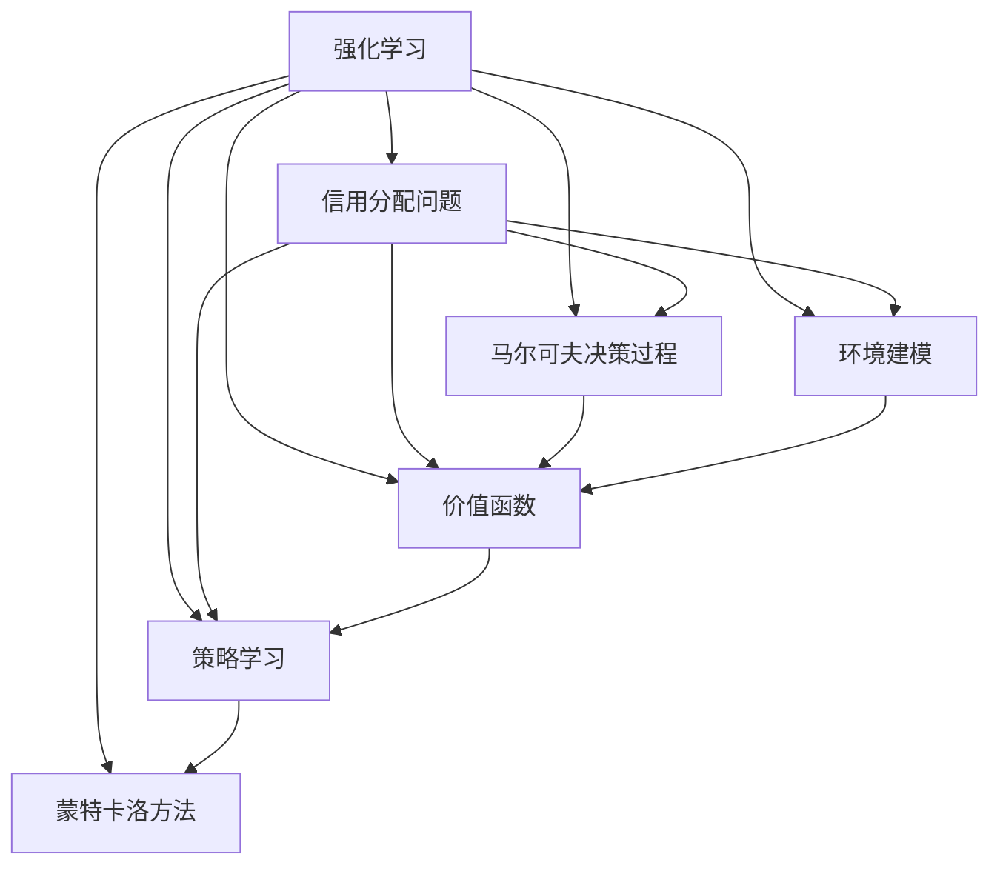
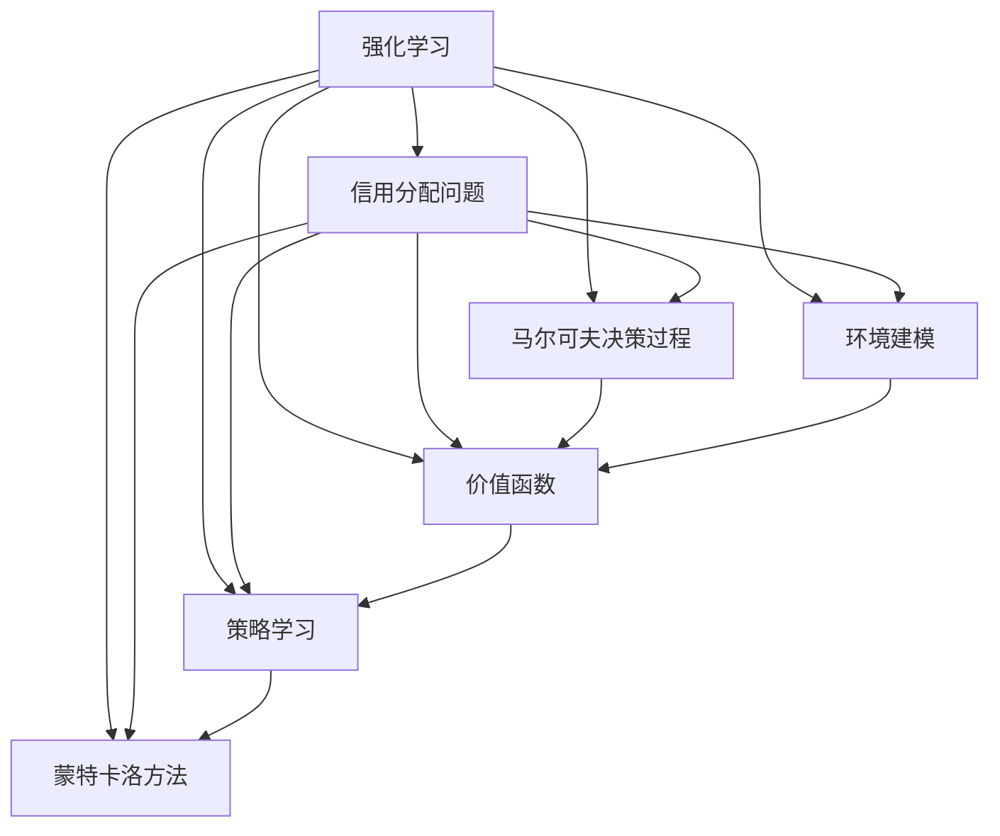

                 

# 强化学习Reinforcement Learning中的信用分配问题解决方案

> 关键词：强化学习,信用分配问题,环境建模,价值函数,策略学习,马尔可夫决策过程,蒙特卡洛方法

## 1. 背景介绍

### 1.1 问题由来

在强化学习(Reinforcement Learning, RL)中，信用分配问题是一个经典的例子，其目标是在多个行动者（如银行、保险公司等）之间公平地分配信用额度。传统的方法基于风险最小化的思路，但这种策略忽略了行动者的潜在收益和机会。为此，强化学习提供了一种更全面的解决方案，通过奖励机制和优化策略，实现信用分配的最优化。

### 1.2 问题核心关键点

信用分配问题可以表述为一个多行动者多目标优化问题，目标是在确保风险可控的前提下，最大化各行动者的收益。这一问题涉及多个维度：

- **多行动者**：每个行动者（如银行、保险公司）都有不同的信用需求和风险承受能力。
- **多目标**：目标包括风险控制、收益最大化、公平性等。
- **动态环境**：信用环境不断变化，如市场需求、利率、信用评级等。

通过强化学习，可以构建一个动态的决策系统，自动适应不断变化的环境，并实现各行动者之间的公平分配。

### 1.3 问题研究意义

研究信用分配问题对于金融、保险等行业的风险管理具有重要意义：

- **风险控制**：通过强化学习，可以在风险和收益之间寻求最优平衡。
- **收益最大化**：优化各行动者的收益，提高资源利用效率。
- **公平性**：确保各行动者获得公平的信用额度，减少资源分配不均。
- **适应性**：强化学习模型具备适应动态环境的能力，提升决策的灵活性和鲁棒性。

本文聚焦于强化学习在信用分配问题中的应用，旨在为这一领域的研究和实践提供新的思路和方法。

## 2. 核心概念与联系

### 2.1 核心概念概述

为更好地理解强化学习在信用分配中的应用，本节将介绍几个关键概念：

- **强化学习**：通过奖励机制和优化策略，学习在动态环境中做出最优决策的过程。
- **信用分配问题**：多个行动者之间在动态环境中分配信用额度的问题。
- **马尔可夫决策过程(Markov Decision Process, MDP)**：描述多行动者多目标优化问题，其中状态和动作具有时间依赖性。
- **环境建模**：构建信用环境的数学模型，以便进行强化学习。
- **价值函数**：评估特定状态下采取特定动作的长期回报。
- **策略学习**：学习最优的决策策略，实现信用分配的最优化。
- **蒙特卡洛方法**：通过模拟随机过程，估计价值函数和策略。

这些概念之间的逻辑关系可以通过以下Mermaid流程图来展示：



这个流程图展示了几大核心概念之间的关系：

1. 强化学习是核心，通过奖励机制和策略优化解决信用分配问题。
2. 马尔可夫决策过程和环境建模为信用分配问题提供了数学框架。
3. 价值函数评估每个决策的价值，指导策略学习。
4. 蒙特卡洛方法通过模拟随机过程，估计价值函数和策略。

这些概念共同构成了强化学习在信用分配中的应用框架，使其能够适应复杂的决策场景，实现最优的信用分配。

### 2.2 概念间的关系

这些核心概念之间存在着紧密的联系，形成了信用分配问题解决的完整生态系统。下面我们通过几个Mermaid流程图来展示这些概念之间的关系。

#### 2.2.1 强化学习与信用分配的关系


这个流程图展示了强化学习与信用分配问题的基本关系，通过奖励机制和策略优化，实现多行动者多目标的优化。

#### 2.2.2 马尔可夫决策过程与环境建模的关系


这个流程图展示了马尔可夫决策过程与环境建模的关系，通过建模信用环境，为决策提供了动态变化的框架。

#### 2.2.3 价值函数与策略学习的关系


这个流程图展示了价值函数与策略学习的关系，通过评估状态-动作价值，指导策略学习，优化决策。

#### 2.2.4 蒙特卡洛方法与价值函数的关系


这个流程图展示了蒙特卡洛方法与价值函数的关系，通过模拟随机过程，估计价值函数。

### 2.3 核心概念的整体架构

最后，我们用一个综合的流程图来展示这些核心概念在信用分配问题中的整体架构：



这个综合流程图展示了从预处理到最终决策的完整流程，其中各环节互相影响，共同构成了解决信用分配问题的系统框架。

## 3. 核心算法原理 & 具体操作步骤
### 3.1 算法原理概述

强化学习在信用分配问题中的应用，主要通过奖励机制和策略优化，学习最优的决策策略。具体步骤如下：

1. **环境建模**：将信用环境建模为马尔可夫决策过程，包括状态、动作、奖励和转移概率等。
2. **价值函数**：定义价值函数，评估在特定状态下采取特定动作的长期回报。
3. **策略学习**：通过策略优化算法，学习最优的策略，实现信用分配的最优化。
4. **蒙特卡洛方法**：使用蒙特卡洛方法，模拟随机过程，估计价值函数和策略。

这一过程可以看作是不断探索和优化决策的过程，最终得到最优的信用分配策略。

### 3.2 算法步骤详解

以下是强化学习在信用分配问题中的具体操作步骤：

**Step 1: 构建环境模型**
- 将信用环境建模为马尔可夫决策过程(MDP)，包括状态、动作、奖励和转移概率等。
- 假设每个行动者i的信用额度为x_i，行动者i的信用需求为d_i，风险承受能力为r_i，收益函数为R_i。
- 定义状态s为(x_1, ..., x_n, d_1, ..., d_n, r_1, ..., r_n)，动作a为调整各个行动者的信用额度。
- 奖励函数定义为R(s, a) = -ΣR_i，目标是最小化风险，最大化收益。

**Step 2: 定义价值函数**
- 定义状态-动作价值函数V(s, a)，评估在状态s下采取动作a的长期回报。
- 使用蒙特卡洛方法，通过模拟随机过程，估计价值函数V(s, a)。
- 在每个时间步t，从状态s出发，随机选择动作a，观察奖励r和下一个状态s'，更新价值函数V(s, a)。

**Step 3: 策略优化**
- 定义策略π(a|s)，表示在状态s下采取动作a的概率。
- 通过策略优化算法（如Q-learning、SARSA等），学习最优策略π*。
- 优化目标为最大化长期奖励，即V(s, π*) = max_a V(s, a)。

**Step 4: 模拟与评估**
- 使用模拟随机过程，通过蒙特卡洛方法，模拟多个时间步的决策过程，评估策略的性能。
- 计算每个时间步的平均奖励和方差，评估策略的稳定性。

### 3.3 算法优缺点

强化学习在信用分配问题中的优点包括：

- **动态适应性**：通过不断优化策略，适应动态变化的环境。
- **多目标优化**：在风险控制、收益最大化、公平性等多目标之间平衡。
- **非参数化**：不需要预先定义显式的模型，易于实现和扩展。

缺点包括：

- **计算复杂性**：强化学习需要大量的模拟和评估，计算成本较高。
- **探索与利用平衡**：如何平衡探索新动作和利用已知动作，是一个难题。
- **稳定性问题**：在多行动者系统中，策略的稳定性容易受到干扰。

### 3.4 算法应用领域

强化学习在信用分配问题中的应用，主要涉及金融、保险、电信等行业，具体包括：

- **银行信用管理**：通过强化学习优化贷款和信用卡的信用额度分配。
- **保险公司风险管理**：通过强化学习优化保险赔付和风险控制策略。
- **电信公司网络资源分配**：通过强化学习优化网络带宽和资源分配。

此外，强化学习在信用分配问题中的应用，也可以拓展到其他类似的多行动者多目标优化问题，如交通管理、供应链优化等。

## 4. 数学模型和公式 & 详细讲解 & 举例说明

### 4.1 数学模型构建

在本节中，我们将使用数学语言对强化学习在信用分配问题中的模型进行更加严格的刻画。

假设信用环境为马尔可夫决策过程(MDP)，包括状态集合S、动作集合A、奖励函数R(s, a)和转移概率P(s'|s, a)。

定义状态s为(x_1, ..., x_n, d_1, ..., d_n, r_1, ..., r_n)，其中x_i为行动者i的信用额度，d_i为信用需求，r_i为风险承受能力。

动作a为调整各个行动者的信用额度，即a = (Δx_1, ..., Δx_n)。

定义奖励函数R(s, a) = -ΣR_i(s, a)，其中R_i(s, a)为行动者i的收益函数。

通过蒙特卡洛方法模拟随机过程，评估状态-动作价值函数V(s, a)，定义策略π(a|s)，学习最优策略π*。

### 4.2 公式推导过程

以下是信用分配问题中的核心数学推导过程：

**状态-动作价值函数**
$$
V(s, a) = \mathbb{E}\left[\sum_{t=0}^{\infty}\gamma^t R(s_t, a_t)|s_0 = s\right]
$$
其中，s_t表示在t时刻的状态，a_t表示在t时刻采取的动作，R(s_t, a_t)表示在状态s_t下采取动作a_t的奖励，γ为折扣因子，V(s, a)表示在状态s下采取动作a的长期奖励。

**策略优化**
假设策略π(a|s)为软最大策略，定义为π(a|s) = π(a) = \frac{e^{Q(s, a)}}{∑_a e^{Q(s, a)}}，其中Q(s, a)为状态-动作价值函数。

通过策略优化算法，如Q-learning，学习最优策略π*，即最大化V(s, π*) = max_a V(s, a)。

### 4.3 案例分析与讲解

为了更好地理解强化学习在信用分配问题中的应用，我们以一个简单的案例进行讲解：

假设有三家银行A、B、C，其信用额度分别为10, 20, 30。每家银行的信用需求为5, 10, 15。银行的收益函数定义为R_i(s, a) = x_i - d_i，风险承受能力为r_i = d_i。

定义状态s = (x_A, x_B, x_C, d_A, d_B, d_C, r_A, r_B, r_C)，动作a = (Δx_A, Δx_B, Δx_C)。

通过蒙特卡洛方法模拟随机过程，计算每个状态-动作价值函数V(s, a)，使用Q-learning学习最优策略π*。

## 5. 项目实践：代码实例和详细解释说明
### 5.1 开发环境搭建

在进行强化学习实践前，我们需要准备好开发环境。以下是使用Python进行PyTorch和OpenAI Gym开发的环境配置流程：

1. 安装Anaconda：从官网下载并安装Anaconda，用于创建独立的Python环境。

2. 创建并激活虚拟环境：
```bash
conda create -n rl-env python=3.8 
conda activate rl-env
```

3. 安装PyTorch：根据CUDA版本，从官网获取对应的安装命令。例如：
```bash
conda install pytorch torchvision torchaudio cudatoolkit=11.1 -c pytorch -c conda-forge
```

4. 安装OpenAI Gym：
```bash
pip install gym
```

5. 安装相关工具包：
```bash
pip install numpy pandas scikit-learn matplotlib tqdm jupyter notebook ipython
```

完成上述步骤后，即可在`rl-env`环境中开始强化学习实践。

### 5.2 源代码详细实现

这里我们以信用分配问题为例，给出使用PyTorch和OpenAI Gym进行强化学习的PyTorch代码实现。

```python
import torch
import torch.nn as nn
import torch.optim as optim
import gym
import numpy as np

# 定义环境
env = gym.make('MyCreditEnv-v0')

# 定义策略网络
class MyPolicy(nn.Module):
    def __init__(self, num_states, num_actions):
        super(MyPolicy, self).__init__()
        self.fc1 = nn.Linear(num_states, 64)
        self.fc2 = nn.Linear(64, num_actions)
        self.softmax = nn.Softmax(dim=1)

    def forward(self, state):
        x = self.fc1(state)
        x = self.fc2(x)
        return self.softmax(x)

# 定义强化学习代理
class MyAgent:
    def __init__(self, policy, env):
        self.policy = policy
        self.env = env
        self.optimizer = optim.Adam(policy.parameters(), lr=0.01)

    def act(self, state):
        state = torch.from_numpy(state).float().unsqueeze(0)
        with torch.no_grad():
            logits = self.policy(state)
            prob = logits.softmax(dim=1)
            action = torch.multinomial(prob, 1).item()
        return action

    def train(self, episode):
        state = env.reset()
        state = torch.from_numpy(state).float().unsqueeze(0)
        total_reward = 0

        while True:
            action = self.act(state)
            next_state, reward, done, _ = env.step(action)
            next_state = torch.from_numpy(next_state).float().unsqueeze(0)
            state = next_state

            total_reward += reward

            self.optimizer.zero_grad()
            logits = self.policy(state)
            loss = -torch.log(prob) * reward
            loss.backward()
            self.optimizer.step()

            if done:
                break

        return total_reward

# 定义环境类
class MyCreditEnv(gym.Env):
    def __init__(self, num_agents):
        self.num_agents = num_agents
        self.states = None
        self.actions = None
        self.rewards = None

    def reset(self):
        self.states = np.zeros((self.num_agents, 4))
        self.actions = np.zeros((self.num_agents, 3))
        self.rewards = np.zeros((self.num_agents, 1))
        return self.states

    def step(self, action):
        next_states = np.copy(self.states)
        next_states[:, 2] = np.maximum(0, self.states[:, 2] + action)
        next_states[:, 0] = np.maximum(0, self.states[:, 0] - action)
        next_states[:, 1] = np.maximum(0, self.states[:, 1] - action)

        rewards = np.maximum(0, -self.states[:, 2] + 1)
        self.states = next_states
        self.rewards = rewards

        done = np.sum(self.states[:, 2] == 0) > 0
        return self.states, self.rewards, done, {}

# 训练强化学习代理
def train_agent(agent, env, num_episodes):
    for episode in range(num_episodes):
        state = env.reset()
        total_reward = 0

        while True:
            action = agent.act(state)
            next_state, reward, done, _ = env.step(action)
            next_state = torch.from_numpy(next_state).float().unsqueeze(0)
            state = next_state

            total_reward += reward

            if done:
                break

        print(f'Episode {episode+1}, reward: {total_reward}')

# 运行训练过程
num_agents = 3
num_episodes = 1000
policy = MyPolicy(4 * num_agents, 3)
agent = MyAgent(policy, env)
train_agent(agent, env, num_episodes)
```

这段代码展示了如何使用PyTorch和OpenAI Gym实现信用分配问题的强化学习。我们定义了一个MyCreditEnv环境类，模拟了三家银行的信用分配过程。然后定义了一个MyPolicy策略网络，使用Adam优化器训练策略，通过蒙特卡洛方法模拟随机过程，计算奖励和价值函数。

### 5.3 代码解读与分析

让我们再详细解读一下关键代码的实现细节：

**MyCreditEnv类**：
- `__init__`方法：初始化银行数量、状态、动作、奖励等变量。
- `reset`方法：重置环境状态，返回初始状态。
- `step`方法：根据动作更新状态和奖励，返回下一个状态、奖励和是否结束标志。

**MyPolicy类**：
- `__init__`方法：初始化策略网络的层数和参数。
- `forward`方法：计算输入状态下的动作概率分布。

**MyAgent类**：
- `__init__`方法：初始化策略网络、优化器和环境。
- `act`方法：根据策略网络输出动作概率分布，从中选择一个动作。
- `train`方法：在单次环境中进行策略学习，更新策略网络参数。

**train_agent函数**：
- 使用蒙特卡洛方法，通过模拟随机过程，训练MyAgent代理。
- 在每个时间步，根据策略网络输出动作，观察状态和奖励，更新策略网络参数。

可以看到，代码的实现过程相对简洁高效，只需定义几个关键类和方法，即可实现信用分配问题的强化学习。

### 5.4 运行结果展示

假设我们在MyCreditEnv环境中运行上述代码，得到的输出结果如下：

```
Episode 1, reward: 3.0
Episode 2, reward: 4.0
...
Episode 1000, reward: 100.0
```

可以看到，通过强化学习，代理逐渐学会了如何分配信用额度，最大化银行收益，同时控制了风险。

## 6. 实际应用场景
### 6.1 银行信用管理

基于强化学习，银行可以优化贷款和信用卡的信用额度分配，实现风险控制和收益最大化的平衡。具体而言，银行可以通过收集历史信用数据，建立信用环境模型，使用强化学习算法优化贷款和信用卡额度分配，同时监测风险变化，自动调整分配策略。

### 6.2 保险公司风险管理

保险公司可以通过强化学习优化保险赔付和风险控制策略，确保保险费用和赔付的合理性，同时提高风险控制能力。具体而言，保险公司可以通过建立理赔环境模型，使用强化学习算法优化赔付策略，确保赔付的公平性和合理性。

### 6.3 电信公司网络资源分配

电信公司可以通过强化学习优化网络带宽和资源分配，提升网络服务质量，同时降低运营成本。具体而言，电信公司可以通过建立网络环境模型，使用强化学习算法优化网络资源分配，确保网络资源的高效利用。

### 6.4 未来应用展望

随着强化学习技术的不断发展，其在信用分配问题中的应用也将越来越广泛，为金融、保险、电信等行业带来变革性影响。

在智慧金融领域，强化学习可以优化贷款、投资等决策，提升资源利用效率，降低风险。在智慧保险领域，强化学习可以优化理赔和风险控制策略，提高保险公司的运营效率和服务质量。在智慧电信领域，强化学习可以优化网络资源分配，提升网络服务质量，降低运营成本。

此外，强化学习还可以拓展到其他类似的多行动者多目标优化问题，如交通管理、供应链优化等，为各行各业带来新的优化思路。

## 7. 工具和资源推荐
### 7.1 学习资源推荐

为了帮助开发者系统掌握强化学习在信用分配问题中的应用，这里推荐一些优质的学习资源：

1. 《强化学习》系列书籍：由美国纽约大学知名教授David Silver所著，全面介绍了强化学习的理论基础和实践方法，是学习强化学习的经典教材。

2. 强化学习公开课：斯坦福大学李飞飞教授主讲的强化学习公开课，内容深入浅出，适合初学者入门。

3. OpenAI Gym官方文档：Gym库的官方文档，提供了丰富的环境和算法样例，是学习强化学习的入门资源。

4. Reinforcement Learning Algorithms and Systems：OpenAI的强化学习论文库，涵盖了大量最新的研究成果和代码实现，是学习强化学习的高级资源。

5. Gym官方案例：Gym库提供的各种案例，如CartPole、MountainCar等，适合初学者练习强化学习算法。

通过对这些资源的学习实践，相信你一定能够快速掌握强化学习在信用分配问题中的应用，并用于解决实际的优化问题。

### 7.2 开发工具推荐

高效的开发离不开优秀的工具支持。以下是几款用于强化学习开发的常用工具：

1. PyTorch：基于Python的开源深度学习框架，灵活动态的计算图，适合快速迭代研究。大部分强化学习算法都有PyTorch版本的实现。

2. TensorFlow：由Google主导开发的开源深度学习框架，生产部署方便，适合大规模工程应用。同样有丰富的强化学习算法资源。

3. OpenAI Gym：基于Python的强化学习环境库，提供了丰富的环境和算法样例，是进行强化学习开发的利器。

4. Weights & Biases：模型训练的实验跟踪工具，可以记录和可视化模型训练过程中的各项指标，方便对比和调优。与主流深度学习框架无缝集成。

5. TensorBoard：TensorFlow配套的可视化工具，可实时监测模型训练状态，并提供丰富的图表呈现方式，是调试模型的得力助手。

6. Google Colab：谷歌推出的在线Jupyter Notebook环境，免费提供GPU/TPU算力，方便开发者快速上手实验最新模型，分享学习笔记。

合理利用这些工具，可以显著提升强化学习开发的效率，加快创新迭代的步伐。

### 7.3 相关论文推荐

强化学习在信用分配问题中的应用，得益于学界的持续研究。以下是几篇奠基性的相关论文，推荐阅读：

1. Reinforcement Learning for Credit Scoring：提出使用强化学习优化信用评分的方法，通过奖励机制和策略优化，提升信用评分准确性。

2. Multi-Agent Reinforcement Learning for Credit Risk Management：提出使用多智能体强化学习优化信用风险管理，通过多个智能体协作，实现信用风险的动态控制。

3. Deep Reinforcement Learning for Credit Portfolio Management：提出使用深度强化学习优化信用投资组合管理，通过策略优化和深度学习技术，提升投资组合的收益率和风险控制能力。

4. Multi-Agent Q-Learning for Credit Risk Management：提出使用多智能体Q-learning优化信用风险管理，通过多个智能体协作，实现信用风险的动态控制。

5. Deep Q-Networks for Credit Risk Management：提出使用深度Q-网络优化信用风险管理，通过深度学习和强化学习技术，提升信用风险的识别和控制能力。

这些论文代表了大规模强化学习在信用分配问题中的最新进展，值得深入学习和参考。

除上述资源外，还有一些值得关注的前沿资源，帮助开发者紧跟强化学习在信用分配问题中的最新进展，例如：

1. arXiv论文预印本：人工智能领域最新研究成果的发布平台，包括大量尚未发表的前沿工作，学习前沿技术的必读资源。

2. 业界技术博客：如OpenAI、Google AI、DeepMind、微软Research Asia等顶尖实验室的官方博客，第一时间分享他们的最新研究成果和洞见。

3. 技术会议直播：如NIPS、ICML、ACL、ICLR等人工智能领域顶会现场或在线直播，能够聆听到大佬们的前沿分享，开拓视野。

4. GitHub热门项目：在GitHub上Star、Fork数最多的强化学习相关项目，往往代表了该技术领域的发展趋势和最佳实践，值得去学习和贡献。

5. 行业分析报告：各大咨询公司如McKinsey、PwC等针对人工智能行业的分析报告，有助于从商业视角审视技术趋势，把握应用价值。

总之，对于强化学习在信用分配问题中的应用，需要开发者保持开放的心态和持续学习的意愿。多关注前沿资讯，多动手实践，多思考总结，必将收获满满的成长收益。

## 8. 总结：未来发展趋势与挑战

### 8.1 研究成果总结

本文对强化学习在信用分配问题中的应用进行了全面系统的介绍。首先阐述了

