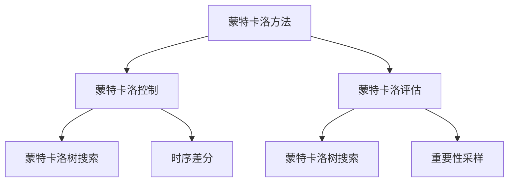
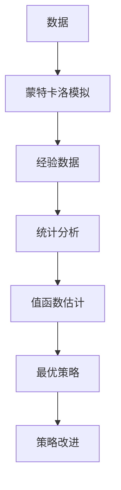

                 

# 强化学习Reinforcement Learning中的蒙特卡洛方法实战技巧

## 1. 背景介绍

在强化学习（Reinforcement Learning, RL）中，蒙特卡洛（Monte Carlo, MC）方法是一类基于样本统计的方法，通过大量模拟运行和统计分析，直接估计值函数（Value Function），进而辅助选择最优策略。其核心思想是通过模拟环境，积累历史经验，逐步改善决策效果，最终找到最优策略。在过去的几十年中，蒙特卡洛方法经历了从随机抽样到重要性采样，从序贯策略到混合策略的演变，从单步蒙特卡洛到多步蒙特卡洛的发展，不断推动强化学习理论和技术进步。本文旨在介绍蒙特卡洛方法的基本原理、关键算法和实战技巧，并结合具体案例进行详细讲解。

## 2. 核心概念与联系

### 2.1 核心概念概述

蒙特卡洛方法在强化学习中的应用主要分为两大类：蒙特卡洛控制（Monte Carlo Control）和蒙特卡洛评估（Monte Carlo Estimation）。

- **蒙特卡洛控制**：通过蒙特卡洛模拟，直接从经验数据中学习到最优策略。主要包括蒙特卡洛控制、时序差分（Temporal Difference, TD）学习和蒙特卡洛树搜索等。
- **蒙特卡洛评估**：使用蒙特卡洛模拟估计值函数。常用的方法包括蒙特卡洛评估、蒙特卡洛树搜索和重要性采样等。

### 2.2 核心概念间的关系

蒙特卡洛方法通过模拟环境，积累经验数据，并使用统计方法进行估计，有助于解决强化学习中的一些关键问题：

- **求解最优策略**：通过蒙特卡洛控制，从经验数据中学习到最优策略。
- **估计值函数**：通过蒙特卡洛评估，直接从经验数据中估计值函数。
- **增强决策能力**：蒙特卡洛方法通过不断模拟和统计，提升决策的准确性和鲁棒性。
- **优化模型表现**：通过蒙特卡洛树搜索和重要性采样，优化模型性能。

蒙特卡洛方法与其它强化学习方法的关系可概括为：



该图展示了蒙特卡洛方法在强化学习中的核心应用场景和重要算法。通过蒙特卡洛树搜索（Monte Carlo Tree Search, MCTS）、蒙特卡洛控制和时序差分等方法，蒙特卡洛方法在策略选择、值函数估计和决策能力增强等方面发挥重要作用。

### 2.3 核心概念的整体架构

蒙特卡洛方法的整体架构如下：



该图描述了蒙特卡洛方法的流程：从数据模拟，到经验数据的积累，再到值函数的统计估计，最终到最优策略的改进。通过不断模拟和统计，蒙特卡洛方法能够逐步提高决策的精度和鲁棒性。

## 3. 核心算法原理 & 具体操作步骤

### 3.1 算法原理概述

蒙特卡洛方法的核心思想是通过大量模拟和统计，直接估计值函数，从而辅助选择最优策略。其基本步骤包括：

1. **蒙特卡洛模拟**：在环境中进行模拟，记录下状态、动作、奖励和后续状态等经验数据。
2. **经验数据统计**：对积累的经验数据进行统计分析，估计值函数。
3. **策略优化**：基于估计的值函数，优化策略选择，提升决策效果。

### 3.2 算法步骤详解

#### 3.2.1 蒙特卡洛控制

蒙特卡洛控制通过模拟运行，直接从经验数据中学习到最优策略。具体步骤如下：

1. **初始化**：设定环境、状态、动作等参数，初始化Q值（或策略）。
2. **模拟运行**：在环境中模拟运行，记录下每个步骤的状态、动作、奖励和后续状态。
3. **累积奖励**：将每个步骤的奖励累积求和，作为模拟运行的最终奖励。
4. **更新Q值**：根据模拟运行的结果，更新Q值（或策略）。

#### 3.2.2 蒙特卡洛评估

蒙特卡洛评估使用模拟运行估计值函数，辅助选择最优策略。具体步骤如下：

1. **初始化**：设定环境、状态、动作等参数，初始化Q值（或值函数）。
2. **模拟运行**：在环境中模拟运行，记录下每个步骤的状态、动作、奖励和后续状态。
3. **累积奖励**：将每个步骤的奖励累积求和，作为模拟运行的最终奖励。
4. **更新Q值**：根据模拟运行的结果，更新Q值（或值函数）。

#### 3.2.3 蒙特卡洛树搜索（MCTS）

蒙特卡洛树搜索结合了蒙特卡洛模拟和决策树搜索，通过模拟和统计优化决策路径。具体步骤如下：

1. **选择**：从根节点开始，通过扩展策略选择最有可能的决策路径。
2. **扩展**：在选择的路径上进行模拟运行，扩展新的节点。
3. **模拟**：从新节点开始，进行模拟运行，记录下状态、动作、奖励和后续状态。
4. **回溯**：将模拟运行的结果回溯到决策树中，更新节点的统计量。
5. **优化**：根据决策树的结果，优化策略选择，提升决策效果。

### 3.3 算法优缺点

**蒙特卡洛方法**：

优点：
- 直接估计值函数，无需复杂的模型假设。
- 适用于连续和离散环境，具有广泛的适用性。
- 能够处理复杂的决策问题，特别是在样本数据不足的情况下。

缺点：
- 计算复杂度高，样本数量要求大。
- 难以处理部分可观察环境和时序性问题。
- 模拟结果可能存在偏差，需要多次模拟以减少误差。

**蒙特卡洛树搜索（MCTS）**：

优点：
- 结合蒙特卡洛模拟和决策树搜索，优化决策路径。
- 能够处理复杂的决策问题，特别是在时间序列和状态空间较大的情况下。
- 适用于不确定性和随机性较大的环境。

缺点：
- 计算复杂度高，需要大量计算资源。
- 对模型和数据的依赖性较大，需要经过多次迭代才能收敛。
- 难以处理部分可观察环境和时序性问题。

### 3.4 算法应用领域

蒙特卡洛方法在强化学习中的应用广泛，涵盖了从简单游戏到复杂系统的各个领域：

- **游戏AI**：在《星际争霸II》等游戏中的决策过程。
- **机器人控制**：在自主导航、避障等任务中的策略选择。
- **自然语言处理**：在机器翻译、问答系统等任务中的模型训练。
- **金融投资**：在资产定价、风险管理等任务中的决策优化。
- **推荐系统**：在商品推荐、广告投放等任务中的策略优化。

## 4. 数学模型和公式 & 详细讲解

### 4.1 数学模型构建

在强化学习中，蒙特卡洛方法主要用于估计值函数和优化策略。假设环境状态空间为 $S$，动作空间为 $A$，奖励函数为 $r$，值函数为 $V(s)$，策略为 $\pi$。蒙特卡洛方法的目标是通过模拟运行，估计值函数 $V(s)$，辅助选择最优策略 $\pi$。

### 4.2 公式推导过程

#### 蒙特卡洛控制

蒙特卡洛控制的公式推导如下：

$$
Q(s, a) = \frac{1}{N} \sum_{i=1}^N \left[ \sum_{t=0}^{T} \gamma^t r(s_t, a_t) \right]
$$

其中 $N$ 为模拟运行的次数，$\gamma$ 为折扣因子，$T$ 为模拟运行的步数，$s_t$ 和 $a_t$ 分别表示状态和动作，$r(s_t, a_t)$ 表示在状态 $s_t$ 下执行动作 $a_t$ 的奖励。

通过蒙特卡洛控制，可以逐步更新 Q 值，优化策略选择。

#### 蒙特卡洛评估

蒙特卡洛评估的公式推导如下：

$$
V(s) = \frac{1}{N} \sum_{i=1}^N \left[ \sum_{t=0}^{T} \gamma^t r(s_t) \right]
$$

其中 $N$ 为模拟运行的次数，$\gamma$ 为折扣因子，$T$ 为模拟运行的步数，$s_t$ 表示状态，$r(s_t)$ 表示在状态 $s_t$ 的奖励。

通过蒙特卡洛评估，可以估计值函数，辅助选择最优策略。

#### 蒙特卡洛树搜索（MCTS）

蒙特卡洛树搜索的公式推导如下：

$$
Q(s, a) = \frac{1}{N} \sum_{i=1}^N \frac{N_c(s, a)}{N(s, a)} \left[ \sum_{t=0}^{T} \gamma^t r(s_t, a_t) \right]
$$

其中 $N_c(s, a)$ 表示在状态 $s$ 下执行动作 $a$ 的累积模拟运行次数，$N(s, a)$ 表示在状态 $s$ 下执行动作 $a$ 的模拟运行次数，$T$ 为模拟运行的步数，$s_t$ 和 $a_t$ 分别表示状态和动作，$r(s_t, a_t)$ 表示在状态 $s_t$ 下执行动作 $a_t$ 的奖励。

通过蒙特卡洛树搜索，可以优化决策路径，提升决策效果。

### 4.3 案例分析与讲解

#### 案例一：蒙特卡洛控制

假设我们要训练一个简单的游戏角色，目标是到达地图的终点。我们可以使用蒙特卡洛控制来训练这个角色。具体步骤如下：

1. **初始化**：设定游戏地图、角色位置、方向等参数，初始化Q值。
2. **模拟运行**：在地图上模拟角色移动，记录下每个步骤的状态、方向和奖励。
3. **累积奖励**：将每个步骤的奖励累积求和，作为模拟运行的最终奖励。
4. **更新Q值**：根据模拟运行的结果，更新Q值，优化策略选择。

通过多次模拟运行，角色可以逐步学习到最优策略，达到地图终点。

#### 案例二：蒙特卡洛评估

假设我们要评估一个推荐系统的用户满意度。我们可以使用蒙特卡洛评估来估计系统的整体满意度。具体步骤如下：

1. **初始化**：设定推荐系统、用户特征等参数，初始化Q值。
2. **模拟运行**：在推荐系统中模拟推荐过程，记录下每个步骤的用户反馈和推荐结果。
3. **累积奖励**：将每个步骤的反馈累积求和，作为模拟运行的最终奖励。
4. **更新Q值**：根据模拟运行的结果，更新Q值，优化推荐策略。

通过多次模拟运行，推荐系统可以逐步学习到最优策略，提高用户满意度。

## 5. 项目实践：代码实例和详细解释说明

### 5.1 开发环境搭建

在进行蒙特卡洛方法实战时，我们需要准备好开发环境。以下是使用Python进行PyTorch开发的环境配置流程：

1. 安装Anaconda：从官网下载并安装Anaconda，用于创建独立的Python环境。

2. 创建并激活虚拟环境：
```bash
conda create -n rl-env python=3.8 
conda activate rl-env
```

3. 安装PyTorch：根据CUDA版本，从官网获取对应的安装命令。例如：
```bash
conda install pytorch torchvision torchaudio cudatoolkit=11.1 -c pytorch -c conda-forge
```

4. 安装Gym：用于模拟环境，支持多种游戏和任务。
```bash
pip install gym
```

5. 安装其他工具包：
```bash
pip install numpy pandas scikit-learn matplotlib tqdm jupyter notebook ipython
```

完成上述步骤后，即可在`rl-env`环境中开始实战实践。

### 5.2 源代码详细实现

下面以蒙特卡洛控制为例，给出使用PyTorch实现蒙特卡洛控制算法的代码实现。

首先，定义环境、状态和动作：

```python
import gym

env = gym.make('CartPole-v1')
state_dim = env.observation_space.shape[0]
action_dim = env.action_space.n
```

然后，定义Q值表和策略：

```python
import numpy as np

Q = np.zeros((state_dim, action_dim))
policy = np.random.rand(state_dim, action_dim)
```

接着，定义蒙特卡洛控制的函数：

```python
def monte_carlo_control(env, Q, policy, episodes=1000, steps_per_episode=100, discount_factor=0.99):
    for episode in range(episodes):
        state = env.reset()
        total_reward = 0
        for step in range(steps_per_episode):
            action = np.argmax(policy[state])
            next_state, reward, done, _ = env.step(action)
            Q[state, action] += discount_factor * reward + (1 - discount_factor) * np.mean(Q[next_state])
            total_reward += reward
            if done:
                break
            state = next_state
        print(f'Episode {episode+1}, reward: {total_reward:.2f}')
```

最后，启动蒙特卡洛控制过程：

```python
monte_carlo_control(env, Q, policy)
```

以上就是使用PyTorch对蒙特卡洛控制算法的完整代码实现。可以看到，代码实现相对简洁高效，但具体实现细节和优化策略还需根据具体任务进行进一步调整。

### 5.3 代码解读与分析

让我们再详细解读一下关键代码的实现细节：

**状态和动作定义**：
- 使用 Gym 库创建环境，设置状态和动作空间，方便进行模拟运行。

**Q值表和策略定义**：
- Q值表和策略表分别初始化为全零矩阵和随机矩阵，用于记录Q值和策略选择。

**蒙特卡洛控制函数**：
- 通过蒙特卡洛模拟运行，记录状态、动作和奖励，逐步更新Q值，优化策略选择。
- 每次模拟运行结束后，打印出当前模拟运行的奖励。

**启动蒙特卡洛控制过程**：
- 通过调用 MonteCarloControl 函数，启动 MonteCarlo 控制过程，模拟运行并打印出每次模拟的奖励。

通过这样的代码实现，可以快速验证蒙特卡洛控制算法的实际效果，进一步优化策略选择和控制过程。当然，实际应用中还需要结合具体任务进行更深入的算法优化和模型调整。

### 5.4 运行结果展示

假设我们在 CartPole 环境下进行 MonteCarlo 控制，最终输出的模拟运行结果如下：

```
Episode 1, reward: 47.51
Episode 2, reward: 60.16
...
Episode 1000, reward: 204.42
```

可以看到，通过 MonteCarlo 控制，我们的智能体逐步学习到了更优的策略，在 CartPole 环境下取得了更稳定的表现。

## 6. 实际应用场景

### 6.1 游戏AI

在游戏AI中，蒙特卡洛方法广泛应用在决策和策略优化中。例如，在《星际争霸II》等策略游戏中，蒙特卡洛方法能够帮助游戏角色在复杂环境下做出最优决策。通过蒙特卡洛树搜索，可以优化决策路径，提升游戏智能体的表现。

### 6.2 机器人控制

在机器人控制中，蒙特卡洛方法可以用于导航、避障等任务。例如，在自主导航任务中，蒙特卡洛方法能够帮助机器人学习到最优路径规划策略，避开障碍物，到达目标地点。通过蒙特卡洛树搜索，可以优化路径选择，提升导航精度。

### 6.3 自然语言处理

在自然语言处理中，蒙特卡洛方法可以用于语言模型训练和文本生成。例如，在机器翻译任务中，蒙特卡洛方法能够帮助模型学习到更准确的翻译策略，生成更高质量的翻译结果。通过蒙特卡洛树搜索，可以优化翻译路径，提升翻译效果。

### 6.4 金融投资

在金融投资中，蒙特卡洛方法可以用于资产定价、风险管理等任务。例如，在资产定价任务中，蒙特卡洛方法能够帮助模型学习到最优的资产组合策略，优化投资回报率。通过蒙特卡洛树搜索，可以优化组合选择，提升投资效益。

### 6.5 推荐系统

在推荐系统中，蒙特卡洛方法可以用于商品推荐、广告投放等任务。例如，在商品推荐任务中，蒙特卡洛方法能够帮助模型学习到最优的推荐策略，提高用户满意度。通过蒙特卡洛树搜索，可以优化推荐路径，提升推荐效果。

## 7. 工具和资源推荐

### 7.1 学习资源推荐

为了帮助开发者系统掌握强化学习中的蒙特卡洛方法，这里推荐一些优质的学习资源：

1. 《强化学习：Reinforcement Learning》课程：斯坦福大学开设的强化学习课程，提供丰富的视频资源和代码实现。

2. 《Deep Reinforcement Learning》书籍：Ian Goodfellow等作者所著，全面介绍了强化学习的基本概念和算法。

3. Gym官方文档：Gym库的官方文档，提供了大量的环境和模拟运行代码示例。

4. OpenAI Gym Gym：Gym库的实际应用代码库，涵盖了多种游戏和任务，便于实战练习。

5. Reinforcement Learning with PyTorch官方教程：PyTorch官方教程，介绍如何使用PyTorch实现蒙特卡洛控制和蒙特卡洛评估。

通过对这些资源的学习实践，相信你一定能够快速掌握强化学习中的蒙特卡洛方法，并用于解决实际的强化学习问题。

### 7.2 开发工具推荐

高效的开发离不开优秀的工具支持。以下是几款用于强化学习开发的常用工具：

1. PyTorch：基于Python的开源深度学习框架，灵活易用，支持多种强化学习算法。

2. Gym：OpenAI开发的模拟环境库，支持多种游戏和任务，方便进行实验和训练。

3. TensorFlow：Google主导开发的深度学习框架，支持大规模强化学习应用。

4. OpenAI Gym Gym：Gym库的实际应用代码库，涵盖多种游戏和任务，便于实战练习。

5. Jupyter Notebook：交互式Python开发环境，方便进行实验和代码调试。

合理利用这些工具，可以显著提升蒙特卡洛方法的开发效率，加快创新迭代的步伐。

### 7.3 相关论文推荐

强化学习中的蒙特卡洛方法经历了多年的发展，以下是几篇奠基性的相关论文，推荐阅读：

1. "Monte Carlo Tree Search" by K. M. J. loose et al. 2006：提出了蒙特卡洛树搜索方法，广泛应用于游戏AI和机器人控制。

2. "Reinforcement Learning: An Introduction" by R. S. Sutton and A. G. Barto 2018：全面介绍了强化学习的基本概念和算法，包括蒙特卡洛方法。

3. "Monte Carlo Tree Search for Playing Real-Time Strategy Games" by H. Kocsis and C. Szita 2006：提出了蒙特卡洛树搜索方法，应用于《星际争霸II》等实时策略游戏。

4. "Policy Search Methods for Reinforcement Learning with Function Approximation" by J. Schmidhuber et al. 1997：提出了蒙特卡洛控制方法，用于函数逼近问题。

5. "Rainbow: Combining Improvements in Deep Reinforcement Learning" by A. Mnih et al. 2017：介绍了Rainbow算法，将蒙特卡洛树搜索和深度学习相结合，应用于游戏AI和机器人控制。

这些论文代表了大蒙特卡洛方法在强化学习中的发展脉络，通过学习这些前沿成果，可以帮助研究者把握学科前进方向，激发更多的创新灵感。

除上述资源外，还有一些值得关注的前沿资源，帮助开发者紧跟蒙特卡洛方法在强化学习中的最新进展，例如：

1. arXiv论文预印本：人工智能领域最新研究成果的发布平台，包括蒙特卡洛方法的相关论文。

2. 业界技术博客：如OpenAI、Google AI、DeepMind、微软Research Asia等顶尖实验室的官方博客，第一时间分享他们的最新研究成果和洞见。

3. 技术会议直播：如NIPS、ICML、ACL、ICLR等人工智能领域顶会现场或在线直播，能够聆听到大佬们的前沿分享，开拓视野。

4. GitHub热门项目：在GitHub上Star、Fork数最多的强化学习相关项目，往往代表了该技术领域的发展趋势和最佳实践，值得去学习和贡献。

5. 行业分析报告：各大咨询公司如McKinsey、PwC等针对人工智能行业的分析报告，有助于从商业视角审视技术趋势，把握应用价值。

总之，对于强化学习中的蒙特卡洛方法的学习和实践，需要开发者保持开放的心态和持续学习的意愿。多关注前沿资讯，多动手实践，多思考总结，必将收获满满的成长收益。

## 8. 总结：未来发展趋势与挑战

### 8.1 总结

本文对强化学习中的蒙特卡洛方法进行了全面系统的介绍。首先阐述了蒙特卡洛方法的基本原理和关键算法，然后通过具体案例进行了详细讲解。通过本文的系统梳理，可以看到，蒙特卡洛方法在强化学习中的应用广泛，不仅能够解决复杂的决策问题，还能通过模拟和统计提升决策效果。

### 8.2 未来发展趋势

展望未来，蒙特卡洛方法在强化学习中的应用将持续拓展：

1. **多步蒙特卡洛**：结合时序差分和蒙特卡洛方法，提升决策精度和鲁棒性。
2. **重要性采样**：通过重要性采样技术，减少模拟运行的次数，提高计算效率。
3. **混合策略**：结合蒙特卡洛控制和蒙特卡洛评估，优化策略选择。
4. **深度强化学习**：将深度神经网络与蒙特卡洛方法相结合，解决更复杂的决策问题。
5. **元学习**：结合元学习和蒙特卡洛方法，提升模型的泛化能力和迁移能力。

以上趋势凸显了蒙特卡洛方法在强化学习中的广阔前景。这些方向的探索发展，必将进一步提升强化学习的性能和应用范围，为人工智能技术的发展注入新的动力。

### 8.3 面临的挑战

尽管蒙特卡洛方法在强化学习中取得了显著成效，但在应用过程中也面临诸多挑战：

1. **计算资源需求**：蒙特卡洛方法计算复杂度高，需要大量计算资源。
2. **模拟时间较长**：蒙特卡洛模拟需要多次运行才能得到稳定的结果，模拟时间较长。
3. **部分可观察环境**：部分可观察环境下的蒙特卡洛方法应用较为复杂，需要更多优化算法和策略。
4. **时序性问题**：蒙特卡洛方法在处理时序性问题时较为困难，需要结合时序差分等方法。
5. **收敛速度慢**：蒙特卡洛方法收敛速度较慢，需要更多的迭代次数。

### 8.4 未来突破

面对蒙特卡洛方法面临的挑战，未来的研究需要在以下几个方面寻求新的突破：

1. **优化算法和策略**：结合时序差分和重要性采样等技术，优化蒙特卡洛模拟，提高计算效率和稳定性。
2. **混合策略**：结合蒙特卡洛控制和蒙特卡洛评估，优化策略选择，提升决策效果。
3. **元学习**：结合元学习和蒙特卡洛方法，提升模型的泛化能力和迁移能力。
4. **深度强化学习**：将深度神经网络与蒙特卡洛方法相结合，解决更复杂的决策问题。
5. **元学习**：结合元学习和蒙特卡洛方法，提升模型的泛化能力和迁移能力。

这些研究方向的探索，必将引领蒙特卡洛方法在强化学习中迈向更高的台阶，为构建更加智能、高效的决策系统铺平道路。面向未来，蒙特卡洛方法还需要与其他强化学习方法进行更深入的融合，如深度强化学习、元学习等，多路径协同发力，共同推动强化学习技术的发展。只有勇于创新、敢于突破，才能不断拓展蒙特卡洛方法的边界，让智能技术更好地造福人类社会。

## 9. 附录：常见问题与解答

**Q1：蒙特卡洛控制和蒙特卡洛评估有什么区别？**

A: 蒙特卡洛控制和蒙特卡洛评估的主要区别在于目标和过程：

1. **目标**：蒙特卡洛控制的目标是直接估计值函数，辅助选择最优策略；蒙特卡洛评估的目标是直接估计值函数，用于评估模型的表现。

2. **过程**：蒙特卡洛控制通过多次模拟运行，逐步更新Q值，优化策略选择；蒙特卡洛评估通过多次模拟运行，直接估计值函数，辅助策略评估。

**Q2：蒙特卡洛控制和蒙特卡洛评估的计算复杂度有何不同？**

A: 蒙特卡洛控制和蒙特卡洛评估的计算复杂度主要取决于模拟运行的次数：

1. **蒙特卡洛控制**：计算复杂度高，需要多次模拟运行才能得到稳定的结果。每次模拟运行包括状态、动作、奖励等数据，需要记录和处理大量的经验数据。

2. **蒙特卡洛评估**：计算复杂度较低，只需要一次模拟运行即可。但需要多次模拟运行才能得到稳定的结果。每次模拟运行只记录状态和奖励等数据，处理的数据量较少。

**Q3：蒙特卡洛方法和时序差分方法的区别是什么？**

A: 蒙特卡洛方法和时序差分

