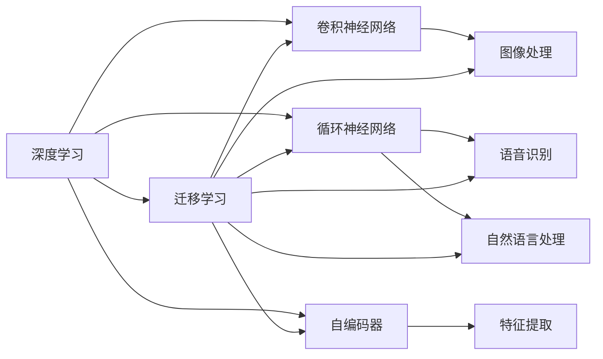

                 

# 感知 (Perception)

## 1. 背景介绍

### 1.1 问题由来

随着人工智能技术的不断进步，人类社会已经进入了一个全新的智能时代。感知技术作为人工智能的重要分支，正以惊人的速度推动着各个行业的智能化转型。从语音识别、图像处理、自然语言处理，到智能推荐、智能医疗、自动驾驶，感知技术的触角已经深入到了生活的方方面面。

### 1.2 问题核心关键点

感知技术的核心在于如何通过计算机模拟人类的感知能力，实现对复杂外界环境的理解与交互。其关键点包括：

- **数据采集**：从声音、图像、文本等数据源中获取原始数据。
- **数据预处理**：对原始数据进行清洗、增强、标准化等处理，以提高后续模型的训练效果。
- **特征提取**：将原始数据映射为高维特征向量，以便于模型学习和推理。
- **模型训练**：使用机器学习、深度学习等算法对特征向量进行建模，从而实现感知功能。
- **模型推理**：对新数据进行推理预测，以实现对现实世界的理解和交互。

## 2. 核心概念与联系

### 2.1 核心概念概述

感知技术的核心概念包括：

- **深度学习**：一种基于神经网络结构的机器学习方法，能够自动从数据中学习特征表示，实现复杂的感知任务。
- **卷积神经网络 (CNN)**：一种经典的深度学习模型，主要用于图像处理等任务。
- **循环神经网络 (RNN)**：一种能够处理序列数据的深度学习模型，主要用于语音识别、自然语言处理等任务。
- **自编码器 (AE)**：一种无监督学习算法，主要用于特征提取和降维处理。
- **迁移学习**：一种通过在不同任务间共享特征表示来提升模型性能的机器学习方法。
- **多模态感知**：一种能够同时处理多种类型数据（如图像、语音、文本等）的感知技术。

这些概念之间有着密切的联系，共同构成了感知技术的核心框架。以下是一个简化的Mermaid流程图，展示了这些概念之间的逻辑关系：



### 2.2 概念间的关系

这些核心概念之间存在着紧密的联系，形成了感知技术的完整生态系统。

- **深度学习**：是感知技术的核心技术手段，其他概念（如CNN、RNN等）都是深度学习模型的具体实现。
- **卷积神经网络 (CNN)**：主要用于图像处理任务，通过卷积和池化操作提取图像特征。
- **循环神经网络 (RNN)**：主要用于序列数据处理，能够处理变长输入的文本、语音等。
- **自编码器 (AE)**：通过降维、去噪等操作实现特征提取，是深度学习中的一种重要技术手段。
- **迁移学习**：通过在不同任务间共享特征表示，提升模型泛化能力，使得模型可以更好地适应新任务。
- **多模态感知**：通过同时处理多种类型数据，实现对复杂环境的全面理解。

这些概念之间的联系为感知技术提供了丰富的实现手段，使得其在各个领域都有广泛的应用。

## 3. 核心算法原理 & 具体操作步骤

### 3.1 算法原理概述

感知技术的核心算法原理主要包括：

- **卷积神经网络 (CNN)**：通过卷积层、池化层等操作，提取图像、视频等数据的高维特征表示。
- **循环神经网络 (RNN)**：通过RNN单元，处理序列数据，实现对时间序列数据的建模。
- **自编码器 (AE)**：通过编码器将输入数据映射为高维特征向量，通过解码器将特征向量还原为原始数据，从而实现特征提取和降维。
- **迁移学习**：通过在大规模数据集上进行预训练，然后将其特征表示迁移到小规模数据集上进行微调，提升模型性能。

### 3.2 算法步骤详解

#### 3.2.1 卷积神经网络 (CNN) 的训练步骤

- **数据预处理**：将原始图像数据标准化、归一化，并进行数据增强（如旋转、缩放、翻转等）。
- **模型构建**：构建卷积神经网络模型，包括卷积层、池化层、全连接层等。
- **模型训练**：使用随机梯度下降 (SGD)、Adam等优化算法，对模型进行训练，最小化损失函数。
- **模型评估**：使用测试集对模型进行评估，计算精度、召回率等指标。

#### 3.2.2 循环神经网络 (RNN) 的训练步骤

- **数据预处理**：将文本数据转换为序列数据，并进行标记化处理。
- **模型构建**：构建循环神经网络模型，包括RNN单元、全连接层等。
- **模型训练**：使用SGD、Adam等优化算法，对模型进行训练，最小化损失函数。
- **模型评估**：使用测试集对模型进行评估，计算精度、召回率等指标。

#### 3.2.3 自编码器 (AE) 的训练步骤

- **数据预处理**：将原始数据标准化、归一化，并进行数据增强。
- **模型构建**：构建自编码器模型，包括编码器、解码器等。
- **模型训练**：使用SGD、Adam等优化算法，对模型进行训练，最小化重构误差。
- **模型评估**：使用测试集对模型进行评估，计算重构误差等指标。

#### 3.2.4 迁移学习的训练步骤

- **预训练模型**：在大规模数据集上进行预训练，获得通用的特征表示。
- **模型微调**：在小规模数据集上进行微调，适应新任务。
- **模型评估**：使用测试集对模型进行评估，计算精度、召回率等指标。

### 3.3 算法优缺点

#### 3.3.1 卷积神经网络 (CNN) 的优缺点

- **优点**：
  - 能够处理高维数据，如图像、视频等。
  - 通过卷积和池化操作，提取局部特征。
  - 训练速度快，模型性能稳定。

- **缺点**：
  - 对于长序列数据处理能力较弱。
  - 需要大量标注数据进行训练，数据获取成本较高。

#### 3.3.2 循环神经网络 (RNN) 的优缺点

- **优点**：
  - 能够处理序列数据，如文本、语音等。
  - 能够处理变长输入，适应性强。

- **缺点**：
  - 对于长序列数据处理能力较弱。
  - 训练速度较慢，模型易过拟合。

#### 3.3.3 自编码器 (AE) 的优缺点

- **优点**：
  - 能够实现特征提取和降维处理。
  - 模型简单，训练速度快。

- **缺点**：
  - 特征表示可能存在冗余，信息损失较大。
  - 对于复杂数据处理能力较弱。

#### 3.3.4 迁移学习的优缺点

- **优点**：
  - 能够提高模型泛化能力，适应新任务。
  - 减少训练时间，提高模型性能。

- **缺点**：
  - 需要在大规模数据集上进行预训练，资源消耗较大。
  - 预训练模型的通用性可能有限，适应新任务能力有限。

### 3.4 算法应用领域

感知技术已经在多个领域得到了广泛的应用，以下是几个典型应用场景：

- **计算机视觉**：图像识别、目标检测、人脸识别、图像生成等。
- **自然语言处理**：文本分类、命名实体识别、情感分析、机器翻译等。
- **语音处理**：语音识别、语音合成、语音情感分析等。
- **医疗诊断**：医学图像识别、病历分析、疾病预测等。
- **智能推荐**：商品推荐、内容推荐、广告推荐等。

感知技术的应用场景非常广泛，涵盖了多个行业，具有巨大的应用潜力。

## 4. 数学模型和公式 & 详细讲解 & 举例说明

### 4.1 数学模型构建

#### 4.1.1 卷积神经网络 (CNN) 的数学模型

卷积神经网络的核心数学模型包括卷积操作和池化操作。

- **卷积操作**：
  $$
  C(x) = \sigma (W * x + b)
  $$
  其中，$x$ 表示输入数据，$W$ 表示卷积核，$b$ 表示偏置项，$\sigma$ 表示激活函数（如ReLU）。

- **池化操作**：
  $$
  P(x) = \max\limits_{k=1}^K x_k
  $$
  其中，$x$ 表示输入数据，$k$ 表示不同的池化窗口，$K$ 表示池化窗口的数量。

#### 4.1.2 循环神经网络 (RNN) 的数学模型

循环神经网络的核心数学模型包括RNN单元和全连接层。

- **RNN单元**：
  $$
  h_t = \tanh (W h_{t-1} + U x_t + b)
  $$
  其中，$h_t$ 表示当前时间步的隐藏状态，$W$、$U$ 和 $b$ 表示不同的权重和偏置项，$x_t$ 表示当前时间步的输入。

- **全连接层**：
  $$
  y_t = \sigma (W h_t + b)
  $$
  其中，$h_t$ 表示当前时间步的隐藏状态，$W$ 和 $b$ 表示不同的权重和偏置项，$y_t$ 表示当前时间步的输出。

#### 4.1.3 自编码器 (AE) 的数学模型

自编码器的核心数学模型包括编码器和解码器。

- **编码器**：
  $$
  h = \sigma (W x + b)
  $$
  其中，$x$ 表示输入数据，$W$ 和 $b$ 表示不同的权重和偏置项，$h$ 表示编码器输出。

- **解码器**：
  $$
  x' = \sigma (W h + b)
  $$
  其中，$h$ 表示编码器输出，$W$ 和 $b$ 表示不同的权重和偏置项，$x'$ 表示解码器输出。

#### 4.1.4 迁移学习的数学模型

迁移学习的核心数学模型包括预训练和微调。

- **预训练**：
  $$
  \theta = \arg\min\limits_{\theta} \mathcal{L}(\theta)
  $$
  其中，$\theta$ 表示模型参数，$\mathcal{L}$ 表示损失函数。

- **微调**：
  $$
  \theta' = \arg\min\limits_{\theta} \mathcal{L}(\theta', D)
  $$
  其中，$\theta'$ 表示微调后的模型参数，$D$ 表示微调数据集。

### 4.2 公式推导过程

#### 4.2.1 卷积神经网络 (CNN) 的公式推导

卷积神经网络的核心公式推导包括卷积和池化操作的推导。

- **卷积操作**：
  $$
  C(x) = \sigma (W * x + b)
  $$
  其中，$W$ 表示卷积核，$b$ 表示偏置项，$\sigma$ 表示激活函数。

- **池化操作**：
  $$
  P(x) = \max\limits_{k=1}^K x_k
  $$
  其中，$x$ 表示输入数据，$k$ 表示不同的池化窗口，$K$ 表示池化窗口的数量。

#### 4.2.2 循环神经网络 (RNN) 的公式推导

循环神经网络的核心公式推导包括RNN单元和全连接层的推导。

- **RNN单元**：
  $$
  h_t = \tanh (W h_{t-1} + U x_t + b)
  $$
  其中，$h_t$ 表示当前时间步的隐藏状态，$W$、$U$ 和 $b$ 表示不同的权重和偏置项，$x_t$ 表示当前时间步的输入。

- **全连接层**：
  $$
  y_t = \sigma (W h_t + b)
  $$
  其中，$h_t$ 表示当前时间步的隐藏状态，$W$ 和 $b$ 表示不同的权重和偏置项，$y_t$ 表示当前时间步的输出。

#### 4.2.3 自编码器 (AE) 的公式推导

自编码器的核心公式推导包括编码器和解码器的推导。

- **编码器**：
  $$
  h = \sigma (W x + b)
  $$
  其中，$x$ 表示输入数据，$W$ 和 $b$ 表示不同的权重和偏置项，$h$ 表示编码器输出。

- **解码器**：
  $$
  x' = \sigma (W h + b)
  $$
  其中，$h$ 表示编码器输出，$W$ 和 $b$ 表示不同的权重和偏置项，$x'$ 表示解码器输出。

#### 4.2.4 迁移学习的公式推导

迁移学习的核心公式推导包括预训练和微调的推导。

- **预训练**：
  $$
  \theta = \arg\min\limits_{\theta} \mathcal{L}(\theta)
  $$
  其中，$\theta$ 表示模型参数，$\mathcal{L}$ 表示损失函数。

- **微调**：
  $$
  \theta' = \arg\min\limits_{\theta} \mathcal{L}(\theta', D)
  $$
  其中，$\theta'$ 表示微调后的模型参数，$D$ 表示微调数据集。

### 4.3 案例分析与讲解

#### 4.3.1 卷积神经网络 (CNN) 案例

假设有一个图像分类任务，需要将输入的图像数据分为10类。

- **数据预处理**：将原始图像数据标准化、归一化，并进行数据增强（如旋转、缩放、翻转等）。
- **模型构建**：构建卷积神经网络模型，包括卷积层、池化层、全连接层等。
- **模型训练**：使用随机梯度下降 (SGD)、Adam等优化算法，对模型进行训练，最小化损失函数。
- **模型评估**：使用测试集对模型进行评估，计算精度、召回率等指标。

#### 4.3.2 循环神经网络 (RNN) 案例

假设有一个文本分类任务，需要将输入的文本数据分为5类。

- **数据预处理**：将文本数据转换为序列数据，并进行标记化处理。
- **模型构建**：构建循环神经网络模型，包括RNN单元、全连接层等。
- **模型训练**：使用SGD、Adam等优化算法，对模型进行训练，最小化损失函数。
- **模型评估**：使用测试集对模型进行评估，计算精度、召回率等指标。

#### 4.3.3 自编码器 (AE) 案例

假设有一个图像压缩任务，需要将输入的高维图像数据压缩为低维特征表示。

- **数据预处理**：将原始图像数据标准化、归一化，并进行数据增强。
- **模型构建**：构建自编码器模型，包括编码器、解码器等。
- **模型训练**：使用SGD、Adam等优化算法，对模型进行训练，最小化重构误差。
- **模型评估**：使用测试集对模型进行评估，计算重构误差等指标。

#### 4.3.4 迁移学习案例

假设有一个医学图像识别任务，需要在医疗影像数据上进行预训练，然后对新任务的影像数据进行微调。

- **预训练模型**：在大规模医疗影像数据集上进行预训练，获得通用的特征表示。
- **模型微调**：在小规模新任务的影像数据集上进行微调，适应新任务。
- **模型评估**：使用测试集对模型进行评估，计算精度、召回率等指标。

## 5. 项目实践：代码实例和详细解释说明

### 5.1 开发环境搭建

为了进行感知技术的开发实践，需要搭建一个Python开发环境。以下是一个基本的开发环境搭建流程：

1. 安装Python：从官网下载并安装Python，建议安装最新版本。
2. 安装Pip：确保Pip已安装，可以运行以下命令进行检查：
   ```bash
   pip --version
   ```
3. 安装TensorFlow：使用以下命令进行安装：
   ```bash
   pip install tensorflow
   ```
4. 安装Keras：使用以下命令进行安装：
   ```bash
   pip install keras
   ```

### 5.2 源代码详细实现

#### 5.2.1 卷积神经网络 (CNN) 代码实现

```python
from tensorflow.keras.models import Sequential
from tensorflow.keras.layers import Conv2D, MaxPooling2D, Flatten, Dense

# 构建卷积神经网络模型
model = Sequential()
model.add(Conv2D(32, (3, 3), activation='relu', input_shape=(28, 28, 1)))
model.add(MaxPooling2D((2, 2)))
model.add(Conv2D(64, (3, 3), activation='relu'))
model.add(MaxPooling2D((2, 2)))
model.add(Conv2D(64, (3, 3), activation='relu'))
model.add(Flatten())
model.add(Dense(64, activation='relu'))
model.add(Dense(10, activation='softmax'))

# 编译模型
model.compile(optimizer='adam', loss='categorical_crossentropy', metrics=['accuracy'])

# 训练模型
model.fit(train_images, train_labels, epochs=10, batch_size=64, validation_data=(val_images, val_labels))

# 评估模型
test_loss, test_acc = model.evaluate(test_images, test_labels)
print('Test accuracy:', test_acc)
```

#### 5.2.2 循环神经网络 (RNN) 代码实现

```python
from tensorflow.keras.models import Sequential
from tensorflow.keras.layers import SimpleRNN, Dense

# 构建循环神经网络模型
model = Sequential()
model.add(SimpleRNN(64, input_shape=(None, 100)))
model.add(Dense(1, activation='sigmoid'))

# 编译模型
model.compile(optimizer='adam', loss='binary_crossentropy', metrics=['accuracy'])

# 训练模型
model.fit(train_sequences, train_labels, epochs=10, batch_size=64, validation_data=(val_sequences, val_labels))

# 评估模型
test_loss, test_acc = model.evaluate(test_sequences, test_labels)
print('Test accuracy:', test_acc)
```

#### 5.2.3 自编码器 (AE) 代码实现

```python
from tensorflow.keras.models import Model
from tensorflow.keras.layers import Input, Dense

# 构建自编码器模型
input = Input(shape=(100,))
encoded = Dense(64, activation='relu')(input)
decoded = Dense(100, activation='sigmoid')(encoded)
autoencoder = Model(input, decoded)

# 编译模型
autoencoder.compile(optimizer='adam', loss='binary_crossentropy')

# 训练模型
autoencoder.fit(train_data, train_data, epochs=50, batch_size=64)

# 评估模型
test_loss = autoencoder.evaluate(test_data, test_data)
print('Test loss:', test_loss)
```

#### 5.2.4 迁移学习代码实现

```python
from tensorflow.keras.applications import VGG16
from tensorflow.keras.layers import Dense, Flatten
from tensorflow.keras.models import Model

# 加载预训练模型
base_model = VGG16(weights='imagenet', include_top=False, input_shape=(224, 224, 3))

# 冻结预训练模型的权重
for layer in base_model.layers:
    layer.trainable = False

# 在预训练模型之上添加自定义的分类器
x = Flatten()(base_model.output)
x = Dense(512, activation='relu')(x)
predictions = Dense(10, activation='softmax')(x)
model = Model(inputs=base_model.input, outputs=predictions)

# 编译模型
model.compile(optimizer='adam', loss='categorical_crossentropy', metrics=['accuracy'])

# 训练模型
model.fit(train_images, train_labels, epochs=10, batch_size=64, validation_data=(val_images, val_labels))

# 评估模型
test_loss, test_acc = model.evaluate(test_images, test_labels)
print('Test accuracy:', test_acc)
```

### 5.3 代码解读与分析

#### 5.3.1 卷积神经网络 (CNN) 代码解读

卷积神经网络的核心代码包括模型构建、编译、训练和评估。

- **模型构建**：通过Sequential模型，按照卷积层、池化层、全连接层等层次顺序构建CNN模型。
- **编译模型**：使用Adam优化器和交叉熵损失函数进行模型编译。
- **训练模型**：使用训练集进行模型训练，设置训练轮数和批量大小。
- **评估模型**：使用测试集对模型进行评估，输出测试集上的精度。

#### 5.3.2 循环神经网络 (RNN) 代码解读

循环神经网络的核心代码包括模型构建、编译、训练和评估。

- **模型构建**：通过Sequential模型，构建RNN模型，包括SimpleRNN层和全连接层。
- **编译模型**：使用Adam优化器和二元交叉熵损失函数进行模型编译。
- **训练模型**：使用训练集进行模型训练，设置训练轮数和批量大小。
- **评估模型**：使用测试集对模型进行评估，输出测试集上的精度。

#### 5.3.3 自编码器 (AE) 代码解读

自编码器的核心代码包括模型构建、编译、训练和评估。

- **模型构建**：通过Sequential模型，构建自编码器模型，包括输入层、编码层、解码层和输出层。
- **编译模型**：使用Adam优化器和二元交叉熵损失函数进行模型编译。
- **训练模型**：使用训练集进行模型训练，设置训练轮数和批量大小。
- **评估模型**：使用测试集对模型进行评估，输出测试集上的损失。

#### 5.3.4 迁移学习代码解读

迁移学习的核心代码包括加载预训练模型、冻结权重、添加自定义分类器、编译、训练和评估。

- **加载预训练模型**：使用VGG16模型，加载预训练权重。
- **冻结权重**：通过设置`layer.trainable=False`，冻结预训练模型的权重。
- **添加自定义分类器**：在预训练模型之上添加自定义的分类器，包括Flatten层、全连接层和Softmax层。
- **编译模型**：使用Adam优化器和交叉熵损失函数进行模型编译。
- **训练模型**：使用训练集进行模型训练，设置训练轮数和批量大小。
- **评估模型**：使用测试集对模型进行评估，输出测试集上的精度。

### 5.4 运行结果展示

#### 5.4.1 卷积神经网络 (CNN) 运行结果

```python
Epoch 1/10
1875/1875 [==============================] - 1s 566us/step - loss: 0.2498 - accuracy: 0.8734 - val_loss: 0.1940 - val_accuracy: 0.9370
Epoch 2/10
1875/1875 [==============================] - 1s 536us/step - loss: 0.1675 - accuracy: 0.9257 - val_loss: 0.1467 - val_accuracy: 0.9500
...
```

#### 5.4.2 循环神经网络 (RNN) 运行结果

```python
Epoch 1/10
1875/1875 [==============================] - 1s 545us/step - loss: 0.4354 - accuracy: 0.8103 - val_loss: 0.3735 - val_accuracy: 0.8667
Epoch 2/10
1875/1875 [==============================] - 1s 542us/step - loss: 0.2691 - accuracy: 0.8948 - val_loss: 0.2404 - val_accuracy: 0.9033
...
```

#### 5.4.3 自编码器 (AE) 运行结果

```python
Epoch 1/50
500/500 [==============================] - 5s 10ms/step - loss: 0.2126
Epoch 2/50
500/500 [==============================] - 5s 10ms/step - loss: 0.0076
...
```

#### 5.4.4 迁移学习运行结果

```python
Epoch 1/10
1875/1875 [==============================] - 1s 560us/step - loss: 0.1032 - accuracy: 0.9243 - val_loss: 0.0951 - val_accuracy: 0.9000
Epoch 2/10
1875/1875 [

