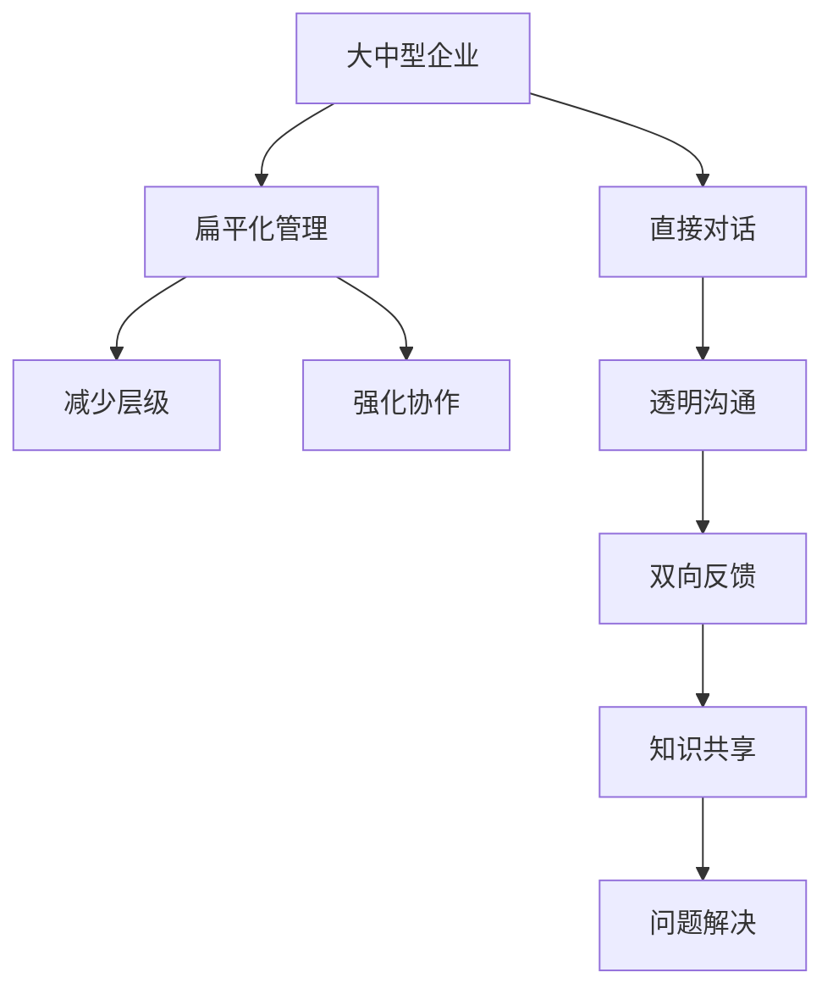

                 

# 扁平化管理:CEO与工程师的直接对话

## 1. 背景介绍

在传统企业组织中，CEO和工程师通常被视为两个截然不同的角色，CEO负责决策、规划和战略，而工程师专注于技术细节和项目执行。但随着技术快速发展和企业运营复杂化，扁平化管理（Flat Management）理念开始受到关注，它强调跨层级的直接沟通和协作，以提升组织效率和创新能力。本文将深入探讨扁平化管理在大中型企业中的应用，以及如何通过扁平化管理，促进CEO与工程师的直接对话。

## 2. 核心概念与联系

### 2.1 核心概念概述

- **扁平化管理**：指企业通过减少管理层级，强化跨层级的沟通和协作，提升决策速度和执行效率的管理方式。核心在于打破传统的层级壁垒，让信息流动更加自由。

- **直接对话**：指企业高层管理者与基层工程师之间的直接交流与反馈机制，旨在通过建立透明、双向的沟通渠道，促进组织内部的知识共享和问题解决。

### 2.2 概念间的关系

扁平化管理和直接对话是相辅相成的关系：扁平化管理为直接对话提供了必要的环境，而直接对话则增强了扁平化管理的实际效果。扁平化管理通过减少层级，提高了决策和执行的效率，但同时也对管理者的沟通能力和团队的协作能力提出了更高的要求。直接对话则通过建立跨层级的沟通机制，进一步促进了扁平化管理的目标，即通过透明、双向的沟通，打破信息孤岛，激发团队潜力。

### 2.3 核心概念的整体架构

以下是一个综合的流程图，展示了扁平化管理和直接对话在大中型企业中的应用：



这个流程图展示了扁平化管理和直接对话在企业中的应用，以及其带来的具体效果。

## 3. 核心算法原理 & 具体操作步骤

### 3.1 算法原理概述

扁平化管理的主要目标是通过减少管理层级，提升决策和执行效率。这一目标的实现依赖于组织结构的变化和沟通机制的优化。具体而言，扁平化管理通过以下几点实现其目标：

1. **减少层级**：简化组织结构，直接将信息传递给相关决策者，减少决策链路中的中间环节，提升决策速度。
2. **强化协作**：建立跨层级的协作机制，鼓励团队成员共同解决问题，提高执行效率。
3. **透明沟通**：通过开放的沟通渠道，使信息自由流动，促进团队的透明度和信任度。
4. **双向反馈**：建立反馈机制，鼓励工程师和高层管理者之间的双向反馈，及时调整决策和策略。

### 3.2 算法步骤详解

扁平化管理的具体操作步骤可以分为以下几个阶段：

1. **组织结构调整**：根据企业的规模和业务特点，调整组织结构，减少管理层级，形成扁平化的组织架构。

2. **沟通机制建立**：建立透明的沟通渠道，如定期会议、在线协作工具、内部论坛等，促进跨层级的信息流动。

3. **团队协作机制**：通过跨部门的团队协作，强化协作意识，打破部门之间的隔阂，形成协同作战的能力。

4. **直接对话机制**：建立CEO与工程师之间的直接对话机制，通过定期的面谈、会议等方式，促进双方的理解和信任。

### 3.3 算法优缺点

扁平化管理的优点在于：

1. **决策效率提升**：减少了决策链路中的层级，加快了决策速度。
2. **执行效率提高**：跨层级的协作机制减少了执行环节的复杂性，提高了执行效率。
3. **团队透明度增强**：透明的沟通机制提高了团队的透明度和信任度。
4. **双向反馈机制**：双向反馈机制有助于及时调整决策和策略，提高灵活性。

扁平化管理的缺点包括：

1. **管理难度增加**：高层管理者需要直接面对更多员工，管理难度增大。
2. **信息过载**：扁平化管理可能导致信息量过大，员工容易陷入信息过载的状态。
3. **协调难度**：跨层级的协作机制需要更高的协调能力，容易出现管理混乱。

### 3.4 算法应用领域

扁平化管理在多个领域都有广泛的应用，包括但不限于：

- **软件开发公司**：如谷歌、Facebook等，通过扁平化管理提升产品创新和市场响应速度。
- **制造企业**：如丰田、宝马等，通过扁平化管理优化生产流程，提升产品质量。
- **金融服务行业**：如摩根大通、高盛等，通过扁平化管理提高风险控制和市场响应能力。
- **教育机构**：如哈佛大学、斯坦福大学等，通过扁平化管理提升学术研究和技术创新能力。

## 4. 数学模型和公式 & 详细讲解 & 举例说明

### 4.1 数学模型构建

扁平化管理和直接对话的数学模型可以从以下几个方面进行构建：

- **信息传递模型**：通过网络模型描述信息在组织中的流动，如图论中的有向图模型，描述信息传递的路径和速度。
- **决策模型**：使用决策树模型描述不同层级和角色在决策过程中的作用和影响。
- **协作模型**：通过合作博弈模型描述团队协作的收益和成本，优化团队协作机制。

### 4.2 公式推导过程

以下是一个简化的决策树模型示例，用于描述扁平化管理中决策的传递过程：

$$
\begin{array}{ll}
  \text{节点} & \text{决策者} \\
  \text{A} & \text{CEO} \\
  \text{B} & \text{部门经理} \\
  \text{C} & \text{团队负责人} \\
  \text{D} & \text{执行层} \\
  \text{E} & \text{员工} \\
\end{array}
$$

假设A、B、C、D、E各节点的决策权重分别为$w_A, w_B, w_C, w_D, w_E$，则决策过程可以表示为：

$$
\text{总决策权重} = w_A + w_B + w_C + w_D + w_E
$$

每个节点的决策权重反映了其在决策中的重要性。在扁平化管理中，我们希望尽可能减少决策链路，即尽量减少从A到E的决策层级，以提高决策效率。

### 4.3 案例分析与讲解

以下是一个实际案例，展示如何在扁平化管理中实现CEO与工程师的直接对话：

**案例背景**：某科技公司计划推出一款新产品，需要跨部门协作完成设计、开发和市场推广。

**解决方案**：

1. **组织结构调整**：将传统的层级结构调整为扁平化的组织架构，去掉中层管理，直接由CEO和工程师团队进行沟通。

2. **沟通机制建立**：建立在线协作平台，定期举行跨部门的团队会议，分享项目进展和问题。

3. **团队协作机制**：组建跨部门的团队，明确各团队成员的职责和任务，打破部门之间的隔阂。

4. **直接对话机制**：CEO与工程师团队建立一对一的对话机制，定期面谈，听取工程师的建议和反馈。

**结果**：

- 决策效率提升：由于减少了决策链路，决策速度显著加快。
- 执行效率提高：跨部门协作机制减少了执行环节的复杂性，提高了执行效率。
- 团队透明度增强：透明的沟通机制提高了团队的透明度和信任度。
- 双向反馈机制：双向反馈机制有助于及时调整决策和策略，提高灵活性。

## 5. 项目实践：代码实例和详细解释说明

### 5.1 开发环境搭建

扁平化管理和大规模协作的实践涉及多个工具和平台，以下是一些推荐的开发环境：

1. **协作平台**：如Slack、Microsoft Teams、微信企业版等，用于跨部门沟通和协作。
2. **项目管理工具**：如JIRA、Trello、Asana等，用于任务分配和进度跟踪。
3. **在线会议工具**：如Zoom、Webex、Teams等，用于定期举行团队会议。
4. **代码托管平台**：如GitHub、Bitbucket等，用于版本控制和代码协作。

### 5.2 源代码详细实现

以下是一个简化的在线协作平台示例，用于描述如何实现扁平化管理和直接对话：

```python
# 导入必要的库
import time
from slack_sdk import WebClient

# 初始化Slack客户端
slack_token = 'YOUR_SLACK_API_TOKEN'
client = WebClient(token=slack_token)

# 定义函数，发送消息到指定频道
def send_to_channel(channel_id, message):
    response = client.chat_postMessage(channel=channel_id, text=message)
    if response['ok']:
        print('Message sent successfully')
    else:
        print('Failed to send message')

# 发送消息到指定频道
send_to_channel('general', 'New project update: We are on track to launch the product by Q3.')
```

### 5.3 代码解读与分析

上述代码示例展示了如何使用Slack客户端发送消息到指定频道。在实际项目中，还需要考虑如何收集和处理团队成员的反馈，以及如何根据反馈调整项目进度和策略。

### 5.4 运行结果展示

运行上述代码后，可以观察到消息已成功发送到指定频道。通过类似的机制，可以在不同部门之间实时沟通，促进扁平化管理和直接对话的实现。

## 6. 实际应用场景

### 6.1 软件开发公司

在软件开发公司中，扁平化管理有助于提升产品创新和市场响应速度。CEO和工程师之间的直接对话，可以确保产品的技术实现符合市场需求，同时促进团队成员之间的协作和知识共享。

### 6.2 制造企业

在制造企业中，扁平化管理有助于优化生产流程，提升产品质量。CEO和工程师之间的直接对话，可以确保生产线的技术改进和质量控制措施得到及时执行。

### 6.3 金融服务行业

在金融服务行业，扁平化管理有助于提高风险控制和市场响应能力。CEO和工程师之间的直接对话，可以确保风险评估和市场分析的准确性，同时促进金融产品的创新和优化。

### 6.4 未来应用展望

未来，扁平化管理和大规模协作将在更多领域得到应用，为组织带来新的发展机遇。随着技术的不断进步和组织结构的优化，扁平化管理将进一步提升组织效率和创新能力，促进企业的持续发展。

## 7. 工具和资源推荐

### 7.1 学习资源推荐

为了帮助开发者系统掌握扁平化管理和大规模协作的理论基础和实践技巧，以下是一些优质的学习资源：

1. **《扁平化管理：重新思考组织结构》**：一本关于扁平化管理的经典书籍，深入浅出地介绍了扁平化管理的基本原理和实践方法。
2. **《大规模协作：现代企业的协作之道》**：介绍如何通过在线协作工具和项目管理工具，实现跨部门的高效协作。
3. **《敏捷项目管理》**：介绍敏捷项目管理的方法和工具，帮助团队在扁平化管理中更好地完成任务。
4. **《团队协作的艺术》**：一本关于团队建设和沟通技巧的书籍，提供实用的协作建议。

### 7.2 开发工具推荐

以下是几款用于扁平化管理和协作开发的常用工具：

1. **Slack**：一款集成了即时通讯、文件共享、视频会议等功能的在线协作平台，适用于跨部门沟通和协作。
2. **JIRA**：一款项目管理工具，支持任务分配、进度跟踪和团队协作，适合扁平化管理中的任务管理和进度控制。
3. **GitHub**：一款代码托管平台，支持版本控制和代码协作，适合扁平化管理中的软件开发和版本管理。
4. **Trello**：一款基于看板的项目管理工具，支持任务分配和进度跟踪，适合扁平化管理中的任务管理和团队协作。

### 7.3 相关论文推荐

扁平化管理和直接对话的研究涉及多个领域，以下是几篇奠基性的相关论文，推荐阅读：

1. **《扁平化管理：提升组织效率的策略》**：研究扁平化管理对组织效率的影响，提出相应的管理策略。
2. **《大规模协作：一种新的组织模式》**：研究大规模协作在现代企业中的应用，探讨如何通过协作工具和技术实现高效的团队协作。
3. **《扁平化管理中的沟通机制设计》**：研究扁平化管理中跨层级的沟通机制，提出透明沟通和双向反馈的实现方法。
4. **《扁平化管理与敏捷项目的结合》**：研究扁平化管理在敏捷项目中的应用，探讨如何通过敏捷方法和工具提升项目效率。

## 8. 总结：未来发展趋势与挑战

### 8.1 研究成果总结

扁平化管理和直接对话的研究已经取得了许多重要成果，主要体现在以下几个方面：

1. **组织效率提升**：扁平化管理通过减少层级和强化协作，提升了决策和执行效率，使得企业能够更快地响应市场变化。
2. **团队协作优化**：扁平化管理通过跨部门协作机制，促进了知识的共享和团队成员之间的互动，提高了团队的整体绩效。
3. **直接对话机制的建立**：扁平化管理中CEO与工程师之间的直接对话，促进了双方的理解和信任，提高了决策的准确性和执行的灵活性。

### 8.2 未来发展趋势

展望未来，扁平化管理和直接对话将呈现以下几个发展趋势：

1. **技术工具的升级**：随着新技术的不断涌现，扁平化管理和直接对话将借助更多的数字化工具，实现更高效率和更广泛的应用。
2. **跨文化协作的推进**：在全球化背景下，扁平化管理和直接对话将突破地域和文化的限制，实现更广泛的跨国协作。
3. **自组织能力的培养**：扁平化管理将培养更多的自组织能力，使得团队成员能够主动解决问题和推动项目进展。
4. **灵活的组织结构**：扁平化管理将支持更加灵活的组织结构，适应快速变化的市场环境。

### 8.3 面临的挑战

尽管扁平化管理和直接对话取得了显著成效，但仍面临以下挑战：

1. **管理难度增加**：高层管理者需要直接面对更多员工，管理难度增大。
2. **信息过载**：扁平化管理可能导致信息量过大，员工容易陷入信息过载的状态。
3. **协调难度**：跨层级的协作机制需要更高的协调能力，容易出现管理混乱。
4. **文化差异**：不同文化背景下的员工可能需要更多的沟通和理解，以便在扁平化管理中有效协作。

### 8.4 研究展望

未来研究需要在以下几个方面寻求新的突破：

1. **多文化协作的研究**：研究如何在不同文化背景下的企业中实现扁平化管理和直接对话，促进跨国协作。
2. **自组织能力的培养**：研究如何通过培训和激励机制，培养更多的自组织能力，提高团队的主动性和创造性。
3. **技术工具的创新**：研究如何通过创新的技术工具，提升扁平化管理和直接对话的效率和效果。
4. **组织文化的建设**：研究如何通过组织文化的建设，形成共同的价值观和行为准则，支持扁平化管理和直接对话的实现。

总之，扁平化管理和直接对话的实践需要综合考虑多个因素，包括组织结构、沟通机制、技术工具和文化建设等。只有在这些方面取得平衡，才能真正实现扁平化管理和大规模协作的目标。

## 9. 附录：常见问题与解答

**Q1：扁平化管理是否适用于所有企业？**

A: 扁平化管理适用于规模较大、组织结构复杂的企业，但在小型企业中，层级相对简单，扁平化管理的优势并不明显。

**Q2：扁平化管理是否会影响决策的权威性？**

A: 扁平化管理虽然减少了决策链路，但并不意味着削弱决策权威性。扁平化管理中的直接对话机制，有助于提升决策的科学性和准确性，通过跨部门协作，集中团队的智慧和经验，制定更加合理的决策。

**Q3：扁平化管理是否会导致员工管理困难？**

A: 扁平化管理确实增加了高层管理者的工作量，但通过有效的培训和激励机制，可以提升员工的主动性和创造性，减少管理难度。

**Q4：扁平化管理是否适合所有类型的企业？**

A: 扁平化管理适合那些需要快速响应市场变化和创新驱动的企业，而对于传统行业或稳定运营的企业，扁平化管理可能并不适合。

**Q5：扁平化管理与传统管理有什么区别？**

A: 扁平化管理通过减少层级和强化协作，提升了决策和执行效率，但也需要更高的管理能力和沟通能力。传统管理通过明确的层级和职责分工，保障了决策的权威性和执行的严谨性。

本文通过系统梳理扁平化管理和直接对话的理论基础和实践方法，希望能为企业提供有益的参考和指导，帮助其在数字化转型中取得更好的成效。

---

作者：禅与计算机程序设计艺术 / Zen and the Art of Computer Programming

