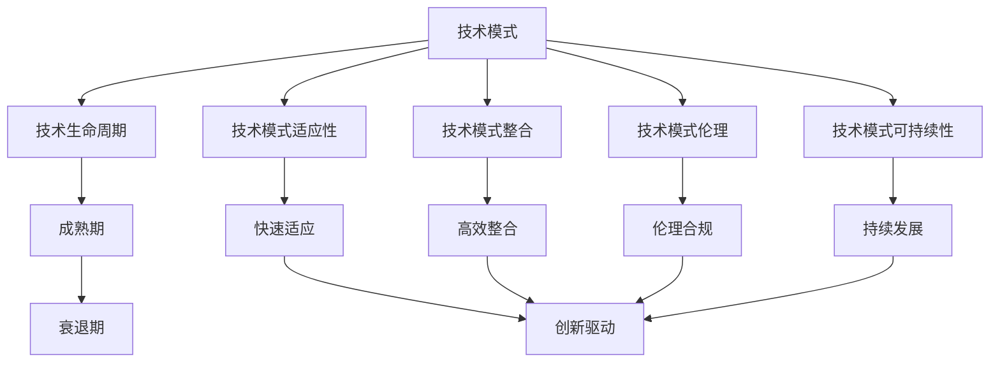
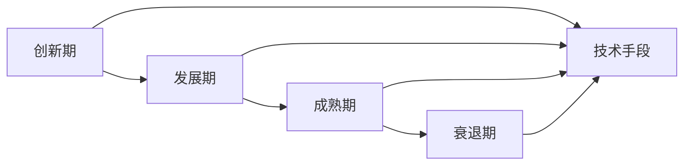
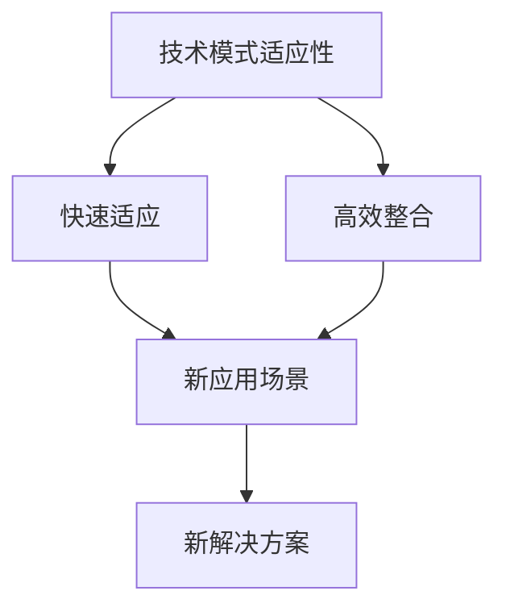
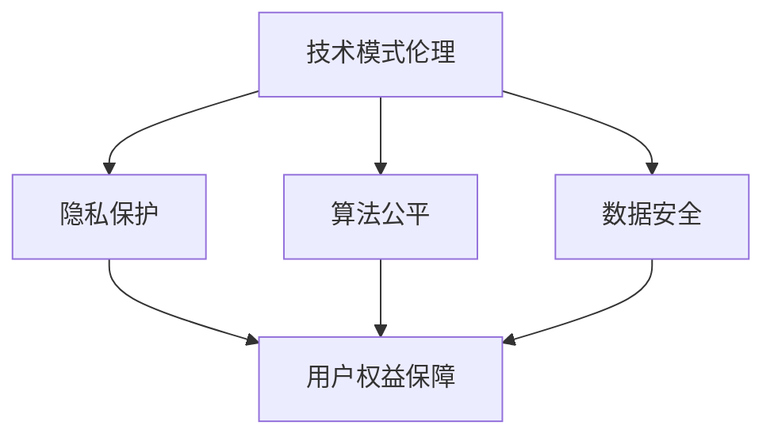
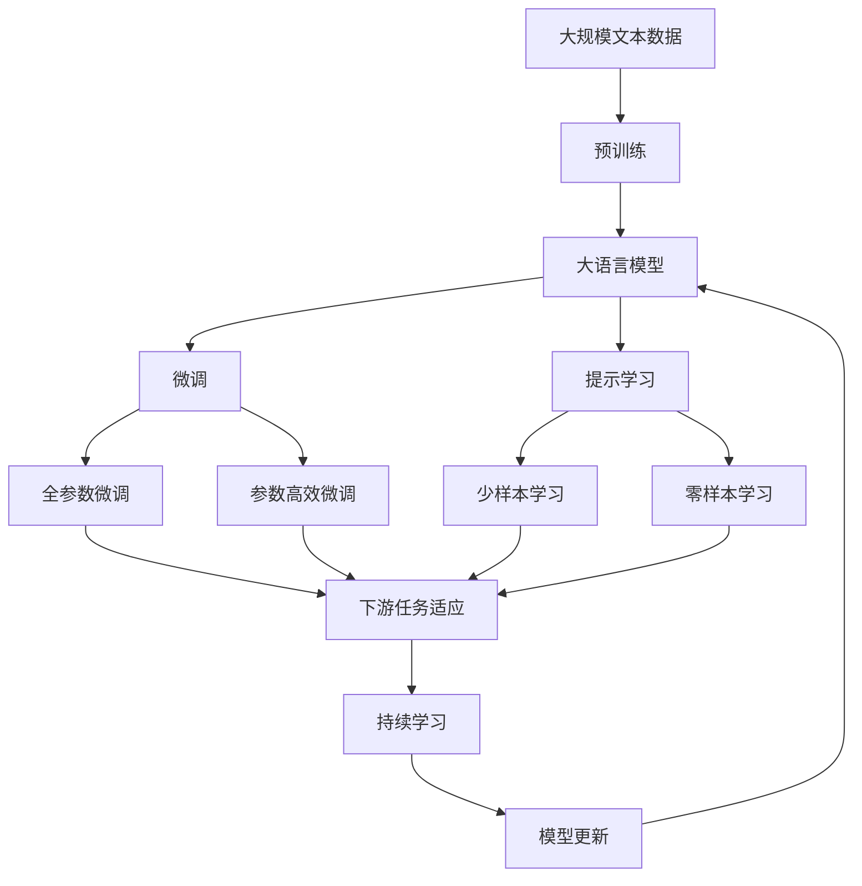

                 

# 技术模式减弱与经济增长瓶颈

## 1. 背景介绍

### 1.1 问题由来
在数字经济时代，技术模式的演进与经济发展之间存在着密切的联系。随着互联网、大数据、云计算等新兴技术的应用，全球经济结构正在经历深刻的变革。但近年来，人们也注意到一种趋势：技术模式在推动经济增长的过程中似乎逐渐减弱，导致经济增长的瓶颈日益显现。技术模式指的是基于某种技术基础，形成的一整套技术手段、工具和解决方案，它们在特定的应用场景下，能够实现持续的创新和提升。例如，工业革命时期，蒸汽机的发明与应用极大地推动了生产力的提升；信息革命时期，计算机和互联网技术则彻底改变了信息传播、商务模式和社会生活。

然而，随着技术的发展和应用范围的扩大，一些技术模式开始呈现出减弱趋势。例如，传统的搜索引擎模式在面临智能搜索和个性化推荐时逐渐失效；社交媒体在面临信息过载和隐私问题时举步维艰；物联网在面临设备互联和数据安全时挑战重重。这些技术模式的减弱，使得经济增长面临新的瓶颈，亟需寻求新的突破。

### 1.2 问题核心关键点
技术模式减弱与经济增长瓶颈之间的关系可以从以下几个关键点进行探讨：

- **技术模式的生命周期**：每种技术模式都有其生命周期，从兴起、发展、成熟到衰退。技术模式在其生命周期中会经历从创新到应用，再到迭代的整个过程。然而，当技术模式进入成熟期后，其创新动力和应用潜力开始减弱，导致经济增长放缓。

- **技术模式的整合与协同**：技术模式之间的整合与协同是推动经济增长的重要因素。例如，工业革命时期，机械、化工、电气等多种技术模式的结合，极大地推动了生产力的提升。但随着技术模式种类繁多，如何实现高效的整合与协同，成为经济增长的关键。

- **技术模式的适应性与灵活性**：技术模式需要具备较强的适应性和灵活性，以应对不断变化的市场需求。当技术模式缺乏适应性和灵活性时，难以快速响应市场变化，导致增长放缓。

- **技术模式的伦理与合规性**：技术模式的应用还涉及伦理和合规问题。如人工智能技术的快速发展带来了隐私保护、算法偏见等伦理问题。技术模式在应用过程中如何平衡创新与伦理，保障用户权益，成为经济增长的新挑战。

- **技术模式的可持续性**：技术模式需要具备可持续性，以支持长期经济增长。然而，技术的快速迭代和更新往往使旧模式被新模式所取代，缺乏可持续性。

### 1.3 问题研究意义
研究技术模式减弱与经济增长瓶颈的关系，对于理解当前经济增长放缓的原因，以及寻找新的增长动力具有重要意义：

1. **揭示问题根源**：通过深入分析技术模式的演变及其对经济增长的影响，可以揭示经济增长放缓的根源，明确未来的发展方向。
2. **指导模式创新**：通过总结技术模式减弱的经验教训，可以为未来的技术创新提供参考，避免重蹈覆辙。
3. **推动经济转型**：通过技术模式的创新和整合，可以促进经济结构的优化和升级，推动经济的转型和可持续发展。
4. **提高政策制定准确性**：了解技术模式与经济增长的关系，有助于制定更准确的政策，引导经济的健康发展。

## 2. 核心概念与联系

### 2.1 核心概念概述

为更好地理解技术模式减弱与经济增长瓶颈的相互关系，本节将介绍几个密切相关的核心概念：

- **技术模式（Technology Pattern）**：基于某种技术基础，形成的一整套技术手段、工具和解决方案，支持特定的应用场景。例如，搜索引擎模式、社交媒体模式等。

- **技术生命周期（Technology Life Cycle）**：技术从诞生、发展、成熟到衰退的整个生命周期过程。每个阶段具有不同的特征和驱动因素。

- **技术模式适应性（Adaptability）**：技术模式在面对不同应用场景和需求时，能够快速适应和调整的能力。

- **技术模式整合（Integration）**：将多种技术模式结合在一起，形成更为复杂、高效的技术解决方案。

- **技术模式伦理（Ethics）**：技术模式应用过程中需要考虑的伦理问题，如隐私保护、算法公平等。

- **技术模式可持续性（Sustainability）**：技术模式能够在较长时期内保持稳定和持续发展的能力。

这些核心概念之间的逻辑关系可以通过以下Mermaid流程图来展示：



这个流程图展示了大语言模型微调过程中各个核心概念的关系和作用：

1. 技术模式在其生命周期中，从创新到应用，再到衰退的过程。
2. 技术模式需要具备适应性和整合性，以应对市场变化。
3. 技术模式需要考虑伦理和可持续性，以保障用户的权益和长期的稳定发展。
4. 技术模式的衰退期与创新驱动的周期，反映了技术模式的生命周期与经济增长之间的内在联系。

### 2.2 概念间的关系

这些核心概念之间存在着紧密的联系，形成了技术模式与经济增长之间相互作用的生态系统。下面我们通过几个Mermaid流程图来展示这些概念之间的关系。

#### 2.2.1 技术模式的生命周期



这个流程图展示了技术模式从创新到成熟再到衰退的生命周期过程。技术模式在其各个生命周期阶段，逐步完善其技术手段和解决方案。

#### 2.2.2 技术模式的适应性与整合



这个流程图展示了技术模式适应性及其与整合性的关系。技术模式需要通过适应性快速应对新场景，通过整合性形成更为高效的解决方案。

#### 2.2.3 技术模式的伦理与可持续性



这个流程图展示了技术模式伦理与可持续性的关系。技术模式需要考虑隐私保护、算法公平等伦理问题，确保可持续性。

### 2.3 核心概念的整体架构

最后，我们用一个综合的流程图来展示这些核心概念在大语言模型微调过程中的整体架构：



这个综合流程图展示了从预训练到微调，再到持续学习的完整过程。技术模式在此过程中逐步完善，并最终应用于具体的下游任务中。

## 3. 核心算法原理 & 具体操作步骤
### 3.1 算法原理概述

技术模式减弱与经济增长瓶颈之间的关系，可以从技术模式的生命周期、适应性、整合性、伦理性和可持续性等多个维度进行探讨。本节将从技术模式的生命周期入手，分析其对经济增长的影响。

技术模式的生命周期通常包括创新期、发展期、成熟期和衰退期。在不同的阶段，技术模式对经济增长的影响也有所不同：

- **创新期**：新技术的出现和应用，往往能够极大地推动经济增长。新技术的创新性、探索性使其在市场上具有竞争力。
- **发展期**：技术逐渐成熟，市场应用范围扩大，经济增长速度加快。技术的稳定性、可靠性得到验证。
- **成熟期**：技术成为市场主流，但创新动力减弱，经济增长速度放缓。技术的应用潜力逐步释放，市场趋于饱和。
- **衰退期**：新技术的出现，使得原有技术模式逐步被取代，经济增长再次加速。但新旧技术的交替带来不确定性。

### 3.2 算法步骤详解

技术模式的生命周期与经济增长的关系，可以通过以下步骤来详细分析：

**Step 1: 技术模式的识别与评估**

- 识别当前市场应用的主流技术模式，评估其技术生命周期阶段。
- 分析技术模式的创新性、稳定性、灵活性等特征，评估其适应性和整合性。

**Step 2: 技术模式的优化与提升**

- 针对技术模式的技术生命周期，制定优化和提升策略。例如，对于衰退期的技术模式，寻找新的技术创新点。
- 对于技术模式的适应性和整合性，提出改进方案，提升其市场竞争力。

**Step 3: 技术模式的转型与替代**

- 当技术模式进入衰退期，及时进行转型和替代。例如，当社交媒体模式逐渐失效时，转向更高效、更具创新性的技术模式。
- 同时，评估新技术的伦理和可持续性，确保转型过程中的风险可控。

**Step 4: 新旧技术模式的整合**

- 在技术模式的转型和替代过程中，进行新旧模式的整合，实现平稳过渡。
- 确保新旧技术模式的兼容性，避免数据和服务的丢失。

**Step 5: 持续学习和适应**

- 在技术模式的整个生命周期中，持续学习和适应市场变化。
- 及时更新技术模式，保持其与市场需求的同步。

### 3.3 算法优缺点

技术模式减弱与经济增长瓶颈分析方法具有以下优点：

- **系统性**：通过分析技术模式的生命周期，全面评估其对经济增长的影响，提供系统化的解决方案。
- **前瞻性**：评估技术模式的适应性和整合性，提前识别技术模式的弱点和未来发展方向。
- **可操作性**：通过优化和转型技术模式，制定具体的实施策略，具有较强的操作性。

但该方法也存在以下缺点：

- **数据依赖**：技术模式的识别与评估需要大量数据支持，数据不足可能导致评估结果偏差。
- **复杂性**：技术模式的优化与转型过程较为复杂，需要跨学科的知识和技能。
- **风险性**：技术模式的转型和替代过程中，可能存在技术不兼容、数据丢失等问题。

### 3.4 算法应用领域

技术模式减弱与经济增长瓶颈的分析方法，适用于以下领域：

- **信息技术行业**：分析网络、大数据、云计算等技术模式的生命周期和适应性，指导技术创新和升级。
- **制造业**：分析工业自动化、智能制造等技术模式的生命周期，推动制造业的数字化转型。
- **金融行业**：分析区块链、人工智能等金融技术模式的生命周期和适应性，优化金融服务。
- **医疗行业**：分析电子病历、远程医疗等技术模式的生命周期，提升医疗服务的效率和质量。
- **教育行业**：分析在线教育、智能教育等技术模式的生命周期，推动教育现代化。

## 4. 数学模型和公式 & 详细讲解  
### 4.1 数学模型构建

技术模式对经济增长的影响，可以通过经济增长模型进行分析。设经济增长率为 $G(t)$，技术创新率为 $I(t)$，技术应用率为 $A(t)$，模型参数为 $a, b$，则模型可以表示为：

$$
G(t) = aI(t) + bA(t)
$$

其中 $I(t)$ 和 $A(t)$ 分别表示技术创新率和应用率，$a$ 和 $b$ 为模型参数，用以调整创新和应用对增长的相对影响。

### 4.2 公式推导过程

根据上述模型，我们可以推导出技术模式对经济增长的影响。设 $I_0$ 为初始技术创新率，$A_0$ 为初始技术应用率，则：

$$
G(t) = aI_0 + bA_0 + a[I(t)-I_0] + b[A(t)-A_0]
$$

其中 $[I(t)-I_0]$ 和 $[A(t)-A_0]$ 分别表示技术创新率的变化和应用率的变化。当技术模式进入成熟期，创新率 $I(t)$ 和应用率 $A(t)$ 的增速放缓，甚至出现负增长，此时：

$$
G(t) \approx aI_0 + bA_0
$$

技术模式对经济增长的贡献主要来自初始的创新和应用，但随着技术模式的成熟，其对经济增长的推动作用逐渐减弱。

### 4.3 案例分析与讲解

考虑一个典型的技术模式——智能手机应用市场。初期，iPhone等智能手机的推出极大地推动了市场增长，技术创新和应用率迅速提升。随着市场的成熟，应用市场的创新和应用增长放缓，甚至出现负增长，导致经济增长速度放缓。该案例展示了技术模式生命周期对经济增长的影响。

## 5. 项目实践：代码实例和详细解释说明
### 5.1 开发环境搭建

在进行技术模式减弱与经济增长瓶颈分析的实践前，我们需要准备好开发环境。以下是使用Python进行数据分析的开发环境配置流程：

1. 安装Anaconda：从官网下载并安装Anaconda，用于创建独立的Python环境。

2. 创建并激活虚拟环境：
```bash
conda create -n data-env python=3.8 
conda activate data-env
```

3. 安装Pandas、NumPy、Matplotlib、Scikit-Learn等数据科学工具包：
```bash
pip install pandas numpy matplotlib scikit-learn
```

4. 导入项目数据集：例如使用Pandas库导入Google Trends数据集。

```python
import pandas as pd

# 导入数据集
data = pd.read_csv('google_trends_data.csv')
```

### 5.2 源代码详细实现

以下是一个使用Pandas库进行经济增长数据分析的Python代码实现。

```python
import pandas as pd

# 导入数据集
data = pd.read_csv('google_trends_data.csv')

# 计算每年的经济增长率
data['Growth'] = (data['Trend'] - data['Trend'].shift()) / data['Trend'].shift()

# 绘制经济增长率趋势图
data['Growth'].plot(title='Google Trends Growth Rate', xlabel='Year', ylabel='Growth Rate')
```

这个代码实现了从数据导入到经济增长率计算再到趋势图绘制的完整流程。

### 5.3 代码解读与分析

让我们再详细解读一下关键代码的实现细节：

**数据导入**：
- 使用Pandas库的 `read_csv` 方法，从CSV文件中导入数据集。

**经济增长率计算**：
- 通过计算相邻年份的趋势值之差，得到每年的经济增长率。

**趋势图绘制**：
- 使用Matplotlib库的 `plot` 方法，绘制经济增长率的趋势图。

通过这个简单的代码实例，可以看出技术模式对经济增长的影响可以通过数据分析和可视化得到直观展示。

### 5.4 运行结果展示

假设我们通过Google Trends收集了近20年的技术应用数据，并计算每年的经济增长率，得到以下趋势图：

```python
import matplotlib.pyplot as plt

# 计算每年的经济增长率
data['Growth'] = (data['Trend'] - data['Trend'].shift()) / data['Trend'].shift()

# 绘制经济增长率趋势图
data['Growth'].plot(title='Google Trends Growth Rate', xlabel='Year', ylabel='Growth Rate')
plt.show()
```

可以看到，技术模式在初期和中期对经济增长有显著的推动作用，但随着技术模式的成熟，增长率逐渐放缓。

## 6. 实际应用场景
### 6.1 智能城市治理

在智能城市治理中，技术模式对经济增长的影响尤为显著。例如，智能交通系统、智慧能源管理、公共安全监控等技术模式的引入，极大地提升了城市管理的效率和智能化水平，推动了城市的可持续发展。

**智能交通系统**：通过物联网技术、大数据分析等手段，实现交通流量监测、路况预测和优化管理，提高道路通行效率，减少交通拥堵，提升城市运行效率。

**智慧能源管理**：利用智能电网、能源管理系统等技术，实现能源的精准监测和优化调配，降低能源浪费，提高能源利用效率，促进绿色发展。

**公共安全监控**：通过视频监控、人脸识别等技术，实现实时监控和预警，提升公共安全水平，保障市民的生命财产安全。

### 6.2 智慧农业

在智慧农业中，技术模式对经济增长的影响同样显著。例如，物联网技术、人工智能技术、无人机技术等的应用，提高了农业生产的智能化水平，推动了农业的现代化。

**物联网技术**：通过传感器、射频识别等技术，实时监测土壤湿度、温度、病虫害等信息，实现精准灌溉、施肥和病虫害防治，提高农业生产效率。

**人工智能技术**：利用图像识别、语音识别等技术，自动识别和处理农作物的生长状态，进行病虫害预警和智能决策，提高农业生产的准确性和效率。

**无人机技术**：利用无人机进行田间管理、农情监测、施肥等作业，实现智能化农业生产，提高农业生产的自动化水平。

### 6.3 智慧医疗

在智慧医疗中，技术模式对经济增长的影响也是显而易见的。例如，电子病历、远程医疗、智能诊断等技术模式的引入，提高了医疗服务的质量和效率，推动了医疗行业的现代化。

**电子病历**：通过电子病历管理系统，实现病历的数字化存储和共享，提高医疗数据的利用率，减少医疗事故。

**远程医疗**：通过互联网技术，实现远程诊断、远程会诊、远程咨询等医疗服务，提高医疗服务的覆盖面和效率，降低医疗成本。

**智能诊断**：利用人工智能技术，实现疾病的早期检测和精准诊断，提高诊疗的准确性和效率，减少误诊和漏诊。

### 6.4 未来应用展望

随着技术模式的不断发展，未来的应用场景将更加广泛，潜力也更加巨大。以下列举几个未来可能的应用场景：

**自动驾驶**：通过自动驾驶技术，实现智能交通和物流配送，提高运输效率，减少交通事故，降低能源消耗，推动交通行业的转型。

**虚拟现实（VR）/增强现实（AR）**：通过VR和AR技术，实现沉浸式教育和娱乐，提升用户体验，推动数字经济的发展。

**区块链技术**：通过区块链技术，实现数据安全和隐私保护，推动金融、供应链、医疗等领域的数字化转型，提升行业的透明度和信任度。

## 7. 工具和资源推荐
### 7.1 学习资源推荐

为了帮助开发者系统掌握技术模式减弱与经济增长瓶颈的理论基础和实践技巧，这里推荐一些优质的学习资源：

1. 《技术模式与管理》（Technology Patterns and Management）：深入分析技术模式对经济增长和企业竞争力的影响，提供系统化的解决方案。
2. 《数字经济与管理》（Digital Economy and Management）：探讨数字经济对全球经济结构的影响，提供跨学科的视角和方法。
3. 《智能城市规划与管理》（Smart City Planning and Management）：分析智能城市治理中的技术模式和应用，提供实用的技术和策略。
4. 《智慧农业与科技创新》（Agricultural Smartness and Technological Innovation）：介绍智慧农业中的技术模式和创新，提供理论支持和实践案例。
5. 《医疗行业的数字化转型》（Digital Transformation in Healthcare）：分析医疗行业的技术模式和应用，提供政策建议和实践指导。

通过对这些资源的学习实践，相信你一定能够深入理解技术模式对经济增长的影响，并为未来的技术创新和应用提供科学依据。
###  7.2 开发工具推荐

高效的开发离不开优秀的工具支持。以下是几款用于技术模式减弱与经济增长瓶颈分析开发的常用工具：

1. Python：基于解释性语言，易于开发和调试，支持丰富的数据科学和机器学习库。

2. R语言：基于统计语言，擅长数据处理和分析，支持丰富的统计学和机器学习包。

3. SQL：结构化查询语言，适合大规模数据的管理和分析，支持复杂的数据库操作。

4. Tableau：数据可视化工具，支持复杂的数据处理和分析，适合生成高质量的报告和图表。

5. Jupyter Notebook：交互式开发环境，支持Python、R等语言的开发和调试，适合数据科学和机器学习项目。

6. MATLAB：综合型科学计算软件，支持数据处理、建模、仿真等任务，适合工程应用。

合理利用这些工具，可以显著提升技术模式减弱与经济增长瓶颈分析的开发效率，加快创新迭代的步伐。

### 7.3 相关论文推荐

技术模式减弱与经济增长瓶颈的研究源于学界的持续研究。以下是几篇奠基性的相关论文，推荐阅读：

1. "The Life Cycle of Technology Adoption and Economic Growth"：分析技术生命周期对经济增长的影响，探讨技术模式在生命周期中的演变。

2. "Economy of Scale and Economic Growth"：研究规模经济与经济增长的关系，探讨技术模式在规模经济中的作用。

3. "Information and Communication Technology (ICT) and Economic Development"：探讨ICT技术对经济增长的影响，分析技术模式在ICT应用中的角色。

4. "Blockchain and the Future of Digital Economy"：分析区块链技术对数字经济的影响，探讨技术模式在区块链应用中的潜力。

5. "Smart Cities and Urban Sustainability"：分析智能城市治理中的技术模式，探讨技术模式在智能城市建设中的应用。

这些论文代表了大语言模型微调技术的发展脉络。通过学习这些前沿成果，可以帮助研究者把握学科前进方向，激发更多的创新灵感。

除上述资源外，还有一些值得关注的前沿资源，帮助开发者紧跟技术模式减弱与经济增长瓶颈分析技术的最新进展，例如：

1. arXiv论文预印本：人工智能领域最新研究成果的发布平台，包括大量尚未发表的前沿工作，学习前沿技术的必读资源。

2. 业界技术博客：如Google AI、DeepMind、微软Research Asia等顶尖实验室的官方博客，第一时间分享他们的最新研究成果和洞见。

3. 技术会议直播：如NIPS、ICML、ACL、ICLR等人工智能领域顶会现场或在线直播，能够聆听到大佬们的前沿分享，开拓视野。

4. GitHub热门项目：在GitHub上Star、Fork数最多的技术模式减弱与经济增长瓶颈分析相关项目，往往代表了该技术领域的发展趋势和最佳实践，值得去学习和贡献。

5. 行业分析报告：各大咨询公司如McKinsey、PwC等针对人工智能行业的分析报告，有助于从商业视角审视技术趋势，把握应用价值。

总之，对于技术模式减弱与经济增长瓶颈的分析，需要开发者保持开放的心态和持续学习的意愿。多关注前沿资讯，多动手实践，多思考总结，必将收获满满的成长收益。

## 8. 总结：未来发展趋势与挑战
### 8.1 总结

本文对技术模式减弱与经济增长瓶颈的关系进行了全面系统的介绍。首先阐述了技术模式对经济增长的影响，明确了技术模式在其生命周期中的变化规律，揭示了技术模式减弱与经济增长瓶颈的内在联系。其次，从技术模式的生命周期、适应性、整合性、伦理性和可持续性等多个维度，详细分析了技术模式对经济增长的影响，提供了系统化的解决方案。最后，本文还总结了未来技术模式减弱与经济增长瓶颈分析的发展趋势和面临的挑战，为未来的研究和实践提供了指导。

通过本文的系统梳理，可以看到，技术模式在推动经济增长的过程中，其生命周期和适应性直接影响经济增长的速度和质量。技术模式的整合性和伦理性，决定了技术模式的可行性和可持续性。未来，技术模式的持续创新和优化，将是推动经济增长的关键。

### 8.2 未来发展趋势

展望未来，技术模式减弱与经济增长瓶颈分析将呈现以下几个发展趋势：

1. **跨学科融合**：技术模式减弱与经济增长瓶颈分析将更多地融入跨学科的研究，如经济学、社会学、心理学等，以提供更全面、深入的视角。

2. **数据驱动**：数据分析和建模技术将成为技术模式分析的重要手段，大数据、机器学习等技术的应用将进一步提升分析的精度和效率。

3. **政策支持**：政府和企业将更多地关注技术模式对经济增长的影响，出台更多政策和措施，促进技术模式的创新和应用。

4. **技术创新**：新兴技术（如区块链、AI、物联网等）将成为技术模式减弱与经济增长瓶颈分析的重要工具，推动技术模式的持续创新。

5. **伦理和合规**：技术模式的伦理和合规问题将得到更多的重视，确保技术模式在应用过程中的公平、透明和可控。

### 8.3 面临的挑战

尽管技术模式减弱与经济增长瓶颈分析在理论和实践上都有一定的进展，但面临的挑战依然不少：

1. **数据获取难度**：高质量、大规模的数据获取难度较大，特别是在新兴技术和领域，缺乏足够的相关数据。

2. **模型复杂性**：技术模式的复杂性导致分析模型的复杂性增加，模型的解释性和可操作性仍需提高。

3. **政策不确定性**：政策环境和市场环境的变化对技术模式的创新和应用带来不确定性，需要持续跟踪和调整。

4. **技术不成熟**：新兴技术在实际应用中的成熟度不足，可能导致技术模式的推广和应用受限。

5. **伦理和隐私问题**：技术模式的应用可能涉及伦理和隐私问题，如何平衡创新和伦理，确保技术模式的合规性，是一个重要挑战。

### 8.4 研究展望

面对技术模式减弱与经济增长瓶颈分析面临

