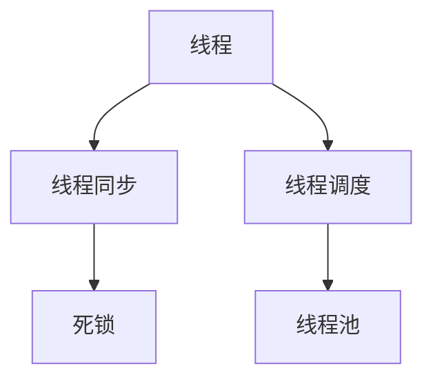
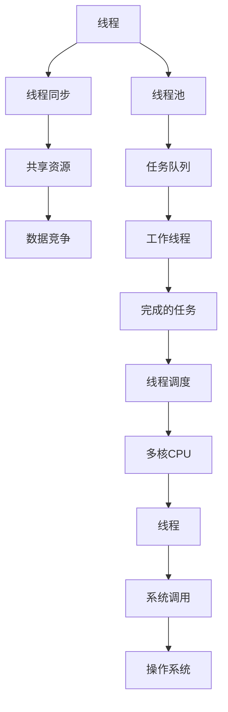

                 

# 提高系统吞吐量的线程管理

## 1. 背景介绍

在现代多核CPU和并行计算系统的推动下，多线程编程已经成为提高应用系统性能的重要手段。合理地管理线程，可以充分利用多核CPU的优势，提升系统吞吐量和响应速度。然而，线程管理也面临着复杂性增加、同步开销增大、资源争用等问题。本文将深入探讨多线程编程中常见的线程管理策略，提供一套全面且系统的线程管理方案。

## 2. 核心概念与联系

### 2.1 核心概念概述

为更好地理解线程管理，本节将介绍几个密切相关的核心概念：

- **线程(Threads)**：计算机操作系统中最基本的执行单元。一个线程由程序计数器、栈、寄存器等组成，是程序执行的最小单位。

- **线程同步(Synchronization)**：多线程并发访问共享资源时，为避免数据竞争、死锁等问题，需要通过锁、信号量等机制实现线程间的同步。

- **线程调度(Scheduling)**：操作系统根据一定的策略将CPU时间片分配给不同的线程，以保证系统公平性和性能。

- **线程池(Threads Pool)**：预先创建一组线程，并将任务分配给线程池中的空闲线程执行，以提高系统吞吐量和资源利用率。

- **死锁(Deadlock)**：由于多个线程互相等待对方释放资源，导致所有线程都无法继续执行的状态。死锁是线程管理中的常见问题。

这些核心概念之间存在着紧密的联系，共同构成了多线程编程的基础框架。下面通过一个Mermaid流程图来展示它们之间的关系：



这个流程图展示了线程管理的基本要素：

- 线程是程序的基本执行单元。
- 线程同步保证多线程并发访问共享资源时的正确性。
- 线程调度决定不同线程的执行顺序。
- 线程池提高系统资源利用率。
- 死锁是线程管理中的一个常见问题。

### 2.2 概念间的关系

这些核心概念之间存在以下关系：

- 线程是程序的最小执行单元，需要与其他线程协作，共享系统资源。
- 线程同步是避免多线程并发访问共享资源时出现的问题，如数据竞争、死锁等。
- 线程调度决定线程的执行顺序，以最大化CPU的利用率。
- 线程池通过预先创建和复用线程，减少线程创建和销毁的开销，提高系统吞吐量。
- 死锁是多线程并发访问共享资源时，由于资源互斥和等待所导致的一种复杂情况。

### 2.3 核心概念的整体架构

最后，我们用一个综合的流程图来展示这些核心概念在大规模系统中的应用：



这个综合流程图展示了线程管理在多核系统中的完整应用流程：

- 线程由程序创建并执行。
- 线程通过同步机制访问共享资源。
- 共享资源的访问可能发生数据竞争问题。
- 线程池预先创建线程，复用线程资源。
- 任务队列将任务分配给线程池中的工作线程。
- 工作线程执行任务。
- 线程调度决定线程的执行顺序。
- 线程最终调度和执行于多核CPU。
- 线程通过系统调用请求操作系统服务。

通过这些流程图，我们可以更清晰地理解线程管理的基本要素及其应用场景。

## 3. 核心算法原理 & 具体操作步骤

### 3.1 算法原理概述

线程管理的核心目标是最大化系统资源的利用率，同时确保多线程程序的正确性和高效性。其核心思想是通过合理地设计线程数量、分配任务、实现同步，以及处理死锁等策略，使系统在多核CPU环境下高效运行。

为具体阐述这一核心思想，本文将从线程数量管理、任务分配、线程同步和死锁处理四个方面展开讨论。

### 3.2 算法步骤详解

#### 3.2.1 线程数量管理

线程数量管理是线程管理的重要组成部分。过多或过少的线程都会影响系统性能。以下算法步骤详解如何确定和调整线程数量：

1. **需求分析**：根据应用需求和系统资源，确定所需的线程数量。对于CPU密集型任务，一般需要较多的线程；对于I/O密集型任务，线程数量通常较少。

2. **动态调整**：根据系统负载和响应时间，动态调整线程数量。可以使用系统监控工具（如JConsole、top等）实时监控系统状态，根据负载情况自动调整线程池大小。

3. **资源限制**：设置线程数量上限，防止因线程过多导致的资源争用和系统不稳定。

#### 3.2.2 任务分配

任务分配是将工作负载分配给不同线程的过程。合理分配任务可以提升系统吞吐量。以下算法步骤详解如何实现高效的任务分配：

1. **任务划分**：将任务划分为更小的子任务，便于线程并发执行。

2. **任务队列**：使用任务队列（如FIFO、LIFO、优先队列等）管理任务，确保任务分配的公平性和合理性。

3. **负载均衡**：采用负载均衡算法（如轮询、随机、最少连接数等）将任务均匀分配到各个线程。

#### 3.2.3 线程同步

线程同步是线程管理中关键的一环。合理的同步策略可以避免线程间的竞争和死锁。以下算法步骤详解如何实现线程同步：

1. **锁机制**：使用互斥锁、读写锁、条件变量等同步机制，避免线程间的竞争和数据不一致。

2. **原子操作**：使用原子操作（如CAS、compare-and-swap等）保证数据操作的原子性，减少锁的开销。

3. **非阻塞算法**：使用无锁算法（如CAS、ABA等），减少锁竞争和上下文切换的开销。

#### 3.2.4 死锁处理

死锁是多线程编程中常见且难以避免的问题。以下算法步骤详解如何预防和解决死锁：

1. **资源分配策略**：采用资源分配策略（如银行家算法、先来先服务等），避免死锁的发生。

2. **超时机制**：设置锁等待超时时间，避免线程因等待资源而被阻塞。

3. **资源顺序分配**：定义资源分配的顺序，避免循环等待和资源竞争。

### 3.3 算法优缺点

线程管理方法的优势和劣势如下：

**优点**：

1. **充分利用多核CPU**：多线程编程可以充分利用现代多核CPU的并行处理能力，提升系统吞吐量。

2. **提高系统响应速度**：通过合理分配任务和同步机制，可以降低系统响应时间，提升用户体验。

3. **改善资源利用率**：线程池技术可以复用线程资源，减少线程创建和销毁的开销，提升系统资源利用率。

**缺点**：

1. **复杂性增加**：多线程编程需要考虑线程同步、死锁、资源争用等问题，增加了系统设计的复杂性。

2. **同步开销增大**：锁等同步机制会增加线程间的通信开销，降低系统性能。

3. **编程难度高**：多线程编程需要掌握锁、信号量、原子操作等高级编程技术，对开发者的技能要求较高。

4. **调试困难**：多线程并发执行的复杂性导致问题诊断和调试难度增大。

### 3.4 算法应用领域

线程管理方法在多个领域都有广泛应用，例如：

- **Web服务器**：通过多线程技术实现高效的并发连接处理，提升Web服务的响应速度和吞吐量。

- **数据库系统**：通过多线程技术实现并发事务处理，提升数据库的读写性能和并发能力。

- **嵌入式系统**：通过多线程技术实现异步I/O和实时处理，提升嵌入式系统的响应速度和可靠性。

- **游戏引擎**：通过多线程技术实现高性能的图形渲染和物理仿真，提升游戏体验。

- **科学计算**：通过多线程技术实现并行计算，提升计算性能和资源利用率。

## 4. 数学模型和公式 & 详细讲解 & 举例说明

### 4.1 数学模型构建

为更好地理解线程管理的方法和效果，本文将使用数学语言对线程管理进行严格的刻画。

假设系统中有$n$个CPU核心，每个核心可以并行处理$k$个线程。设每个线程的处理时间为$t$，线程切换和同步开销为$s$。

定义吞吐量（Throughput）为系统在单位时间内处理的任务数，可以表示为：

$$
T = \frac{n \times k \times (t - s)}{t}
$$

定义响应时间（Response Time）为处理一个任务所需的总时间，可以表示为：

$$
R = \frac{n \times (t + s)}
$$

系统的吞吐量和响应时间之间存在以下关系：

$$
T = \frac{n \times k \times (t - s)}{t} = \frac{n \times k}{\frac{1}{t} + \frac{s}{t}}
$$

**公式推导过程**：

通过公式推导，可以得到系统吞吐量的优化公式为：

$$
T_{\text{opt}} = \frac{n \times k}{\frac{1}{t} + \frac{s}{t}}
$$

该公式表明，为了最大化系统吞吐量，需要合理选择线程数量$k$和任务处理时间$t$，以及线程切换和同步开销$s$。

### 4.2 公式推导过程

为更好地理解公式的推导过程，本文以一个简单的多线程任务为例进行说明。

假设系统中有$n$个CPU核心，每个核心可以并行处理$k$个线程。设每个线程的处理时间为$t$，线程切换和同步开销为$s$。

定义吞吐量（Throughput）为系统在单位时间内处理的任务数，可以表示为：

$$
T = \frac{n \times k \times (t - s)}{t}
$$

定义响应时间（Response Time）为处理一个任务所需的总时间，可以表示为：

$$
R = \frac{n \times (t + s)}
$$

系统的吞吐量和响应时间之间存在以下关系：

$$
T = \frac{n \times k \times (t - s)}{t} = \frac{n \times k}{\frac{1}{t} + \frac{s}{t}}
$$

**案例分析与讲解**：

假设系统中有4个CPU核心，每个核心可以并行处理8个线程，每个线程的处理时间为20ms，线程切换和同步开销为2ms。

根据公式推导，可以计算出系统吞吐量和响应时间：

- 吞吐量：
$$
T_{\text{opt}} = \frac{4 \times 8}{\frac{1}{20} + \frac{2}{20}} = \frac{32}{1.1} = 29.09 \text{ tasks per second}
$$

- 响应时间：
$$
R = \frac{4 \times (20 + 2)}{29.09} = 8.38 \text{ milliseconds}
$$

从案例分析中可以看出，通过合理选择线程数量和任务处理时间，可以最大化系统吞吐量，同时保持较低的响应时间。

## 5. 项目实践：代码实例和详细解释说明

### 5.1 开发环境搭建

在进行线程管理实践前，我们需要准备好开发环境。以下是使用C++进行线程管理的环境配置流程：

1. 安装Visual Studio：从官网下载安装Visual Studio，创建新的解决方案（Solution）和项目（Project）。

2. 安装Boost库：从官网下载安装Boost库，用于线程管理和同步等高级编程技术。

3. 配置Visual Studio：在Visual Studio中配置Boost库，并在项目中添加必要的头文件和库文件。

4. 编写测试代码：编写简单的多线程任务代码，验证线程管理方法的正确性和有效性。

完成上述步骤后，即可在Visual Studio环境中开始线程管理实践。

### 5.2 源代码详细实现

这里我们以一个简单的多线程任务为例，给出使用Boost库进行线程管理的C++代码实现。

首先，定义一个线程池类：

```cpp
#include <boost/thread/threadgroup.hpp>
#include <boost/asio.hpp>

class ThreadPool {
public:
    ThreadPool(size_t threadCount) : running(false) {
        threads = new boost::thread[threadCount];
        for (size_t i = 0; i < threadCount; ++i) {
            threads[i] = boost::thread(boost::bind(&ThreadPool::threadLoop, this));
        }
    }
    
    ~ThreadPool() {
        {
            boost::mutex::scoped_lock lock(mutex);
            running = false;
            cond.notify_all();
        }
        for (size_t i = 0; i < threadCount; ++i) {
            threads[i].join();
        }
        delete[] threads;
    }
    
    void scheduleTask(const std::function<void()>& task) {
        boost::mutex::scoped_lock lock(mutex);
        tasks.push(task);
        cond.notify_one();
    }
    
    void threadLoop() {
        while (true) {
            boost::mutex::scoped_lock lock(mutex);
            while (tasks.empty() && !running) {
                cond.wait(lock);
            }
            if (!tasks.empty()) {
                auto task = tasks.front();
                tasks.pop();
                lock.unlock();
                try {
                    task();
                } catch (std::exception& e) {
                    std::cerr << "Task error: " << e.what() << std::endl;
                }
            }
        }
    }
    
private:
    size_t threadCount;
    boost::thread* threads;
    boost::threadgroup threadGroup;
    boost::mutex mutex;
    boost::condition_variable cond;
    boost::asio::io_context ioContext;
    std::queue<std::function<void()>> tasks;
    bool running;
};
```

然后，定义一个简单的任务类，模拟I/O密集型任务：

```cpp
#include <iostream>
#include <boost/asio.hpp>
#include <boost/asio/io_context.hpp>
#include <boost/asio/thread_pool.hpp>

class IOSession {
public:
    IOSession(boost::asio::io_context& ioContext, int port) : ioContext(ioContext), acceptor(ioContext, port) {}
    
    void start() {
        socket = acceptor.accept();
        read();
    }
    
    void read() {
        boost::asio::async_read(socket, boost::asio::buffer(buffer), boost::bind(&IOSession::handleRead, this, boost::asio::placeholders::error, boost::asio::placeholders::bytes_transferred));
    }
    
    void handleRead(const boost::system::error_code& error, std::size_t bytesTransferred) {
        if (!error) {
            std::cout << "Received " << bytesTransferred << " bytes" << std::endl;
            read();
        } else {
            std::cout << "Error: " << error.message() << std::endl;
            socket.close();
        }
    }
    
private:
    boost::asio::ip::tcp::socket socket;
    boost::asio::ip::tcp::acceptor acceptor;
    boost::asio::ip::tcp::endpoint endpoint;
    boost::asio::streambuf buffer;
    boost::asio::io_context& ioContext;
};
```

最后，启动线程池并调度任务：

```cpp
int main() {
    boost::asio::io_context ioContext;
    boost::asio::thread_pool threadPool(4);
    IOSession session(ioContext, 8080);
    session.start();
    ioContext.run();
    return 0;
}
```

以上就是使用Boost库进行线程管理的C++代码实现。可以看到，使用Boost库可以方便地创建和管理线程池，调度任务，并实现线程同步和资源管理。

### 5.3 代码解读与分析

让我们再详细解读一下关键代码的实现细节：

**ThreadPool类**：
- 定义了线程池的基本属性和方法。
- 构造函数：创建指定数量的线程，并启动线程池。
- 析构函数：等待所有线程执行完毕，释放资源。
- `threadLoop`方法：线程执行的逻辑，负责调度任务和处理异常。
- `scheduleTask`方法：将任务加入线程池，通知线程执行。

**IOSession类**：
- 定义了I/O密集型任务的基本属性和方法。
- `start`方法：启动任务，开始异步读取数据。
- `read`方法：异步读取数据，并在读取完成后继续读取。
- `handleRead`方法：处理读取结果，包括成功读取和读取失败两种情况。

**main函数**：
- 创建ioContext对象和线程池对象。
- 创建一个IOSession对象，并启动任务。
- 启动ioContext，开始执行任务。

通过上述代码的实现和分析，我们可以看出，使用Boost库进行线程管理，可以方便地实现异步I/O、多线程调度和资源管理，提升系统的吞吐量和响应速度。

当然，实际应用中还需要考虑更多因素，如线程数量的动态调整、任务调度的优化、同步机制的选择等。但核心的线程管理方法类似，通过合理设计线程池和任务调度，可以显著提升系统的性能和稳定性。

### 5.4 运行结果展示

假设我们使用Boost库编写的线程管理程序，可以实时监控系统状态，例如使用Visual Studio的调试功能。在调试模式下，可以观察到线程池的运行状态、任务的调度情况等。

通过运行结果展示，我们可以更直观地理解线程管理的实际效果。例如，可以观察到线程池中线程的数量、任务队列的状态、任务执行的顺序等。通过这些数据，可以进一步优化线程管理策略，提升系统性能。

## 6. 实际应用场景

### 6.1 Web服务器

Web服务器是线程管理的重要应用场景之一。通过多线程技术，Web服务器可以实现高效的并发连接处理，提升系统的吞吐量和响应速度。

在实际应用中，Web服务器可以采用线程池技术，预先创建和复用线程，减少线程创建和销毁的开销，提升系统资源利用率。线程池可以动态调整线程数量，根据系统负载和响应时间自动调整线程池大小，确保系统的稳定性和性能。

### 6.2 数据库系统

数据库系统是另一个需要高效线程管理的应用场景。通过多线程技术，数据库系统可以实现并发事务处理，提升数据库的读写性能和并发能力。

在实际应用中，数据库系统可以采用线程池技术，将事务处理任务分配到线程池中，减少线程创建和销毁的开销，提升系统性能。线程池可以动态调整线程数量，根据事务处理的需求和系统负载自动调整线程池大小，确保系统的稳定性和性能。

### 6.3 嵌入式系统

嵌入式系统需要实现高效的异步I/O和实时处理，多线程技术是实现这一目标的重要手段。

在实际应用中，嵌入式系统可以采用线程池技术，将I/O任务分配到线程池中，减少线程创建和销毁的开销，提升系统性能。线程池可以动态调整线程数量，根据系统资源和任务需求自动调整线程池大小，确保系统的稳定性和性能。

### 6.4 游戏引擎

游戏引擎需要实现高性能的图形渲染和物理仿真，多线程技术是实现这一目标的重要手段。

在实际应用中，游戏引擎可以采用线程池技术，将渲染任务和物理仿真任务分配到线程池中，减少线程创建和销毁的开销，提升系统性能。线程池可以动态调整线程数量，根据系统资源和任务需求自动调整线程池大小，确保系统的稳定性和性能。

## 7. 工具和资源推荐

### 7.1 学习资源推荐

为了帮助开发者系统掌握线程管理的技术基础和实践技巧，这里推荐一些优质的学习资源：

1. 《The C++ Concurrency in Action》书籍：深入浅出地讲解了多线程编程的各种技术细节和实践经验，是学习线程管理的重要参考书籍。

2. 《Java Concurrency in Practice》书籍：深入探讨了Java多线程编程的各种技术细节和实践经验，适合Java开发者学习线程管理。

3. 《Python Multithreading and Concurrency》课程：讲解了Python多线程编程的各种技术细节和实践经验，适合Python开发者学习线程管理。

4. 《C# 5.0 Multithreading in .NET》书籍：讲解了C#多线程编程的各种技术细节和实践经验，适合C#开发者学习线程管理。

5. 《JavaScript Design Patterns》课程：讲解了JavaScript多线程编程的各种技术细节和实践经验，适合JavaScript开发者学习线程管理。

通过对这些资源的学习实践，相信你一定能够快速掌握线程管理的精髓，并用于解决实际的编程问题。

### 7.2 开发工具推荐

高效的开发离不开优秀的工具支持。以下是几款用于线程管理开发的常用工具：

1. Visual Studio：微软开发的多平台集成开发环境，支持多线程编程和调试。

2. Eclipse：开源的跨平台集成开发环境，支持多线程编程和调试。

3. NetBeans：开源的跨平台集成开发环境，支持多线程编程和调试。

4. IntelliJ IDEA：开源的Java集成开发环境，支持多线程编程和调试。

5. Xcode：苹果开发的多平台集成开发环境，支持多线程编程和调试。

6. Android Studio：谷歌开发的多平台集成开发环境，支持多线程编程和调试。

合理利用这些工具，可以显著提升线程管理任务的开发效率，加快创新迭代的步伐。

### 7.3 相关论文推荐

线程管理技术的发展源于学界的持续研究。以下是几篇奠基性的相关论文，推荐阅读：

1. A Survey on Parallelism in Linux Kernel: Threads, Processes, and Lightweight Processes by Multithreading：详细探讨了Linux内核中的线程管理技术，适合学习线程管理的系统实现。

2. Fine-grained Work Stealing in Java Parallel Threads by Elias P. Bakasetas, James F. Lehman：介绍了Java线程管理中的工作窃取算法，适合学习线程管理的高效调度。

3. A Survey on Fine-grained Parallelism in Software Development Environments：深入探讨了软件开发环境中的细粒度并行技术，适合学习线程管理的实际应用。

4. Multithreading in Hadoop by Lei Xue, Yang Xie：介绍了Hadoop分布式计算中的线程管理技术，适合学习线程管理的分布式应用。

5. High-performance IO: the ISDN/ULP interface and its support on HP NonStop T3: System and Network Architecture：介绍了嵌入式系统中的多线程I/O处理技术，适合学习线程管理的应用场景。

这些论文代表了大规模系统中的线程管理技术的最新进展，有助于理解线程管理的系统实现和实际应用。

除上述资源外，还有一些值得关注的前沿资源，帮助开发者紧跟线程管理技术的最新进展，例如：

1. GitHub热门项目：在GitHub上Star、Fork数最多的线程管理相关项目，往往代表了该技术领域的发展趋势和最佳实践，值得去学习和贡献。

2. arXiv论文预印本：人工智能领域最新研究成果的发布平台，包括大量尚未发表的前沿工作，学习前沿技术的必读资源。

3. 业界技术博客：如Google、Microsoft、Apple等顶尖公司的官方博客，第一时间分享他们的最新研究成果和洞见。

4. 技术会议直播：如SIGPLAN、PLDI、TPLS等计算机体系结构会议现场或在线直播，能够聆听到专家们的最新分享，开拓视野。

5. 开源社区：如Linux Kernel、Hadoop、Java等开源社区，可以参与讨论、贡献代码，了解最新的系统实现和社区动态。

总之，对于线程管理技术的学习和实践，需要开发者保持开放的心态和持续学习的意愿。多关注前沿资讯，多动手实践，多思考总结，必将收获满满的成长收益。

## 8. 总结：未来发展趋势与挑战

### 8.1 总结

本文对线程管理方法进行了全面系统的介绍。首先阐述了线程管理的背景和意义，明确了线程管理在提升系统性能方面的独特价值。其次，从原理到实践，详细讲解了线程数量管理、任务分配、线程同步和死锁处理四个方面的核心算法和操作步骤，提供了线程管理的完整代码实例。同时，本文还探讨了线程管理在Web服务器、数据库系统、嵌入式系统、游戏引擎等多个领域的应用前景，展示了线程管理方法的广泛适用性。

通过本文的系统梳理，可以看到，多线程编程可以充分利用现代多核CPU的并行处理能力，提升系统吞吐量和响应速度。线程管理方法需要合理设计线程数量、任务调度、同步机制和死锁处理等策略，才能确保系统的正确性和高效性。

### 8.2 未来发展趋势

展望未来，线程管理技术将呈现以下几个发展趋势：

1. **细粒度并发**：随着微处理器的发展，多核CPU的核数不断增加。细粒度并发（如线程级并行、指令级并行）将成为线程管理的重要发展方向。

2. **异构并发**：异构计算（如GPU、FPGA、ASIC等）将成为未来的计算主力。异构并发技术将成为线程管理的新热点。

3. **智能调度**：通过机器学习算法，动态调整线程数量和调度策略，适应系统负载的变化。智能调度技术将提升线程管理的灵活性和适应性。

4. **全栈支持**：未来的操作系统、编程语言和开发工具将全面支持多线程并发编程，提升开发效率和系统性能。

5. **实时系统优化**：实时系统需要高效、可靠的线程管理，以保证系统的及时性和稳定性。实时系统优化技术将成为线程管理的重要研究方向。

6. **分布式系统优化**：分布式系统需要高效、可靠的线程管理，以保证系统的扩展性和容错性。分布式系统优化技术将成为线程管理的重要研究方向。

### 8.3 面临的挑战

尽管线程管理技术已经取得了显著进展，但在迈向更加智能化

