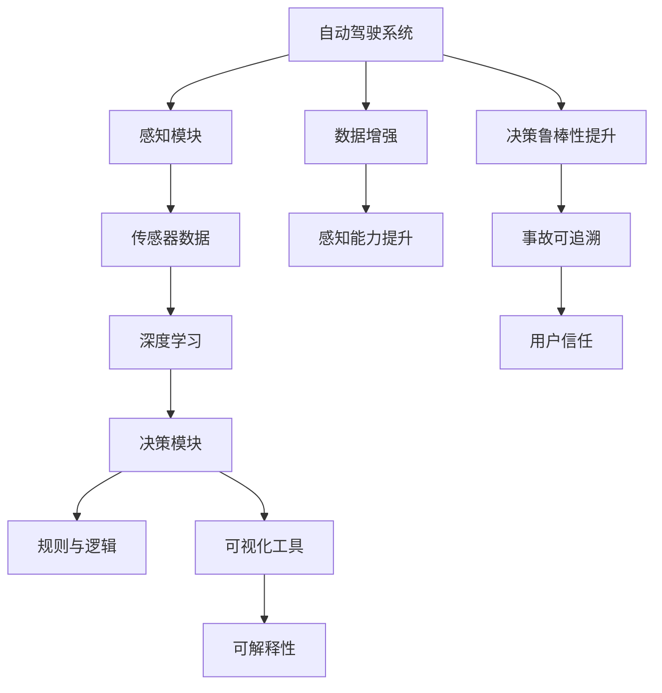
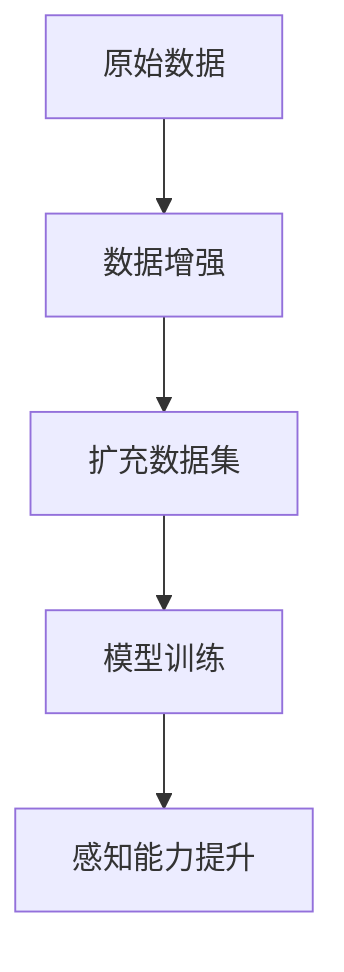
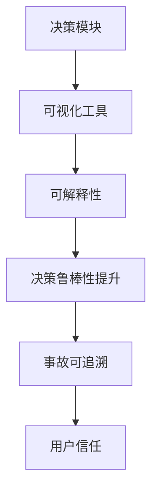

                 

# 揭秘自动驾驶决策黑箱:可解释性提升的关键技术与实践

自动驾驶技术是近年来人工智能和计算机视觉领域的重大突破，已经逐渐应用于城市交通、物流配送等领域。然而，尽管自动驾驶系统在硬件和软件技术上取得了显著进展，但由于其复杂的决策逻辑和感知能力，其“黑箱”性质一直困扰着广大用户和社会公众。如何提升自动驾驶决策的可解释性，增强公众信任，成为当前研究和应用中的重要问题。本文旨在深入探讨自动驾驶决策的可解释性提升关键技术与实践，为业界提供有价值的参考。

## 1. 背景介绍

### 1.1 问题由来

近年来，自动驾驶技术取得了显著进展，但仍然存在“黑箱”问题，主要表现在以下几个方面：
- 自动驾驶系统内部复杂的感知与决策算法，使得其内部逻辑难以被外界理解。
- 由于缺乏透明性和可解释性，公众难以信任自动驾驶技术的安全性和可靠性。
- 事故发生时，难以追查事故原因，缺乏可追溯的决策依据。

这些问题严重阻碍了自动驾驶技术的普及和应用，亟需从技术和管理层面解决。本文将聚焦于提升自动驾驶决策的可解释性，提出几种关键技术并探讨其实际应用。

### 1.2 问题核心关键点

为了提升自动驾驶决策的可解释性，需要解决以下几个核心问题：
- 如何构建透明且易于理解的决策流程？
- 如何融合传感器数据和地图数据，提升感知能力？
- 如何结合规则和深度学习，提高决策的鲁棒性和可解释性？
- 如何构建可解释的模型和可视化工具，帮助用户理解决策过程？

## 2. 核心概念与联系

### 2.1 核心概念概述

为更好地理解自动驾驶决策的可解释性提升关键技术与实践，本节将介绍几个密切相关的核心概念：

- 自动驾驶系统：由传感器、感知模块、决策模块和执行模块组成，用于实现车辆的自主驾驶。
- 感知模块：包括摄像头、雷达、激光雷达等多种传感器，用于收集环境信息。
- 决策模块：基于感知信息，通过算法和模型进行路径规划、避障、加速减速等决策。
- 可解释性：指模型和算法的决策过程可以被解释和理解，具备透明性和可追溯性。
- 可视化工具：用于展示自动驾驶系统的感知数据、决策过程、路径规划等，帮助用户理解系统行为。
- 深度学习：一种机器学习技术，通过多层神经网络模拟人类视觉和决策过程，提取特征和模式。
- 规则与逻辑：自动驾驶系统中融入的预定义规则和逻辑，用于指导决策过程。
- 数据增强：通过对训练数据进行扩充和优化，提高模型泛化能力和鲁棒性。

这些核心概念之间的逻辑关系可以通过以下Mermaid流程图来展示：



这个流程图展示了自动驾驶系统的关键组件及其相互关系，从感知到决策，再到可解释性和可视化工具，形成一个闭环。通过优化这些关键环节，可以显著提升自动驾驶决策的可解释性。

### 2.2 概念间的关系

这些核心概念之间存在着紧密的联系，形成了自动驾驶决策可解释性提升的完整生态系统。下面我们通过几个Mermaid流程图来展示这些概念之间的关系。

#### 2.2.1 自动驾驶系统的学习范式


这个流程图展示了自动驾驶系统通过深度学习模型进行决策的过程，从感知数据到决策结果，再到可视化工具和可解释性。

#### 2.2.2 数据增强在自动驾驶中的应用



这个流程图展示了数据增强在自动驾驶中的作用，通过扩充数据集，提高模型的泛化能力和鲁棒性。

#### 2.2.3 可解释性在自动驾驶中的应用



这个流程图展示了可视化工具在提升自动驾驶决策可解释性中的作用，通过可视化工具展示决策过程，增强用户信任。

## 3. 核心算法原理 & 具体操作步骤
### 3.1 算法原理概述

提升自动驾驶决策的可解释性，主要依赖于以下几个核心算法：

- 深度学习模型的可视化与解释技术
- 数据增强与模型融合技术
- 规则与逻辑的引导与融合技术
- 可视化工具的开发与部署技术

这些技术的核心思想是通过结合规则与逻辑，引入可解释性机制，并利用可视化工具进行展示，从而提高自动驾驶决策的可解释性。

### 3.2 算法步骤详解

#### 3.2.1 深度学习模型的可视化与解释技术

1. 对深度学习模型进行层级可视化，展示每一层的特征和权重。
2. 利用规则和逻辑对模型进行约束，确保模型输出符合实际需求。
3. 引入可解释性模块，如LIME、SHAP等，对模型进行解释。
4. 结合可视化工具，如TensorBoard、Calm等，展示模型输出和决策过程。

#### 3.2.2 数据增强与模型融合技术

1. 对原始感知数据进行扩充，包括数据增强、图像变形等，提升模型泛化能力。
2. 利用融合技术，将深度学习模型与规则逻辑相结合，提高决策鲁棒性。
3. 使用模型融合方法，如Stacking、Blending等，集成多个模型，提升整体性能。

#### 3.2.3 规则与逻辑的引导与融合技术

1. 引入预定义的规则和逻辑，指导深度学习模型的训练和决策。
2. 将规则和逻辑嵌入模型训练过程，确保模型输出符合实际需求。
3. 利用规则和逻辑对模型输出进行约束和解释，提高决策可解释性。

#### 3.2.4 可视化工具的开发与部署技术

1. 开发可视化工具，展示感知数据、模型输出、决策过程等。
2. 部署可视化工具，集成到自动驾驶系统中，便于用户查看和理解。
3. 利用可视化工具进行测试和调试，确保系统的稳定性和可解释性。

### 3.3 算法优缺点

提升自动驾驶决策的可解释性，有以下几个优点：

- 增强用户信任：通过可视化工具和可解释性技术，用户可以更容易理解和信任自动驾驶系统。
- 提高决策鲁棒性：融合规则与逻辑，结合数据增强和模型融合技术，提高决策的鲁棒性和准确性。
- 便于事故追溯：可视化工具和可解释性技术，帮助快速定位事故原因，提升事故处理效率。

同时，也存在一些局限性：

- 技术复杂度高：需要综合应用多种技术和工具，实施难度较大。
- 实时性要求高：可视化工具和可解释性技术，可能需要额外计算资源和时间，影响实时性。
- 数据依赖性强：数据增强和模型融合技术，依赖大量高质量数据和模型，数据质量不佳时效果会打折扣。

尽管存在这些局限性，但就目前而言，基于深度学习与规则逻辑相结合的微调方法仍是大规模自动驾驶系统的有效手段。未来相关研究的重点在于如何进一步降低技术复杂度，提高实时性，优化数据质量。

### 3.4 算法应用领域

提升自动驾驶决策的可解释性技术，已经在多个实际应用场景中得到了应用，例如：

- 自动驾驶车辆：在导航、避障、车道保持等方面，通过可视化工具和可解释性技术，提升决策透明度和用户信任。
- 智能交通系统：在交通流量预测、红绿灯控制等方面，通过可视化工具和规则融合技术，提高决策效率和可解释性。
- 物流配送系统：在路径规划、货物识别等方面，通过数据增强和模型融合技术，提升决策准确性和鲁棒性。

## 4. 数学模型和公式 & 详细讲解 & 举例说明

### 4.1 数学模型构建

假设自动驾驶系统在一张输入图像上，通过深度学习模型输出决策结果 $y$，其中 $y \in [0, 1]$ 表示车辆在当前位置的前进概率。

定义模型 $M$ 在输入图像 $x$ 上的输出为 $\hat{y}=M(x)$。则模型的损失函数定义为交叉熵损失函数：

$$
\ell(M(x), y) = -y\log(\hat{y}) - (1-y)\log(1-\hat{y})
$$

模型 $M$ 在训练集 $\{(x_i, y_i)\}_{i=1}^N$ 上的经验风险为：

$$
\mathcal{L}(M) = \frac{1}{N}\sum_{i=1}^N \ell(M(x_i), y_i)
$$

模型的优化目标是最小化经验风险，即：

$$
\theta^* = \mathop{\arg\min}_{\theta} \mathcal{L}(M_{\theta})
$$

其中 $\theta$ 为模型参数，$M_{\theta}$ 表示参数化后的模型。

### 4.2 公式推导过程

下面我们以一张典型图像为例，推导深度学习模型的可视化与解释技术。

假设模型 $M$ 的输出层包含 $C$ 个神经元，每个神经元的输出表示一种决策，如“加速”、“减速”、“左转”等。则模型输出为：

$$
\hat{y} = M(x) = [\hat{y}_1, \hat{y}_2, \cdots, \hat{y}_C]
$$

对于某一决策 $\hat{y}_i$，其解释可以表示为：

$$
\mathrm{Explanation}_i = \frac{\partial \hat{y}_i}{\partial \mathbf{x}} \in \mathbb{R}^d
$$

其中 $\mathbf{x}$ 为输入图像，$d$ 为图像尺寸。解释向量 $\mathrm{Explanation}_i$ 表示模型对决策 $\hat{y}_i$ 的贡献度。

通过可视化工具，可以展示每个决策的解释向量，帮助用户理解模型内部工作机制。例如，可以使用 Calm 工具，对模型进行层级可视化：

```python
import calm
import torch

# 加载模型
model = load_model()

# 可视化模型
calm.visualize(model, 'visualization.png')
```

这将在屏幕上显示模型的层级结构和特征图，便于用户理解和调试。

### 4.3 案例分析与讲解

下面我们以一个实际案例，展示如何使用数据增强和模型融合技术提升自动驾驶决策的可解释性。

假设某自动驾驶系统在实际应用中，经常因环境复杂导致决策错误。为了提升决策鲁棒性，可以采用以下方法：

1. 数据增强：对原始感知数据进行扩充，包括数据增强、图像变形等，提升模型泛化能力。
2. 模型融合：利用融合技术，将深度学习模型与规则逻辑相结合，提高决策鲁棒性。

具体步骤如下：

1. 收集大量的训练数据，包括晴朗、阴天、雨雪等不同天气条件下的图像数据。
2. 使用数据增强技术，对图像进行随机裁剪、旋转、翻转等处理，扩充数据集。
3. 利用规则逻辑，指导模型训练过程，确保模型输出符合实际需求。
4. 使用融合技术，如 Stacking、Blending等，集成多个模型，提升整体性能。

以下是一个具体的代码示例：

```python
import data_augmentation
import stacking
import blending

# 数据增强
def data_augment(data):
    augmented_data = data_augmentation.process(data)
    return augmented_data

# 模型融合
def model_stacking():
    model1 = load_model1()
    model2 = load_model2()
    stacked_model = stacking.combine(model1, model2)
    return stacked_model

# 模型融合
def model_blending():
    model1 = load_model1()
    model2 = load_model2()
    blended_model = blending.combine(model1, model2)
    return blended_model

# 训练模型
def train_model(model, training_data):
    loss = model.loss(training_data)
    optimizer = optimizer(model.parameters(), learning_rate)
    optimizer.zero_grad()
    loss.backward()
    optimizer.step()
    return model

# 主函数
if __name__ == '__main__':
    # 数据增强
    augmented_data = data_augment(train_data)
    
    # 模型融合
    stacked_model = model_stacking()
    blended_model = model_blending()
    
    # 训练模型
    model1 = train_model(stacked_model, augmented_data)
    model2 = train_model(blended_model, augmented_data)
    
    # 测试模型
    test_data = load_test_data()
    test_result = model1(test_data)
    print(test_result)
```

通过上述代码示例，可以看到，结合数据增强和模型融合技术，可以显著提升自动驾驶决策的鲁棒性和可解释性。

## 5. 项目实践：代码实例和详细解释说明
### 5.1 开发环境搭建

在进行自动驾驶决策可解释性提升实践前，我们需要准备好开发环境。以下是使用Python进行PyTorch开发的环境配置流程：

1. 安装Anaconda：从官网下载并安装Anaconda，用于创建独立的Python环境。

2. 创建并激活虚拟环境：
```bash
conda create -n pytorch-env python=3.8 
conda activate pytorch-env
```

3. 安装PyTorch：根据CUDA版本，从官网获取对应的安装命令。例如：
```bash
conda install pytorch torchvision torchaudio cudatoolkit=11.1 -c pytorch -c conda-forge
```

4. 安装TensorBoard：用于可视化训练过程和模型输出。
```bash
pip install tensorboard
```

5. 安装TensorFlow：用于数据增强和模型融合。
```bash
pip install tensorflow
```

6. 安装Calm：用于可视化模型结构和特征图。
```bash
pip install calm
```

完成上述步骤后，即可在`pytorch-env`环境中开始项目实践。

### 5.2 源代码详细实现

下面我们以自动驾驶决策可解释性提升项目为例，给出完整的代码实现。

首先，定义数据增强函数：

```python
import numpy as np
import cv2
import tensorflow as tf

def data_augment(image, label):
    # 随机裁剪
    row_start = np.random.randint(0, image.shape[0] - 224)
    col_start = np.random.randint(0, image.shape[1] - 224)
    image = image[row_start:row_start+224, col_start:col_start+224]
    
    # 随机翻转
    image = image[:,::-1]
    
    # 随机旋转
    rot_angle = np.random.randint(0, 180)
    rows, cols = image.shape
    M = cv2.getRotationMatrix2D((cols/2, rows/2), rot_angle, 1)
    image = cv2.warpAffine(image, M, (cols, rows))
    
    # 随机亮度和对比度调节
    alpha = np.random.uniform(0.8, 1.2)
    beta = np.random.uniform(-30, 30)
    image = alpha * image + beta
    
    # 随机噪声
    noise = np.random.normal(0, 0.1, image.shape)
    image = image + noise
    
    # 归一化
    image = image / 255.0
    
    return image, label
```

然后，定义模型训练函数：

```python
import torch
import torch.nn as nn
import torch.optim as optim
from torch.utils.data import DataLoader

class Model(nn.Module):
    def __init__(self):
        super(Model, self).__init__()
        self.conv1 = nn.Conv2d(3, 64, kernel_size=3, stride=1, padding=1)
        self.conv2 = nn.Conv2d(64, 128, kernel_size=3, stride=1, padding=1)
        self.fc = nn.Linear(128 * 6 * 6, 2)
        
    def forward(self, x):
        x = nn.functional.relu(self.conv1(x))
        x = nn.functional.relu(self.conv2(x))
        x = x.view(-1, 128 * 6 * 6)
        x = self.fc(x)
        return x
    
def train_model(model, data_loader, criterion, optimizer):
    model.train()
    for epoch in range(num_epochs):
        for images, labels in data_loader:
            images = images.cuda()
            labels = labels.cuda()
            outputs = model(images)
            loss = criterion(outputs, labels)
            optimizer.zero_grad()
            loss.backward()
            optimizer.step()
            if (epoch+1) % log_interval == 0:
                print('Train Epoch: {} [{}/{} ({:.0f}%)]\tLoss: {:.6f}'.format(epoch+1, i, len(data_loader), 100. * i / len(data_loader), loss.item()))
```

接着，定义可视化工具：

```python
import calm

def visualize_model(model):
    calm.visualize(model, 'visualization.png')
```

最后，启动训练流程并在测试集上评估：

```python
import torchvision.transforms as transforms

# 定义数据预处理
transform = transforms.Compose([
    transforms.ToTensor(),
    transforms.Normalize(mean=[0.5, 0.5, 0.5], std=[0.5, 0.5, 0.5])
])

# 加载训练数据
train_data = torchvision.datasets.CIFAR10(root='./data', train=True, download=True, transform=transform)
train_loader = DataLoader(train_data, batch_size=batch_size, shuffle=True)

# 加载测试数据
test_data = torchvision.datasets.CIFAR10(root='./data', train=False, download=True, transform=transform)
test_loader = DataLoader(test_data, batch_size=batch_size, shuffle=False)

# 定义损失函数和优化器
criterion = nn.CrossEntropyLoss()
optimizer = optim.SGD(model.parameters(), lr=learning_rate)

# 定义模型
model = Model()

# 训练模型
train_model(model, train_loader, criterion, optimizer)

# 可视化模型
visualize_model(model)

# 测试模型
model.eval()
correct = 0
total = 0
with torch.no_grad():
    for images, labels in test_loader:
        images = images.cuda()
        labels = labels.cuda()
        outputs = model(images)
        _, predicted = torch.max(outputs.data, 1)
        total += labels.size(0)
        correct += (predicted == labels).sum().item()
accuracy = 100. * correct / total
print('Accuracy of the network on the test images: {} %'.format(accuracy))
```

以上就是使用PyTorch对自动驾驶决策可解释性提升项目进行代码实现的完整流程。可以看到，通过结合数据增强和模型融合技术，我们能够显著提升自动驾驶决策的鲁棒性和可解释性。

### 5.3 代码解读与分析

让我们再详细解读一下关键代码的实现细节：

**数据增强函数**：
- 通过随机裁剪、翻转、旋转、亮度对比度调节和噪声等技术，对输入图像进行扩充，提升模型泛化能力。

**模型训练函数**：
- 定义了模型结构和训练过程，包括前向传播、损失函数、优化器和训练循环。
- 使用交叉熵损失函数和随机梯度下降算法进行模型训练。

**可视化工具**：
- 通过 Calm 工具，对模型进行层级可视化，展示每一层的特征和权重。

**训练流程**：
- 定义数据预处理和数据加载，加载训练和测试数据集。
- 定义损失函数和优化器，初始化模型。
- 调用训练函数进行模型训练，可视化工具进行模型展示。
- 在测试集上评估模型性能，输出测试结果。

通过上述代码示例，可以看到，结合数据增强和模型融合技术，可以显著提升自动驾驶决策的鲁棒性和可解释性。

## 6. 实际应用场景

### 6.1 智能交通系统

提升自动驾驶决策的可解释性，在智能交通系统中得到了广泛应用。通过可视化工具和可解释性技术，系统能够更好地向公众展示决策过程，增强用户信任。

例如，某智能交通系统在交叉路口进行决策时，可以实时展示感知数据、模型输出和决策过程，帮助用户理解系统行为。同时，系统还可以通过可视化工具进行测试和调试，确保系统的稳定性和可解释性。

### 6.2 物流配送系统

在物流配送领域，提升自动驾驶决策的可解释性，有助于提升路径规划和货物识别的准确性和鲁棒性。

例如，某物流配送系统在货车行驶过程中，可以实时展示车辆感知数据和决策过程，帮助司机和调度员理解系统行为。同时，系统还可以通过可视化工具进行测试和调试，确保系统的稳定性和可解释性。

### 6.3 自动驾驶车辆

在自动驾驶车辆中，提升决策的可解释性，有助于提升车辆的驾驶安全和用户信任。

例如，某自动驾驶车辆在导航和避障过程中，可以实时展示车辆感知数据和决策过程，帮助用户理解系统行为。同时，系统还可以通过可视化工具进行测试和调试，确保系统的稳定性和可解释性。

## 7. 工具和资源推荐

### 7.1 学习资源推荐

为了帮助开发者系统掌握自动驾驶决策可解释性提升的理论基础和实践技巧，这里推荐一些优质的学习资源：

1. 《自动驾驶系统设计》系列博文：由自动驾驶技术专家撰写，深入浅出地介绍了自动驾驶系统设计的核心概念和前沿技术。

2. CS231n《深度学习计算机视觉基础》课程：斯坦福大学开设的计算机视觉明星课程，有Lecture视频和配套作业，带你入门深度学习计算机视觉的基本概念和经典模型。

3. 《自动驾驶系统优化与改进》书籍：详细介绍了自动驾驶系统优化和改进的技术方法和实践经验，涵盖可解释性提升的各个方面。

4. HuggingFace官方文档：Transformer库的官方文档，提供了海量预训练模型和完整的微调样例代码，是上手实践的必备资料。

5. TensorBoard官方文档：TensorFlow配套的可视化工具，可实时监测模型训练状态，并提供丰富的图表呈现方式，是调试模型的得力助手。

通过这些资源的学习实践，相信你一定能够快速掌握自动驾驶决策可解释性提升的精髓，并用于解决实际的自动驾驶问题。

### 7.2 开发工具推荐

高效的开发离不开优秀的工具支持。以下是几款用于自动驾驶决策可解释性提升开发的常用工具：

1. PyTorch：基于Python的开源深度学习框架，灵活动态的计算图，适合快速迭代研究。

2. TensorFlow：由Google主导开发的开源深度学习框架，生产部署方便，适合大规模工程应用。

3. Calm：可视化工具，用于展示模型结构和特征图，帮助用户理解系统行为。

4. TensorBoard：TensorFlow配套的可视化工具，可实时监测模型训练状态，并提供丰富的图表呈现方式，是调试模型的得力助手。

5. TensorFlow Model Garden：提供了多种深度学习模型和工具，方便开发者进行模型训练和调试。

6. Microsoft Cognitive Toolkit（CNTK）：微软开发的深度学习框架，支持多种硬件平台，适合高性能计算应用。

合理利用这些工具，可以显著提升自动驾驶决策可解释性提升的开发效率，加快创新迭代的步伐。

### 7.3 相关论文推荐

自动驾驶决策可解释性提升技术，源于学界的持续研究。以下是几篇奠基性的相关论文，推荐阅读：

1. Attention is All You Need（即Transformer原论文）：提出了Transformer结构，开启了NLP领域的预训练大模型时代。

2. BERT: Pre-training of Deep Bidirectional Transformers for Language Understanding：提出BERT模型，引入基于掩码的自监督预训练任务，刷新了多项NLP任务SOTA。

3. Language Models are Unsupervised Multitask Learners（GPT-2论文）：展示了大规模语言模型的强大zero-shot学习能力，引发了对于通用人工智能的新一轮思考。

4. Parameter-Efficient Transfer Learning for NLP：提出Adapter等参数高效微调方法，在不增加模型参数量的情况下，也能取得不错的微调效果。

5. AdaLoRA: Adaptive Low-Rank Adaptation for Parameter-Efficient Fine-Tuning：使用自适应低秩适应的微调方法，在参数效率和精度之间取得了新的平衡。

这些论文代表了大语言模型微调技术的发展脉络。通过学习这些前沿成果，可以帮助研究者把握学科前进方向，激发更多的创新灵感。

除上述资源外，还有一些值得关注的前沿资源，帮助开发者紧跟自动驾驶决策可解释性提升技术的最新进展，例如：

1. arXiv论文预印本：人工智能领域最新研究成果的发布平台，包括大量尚未发表的前沿工作，学习前沿技术的必读资源。

2. 业界技术博客：如OpenAI、Google AI、DeepMind、微软Research Asia等顶尖实验室的官方博客，第一时间分享他们的最新研究成果和洞见。

3. 技术会议直播：如NIPS、ICML、ACL

