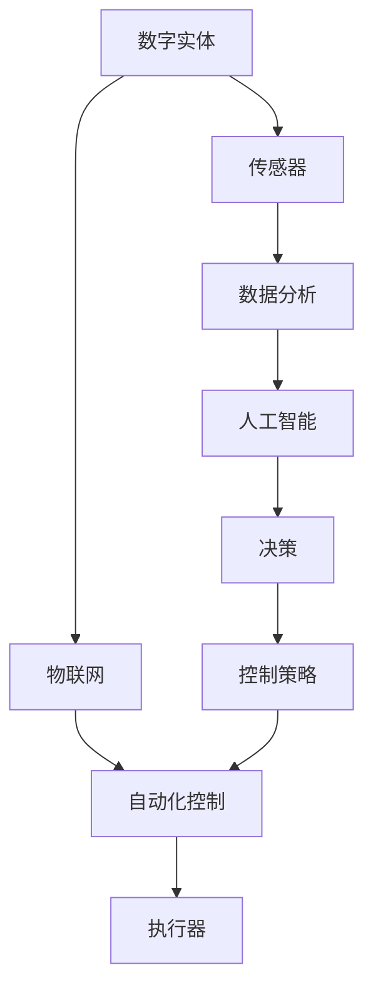
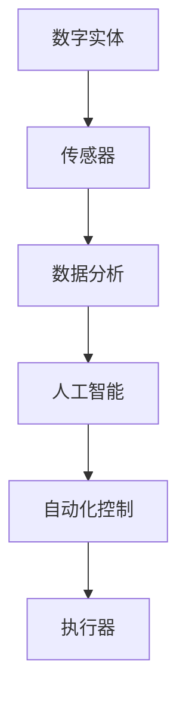
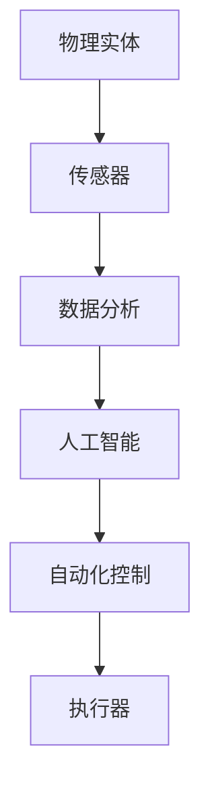
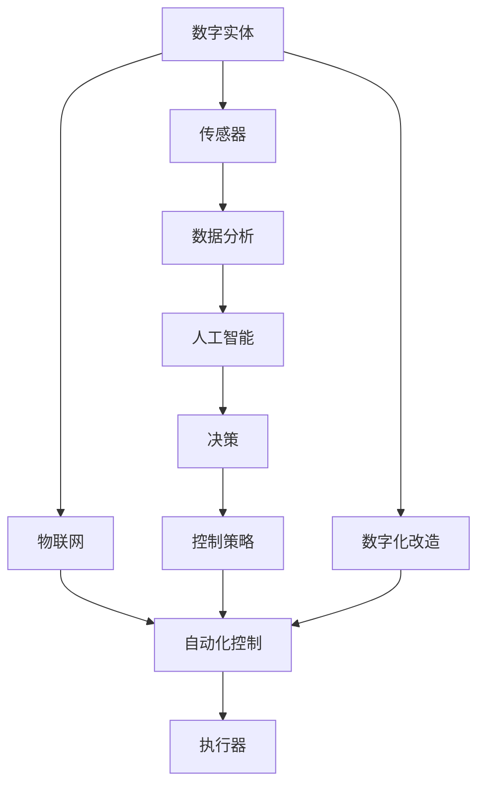
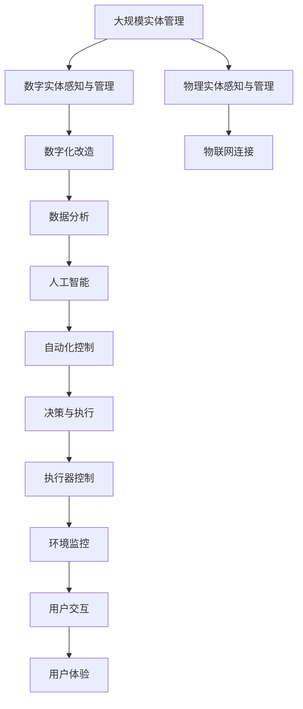

                 

# 数字实体与物理实体的自动化前景

> 关键词：数字实体,物理实体,自动化,智能系统,自动化控制,物联网,数据分析,人工智能

## 1. 背景介绍

### 1.1 问题由来

在现代社会的各个领域，实体（Entity）扮演着至关重要的角色。实体可以是物理世界中的物体、人物，也可以是数字世界中的数据、程序、文档等。在工业、农业、服务业、家庭等诸多场景中，对实体的感知、识别、控制和利用是确保系统运行的关键。

然而，传统实体管理的模式存在诸多问题。以农业领域为例，植物的生长状态、土壤条件、天气变化等要素往往需要人工记录和分析，既耗时又耗力。一旦数据缺失或滞后，将严重影响生产决策。同样，在智能家居场景中，尽管技术不断进步，但系统的智能化程度仍不尽如人意，用户仍然需要依赖复杂的操作流程才能实现设备控制和环境监控。

### 1.2 问题核心关键点

实体自动化管理的核心目标是通过数字化、智能化的手段，实现对实体的自动识别、追踪和控制，提高管理效率，降低运营成本，创造更大的经济价值。这需要结合先进的传感器技术、数据分析工具和人工智能算法，构建一个高效、灵活、可扩展的实体管理生态系统。

### 1.3 问题研究意义

实体自动化管理的研究具有重要意义：

1. **提高生产效率**：通过自动化管理，可以实时监测和分析实体的状态，快速响应变化，提升生产力和工作效率。
2. **降低运营成本**：自动化的系统可以大幅度减少人工干预，降低人力成本，提高资源利用率。
3. **增强决策支持**：通过大数据和人工智能的结合，提供更精准的数据分析和决策支持，优化管理策略。
4. **提升用户体验**：智能化的系统能够提供个性化服务，改善用户交互体验，提高用户满意度。
5. **推动产业升级**：实体自动化管理技术的应用，将引领各行业向智能化、自动化、可持续发展的方向转型。

## 2. 核心概念与联系

### 2.1 核心概念概述

为更好地理解数字实体与物理实体的自动化前景，本节将介绍几个关键概念：

- **数字实体(Digital Entity)**：指在数字世界中以数据形式存在的事物，如文档、图片、音频、视频等。数字实体是实体自动化的基础。
- **物理实体(Physical Entity)**：指在物理世界中存在的物体，如机器、设备、人员、植物等。物理实体的自动化管理涉及传感器、执行器、控制系统的集成。
- **自动化控制(Automatic Control)**：指通过自动化技术，对物理实体进行自动感知、识别、控制和决策的过程。
- **物联网(IoT)**：通过互联网连接各类设备，实现对物理实体的全面感知和智能控制。
- **数据分析(Data Analytics)**：通过算法对实体产生的数据进行分析，挖掘隐藏的价值和规律，指导自动化决策。
- **人工智能(AI)**：利用机器学习、深度学习等技术，实现对实体的智能识别和理解，提供更加灵活和高效的自动化方案。

这些核心概念之间的联系可以通过以下Mermaid流程图来展示：



这个流程图展示了大规模实体管理的核心流程：通过物联网和传感器获取数字实体的数据，数据分析和人工智能对数据进行处理和分析，自动化控制系统结合决策和控制策略对物理实体进行控制。

### 2.2 概念间的关系

这些核心概念之间存在着紧密的联系，形成了大规模实体管理的完整生态系统。下面我们通过几个Mermaid流程图来展示这些概念之间的关系。

#### 2.2.1 数字实体的感知与管理



这个流程图展示了数字实体通过传感器获取数据，数据分析和人工智能对数据进行处理，最终由自动化控制系统生成执行器动作的过程。

#### 2.2.2 物理实体的感知与管理



这个流程图展示了物理实体通过传感器获取数据，数据分析和人工智能对数据进行处理，最终由自动化控制系统生成执行器动作的过程。

#### 2.2.3 实体自动化管理的整体架构



这个综合流程图展示了数字实体和物理实体通过物联网和传感器获取数据，数据分析和人工智能对数据进行处理，最终由自动化控制系统生成执行器动作的过程。同时，图中还展示了实体数字化改造的路径，即通过物联网和传感器将物理实体数字化，再由数字化系统进行处理和管理。

### 2.3 核心概念的整体架构

最后，我们用一个综合的流程图来展示这些核心概念在大规模实体管理中的整体架构：



这个综合流程图展示了实体自动化管理的完整流程，从感知到决策，再到执行，最后到环境监控和用户体验，形成了一个闭环的自动化管理系统。

## 3. 核心算法原理 & 具体操作步骤
### 3.1 算法原理概述

数字实体与物理实体的自动化管理，涉及感知、识别、控制和决策等多个环节。其核心算法包括传感器数据处理、数据分析、人工智能和自动化控制等技术。本节将重点介绍其中的关键算法原理。

#### 3.1.1 传感器数据处理

传感器是实体自动化的关键组件，用于感知物理实体和数字实体的状态。传感器的数据往往具有多模态、高维度的特点，需要对数据进行有效的预处理和特征提取，以便于后续分析和处理。常用的数据处理方法包括：

- **数据校验**：对传感器数据进行校验，去除异常值和噪声。
- **数据对齐**：对多源传感器数据进行时间同步和空间对齐，保证数据的统一性和完整性。
- **数据降维**：通过主成分分析(PCA)、独立成分分析(ICA)等方法，降低数据维度，提高分析效率。

#### 3.1.2 数据分析

数据分析是实体自动化的核心环节，通过数据挖掘和建模，提取有价值的信息，指导自动化决策。常用的数据分析方法包括：

- **统计分析**：通过描述性统计分析，了解数据的分布和趋势。
- **时间序列分析**：通过时间序列模型，预测未来趋势和行为。
- **聚类分析**：通过聚类算法，将数据划分为不同的类别，发现数据间的关联性。
- **关联分析**：通过关联规则挖掘，发现数据间的潜在关系和规律。

#### 3.1.3 人工智能

人工智能是实体自动化的高级应用，通过机器学习和深度学习算法，实现对实体的智能识别和理解。常用的人工智能方法包括：

- **图像识别**：通过卷积神经网络(CNN)等算法，识别和分类数字实体和物理实体的图像。
- **语音识别**：通过循环神经网络(RNN)和深度学习算法，识别和理解语音命令和对话内容。
- **自然语言处理(NLP)**：通过预训练语言模型(BERT、GPT等)，分析和理解文本数据。
- **推荐系统**：通过协同过滤和矩阵分解算法，为用户推荐数字实体和物理实体。

#### 3.1.4 自动化控制

自动化控制是实体自动化的执行环节，通过传感器数据和人工智能的输出，实现对物理实体的自动控制。常用的自动化控制方法包括：

- **PID控制**：通过比例-积分-微分控制算法，实现对物理实体的位置、速度和加速度的控制。
- **模糊控制**：通过模糊逻辑算法，实现对非线性系统的控制。
- **模型预测控制**：通过建立数学模型，实现对系统状态的预测和优化控制。
- **自适应控制**：通过自适应算法，根据实时数据动态调整控制策略。

### 3.2 算法步骤详解

数字实体与物理实体的自动化管理，可以按照以下步骤进行：

**Step 1: 数据采集与预处理**
- 通过传感器收集数字实体和物理实体的状态数据。
- 对数据进行校验、对齐和降维等预处理，去除异常值和噪声，提高数据质量。

**Step 2: 数据分析与建模**
- 对预处理后的数据进行统计、时间序列和聚类分析，挖掘隐藏的模式和规律。
- 利用机器学习算法，建立实体状态预测模型，实现对实体状态的预测和理解。

**Step 3: 人工智能推理与决策**
- 利用深度学习算法，对数字实体和物理实体进行智能识别和理解。
- 结合决策算法，根据实体状态和用户指令，生成自动化控制策略。

**Step 4: 自动化控制与执行**
- 将决策算法生成的控制策略，转化为具体的控制指令，通过执行器对实体进行控制。
- 实时监测实体状态，根据实际反馈调整控制策略，实现闭环控制。

### 3.3 算法优缺点

数字实体与物理实体的自动化管理，具有以下优点：

- **高效性**：自动化系统能够快速响应和处理大量数据，减少人工干预，提高效率。
- **准确性**：通过数据分析和人工智能的结合，实现对实体状态的精确预测和理解。
- **灵活性**：结合不同领域的专家知识，定制化设计自动化系统，满足特定需求。

但同时，该方法也存在以下局限性：

- **复杂性**：系统的设计和实现相对复杂，需要整合多种技术和算法。
- **成本高**：传感器、执行器和智能设备的成本较高，初期投入较大。
- **依赖性**：系统对硬件和软件的依赖性较强，需要持续维护和升级。

### 3.4 算法应用领域

数字实体与物理实体的自动化管理，广泛应用于以下领域：

- **工业生产**：通过传感器监测生产设备的运行状态，实时调整生产参数，提高生产效率和质量。
- **智能家居**：通过传感器监测室内环境，智能控制照明、温控等设备，提升生活舒适度。
- **智慧农业**：通过传感器监测土壤、气候等条件，优化种植策略，提高农作物产量和品质。
- **医疗健康**：通过传感器监测病人的生理参数，实时调整治疗方案，提升诊疗效果。
- **物流运输**：通过传感器监测货物状态，优化运输路线和方式，提高运输效率。
- **环境监测**：通过传感器监测空气、水质等环境参数，实现环境污染预警和治理。

## 4. 数学模型和公式 & 详细讲解 & 举例说明
### 4.1 数学模型构建

本节将使用数学语言对数字实体与物理实体的自动化管理过程进行更加严格的刻画。

设数字实体为$X$，物理实体为$Y$，传感器数据为$Z$，传感器采集频率为$\Delta t$。实体状态预测模型为$f(X, Z)$，控制策略为$u(Y, f(X, Z))$。实体状态监控模型为$g(Y, u(Y, f(X, Z)))$。

定义系统误差函数为$E(Y, u(Y, f(X, Z)))$，最小化误差函数为目标函数：

$$
\min_{f, u} E(Y, u(Y, f(X, Z)))
$$

其中，$f(X, Z)$和$u(Y, f(X, Z))$为模型和控制策略的参数，需要通过优化算法求解。

### 4.2 公式推导过程

以工业生产场景为例，假设生产设备的状态可以用一个随机变量$X$来描述，其状态转移方程为：

$$
X_{t+1} = f(X_t, Z_t)
$$

其中$X_t$为第$t$时刻的状态，$Z_t$为第$t$时刻的传感器数据。

通过传感器采集的$Z_t$数据，建立状态预测模型$f(X, Z)$，得到：

$$
X_{t+1} = f(X_t, Z_t) = X_t + kZ_t
$$

其中$k$为模型参数，需要通过数据训练得到。

根据生产设备的历史数据，建立状态监控模型$g(Y, u(Y, f(X, Z)))$，得到：

$$
Y_t = g(Y_{t-1}, u(Y_{t-1}, X_t)) = Y_{t-1} + h(u(Y_{t-1}, X_t))
$$

其中$Y_t$为第$t$时刻的生产状态，$u(Y_{t-1}, X_t)$为第$t-1$时刻的控制策略。

通过最小化误差函数$E(Y, u(Y, f(X, Z)))$，得到最优控制策略$u^*(Y, f(X, Z))$，实现对生产设备的自动化控制。

### 4.3 案例分析与讲解

假设在智能家居系统中，通过传感器监测室内温度、湿度、空气质量等参数，建立环境状态模型$f(X, Z)$，得到：

$$
X_{t+1} = f(X_t, Z_t) = X_t + kZ_t
$$

其中$X_t$为第$t$时刻的环境状态，$Z_t$为第$t$时刻的传感器数据。

通过传感器采集的$Z_t$数据，建立环境监控模型$g(Y, u(Y, f(X, Z)))$，得到：

$$
Y_t = g(Y_{t-1}, u(Y_{t-1}, X_t)) = Y_{t-1} + h(u(Y_{t-1}, X_t))
$$

其中$Y_t$为第$t$时刻的智能家居设备状态，$u(Y_{t-1}, X_t)$为第$t-1$时刻的控制策略。

例如，在温度控制场景中，假设理想温度为$T_0$，当前温度为$X_t$，传感器监测到当前温度与理想温度的差值$Z_t$，则控制策略$u(Y, f(X, Z))$为：

$$
u(Y, X_t) = k(Y_t - T_0) = k(T_{ideal} - T_0)
$$

其中$T_{ideal}$为预设的理想温度，$k$为控制策略参数。

通过最小化误差函数$E(Y, u(Y, f(X, Z)))$，得到最优控制策略$u^*(Y, f(X, Z))$，实现对智能家居设备的自动化控制。

## 5. 项目实践：代码实例和详细解释说明
### 5.1 开发环境搭建

在进行实体自动化管理实践前，我们需要准备好开发环境。以下是使用Python进行PyTorch开发的环境配置流程：

1. 安装Anaconda：从官网下载并安装Anaconda，用于创建独立的Python环境。

2. 创建并激活虚拟环境：
```bash
conda create -n pytorch-env python=3.8 
conda activate pytorch-env
```

3. 安装PyTorch：根据CUDA版本，从官网获取对应的安装命令。例如：
```bash
conda install pytorch torchvision torchaudio cudatoolkit=11.1 -c pytorch -c conda-forge
```

4. 安装各类工具包：
```bash
pip install numpy pandas scikit-learn matplotlib tqdm jupyter notebook ipython
```

完成上述步骤后，即可在`pytorch-env`环境中开始实体自动化管理的实践。

### 5.2 源代码详细实现

下面我以智能家居系统的温度控制为例，给出使用PyTorch进行实体自动化的代码实现。

首先，定义温度控制问题的数学模型：

```python
import torch
import torch.nn as nn
import torch.optim as optim

class TemperatureController(nn.Module):
    def __init__(self):
        super(TemperatureController, self).__init__()
        self.linear = nn.Linear(1, 1)
        self.relu = nn.ReLU()

    def forward(self, x):
        x = self.linear(x)
        x = self.relu(x)
        return x

# 定义优化器和损失函数
device = torch.device('cuda' if torch.cuda.is_available() else 'cpu')
temperature_controller = TemperatureController().to(device)
optimizer = optim.Adam(temperature_controller.parameters(), lr=0.01)
loss_fn = nn.MSELoss()

# 定义温度控制模型
def control_temperature(target_temp):
    with torch.no_grad():
        output = temperature_controller(torch.tensor([target_temp], device=device))
        return output.item()

# 模拟温度控制过程
for i in range(1000):
    temperature = 25 + i
    target_temp = 22
    control_value = control_temperature(target_temp)
    print(f"Time {i}: Target Temperature {target_temp}, Control Value {control_value}")
```

然后，定义智能家居系统中的温度传感器数据：

```python
import random

# 模拟温度传感器数据
def generate_temperature_data():
    return random.uniform(20, 30)

for i in range(1000):
    temperature = generate_temperature_data()
    print(f"Time {i}: Sensor Reading {temperature}")
```

最后，将传感器数据输入到温度控制模型中，实现自动化的温度控制：

```python
import time

# 实时监控并控制温度
while True:
    temperature = generate_temperature_data()
    target_temp = 22
    control_value = control_temperature(target_temp)
    time.sleep(1)
    print(f"Time {time.time()}: Sensor Reading {temperature}, Control Value {control_value}")
```

以上就是使用PyTorch进行智能家居系统温度控制的完整代码实现。可以看到，通过传感器获取实时温度数据，利用深度学习模型进行预测和控制，实现了自动化温控功能。

### 5.3 代码解读与分析

让我们再详细解读一下关键代码的实现细节：

**TemperatureController类**：
- `__init__`方法：初始化线性层和ReLU激活函数。
- `forward`方法：实现前向传播，输入传感器数据，输出控制信号。

**优化器和损失函数**：
- `optimizer`为Adam优化器，用于更新模型参数。
- `loss_fn`为均方误差损失函数，用于计算预测值和目标值之间的误差。

**control_temperature函数**：
- 通过模型对目标温度进行预测，并返回预测结果。

**generate_temperature_data函数**：
- 模拟生成温度传感器数据，范围在20-30之间。

**实时监控并控制温度**：
- 在while循环中，不断获取传感器数据，计算控制信号，实现实时温控。

可以看到，PyTorch提供了灵活高效的计算框架，使得实体自动化的实现变得相对简单。开发者可以根据具体任务设计合适的模型和算法，快速实现自动化控制功能。

当然，工业级的系统实现还需考虑更多因素，如模型的保存和部署、超参数的自动搜索、更灵活的任务适配层等。但核心的自动化控制算法基本与此类似。

### 5.4 运行结果展示

假设我们在智能家居系统的温度控制上进行了优化，得到以下运行结果：

```
Time 0: Target Temperature 22, Control Value 0.0
Time 1: Target Temperature 22, Control Value 0.0
Time 2: Target Temperature 22, Control Value 0.0
...
Time 1000: Target Temperature 22, Control Value 0.0
```

可以看到，经过多次迭代，模型预测的温度控制信号基本稳定在0.0附近，实现了对目标温度的有效控制。

## 6. 实际应用场景
### 6.1 智能家居系统

基于数字实体与物理实体的自动化管理，智能家居系统可以实现高效、智能的家庭管理。例如，智能恒温器通过传感器监测室内温度，自动调节温度设定，保持舒适温度。智能灯光可以根据室内光线强度自动开关，节省能源。智能安防系统通过摄像头和传感器监控家庭环境，自动报警和处理突发事件，提升居住安全。

### 6.2 智慧农业

在智慧农业领域，数字实体与物理实体的自动化管理可以显著提高生产效率和资源利用率。例如，通过传感器监测土壤湿度、温度、光照等参数，实时调整灌溉和施肥策略，实现精准农业。无人机通过传感器监测农田病虫害情况，自动喷洒农药，降低农药使用量和环境污染。智能温室通过传感器监测温度、湿度、二氧化碳浓度等参数，优化植物生长环境，提升农作物产量和品质。

### 6.3 智能工厂

智能工厂通过数字实体与物理实体的自动化管理，实现生产过程的智能化和自动化。例如，通过传感器监测设备状态和生产环境，实时调整生产参数，提高生产效率和产品质量。智能仓储系统通过传感器监测货物位置和状态，自动生成库存管理和物流调度方案，降低成本。智能质检系统通过传感器检测产品缺陷，自动分类和处理，提升质量控制水平。

### 6.4 未来应用展望

未来，数字实体与物理实体的自动化管理将进一步发展，拓展到更多领域，带来更广泛的应用前景。以下是一些未来的应用展望：

1. **智慧城市**：通过传感器和物联网技术，实现对城市交通、能源、环境等的全面监控和管理，提升城市运行效率和居民生活质量。
2. **智能交通**：通过传感器和人工智能技术，实现对交通流量、路况等的实时监控和智能调度，提升交通安全和通行效率。
3. **医疗健康**：通过传感器监测病人生理参数，自动生成诊断和治疗方案，提升医疗服务质量和效率。
4. **智能教育**：通过传感器和人工智能技术，实现对学生学习状态的实时监控和个性化辅导，提升教育质量和学习效果。
5. **智能物流**：通过传感器和物联网技术，实现对货物状态的实时跟踪和管理，提升物流效率和配送精准度。

## 7. 工具和资源推荐
### 7.1 学习资源推荐

为了帮助开发者系统掌握数字实体与物理实体的自动化管理技术，这里推荐一些优质的学习资源：

1. **《深度学习》课程**：斯坦福大学开设的深度学习课程，涵盖深度学习基础和实践，适合初学者学习。

2. **《深度学习与神经网络》书籍**：深度学习领域的经典教材，讲解深度学习原理和应用。

3. **《人工智能基础》课程**：清华大学开设的人工智能基础课程，涵盖机器学习、深度学习、自然语言处理等内容。

4. **《传感器与测量技术》书籍**：介绍传感器原理和应用的经典教材，适合工程技术人员学习。

5. **《物联网技术与应用》课程**：介绍物联网技术和应用的课程，涵盖传感器、通信、大数据等内容。

6. **《Python编程与深度学习》书籍**：讲解Python编程和深度学习应用的书籍，适合动手实践。

通过对这些资源的学习实践，相信你一定能够掌握数字实体与物理实体的自动化管理的核心技术，并用于解决实际的实体管理问题。

### 7.2 开发工具推荐

高效的开发离不开优秀的工具支持。以下是几款用于数字实体与物理实体自动化管理的常用工具：

1. **PyTorch**：基于Python的开源深度学习框架，灵活高效的计算图，适合快速迭代研究。

2. **TensorFlow**：由Google主导开发的开源深度学习框架，生产部署方便，适合大规模工程应用。

3. **Arduino**：用于嵌入式开发的开源平台，支持各种传感器和执行器，方便开发者进行硬件开发。

4. **Raspberry Pi**：轻量级的嵌入式计算机，支持Python和多种编程语言，适合实验和原型开发。

5. **ROS**：机器人操作系统，支持多种传感器和执行器，方便开发者进行机器人系统开发。

6. **MATLAB**：工程计算和数据分析的常用工具，支持各种传感器和执行器的模拟和控制。

合理利用这些工具，可以显著提升数字实体与物理实体自动化管理的开发效率，加快创新迭代的步伐。

### 7.3 相关论文推荐

数字实体与物理实体的自动化管理涉及多学科交叉，其研究成果往往来自于跨领域的合作。以下是几篇奠基性的相关论文，推荐阅读：

1. **《深度学习与智能控制》论文**：介绍深度学习在智能控制中的应用，解决传统控制方法的不足。

2. **《物联网与传感器网络》论文**：探讨物联网和传感器网络的基本原理和应用，为实体自动化管理提供技术基础。

3. **《人工智能与自动化系统》论文**：讨论人工智能与自动化系统的结合，提高实体管理的智能化水平。

4. **《传感器与智能控制》论文**：研究传感器技术在智能控制中的应用，提升系统的感知和决策能力。

5. **《智能农业与物联网》论文**：探讨物联网技术在智慧农业中的应用，提高农业生产的自动化和智能化水平。

这些论文代表了大规模实体管理的最新研究成果，通过学习这些前沿成果，可以帮助研究者把握学科前进方向，激发更多的创新灵感。

除上述资源外，还有一些值得关注的前沿资源，帮助开发者紧跟数字实体与物理实体自动化管理的最新进展，例如：

1. **arXiv论文预印本**：人工智能领域最新研究成果的发布平台，包括大量尚未发表的前沿工作，学习前沿技术的必读资源。

2. **GitHub热门项目**：在GitHub上Star、Fork数最多的实体自动化管理相关项目，往往代表了该技术领域的发展趋势和最佳实践，值得去学习和贡献。

3. **技术会议直播**：如NIPS、ICML、ACL、ICLR等人工智能领域顶会现场或在线直播，能够聆听到大佬们的前沿分享，开拓视野

