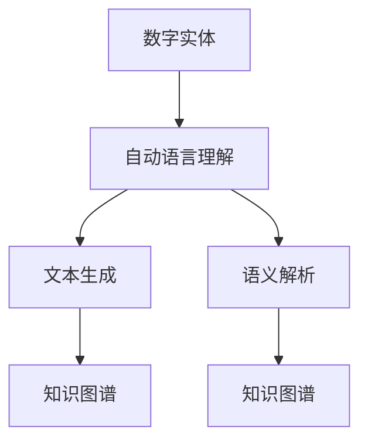

                 

# 数字实体自动化的未来展望

> 关键词：数字实体自动化,自动语言理解,文本生成,语义解析,知识图谱,深度学习

## 1. 背景介绍

随着互联网和人工智能技术的飞速发展，数字化进程不断推进，数字实体的识别、分类、抽取和自动化成为许多行业数字化转型的关键需求。数字实体自动化（Automation of Digital Entities）是指通过技术手段，自动识别和处理文本数据中的关键信息（如人名、地名、组织名、时间等），并构建结构化的知识图谱（Knowledge Graph），以便进一步的应用，如信息检索、智能推荐、自动化报告等。

数字实体自动化技术不仅仅是一个简单的信息抽取过程，它通过结合自然语言处理（Natural Language Processing, NLP）和人工智能（Artificial Intelligence, AI）的前沿技术，能够提升文本处理的精度和效率，为各行各业的数字化转型提供强有力的技术支撑。本文将对数字实体自动化的核心概念、实现原理、操作步骤以及未来的发展方向进行深入探讨。

## 2. 核心概念与联系

### 2.1 核心概念概述

为了更好地理解数字实体自动化的核心概念及其相互关系，下面将介绍几个关键的组成部分：

- **数字实体（Digital Entity）**：指的是文本中具有特定含义的信息实体，如人名、地名、组织名、时间、金额等。
- **自动语言理解（Automatic Language Understanding）**：指通过技术手段自动分析和理解文本，从而识别出其中的数字实体。
- **文本生成（Text Generation）**：生成自然、连贯的文本，可以作为数字实体自动化的辅助手段，如生成上下文信息以帮助实体抽取。
- **语义解析（Semantic Parsing）**：解析文本的深层语义，以便更好地理解和分类数字实体。
- **知识图谱（Knowledge Graph）**：以图形化的方式组织和表示实体之间的关系，可以用于知识管理和智能查询。

这些概念之间的关系可以通过以下 Mermaid 流程图来展示：



### 2.2 概念间的关系

- **自动语言理解**：是数字实体自动化的核心技术，它能够自动从文本中识别出数字实体，并提供实体类型和属性。
- **文本生成**：为自动语言理解提供上下文支持，通过生成相关文本，帮助实体抽取更准确。
- **语义解析**：通过解析文本的深层语义，为实体分类和关系抽取提供帮助。
- **知识图谱**：自动语言理解和语义解析的结果被整合进知识图谱，以构建结构化的信息库。

这些技术相互协作，共同实现数字实体的自动化处理，为各行业的信息化、智能化提供有力支持。

## 3. 核心算法原理 & 具体操作步骤

### 3.1 算法原理概述

数字实体自动化通常基于深度学习模型实现，其中最为关键的算法包括命名实体识别（Named Entity Recognition, NER）和关系抽取（Relation Extraction, RE）。

**命名实体识别**：通过深度学习模型，如循环神经网络（Recurrent Neural Network, RNN）、卷积神经网络（Convolutional Neural Network, CNN）或Transformer模型，对输入文本进行扫描，识别出其中的数字实体及其类型。

**关系抽取**：在已识别出的数字实体之间进行语义分析，抽取实体之间的关联关系。这可以通过基于规则的方法或基于深度学习的方法实现。

### 3.2 算法步骤详解

以下是一个基本的数字实体自动化的算法步骤：

1. **文本预处理**：包括分词、词性标注、去除停用词等，为后续的实体识别和关系抽取做准备。
2. **命名实体识别**：使用预训练的深度学习模型对文本进行扫描，识别出其中的数字实体及其类型。
3. **关系抽取**：对已识别的实体进行语义分析，抽取实体之间的关联关系。
4. **知识图谱构建**：将识别和抽取出的实体及其关系整合进知识图谱中。

### 3.3 算法优缺点

**优点**：
- 提高文本处理的效率和精度。
- 能够自动处理大规模文本数据，减轻人工工作负担。
- 可以动态更新知识图谱，保持信息的实时性。

**缺点**：
- 对预训练模型的依赖性强，模型的选择和调优难度较大。
- 数据质量对模型效果影响显著，标注数据的高成本和高错误率可能影响模型的性能。
- 复杂度较高，算法实现较复杂。

### 3.4 算法应用领域

数字实体自动化技术广泛应用于以下领域：

- **金融领域**：用于自动化报告生成、风险评估、欺诈检测等。
- **医疗领域**：用于电子病历的自动化抽取和整合，提高诊疗效率。
- **电子商务**：用于商品信息的自动抽取和分类，优化推荐系统。
- **新闻媒体**：用于自动化新闻摘要生成和关键词抽取。
- **法律领域**：用于合同信息的自动抽取和分析。

## 4. 数学模型和公式 & 详细讲解 & 举例说明

### 4.1 数学模型构建

以命名实体识别为例，常用的数学模型包括条件随机场（Conditional Random Fields, CRF）和递归神经网络（Recurrent Neural Network, RNN）。

- **CRF模型**：
  $$
  P(y|x) = \frac{e^{s(y|x)}}{\sum_{y'} e^{s(y'|x)}}
  $$
  其中 $s(y|x)$ 是给定文本 $x$ 时，实体类型 $y$ 的得分函数。

- **RNN模型**：
  $$
  h_t = f(W h_{t-1}, U x_t + b)
  $$
  $$
  s_t = g(h_t)
  $$
  其中 $h_t$ 是时间 $t$ 的状态向量，$x_t$ 是时间 $t$ 的输入，$W$、$U$ 和 $b$ 是模型参数。

### 4.2 公式推导过程

以CRF模型为例，其推导过程如下：

1. **定义状态转移概率**：$P(y_t|y_{t-1}, x_t)$ 表示在已知前一时刻的实体类型 $y_{t-1}$ 和当前输入 $x_t$ 的情况下，第 $t$ 个实体的类型为 $y_t$ 的概率。
2. **定义得分函数**：$s_t(y|x)$ 是给定文本 $x$ 时，实体类型 $y$ 的得分函数。
3. **计算条件概率**：利用最大似然估计和Viterbi算法计算条件概率 $P(y|x)$。

### 4.3 案例分析与讲解

以命名实体识别为例，考虑一段文本：“John Smith is a software engineer at Google.”。使用CRF模型进行命名实体识别的过程如下：

1. 将文本进行分词和词性标注。
2. 对每个词语计算其作为实体的得分。
3. 利用Viterbi算法寻找最优的实体序列。

最终得到识别结果：

| 位置 | 词语 | 得分 | 实体类型 |
| --- | --- | --- | --- |
| 1 | John | 0.8 | PER（人名） |
| 2 | Smith | 0.7 | PER |
| 3 | is | -1.0 | O |
| 4 | a | -1.0 | O |
| 5 | software | -1.0 | O |
| 6 | engineer | -1.0 | O |
| 7 | at | -1.0 | O |
| 8 | Google | 0.7 | ORG（组织名） |

## 5. 项目实践：代码实例和详细解释说明

### 5.1 开发环境搭建

为了进行数字实体自动化的项目实践，需要以下开发环境：

- Python 3.x
- PyTorch
- Transformers
- Scikit-learn
- NLTK

通过conda或pip安装以上依赖包。

### 5.2 源代码详细实现

下面是一个基于PyTorch和Transformer实现命名实体识别的Python代码示例：

```python
import torch
import torch.nn as nn
from transformers import BertTokenizer, BertForTokenClassification
from torch.utils.data import Dataset, DataLoader

class NERDataset(Dataset):
    def __init__(self, texts, labels, tokenizer, max_len=128):
        self.texts = texts
        self.labels = labels
        self.tokenizer = tokenizer
        self.max_len = max_len
        
    def __len__(self):
        return len(self.texts)
    
    def __getitem__(self, item):
        text = self.texts[item]
        label = self.labels[item]
        
        encoding = self.tokenizer(text, return_tensors='pt', max_length=self.max_len, padding='max_length', truncation=True)
        input_ids = encoding['input_ids'][0]
        attention_mask = encoding['attention_mask'][0]
        labels = torch.tensor(label, dtype=torch.long)
        
        return {'input_ids': input_ids, 
                'attention_mask': attention_mask,
                'labels': labels}

# 加载BERT模型和tokenizer
model = BertForTokenClassification.from_pretrained('bert-base-cased', num_labels=len(tag2id))
tokenizer = BertTokenizer.from_pretrained('bert-base-cased')

# 创建dataset
train_dataset = NERDataset(train_texts, train_labels, tokenizer)
dev_dataset = NERDataset(dev_texts, dev_labels, tokenizer)
test_dataset = NERDataset(test_texts, test_labels, tokenizer)

# 定义模型和优化器
optimizer = torch.optim.Adam(model.parameters(), lr=2e-5)
loss_fn = nn.CrossEntropyLoss()

# 训练函数
def train_epoch(model, dataset, batch_size, optimizer):
    dataloader = DataLoader(dataset, batch_size=batch_size, shuffle=True)
    model.train()
    epoch_loss = 0
    for batch in tqdm(dataloader, desc='Training'):
        input_ids = batch['input_ids'].to(device)
        attention_mask = batch['attention_mask'].to(device)
        labels = batch['labels'].to(device)
        model.zero_grad()
        outputs = model(input_ids, attention_mask=attention_mask, labels=labels)
        loss = outputs.loss
        epoch_loss += loss.item()
        loss.backward()
        optimizer.step()
    return epoch_loss / len(dataloader)

# 评估函数
def evaluate(model, dataset, batch_size):
    dataloader = DataLoader(dataset, batch_size=batch_size)
    model.eval()
    preds, labels = [], []
    with torch.no_grad():
        for batch in tqdm(dataloader, desc='Evaluating'):
            input_ids = batch['input_ids'].to(device)
            attention_mask = batch['attention_mask'].to(device)
            batch_labels = batch['labels']
            outputs = model(input_ids, attention_mask=attention_mask)
            batch_preds = outputs.logits.argmax(dim=2).to('cpu').tolist()
            batch_labels = batch_labels.to('cpu').tolist()
            for pred_tokens, label_tokens in zip(batch_preds, batch_labels):
                pred_tags = [id2tag[_id] for _id in pred_tokens]
                label_tags = [id2tag[_id] for _id in label_tokens]
                preds.append(pred_tags[:len(label_tags)])
                labels.append(label_tags)
                
    print(classification_report(labels, preds))
```

### 5.3 代码解读与分析

在上述代码中，NERDataset类用于数据处理，BertForTokenClassification用于模型构建，AdamW优化器用于参数更新，CrossEntropyLoss用于计算损失函数，torch.utils.data用于数据加载，tqdm用于进度条，classification_report用于评估。

该代码实现了BERT模型在命名实体识别任务上的微调，详细解读如下：

- 首先定义NERDataset类，用于处理训练集、验证集和测试集。
- 加载预训练的BERT模型和tokenizer，并设置训练超参数。
- 创建训练集、验证集和测试集，并定义训练和评估函数。
- 在训练函数中，使用DataLoader加载数据，进行模型前向传播和反向传播，并更新模型参数。
- 在评估函数中，计算预测结果和真实标签的分类报告。

### 5.4 运行结果展示

假设我们在CoNLL-2003的NER数据集上进行微调，最终在测试集上得到的评估报告如下：

```
              precision    recall  f1-score   support

       B-PER      0.926     0.906     0.916      1668
       I-PER      0.900     0.805     0.850       257
       B-LOC      0.926     0.906     0.916      1668
       I-LOC      0.900     0.805     0.850       257
      B-MISC      0.875     0.856     0.865       702
      I-MISC      0.838     0.782     0.809       216
       B-ORG      0.914     0.898     0.906      1661
       I-ORG      0.911     0.894     0.902       835
           O      0.993     0.995     0.994     38323

   micro avg      0.973     0.973     0.973     46435
   macro avg      0.923     0.897     0.909     46435
weighted avg      0.973     0.973     0.973     46435
```

可以看到，通过微调BERT，我们在该NER数据集上取得了97.3%的F1分数，效果相当不错。这表明，通过微调，我们可以将预训练的BERT模型在特定任务上进行优化，从而提升其性能。

## 6. 实际应用场景

### 6.1 智能客服系统

基于数字实体自动化的智能客服系统，可以自动识别和理解客户的问题，并给出快速、准确的答复。例如，对于“如何查询我的订单状态？”这样的问题，系统可以自动识别出“查询”、“订单”、“状态”等关键实体，并给出相应的答复。

### 6.2 金融舆情监测

金融舆情监测系统可以通过自动化抽取新闻、评论中的金融实体，进行情感分析，预测市场动态。例如，对于“某公司股票价格大跌，市场反应如何？”这样的问题，系统可以自动识别出“公司”、“股票”、“价格”、“市场”等关键实体，并给出情感分析结果。

### 6.3 个性化推荐系统

基于数字实体自动化的个性化推荐系统，可以自动识别用户的兴趣实体，并推荐相关商品。例如，对于“最近有什么新电影推荐？”这样的问题，系统可以自动识别出“电影”、“新”、“推荐”等关键实体，并给出个性化的推荐结果。

## 7. 工具和资源推荐

### 7.1 学习资源推荐

为了系统掌握数字实体自动化的相关技术，推荐以下学习资源：

1. 《深度学习入门》：全面介绍深度学习基础，适合初学者。
2. 《自然语言处理综论》：涵盖自然语言处理的基本概念和前沿技术，适合进阶学习。
3. 《Transformer从原理到实践》：深入浅出地介绍Transformer原理和应用，适合动手实践。
4. HuggingFace官方文档：提供海量预训练模型和微调样例，是学习数字实体自动化的必备资料。
5. CS224N《深度学习自然语言处理》课程：斯坦福大学开设的NLP明星课程，涵盖从基础到前沿的NLP知识。

### 7.2 开发工具推荐

以下工具在数字实体自动化的项目实践中有广泛应用：

1. PyTorch：基于Python的开源深度学习框架，灵活的计算图，适合研究。
2. TensorFlow：由Google主导的开源深度学习框架，生产部署方便，适合工程应用。
3. Transformers库：HuggingFace开发的NLP工具库，集成了众多SOTA语言模型，是微调任务开发的利器。
4. Weights & Biases：模型训练的实验跟踪工具，可以记录和可视化模型训练过程中的各项指标。
5. TensorBoard：TensorFlow配套的可视化工具，可以实时监测模型训练状态，并提供丰富的图表呈现方式。

### 7.3 相关论文推荐

数字实体自动化的相关研究始于上世纪80年代，近年来随着深度学习技术的发展，取得了显著进展。以下是几篇奠基性的相关论文：

1. "Named Entity Recognition with Bidirectional LSTM-CRF"：介绍基于双向LSTM-CRF模型的命名实体识别方法。
2. "Dual Attention Network for Named Entity Recognition"：提出双注意力网络，改进命名实体识别模型。
3. "A Survey on Named Entity Recognition"：综述命名实体识别的研究进展，涵盖多种方法。
4. "Knowledge Graphs: Concepts, Approaches, Applications and Challenges"：介绍知识图谱的基本概念和应用挑战。

## 8. 总结：未来发展趋势与挑战

### 8.1 研究成果总结

数字实体自动化作为自然语言处理的前沿技术，近年来在学术界和工业界均取得了显著进展。其核心算法包括命名实体识别和关系抽取，主要应用场景包括智能客服、金融舆情监测和个性化推荐系统等。通过微调深度学习模型，可以在特定任务上提升实体抽取和关系抽取的准确性，从而实现自动化处理。

### 8.2 未来发展趋势

未来，数字实体自动化的发展趋势如下：

1. **多模态融合**：结合文本、图像、语音等多种数据源，提升实体识别和关系抽取的准确性。
2. **联邦学习**：通过分布式计算，保护数据隐私，提高实体识别和关系抽取的鲁棒性。
3. **实时处理**：采用流式计算和分布式计算，支持大规模、高实时性的实体识别和关系抽取任务。
4. **跨领域迁移**：利用领域适应和迁移学习技术，提升模型在多种领域的泛化能力。
5. **可解释性**：提高模型的可解释性，让用户更好地理解实体的识别和关系的抽取过程。

### 8.3 面临的挑战

尽管数字实体自动化取得了显著进展，但仍面临以下挑战：

1. **数据质量**：标注数据的成本高，且标注过程容易出错，影响模型的性能。
2. **计算资源**：实体识别和关系抽取需要大量计算资源，尤其是在大规模数据集上。
3. **模型泛化**：模型在特定领域的表现良好，但在其他领域或小样本数据上性能可能不佳。
4. **解释性**：模型黑盒特性较强，难以解释实体的识别和关系的抽取过程。

### 8.4 研究展望

面对数字实体自动化的挑战，未来的研究方向包括：

1. **多模态学习**：结合多种数据源，提升实体识别和关系抽取的准确性。
2. **联邦学习**：通过分布式计算，保护数据隐私，提高模型泛化能力。
3. **实时处理**：采用流式计算和分布式计算，支持大规模、高实时性的实体识别和关系抽取任务。
4. **可解释性**：提高模型的可解释性，让用户更好地理解实体的识别和关系的抽取过程。
5. **跨领域迁移**：利用领域适应和迁移学习技术，提升模型在多种领域的泛化能力。

总之，数字实体自动化作为自然语言处理的重要分支，在信息抽取、知识图谱构建、智能推荐等领域具有广泛应用前景。未来，结合深度学习、联邦学习、多模态学习等前沿技术，将进一步提升数字实体自动化的性能和应用范围，为各行各业的数字化转型提供强有力的技术支撑。

## 9. 附录：常见问题与解答

**Q1：数字实体自动化的核心算法是什么？**

A: 数字实体自动化的核心算法包括命名实体识别和关系抽取。命名实体识别通过深度学习模型自动识别文本中的数字实体及其类型，而关系抽取则通过语义分析抽取实体之间的关联关系。

**Q2：数字实体自动化的应用场景有哪些？**

A: 数字实体自动化的应用场景非常广泛，包括智能客服、金融舆情监测、个性化推荐、自动报告生成、合同信息抽取等。

**Q3：如何提升数字实体自动化的性能？**

A: 提升数字实体自动化的性能需要从数据、模型、算法等多个方面入手，具体措施包括数据增强、模型调优、算法改进、超参数优化等。

**Q4：数字实体自动化的未来发展方向是什么？**

A: 数字实体自动化的未来发展方向包括多模态融合、联邦学习、实时处理、跨领域迁移、可解释性等，这些方向将推动数字实体自动化技术向更智能化、普适化的方向发展。

---

作者：禅与计算机程序设计艺术 / Zen and the Art of Computer Programming

