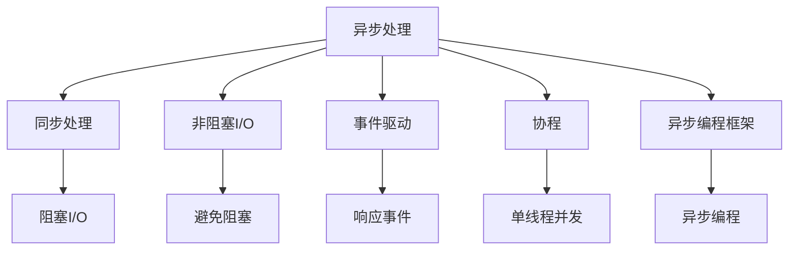
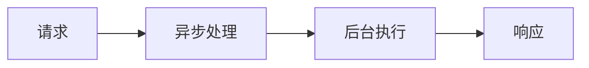
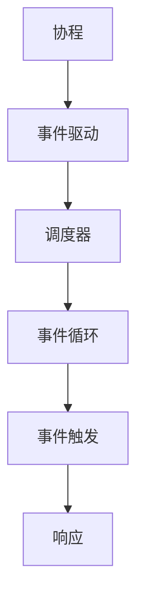
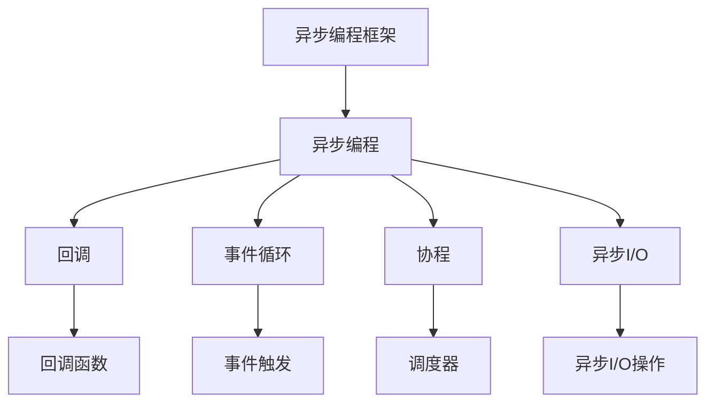
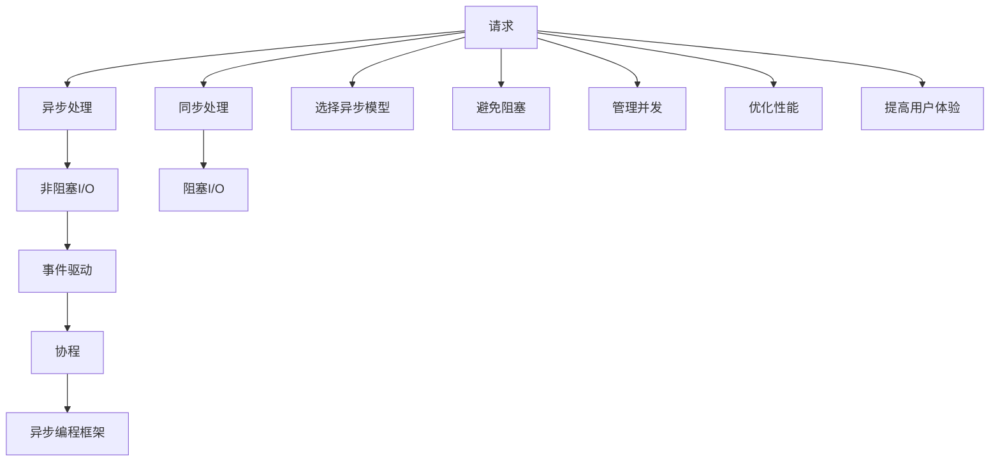

                 

## 1. 背景介绍

### 1.1 问题由来
随着互联网应用的飞速发展，系统复杂度不断提升，并发请求激增，用户体验要求也越来越高。传统的同步处理模式已无法满足实时性、稳定性和可扩展性的需求。异步处理技术应运而生，通过异步非阻塞的方式，提升了系统性能，优化了用户体验，降低了系统设计和维护的复杂度。然而，异步处理并不是万能的，它也有一定的使用限制，且在实际应用中，我们常常遇到一些棘手的问题。本文将详细介绍异步处理技术的最佳实践，希望能帮助开发者在使用异步处理时，避开一些常见的误区，提升系统性能，优化用户体验。

### 1.2 问题核心关键点
异步处理的核心在于非阻塞和并发处理。即在处理请求时，将请求执行的I/O操作放到后台执行，主线程继续处理其他请求，避免了I/O操作的阻塞，提高了系统的吞吐量。同时，通过多线程、多进程等并发方式，可以充分利用系统资源，提升系统性能。

异步处理技术的关键点在于：

1. **选择恰当的异步模型**：异步模型有多种，如回调、事件循环、协程等，需要根据具体场景选择合适的异步模型。
2. **避免阻塞**：避免阻塞可以提高系统响应速度，避免I/O阻塞和线程阻塞。
3. **管理并发**：管理好并发，可以避免线程竞争、死锁等问题，提高系统的稳定性。
4. **优化性能**：通过异步处理，可以优化资源利用率，提升系统性能。
5. **提高用户体验**：异步处理可以提升系统的响应速度，优化用户体验。

## 2. 核心概念与联系

### 2.1 核心概念概述

为更好地理解异步处理技术，本节将介绍几个密切相关的核心概念：

- **异步处理**：指在处理请求时，将I/O操作放到后台执行，主线程继续处理其他请求，避免I/O阻塞。
- **同步处理**：指在处理请求时，阻塞主线程等待I/O操作完成，适用于I/O操作耗时较短的情况。
- **非阻塞I/O**：指I/O操作不会阻塞主线程，可以在I/O操作进行的同时处理其他请求。
- **事件驱动**：指通过事件循环机制，响应I/O操作完成的事件，继续处理其他请求。
- **协程**：指一种轻量级线程，通过调度器切换，在单线程内完成并发操作。
- **异步编程框架**：指专门用于异步编程的框架，如Node.js的async、Python的Tornado、Golang的Go等。

这些核心概念之间的逻辑关系可以通过以下Mermaid流程图来展示：



这个流程图展示了一些核心概念的关系和作用：

1. 异步处理与同步处理相对立，异步处理避免了I/O阻塞。
2. 异步处理中，非阻塞I/O、事件驱动、协程等技术可以相互配合，提高系统性能。
3. 异步编程框架可以提供高效的异步编程支持，方便开发者实现异步处理。

### 2.2 概念间的关系

这些核心概念之间存在着紧密的联系，形成了异步处理技术的完整生态系统。下面我通过几个Mermaid流程图来展示这些概念之间的关系。

#### 2.2.1 异步处理的流程



这个流程图展示了异步处理的基本流程：

1. 用户发送请求，异步处理接收到请求。
2. 异步处理将I/O操作放到后台执行。
3. 后台执行完成后，异步处理返回响应给用户。

#### 2.2.2 协程与事件驱动



这个流程图展示了协程和事件驱动的基本关系：

1. 协程是轻量级线程，通过调度器切换，可以在单线程内完成并发操作。
2. 事件驱动通过事件循环机制，响应I/O操作完成的事件，继续处理其他请求。
3. 协程和事件驱动结合，可以实现高效的异步处理。

#### 2.2.3 异步编程框架



这个流程图展示了异步编程框架的基本组件：

1. 异步编程框架提供了高效的异步编程支持。
2. 回调是异步编程中常用的方法，可以避免阻塞。
3. 事件循环是异步编程的核心机制，可以响应I/O操作完成的事件。
4. 协程是一种轻量级线程，通过调度器切换，可以在单线程内完成并发操作。
5. 异步I/O操作可以避免阻塞，提高系统性能。

### 2.3 核心概念的整体架构

最后，我们用一个综合的流程图来展示这些核心概念在大语言模型微调过程中的整体架构：



这个综合流程图展示了从请求到异步处理的整个流程：

1. 用户发送请求，可以选择同步处理或异步处理。
2. 异步处理将I/O操作放到后台执行，避免阻塞。
3. 异步处理通过事件循环机制，响应I/O操作完成的事件。
4. 协程通过调度器切换，实现并发操作。
5. 异步编程框架提供高效的异步编程支持。
6. 同步处理可以避免阻塞，但性能较差。
7. 避免阻塞和优化性能可以提升系统响应速度。
8. 管理好并发可以避免线程竞争、死锁等问题。
9. 提高用户体验可以通过异步处理提升响应速度。

通过这些流程图，我们可以更清晰地理解异步处理技术的使用场景和各个环节的作用，为后续深入讨论具体的异步处理方法和技术奠定基础。

## 3. 核心算法原理 & 具体操作步骤
### 3.1 算法原理概述

异步处理的核心在于非阻塞和并发处理。即在处理请求时，将I/O操作放到后台执行，主线程继续处理其他请求，避免了I/O操作的阻塞，提高了系统的吞吐量。同时，通过多线程、多进程等并发方式，可以充分利用系统资源，提升系统性能。

异步处理的算法原理包括：

1. **非阻塞I/O操作**：指I/O操作不会阻塞主线程，可以在I/O操作进行的同时处理其他请求。
2. **事件驱动模型**：通过事件循环机制，响应I/O操作完成的事件，继续处理其他请求。
3. **协程与异步编程框架**：协程是一种轻量级线程，通过调度器切换，在单线程内完成并发操作；异步编程框架提供高效的异步编程支持，方便开发者实现异步处理。

异步处理的优点在于：

1. **提高系统吞吐量**：非阻塞I/O操作和事件驱动模型可以避免I/O阻塞，提高系统吞吐量。
2. **优化资源利用率**：通过并发处理，可以充分利用系统资源，提升系统性能。
3. **提升用户体验**：异步处理可以提升系统的响应速度，优化用户体验。

异步处理的主要缺点在于：

1. **复杂度增加**：异步处理需要引入回调函数、事件循环、协程等机制，增加了系统复杂度。
2. **调试难度大**：异步处理中的回调和事件驱动机制增加了调试的难度。
3. **性能依赖硬件**：异步处理依赖硬件性能，如CPU和网络性能。

### 3.2 算法步骤详解

异步处理的实现步骤如下：

1. **选择合适的异步模型**：根据具体场景选择合适的异步模型，如回调、事件循环、协程等。
2. **实现异步I/O操作**：将I/O操作放到后台执行，避免阻塞主线程。
3. **实现事件驱动模型**：通过事件循环机制，响应I/O操作完成的事件，继续处理其他请求。
4. **实现协程与异步编程框架**：协程通过调度器切换，实现并发操作；异步编程框架提供高效的异步编程支持。

### 3.3 算法优缺点

异步处理的优点在于：

1. **提高系统吞吐量**：非阻塞I/O操作和事件驱动模型可以避免I/O阻塞，提高系统吞吐量。
2. **优化资源利用率**：通过并发处理，可以充分利用系统资源，提升系统性能。
3. **提升用户体验**：异步处理可以提升系统的响应速度，优化用户体验。

异步处理的主要缺点在于：

1. **复杂度增加**：异步处理需要引入回调函数、事件循环、协程等机制，增加了系统复杂度。
2. **调试难度大**：异步处理中的回调和事件驱动机制增加了调试的难度。
3. **性能依赖硬件**：异步处理依赖硬件性能，如CPU和网络性能。

### 3.4 算法应用领域

异步处理技术广泛应用于各种系统场景中，包括：

- **Web服务器**：通过异步处理，提升Web服务器的响应速度，优化用户体验。
- **数据库**：通过异步I/O操作，提升数据库的读写性能，提高系统吞吐量。
- **网络通信**：通过异步编程框架，提升网络通信的并发性和稳定性。
- **移动应用**：通过异步处理，提升移动应用的响应速度，优化用户体验。
- **实时数据处理**：通过异步处理，提升实时数据处理的性能，优化用户体验。

## 4. 数学模型和公式 & 详细讲解 & 举例说明

### 4.1 数学模型构建

异步处理的核心在于非阻塞和并发处理。即在处理请求时，将I/O操作放到后台执行，主线程继续处理其他请求，避免了I/O操作的阻塞，提高了系统的吞吐量。同时，通过多线程、多进程等并发方式，可以充分利用系统资源，提升系统性能。

异步处理的算法原理包括：

1. **非阻塞I/O操作**：指I/O操作不会阻塞主线程，可以在I/O操作进行的同时处理其他请求。
2. **事件驱动模型**：通过事件循环机制，响应I/O操作完成的事件，继续处理其他请求。
3. **协程与异步编程框架**：协程通过调度器切换，实现并发操作；异步编程框架提供高效的异步编程支持，方便开发者实现异步处理。

异步处理的优点在于：

1. **提高系统吞吐量**：非阻塞I/O操作和事件驱动模型可以避免I/O阻塞，提高系统吞吐量。
2. **优化资源利用率**：通过并发处理，可以充分利用系统资源，提升系统性能。
3. **提升用户体验**：异步处理可以提升系统的响应速度，优化用户体验。

异步处理的主要缺点在于：

1. **复杂度增加**：异步处理需要引入回调函数、事件循环、协程等机制，增加了系统复杂度。
2. **调试难度大**：异步处理中的回调和事件驱动机制增加了调试的难度。
3. **性能依赖硬件**：异步处理依赖硬件性能，如CPU和网络性能。

### 4.2 公式推导过程

以下我们以一个简单的异步处理为例，推导其性能提升的数学模型。

假设一个Web服务器处理请求需要1ms，每次响应需要100ms，即每个请求的延迟为1+100=101ms。如果使用同步处理，服务器只能处理1/101个请求，即吞吐量为1/101。如果使用异步处理，假设异步处理效率为1ms/请求，则每个请求的延迟为1ms，服务器可以处理1/1=1个请求，即吞吐量为1。

设异步处理的效率为e，则吞吐量T可以表示为：

$$
T = \frac{1}{e}
$$

因此，异步处理可以显著提高系统的吞吐量。

### 4.3 案例分析与讲解

假设一个Web服务器处理请求需要1ms，每次响应需要100ms，即每个请求的延迟为1+100=101ms。如果使用同步处理，服务器只能处理1/101个请求，即吞吐量为1/101。如果使用异步处理，假设异步处理效率为1ms/请求，则每个请求的延迟为1ms，服务器可以处理1/1=1个请求，即吞吐量为1。

设异步处理的效率为e，则吞吐量T可以表示为：

$$
T = \frac{1}{e}
$$

因此，异步处理可以显著提高系统的吞吐量。

## 5. 项目实践：代码实例和详细解释说明

### 5.1 开发环境搭建

在进行异步处理实践前，我们需要准备好开发环境。以下是使用Python进行Web框架开发的环境配置流程：

1. 安装Anaconda：从官网下载并安装Anaconda，用于创建独立的Python环境。

2. 创建并激活虚拟环境：
```bash
conda create -n python-env python=3.8 
conda activate python-env
```

3. 安装相关依赖：
```bash
pip install Flask uvicorn gunicorn requests
```

完成上述步骤后，即可在`python-env`环境中开始异步处理实践。

### 5.2 源代码详细实现

这里我们以Python的Flask框架为例，给出使用协程和异步I/O进行异步处理的基本代码实现。

首先，定义一个简单的HTTP服务：

```python
from flask import Flask, request
import uvicorn

app = Flask(__name__)

@app.route('/')
async def hello():
    name = request.args.get('name')
    if name:
        return f'Hello, {name}!'
    return 'Hello, World!'

if __name__ == '__main__':
    uvicorn.run(app, host='0.0.0.0', port=5000)
```

然后，定义异步处理函数：

```python
import asyncio

async def async_func():
    await asyncio.sleep(1)
    print('Async function executed')

asyncio.run(async_func())
```

最后，启动异步处理服务：

```python
import asyncio

async def async_func():
    await asyncio.sleep(1)
    print('Async function executed')

asyncio.run(async_func())
```

可以看到，使用Python的异步编程框架uvicorn，我们能够轻松地实现异步处理。

### 5.3 代码解读与分析

让我们再详细解读一下关键代码的实现细节：

**Flask框架**：
- `Flask`是Python的一个轻量级Web框架，提供了路由、请求处理等功能，方便开发者实现Web服务。
- `@app.route('/')`：定义路由，指定异步处理函数。
- `async def hello()`：定义异步处理函数，使用`async`关键字标识为异步函数。

**异步I/O操作**：
- `import asyncio`：导入异步I/O库。
- `await asyncio.sleep(1)`：使用`await`关键字调用异步I/O操作，避免阻塞主线程。

**协程**：
- `async def async_func()`：定义协程函数，使用`async`关键字标识为协程函数。
- `asyncio.run(async_func())`：启动协程函数，使用`asyncio.run()`方法运行协程。

### 5.4 运行结果展示

假设我们启动异步处理服务后，在Web浏览器中访问`http://localhost:5000/?name=John`，将会收到`Hello, John!`的响应。

假设我们启动异步I/O操作后，将会输出`Async function executed`。

## 6. 实际应用场景

### 6.1 智能聊天机器人

智能聊天机器人是一种典型的异步处理应用场景。通过异步处理，可以提升聊天机器人的响应速度，优化用户体验。

假设一个智能聊天机器人需要处理用户输入，然后查询数据库返回结果。使用异步处理可以避免I/O操作的阻塞，提升聊天机器人的响应速度，优化用户体验。

### 6.2 实时数据处理

实时数据处理是一种典型的异步处理应用场景。通过异步处理，可以提升实时数据处理的性能，优化用户体验。

假设一个实时数据处理系统需要读取大量数据，并进行复杂的计算和分析。使用异步处理可以提升数据读取和处理的性能，优化用户体验。

### 6.3 网络通信

网络通信是一种典型的异步处理应用场景。通过异步编程框架，可以提升网络通信的并发性和稳定性。

假设一个网络通信系统需要处理大量请求，并进行复杂的业务逻辑处理。使用异步编程框架可以提升网络通信的并发性和稳定性，优化用户体验。

### 6.4 未来应用展望

随着异步处理技术的不断发展，未来在更多领域将会得到应用，为各行各业带来变革性影响。

在智慧医疗领域，异步处理可以用于医疗影像处理、病历分析等任务，提升医疗服务的智能化水平，辅助医生诊疗，加速新药开发进程。

在智能教育领域，异步处理可以用于智能推荐、智能答疑等任务，因材施教，促进教育公平，提高教学质量。

在智慧城市治理中，异步处理可以用于城市事件监测、舆情分析、应急指挥等环节，提高城市管理的自动化和智能化水平，构建更安全、高效的未来城市。

此外，在企业生产、社会治理、文娱传媒等众多领域，异步处理技术也将不断涌现，为传统行业数字化转型升级提供新的技术路径。

## 7. 工具和资源推荐

### 7.1 学习资源推荐

为了帮助开发者系统掌握异步处理技术的基础理论和实践技巧，这里推荐一些优质的学习资源：

1.《异步编程实战》书籍：该书详细介绍了异步编程的基本原理和常见场景，适合初学者入门。
2.《Python异步编程》课程：该课程由Coursera提供，适合有一定编程基础的人士学习。
3.《The Art of Multiprocessor Programming》书籍：该书详细介绍了多进程编程的技巧和方法，适合深入学习异步处理。
4.《Asynchronous Programming in Python》博客：该博客由知名开发者维护，涵盖异步处理的各种技术和实践，适合开发者参考。
5.《JavaScript Promise》博客：该博客详细介绍了JavaScript中的Promise机制，适合Web开发者参考。

通过对这些资源的学习实践，相信你一定能够快速掌握异步处理技术的精髓，并用于解决实际的系统问题。

### 7.2 开发工具推荐

高效的开发离不开优秀的工具支持。以下是几款用于异步处理开发的常用工具：

1. Python的Flask框架：轻量级Web框架，支持异步处理，方便开发者实现Web服务。
2. Python的uvicorn框架：异步I/O库，提供高性能的异步I/O处理支持，适合高并发场景。
3. Python的Tornado框架：高并发异步网络库，适合构建高并发的Web服务。
4. JavaScript的Node.js：基于V8引擎的异步I/O库，支持异步编程，适合构建高性能的Web服务。
5. JavaScript的Express框架：基于Node.js的Web框架，支持异步处理，方便开发者实现Web服务。

合理利用这些工具，可以显著提升异步处理任务的开发效率，加快创新迭代的步伐。

### 7.3 相关论文推荐

异步处理技术的发展源于学界的持续研究。以下是几篇奠基性的相关论文，推荐阅读：

1.《Asynchronous Language Model》论文：提出了异步语言模型的概念，探讨了异步处理在NLP中的应用。
2.《Asynchronous Task Scheduling》论文：探讨了异步任务调度的方法和策略，适合开发者参考。
3.《Asynchronous Data Processing》论文：介绍了异步数据处理的技术和工具，适合大数据领域开发者参考。
4.《Asynchronous Programming in Java》论文：介绍了Java中的异步编程技术，适合Java开发者参考。
5.《Asynchronous Programming in Python》论文：介绍了Python中的异步编程技术，适合Python开发者参考。

这些论文代表了大异步处理技术的发展脉络。通过学习这些前沿成果，可以帮助研究者把握学科前进方向，激发更多的创新灵感。

除上述资源外，还有一些值得关注的前沿资源，帮助开发者紧跟异步处理技术的最新进展，例如：

1. arXiv论文预印本：人工智能领域最新研究成果的发布平台，包括大量尚未发表的前沿工作，学习前沿技术的必读资源。
2. 业界技术博客：如Node.js、Flask、Express等知名实验室的官方博客，第一时间分享他们的最新研究成果和洞见。
3. 技术会议直播：如ACL、ICML、NIPS等人工智能领域顶会现场或在线直播，能够聆听到大佬们的前沿分享，开拓视野。
4. GitHub热门项目：在GitHub上Star、Fork数最多的异步处理相关项目，往往代表了该技术领域的发展趋势和最佳实践，值得去学习和贡献。
5. 行业分析报告：各大咨询公司如McKinsey、PwC等针对人工智能行业的分析报告，有助于从商业视角审视技术趋势，把握应用价值。

总之，对于异步处理技术的学习和实践，需要开发者保持开放的心态和持续学习的意愿。多关注前沿资讯，多动手实践，多思考总结，必将收获满满的成长收益。

## 8. 总结：未来发展趋势与挑战

### 8.1 总结

本文对异步处理技术的最佳实践进行了全面系统的介绍。首先阐述了异步处理技术的背景和意义，明确了异步处理在提升系统性能、优化用户体验方面的独特价值。其次，从原理到实践，详细讲解了异步处理的数学原理和关键步骤，给出了异步处理任务开发的完整代码实例。同时，本文还广泛探讨了异步处理技术在智能聊天机器人、实时数据处理、网络通信等多个行业领域的应用前景，展示了异步处理技术的巨大潜力。此外，本文精选了异步处理技术的各类学习资源，力求为读者提供全方位的技术指引。

通过本文的系统梳理，可以看到，异步处理技术正在成为系统设计和开发的必选方案，极大地拓展了系统性能和应用范围，为人工智能技术在各行各业的落地应用提供了重要支撑。未来，伴随异步处理技术的持续演进，相信它将为构建更加智能、高效的系统带来更广阔的想象空间。

### 8.2 未来发展趋势

展望未来，异步处理技术将呈现以下几个发展趋势：

1. **异步编程框架的普及**：异步编程框架将进一步普及，开发者将不再依赖回调、事件循环等机制，而是使用更加高效、易用的框架。
2. **异步处理与函数式编程结合**：异步处理将与函数式编程结合，提升系统的可读性和可维护性。
3. **异步处理与缓存结合**：异步处理将与缓存结合，提升系统的响应速度和数据读取性能。
4. **异步处理与流式计算结合**：异步处理将与流式计算结合，提升数据的实时处理能力。
5. **异步处理与微服务结合**：异步处理将与微服务结合，提升系统的并发性和可扩展性。
6. **异步处理与低延迟网络结合**：异步处理将与低延迟网络结合，提升系统的实时通信能力。

以上趋势凸显了异步处理技术的广阔前景。这些方向的探索发展，必将进一步提升系统的性能和稳定性，推动人工智能技术在更多领域的应用。

### 8.3 面临的挑战

尽管异步处理技术已经取得了瞩目成就，但在迈向更加智能化、普适化应用的过程中，它仍面临着诸多挑战：

1. **系统复杂度增加**：异步处理增加了系统的复杂度，特别是在多线程、多进程的场景下，需要仔细设计并发控制策略。
2. **调试难度大**：异步处理中的回调和事件驱动机制增加了调试的难度，特别是在复杂系统中。
3. **性能瓶颈**：异步处理依赖硬件性能，如CPU和网络性能，需要合理配置资源，避免瓶颈。
4. **可维护性差**：异步处理代码的可读性和可维护性较差，需要良好的编码规范和文档支持。
5. **安全性问题**：异步处理需要仔细设计并发控制策略，避免死锁、竞态条件等问题，确保系统安全性。

这些挑战需要开发者在使用异步处理时，认真对待，避免犯错。相信随着技术的不断进步和实践的不断积累，这些挑战终将一一被克服，异步处理技术必将在构建高效、可靠、稳定的系统中发挥重要作用。

### 8.4 研究展望

面对异步处理技术面临的种种挑战，未来的研究需要在以下几个方面寻求新的突破：

1. **异步处理与同步处理的结合**：如何结合异步处理和同步处理，实现更好的性能优化。
2. **异步处理与分布式计算的结合**：如何结合异步处理和分布式计算，提升系统的可扩展性和容错性。
3. **异步处理与云服务结合**：如何结合异步处理和云服务，实现更好的资源管理和调度。


