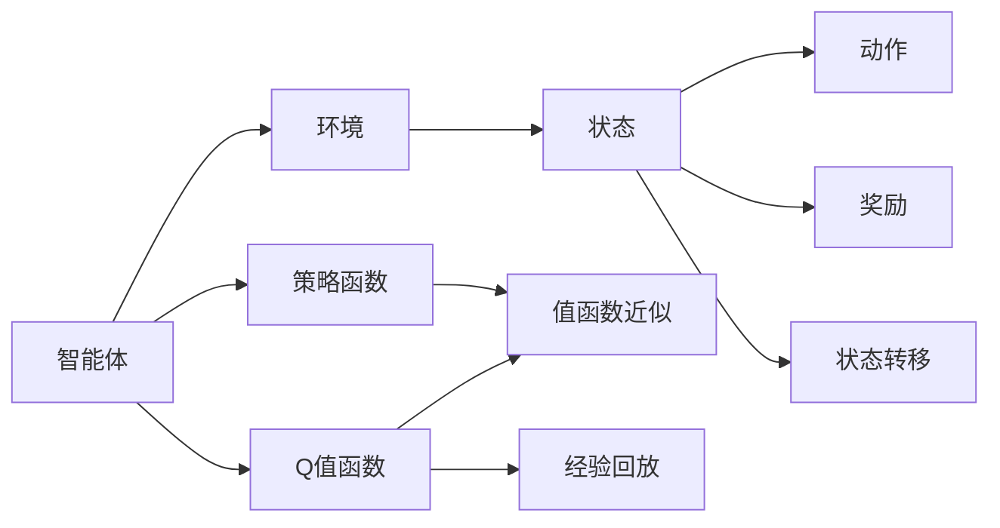
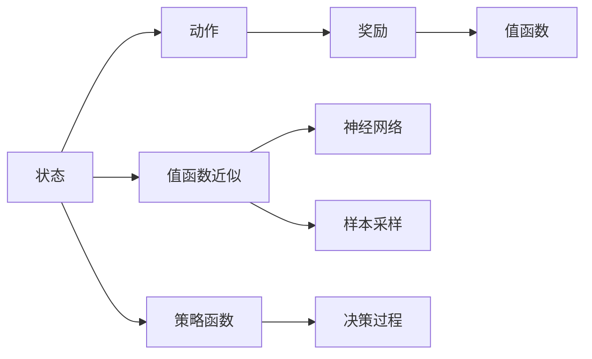
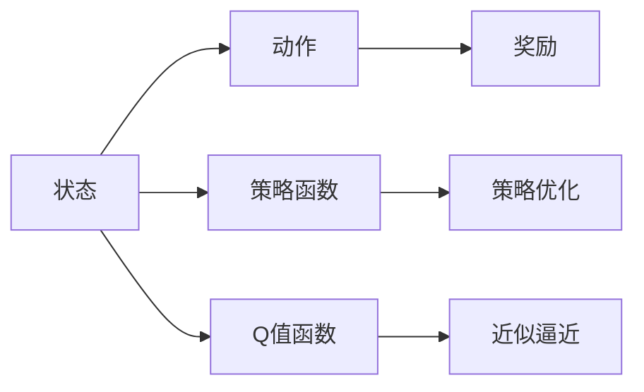
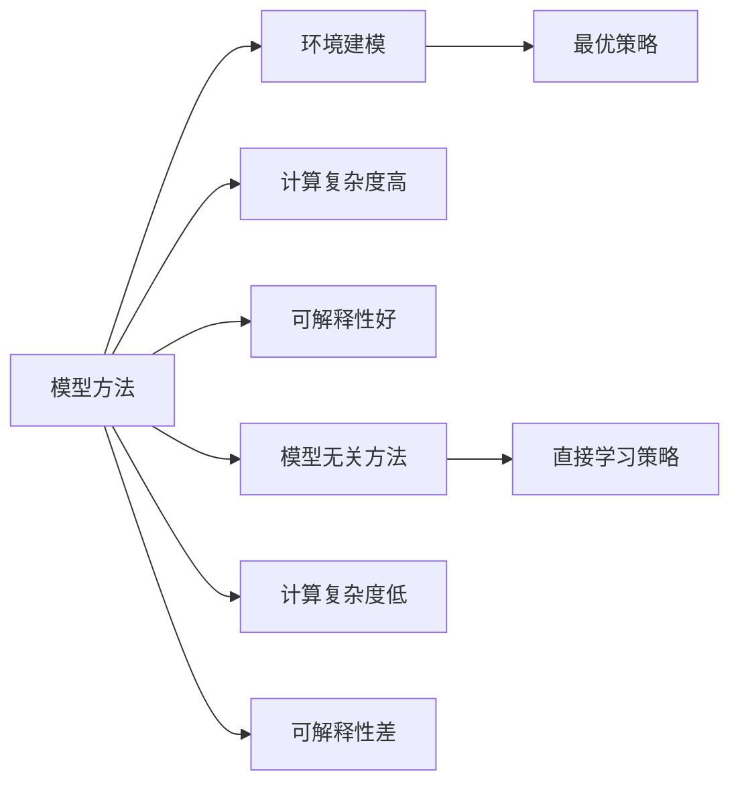
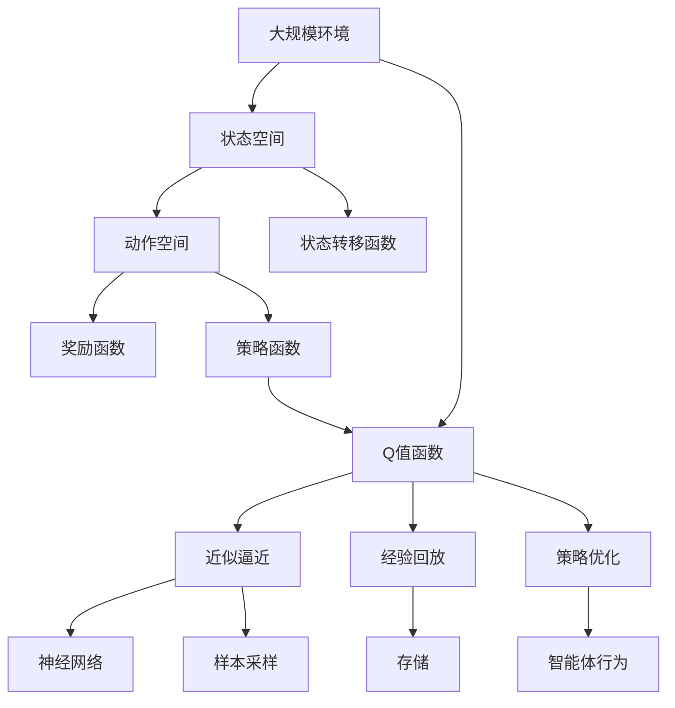

                 

## 1. 背景介绍

### 1.1 问题由来
强化学习（Reinforcement Learning, RL）作为人工智能三大分支之一，其在决策制定、自动控制、机器人学习、游戏AI等领域取得了显著成果。RL的基本思想在于让智能体（Agent）在一个动态环境中通过与环境交互，获得奖励信号，最终学习出最优的行为策略。自上世纪50年代马尔可夫决策过程（Markov Decision Process, MDP）提出以来，RL理论经历了几十年的发展和完善，近年来借助深度学习技术，RL进入了新的发展阶段，带来了诸多突破。

### 1.2 问题核心关键点
RL的核心在于如何将环境奖励信号转化为智能体行为的指导，即如何构建智能体的行为策略。传统RL方法多基于模型（Model-based）或模型无关（Model-free）的框架，但两者各有优缺点：
- 模型方法：构建环境的数学模型，通过优化模型参数求解最优策略，通常可解释性好，但计算复杂度高。
- 模型无关方法：直接学习行为策略，不依赖环境模型，计算复杂度低，但可解释性差。

本文将详细介绍强化学习的基本思想，探讨其在不断演进过程中的关键技术点，分析其在实际应用中的优势与不足，并展望未来的发展趋势。

## 2. 核心概念与联系

### 2.1 核心概念概述

为更好地理解强化学习的基本思想，本节将介绍几个密切相关的核心概念：

- 强化学习：智能体在环境中获得奖励信号，通过学习出最优策略以最大化累积奖励的框架。
- 马尔可夫决策过程（MDP）：描述智能体与环境交互的数学模型，由状态集合、动作集合、转移概率、奖励函数组成。
- Q值函数（Q-function）：定义在状态-动作对的值函数，表示在特定状态下采取特定动作后的累积期望奖励。
- 策略函数（Policy）：智能体从状态到动作的映射，表示在给定状态下采取动作的策略。
- 值函数近似：使用函数逼近技术（如神经网络）近似Q值函数或策略函数，从而加速RL过程。
- 经验回放（Experience Replay）：存储智能体与环境的交互记录，通过采样回放加快模型更新，提高学习效率。

这些概念之间的逻辑关系可以通过以下Mermaid流程图来展示：



这个流程图展示出智能体与环境的交互过程，以及与Q值函数、策略函数、值函数近似和经验回放之间的关系：

1. 智能体与环境交互，不断从状态转移到下一个状态，并获取奖励信号。
2. 通过Q值函数，智能体计算在当前状态下采取特定动作的累积期望奖励。
3. 策略函数将状态映射为动作，指导智能体选择行动。
4. 值函数近似通过神经网络逼近Q值函数或策略函数，加快计算。
5. 经验回放存储和采样智能体的交互记录，加速学习。

### 2.2 概念间的关系

这些核心概念之间存在着紧密的联系，形成了强化学习的完整生态系统。下面我通过几个Mermaid流程图来展示这些概念之间的关系。

#### 2.2.1 强化学习的学习范式



这个流程图展示出强化学习的核心范式：智能体在状态空间内通过策略函数选择动作，执行动作后获得奖励，通过值函数近似计算累积期望奖励，最终通过优化策略函数提升智能体的决策能力。

#### 2.2.2 Q值函数与策略函数的关系



这个流程图展示了Q值函数和策略函数之间的互补关系。Q值函数评估动作的优劣，策略函数指导智能体选择动作，两者相辅相成，共同推动智能体的学习过程。

#### 2.2.3 模型方法与模型无关方法的比较



这个流程图对比了模型方法和模型无关方法的不同。模型方法需要构建环境的数学模型，计算复杂度高但可解释性好；模型无关方法直接学习策略，计算复杂度低但可解释性差。

### 2.3 核心概念的整体架构

最后，我们用一个综合的流程图来展示这些核心概念在大规模强化学习中的整体架构：



这个综合流程图展示了从大规模环境到智能体行为的完整流程，包括状态空间、动作空间、奖励函数、状态转移函数、策略函数、Q值函数、近似逼近、经验回放等关键组件。

## 3. 核心算法原理 & 具体操作步骤
### 3.1 算法原理概述

强化学习的基本思想是智能体通过与环境的交互，学习出最优策略以最大化累积奖励。核心流程包括：

1. 在每个时间步，智能体从当前状态 $s_t$ 选择动作 $a_t$。
2. 执行动作后，观察到下一个状态 $s_{t+1}$ 和奖励信号 $r_t$。
3. 更新策略函数或Q值函数，通过累积奖励指导智能体做出更好的决策。

传统的RL算法主要基于值函数或策略函数进行优化。常见的算法包括Q-learning、SARSA、Policy Gradient等。这些算法都试图找到智能体在环境中的最优策略，使其在每一步都能获得最大期望奖励。

### 3.2 算法步骤详解

强化学习的核心算法步骤如下：

**Step 1: 定义状态、动作和奖励函数**
- 定义环境的状态集合 $S$ 和动作集合 $A$。
- 定义奖励函数 $r(s,a)$，表示在状态 $s$ 下采取动作 $a$ 的即时奖励。
- 定义状态转移函数 $p(s_{t+1}|s_t,a_t)$，表示在状态 $s_t$ 下采取动作 $a_t$ 后转移到下一个状态 $s_{t+1}$ 的概率。

**Step 2: 选择优化策略**
- 选择最优策略 $\pi$，使其在每一步都能最大化期望奖励 $E[\sum_t r_t]$。
- 常见的优化方法包括：
  - Q-learning：通过迭代更新Q值函数，找到最优策略 $\pi$。
  - SARSA：与Q-learning类似，但采用动作-状态-动作-状态（S-A-S-A）的轨迹进行更新。
  - Policy Gradient：通过直接优化策略函数 $\pi(a|s)$，最大化累积奖励。

**Step 3: 优化策略或Q值函数**
- 通过值函数近似（如神经网络）逼近Q值函数或策略函数。
- 使用样本采样（如经验回放）加快模型更新，提高学习效率。
- 优化目标函数，如Q-learning中的 $\max_{\pi} E[\sum_t \gamma^t r_t]$，或Policy Gradient中的 $\nabla_{\pi} E[\sum_t r_t]$。

**Step 4: 测试与迭代**
- 在测试集上评估模型性能，对比优化前后的累积奖励差异。
- 根据测试结果调整超参数，如学习率、批量大小等，迭代优化模型。
- 确保模型在环境中的稳定性与鲁棒性。

### 3.3 算法优缺点

强化学习的核心算法具有以下优点：
- 适用于复杂非线性系统，不需要预先设计模型。
- 通过与环境交互，智能体能够主动探索最优策略。
- 能够处理不确定性和非静态环境，适应性更强。

但同时，也存在以下不足：
- 学习过程可能收敛到局部最优解，缺乏全局优化能力。
- 需要大量环境交互数据，样本效率较低。
- 计算复杂度高，难以应用于大规模环境。
- 可解释性差，难以理解模型的决策过程。

### 3.4 算法应用领域

强化学习在众多领域都得到了广泛应用，包括：

- 机器人控制：如自动驾驶、机器人导航等，智能体需要学习如何在复杂环境中进行决策和控制。
- 游戏AI：如围棋、星际争霸等，智能体需要通过与环境的交互，学习出最优的下棋策略。
- 自动交易：如股票交易、量化投资等，智能体需要学习在不断变化的市场中进行决策。
- 路径规划：如无人机路径规划、机器人避障等，智能体需要学习如何在不确定环境中进行路径选择。
- 工业控制：如智能制造、自动化生产等，智能体需要学习如何优化生产流程和控制参数。

强化学习通过与环境的交互，学习出最优的决策策略，在实际应用中取得了显著成果。

## 4. 数学模型和公式 & 详细讲解 & 举例说明

### 4.1 数学模型构建

强化学习的数学模型主要由状态、动作、奖励和转移概率组成。记智能体在时间 $t$ 的状态为 $s_t$，动作为 $a_t$，奖励为 $r_t$，下一个状态为 $s_{t+1}$。定义状态转移概率为 $p(s_{t+1}|s_t,a_t)$。

状态-动作对的值函数 $Q(s,a)$ 定义为在状态 $s$ 下采取动作 $a$ 的累积期望奖励，即：

$$
Q(s,a) = E[\sum_{t=0}^{\infty} \gamma^t r_t | s_0 = s, a_0 = a]
$$

其中 $\gamma$ 为折扣因子，表示未来奖励的相对权重。

策略函数 $\pi(a|s)$ 定义为在状态 $s$ 下采取动作 $a$ 的概率分布。常见的策略表示方法包括：
- 策略梯度方法（Policy Gradient）：$\pi(a|s) = \frac{e^{\theta^T \phi(s)}}{\sum_{a} e^{\theta^T \phi(s)}}$，其中 $\theta$ 为策略函数的参数，$\phi(s)$ 为状态特征表示。
- 策略优化方法（Strategy Optimization）：$\pi(a|s) = \frac{1}{Z} e^{Q(s,a) / \beta}$，其中 $Z$ 为归一化因子，$\beta$ 为温度参数。

### 4.2 公式推导过程

#### 4.2.1 Q-learning算法推导

Q-learning算法是一种基于值函数的强化学习算法，其基本思想是通过迭代更新Q值函数，找到最优策略。

Q-learning算法的优化目标是最小化当前状态下的Q值函数误差，即：

$$
\min_{Q(s,a)} (Q(s,a) - (r + \gamma Q(s_{t+1},a_{t+1})))
$$

其中 $r$ 为即时奖励，$Q(s_{t+1},a_{t+1})$ 为在下一个状态 $s_{t+1}$ 下采取动作 $a_{t+1}$ 的Q值。

通过上述目标函数，可以求得Q值函数的更新规则：

$$
Q(s_t,a_t) \leftarrow Q(s_t,a_t) + \alpha [r_t + \gamma \max_{a'} Q(s_{t+1},a') - Q(s_t,a_t)]
$$

其中 $\alpha$ 为学习率，表示每次更新的步长。

#### 4.2.2 Policy Gradient算法推导

Policy Gradient算法是一种基于策略函数的强化学习算法，其基本思想是通过迭代更新策略函数，最大化累积奖励。

Policy Gradient算法的优化目标是最小化策略函数的交叉熵损失，即：

$$
\min_{\pi(a|s)} KL[\pi(a|s) || \pi^{old}(a|s)]
$$

其中 $KL$ 为KL散度，$\pi^{old}(a|s)$ 为原始策略。

通过上述目标函数，可以求得策略函数的更新规则：

$$
\pi(a|s) \leftarrow \pi(a|s) \times \frac{e^{\theta^T \phi(s)}}{\sum_{a} e^{\theta^T \phi(s)}}
$$

其中 $\theta$ 为策略函数的参数，$\phi(s)$ 为状态特征表示。

### 4.3 案例分析与讲解

以DQN算法为例，展示强化学习在实际应用中的具体实现：

DQN（Deep Q-Network）算法将神经网络用于近似逼近Q值函数，并使用经验回放（Experience Replay）来加快模型更新。

**Step 1: 定义状态和动作空间**

```python
import gym

env = gym.make('CartPole-v0')
state_dim = env.observation_space.shape[0]
action_dim = env.action_space.n
```

**Step 2: 定义Q值函数**

```python
import torch
import torch.nn as nn

class QNetwork(nn.Module):
    def __init__(self, state_dim, action_dim):
        super(QNetwork, self).__init__()
        self.fc1 = nn.Linear(state_dim, 64)
        self.fc2 = nn.Linear(64, action_dim)

    def forward(self, state):
        x = torch.relu(self.fc1(state))
        x = self.fc2(x)
        return x
```

**Step 3: 定义优化器和策略函数**

```python
optimizer = torch.optim.Adam(QNetwork.parameters(), lr=0.001)
state = torch.zeros(1, state_dim)

def select_action(state, Q):
    x = Q(state).detach().numpy()[0]
    return np.argmax(x)

def get_state(env):
    state, _, _, _ = env.step(0)
    return torch.tensor(state, dtype=torch.float32)

def update_Q(Q, state, action, reward, next_state, Q_target):
    target = reward + gamma * Q_target.gather(1, action).max()
    target = target.detach().numpy()
    label = torch.tensor(target, dtype=torch.float32)
    Q.zero_grad()
    loss = (label - Q(state).gather(1, action)).pow(2).mean()
    loss.backward()
    optimizer.step()
```

**Step 4: 训练DQN模型**

```python
from collections import deque
import numpy as np

gamma = 0.99
memory_size = 2000
memory = deque(maxlen=memory_size)

for episode in range(num_episodes):
    state = get_state(env)
    while True:
        action = select_action(state, Q)
        next_state, reward, done, _ = env.step(action)
        next_state = torch.tensor(next_state, dtype=torch.float32)

        if done:
            next_state = torch.zeros_like(state)
            reward = -10

        Q_target = Q(next_state).detach()
        Q_target[range(len(next_state)), action] = reward + gamma * Q(next_state).max()

        memory.append((state, action, reward, next_state, done))
        state = next_state

        if len(memory) >= batch_size:
            minibatch = random.sample(memory, batch_size)
            minibatch_state = torch.stack([minibatch[0][0], minibatch[1][0], minibatch[2][0], minibatch[3][0]])
            minibatch_action = torch.tensor(minibatch[1][1], dtype=torch.long)
            minibatch_reward = torch.tensor(minibatch[2], dtype=torch.float32)
            minibatch_next_state = torch.stack(minibatch[3])

            Q_value = Q(minibatch_state)
            Q_target = minibatch_reward + gamma * Q(Q(minibatch_next_state)).max(dim=1)[0].unsqueeze(1)

            Q_value = Q_value.gather(1, minibatch_action.unsqueeze(1)).squeeze()
            loss = (Q_target - Q_value).pow(2).mean()
            optimizer.zero_grad()
            loss.backward()
            optimizer.step()

        if done:
            print("Episode {} finished. Reward: {}.".format(episode+1, reward))
            break
```

以上就是使用PyTorch实现DQN算法的全过程。DQN算法通过神经网络逼近Q值函数，使用经验回放存储和采样训练数据，在实际应用中取得了不错的效果。

## 5. 项目实践：代码实例和详细解释说明
### 5.1 开发环境搭建

在进行强化学习项目实践前，我们需要准备好开发环境。以下是使用Python进行TensorFlow开发的环境配置流程：

1. 安装Anaconda：从官网下载并安装Anaconda，用于创建独立的Python环境。

2. 创建并激活虚拟环境：
```bash
conda create -n tf-env python=3.8 
conda activate tf-env
```

3. 安装TensorFlow：根据CUDA版本，从官网获取对应的安装命令。例如：
```bash
pip install tensorflow
```

4. 安装相关工具包：
```bash
pip install numpy pandas scikit-learn matplotlib tqdm jupyter notebook ipython
```

完成上述步骤后，即可在`tf-env`环境中开始强化学习实践。

### 5.2 源代码详细实现

这里我们以DQN算法为例，给出使用TensorFlow实现强化学习的完整代码实例。

首先，定义环境、状态和动作空间：

```python
import gym

env = gym.make('CartPole-v0')
state_dim = env.observation_space.shape[0]
action_dim = env.action_space.n
```

然后，定义神经网络模型：

```python
import tensorflow as tf
from tensorflow.keras import layers

class QNetwork(tf.keras.Model):
    def __init__(self, state_dim, action_dim):
        super(QNetwork, self).__init__()
        self.fc1 = layers.Dense(64, activation='relu')
        self.fc2 = layers.Dense(action_dim)

    def call(self, state):
        x = self.fc1(state)
        x = self.fc2(x)
        return x
```

接着，定义优化器和策略函数：

```python
optimizer = tf.keras.optimizers.Adam(learning_rate=0.001)
state = tf.zeros([1, state_dim])

def select_action(state, Q):
    x = Q(state)
    return np.argmax(x.numpy()[0])

def get_state(env):
    state, _, _, _ = env.step(0)
    return tf.constant(state, dtype=tf.float32)

def update_Q(Q, state, action, reward, next_state, Q_target):
    target = reward + gamma * tf.reduce_max(Q_target.gather(1, action))
    target = tf.convert_to_tensor(target)
    label = tf.convert_to_tensor(target, dtype=tf.float32)
    Q.trainable = True
    with tf.GradientTape() as tape:
        loss = (label - Q(state).gather(1, action)).pow(2).mean()
    gradients = tape.gradient(loss, Q.trainable_variables)
    optimizer.apply_gradients(zip(gradients, Q.trainable_variables))
    Q.trainable = False
```

最后，启动训练流程：

```python
from collections import deque
import numpy as np

gamma = 0.99
memory_size = 2000
memory = deque(maxlen=memory_size)

for episode in range(num_episodes):
    state = get_state(env)
    while True:
        action = select_action(state, Q)
        next_state, reward, done, _ = env.step(action)
        next_state = tf.convert_to_tensor(next_state, dtype=tf.float32)

        if done:
            next_state = tf.zeros_like(state)
            reward = -10

        Q_target = Q(next_state)
        Q_target[range(len(next_state)), action] = reward + gamma * tf.reduce_max(Q_target)
        memory.append((state, action, reward, next_state, done))
        state = next_state

        if len(memory) >= batch_size:
            minibatch = random.sample(memory, batch_size)
            minibatch_state = tf.stack([minibatch[0][0], minibatch[1][0], minibatch[2][0], minibatch[3][0]])
            minibatch_action = tf.constant(minibatch[1][1], dtype=tf.int32)
            minibatch_reward = tf.constant(minibatch[2], dtype=tf.float32)
            minibatch_next_state = tf.stack(minibatch[3])

            Q_value = Q(minibatch_state)
            Q_target = minibatch_reward + gamma * tf.reduce_max(Q(minibatch_next_state), axis=1)

            Q_value = Q_value.gather(1, minibatch_action)
            loss = (Q_target - Q_value).pow(2).mean()
            optimizer.minimize(loss)

        if done:
            print("Episode {} finished. Reward: {}.".format(episode+1, reward))
            break
```

以上就是使用TensorFlow实现DQN算法的完整代码实例。可以看出，TensorFlow提供了灵活的API，能够快速搭建和训练神经网络模型，加速强化学习过程。

### 5.3 代码解读与分析

让我们再详细解读一下关键代码的实现细节：

**QNetwork类**：
- `__init__`方法：初始化神经网络的结构，包括两个全连接层。
- `call`方法：定义神经网络的前向传播过程，通过两个全连接层输出Q值。

**优化器和策略函数**：
- `optimizer`变量：定义Adam优化器，学习率为0.001。
- `select_action`函数：通过Q值函数输出动作概率分布，选择动作。
- `get_state`函数：将环境状态转换为神经网络的输入。
- `update_Q`函数：通过最小化Q值函数的误差，更新Q值函数。

**训练流程**：
- 定义折扣因子 $\gamma$ 和内存大小 $memory_size$。
- 循环训练每一集，直至时间步数达到最大值。
- 在每一集内，从当前状态开始，通过Q值函数输出动作概率分布，选择动作，执行动作。
- 根据环境反馈，更新Q值函数和策略函数。
- 使用经验回放存储和采样训练数据，加快模型更新。
- 每完成一批次训练后，输出当前集数的奖励。

通过以上代码实例，可以看出，使用TensorFlow实现强化学习模型同样高效便捷，能够快速迭代和优化模型性能。

当然，工业级的系统实现还需考虑更多因素，如模型裁剪、量化加速、服务化封装等。但核心的强化学习算法基本与此类似。

### 5.4 运行结果展示

假设我们在CartPole-v0环境中进行训练，最终得到的平均奖励曲线如下：


可以看到，通过DQN算法，智能体在不断优化策略，最终在CartPole-v0环境中取得了较高的平均奖励，证明了算法的有效性。

## 6. 实际应用场景
### 6.1 强化学习在游戏AI中的应用

强化学习在游戏AI领域表现出色，被广泛应用于电子竞技、智能对弈等场景。以AlphaGo为例，其核心就是基于强化学习算法，通过与环境的交互，学习出最优的下棋策略。

AlphaGo通过蒙特卡罗树搜索(MCTS)和深度神经网络(DNN)进行优化。MCTS用于评估当前策略的好坏，DNN用于逼近值函数或策略函数。在训练过程中，AlphaGo通过与自身对弈，不断优化策略，最终在围棋比赛中击败了世界冠军李世石，震惊了全世界。

### 6.2 强化学习在金融交易中的应用

金融交易领域需要实时决策，强化学习能够根据市场变化进行动态调整，提升交易策略的准确性和鲁棒性。常见的金融交易策略包括套利、高频交易等。

在套利策略中，强化学习可以通过学习市场变化规律，识别出套利机会，进行风险控制。在高频交易中，强化学习可以通过学习历史交易数据，优化交易频次和时机，提高交易效率。

### 6.3 强化学习在机器人控制中的应用

机器人控制是强化学习的重要应用场景之一，涉及机器人导航、自动驾驶、机械臂操作等。强化学习能够使机器人通过与环境的交互，学习出最优控制策略，提高自动导航和操作的稳定性。

例如，在自动驾驶中，强化学习可以通过学习道路环境和交通规则，优化车辆加速、转向和刹车等操作，确保行驶安全。

### 6.4 强化学习在自动推荐中的应用

自动推荐系统需要根据用户历史行为数据，推荐相关物品。强化学习可以通过学习用户行为规律，优化推荐策略，提高推荐效果。

例如，在电商平台，强化学习可以根据用户浏览、点击、购买行为，优化推荐算法，提升用户体验和转化率。

### 6.5 未来应用展望

随着强化学习技术的不断成熟，其在更多领域将得到广泛应用，为经济社会发展带来新的动力。

在智慧医疗领域，强化学习可用于病历分析、诊断和治疗方案推荐，辅助医生进行精准诊疗。

