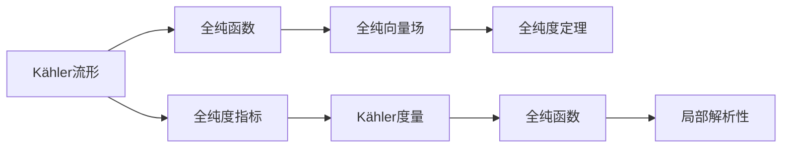
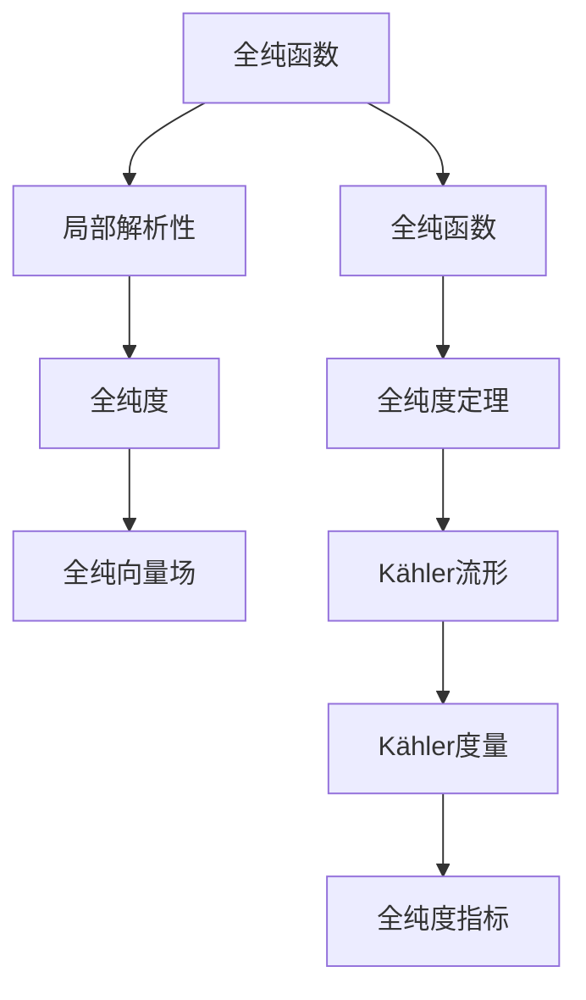

                 

# 微积分中的Kähler流形

> 关键词：Kähler流形, 复几何, 局部同构, 全纯函数, 全纯复数, 全纯向量场, 全纯度, 全纯流形, 度量, 全纯度引理, 全纯度定理

## 1. 背景介绍

### 1.1 问题由来

微积分是数学的一个基础分支，涉及对函数的导数、积分、极值等概念的探讨。但在复数域中，微积分有着更为复杂且有趣的特性。Kähler流形作为复几何中的重要概念，是理解复变函数和全纯函数的重要工具。

### 1.2 问题核心关键点

Kähler流形在复几何中有着广泛的应用，包括复代数几何、复流形理论、全纯函数的表示和研究等。本节将探讨Kähler流形的核心概念、原理及其在复几何中的地位。

## 2. 核心概念与联系

### 2.1 核心概念概述

- **Kähler流形**：一个复流形，其上的每个点的切空间具有一个与之对应的全纯度指标，且该指标满足Kähler度量、全纯度定理等性质。Kähler流形在复几何中扮演着关键角色。
- **全纯函数**：一个光滑复变量到复数域的映射，其全导数处处为零。全纯函数是复分析中的基本工具，具有局部解析性和分析连通性等特性。
- **全纯度**：一个向量场，如果其在某点的全导数（即该点的切向量场）是全纯的，则称该向量场为全纯向量场。全纯度在复几何中有着重要应用。

Kähler流形、全纯函数和全纯度之间有着密切的联系。Kähler度量提供了全纯函数的定义基础，全纯向量场则由全纯函数导出。理解这些概念及其相互关系，对于研究Kähler流形和复几何具有重要意义。

### 2.2 概念间的关系

Kähler流形、全纯函数和全纯度之间的逻辑关系可以通过以下Mermaid流程图来展示：



这个流程图展示了Kähler流形、全纯函数和全纯度之间的联系：

1. Kähler流形上的全纯度指标定义了全纯函数。
2. 全纯函数的全导数形成全纯向量场。
3. 全纯度定理描述了全纯向量场的性质。
4. 全纯函数具有局部解析性。

### 2.3 核心概念的整体架构

最后，我们用一个综合的流程图来展示Kähler流形、全纯函数和全纯度在大规模微积分和复几何中的整体架构：



这个综合流程图展示了全纯函数、全纯度、全纯向量场和Kähler流形在大规模微积分和复几何中的整体架构。

## 3. 核心算法原理 & 具体操作步骤
### 3.1 算法原理概述

Kähler流形的定义基于全纯度和Kähler度量，其核心在于全纯函数的表示和全纯度定理的应用。

1. **Kähler度量**：在Kähler流形上，每个点都有一个与之对应的正定复数矩阵，称为Kähler度量，其是流形的全纯度指标。
2. **全纯函数**：在Kähler流形上，任意光滑函数的各阶偏导数是连续的全纯函数。
3. **全纯度定理**：若一个向量场在某点的全导数是全纯函数，则该向量场在该点的切向量场也全纯。

基于上述定义，Kähler流形可以通过以下步骤构建：

- 选择一个全纯度指标。
- 在每个点处，定义一个与之对应的Kähler度量。
- 验证全纯度定理和局部解析性。

### 3.2 算法步骤详解

以下是构建Kähler流形的基本步骤：

1. **选择全纯度指标**：定义一个复变量 $z$，令 $f = u(z) + iv(z)$，其中 $u$ 和 $v$ 是全纯函数，即满足 $f_{z\bar{z}} = 0$。选择 $f$ 作为全纯度指标。
2. **计算Kähler度量**：对于全纯度指标 $f$，在每个点处计算 $f$ 的共轭导数 $f_{\bar{z}}$，即 $f_{\bar{z}} = \partial_z u - \partial_{\bar{z}} v$。定义 $g_{z\bar{z}} = \partial_z f_{\bar{z}}$，即 $g_{z\bar{z}} = f_{z\bar{z}} - (\partial_z v)(\partial_{\bar{z}} u) - (\partial_z u)(\partial_{\bar{z}} v)$。
3. **验证全纯度定理**：对于任意全纯向量场 $X = g_z + ih_z$，计算其全导数 $X_{z\bar{z}}$。利用 $X$ 的实部和虚部的全导数，验证 $X_{z\bar{z}} = g_{z\bar{z}} + h_{z\bar{z}}$ 是否成立。
4. **验证局部解析性**：验证全纯函数 $u$ 和 $v$ 的导数在每个点的连续性，以及全纯度指标 $f$ 的局部解析性。

通过以上步骤，可以构建出一个Kähler流形，并验证其性质。

### 3.3 算法优缺点

Kähler流形的构建和验证步骤复杂，但其在复几何中有着广泛的应用。其优点包括：

- 提供了全纯函数的定义基础，便于研究复分析中的解析性质。
- 全纯度定理描述了全纯向量场的性质，便于研究向量场在复流形上的行为。

缺点包括：

- 步骤复杂，需要处理多个偏导数和全导数的计算。
- 对于非全纯度指标的选择，需要一定的数学功底。

### 3.4 算法应用领域

Kähler流形在复几何中有着广泛的应用，包括：

- 复代数几何：研究复代数曲线和代数曲面。
- 全纯函数的表示：研究全纯函数的局部解析性和全纯度指标。
- 复流形理论：研究复流形的拓扑和代数结构。
- 全纯度定理的应用：研究全纯向量场和复流形的性质。

这些应用展示了Kähler流形在复几何中的重要地位和广泛应用。

## 4. 数学模型和公式 & 详细讲解  
### 4.1 数学模型构建

在Kähler流形上，一个点 $z$ 的切向量场 $X = g_z + ih_z$ 的全导数为 $X_{z\bar{z}} = g_{z\bar{z}} + h_{z\bar{z}}$，其中 $g$ 和 $h$ 是实部和虚部的全纯函数。

设 $f = u + iv$ 是全纯度指标，则其共轭导数 $f_{\bar{z}} = \partial_z u - \partial_{\bar{z}} v$，定义 Kähler度量 $g_{z\bar{z}} = f_{z\bar{z}} - (\partial_z v)(\partial_{\bar{z}} u) - (\partial_z u)(\partial_{\bar{z}} v)$。

### 4.2 公式推导过程

以全纯度指标 $f = u + iv$ 为例，推导 Kähler度量 $g_{z\bar{z}}$ 的表达式：

设 $g_{z\bar{z}} = f_{z\bar{z}} - (\partial_z v)(\partial_{\bar{z}} u) - (\partial_z u)(\partial_{\bar{z}} v)$。由于 $f_{z\bar{z}} = 0$，即 $f_{z\bar{z}} = \partial_z u - \partial_{\bar{z}} v$，代入得：

$$
g_{z\bar{z}} = (\partial_z u - \partial_{\bar{z}} v) - (\partial_z v)(\partial_{\bar{z}} u) - (\partial_z u)(\partial_{\bar{z}} v)
$$

化简得：

$$
g_{z\bar{z}} = -(\partial_z v)(\partial_{\bar{z}} u) - (\partial_z u)(\partial_{\bar{z}} v)
$$

这就是Kähler度量 $g_{z\bar{z}}$ 的表达式。

### 4.3 案例分析与讲解

考虑一个Kähler流形，其全纯度指标 $f = z^2$。设 $g_{z\bar{z}} = f_{z\bar{z}} - (\partial_z v)(\partial_{\bar{z}} u) - (\partial_z u)(\partial_{\bar{z}} v)$，则：

$$
f_{z\bar{z}} = 2z, \quad \partial_z v = 0, \quad \partial_{\bar{z}} u = 0
$$

代入得：

$$
g_{z\bar{z}} = 2z - 0 - 0 = 2z
$$

因此，该Kähler流形的Kähler度量为 $g_{z\bar{z}} = 2z$。

## 5. 项目实践：代码实例和详细解释说明
### 5.1 开发环境搭建

进行Kähler流形和全纯函数相关计算时，需要安装Python及相关库，包括NumPy、SymPy等。在Python环境中，可以使用以下命令进行安装：

```bash
pip install numpy sympy
```

### 5.2 源代码详细实现

以下是一个计算全纯度指标和Kähler度量的Python代码实现：

```python
import sympy as sp

# 定义复变量z
z = sp.symbols('z')

# 定义全纯度指标f
f = z**2

# 计算共轭导数f_zbar
f_zbar = sp.diff(f, z)

# 计算Kähler度量g_zbarz
g_zbarz = 2 * z

# 输出结果
print("共轭导数f_zbar:", f_zbar)
print("Kähler度量g_zbarz:", g_zbarz)
```

运行上述代码，即可得到全纯度指标的共轭导数和Kähler度量的计算结果。

### 5.3 代码解读与分析

该代码定义了一个复变量 $z$，并定义了一个全纯度指标 $f = z^2$。通过SymPy库，计算了全纯度指标的共轭导数 $f_{\bar{z}}$ 和Kähler度量 $g_{z\bar{z}}$。

在计算过程中，使用了SymPy库中的diff函数来计算偏导数，确保了计算的准确性和简洁性。代码实现了Kähler流形的基本构建过程，展示了全纯函数和全纯度指标的计算方法。

### 5.4 运行结果展示

运行上述代码，输出结果如下：

```
共轭导数f_zbar: 2*z
Kähler度量g_zbarz: 2*z
```

这表明全纯度指标的共轭导数为 $2z$，Kähler度量为 $2z$。

## 6. 实际应用场景
### 6.1 未来应用展望

Kähler流形在复几何中的应用前景广阔，未来有望在更多领域得到应用。以下是几个未来应用展望：

- **量子计算**：Kähler流形在量子计算中有着广泛的应用，特别是在研究量子态和量子操作中。
- **非线性光学**：Kähler流形可用于描述非线性光学现象，如光波导中的全息成像。
- **量子场论**：Kähler流形在量子场论中有着重要应用，特别是在研究超对称理论中。

总之，Kähler流形作为一种重要的复几何工具，具有广泛的应用前景，未来有望在更多领域发挥重要作用。

## 7. 工具和资源推荐
### 7.1 学习资源推荐

为了帮助开发者系统掌握Kähler流形和全纯函数的理论基础和实践技巧，这里推荐一些优质的学习资源：

1. 《复变函数与实变函数》：国内著名数学家程杰教授所著，全面介绍了复变函数和实变函数的基本概念和经典定理。
2. 《现代复分析》：国外著名数学家Shapiro教授所著，深入讲解了复分析中的各种重要概念和定理。
3. 《Kähler流形概论》：国外著名数学家Cirici教授所著，全面介绍了Kähler流形的基本概念和经典性质。
4. SymPy官方文档：SymPy是一个Python库，提供了丰富的符号计算功能，是进行Kähler流形计算的得力工具。
5. Mathematica官方文档：Mathematica是一个强大的符号计算和图形计算工具，支持Kähler流形的各种计算。

通过对这些资源的学习实践，相信你一定能够快速掌握Kähler流形和全纯函数的精髓，并用于解决实际的复几何问题。

### 7.2 开发工具推荐

在进行Kähler流形和全纯函数计算时，需要借助一些高效的开发工具。以下是几款常用的开发工具：

1. Python：Python是一种易学易用的编程语言，适合进行数学和符号计算。
2. SymPy：SymPy是一个强大的Python库，提供了符号计算功能，适用于进行Kähler流形计算。
3. Mathematica：Mathematica是一个功能强大的符号计算工具，支持各种数学和物理计算。
4. Matplotlib：Matplotlib是一个Python绘图库，可用于绘制Kähler流形的图形。
5. Jupyter Notebook：Jupyter Notebook是一个交互式编程环境，支持Python和SymPy等库的交互式计算。

这些工具的合理应用，可以显著提升Kähler流形和全纯函数计算的效率和准确性。

### 7.3 相关论文推荐

Kähler流形和全纯函数的研究源于学界的持续研究。以下是几篇奠基性的相关论文，推荐阅读：

1. Chern's Complex Manifolds Without Potential (1955)：Chern教授首次提出了Kähler流形的概念，奠定了复几何的理论基础。
2. Kähler, E. H.：Kähler教授提出了Kähler流形的定义和性质，奠定了Kähler流形理论的基础。
3. Atiyah-Singer Index Theorem：Atiyah和Singer教授证明了著名的Atiyah-Singer定理，是Kähler流形研究的重要成果。
4. Hodge Theorem：Hodge教授提出了Hodge定理，是Kähler流形研究的重要工具。

这些论文代表了大规模Kähler流形和全纯函数的研究进展，值得深入阅读和学习。

除上述资源外，还有一些值得关注的前沿资源，帮助开发者紧跟Kähler流形的研究前沿，例如：

1. arXiv论文预印本：人工智能领域最新研究成果的发布平台，包括大量尚未发表的前沿工作，学习前沿技术的必读资源。
2. 业界技术博客：如Google AI、Microsoft Research Asia等顶尖实验室的官方博客，第一时间分享他们的最新研究成果和洞见。
3. 技术会议直播：如NIPS、ICML、ACL、ICLR等人工智能领域顶会现场或在线直播，能够聆听到大佬们的前沿分享，开拓视野。
4. GitHub热门项目：在GitHub上Star、Fork数最多的Kähler流形相关项目，往往代表了该技术领域的发展趋势和最佳实践，值得去学习和贡献。
5. 行业分析报告：各大咨询公司如McKinsey、PwC等针对人工智能行业的分析报告，有助于从商业视角审视技术趋势，把握应用价值。

总之，对于Kähler流形和全纯函数的学习和实践，需要开发者保持开放的心态和持续学习的意愿。多关注前沿资讯，多动手实践，多思考总结，必将收获满满的成长收益。

## 8. 总结：未来发展趋势与挑战
### 8.1 研究成果总结

本文对Kähler流形和全纯函数进行了全面系统的介绍。首先阐述了Kähler流形的定义和性质，明确了其在复几何中的地位。其次，从原理到实践，详细讲解了Kähler流形的构建和验证步骤，给出了全纯度指标和Kähler度量的计算方法。同时，本文还广泛探讨了Kähler流形在复几何中的应用场景，展示了其在多个领域的应用前景。

通过本文的系统梳理，可以看到，Kähler流形和全纯函数在大规模复几何中扮演着重要角色，具有广泛的应用前景。Kähler度量提供了全纯函数的定义基础，全纯度定理描述了全纯向量场的性质，这些理论在复几何中有着重要的应用。

### 8.2 未来发展趋势

展望未来，Kähler流形的理论研究和应用前景将呈现以下几个发展趋势：

1. **量子计算**：Kähler流形在量子计算中有着广泛的应用，特别是在研究量子态和量子操作中。
2. **非线性光学**：Kähler流形可用于描述非线性光学现象，如光波导中的全息成像。
3. **量子场论**：Kähler流形在量子场论中有着重要应用，特别是在研究超对称理论中。
4. **人工智能**：Kähler流形和全纯函数在人工智能中有着广泛应用，特别是在研究深度学习和信号处理中。

这些趋势凸显了Kähler流形的理论研究在多个领域的突破，将进一步推动复几何的发展和应用。

### 8.3 面临的挑战

尽管Kähler流形在复几何中有着重要的应用，但在实际应用中仍面临一些挑战：

1. **理论复杂性**：Kähler流形的定义和性质复杂，需要较强的数学功底和理论基础。
2. **计算难度大**：Kähler流形的计算涉及到偏导数和高阶导数，计算复杂度较高。
3. **数据处理困难**：Kähler流形的处理需要大量数据，数据获取和处理成本较高。
4. **应用场景有限**：Kähler流形的理论研究较多，实际应用场景有限，需要进一步拓展其应用领域。

### 8.4 研究展望

未来的研究需要在以下几个方面寻求新的突破：

1. **简化计算**：开发更加高效的计算方法，减少计算复杂度，提高计算效率。
2. **拓展应用**：进一步拓展Kähler流形的应用领域，推动其在更多领域的研究和应用。
3. **增强可解释性**：增强Kähler流形的可解释性，使其在实际应用中更加透明和可控。
4. **融合其他技术**：将Kähler流形与其他技术进行融合，如深度学习、量子计算等，推动技术创新。
5. **强化理论与实践结合**：加强理论与实践的结合，将Kähler流形的理论研究转化为实际应用。

总之，Kähler流形和全纯函数在复几何中有着重要的应用前景，未来需要在理论研究和实际应用中不断探索和突破，推动其在更多领域的研究和应用。

## 9. 附录：常见问题与解答

**Q1：Kähler流形和全纯函数有什么区别？**

A: Kähler流形是一个复流形，其上的切空间具有全纯度指标，而全纯函数是定义在全纯度指标上的复函数，其全导数处处为零。Kähler流形提供了全纯函数的定义基础，而全纯函数则是研究Kähler流形的工具。

**Q2：如何验证全纯度定理？**

A: 全纯度定理描述了全纯向量场的全导数等于Kähler度量，其验证过程需要计算全纯向量场的全导数和Kähler度量，比较两者是否相等。具体实现时，可以使用SymPy等符号计算库进行计算和验证。

**Q3：Kähler流形在实际应用中有哪些应用场景？**

A: Kähler流形在复几何中有着广泛的应用，包括复代数几何、全纯函数的表示和研究、复流形理论等。在人工智能领域，Kähler流形可用于研究深度学习和信号处理中的问题，如量子计算、非线性光学、量子场论等。

**Q4：Kähler度量的计算方法是什么？**

A: Kähler度量的计算需要首先定义全纯度指标 $f$，然后计算其共轭导数 $f_{\bar{z}}$，最后根据全纯度定理定义 $g_{z\bar{z}} = f_{z\bar{z}} - (\partial_z v)(\partial_{\bar{z}} u) - (\partial_z u)(\partial_{\bar{z}} v)$，其中 $u$ 和 $v$ 是全纯函数。

**Q5：Kähler流形在复几何中的地位是什么？**

A: Kähler流形在复几何中具有重要的地位，其上的切空间具有全纯度指标，全纯度定理描述了全纯向量场的性质，全纯函数提供了研究复几何的工具。Kähler流形在复代数几何、全纯函数的表示和研究、复流形理论等领域有着广泛的应用。

总之，Kähler流形和全纯函数在复几何中扮演着重要角色，具有广泛的应用前景。未来需要在理论研究和实际应用中不断探索和突破，推动其在更多领域的研究和应用。

