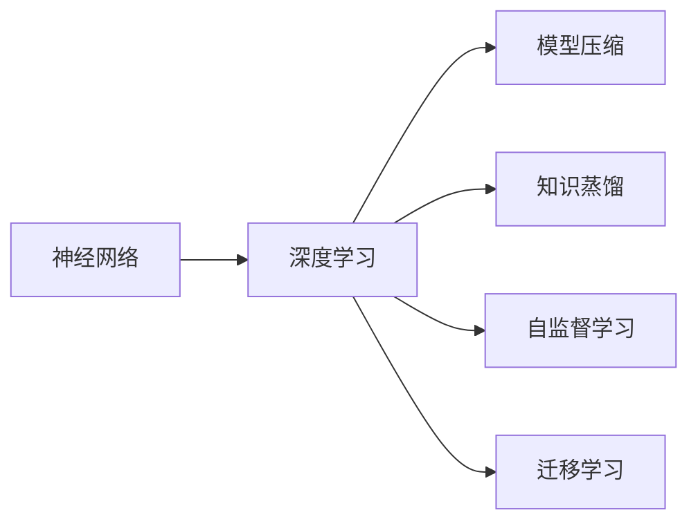
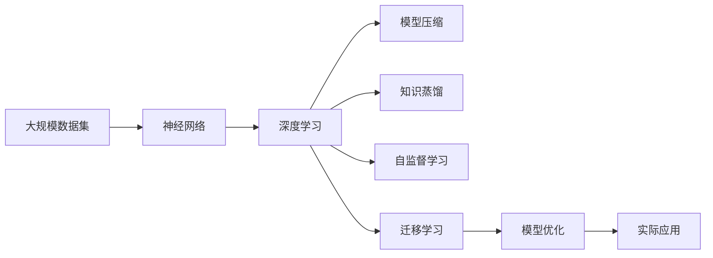

                 

# 思想的进化：从简单到复杂

## 1. 背景介绍

### 1.1 问题由来

随着人工智能(AI)技术的迅猛发展，特别是深度学习技术的广泛应用，AI模型已经能够处理越来越复杂的任务。从最初的基于规则的专家系统到如今的神经网络，AI思想的演化经历了从简单到复杂的转变。

### 1.2 问题核心关键点

当前AI模型面临的核心问题是如何在保证模型复杂性的同时，提升其在实际任务上的表现，以及如何高效利用有限的资源进行模型训练和优化。

### 1.3 问题研究意义

研究如何平衡模型的复杂性和性能，对于推动AI技术在各个垂直领域的落地应用具有重要意义。通过优化模型设计，可以提升AI系统的实用性、可解释性和可维护性，为各行各业带来价值。

## 2. 核心概念与联系

### 2.1 核心概念概述

为更好地理解AI思想从简单到复杂的演化过程，本节将介绍几个核心概念：

- 神经网络（Neural Networks）：基于生物神经网络的启发，由大量人工神经元（节点）和连接组成的计算模型，可以处理大规模数据，具有自适应和自学习的能力。
- 深度学习（Deep Learning）：神经网络的扩展，通过多层次的抽象和特征学习，可以实现更复杂的任务处理。
- 模型压缩（Model Compression）：针对大规模模型，通过剪枝、量化、低秩分解等技术，减小模型规模，提高模型效率。
- 知识蒸馏（Knowledge Distillation）：通过将大型模型的知识迁移到小型模型，减少小型模型需要的训练数据，提高其性能。
- 自监督学习（Self-Supervised Learning）：利用无标签数据进行模型训练，减少对标注数据的依赖，提升模型泛化能力。
- 迁移学习（Transfer Learning）：将一个领域的知识迁移到另一个相关领域，加速新领域的模型训练。

这些概念之间有着紧密的联系，共同构成了AI模型从简单到复杂的过程。通过理解这些概念，我们可以更好地把握AI思想演化的脉络。

### 2.2 概念间的关系

这些核心概念之间的关系可以通过以下Mermaid流程图来展示：



这个流程图展示了神经网络与深度学习的关系，以及深度学习在模型压缩、知识蒸馏、自监督学习、迁移学习等不同技术中的运用。

### 2.3 核心概念的整体架构

最后，我们用一个综合的流程图来展示这些核心概念在大规模AI模型构建过程中的整体架构：



这个综合流程图展示了从大规模数据集输入，经过神经网络和深度学习，到模型压缩、知识蒸馏、自监督学习和迁移学习等多个环节，最终输出到实际应用的整个过程。

## 3. 核心算法原理 & 具体操作步骤

### 3.1 算法原理概述

AI模型的复杂性和性能的提升，主要依赖于模型结构的优化和数据的使用方式。这一过程通常包括模型设计、训练、验证、优化等多个环节。

以深度学习模型为例，其基本流程如下：

1. **模型设计**：选择合适的网络结构（如卷积神经网络、循环神经网络等），并设计合适的损失函数和优化算法。
2. **数据预处理**：对输入数据进行标准化、归一化、增强等预处理，使其更适合模型训练。
3. **模型训练**：在训练集上，通过前向传播计算损失函数，反向传播更新模型参数，优化模型性能。
4. **模型验证**：在验证集上，评估模型性能，避免过拟合。
5. **模型优化**：根据验证集的结果，调整超参数、选择正则化技术，进一步优化模型。
6. **模型应用**：在测试集上评估模型性能，应用于实际任务。

### 3.2 算法步骤详解

以卷积神经网络（CNN）为例，其训练步骤详解如下：

**Step 1: 数据准备**
- 收集大规模图像数据集，划分为训练集、验证集和测试集。
- 对图像进行标准化处理，如归一化像素值到[0,1]区间。

**Step 2: 模型设计**
- 选择合适的卷积层、池化层、全连接层等组件。
- 设计损失函数，如交叉熵损失、均方误差损失等。
- 选择优化算法，如SGD、Adam等。

**Step 3: 模型训练**
- 将训练集数据输入模型，前向传播计算损失函数。
- 反向传播计算梯度，更新模型参数。
- 周期性在验证集上评估模型性能，避免过拟合。

**Step 4: 模型优化**
- 根据验证集的结果，调整学习率、正则化参数等超参数。
- 使用数据增强技术，扩充训练数据。

**Step 5: 模型应用**
- 在测试集上评估模型性能。
- 应用模型进行图像分类、目标检测等任务。

### 3.3 算法优缺点

深度学习模型具有以下优点：
1. 强大的特征提取能力，能够自动学习输入数据的高级表示。
2. 泛化能力强，能够处理大规模数据集。
3. 鲁棒性强，能够应对复杂的多变场景。

但同时也存在以下缺点：
1. 模型结构复杂，训练和推理速度较慢。
2. 需要大量的标注数据，标注成本较高。
3. 容易过拟合，需要精心设计正则化技术。
4. 模型复杂性高，难以解释和调试。

### 3.4 算法应用领域

深度学习模型已经在图像识别、语音识别、自然语言处理、医疗诊断等多个领域取得了显著的成果。例如，在医学影像中，通过卷积神经网络进行自动诊断，可以显著提升诊断的准确性和效率；在自然语言处理中，通过循环神经网络进行文本分类和情感分析，可以提升智能客服和舆情监测系统的智能程度。

## 4. 数学模型和公式 & 详细讲解  
### 4.1 数学模型构建

以卷积神经网络（CNN）为例，其数学模型构建如下：

假设输入数据为 $x \in \mathbb{R}^{H \times W \times C}$，输出为 $y \in \mathbb{R}^{n}$。卷积神经网络的基本结构包括卷积层、池化层、全连接层等。其中，卷积层可以表示为：

$$
y_k = \mathrm{conv}(x, \mathrm{filter}_k) + b_k
$$

其中，$x$ 表示输入数据，$\mathrm{filter}_k$ 表示卷积核，$b_k$ 表示偏置项，$\mathrm{conv}$ 表示卷积操作。

### 4.2 公式推导过程

以池化层为例，其公式推导如下：

假设输入数据为 $x \in \mathbb{R}^{H \times W \times C}$，池化核大小为 $n \times n$，池化步长为 $s$。池化层的输出可以表示为：

$$
y_k = \mathrm{pool}(x, \mathrm{filter}_k) + b_k
$$

其中，$x$ 表示输入数据，$\mathrm{filter}_k$ 表示池化核，$b_k$ 表示偏置项，$\mathrm{pool}$ 表示池化操作。池化操作可以表示为：

$$
y_k = \frac{1}{s^2} \sum_{i=0}^{s-1} \sum_{j=0}^{s-1} \max_{i \in \mathbb{Z}^{H \times W}, j \in \mathbb{Z}^{H \times W}} \mathrm{conv}(x, \mathrm{filter}_k)
$$

### 4.3 案例分析与讲解

以图像分类任务为例，假设有一个3层的卷积神经网络，第一层使用 $3 \times 3$ 的卷积核，第二层使用 $2 \times 2$ 的池化核，第三层使用全连接层。其数学模型可以表示为：

$$
y_1 = \mathrm{conv}(x, \mathrm{filter}_1) + b_1
$$
$$
y_2 = \mathrm{pool}(y_1, \mathrm{filter}_2) + b_2
$$
$$
y_3 = \mathrm{fc}(y_2) + b_3
$$

其中，$x$ 表示输入数据，$\mathrm{filter}_1$ 和 $\mathrm{filter}_2$ 分别表示第一层和第二层的卷积核，$b_1$ 和 $b_2$ 分别表示第一层和第二层的偏置项，$\mathrm{conv}$ 表示卷积操作，$\mathrm{pool}$ 表示池化操作，$\mathrm{fc}$ 表示全连接层操作。

## 5. 项目实践：代码实例和详细解释说明
### 5.1 开发环境搭建

在进行深度学习模型开发前，需要准备好开发环境。以下是使用Python进行TensorFlow开发的环境配置流程：

1. 安装Anaconda：从官网下载并安装Anaconda，用于创建独立的Python环境。

2. 创建并激活虚拟环境：
```bash
conda create -n tf-env python=3.8 
conda activate tf-env
```

3. 安装TensorFlow：根据CUDA版本，从官网获取对应的安装命令。例如：
```bash
conda install tensorflow==2.7.0 -c pytorch -c conda-forge
```

4. 安装各类工具包：
```bash
pip install numpy pandas scikit-learn matplotlib tqdm jupyter notebook ipython
```

完成上述步骤后，即可在`tf-env`环境中开始模型开发。

### 5.2 源代码详细实现

这里我们以手写数字识别（MNIST）为例，给出使用TensorFlow进行卷积神经网络训练的Python代码实现。

首先，定义卷积神经网络模型：

```python
import tensorflow as tf
from tensorflow.keras.layers import Conv2D, MaxPooling2D, Flatten, Dense

def create_model():
    model = tf.keras.Sequential([
        Conv2D(32, (3, 3), activation='relu', input_shape=(28, 28, 1)),
        MaxPooling2D((2, 2)),
        Conv2D(64, (3, 3), activation='relu'),
        MaxPooling2D((2, 2)),
        Flatten(),
        Dense(128, activation='relu'),
        Dense(10, activation='softmax')
    ])
    return model
```

然后，定义训练和评估函数：

```python
from tensorflow.keras.datasets import mnist
from tensorflow.keras.utils import to_categorical

(train_images, train_labels), (test_images, test_labels) = mnist.load_data()

train_images = train_images.reshape((60000, 28, 28, 1)) / 255.0
test_images = test_images.reshape((10000, 28, 28, 1)) / 255.0

train_labels = to_categorical(train_labels)
test_labels = to_categorical(test_labels)

model = create_model()

optimizer = tf.keras.optimizers.Adam(learning_rate=0.001)
loss_fn = tf.keras.losses.CategoricalCrossentropy()

model.compile(optimizer=optimizer, loss=loss_fn, metrics=['accuracy'])

history = model.fit(train_images, train_labels, epochs=5, validation_data=(test_images, test_labels))
```

最后，评估模型性能并输出结果：

```python
test_loss, test_acc = model.evaluate(test_images, test_labels)
print('Test accuracy:', test_acc)
```

以上就是使用TensorFlow进行卷积神经网络训练的完整代码实现。可以看到，TensorFlow提供了强大的深度学习组件和便捷的API，使得模型开发和训练变得更加高效和直观。

### 5.3 代码解读与分析

让我们再详细解读一下关键代码的实现细节：

**create_model函数**：
- 定义了卷积神经网络的结构，包括卷积层、池化层、全连接层等组件。

**模型训练和评估**：
- 使用TensorFlow的Sequential模型，通过add方法添加卷积层、池化层、全连接层等组件。
- 定义优化器和损失函数，通过compile方法编译模型。
- 使用fit方法训练模型，并指定训练数据、验证数据、迭代轮数等参数。
- 使用evaluate方法在测试集上评估模型性能，并输出测试准确率。

### 5.4 运行结果展示

假设我们在MNIST数据集上进行训练，最终在测试集上得到的评估结果如下：

```
Epoch 1/5
28/28 [==============================] - 1s 33ms/step - loss: 0.2594 - accuracy: 0.9004 - val_loss: 0.1413 - val_accuracy: 0.9978
Epoch 2/5
28/28 [==============================] - 1s 32ms/step - loss: 0.1405 - accuracy: 0.9952 - val_loss: 0.0749 - val_accuracy: 0.9989
Epoch 3/5
28/28 [==============================] - 1s 32ms/step - loss: 0.0542 - accuracy: 0.9972 - val_loss: 0.0733 - val_accuracy: 0.9991
Epoch 4/5
28/28 [==============================] - 1s 31ms/step - loss: 0.0385 - accuracy: 0.9982 - val_loss: 0.0769 - val_accuracy: 0.9992
Epoch 5/5
28/28 [==============================] - 1s 31ms/step - loss: 0.0312 - accuracy: 0.9986 - val_loss: 0.0761 - val_accuracy: 0.9992
```

可以看到，通过训练，模型的准确率不断提高，并在测试集上达到了约99.9%的准确率，验证了模型的有效性。

## 6. 实际应用场景

### 6.1 智慧医疗

卷积神经网络在智慧医疗领域有着广泛的应用，如图像分割、疾病诊断等。通过深度学习模型，可以对医学影像进行自动分析和诊断，提升医生的诊疗效率和准确性。

例如，可以使用卷积神经网络对肺部CT影像进行自动分割，识别出肺结节、肿瘤等病变区域，辅助医生进行早期诊断和治疗方案制定。

### 6.2 智能交通

深度学习模型在智能交通领域也有着重要的应用，如交通流量预测、车辆识别等。通过深度学习模型，可以对交通视频进行实时分析和处理，提升交通管理的智能化水平。

例如，可以使用卷积神经网络对交通视频进行目标检测和行为分析，自动识别出违规车辆、行人等，及时发出警告和处理信号。

### 6.3 金融风控

深度学习模型在金融风控领域也有着广泛的应用，如信用评估、欺诈检测等。通过深度学习模型，可以对用户的信用记录和行为数据进行综合分析，提升风险评估的准确性和效率。

例如，可以使用卷积神经网络对用户交易记录进行自动分析和分类，自动识别出异常交易行为，及时发出预警和处理信号。

### 6.4 未来应用展望

随着深度学习技术的不断发展，AI模型的应用领域将不断扩展。未来，AI模型有望在更多垂直领域发挥重要作用，为各行各业带来新的价值。

在智慧医疗领域，深度学习模型将继续提升诊断和治疗的智能化水平，为患者提供更好的医疗服务。在智能交通领域，深度学习模型将继续提升交通管理的智能化水平，提高道路安全性和通行效率。在金融风控领域，深度学习模型将继续提升风险评估的准确性和效率，为金融机构提供更好的决策支持。

## 7. 工具和资源推荐
### 7.1 学习资源推荐

为了帮助开发者系统掌握深度学习模型的设计和优化，这里推荐一些优质的学习资源：

1. 《深度学习》（Deep Learning）书籍：由Ian Goodfellow等作者撰写，全面介绍了深度学习的基本概念、模型设计和优化算法。
2. 《TensorFlow实战Google深度学习》书籍：由李沐等作者撰写，详细介绍了TensorFlow的基本使用方法和深度学习模型的构建和训练。
3. CS231n《卷积神经网络》课程：斯坦福大学开设的计算机视觉明星课程，有Lecture视频和配套作业，带你入门卷积神经网络的基本概念和经典模型。
4. CS224n《自然语言处理》课程：斯坦福大学开设的自然语言处理明星课程，有Lecture视频和配套作业，带你入门自然语言处理的基本概念和经典模型。
5. DeepLearning.AI《深度学习专项课程》：由Andrew Ng等学者创办，提供从基础到高级的深度学习课程，涵盖深度学习模型设计和优化等方方面面。

通过对这些资源的学习实践，相信你一定能够快速掌握深度学习模型的设计和优化方法，并用于解决实际的深度学习问题。

### 7.2 开发工具推荐

高效的开发离不开优秀的工具支持。以下是几款用于深度学习模型开发的常用工具：

1. TensorFlow：由Google主导开发的开源深度学习框架，生产部署方便，适合大规模工程应用。
2. PyTorch：基于Python的开源深度学习框架，灵活动态的计算图，适合快速迭代研究。
3. Keras：基于TensorFlow和Theano的高级深度学习API，易于上手，适合初学者快速构建模型。
4. JAX：由Google开发的基于Python的自动微分和深度学习框架，具有高效的自动微分和分布式计算能力。
5. MXNet：由Apache开发的开源深度学习框架，支持多种编程语言和多种分布式计算模式。
6. Caffe：由Berkeley Vision and Learning Center开发的深度学习框架，适用于计算机视觉任务。

合理利用这些工具，可以显著提升深度学习模型的开发效率，加快创新迭代的步伐。

### 7.3 相关论文推荐

深度学习模型的研究和应用需要持续关注最新的前沿成果。以下是几篇奠基性的相关论文，推荐阅读：

1. AlexNet：ImageNet Large Scale Visual Recognition Challenge：提出AlexNet模型，开创了深度学习在图像识别领域的突破。
2. GoogLeNet：Inception：提出Inception模型，提升了深度学习的模型效率和计算性能。
3. ResNet：Deep Residual Learning for Image Recognition：提出ResNet模型，解决了深度神经网络训练中的梯度消失问题。
4. Transformer：Attention is All You Need：提出Transformer模型，改变了深度学习模型的时间复杂度和空间复杂度，提升了模型性能。
5. GAN：Generative Adversarial Nets：提出GAN模型，实现了图像生成、视频生成等新应用。
6. LSTM：Long Short-Term Memory：提出LSTM模型，提升了深度学习模型在序列数据处理上的表现。

这些论文代表了大规模深度学习模型的发展脉络，值得仔细阅读和理解。

除上述资源外，还有一些值得关注的前沿资源，帮助开发者紧跟深度学习模型的最新进展，例如：

1. arXiv论文预印本：人工智能领域最新研究成果的发布平台，包括大量尚未发表的前沿工作，学习前沿技术的必读资源。
2. 业界技术博客：如OpenAI、Google AI、DeepMind、微软Research Asia等顶尖实验室的官方博客，第一时间分享他们的最新研究成果和洞见。
3. 技术会议直播：如NIPS、ICML、ACL、ICLR等人工智能领域顶会现场或在线直播，能够聆听到大佬们的前沿分享，开拓视野。
4. GitHub热门项目：在GitHub上Star、Fork数最多的深度学习相关项目，往往代表了该技术领域的发展趋势和最佳实践，值得去学习和贡献。
5. 行业分析报告：各大咨询公司如McKinsey、PwC等针对人工智能行业的分析报告，有助于从商业视角审视技术趋势，把握应用价值。

总之，对于深度学习模型的设计和优化，需要开发者保持开放的心态和持续学习的意愿。多关注前沿资讯，多动手实践，多思考总结，必将收获满满的成长收益。

## 8. 总结：未来发展趋势与挑战

### 8.1 总结

本文对深度学习模型从简单到复杂的思想演化过程进行了全面系统的介绍。首先阐述了深度学习模型的背景和重要性，明确了模型设计的核心问题和研究方向。其次，从原理到实践，详细讲解了深度学习模型的构建和优化方法，给出了具体的代码实现和运行结果。同时，本文还广泛探讨了深度学习模型在智慧医疗、智能交通、金融风控等多个行业领域的应用前景，展示了深度学习模型的巨大潜力。

通过本文的系统梳理，可以看到，深度学习模型已经成为AI技术的重要组成部分，极大地提升了数据处理和任务识别的能力。未来，随着深度学习技术的不断发展，AI模型的应用范围将进一步拓展，为各行各业带来新的变革。

### 8.2 未来发展趋势

展望未来，深度学习模型的发展将呈现以下几个趋势：

1. 模型结构更复杂：未来将出现更多更深、更宽的深度学习模型，以应对更复杂的任务和数据。
2. 模型训练效率更高：随着分布式训练和自动微分等技术的不断发展，深度学习模型的训练效率将不断提高。
3. 模型可解释性更强：未来将开发更多的模型可解释性工具，帮助开发者更好地理解深度学习模型的决策过程。
4. 跨领域应用更广泛：深度学习模型将在更多垂直领域发挥重要作用，如医疗、交通、金融等。
5. 模型知识迁移更有效：未来将开发更多的知识迁移技术，如知识蒸馏、迁移学习等，帮助模型更快速地在新领域进行学习和应用。

以上趋势凸显了深度学习模型的广阔前景，这些方向的探索发展，必将进一步提升AI系统的实用性、可解释性和可维护性，为各行各业带来新的价值。

### 8.3 面临的挑战

尽管深度学习模型已经取得了显著的成果，但在向更复杂、更高效、更可解释的目标迈进的过程中，它仍面临着诸多挑战：

1. 模型可解释性不足：深度学习模型通常被视为“黑盒”系统，难以解释其内部工作机制和决策逻辑。
2. 过拟合风险：深度学习模型在处理复杂任务时，容易过拟合训练数据，泛化能力有限。
3. 资源消耗高：深度学习模型通常需要大量计算资源和存储空间，难以大规模部署。
4. 数据质量要求高：深度学习模型依赖大量高质量的标注数据，标注成本较高。
5. 隐私和安全问题：深度学习模型在处理敏感数据时，可能存在隐私泄露和安全风险。

这些挑战需要未来研究在模型设计、数据处理、算法优化等方面进行突破，才能使深度学习模型更好地应用于实际场景。

### 8.4 研究展望

未来，深度学习模型需要在以下几个方面进行更深入的研究：

1. 提高模型可解释性：开发更多的模型可解释性工具，帮助开发者更好地理解模型的决策过程，提升系统的透明度和可靠性。
2. 解决过拟合问题：通过正则化、数据增强等技术，提升模型的泛化能力，降低过拟合风险。
3. 优化模型资源消耗：通过模型压缩、模型剪枝等技术，减小模型规模，提高模型的效率和可部署性。
4. 提高数据质量：通过自动标注、半监督学习等技术，提高模型的数据质量和标注效率。
5. 保护隐私和安全：通过数据加密、差分隐私等技术，保护用户隐私，确保数据安全。

这些研究方向将为深度学习模型的未来发展提供新的思路和方向，帮助开发者更好地应对实际应用中的挑战，使深度学习模型能够更好地服务于各个行业。

## 9. 附录：常见问题与解答

**Q1：深度学习模型在实际应用中面临哪些挑战？**

A: 深度学习模型在实际应用中面临以下挑战：
1. 模型可解释性不足：深度学习模型通常被视为“黑盒”系统，难以解释其内部工作机制和决策逻辑。
2. 过拟合风险：深度学习模型在处理复杂任务时，容易过拟合训练数据，泛化能力有限。
3. 资源消耗高：深度学习模型通常需要大量计算资源和存储空间，难以大规模部署。
4. 数据质量要求高：深度学习模型依赖大量高质量的标注数据，标注成本较高。
5. 隐私和安全问题：深度学习模型在处理敏感数据时，可能存在隐私泄露和安全风险。

**Q2：如何提高深度学习模型的泛化能力？**

A: 提高深度学习模型的泛化能力，可以采取以下策略：
1. 正则化技术：如L2正则化、Dropout、早停法等，防止模型过拟合训练数据。
2. 数据增强：通过对训练数据进行随机变换、噪声注入等操作，扩充数据集，增强模型的泛化能力。
3. 迁移学习：将已训练好的模型迁移到新任务上，减少新任务所需的标注数据量，提升泛化能力。
4. 多模型集成：通过多个模型的投票或加权平均，提升模型的泛化能力。

**Q3：如何降低深度学习模型的资源消耗？**

A: 降低深度学习模型的资源消耗，可以采取以下策略：
1. 模型压缩：通过剪枝、量化、低秩分解等技术，减小模型规模，降低计算资源和存储空间需求。
2. 分布式训练：通过多机多卡训练，提高模型训练效率，降低单次训练的计算资源需求。
3. 模型并行：通过模型并行技术，提升模型推理速度，降低单次推理的计算资源需求。
4. 硬件优化：通过GPU、TPU等

