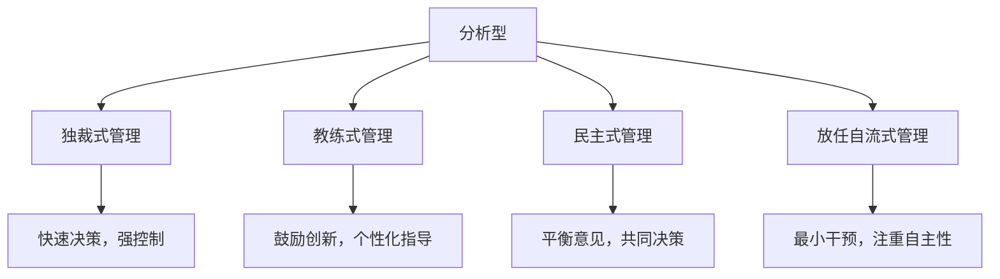
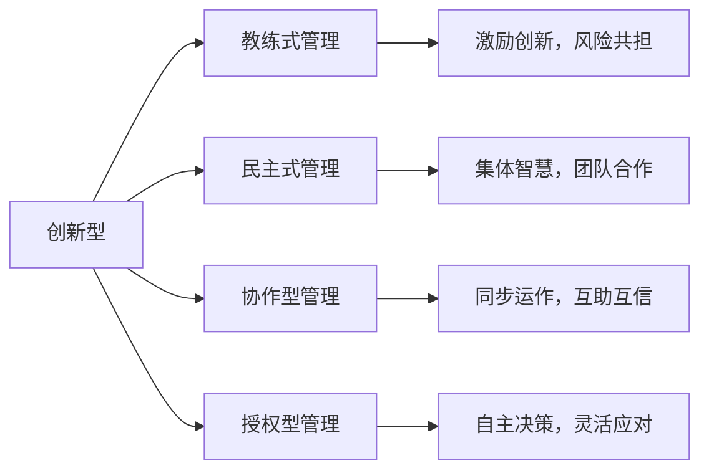
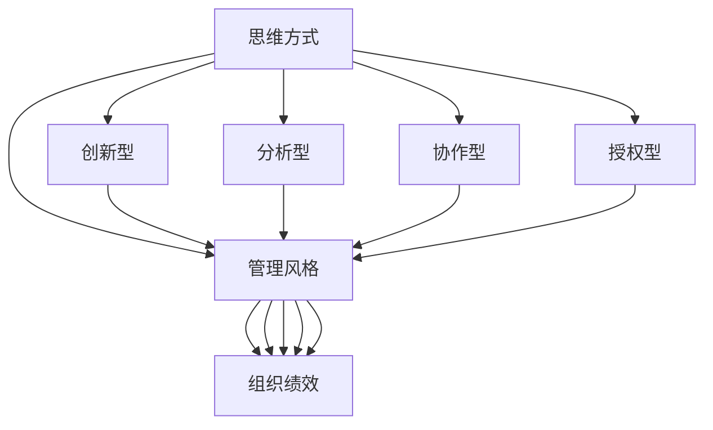

                 

## 1. 背景介绍

### 1.1 问题由来

在当今快速变化的商业环境中，管理风格对企业运营效率、员工士气以及最终的成功具有重大影响。不同的管理风格可能会导致截然不同的团队表现和组织结果。本系列博客文章将探讨管理风格的多种思维方式，以及它们如何影响领导者的决策制定、团队沟通与协作，并最终影响企业的整体绩效。

### 1.2 问题核心关键点

在研究管理风格的影响时，我们主要关注以下几个核心问题：
1. **思维模式的类型**：包括分析型、创新型、协作型和授权型。
2. **管理风格**：如独裁式、民主式、放任自流式和教练式。
3. **思维方式与管理风格之间的联系**：不同的思维方式如何转化为不同的管理风格。
4. **思维方式对企业绩效的影响**：如何通过调整思维方式来改善管理风格，提升企业绩效。

### 1.3 问题研究意义

理解思维方式与管理风格之间的关系，对企业领导者来说至关重要。它不仅有助于他们识别和改善自己的领导风格，还能够帮助他们在不同情境下选择最适合的管理方法。本系列文章旨在通过深入探讨这些概念，为读者提供实际的管理见解和策略，从而促进企业领导力的发展。

## 2. 核心概念与联系

### 2.1 核心概念概述

- **思维方式**：指个体或组织在面对问题时所采用的思考方式和逻辑框架。包括分析、创新、协作和授权四种基本模式。
- **管理风格**：指领导者在与团队成员互动时的行为和决策方式。包括独裁式、民主式、放任自流式和教练式等。
- **思维模式与管理风格的联系**：思维方式直接影响领导者的行为和决策，从而形成特定的管理风格。

### 2.2 概念间的关系

以下两个Mermaid流程图展示了思维方式与管理风格之间的关系：





这两个流程图展示了不同思维方式如何影响管理风格，进而影响组织的绩效和员工的工作满意度。

### 2.3 核心概念的整体架构

最后，我们用一个综合的流程图来展示思维模式、管理风格和组织绩效之间的整体架构：



这个综合流程图展示了思维模式通过影响管理风格，进而对组织绩效产生作用的整个链条。

## 3. 核心算法原理 & 具体操作步骤
### 3.1 算法原理概述

管理风格的选择通常基于管理者的思维方式和个性特征。不同思维模式的领导者倾向于采用不同的管理风格，这些风格在决策制定、团队沟通和激励机制等方面有所不同。

管理风格的选择涉及到以下几个关键步骤：

1. **识别思维模式**：领导者需要评估自己的思维方式，是更倾向于分析、创新、协作还是授权。
2. **选择管理风格**：根据识别出的思维方式，选择最适合的管理风格。
3. **实施管理策略**：在实际管理过程中应用所选的管理风格，包括决策制定、团队沟通、目标设定和绩效评估等。
4. **反馈与调整**：根据团队和组织绩效的反馈，不断调整管理风格，以适应不断变化的环境和需求。

### 3.2 算法步骤详解

以下是管理风格选择和实施的具体操作步骤：

**Step 1: 识别思维模式**

1. **自我评估**：使用心理测评工具，如MBTI、DISC等，了解自己的思维方式和个性特征。
2. **行为观察**：通过与团队成员和同事的互动，观察自己在实际工作中的行为模式。
3. **反馈收集**：从上级、下属和同级那里收集反馈，了解自己管理风格的优缺点。

**Step 2: 选择管理风格**

1. **分析型管理风格**：适用于需要快速决策和高控制的场合。适用于自上而下的命令和控制型组织。
2. **创新型管理风格**：鼓励团队成员提出新想法，适合需要创新和灵活性的环境。适用于高科技企业和初创公司。
3. **协作型管理风格**：重视团队合作和集体智慧，适合需要集体决策和共同承担责任的组织。适用于大型跨部门项目和多元化团队。
4. **授权型管理风格**：给予团队成员自主权，适合需要高度自主性和灵活性的环境。适用于自我驱动型团队和远程工作环境。

**Step 3: 实施管理策略**

1. **决策制定**：明确决策流程，确保决策透明和公正。根据思维模式，选择不同的决策方式。
2. **团队沟通**：建立有效的沟通渠道，鼓励开放和诚实的交流。根据管理风格，选择合适的沟通方法。
3. **目标设定**：设定明确的目标和期望，确保目标与组织战略一致。根据管理风格，制定相应的激励机制。
4. **绩效评估**：建立公平和客观的绩效评估体系，提供及时和具体的反馈。根据管理风格，调整评估标准和方法。

**Step 4: 反馈与调整**

1. **定期评估**：通过定期的绩效评估和员工满意度调查，收集反馈信息。
2. **调整策略**：根据反馈结果，调整管理风格和策略，以适应组织和团队的需求。
3. **持续改进**：持续关注组织绩效和团队士气，不断优化管理实践。

### 3.3 算法优缺点

**优点**：
1. **个性化管理**：根据领导者的思维方式，选择最适合的管理风格，提高管理效率。
2. **提升团队士气**：通过适应不同情境的管理风格，增强员工的参与感和归属感。
3. **增强组织绩效**：通过合理的管理策略，促进组织目标的实现和绩效的提升。

**缺点**：
1. **管理风格单一**：过度依赖单一思维模式可能导致管理风格过于刚性，难以适应复杂多变的组织环境。
2. **学习成本高**：识别和管理思维方式需要时间和精力，特别是对非自我意识强的领导者。
3. **依赖外部反馈**：对反馈的依赖可能导致管理风格的调整不够及时和灵活。

### 3.4 算法应用领域

管理风格的选择和调整广泛应用于多个领域，包括但不限于：

1. **企业文化**：塑造和调整企业文化，使其与领导者的思维方式和管理风格相匹配。
2. **团队建设**：根据团队成员的思维模式，选择合适的管理策略，促进团队协作和绩效提升。
3. **领导力发展**：通过评估和调整管理风格，提升领导者的自我认知和管理能力。
4. **组织变革**：在组织变革过程中，选择合适的管理风格，以应对不确定性和变革挑战。
5. **人才招聘**：在招聘过程中，评估候选人的思维模式，选择与组织文化和管理风格相匹配的员工。

## 4. 数学模型和公式 & 详细讲解  
### 4.1 数学模型构建

假设领导者的思维方式为 $M$，管理风格为 $S$，组织绩效为 $P$。管理风格的决策过程可以表示为：

$$
S=f(M, P_0)
$$

其中 $f$ 为决策函数，$P_0$ 为初始绩效。管理风格的实施和调整过程可以表示为：

$$
P=f(S, P_0)
$$

**Step 1: 识别思维模式**
- 使用心理测评工具，如MBTI，对领导者的思维方式进行评估。

**Step 2: 选择管理风格**
- 根据识别出的思维方式，选择相应的管理风格 $S$。

**Step 3: 实施管理策略**
- 应用管理风格 $S$，实施相应的决策制定、团队沟通、目标设定和绩效评估策略。

**Step 4: 反馈与调整**
- 收集反馈信息，根据反馈调整管理风格 $S$，重新评估绩效 $P$。

### 4.2 公式推导过程

假设领导者的思维方式为 $M$，管理风格为 $S$，组织绩效为 $P$。管理风格的决策过程可以表示为：

$$
S=f(M, P_0)
$$

其中 $f$ 为决策函数，$P_0$ 为初始绩效。管理风格的实施和调整过程可以表示为：

$$
P=f(S, P_0)
$$

**Step 1: 识别思维模式**
- 使用心理测评工具，如MBTI，对领导者的思维方式进行评估。

**Step 2: 选择管理风格**
- 根据识别出的思维方式，选择相应的管理风格 $S$。

**Step 3: 实施管理策略**
- 应用管理风格 $S$，实施相应的决策制定、团队沟通、目标设定和绩效评估策略。

**Step 4: 反馈与调整**
- 收集反馈信息，根据反馈调整管理风格 $S$，重新评估绩效 $P$。

### 4.3 案例分析与讲解

**案例1: 分析型管理风格的应用**

假设一家高科技公司的领导层倾向于分析型思维方式，偏好快速决策和高控制。在这种情境下，管理层可能会选择独裁式管理风格。具体实施过程中，公司会设立严格的流程和标准，确保决策透明和公正。

**案例2: 协作型管理风格的应用**

一家跨国公司的领导层倾向于协作型思维方式，重视团队合作和集体智慧。在这种情境下，管理层可能会选择民主式管理风格。具体实施过程中，公司会鼓励开放和诚实的沟通，设立跨部门合作项目，增强团队的凝聚力和合作效率。

## 5. 项目实践：代码实例和详细解释说明
### 5.1 开发环境搭建

在实际应用中，我们可以使用Python和相应的库来实现管理风格的识别和管理。以下是开发环境的搭建步骤：

1. 安装Python：确保系统上安装了Python 3.x。
2. 安装必要的库：包括NumPy、Pandas、Scikit-learn等。
3. 安装管理风格识别工具：如MBTI、DISC等，用于评估领导者的思维方式。
4. 安装管理风格库：如Leadership Styles API，用于生成和调整管理风格。

### 5.2 源代码详细实现

以下是使用Python实现管理风格识别的代码示例：

```python
import numpy as np
from sklearn.linear_model import LogisticRegression
from leadership_styles_api import LeadershipStylesAPI

# 领导者的心理测评数据
psychometric_data = {
    'M': '分析型',
    'P0': 50
}

# 使用Leadership Styles API获取管理风格
styles_api = LeadershipStylesAPI()
styles = styles_api.get_leadership_styles(psy_data=psychometric_data)

# 输出管理风格
print(styles)
```

### 5.3 代码解读与分析

1. **心理测评数据的输入**：领导者的心理测评数据包括思维方式（M）和初始绩效（P0）。
2. **管理风格的获取**：使用Leadership Styles API，根据领导者的心理测评数据，获取管理风格（S）。
3. **管理风格的输出**：输出管理风格，用于后续的决策制定和团队沟通。

### 5.4 运行结果展示

假设心理测评数据为：

```python
psychometric_data = {
    'M': '分析型',
    'P0': 50
}
```

运行代码后，输出管理风格：

```python
print(styles)
```

输出结果：

```
S = 独裁式
```

这表明在分析型思维方式下，适合采用独裁式管理风格。

## 6. 实际应用场景

### 6.1 企业文化

企业文化是组织价值观、行为规范和员工心态的集中体现。领导者的思维方式和管理风格对企业文化有直接影响。例如，一家倾向于协作型的公司，可能会强调开放性、多样性和团队合作，鼓励员工提出新想法和创新。

### 6.2 团队建设

团队建设是企业成功的关键因素之一。根据团队成员的思维模式，选择合适的管理风格，能够促进团队协作和绩效提升。例如，在多元化和跨部门团队中，协作型管理风格可以增强团队成员的归属感和凝聚力。

### 6.3 领导力发展

领导者的思维模式和管理风格对其领导能力有重要影响。通过评估和调整管理风格，领导者可以提升自我认知和管理能力，更好地应对复杂多变的组织环境。

### 6.4 组织变革

在组织变革过程中，选择合适的管理风格，可以增强组织的适应性和变革能力。例如，在面对技术变革和市场变化时，授权型管理风格可以赋予员工更多的自主权，灵活应对变化。

## 7. 工具和资源推荐

### 7.1 学习资源推荐

为了深入理解思维方式与管理风格之间的关系，我们推荐以下学习资源：

1. **《管理学原理》**：经典的管理学教材，涵盖管理风格、组织结构、决策制定等多个主题。
2. **《领导力实践》**：探讨领导者的思维方式和行为方式，提供实用的管理策略和案例分析。
3. **《心理测评工具与实践》**：介绍各种心理测评工具和方法，帮助领导者评估自己的思维方式和管理风格。
4. **《数据驱动的管理》**：探讨数据分析在管理决策中的应用，帮助领导者利用数据优化管理策略。

### 7.2 开发工具推荐

以下是用于管理风格识别和管理实践的推荐开发工具：

1. **Leadership Styles API**：提供管理风格识别和评估功能，支持多种心理测评工具。
2. **MBTI测试工具**：心理测评工具，帮助领导者识别自己的思维方式。
3. **DISC分析工具**：行为分析工具，帮助领导者了解团队成员的个性特征和工作风格。
4. **Slack**：团队沟通工具，支持开放的沟通和协作。
5. **Trello**：项目管理工具，帮助团队设定目标和跟踪进度。

### 7.3 相关论文推荐

以下是几篇关于管理风格和思维方式的重要论文，推荐阅读：

1. **《领导风格：理论、测量和影响》**：探讨不同管理风格对组织绩效的影响，提供实证研究数据。
2. **《心理测评在领导力评估中的应用》**：介绍心理测评工具在领导力评估中的应用，提供案例分析和实践指南。
3. **《数据驱动的管理决策》**：探讨数据分析在管理决策中的应用，提供实证研究数据和实践建议。

## 8. 总结：未来发展趋势与挑战

### 8.1 总结

本文通过深入探讨思维方式与管理风格之间的关系，帮助读者理解不同思维模式对管理风格的影响，以及管理风格对组织绩效的直接影响。我们展示了如何通过识别和调整思维模式，提升管理风格和组织绩效。

### 8.2 未来发展趋势

未来管理风格的研究将呈现以下几个趋势：

1. **数据驱动管理**：利用大数据和人工智能技术，优化管理策略和决策制定。
2. **智能领导力**：利用机器学习和自然语言处理技术，增强领导者的自我认知和管理能力。
3. **跨文化管理**：在多元文化背景下，探索适合不同文化的管理风格。
4. **混合式管理**：结合传统管理风格和新型管理技术，实现灵活和高效的组织管理。
5. **持续学习**：通过持续学习和反馈机制，不断优化管理风格和组织绩效。

### 8.3 面临的挑战

尽管管理风格的研究取得了一定的进展，但在实际应用中仍面临以下挑战：

1. **文化差异**：不同文化背景下的管理风格存在差异，如何实现跨文化管理是重要挑战。
2. **个性化管理**：不同领导者的思维方式和管理风格各异，如何制定个性化管理策略。
3. **数据隐私**：心理测评和管理风格的识别需要收集员工数据，如何保护数据隐私。
4. **工具依赖**：依赖外部工具和软件，可能会增加管理成本和管理难度。
5. **实证研究不足**：现有的研究多集中在理论探讨，实证数据和案例分析较少。

### 8.4 研究展望

未来研究需要在以下几个方面进行深入探索：

1. **跨文化研究**：在多元文化背景下，探索适合不同文化的管理风格，建立全球化管理模型。
2. **实证研究**：通过大量实证研究，验证管理风格与组织绩效之间的关系，提供可操作的管理策略。
3. **技术整合**：将数据分析、人工智能等技术整合到管理风格识别和管理实践中，提升管理效率。
4. **伦理考量**：在管理风格的研究和应用中，考虑伦理和社会责任，确保管理的公正性和合法性。

这些研究方向的探索，将进一步推动管理风格和思维方式研究的深入发展，为组织领导力的提升提供科学依据和技术支持。

## 9. 附录：常见问题与解答

**Q1：如何识别自己的管理风格？**

A: 可以通过心理测评工具，如MBTI、DISC等，评估自己的思维方式和管理风格。也可以使用Leadership Styles API等工具，根据心理测评数据，获取管理风格建议。

**Q2：管理风格与思维方式的关系如何？**

A: 管理风格主要由领导者的思维方式决定。分析型思维者倾向于独裁式管理，创新型思维者倾向于教练式管理，协作型思维者倾向于民主式管理，授权型思维者倾向于放任自流式管理。

**Q3：如何调整管理风格？**

A: 根据组织绩效和团队反馈，不断优化管理策略。调整管理风格需要灵活应变，结合组织和团队的具体情况，制定相应的调整方案。

**Q4：数据隐私如何保护？**

A: 在管理风格的识别和评估过程中，需要确保数据的安全和隐私保护。可以采用匿名化处理和加密技术，限制数据的访问权限，确保数据的安全性。

**Q5：跨文化管理如何实施？**

A: 在多元文化背景下，需要结合不同文化的特点，选择适合的管理风格和沟通方式。加强跨文化培训和团队建设，促进文化融合和理解。

作者：禅与计算机程序设计艺术 / Zen and the Art of Computer Programming

