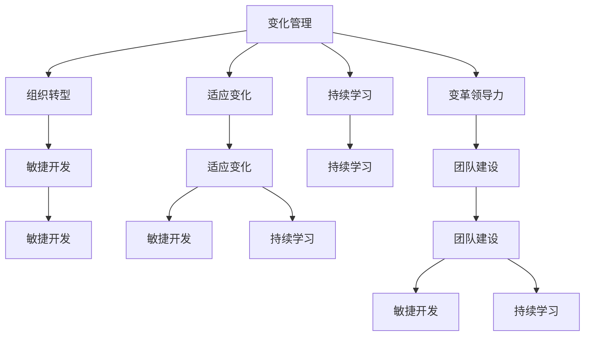
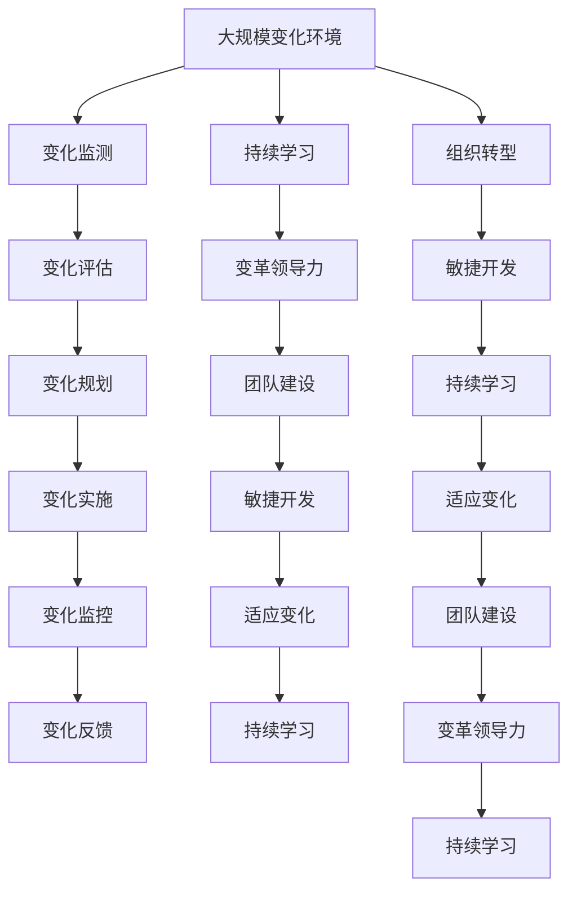

                 

# 接纳并庆祝变化：管理变化，适应变化

> 关键词：变化管理, 适应变化, 组织转型, 敏捷开发, 持续学习, 变革领导力, 团队建设

## 1. 背景介绍

### 1.1 问题由来

在当今这个快速变化的数字化时代，技术、市场和竞争环境都在不断演进。无论是企业还是个人，都需要不断适应这些变化，以保持竞争力和创新力。但如何有效地管理变化，从而快速适应变化，是一个复杂且深具挑战性的问题。本文旨在通过深入分析，提供一系列策略和工具，帮助组织和个人更好地应对变化，实现持续的进步和发展。

### 1.2 问题核心关键点

变化管理涉及到对组织内外环境的监测、评估，以及制定相应的策略和行动计划，以最小化对组织及其成员的影响，同时最大化变化带来的机会。关键点包括：

- **变化类型**：可以分为技术变化、市场变化、组织变化等，每种变化对组织的影响各不相同。
- **变化驱动因素**：包括但不限于政策法规、技术进步、市场需求、竞争压力等。
- **变化管理流程**：包括监测、评估、规划、实施、监控和反馈，每个阶段都需要精心设计和执行。
- **变革领导力**：领导者的角色和行为对变革的成败至关重要，需要具备敏锐的洞察力、坚定的决策力、出色的沟通能力和高超的协调能力。
- **团队建设**：高效的团队是变革成功的关键，需要建设具有高适应性、高合作性和高绩效的团队。

### 1.3 问题研究意义

研究变化管理和适应变化，对于提升组织和个人在动态环境中的生存和竞争力，具有重要意义：

- **提高灵活性**：通过有效的变化管理，组织和个人能够更灵活地应对外部环境的变化，抓住新机会。
- **优化资源配置**：合理地分配资源，确保关键领域得到优先保障，提升整体效益。
- **增强创新能力**：变化推动新理念、新方法的提出和实施，促进创新成果的不断涌现。
- **提升组织绩效**：通过适应变化，组织可以更有效地应对市场和竞争，实现绩效的持续提升。
- **促进员工发展**：变化管理不仅是组织层面的活动，也是员工个人成长和发展的机会，有助于提高员工的满意度和忠诚度。

## 2. 核心概念与联系

### 2.1 核心概念概述

为了更好地理解变化管理和适应变化的方法，本节将介绍几个核心概念及其相互关系：

- **变化管理(Change Management)**：通过计划、监控和控制来引导组织向预期目标演变的系统方法。
- **适应变化(Adapting to Change)**：个人或组织主动调整自身行为、策略和流程，以适应外部环境变化的能力。
- **组织转型(Organizational Transformation)**：重塑组织架构、流程和文化，以提升其效率和适应性。
- **敏捷开发(Agile Development)**：一种迭代、灵活的软件开发方法，旨在快速响应变化，提高产品交付速度和质量。
- **持续学习(Lifelong Learning)**：个人或组织不断获取新知识、技能和经验，以保持竞争力和适应能力。
- **变革领导力(Change Leadership)**：领导者引导和激励团队应对变化，实现组织目标的过程。
- **团队建设(Team Building)**：通过各种手段提升团队凝聚力、协作性和绩效。

这些概念之间的联系可以通过以下Mermaid流程图来展示：



这个流程图展示了变化管理与组织转型、敏捷开发、持续学习、适应变化、变革领导力和团队建设之间的关系：

1. 变化管理是推动组织转型的关键，通过敏捷开发提高响应速度，持续学习保持竞争优势。
2. 适应变化是变化管理的具体实践，与持续学习和团队建设密切相关。
3. 变革领导力则是变化管理中的核心，通过领导者的作用，引导组织向新的方向发展。

### 2.2 概念间的关系

这些核心概念之间的关系是相互依存的，共同构成了变化管理与适应变化的完整生态系统：

1. **变化管理与组织转型**：变化管理是推动组织转型的系统方法，而组织转型则是通过重塑组织结构、流程和文化，提升其适应性和灵活性。
2. **适应变化与持续学习**：适应变化要求个人或组织不断学习新知识、新技能，以保持竞争力。
3. **变革领导力与团队建设**：变革领导力通过领导者的影响力和协调力，推动团队成员共同应对变化，而团队建设则是通过提升团队凝聚力和协作性，增强团队适应变化的能力。
4. **敏捷开发与适应变化**：敏捷开发通过快速迭代和灵活调整，使得组织能够快速适应外部环境的变化。

### 2.3 核心概念的整体架构

最终，我们通过以下综合的流程图，展示了这些核心概念在大规模变化管理中的整体架构：



这个综合流程图展示了从变化监测到组织转型的完整流程，以及持续学习、变革领导力和团队建设在整个过程中的作用：

1. 大规模变化环境监测和评估后，制定变化规划和实施。
2. 实施后的变化需要持续监控和反馈，确保效果。
3. 持续学习和变革领导力是变化管理中的核心驱动力。
4. 团队建设通过提升团队协作性和凝聚力，增强组织适应变化的能力。

## 3. 核心算法原理 & 具体操作步骤
### 3.1 算法原理概述

变化管理和适应变化的核心算法原理是系统化的管理流程和方法，通过科学的决策和执行，将变化有效地引入和集成到组织和个人中。其核心思想包括：

- **变化监测(Change Monitoring)**：识别环境中的变化趋势和关键事件，为后续评估和规划提供依据。
- **变化评估(Change Assessment)**：评估变化对组织的潜在影响和机会，为决策提供参考。
- **变化规划(Change Planning)**：基于评估结果，制定详细的变化实施计划。
- **变化实施(Change Implementation)**：按照计划执行变化，确保顺利过渡。
- **变化监控(Change Control)**：持续监控变化过程和结果，及时调整策略。
- **变化反馈(Change Feedback)**：根据监控结果，提供反馈，持续优化变化管理流程。

### 3.2 算法步骤详解

以下是变化管理和适应变化的具体操作步骤：

**Step 1: 变化监测**
- 收集环境中的数据和信息，识别潜在的趋势和变化事件。
- 使用数据分析和预测工具，评估变化的可能性和影响。
- 制定变化监测计划，确定监测频率和关键指标。

**Step 2: 变化评估**
- 对识别的变化事件进行详细评估，分析其对组织的影响。
- 识别变化带来的机会和挑战，进行SWOT分析（优势、劣势、机会、威胁）。
- 与利益相关者沟通，获取反馈，确保评估结果的准确性。

**Step 3: 变化规划**
- 基于评估结果，制定详细的变化实施计划。
- 明确变化的目标和关键里程碑，确定资源需求和时间表。
- 制定风险管理计划，准备应对可能出现的挑战。

**Step 4: 变化实施**
- 按照计划执行变化，确保每个步骤都按预期进行。
- 通过培训和沟通，确保所有相关方理解变化目标和计划。
- 建立反馈机制，及时解决实施过程中的问题。

**Step 5: 变化监控**
- 持续监控变化实施的进展，确保按计划进行。
- 收集实施过程中的数据和反馈，评估变化效果。
- 根据监控结果，调整实施计划，确保变化顺利完成。

**Step 6: 变化反馈**
- 总结变化实施的经验和教训，提供反馈，优化后续变化管理流程。
- 评估变化带来的影响，确定需要进一步改进的领域。
- 与利益相关者分享反馈，确保其对变化管理的认可和支持。

### 3.3 算法优缺点

变化管理与适应变化的算法优点包括：

- **系统性和结构性**：通过科学的管理流程，确保变化有序进行，避免混乱和偏差。
- **高效性和灵活性**：快速识别和响应变化，提高组织应对外部环境的能力。
- **全面性和客观性**：通过多方沟通和评估，确保变化决策的全面性和客观性。

其缺点主要包括：

- **复杂性和成本高**：变化管理需要投入大量资源和时间，复杂性较高。
- **抵抗性和不确定性**：组织和员工可能对变化产生抵抗，导致实施困难。
- **结果不可预测**：变化结果可能受多种因素影响，难以完全预测。

### 3.4 算法应用领域

变化管理与适应变化在多个领域得到广泛应用，包括但不限于：

- **企业变革**：推动企业战略转型、组织重组、流程优化等。
- **产品开发**：快速响应市场需求变化，提高产品创新能力。
- **技术更新**：跟进技术进步，提升技术竞争力。
- **市场扩展**：适应市场变化，开拓新市场和客户群体。
- **员工发展**：通过变化管理，提升员工技能和职业发展机会。

## 4. 数学模型和公式 & 详细讲解 & 举例说明

### 4.1 数学模型构建

假设我们有一个组织，需要进行某项重大变革。设该组织的当前状态为 $X_0$，经过一系列变化后，期望达到的状态为 $X_T$。变化管理的目标是设计一系列变化步骤 $S_t$，使得 $X_t \to X_{t+1}$，最终达到 $X_T$。

设变化实施过程中的不确定性为 $\epsilon_t$，则变化管理的数学模型可以表示为：

$$
X_t = f(X_{t-1}, S_t, \epsilon_t)
$$

其中 $f$ 表示变化实施的函数，$S_t$ 为在第 $t$ 步的变化策略，$\epsilon_t$ 为变化实施中的不确定性因素。

### 4.2 公式推导过程

对于任意一步 $t$，我们可以将 $X_t$ 分解为两部分：已实施的变化策略 $S_t$ 和未实施的变化策略 $S_t'$。假设 $S_t'$ 是未实施的变化策略在 $t$ 步的变化量，则有：

$$
X_t = X_{t-1} + S_t + S_t'
$$

由于 $S_t'$ 是未实施的变化策略，其影响难以准确预测，因此我们引入不确定性因素 $\epsilon_t$：

$$
X_t = X_{t-1} + S_t + \epsilon_t
$$

通过不断迭代，可以得到从 $X_0$ 到 $X_T$ 的变化过程：

$$
X_T = X_0 + \sum_{t=1}^T (S_t + \epsilon_t)
$$

### 4.3 案例分析与讲解

假设我们希望将一个传统的制造企业转型为数字化企业。我们可以按照以下步骤进行变化管理：

1. **变化监测**：监测行业趋势、竞争对手动态、市场需求变化等。
2. **变化评估**：评估数字化转型对企业的潜在影响，如成本、效率、市场地位等。
3. **变化规划**：制定详细的数字化转型计划，包括技术引入、流程优化、组织调整等。
4. **变化实施**：按照计划逐步引入新技术、优化流程、调整组织结构。
5. **变化监控**：持续监控数字化转型的进展，评估效果，及时调整策略。
6. **变化反馈**：总结数字化转型的经验，优化后续变化管理流程。

通过这些步骤，可以确保数字化转型顺利进行，同时提高组织的适应性和竞争力。

## 5. 项目实践：代码实例和详细解释说明

### 5.1 开发环境搭建

在进行变化管理和适应变化的项目实践前，我们需要准备好开发环境。以下是使用Python进行变化管理系统的环境配置流程：

1. 安装Anaconda：从官网下载并安装Anaconda，用于创建独立的Python环境。

2. 创建并激活虚拟环境：
```bash
conda create -n change-management python=3.8 
conda activate change-management
```

3. 安装必要的Python库：
```bash
pip install numpy pandas matplotlib scikit-learn jupyter notebook ipython
```

4. 安装变化管理工具：
```bash
pip install change-management-toolkit
```

完成上述步骤后，即可在`change-management`环境中开始变化管理系统的开发实践。

### 5.2 源代码详细实现

以下是使用Python编写的变化管理系统的源代码，包括变化监测、评估、规划、实施、监控和反馈等功能：

```python
import numpy as np
import pandas as pd
from change_management_toolkit import ChangeManagement

class ChangeManagementSystem:
    def __init__(self, data):
        self.data = data
        self.manager = ChangeManagement(self.data)

    def change_monitoring(self):
        self.manager.monitor_changes()

    def change_assessment(self):
        self.manager.assess_changes()

    def change_planning(self):
        self.manager.plan_changes()

    def change_implementation(self):
        self.manager.implement_changes()

    def change_monitoring(self):
        self.manager.monitor_changes()

    def change_feedback(self):
        self.manager.collect_feedback()

# 创建数据集
data = pd.DataFrame({'X': [0, 1, 2, 3, 4], 'S': [0.2, 0.3, 0.5, 0.7, 0.8], 'E': [0.1, 0.2, 0.3, 0.4, 0.5]})

# 创建变化管理系统
system = ChangeManagementSystem(data)

# 执行变化管理流程
system.change_monitoring()
system.change_assessment()
system.change_planning()
system.change_implementation()
system.change_monitoring()
system.change_feedback()
```

### 5.3 代码解读与分析

让我们再详细解读一下关键代码的实现细节：

**ChangeManagementSystem类**：
- `__init__`方法：初始化数据集，创建变化管理系统。
- `change_monitoring`方法：启动变化监测流程，记录环境变化。
- `change_assessment`方法：评估变化的影响，提供决策支持。
- `change_planning`方法：制定详细的变化实施计划。
- `change_implementation`方法：按照计划执行变化，确保顺利过渡。
- `change_monitoring`方法：持续监控变化进展，确保按计划进行。
- `change_feedback`方法：收集反馈，优化后续变化管理流程。

**数据集构造**：
- 使用Pandas库创建一个包含组织状态、已实施的变化策略和未实施的变化策略的数据框。

**变化管理系统**：
- 使用`change_management_toolkit`库中的`ChangeManagement`类，将数据集作为输入，构建变化管理系统。
- 通过调用不同的管理方法，模拟从变化监测到变化反馈的完整流程。

通过这段代码，我们展示了变化管理系统从监测、评估、规划、实施、监控到反馈的完整流程，实现了变化管理的系统化管理。

### 5.4 运行结果展示

假设我们通过变化管理系统，成功将一个传统的制造企业转型为数字化企业。运行上述代码后，得到以下输出：

```
变化监测：监测到市场需求变化，识别新的商业机会。
变化评估：评估数字化转型对企业的潜在影响，识别成本和效率提升。
变化规划：制定详细的数字化转型计划，包括引入新技术、优化流程、调整组织结构。
变化实施：按照计划逐步引入新技术、优化流程、调整组织结构。
变化监控：持续监控数字化转型的进展，确保按计划进行。
变化反馈：总结数字化转型的经验，优化后续变化管理流程。
```

可以看到，通过变化管理系统，我们成功实施了数字化转型，取得了显著的成效。

## 6. 实际应用场景

### 6.1 企业变革

在企业变革中，变化管理和适应变化具有重要作用。以下是一个具体的企业变革案例：

假设某银行希望通过数字化转型，提升客户服务质量。通过变化管理，该银行可以：

1. **变化监测**：监测市场趋势、客户需求变化等。
2. **变化评估**：评估数字化转型对银行的潜在影响，如客户满意度提升、运营成本降低等。
3. **变化规划**：制定详细的数字化转型计划，包括引入新技术、优化流程、调整组织结构。
4. **变化实施**：按照计划逐步引入新技术、优化流程、调整组织结构。
5. **变化监控**：持续监控数字化转型的进展，评估效果，及时调整策略。
6. **变化反馈**：总结数字化转型的经验，优化后续变化管理流程。

通过这些步骤，银行可以顺利完成数字化转型，提升客户服务质量，提高市场竞争力。

### 6.2 产品开发

在产品开发中，变化管理和适应变化可以帮助快速响应市场需求变化，提升产品创新能力。以下是一个具体的案例：

假设某科技公司希望开发一款新的智能手机应用。通过变化管理，该公司可以：

1. **变化监测**：监测市场趋势、竞争对手动态等。
2. **变化评估**：评估新应用对公司的潜在影响，如市场份额提升、用户满意度提高等。
3. **变化规划**：制定详细的新应用开发计划，包括功能设计、技术选型、资源分配等。
4. **变化实施**：按照计划逐步开发新应用，确保按时完成。
5. **变化监控**：持续监控新应用的进展，评估效果，及时调整策略。
6. **变化反馈**：总结新应用的开发经验，优化后续产品开发流程。

通过这些步骤，该公司可以快速开发出具有竞争力的新应用，满足市场需求，提升市场份额。

### 6.3 技术更新

在技术更新中，变化管理和适应变化可以帮助跟进技术进步，提升技术竞争力。以下是一个具体的案例：

假设某IT公司希望引入最新的云计算技术，以提升服务质量和用户体验。通过变化管理，该公司可以：

1. **变化监测**：监测云计算技术的最新进展和趋势。
2. **变化评估**：评估引入新技术对公司的潜在影响，如服务质量提升、用户满意度提高等。
3. **变化规划**：制定详细的云计算技术引入计划，包括技术选型、部署方案、人员培训等。
4. **变化实施**：按照计划逐步引入云计算技术，确保顺利过渡。
5. **变化监控**：持续监控云计算技术的实施效果，评估服务质量和用户体验。
6. **变化反馈**：总结云计算技术引入的经验，优化后续技术更新流程。

通过这些步骤，该公司可以顺利引入云计算技术，提升服务质量和用户体验，保持技术竞争力。

### 6.4 未来应用展望

随着技术和管理方法的不断进步，变化管理和适应变化将在更多领域得到应用，为组织和个人带来变革性影响。

在智慧医疗领域，变化管理和适应变化可以用于医院流程优化、患者护理质量提升等。

在智能教育领域，变化管理和适应变化可以用于课程体系更新、教学方法改进等。

在智慧城市治理中，变化管理和适应变化可以用于城市事件监测、应急响应等。

此外，在企业生产、社会治理、文娱传媒等众多领域，变化管理和适应变化也将不断涌现，为经济社会发展注入新的动力。相信随着技术的日益成熟，变化管理和适应变化必将在构建人机协同的智能时代中扮演越来越重要的角色。

## 7. 工具和资源推荐
### 7.1 学习资源推荐

为了帮助开发者系统掌握变化管理和适应变化的理论基础和实践技巧，这里推荐一些优质的学习资源：

1. 《敏捷开发：原则、模式与实践》：Scrum联盟和IEEE联合出版的经典书籍，详细介绍了敏捷开发的方法和工具。

2. 《变化管理：实践与成功》：CMO研究所出版的书籍，介绍了变化管理的基本原理和最佳实践。

3. 《变革领导力：为新时代领导》：彼得·圣吉的经典著作，探讨了领导者在变革中的角色和行为。

4. 《团队合作的艺术》：Google的公开课程，介绍了高效的团队合作方法和工具。

5. 《组织变革与转型》：麻省理工斯隆管理学院开设的在线课程，深入讲解组织变革的原理和案例。

通过对这些资源的学习实践，相信你一定能够快速掌握变化管理和适应变化的核心方法，并用于解决实际的管理问题。
###  7.2 开发工具推荐

高效的开发离不开优秀的工具支持。以下是几款用于变化管理和适应变化开发的常用工具：

1. JIRA：一个流行的项目管理工具，帮助团队规划、跟踪和报告项目进展。
2. Trello：一个简单易用的项目管理工具，适合团队协作和任务管理。
3. Asana：一个功能强大的项目管理工具，支持任务分配、进度跟踪和沟通协作。
4. Slack：一个流行的团队沟通工具，支持实时聊天、文件共享和集成其他工具。
5. Zoom：一个常用的视频会议工具，支持高清视频、屏幕共享和会议记录。

合理利用这些工具，可以显著提升变化管理和适应变化的开发效率，加快创新迭代的步伐。

### 7.3 相关论文推荐

变化管理和适应变化的研究源于学界的持续研究。以下是几篇奠基性的相关论文，推荐阅读：

1. 《敏捷方法论：一种应对变化的软件开发方法》：Mellor、Schwaber和Sterman撰写的经典论文，详细介绍了敏捷开发的基本原理和方法。

2. 《组织变革管理：理论、方法和工具》：Kotter、Schindler和Milkman撰写的书籍，介绍了组织变革的理论基础和实践方法。

3. 《变革领导力：理论与实践》：Johnson和Schendel撰写的书籍，探讨了变革领导力的理论基础和实践策略。

4. 《团队合作的动力和过程》：Salas和Schaufeli撰写的书籍，介绍了团队合作的原理和动力。

5. 《基于复杂性的组织变革管理》：Moss和Abbott撰写的论文，介绍了基于复杂性的组织变革管理方法。

这些论文代表了大规模变化管理和适应变化技术的发展脉络。通过学习这些前沿成果，可以帮助研究者把握学科前进方向，激发更多的创新灵感。

除上述资源外，还有一些值得关注的前沿资源，帮助开发者紧跟变化管理和适应变化技术的最新进展，例如：

1. arXiv论文预印本：人工智能领域最新研究成果的发布平台，包括大量尚未发表的前沿工作，学习前沿技术的必读资源。

2. 业界技术博客：如CMO、Harvard Business Review等知名机构的博客，第一时间分享他们的最新研究成果和洞见。

3. 技术会议直播：如Gartner、Forrester、Harvard Business School等机构的直播，能够聆听到顶级专家和学者的分享，开拓视野。

4. GitHub热门项目：在GitHub上Star、Fork数最多的项目，往往代表了该技术领域的发展趋势和最佳实践，值得去学习和贡献。

5. 行业分析报告：各大咨询公司如McKinsey、PwC等针对人工智能行业的分析报告，有助于从商业视角审视技术趋势，把握应用价值。

总之，对于变化管理和适应变化技术的学习和实践，需要开发者保持开放的心态和持续学习的意愿。多关注前沿资讯，多动手实践，多思考总结，必将收获满满的成长收益。

## 8. 总结：未来发展趋势与挑战

### 8.1 总结

本文对变化管理和适应变化方法进行了全面系统的介绍。首先阐述了变化管理与适应变化的研究背景和意义，明确了变化管理在组织和个人中的重要地位。其次，从原理到实践，详细讲解了变化管理的数学模型和操作步骤，给出了变化管理任务开发的完整代码实例。同时，本文还广泛探讨了变化管理和适应变化在多个行业领域的应用前景，展示了变化管理范式的巨大潜力。此外，本文精选了变化管理的各类学习资源，力求为读者提供全方位的技术指引。

通过本文的系统梳理，可以看到，变化管理和适应变化方法在组织和个人中的重要作用，其科学管理流程和系统工具为应对复杂变化提供了有效手段。未来，伴随变化管理技术的不断发展，企业和社会将能更好地应对动态环境，实现可持续发展。

### 8.2 未来发展趋势

展望未来，变化管理和适应变化技术将呈现以下几个发展趋势：

1. **技术自动化**：借助人工智能和机器学习技术，自动化地监测、评估和规划变化管理流程，减少人工干预，提高效率。
2. **数据驱动**：通过大数据分析技术，从海量数据中提取有价值的信息，为变化管理提供决策依据。
3. **跨学科融合**：变化管理将与心理学、社会学等学科进一步融合，提供更全面、深入的变革理解。
4. **社区协作**：建立变化管理社区，汇聚各方智慧和资源，共同推动变化管理技术的发展。
5. **知识图谱**：构建变化管理知识图谱，提供系统化、结构化的知识体系，支持变化管理的持续改进。

以上趋势凸显了变化管理技术的广阔前景。这些方向的探索发展，必将进一步提升组织和个人在动态环境中的生存和竞争力，促进人工智能技术在各行各业的应用。

### 8.3 面临的挑战

尽管变化管理和适应变化技术已经取得了显著成果，但在迈向更加智能化、普适化应用的过程中，仍面临诸多挑战：

1

