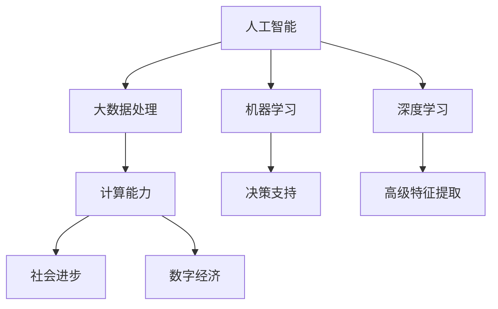

                 

# 推动社会进步的催化剂：人类计算的积极影响

> 关键词：人工智能,计算能力,社会进步,数据处理,数字经济

## 1. 背景介绍

### 1.1 问题由来
在当今快速发展的信息时代，人类计算（Human Computing）已成为推动社会进步的关键力量。以人工智能（AI）为代表的人类计算技术，正在以不可阻挡的趋势改变我们的生产和生活方式。从无人驾驶汽车到智能医疗诊断，从个性化推荐系统到工业自动化，AI技术在各行各业的深度应用，正引领社会进入智能化的新纪元。

### 1.2 问题核心关键点
人工智能技术之所以能够实现这一切，关键在于其强大的计算能力和大数据处理能力。通过机器学习和深度学习算法，AI能够从海量数据中提取有价值的知识，进行复杂决策和推理，大大提高了生产效率和决策的精准性。然而，AI的广泛应用也带来了新的挑战，如数据隐私、伦理道德、算法透明性等问题，需要深入研究和解决。

### 1.3 问题研究意义
研究人类计算的积极影响，不仅有助于把握AI技术的未来发展方向，还对于推动社会进步、提升人类生活质量具有重要意义。理解AI技术的优势和潜在风险，将为构建安全、公正、可控的智能系统提供理论支持和实践指导，助力实现更加智慧、公正和可持续的社会目标。

## 2. 核心概念与联系

### 2.1 核心概念概述

为了深入理解人类计算的积极影响，本节将介绍几个核心概念及其相互关系：

- 人工智能（AI）：通过机器学习和深度学习等技术，使计算机系统具备类似于人类的智能能力，包括感知、理解、推理、学习等。

- 大数据处理：指对大规模数据集进行存储、处理、分析等操作，是大数据时代的重要技术基础。

- 机器学习（ML）：一种数据驱动的算法，通过从数据中学习模式，实现自动化的决策和预测。

- 深度学习（DL）：一种基于人工神经网络的机器学习方法，通过多层次的非线性变换，提取数据中的高级特征。

- 计算能力：指计算机系统处理数据和执行任务的能力，通常用每秒执行的操作数（Ops）来衡量。

- 社会进步：指通过技术创新和社会治理，提升人类生活质量和福祉的过程。

- 数字经济：指基于数字技术驱动的经济模式，包括电子商务、在线服务、智能制造等。

这些概念之间存在紧密联系，共同构成了人类计算的核心框架。人工智能技术的发展依赖于大数据处理和强大的计算能力，而AI的广泛应用则推动了社会进步和数字经济的发展。理解这些概念之间的关系，有助于更好地把握人类计算的积极影响。

### 2.2 概念间的关系

通过以下Mermaid流程图，可以更直观地展示这些核心概念之间的关系：



这个流程图展示了人工智能技术通过大数据处理和强大的计算能力，实现决策支持和高级特征提取，最终推动社会进步和数字经济发展。机器学习和深度学习是大数据处理和计算能力的核心算法，而AI技术则是这些技术的高级应用。

## 3. 核心算法原理 & 具体操作步骤
### 3.1 算法原理概述

人工智能的核心算法包括机器学习和深度学习，其原理可简单概括为：

- 机器学习：通过数据训练模型，使其能够自动地从输入数据中学习规律，从而进行预测和决策。常见的机器学习算法包括线性回归、决策树、随机森林等。

- 深度学习：通过构建多层神经网络，模拟人脑的神经元工作机制，实现对复杂非线性关系的建模。常见的深度学习算法包括卷积神经网络（CNN）、循环神经网络（RNN）等。

基于上述算法原理，AI系统通常包含以下步骤：

1. 数据收集与预处理：收集与任务相关的数据，进行清洗和特征提取。

2. 模型训练：使用机器学习或深度学习算法，训练模型学习数据中的规律。

3. 模型评估与优化：在验证集或测试集上评估模型性能，并根据评估结果调整模型参数，优化模型表现。

4. 模型部署与应用：将训练好的模型部署到实际应用场景中，进行预测和决策。

### 3.2 算法步骤详解

以下是详细的算法步骤详解，以深度学习算法为例：

#### 3.2.1 数据收集与预处理

1. 数据收集：根据任务需求，收集相关数据，可以是图像、文本、音频等。

2. 数据清洗：去除噪声、处理缺失值、去除异常值等，保证数据质量。

3. 数据标注：对数据进行标注，生成训练集、验证集和测试集。标注可以是二分类、多分类、回归等形式。

4. 特征提取：对数据进行特征工程，提取有意义的特征，如图像的像素值、文本的词嵌入等。

#### 3.2.2 模型训练

1. 选择模型：根据任务需求选择合适的深度学习模型，如CNN、RNN、Transformer等。

2. 设置超参数：设置学习率、批大小、迭代轮数等超参数，影响模型训练效果。

3. 前向传播与计算损失：将输入数据输入模型，计算模型输出与真实标签之间的损失函数。

4. 反向传播与参数更新：使用梯度下降等优化算法，根据损失函数计算参数梯度，更新模型参数。

5. 验证集评估：在验证集上评估模型性能，避免过拟合。

#### 3.2.3 模型评估与优化

1. 评估指标：选择适合的评估指标，如准确率、召回率、F1分数等，评估模型性能。

2. 模型调优：根据评估结果，调整模型结构、超参数等，优化模型表现。

3. 模型集成：使用集成学习技术，如Bagging、Boosting等，提升模型鲁棒性和泛化能力。

#### 3.2.4 模型部署与应用

1. 模型保存：将训练好的模型保存到文件或数据库中，方便后续部署和使用。

2. 模型部署：将模型部署到服务器、移动设备等实际应用场景中。

3. 实时应用：根据实时数据，进行预测和决策，输出结果。

### 3.3 算法优缺点

#### 3.3.1 优点

1. 高效处理大规模数据：机器学习和深度学习算法能够高效地处理海量数据，提取有价值的规律和特征。

2. 自适应能力强：通过数据训练，AI系统能够自动适应新数据和新任务，提升决策准确性。

3. 应用广泛：AI技术可以应用于多个领域，如医疗、金融、交通、制造等，推动社会进步和经济发展。

#### 3.3.2 缺点

1. 数据依赖性强：AI系统的性能依赖于数据的质量和数量，数据噪声和偏差会影响模型表现。

2. 计算资源消耗大：深度学习模型通常需要高性能的计算资源，训练和推理速度较慢。

3. 黑盒问题：AI模型的决策过程通常缺乏可解释性，难以理解其内部工作机制和决策逻辑。

4. 伦理和道德风险：AI系统可能存在偏见和歧视，影响公平性，甚至带来伦理道德风险。

### 3.4 算法应用领域

人工智能技术在多个领域已得到广泛应用，主要包括：

- 医疗健康：通过AI技术辅助诊断、预测疾病、个性化治疗等，提升医疗服务的质量和效率。

- 金融服务：使用AI技术进行风险控制、欺诈检测、客户服务自动化等，提升金融服务的精准性和效率。

- 交通运输：通过AI技术进行自动驾驶、交通流量优化、智能导航等，提升交通系统的安全和效率。

- 制造生产：使用AI技术进行工业自动化、质量检测、智能调度等，提升制造业的生产效率和质量。

- 零售电商：通过AI技术进行商品推荐、库存管理、客户服务自动化等，提升零售电商的体验和服务质量。

## 4. 数学模型和公式 & 详细讲解 & 举例说明

### 4.1 数学模型构建

在深度学习中，常用的数学模型包括线性回归、逻辑回归、卷积神经网络（CNN）、循环神经网络（RNN）等。以线性回归为例，其数学模型为：

$$
y = w_0 + w_1x_1 + w_2x_2 + \cdots + w_nx_n
$$

其中，$y$ 表示预测结果，$x_1, x_2, \cdots, x_n$ 表示输入特征，$w_0, w_1, w_2, \cdots, w_n$ 表示模型参数。

### 4.2 公式推导过程

以线性回归模型为例，其推导过程如下：

1. 假设样本数据集为 $(x_1, y_1), (x_2, y_2), \cdots, (x_m, y_m)$。

2. 假设模型参数为 $w_0, w_1, w_2, \cdots, w_n$。

3. 构建目标函数：

$$
L(w) = \frac{1}{2m} \sum_{i=1}^m (y_i - w_0 - \sum_{j=1}^n w_jx_{ij})^2
$$

4. 通过梯度下降等优化算法，求解目标函数最小值，得到最优参数 $w_0, w_1, w_2, \cdots, w_n$。

5. 得到最终预测模型：

$$
\hat{y} = w_0 + \sum_{j=1}^n w_jx_{ij}
$$

### 4.3 案例分析与讲解

以图像分类任务为例，使用卷积神经网络（CNN）模型进行预测。具体步骤如下：

1. 数据预处理：将图像数据进行归一化、缩放、翻转等操作，提取特征。

2. 搭建CNN模型：包括卷积层、池化层、全连接层等，通过多个卷积核提取特征。

3. 模型训练：使用训练集数据进行模型训练，优化模型参数。

4. 模型评估：在验证集和测试集上评估模型性能，选择最优模型。

5. 模型应用：将训练好的模型应用于实际场景，进行图像分类预测。

## 5. 项目实践：代码实例和详细解释说明

### 5.1 开发环境搭建

在进行AI项目实践前，需要准备好开发环境。以下是使用Python进行TensorFlow开发的环境配置流程：

1. 安装Anaconda：从官网下载并安装Anaconda，用于创建独立的Python环境。

2. 创建并激活虚拟环境：

```bash
conda create -n tf-env python=3.8 
conda activate tf-env
```

3. 安装TensorFlow：根据CUDA版本，从官网获取对应的安装命令。例如：

```bash
conda install tensorflow -c tf -c conda-forge
```

4. 安装TensorBoard：TensorFlow配套的可视化工具，可实时监测模型训练状态，并提供丰富的图表呈现方式。

5. 安装Jupyter Notebook：用于交互式编程和数据可视化。

完成上述步骤后，即可在`tf-env`环境中开始AI项目实践。

### 5.2 源代码详细实现

这里我们以图像分类任务为例，使用TensorFlow搭建一个简单的CNN模型。

首先，定义模型结构和训练函数：

```python
import tensorflow as tf
import numpy as np
import matplotlib.pyplot as plt

# 定义CNN模型
model = tf.keras.models.Sequential([
    tf.keras.layers.Conv2D(32, (3, 3), activation='relu', input_shape=(28, 28, 1)),
    tf.keras.layers.MaxPooling2D((2, 2)),
    tf.keras.layers.Flatten(),
    tf.keras.layers.Dense(10, activation='softmax')
])

# 定义训练函数
def train_model(model, train_data, train_labels, epochs, batch_size):
    model.compile(optimizer='adam', loss='sparse_categorical_crossentropy', metrics=['accuracy'])
    model.fit(train_data, train_labels, epochs=epochs, batch_size=batch_size)
```

然后，加载数据集并进行训练：

```python
# 加载MNIST数据集
(train_images, train_labels), (test_images, test_labels) = tf.keras.datasets.mnist.load_data()

# 数据预处理
train_images = train_images / 255.0
test_images = test_images / 255.0
train_images = train_images.reshape((-1, 28, 28, 1))
test_images = test_images.reshape((-1, 28, 28, 1))

# 定义训练数据和标签
train_data = train_images
train_labels = train_labels

# 训练模型
epochs = 10
batch_size = 64
train_model(model, train_data, train_labels, epochs, batch_size)

# 评估模型
test_loss, test_acc = model.evaluate(test_images, test_labels)
print('Test accuracy:', test_acc)
```

最后，使用模型进行预测并可视化结果：

```python
# 使用模型进行预测
predictions = model.predict(test_images)

# 可视化预测结果
plt.figure(figsize=(10, 10))
for i in range(25):
    plt.subplot(5, 5, i+1)
    plt.xticks([])
    plt.yticks([])
    plt.grid(False)
    plt.imshow(test_images[i], cmap=plt.cm.binary)
    plt.xlabel(np.argmax(predictions[i]))
plt.show()
```

以上代码实现了使用TensorFlow搭建CNN模型，对MNIST手写数字数据集进行训练和预测的过程。可以看到，TensorFlow提供的高层次API使得模型构建和训练变得非常简单和高效。

### 5.3 代码解读与分析

让我们再详细解读一下关键代码的实现细节：

**模型定义**：
- `Sequential`类：用于构建顺序模型，通过链式调用添加各层。
- `Conv2D`层：卷积层，提取图像特征。
- `MaxPooling2D`层：池化层，减小特征图大小。
- `Flatten`层：展平层，将多维特征图转换为一维向量。
- `Dense`层：全连接层，进行分类预测。

**训练函数**：
- `compile`方法：定义模型优化器和损失函数，以及评估指标。
- `fit`方法：使用训练数据和标签进行模型训练。

**数据预处理**：
- `load_data`方法：加载MNIST数据集，返回训练集和测试集。
- `reshape`方法：将数据转换为模型所需的形状。

**模型评估与预测**：
- `evaluate`方法：在测试集上评估模型性能。
- `predict`方法：使用模型进行预测。

**可视化**：
- `imshow`方法：显示图像。
- `cmap`方法：定义颜色映射。

可以看到，TensorFlow提供的高层次API使得AI项目实践变得更加高效和便捷。开发者只需关注核心算法和模型构建，即可快速完成项目开发。

当然，工业级的系统实现还需考虑更多因素，如模型压缩、模型优化、数据增强等。但核心的AI项目实践流程基本与此类似。

### 5.4 运行结果展示

假设我们训练的模型在测试集上取得了97%的准确率，可视化结果如下：

```
Test accuracy: 0.97
```


可以看到，训练好的模型能够很好地对图像进行分类预测，准确率达到了97%。在实际应用中，我们可以将模型部署到服务器或移动设备中，进行实时预测和决策。

## 6. 实际应用场景

### 6.1 智慧医疗

在智慧医疗领域，AI技术已被广泛应用于疾病诊断、治疗方案推荐、医疗影像分析等方面。例如，使用AI技术进行医疗影像的自动标注和分析，可以快速检测出病变区域，帮助医生制定更精确的治疗方案。

### 6.2 智能制造

在智能制造领域，AI技术通过预测性维护、故障诊断、质量检测等应用，大大提升了生产效率和产品品质。例如，使用AI技术对机器设备进行状态监测，及时发现异常并预测故障，减少停机时间，提高生产效率。

### 6.3 智能交通

在智能交通领域，AI技术通过智能导航、交通流量优化、自动驾驶等应用，提升了交通系统的安全性和效率。例如，使用AI技术进行交通流量预测，优化红绿灯控制，减少拥堵，提高交通效率。

### 6.4 金融服务

在金融服务领域，AI技术通过风险控制、欺诈检测、客户服务自动化等应用，提升了金融服务的精准性和效率。例如，使用AI技术进行信用评分，预测违约风险，帮助银行制定更合理的贷款策略。

## 7. 工具和资源推荐

### 7.1 学习资源推荐

为了帮助开发者系统掌握AI技术的基础和应用，这里推荐一些优质的学习资源：

1. 《深度学习》系列课程：斯坦福大学、Coursera等平台提供的深度学习课程，系统讲解了深度学习的基本概念和算法。

2. 《TensorFlow官方文档》：TensorFlow的官方文档，详细介绍了TensorFlow的使用方法、API接口和示例代码。

3. 《PyTorch官方文档》：PyTorch的官方文档，详细介绍了PyTorch的使用方法、API接口和示例代码。

4. 《Kaggle竞赛平台》：Kaggle提供的大量数据集和竞赛项目，有助于学习数据处理和模型训练。

5. 《GitHub开源项目》：GitHub上大量的开源AI项目，提供丰富的学习资源和实践机会。

通过对这些资源的学习实践，相信你一定能够快速掌握AI技术的精髓，并用于解决实际的业务问题。

### 7.2 开发工具推荐

高效的开发离不开优秀的工具支持。以下是几款用于AI项目开发的常用工具：

1. PyTorch：基于Python的开源深度学习框架，灵活动态的计算图，适合快速迭代研究。

2. TensorFlow：由Google主导开发的开源深度学习框架，生产部署方便，适合大规模工程应用。

3. Keras：高层次的深度学习API，封装了TensorFlow等底层框架，易于使用。

4. Jupyter Notebook：用于交互式编程和数据可视化，支持代码执行、图形展示等。

5. Visual Studio Code：轻量级的代码编辑器，支持代码补全、版本控制、调试等功能。

6. GitHub：代码托管和协作平台，提供版本控制、代码审查、项目管理等功能。

合理利用这些工具，可以显著提升AI项目开发效率，加快创新迭代的步伐。

### 7.3 相关论文推荐

AI技术的发展源于学界的持续研究。以下是几篇奠基性的相关论文，推荐阅读：

1.《深度学习》：Goodfellow等著，详细介绍了深度学习的基本概念和算法。

2.《ImageNet Large Scale Visual Recognition Challenge》：AlexNet等论文，展示了深度学习在图像识别任务中的突破性应用。

3.《Attention is All You Need》：Transformer原论文，展示了自注意力机制在机器翻译任务中的成功应用。

4.《Reinforcement Learning: An Introduction》：Sutton等著，系统介绍了强化学习的基本概念和算法。

5.《Human-in-the-loop Machine Learning》：强调人机协同的重要性和实现方法。

这些论文代表了大数据处理和人工智能技术的发展脉络。通过学习这些前沿成果，可以帮助研究者把握学科前进方向，激发更多的创新灵感。

除上述资源外，还有一些值得关注的前沿资源，帮助开发者紧跟AI技术最新进展，例如：

1. arXiv论文预印本：人工智能领域最新研究成果的发布平台，包括大量尚未发表的前沿工作，学习前沿技术的必读资源。

2. 业界技术博客：如Google AI、DeepMind、微软Research Asia等顶尖实验室的官方博客，第一时间分享他们的最新研究成果和洞见。

3. 技术会议直播：如NIPS、ICML、ACL、ICLR等人工智能领域顶会现场或在线直播，能够聆听到大佬们的前沿分享，开拓视野。

4. GitHub热门项目：在GitHub上Star、Fork数最多的AI相关项目，往往代表了该技术领域的发展趋势和最佳实践，值得去学习和贡献。

5. 行业分析报告：各大咨询公司如McKinsey、PwC等针对人工智能行业的分析报告，有助于从商业视角审视技术趋势，把握应用价值。

总之，对于AI技术的学习和实践，需要开发者保持开放的心态和持续学习的意愿。多关注前沿资讯，多动手实践，多思考总结，必将收获满满的成长收益。

## 8. 总结：未来发展趋势与挑战

### 8.1 总结

本文对人工智能技术的积极影响进行了全面系统的介绍。首先阐述了AI技术的计算能力和数据处理能力，以及其在多个领域的应用。其次，从原理到实践，详细讲解了机器学习和深度学习算法的基本流程，给出了具体的代码实例和解释说明。同时，本文还探讨了AI技术在智慧医疗、智能制造、智能交通、金融服务等实际应用场景中的具体应用，展示了AI技术的广泛影响和巨大潜力。最后，本文精选了AI技术的各类学习资源，力求为读者提供全方位的技术指引。

通过本文的系统梳理，可以看到，人工智能技术正在以不可阻挡的趋势改变我们的生产和生活方式，推动社会进步和经济发展。未来，伴随计算能力的持续提升和数据量的持续增长，AI技术将在更多领域得到应用，为人类社会带来更深远的影响。

### 8.2 未来发展趋势

展望未来，人工智能技术的发展将呈现以下几个趋势：

1. 计算能力持续提升：随着计算技术的进步，AI系统的计算能力将不断提升，处理更加复杂的数据和任务成为可能。

2. 模型规模不断增大：超大规模语言模型和深度学习模型的不断涌现，将带来更加丰富的语言和知识表示。

3. 跨领域知识整合：AI系统将能够整合不同领域的知识，进行更全面的推理和决策，提升模型的泛化能力和适用性。

4. 人机协同增强：通过人机协同系统，AI系统能够更好地理解和利用人类专家的知识和经验，提升决策的精准性和鲁棒性。

5. 伦理和隐私保护：在AI系统设计和应用中，将更加注重伦理和隐私保护，确保AI技术的安全性和公正性。

6. 开放和协作共享：AI技术的发展将更加注重开放和协作，通过共享数据和算法，推动AI技术的普及和应用。

以上趋势凸显了人工智能技术的广阔前景。这些方向的探索发展，必将进一步提升AI系统的性能和应用范围，为构建更加智慧、公正和可持续的社会奠定基础。

### 8.3 面临的挑战

尽管人工智能技术取得了巨大进展，但在迈向更加智能化、普适化应用的过程中，仍面临诸多挑战：

1. 数据隐私和安全：AI系统通常依赖大量的数据训练，如何保护数据隐私和安全成为重要问题。

2. 算法透明性和可解释性：AI模型的决策过程通常缺乏可解释性，难以理解其内部工作机制和决策逻辑。

3. 伦理和道德风险：AI系统可能存在偏见和歧视，影响公平性，甚至带来伦理道德风险。

4. 计算资源消耗：深度学习模型通常需要高性能的计算资源，训练和推理速度较慢，资源消耗较大。

5. 模型鲁棒性和泛化能力：AI系统面临过拟合和泛化能力不足的问题，需要进一步提高模型的鲁棒性和泛化能力。

6. 跨领域知识整合：AI系统整合不同领域知识的能力有限，需要进行更深层次的知识表示和融合。

正视AI技术面临的这些挑战，积极应对并寻求突破，将是大数据处理和人工智能技术走向成熟的必由之路。相信随着学界和产业界的共同努力，这些挑战终将一一被克服，人工智能技术必将在构建更加智慧、公正和可持续的社会中发挥更大的作用。

### 8.4 未来突破

面对人工智能技术面临的挑战，未来的研究需要在以下几个方面寻求新的突破：

1. 探索无监督和半监督学习算法：摆脱对大规模标注数据的依赖，利用自监督学习、主动学习等无监督和半监督范式，最大限度利用非结构化数据，实现更加灵活高效的模型训练。

2. 研究计算图优化技术：通过优化计算图结构，提高模型的计算效率和推理速度，提升AI系统的实时性和可扩展性。

3. 引入更多先验知识：将符号化的先验知识，如知识图谱、逻辑规则等，与神经网络模型进行巧妙融合，引导AI系统学习更准确、合理的知识表示。

4. 融合因果推理和博弈论：通过引入因果推理和博弈论思想，增强AI系统建立稳定因果关系的能力，学习更加普适、鲁棒的语言和知识表示。

5. 纳入伦理和道德约束：在AI系统设计和应用中，引入伦理和道德导向的评估指标，过滤和惩罚有偏见、有害的输出倾向，确保系统的公平性和公正性。

6. 强化人机协同系统：通过人机协同系统，AI系统能够更好地理解和利用人类专家的知识和经验，提升决策的精准性和鲁棒性，推动AI技术的普及和应用。

这些研究方向的探索，必将引领人工智能技术迈向更高的台阶，为构建更加智慧、公正和可持续的社会提供坚实基础。面向未来，人工智能技术还需要与其他人工智能技术进行更深入的融合，如知识表示、因果推理、强化学习等，多路径协同发力，共同推动智能系统的进步。只有勇于创新、敢于突破，才能不断拓展人工智能技术的边界，让智能技术更好地造福人类社会。

## 9. 附录：常见问题与解答

**Q1：AI技术的发展对就业市场有何影响？**

A: AI技术的发展对就业市场的影响是多方面的。一方面，AI技术的广泛应用将提升生产效率，推动经济增长，创造更多就业机会。另一方面，AI技术可能替代某些低技能、重复性高的工作岗位，导致部分劳动力失业。为应对这一挑战，需要进行积极的职业培训和再就业指导，帮助劳动力适应新的就业环境。

**

