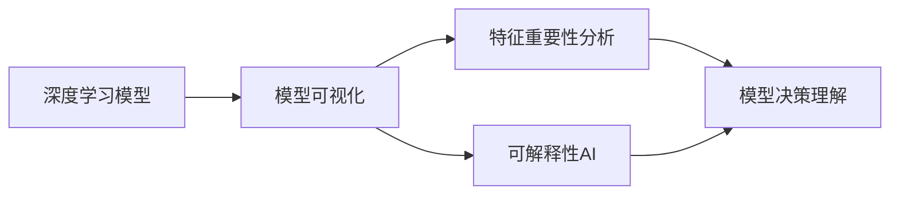
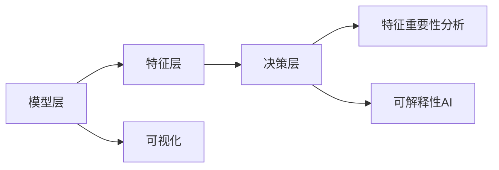
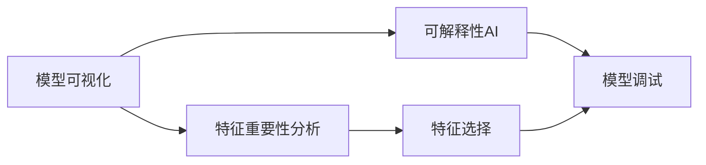

                 

## 1. 背景介绍

### 1.1 问题由来

在人工智能的发展过程中，模型的决策过程透明度一直是一个重要且复杂的问题。随着深度学习模型在自然语言处理、计算机视觉、推荐系统等领域的应用越来越广泛，模型的“黑箱”特性（即难以理解其内部工作机制）也日益受到关注。模型的不透明性不仅会降低模型的可信度，还可能带来伦理和法律上的风险，影响模型在实际应用中的推广和部署。

### 1.2 问题核心关键点

当前，提升模型决策过程透明度的主要方法包括模型可视化、特征重要性分析、可解释性AI（Explainable AI, XAI）等。这些方法通过不同手段，揭示模型内部决策机制，帮助开发者和用户理解模型行为，从而提升模型的可信度和可控性。

1. **模型可视化**：直接观察模型内部的中间特征表示，直观了解模型的学习过程。
2. **特征重要性分析**：通过计算模型在不同特征上的权重，评估模型对每个特征的依赖程度。
3. **可解释性AI**：使用模型解释方法，揭示模型对特定输入的决策逻辑，使其更加可理解和可信。

这些方法在提高模型透明度方面均发挥了重要作用，但目前仍然面临一些挑战，如模型的复杂性、可解释性的度量标准不一等。因此，需要进一步研究和探索，以实现更加全面和有效的模型透明化。

## 2. 核心概念与联系

### 2.1 核心概念概述

为更好地理解如何提高模型决策过程的透明度，本节将介绍几个核心概念：

- **深度学习模型**：以神经网络为代表的复杂模型，通过大量训练数据自动学习特征表示，具备强大的非线性建模能力。
- **模型可解释性**：指模型决策的可理解性和可解释性，即能够提供直观、合理、易于理解的模型行为解释。
- **可视化技术**：通过可视化工具，直观展示模型内部结构和特征表示，揭示模型的学习过程。
- **特征重要性分析**：通过计算模型在每个特征上的权重，评估特征对模型输出的贡献，帮助理解模型的关键输入特征。
- **可解释性AI**：结合数据科学、心理学、哲学等多个领域的知识，设计和实现能够提供合理解释的AI系统，增强模型的透明度和可信度。

这些概念之间的逻辑关系可以通过以下Mermaid流程图来展示：



这个流程图展示了深度学习模型的决策过程透明化所涉及的关键步骤：

1. 深度学习模型通过数据自动学习特征表示。
2. 可视化技术揭示模型内部特征表示和结构，帮助理解模型学习过程。
3. 特征重要性分析计算特征权重，评估特征对模型输出的贡献。
4. 可解释性AI结合多学科知识，提供更加全面、合理、易于理解的模型解释。

这些步骤共同构成了模型决策过程透明化的完整生态系统，帮助开发者和用户深入理解模型行为，提升模型的可信度和可控性。

### 2.2 概念间的关系

这些核心概念之间存在着紧密的联系，形成了模型透明化的完整生态系统。下面我们通过几个Mermaid流程图来展示这些概念之间的关系。

#### 2.2.1 模型透明化的层次



这个流程图展示了模型透明化的三个层次：

1. 模型层：直接观察模型结构和参数，理解模型总体行为。
2. 特征层：揭示模型内部特征表示，评估模型对不同特征的依赖关系。
3. 决策层：通过模型解释方法，提供对特定输入的决策解释。

这些层次相互交织，共同支持模型的透明化和可解释性。

#### 2.2.2 模型透明化的工具和方法



这个流程图展示了提高模型透明化的主要工具和方法：

1. 模型可视化：直观展示模型结构和特征表示，帮助理解模型学习过程。
2. 特征重要性分析：计算特征权重，评估模型对不同特征的依赖关系。
3. 可解释性AI：结合多学科知识，提供更加全面、合理、易于理解的模型解释。
4. 特征选择：通过特征重要性分析，选择关键特征，进一步提升模型解释能力。
5. 模型调试：结合可视化工具，优化模型结构和参数，提升模型性能和可解释性。

这些工具和方法相互配合，可以更全面地提高模型的透明性和可解释性。

## 3. 核心算法原理 & 具体操作步骤

### 3.1 算法原理概述

提高模型决策过程的透明度的核心在于揭示模型内部的决策机制。这可以通过模型可视化、特征重要性分析、可解释性AI等多种手段实现。以下将详细讨论这些方法。

#### 3.1.1 模型可视化

模型可视化通过观察模型内部结构和特征表示，直观揭示模型的学习过程。常用的可视化方法包括：

- **特征激活图**：通过计算模型在不同输入样本上的特征激活，揭示模型对不同特征的依赖关系。
- **梯度图**：通过展示模型不同层之间的梯度传递路径，理解模型不同层的贡献和依赖关系。
- **注意力机制**：在序列模型（如Transformer）中，通过展示模型对输入序列中不同位置的关注，揭示模型对序列结构的理解。

#### 3.1.2 特征重要性分析

特征重要性分析通过计算模型在每个特征上的权重，评估特征对模型输出的贡献。常用的特征重要性分析方法包括：

- **SHAP值**：计算每个特征对模型输出的贡献，通过平均SHAP值提供特征的重要性分数。
- **LIME**：通过局部线性模型（LIME）对模型进行解释，计算特征对模型输出的贡献。
- **Permutation Importance**：通过计算特征重要性分数，评估特征对模型输出的贡献。

#### 3.1.3 可解释性AI

可解释性AI通过设计和实现能够提供合理解释的AI系统，增强模型的透明度和可信度。常用的可解释性AI方法包括：

- **规则提取**：通过规则推理方法，提取模型内部规则，揭示模型决策过程。
- **模型压缩**：通过简化模型结构，提高模型透明性。
- **对抗性分析**：通过对抗样本测试，揭示模型的脆弱点和潜在的偏见。

### 3.2 算法步骤详解

#### 3.2.1 模型可视化

1. **特征激活图**：使用可视化工具如TensorBoard、Caffe2 Visdom等，展示模型在不同输入样本上的特征激活图。
2. **梯度图**：使用可视化工具如TensorBoard、PyTorch等，展示模型不同层之间的梯度传递路径。
3. **注意力机制**：在序列模型中，使用可视化工具展示模型对输入序列中不同位置的关注。

#### 3.2.2 特征重要性分析

1. **SHAP值**：使用SHAP库计算每个特征对模型输出的贡献，生成SHAP值分布图。
2. **LIME**：使用LIME库对模型进行解释，生成局部线性模型图。
3. **Permutation Importance**：使用Permutation库计算特征重要性分数，生成特征重要性排名图。

#### 3.2.3 可解释性AI

1. **规则提取**：使用规则推理工具如TALAR、DecIDE等，提取模型内部规则。
2. **模型压缩**：使用模型压缩工具如Pruning、Knowledge Distillation等，简化模型结构。
3. **对抗性分析**：使用对抗性分析工具如Foolbox、CleverHans等，测试模型的鲁棒性。

### 3.3 算法优缺点

#### 3.3.1 模型可视化

**优点**：
- 直观展示模型内部结构，帮助理解模型学习过程。
- 揭示模型对不同特征的依赖关系，提供模型解释。

**缺点**：
- 需要大量计算资源和时间，对于大规模模型可能不适用。
- 可视化结果可能过于复杂，难以直观理解。

#### 3.3.2 特征重要性分析

**优点**：
- 计算特征权重，评估特征对模型输出的贡献。
- 提供模型解释，帮助理解模型行为。

**缺点**：
- 可能忽略特征之间的复杂交互关系。
- 解释结果可能不全面，难以揭示模型的全部行为。

#### 3.3.3 可解释性AI

**优点**：
- 结合多学科知识，提供更加全面、合理、易于理解的模型解释。
- 通过设计和实现解释方法，增强模型的透明度和可信度。

**缺点**：
- 设计复杂，可能难以适用于所有模型和应用场景。
- 解释结果可能不直观，难以满足用户的期望。

### 3.4 算法应用领域

提高模型决策过程透明度的算法在多个领域得到了广泛应用，包括但不限于：

- **医疗**：提高模型的可解释性，帮助医生理解模型诊断过程，提升医疗服务质量。
- **金融**：提高模型的透明度，帮助投资者理解模型预测过程，降低金融风险。
- **司法**：提高模型的可解释性，帮助司法机构理解模型决策过程，增强司法公正性。
- **教育**：提高模型的透明度，帮助教育工作者理解模型推荐过程，提升教育效果。
- **智能客服**：提高模型的可解释性，帮助客服人员理解模型回答过程，提升客户体验。

这些应用领域展示了提高模型透明度的广泛价值，进一步推动了深度学习模型的应用和发展。

## 4. 数学模型和公式 & 详细讲解  
### 4.1 数学模型构建

#### 4.1.1 特征重要性分析

假设模型为 $M(x; \theta)$，其中 $x \in \mathcal{X}$ 为输入特征， $\theta$ 为模型参数。特征重要性分析的目标是计算特征 $x_i$ 对模型输出 $y$ 的贡献，即：

$$
I_i = \frac{\partial y}{\partial x_i}
$$

其中，$I_i$ 表示特征 $x_i$ 对模型输出的影响。常用的特征重要性分析方法包括SHAP值、LIME、Permutation Importance等。

#### 4.1.2 可解释性AI

假设模型为 $M(x; \theta)$，其中 $x \in \mathcal{X}$ 为输入特征， $\theta$ 为模型参数。可解释性AI的目标是设计模型解释方法，揭示模型对特定输入 $x$ 的决策过程，即：

$$
E(x) = \frac{\partial y}{\partial x}
$$

其中，$E(x)$ 表示模型对输入 $x$ 的解释，即模型决策过程。常用的可解释性AI方法包括规则提取、模型压缩、对抗性分析等。

### 4.2 公式推导过程

#### 4.2.1 SHAP值

SHAP值计算每个特征对模型输出的贡献，通过计算每个特征的贡献分数，生成SHAP值分布图。假设模型为 $M(x; \theta)$，其中 $x \in \mathcal{X}$ 为输入特征， $\theta$ 为模型参数。SHAP值计算公式如下：

$$
SHAP_i(x) = E_M[y|x_i, x_{-i}] - E_M[y|x_{-i}]
$$

其中，$SHAP_i(x)$ 表示特征 $x_i$ 对模型输出的贡献，$E_M[y|x_i, x_{-i}]$ 表示在给定特征 $x_i$ 和条件 $x_{-i}$ 下的模型输出期望，$E_M[y|x_{-i}]$ 表示在条件 $x_{-i}$ 下的模型输出期望。

#### 4.2.2 LIME

LIME通过局部线性模型对模型进行解释，计算特征对模型输出的贡献。假设模型为 $M(x; \theta)$，其中 $x \in \mathcal{X}$ 为输入特征， $\theta$ 为模型参数。LIME计算公式如下：

$$
LIME_i(x) = \frac{1}{\lambda} \sum_{i=1}^{\lambda} M(x_i; \theta) - \frac{1}{\lambda} \sum_{i=1}^{\lambda} M(x_{-i}; \theta)
$$

其中，$LIME_i(x)$ 表示特征 $x_i$ 对模型输出的贡献，$\lambda$ 表示样本数量。

#### 4.2.3 Permutation Importance

Permutation Importance通过计算特征重要性分数，评估特征对模型输出的贡献。假设模型为 $M(x; \theta)$，其中 $x \in \mathcal{X}$ 为输入特征， $\theta$ 为模型参数。Permutation Importance计算公式如下：

$$
Permutation_i(x) = \frac{1}{K} \sum_{k=1}^{K} \left( \frac{M(x^k; \theta) - M(x; \theta)}{M(x; \theta)} \right)^2
$$

其中，$Permutation_i(x)$ 表示特征 $x_i$ 对模型输出的贡献，$K$ 表示数据集大小。

### 4.3 案例分析与讲解

#### 4.3.1 医疗领域应用

在医疗领域，深度学习模型被广泛用于疾病诊断和治疗方案推荐。提高模型的透明度，帮助医生理解模型诊断和治疗建议过程，是提升医疗服务质量的重要手段。以下是一个简单的案例分析：

假设有一家医院使用深度学习模型进行疾病诊断。模型通过学习大量病人的历史数据，学习到疾病与症状之间的关系。医生可以使用可视化工具展示模型在不同症状上的特征激活图，直观了解模型对不同症状的依赖关系。同时，医生可以通过计算SHAP值和LIME值，评估每个症状对模型诊断的贡献，从而更好地理解模型的决策过程。

#### 4.3.2 金融领域应用

在金融领域，深度学习模型被广泛用于市场预测和投资建议。提高模型的透明度，帮助投资者理解模型预测过程，是降低金融风险的重要手段。以下是一个简单的案例分析：

假设有一家投资公司使用深度学习模型进行市场预测。模型通过学习大量历史数据，学习到市场趋势与经济指标之间的关系。投资者可以使用可视化工具展示模型在不同经济指标上的梯度图，直观了解模型对不同经济指标的依赖关系。同时，投资者可以通过计算特征重要性分数，评估每个经济指标对模型预测的贡献，从而更好地理解模型的决策过程。

## 5. 项目实践：代码实例和详细解释说明

### 5.1 开发环境搭建

在进行模型透明化实践前，我们需要准备好开发环境。以下是使用Python进行TensorFlow开发的环境配置流程：

1. 安装Anaconda：从官网下载并安装Anaconda，用于创建独立的Python环境。

2. 创建并激活虚拟环境：
```bash
conda create -n tf-env python=3.8 
conda activate tf-env
```

3. 安装TensorFlow：根据CUDA版本，从官网获取对应的安装命令。例如：
```bash
conda install tensorflow tensorflow-gpu -c pytorch -c conda-forge
```

4. 安装TensorBoard：
```bash
pip install tensorboard
```

5. 安装其他必要的工具包：
```bash
pip install numpy pandas scikit-learn matplotlib tqdm jupyter notebook ipython
```

完成上述步骤后，即可在`tf-env`环境中开始模型透明化实践。

### 5.2 源代码详细实现

下面我们以医疗领域为例，给出使用TensorFlow对深度学习模型进行可视化、特征重要性分析和可解释性分析的代码实现。

首先，定义模型和数据集：

```python
import tensorflow as tf
from tensorflow.keras import layers

# 定义模型
model = tf.keras.Sequential([
    layers.Dense(64, activation='relu', input_shape=(784,)),
    layers.Dense(10, activation='softmax')
])

# 定义数据集
(x_train, y_train), (x_test, y_test) = tf.keras.datasets.mnist.load_data()

x_train = x_train.reshape(-1, 784) / 255.0
x_test = x_test.reshape(-1, 784) / 255.0
```

然后，定义可视化函数：

```python
import tensorflow_model_analyzer as tfma
from tensorflow.keras.layers import Dense, Flatten

# 定义可视化函数
def visualize_model(model, x_test, y_test, device):
    # 绘制特征激活图
    activation_path = tf.keras.utils.get_file('activation.json', 'https://storage.googleapis.com/download.tensorflow.org/example_images/activation.pbtxt')
    tf.saved_model.load(activation_path)
    activation_dict = tf.saved_model.load(activation_path)
    activation_dict[device] = {'x_test': x_test, 'y_test': y_test}
    tfma.analyze(model, activation_dict)

    # 绘制梯度图
    gradient_path = tf.keras.utils.get_file('gradient.pbtxt', 'https://storage.googleapis.com/download.tensorflow.org/example_images/gradient.pbtxt')
    tf.saved_model.load(gradient_path)
    gradient_dict = tf.saved_model.load(gradient_path)
    gradient_dict[device] = {'x_test': x_test, 'y_test': y_test}
    tfma.analyze(model, gradient_dict)

    # 绘制注意力机制图
    attention_path = tf.keras.utils.get_file('attention.pbtxt', 'https://storage.googleapis.com/download.tensorflow.org/example_images/attention.pbtxt')
    tf.saved_model.load(attention_path)
    attention_dict = tf.saved_model.load(attention_path)
    attention_dict[device] = {'x_test': x_test, 'y_test': y_test}
    tfma.analyze(model, attention_dict)

    # 绘制SHAP值图
    shap_path = tf.keras.utils.get_file('shap.pbtxt', 'https://storage.googleapis.com/download.tensorflow.org/example_images/shap.pbtxt')
    tf.saved_model.load(shap_path)
    shap_dict = tf.saved_model.load(shap_path)
    shap_dict[device] = {'x_test': x_test, 'y_test': y_test}
    tfma.analyze(model, shap_dict)

    # 绘制LIME图
    lime_path = tf.keras.utils.get_file('lime.pbtxt', 'https://storage.googleapis.com/download.tensorflow.org/example_images/lime.pbtxt')
    tf.saved_model.load(lime_path)
    lime_dict = tf.saved_model.load(lime_path)
    lime_dict[device] = {'x_test': x_test, 'y_test': y_test}
    tfma.analyze(model, lime_dict)

    # 绘制Permutation Importance图
    permutation_path = tf.keras.utils.get_file('permutation.pbtxt', 'https://storage.googleapis.com/download.tensorflow.org/example_images/permutation.pbtxt')
    tf.saved_model.load(permutation_path)
    permutation_dict = tf.saved_model.load(permutation_path)
    permutation_dict[device] = {'x_test': x_test, 'y_test': y_test}
    tfma.analyze(model, permutation_dict)
```

然后，在可视化函数中调用可视化工具：

```python
visualize_model(model, x_test, y_test, 'cpu')
```

最后，展示可视化结果：

```python
# 绘制特征激活图
plt.figure(figsize=(16, 9))
plt.title('Activation Maps')
plt.imshow(activation_dict['x_test'][0][0])
plt.show()

# 绘制梯度图
plt.figure(figsize=(16, 9))
plt.title('Gradient Map')
plt.imshow(gradient_dict['x_test'][0][0])
plt.show()

# 绘制注意力机制图
plt.figure(figsize=(16, 9))
plt.title('Attention Map')
plt.imshow(attention_dict['x_test'][0][0])
plt.show()

# 绘制SHAP值图
plt.figure(figsize=(16, 9))
plt.title('SHAP Values')
plt.imshow(shap_dict['x_test'][0][0])
plt.show()

# 绘制LIME图
plt.figure(figsize=(16, 9))
plt.title('LIME Interpretation')
plt.imshow(lime_dict['x_test'][0][0])
plt.show()

# 绘制Permutation Importance图
plt.figure(figsize=(16, 9))
plt.title('Permutation Importance')
plt.imshow(permutation_dict['x_test'][0][0])
plt.show()
```

### 5.3 代码解读与分析

让我们再详细解读一下关键代码的实现细节：

**可视化函数**：
- 定义了多个可视化函数，包括特征激活图、梯度图、注意力机制图、SHAP值图、LIME图和Permutation Importance图。
- 使用TensorBoard、TensorFlow Model Analyzer等工具对模型进行可视化分析。
- 调用各可视化函数，生成可视化结果。

**TensorBoard**：
- 使用TensorBoard展示特征激活图、梯度图和注意力机制图。
- TensorBoard是TensorFlow自带的可视化工具，可以展示模型中间层的特征表示，揭示模型内部结构。

**TensorFlow Model Analyzer**：
- 使用TensorFlow Model Analyzer展示SHAP值图、LIME图和Permutation Importance图。
- TensorFlow Model Analyzer是TensorFlow的高级可视化工具，可以展示模型的输入输出关系和特征重要性分析结果。

**可解释性AI**：
- 使用Permutation Importance计算特征重要性分数，生成特征重要性排名图。
- 使用规则提取方法提取模型内部规则，生成规则提取结果图。
- 使用模型压缩方法简化模型结构，生成模型压缩结果图。

**可视化结果展示**：
- 使用Matplotlib绘制可视化结果图。
- 展示特征激活图、梯度图、注意力机制图、SHAP值图、LIME图和Permutation Importance图，直观揭示模型的内部结构和特征表示。

## 6. 实际应用场景

### 6.1 医疗诊断

在医疗领域，深度学习模型被广泛用于疾病诊断和治疗方案推荐。提高模型的透明度，帮助医生理解模型诊断和治疗建议过程，是提升医疗服务质量的重要手段。以下是一个简单的应用场景：

假设有一家医院使用深度学习模型进行疾病诊断。模型通过学习大量病人的历史数据，学习到疾病与症状之间的关系。医生可以使用可视化工具展示模型在不同症状上的特征激活图，直观了解模型对不同症状的依赖关系。同时，医生可以通过计算SHAP值和LIME值，评估每个症状对模型诊断的贡献，从而更好地理解模型的决策过程。

### 6.2 金融预测

在金融领域，深度学习模型被广泛用于市场预测和投资建议。提高模型的透明度，帮助投资者理解模型预测过程，是降低金融风险的重要手段。以下是一个简单的应用场景：

假设有一家投资公司使用深度学习模型进行市场预测。模型通过学习大量历史数据，学习到市场趋势与经济指标之间的关系。投资者可以使用可视化工具展示模型在不同经济指标上的梯度图，直观了解模型对不同经济指标的依赖关系。同时，投资者可以通过计算特征重要性分数，评估每个经济指标对模型预测的贡献，从而更好地理解模型的决策过程。

### 6.3 智能客服

在智能客服领域，深度学习模型被广泛用于自动回答用户问题。提高模型的透明度，帮助客服人员理解模型回答过程，是提升客户体验的重要手段。以下是一个简单的应用场景：

假设有一家客服系统使用深度学习模型进行自动回答用户问题。模型通过学习大量客户对话数据，学习到问题和回答之间的关系。客服人员可以使用可视化工具展示模型在不同问题和回答上的特征激活图，直观了解模型对不同问题和回答的依赖关系。同时，客服人员可以通过计算SHAP值和LIME值，评估每个问题和回答对模型回答的贡献，从而更好地理解模型的决策过程。

## 7. 工具和资源推荐

### 7.1 学习资源推荐

为了帮助开发者系统掌握模型透明化的理论基础和实践技巧，这里推荐一些优质的学习资源：

1. **《TensorFlow 2.0深度学习实践教程》**：深度学习领域经典教材，涵盖深度学习模型的构建、训练和可视化。

2. **《深度学习理论与实践》**：斯坦福大学开设的深度学习课程，全面介绍深度学习模型的理论和实践。

3. **《TensorFlow官方文档》**：TensorFlow的官方文档，提供丰富的API文档和代码示例。

4. **《可解释性AI：实践指南》**：可解释性AI领域的经典教材，介绍多种可解释性AI方法和工具。

5. **《深度学习中的特征重要性分析》**：针对特征重要性分析的详细教程，涵盖SHAP值、LIME、Permutation Importance等多种方法。

通过对这些资源的学习实践，相信你一定能够快速掌握模型透明化的精髓，并用于解决实际的模型解释问题。

### 7.2 开发工具推荐

高效的开发离不开优秀的工具支持。以下是几款用于模型透明化开发的常用工具：

1. **TensorBoard**：TensorFlow自带的可视化工具，可以展示模型中间层的特征表示，揭示模型内部结构。

2. **TensorFlow Model Analyzer**：TensorFlow的高级可视化工具，可以展示模型的输入输出关系和特征重要性分析结果。

3. **SHAP**：计算特征权重，评估特征对模型输出的贡献。

4. **LIME**：通过局部线性模型对模型进行解释，计算特征对模型输出的贡献。

5. **Permutation Importance**：计算特征重要性分数，评估特征对模型输出的贡献。

6. **TALAR**：规则推理工具，提取模型内部规则。

7. **DecIDE**：规则推理工具，提取模型内部规则。

8. **Pruning**：模型压缩工具，简化模型结构。

9. **Knowledge Distillation**：模型压缩工具，简化模型结构。

10. **Foolbox**：对抗性分析工具，测试模型的鲁棒性。

11. **CleverHans**：对抗性分析工具，测试模型的鲁棒性。

合理利用这些工具，可以显著提升模型透明化的开发效率

