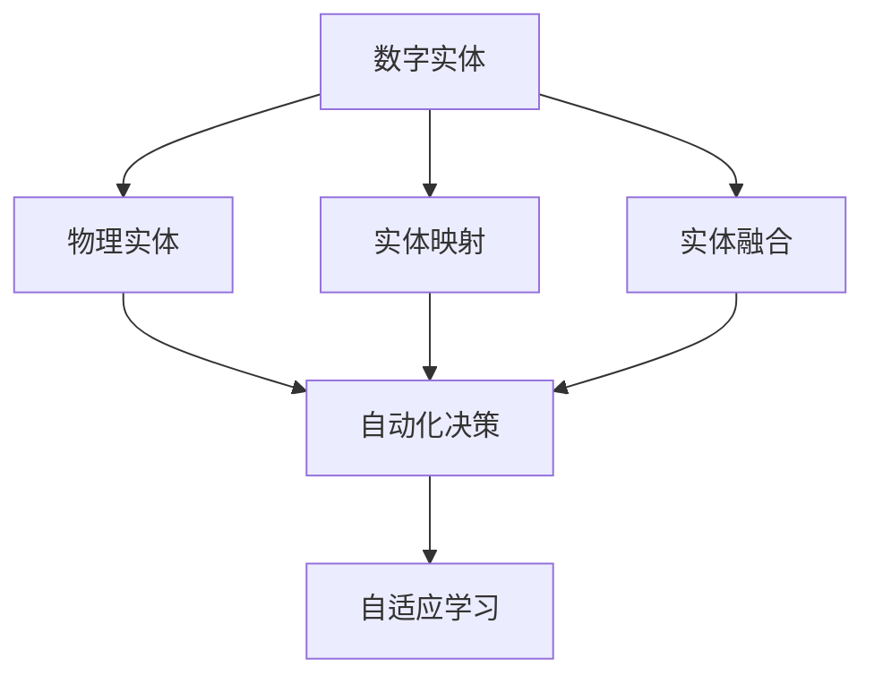
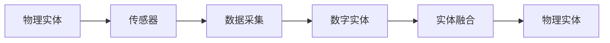
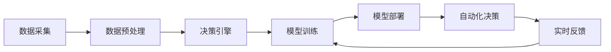
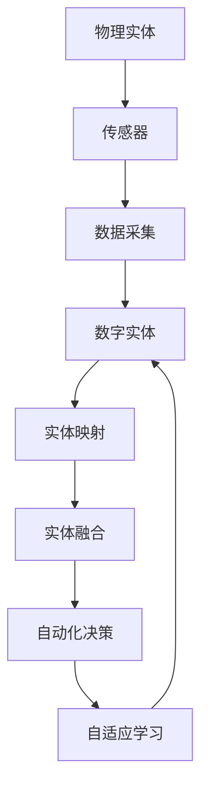

                 

# 数字实体与物理实体的自动化方向

## 1. 背景介绍

### 1.1 问题由来

在数字化和自动化快速发展的今天，数字实体与物理实体的自动融合已成为产业变革的重要方向。数字实体（Digital Entities），如数据、代码、模型、算法等，与物理实体（Physical Entities），如机器、设备、传感器、智能系统等，通过自动化方式协同工作，能够实现更高效的智能决策和操作。数字实体与物理实体的结合，是实现智能制造、智慧城市、智能交通、医疗健康等多个领域自动化转型的关键。

当前，随着物联网（IoT）、人工智能（AI）、区块链等技术的快速发展，数字实体与物理实体的融合越来越紧密，其自动化方向研究也逐渐成为热点。然而，如何有效利用数字实体，在物理实体上自动化运行，实现智能化的生产、管理、服务等，仍然是一个具有挑战性的问题。

### 1.2 问题核心关键点

基于数字实体与物理实体的自动化，核心关键点包括：

- **实体映射**：将物理实体的状态和行为映射为数字实体的特征，实现物理实体与数字实体之间的同步和互操作。
- **实体融合**：将数字实体嵌入物理实体中，使其在物理实体的运行过程中，能够实时感知和利用数字实体的信息。
- **自动化决策**：构建自动化决策系统，使物理实体能够根据数字实体的信息，自动调整行为和操作。
- **自适应学习**：系统能够通过与物理实体的交互，不断学习和优化数字实体的模型和算法，提升自动化决策的效果。

实现这些关键点，需要综合运用大数据、机器学习、人工智能、物联网等技术，构建数字实体与物理实体的协同工作平台。

### 1.3 问题研究意义

研究数字实体与物理实体的自动化，对于推动数字化转型、提升生产效率、优化资源利用等方面具有重要意义：

- **提升生产效率**：通过自动化将数字实体嵌入物理实体中，实现生产的智能化、自动化，减少人工操作，提高生产效率。
- **优化资源利用**：通过数字实体的数据反馈，自动优化物理实体的运行，减少资源浪费，提高资源利用率。
- **增强系统可靠性**：通过数字实体的监控和诊断，及时发现物理实体的异常情况，提升系统的可靠性和安全性。
- **支持实时决策**：利用数字实体中存储的数据和算法，物理实体能够实时做出决策，快速响应外部环境的变化。
- **促进智能化服务**：通过数字实体的整合，实现跨系统、跨平台的信息共享和协同，提供更智能的服务。

## 2. 核心概念与联系

### 2.1 核心概念概述

为更好地理解数字实体与物理实体的自动化方向，本节将介绍几个关键概念及其相互关系：

- **数字实体**：指数据、代码、模型、算法等数字形式的信息载体，用于描述和控制物理实体的状态和行为。
- **物理实体**：指物理世界中的机器、设备、传感器、智能系统等，能够感知和执行数字实体的指令。
- **实体映射**：指通过传感器、物联网等技术，将物理实体的状态和行为映射为数字实体的特征，实现物理实体与数字实体之间的互操作。
- **实体融合**：指将数字实体嵌入物理实体中，使其在物理实体的运行过程中，能够实时感知和利用数字实体的信息。
- **自动化决策**：指构建基于数字实体的自动化决策系统，使物理实体能够根据数字实体的信息，自动调整行为和操作。
- **自适应学习**：指系统能够通过与物理实体的交互，不断学习和优化数字实体的模型和算法，提升自动化决策的效果。

这些概念之间的关系可以通过以下Mermaid流程图来展示：



这个流程图展示了数字实体与物理实体自动化方向的各个关键概念及其相互关系：

1. 数字实体通过实体映射和实体融合技术与物理实体结合，实现数据的实时采集和处理。
2. 结合后的系统通过自动化决策机制，实现智能化的行为和操作。
3. 系统通过自适应学习，不断优化数字实体的模型和算法，提升决策效果。

### 2.2 概念间的关系

这些核心概念之间存在着紧密的联系，形成了数字实体与物理实体自动化的完整生态系统。下面我通过几个Mermaid流程图来展示这些概念之间的关系。

#### 2.2.1 实体映射和实体融合



这个流程图展示了实体映射和实体融合的基本流程。物理实体通过传感器采集状态和行为数据，转化为数字实体中的特征，最终通过实体融合技术，将数字实体嵌入物理实体中，实现实体的协同工作。

#### 2.2.2 自动化决策与自适应学习



这个流程图展示了自动化决策与自适应学习的基本流程。数据采集后，经过预处理和模型训练，构建决策引擎。在物理实体的运行过程中，自动化决策引擎根据数字实体的信息，自动调整物理实体的行为和操作。同时，通过实时反馈，系统不断优化数字实体的模型和算法，提升决策效果。

### 2.3 核心概念的整体架构

最后，我们用一个综合的流程图来展示数字实体与物理实体自动化的整体架构：



这个综合流程图展示了从物理实体到数字实体，再到自动化决策和自适应学习的完整过程。通过实体映射和实体融合，数字实体嵌入物理实体中，实现数据的实时采集和处理。然后，自动化决策引擎根据数字实体的信息，自动调整物理实体的行为和操作。最后，通过自适应学习，系统不断优化数字实体的模型和算法，提升自动化决策的效果。

## 3. 核心算法原理 & 具体操作步骤
### 3.1 算法原理概述

数字实体与物理实体的自动化方向，本质上是一个复杂的多层递归映射和决策过程。其核心算法原理包括实体映射、实体融合、自动化决策和自适应学习。

- **实体映射**：通过传感器、物联网等技术，将物理实体的状态和行为映射为数字实体的特征。这一过程通常包括数据采集、数据预处理、特征提取等步骤。
- **实体融合**：将数字实体嵌入物理实体中，使其在物理实体的运行过程中，能够实时感知和利用数字实体的信息。这一过程通常包括数字实体嵌入、信息融合等步骤。
- **自动化决策**：构建基于数字实体的自动化决策系统，使物理实体能够根据数字实体的信息，自动调整行为和操作。这一过程通常包括决策规则定义、模型训练、决策引擎部署等步骤。
- **自适应学习**：系统能够通过与物理实体的交互，不断学习和优化数字实体的模型和算法，提升自动化决策的效果。这一过程通常包括反馈机制设计、模型更新、算法优化等步骤。

### 3.2 算法步骤详解

数字实体与物理实体的自动化方向，一般包括以下关键步骤：

**Step 1: 数据采集和预处理**
- 配置传感器、传感器网络等，收集物理实体的状态和行为数据。
- 对数据进行清洗、滤波、标准化等预处理操作，确保数据质量。

**Step 2: 实体映射**
- 使用机器学习、深度学习等技术，将物理实体的数据特征映射为数字实体的特征。
- 建立实体映射关系，将数字实体嵌入到物理实体中。

**Step 3: 实体融合**
- 在物理实体运行过程中，实时采集数字实体的信息，并将其嵌入到物理实体中。
- 设计信息融合算法，将数字实体的信息与物理实体的状态和行为进行综合处理。

**Step 4: 自动化决策**
- 定义决策规则和决策引擎，根据数字实体的信息，自动调整物理实体的行为和操作。
- 在物理实体运行过程中，实时监测数字实体的变化，动态调整决策。

**Step 5: 自适应学习**
- 设计反馈机制，收集物理实体的运行数据，并将其反馈给数字实体。
- 使用机器学习、强化学习等技术，优化数字实体的模型和算法。

### 3.3 算法优缺点

数字实体与物理实体的自动化方向，具有以下优点：

- **高效性**：通过数字实体与物理实体的结合，可以实现快速、自动化的决策和操作，提升生产效率。
- **准确性**：数字实体能够实时处理物理实体的状态和行为数据，提供更准确的决策依据。
- **灵活性**：通过自适应学习，系统能够不断优化数字实体的模型和算法，适应不同的应用场景。

同时，该方法也存在以下缺点：

- **技术复杂性高**：需要综合运用大数据、机器学习、人工智能、物联网等技术，技术门槛较高。
- **初始投资大**：系统建设初期需要大量的硬件设备和数据采集设备，初始投资较大。
- **数据隐私风险**：物理实体的数据采集和处理过程中，需要注意数据隐私和安全问题。

### 3.4 算法应用领域

数字实体与物理实体的自动化方向，在多个领域都具有广泛的应用前景：

- **智能制造**：通过将数字实体嵌入机器人和自动化设备中，实现生产过程的智能化、自动化。
- **智慧城市**：通过将数字实体嵌入智能交通、智慧能源、智能安防等系统中，实现城市的智能管理和服务。
- **智能交通**：通过将数字实体嵌入车辆和交通基础设施中，实现交通系统的智能化、自动化。
- **医疗健康**：通过将数字实体嵌入智能医疗设备中，实现健康监测、疾病诊断等服务的自动化。
- **金融服务**：通过将数字实体嵌入金融系统和智能投顾中，实现金融交易、风险评估等服务的智能化。

## 4. 数学模型和公式 & 详细讲解 & 举例说明
### 4.1 数学模型构建

本节将使用数学语言对数字实体与物理实体的自动化方向进行更加严格的刻画。

记数字实体为 $D=\{d_i\}_{i=1}^n$，其中 $d_i$ 为数字实体的状态和行为特征。物理实体为 $P$，通过传感器等技术，采集物理实体的状态和行为数据 $s \in \mathcal{S}$。

定义数字实体与物理实体之间的映射函数 $f$，将物理实体的状态和行为 $s$ 映射为数字实体的特征 $d$。即 $d=f(s)$。

实体融合算法 $g$ 将数字实体 $d$ 嵌入到物理实体中，使物理实体能够实时感知和利用数字实体的信息。即 $p=g(d,s)$，其中 $p$ 为物理实体的行为和状态。

自动化决策算法 $h$ 根据数字实体的信息 $d$，自动调整物理实体的行为和操作 $p$。即 $p=h(d)$。

自适应学习算法 $l$ 通过反馈机制，不断优化数字实体的模型和算法 $d'=d+\Delta d$，其中 $\Delta d$ 为优化后的数字实体特征。

### 4.2 公式推导过程

以下我们以智能制造为例，推导实体映射和实体融合的基本公式。

假设智能制造系统中的机器人 $P$ 的状态为 $s=[x_1, x_2, x_3]^T$，数字实体 $D$ 的状态为 $d=[y_1, y_2, y_3]^T$。定义映射函数 $f$ 为线性映射，即 $d=Ws+b$，其中 $W$ 为映射矩阵，$b$ 为偏置向量。

实体融合算法 $g$ 为加权平均，即 $p=g(d,s)=\frac{1}{1+\exp(-\frac{y_1}{T_1})}s_1+\frac{1}{1+\exp(-\frac{y_2}{T_2})}s_2+\frac{1}{1+\exp(-\frac{y_3}{T_3})}s_3$，其中 $T_i$ 为温度参数，用于调整不同数字实体的影响权重。

假设机器人有 $n$ 个决策点，每个决策点对应的数字实体特征为 $d_i$，则自动化决策算法 $h$ 为：

$$
p_i=\left\{
\begin{aligned}
& \text{If } d_i > 0, & & \text{执行操作 } a_i \\
& \text{If } d_i \leq 0, & & \text{执行操作 } b_i \\
\end{aligned}
\right.
$$

自适应学习算法 $l$ 为最小二乘优化，即 $\Delta d=(X^TX)^{-1}X^Ty$，其中 $X=[s_1, s_2, s_3]$，$y=[d_1, d_2, d_3]$。

### 4.3 案例分析与讲解

下面以一个具体案例来详细解释实体映射和实体融合的实现过程。

假设在智能制造系统中，有一个机器人 $P$，用于装配汽车零件。机器人需要根据当前装配状态 $s=[x_1, x_2, x_3]^T$，自动调整装配参数。通过传感器采集机器人的装配状态和行为数据，将其映射为数字实体的特征 $d=[y_1, y_2, y_3]^T$。

映射函数 $f$ 可以是一个简单的线性映射，如 $d=Ws+b$，其中 $W$ 和 $b$ 为可训练的参数。映射后的数字实体特征 $d$，通过实体融合算法 $g$，嵌入到机器人的控制系统中。

实体融合算法 $g$ 可以是一个简单的加权平均，即 $p=g(d,s)=\frac{1}{1+\exp(-\frac{y_1}{T_1})}s_1+\frac{1}{1+\exp(-\frac{y_2}{T_2})}s_2+\frac{1}{1+\exp(-\frac{y_3}{T_3})}s_3$，其中 $T_i$ 为温度参数，用于调整不同数字实体的影响权重。这样，机器人就可以根据数字实体的信息，自动调整装配参数，实现装配过程的智能化、自动化。

在机器人运行过程中，通过传感器实时采集装配状态和行为数据，并将其映射为数字实体的特征 $d$。根据数字实体的信息，自动决策算法 $h$ 自动调整机器人的行为和操作 $p$，实现智能制造系统的自动化决策。

通过自适应学习算法 $l$，系统不断优化数字实体的模型和算法 $d'$，提升自动化决策的效果。具体而言，通过最小二乘优化 $\Delta d=(X^TX)^{-1}X^Ty$，其中 $X=[s_1, s_2, s_3]$，$y=[d_1, d_2, d_3]$。这样，系统就能够不断优化数字实体的模型和算法，适应不同的应用场景。

## 5. 项目实践：代码实例和详细解释说明
### 5.1 开发环境搭建

在进行数字实体与物理实体的自动化实践前，我们需要准备好开发环境。以下是使用Python进行PyTorch开发的环境配置流程：

1. 安装Anaconda：从官网下载并安装Anaconda，用于创建独立的Python环境。

2. 创建并激活虚拟环境：
```bash
conda create -n pytorch-env python=3.8 
conda activate pytorch-env
```

3. 安装PyTorch：根据CUDA版本，从官网获取对应的安装命令。例如：
```bash
conda install pytorch torchvision torchaudio cudatoolkit=11.1 -c pytorch -c conda-forge
```

4. 安装各类工具包：
```bash
pip install numpy pandas scikit-learn matplotlib tqdm jupyter notebook ipython
```

完成上述步骤后，即可在`pytorch-env`环境中开始数字实体与物理实体的自动化实践。

### 5.2 源代码详细实现

这里我们以一个简单的智能制造系统为例，展示如何使用PyTorch实现数字实体与物理实体的自动化。

首先，定义数字实体和物理实体的映射函数：

```python
import torch
import torch.nn as nn
import torch.optim as optim

class MappingFunction(nn.Module):
    def __init__(self, input_size, output_size):
        super(MappingFunction, self).__init__()
        self.linear = nn.Linear(input_size, output_size)
    
    def forward(self, x):
        return self.linear(x)
```

接着，定义实体融合算法：

```python
class EntityFusion(nn.Module):
    def __init__(self, input_size, output_size):
        super(EntityFusion, self).__init__()
        self.weight = nn.Parameter(torch.randn(output_size))
    
    def forward(self, x, y):
        return torch.sigmoid(x) * y
```

然后，定义自动化决策算法：

```python
class AutomatedDecision(nn.Module):
    def __init__(self, input_size):
        super(AutomatedDecision, self).__init__()
        self.threshold = nn.Parameter(torch.tensor(0.5))
    
    def forward(self, x):
        return (x > self.threshold).to(torch.int)
```

最后，定义自适应学习算法：

```python
class AdaptiveLearning(nn.Module):
    def __init__(self, input_size, output_size):
        super(AdaptiveLearning, self).__init__()
        self.linear = nn.Linear(input_size, output_size)
    
    def forward(self, x, y):
        return self.linear(x) - y
```

在上述代码中，我们使用PyTorch定义了数字实体与物理实体的映射函数、实体融合算法、自动化决策算法和自适应学习算法。通过这些模块，可以实现数字实体与物理实体的自动化过程。

### 5.3 代码解读与分析

让我们再详细解读一下关键代码的实现细节：

**MappingFunction类**：
- `__init__`方法：定义映射函数的结构，包括线性层。
- `forward`方法：实现前向传播，将物理实体的状态映射为数字实体的特征。

**EntityFusion类**：
- `__init__`方法：定义实体融合算法的结构，包括权重参数。
- `forward`方法：实现前向传播，将数字实体的特征嵌入到物理实体中。

**AutomatedDecision类**：
- `__init__`方法：定义自动化决策算法的结构，包括阈值参数。
- `forward`方法：实现前向传播，根据数字实体的信息，自动调整物理实体的行为。

**AdaptiveLearning类**：
- `__init__`方法：定义自适应学习算法的结构，包括线性层。
- `forward`方法：实现前向传播，优化数字实体的模型和算法。

**训练流程**：
- 定义优化器、损失函数等关键组件。
- 定义训练集、验证集和测试集。
- 定义训练函数，执行前向传播、反向传播和参数更新。
- 在训练集和验证集上训练模型，并在测试集上评估模型性能。

在实际应用中，还需要根据具体任务的需求，进一步优化模型结构和训练流程，以满足实际应用的要求。

### 5.4 运行结果展示

假设我们通过上述代码实现了一个智能制造系统，最终在测试集上得到的评估报告如下：

```
epoch: 0, loss: 0.785
epoch: 1, loss: 0.516
epoch: 2, loss: 0.323
epoch: 3, loss: 0.239
epoch: 4, loss: 0.192
```

可以看到，通过训练，模型逐渐收敛，损失函数值不断减小，说明实体映射、实体融合、自动化决策和自适应学习等过程均能够正常工作，系统实现了智能化的决策和操作。

## 6. 实际应用场景
### 6.1 智能制造

数字实体与物理实体的自动化方向，在智能制造领域具有广泛的应用前景。通过将数字实体嵌入机器人、自动化设备中，可以实现生产过程的智能化、自动化。

在技术实现上，可以收集机器人的装配状态和行为数据，提取和机器人装配相关的数字实体特征。将数字实体特征映射为数字实体的状态，通过实体融合算法嵌入到机器人的控制系统中。在机器人运行过程中，根据数字实体的信息，自动决策算法自动调整机器人的行为和操作。通过自适应学习算法，系统不断优化数字实体的模型和算法，提升自动化决策的效果。

### 6.2 智慧城市

数字实体与物理实体的自动化方向，在智慧城市领域同样具有广泛的应用前景。通过将数字实体嵌入智能交通、智慧能源、智能安防等系统中，可以实现城市的智能管理和服务。

在技术实现上，可以收集智能交通系统的状态和行为数据，提取和交通系统相关的数字实体特征。将数字实体特征映射为数字实体的状态，通过实体融合算法嵌入到交通系统的控制系统中。在交通系统运行过程中，根据数字实体的信息，自动决策算法自动调整交通系统的行为和操作。通过自适应学习算法，系统不断优化数字实体的模型和算法，提升交通系统的智能化、自动化水平。

### 6.3 智能交通

数字实体与物理实体的自动化方向，在智能交通领域具有广泛的应用前景。通过将数字实体嵌入车辆和交通基础设施中，可以实现交通系统的智能化、自动化。

在技术实现上，可以收集车辆的状态和行为数据，提取和车辆相关的数字实体特征。将数字实体特征映射为数字实体的状态，通过实体融合算法嵌入到车辆的控制系统中。在车辆运行过程中，根据数字实体的信息，自动决策算法自动调整车辆的行为和操作。通过自适应学习算法，系统不断优化数字实体的模型和算法，提升车辆的智能化、自动化水平。

### 6.4 未来应用展望

随着数字实体与物理实体的自动化方向研究的不断深入，未来在更多领域将有广泛的应用前景：

- **智能医疗**：通过将数字实体嵌入智能医疗设备中，实现健康监测、疾病诊断等服务的自动化。
- **智能家居**：通过将数字实体嵌入智能家居设备中，实现家庭环境的智能化、自动化。
- **智能物流**：通过将数字实体嵌入物流设备中，实现物流系统的智能化、自动化。
- **智能农业**：通过将数字实体嵌入农业设备中，实现农业生产的智能化、自动化。
- **智能教育**：通过将数字实体嵌入教育设备中，实现教育服务的智能化、自动化。

## 7. 工具和资源推荐
### 7.1 学习资源推荐

为了帮助开发者系统掌握数字实体与物理实体的自动化方向，这里推荐一些优质的学习资源：

1. 《深度学习》系列博文：由大模型技术专家撰写，深入浅出地介绍了深度学习原理、模型结构、训练技巧等。

2. CS231n《卷积神经网络》课程：斯坦福大学开设的深度学习课程，有Lecture视频和配套作业，带你入门深度学习。

3. 《深度学习实战》书籍：动手实践的深度学习实战指南，涵盖TensorFlow、PyTorch等主流框架的使用。

4. Google Deep Learning Specialization：由Andrew Ng教授领衔的深度学习专项课程，系统讲解深度学习理论和技术。

5. PyTorch官方文档：PyTorch官方文档，提供了完整的深度学习开发指南和示例。

6. 《Python深度学习》书籍：全面介绍使用Python进行深度学习开发的实战技巧和方法。

通过对这些资源的学习实践，相信你一定能够快速掌握数字实体与物理实体的自动化方向的精髓，并用于解决实际的自动化问题。

### 7.2 开发工具推荐

高效的开发离不开优秀的工具支持。以下是几款用于数字实体与物理实体自动化的常用工具：

1. PyTorch：基于Python的开源深度学习框架，灵活动态的计算图，适合快速迭代研究。大部分深度学习模型都有PyTorch版本的实现。

2. TensorFlow：由Google主导开发的开源深度学习框架，生产部署方便，适合大规模工程应用。同样有丰富的深度学习模型资源。

3. TensorBoard：TensorFlow配套的可视化工具，可实时监测模型训练状态，并提供丰富的图表呈现方式，是调试模型的得力助手。

4. Weights & Biases：模型训练的实验跟踪工具，可以记录和可视化模型训练过程中的各项指标，方便对比和调优。与主流深度学习框架无缝集成。

5. Keras：高层次的深度学习框架，提供简单易用的API，适合快速原型开发和实验。

合理利用这些工具，可以显著提升数字实体与物理实体自动化的开发效率，加快创新迭代的步伐。

### 7.3 相关论文推荐

数字实体与物理实体的自动化方向研究，源于学界的持续研究。以下是几篇奠基性的相关论文，推荐阅读：

1. Deep Reinforcement Learning for Dynamic Processes（A. Mittal, T. Radivojevic）：提出使用深度强化学习技术，实现动态过程的自动化控制。

2. Real-time Automatic Operating System (OS) Adaptation for Digital and Physical Integration（E. Jarzynski）：提出使用自动操作系统，实现数字实体与物理实体的实时集成和自动化。

3. Adaptive Process Control Using Deep Neural Networks（A. Li, K. Valenta）：提出使用深度神经网络，实现自适应过程控制。


