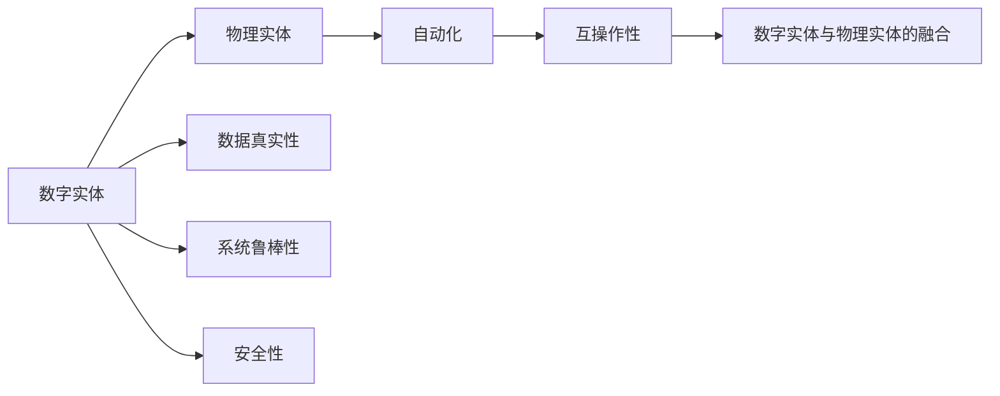

                 

# 数字实体与物理实体的自动化进程

## 1. 背景介绍

在当今数字化时代，数字实体和物理实体的融合已成为推动社会进步的重要力量。无论是企业级的工业4.0应用，还是日常生活中的智能家居，数字实体（如数据、代码、模型）与物理实体（如机器人、设备、传感器）的深度融合，都在不断改变人们的生活和工作方式。然而，这种融合过程也伴随着诸多挑战，包括数据的真实性、物理实体与数字系统的互操作性、系统的鲁棒性和安全性等。

本文将深入探讨数字实体与物理实体的自动化进程，包括其原理、关键技术、应用场景以及面临的挑战和未来趋势。通过详细分析这一进程，希望能为读者提供一个全面的视角，以更好地理解和应对这一深刻变革。

## 2. 核心概念与联系

### 2.1 核心概念概述

- **数字实体（Digital Entities）**：指数据、代码、模型等数字化的信息形式。数字实体通过数字化手段生成，用于记录、处理和分析现实世界中的信息。
- **物理实体（Physical Entities）**：指现实世界中的物体、设备、传感器等物理形态的存在。物理实体承载着数字实体的表现和交互。
- **自动化（Automation）**：指通过技术手段实现过程或任务的无人值守、自动执行。自动化技术的目标是提高效率、降低成本、提升可靠性。
- **互操作性（Interoperability）**：指数字实体与物理实体之间能够相互理解和协作的能力。互操作性是数字实体与物理实体融合的关键。
- **数据真实性（Data Integrity）**：指数据在采集、传输、存储和处理过程中保持完整、准确、一致的能力。数据真实性是数字实体与物理实体融合的基础。
- **系统鲁棒性（Robustness）**：指系统在面对各种不确定性和干扰时，仍能保持稳定、可靠的能力。系统鲁棒性是自动化进程的重要保障。
- **安全性（Security）**：指系统在运行过程中，防止恶意攻击和未授权访问的能力。安全性是自动化进程的重要组成部分。

### 2.2 核心概念的关系

这些核心概念之间的联系可以通过以下Mermaid流程图来展示：



这个流程图展示了数字实体与物理实体的自动化进程的基本框架：

1. 数字实体通过各种方式生成，用于记录和处理物理实体产生的数据。
2. 数字实体与物理实体通过自动化技术进行融合，实现自动化的过程。
3. 互操作性保证了数字实体与物理实体之间的相互理解和协作。
4. 数据真实性、系统鲁棒性和安全性是这一进程顺利进行的前提和保障。
5. 数字实体与物理实体的融合，不仅推动了工业生产、智慧城市等应用的发展，也带来了更多的智能系统场景。

## 3. 核心算法原理 & 具体操作步骤

### 3.1 算法原理概述

数字实体与物理实体的自动化进程，涉及数据采集、传输、处理和反馈等环节，需要一系列算法和技术支持。其核心算法原理主要包括以下几个方面：

- **数据采集算法**：用于从物理实体中高效、准确地获取数据。
- **数据传输算法**：用于在数字实体与物理实体之间进行数据的高效传输。
- **数据处理算法**：用于对采集到的数据进行清洗、分析、存储等处理。
- **决策算法**：用于基于数据处理结果进行自动化决策和执行。
- **反馈算法**：用于将决策结果反馈到物理实体，实现闭环控制。

### 3.2 算法步骤详解

数字实体与物理实体的自动化进程可以分解为以下几个关键步骤：

1. **数据采集与预处理**：使用传感器、物联网设备等从物理实体中获取原始数据，并对其进行清洗、去噪、归一化等预处理。
2. **数据传输与存储**：将预处理后的数据通过网络传输到数字实体，并进行存储。
3. **数据处理与分析**：使用算法对存储的数据进行分析，提取有用的信息。
4. **决策与执行**：基于分析结果，使用算法进行决策，并生成控制命令。
5. **反馈与调整**：将决策结果反馈到物理实体，并进行调整，以实现自动化闭环控制。

### 3.3 算法优缺点

数字实体与物理实体的自动化进程有以下优点：

- **提升效率**：自动化过程可以显著提升数据处理和决策执行的效率，减少人力和时间成本。
- **增强可靠性**：自动化系统通常具备更高的可靠性和稳定性，减少人为错误和操作失误。
- **推动创新**：自动化进程推动了新技术和新应用的开发和应用，带来了新的商业模式和市场机会。

同时，这一进程也存在一些缺点：

- **技术复杂性高**：涉及多种技术和算法的综合应用，技术门槛较高。
- **数据质量要求高**：需要高质量的数据输入，数据采集和处理中的任何偏差都可能导致错误决策。
- **系统安全风险**：自动化系统在运行过程中可能面临各种安全威胁，需要额外的安全保障措施。

### 3.4 算法应用领域

数字实体与物理实体的自动化进程广泛应用于以下几个领域：

- **工业自动化**：包括生产线自动化、智能仓储、质量控制等，通过数字实体与物理实体的融合，实现高效、精确的生产过程管理。
- **智慧城市**：如智能交通、智能安防、智慧医疗等，通过数字实体与物理实体的融合，提升城市管理的智能化水平。
- **智能家居**：如智能照明、智能温控、智能家电等，通过数字实体与物理实体的融合，实现家庭环境的智能控制。
- **自动驾驶**：通过传感器、摄像头等数字实体，获取物理实体的环境信息，实现自动驾驶。
- **虚拟现实与增强现实**：通过数字实体与物理实体的互动，实现虚拟场景与现实场景的融合。

## 4. 数学模型和公式 & 详细讲解

### 4.1 数学模型构建

数字实体与物理实体的自动化进程涉及大量的数学模型。以下是几个核心数学模型的构建：

- **数据采集模型**：用于描述从物理实体中获取数据的过程，一般可以表示为：

  $$
  \text{Data} = \text{Sensor Data} \times \text{Preprocessing}
  $$

  其中，$\text{Sensor Data}$ 表示传感器采集到的原始数据，$\text{Preprocessing}$ 表示数据预处理过程。

- **数据传输模型**：用于描述数据在网络中的传输过程，可以表示为：

  $$
  \text{Transmitted Data} = \text{Data} \times \text{Compression} \times \text{Encryption}
  $$

  其中，$\text{Compression}$ 表示数据压缩过程，$\text{Encryption}$ 表示数据加密过程。

- **数据处理模型**：用于描述数据的分析和处理过程，可以表示为：

  $$
  \text{Processed Data} = \text{Data} \times \text{Analyzing}
  $$

  其中，$\text{Analyzing}$ 表示数据分析过程。

- **决策模型**：用于描述基于数据的决策过程，可以表示为：

  $$
  \text{Decision} = \text{Processed Data} \times \text{Rule-based Decision}
  $$

  其中，$\text{Rule-based Decision}$ 表示基于规则的决策过程。

- **反馈模型**：用于描述决策结果对物理实体的反馈过程，可以表示为：

  $$
  \text{Feedback} = \text{Decision} \times \text{Control}
  $$

  其中，$\text{Control}$ 表示对物理实体的控制过程。

### 4.2 公式推导过程

以数据采集模型为例，推导其公式过程如下：

设传感器采集到的原始数据为 $\text{Sensor Data} = \{x_1, x_2, ..., x_n\}$，预处理过程包括去噪、归一化等步骤，得到的预处理数据为 $\text{Preprocessed Data} = \{y_1, y_2, ..., y_n\}$。则数据采集模型的公式推导如下：

$$
\text{Preprocessed Data} = f(\text{Sensor Data}) = [f_1(x_1), f_2(x_2), ..., f_n(x_n)]
$$

其中，$f_i$ 表示第 $i$ 个数据点的预处理函数。

### 4.3 案例分析与讲解

以智慧城市中的智能交通系统为例，分析其数字实体与物理实体的自动化进程。

- **数据采集**：通过城市中的摄像头、传感器等设备，获取交通流量、车速、红绿灯状态等数据。
- **数据传输**：将采集到的数据通过5G网络传输到云端数字实体中。
- **数据处理**：云端对数据进行清洗、分析，生成交通流量预测模型。
- **决策**：基于预测模型，生成红绿灯控制方案。
- **反馈**：将红绿灯控制方案反馈到物理实体中，调整红绿灯状态，实现交通流量优化。

## 5. 项目实践：代码实例和详细解释说明

### 5.1 开发环境搭建

在实践数字实体与物理实体的自动化进程时，需要搭建相应的开发环境。以下是一些基本步骤：

1. **环境安装**：
   - 安装Python、pip等基本环境。
   - 安装TensorFlow、PyTorch等深度学习框架。
   - 安装OpenCV、PIL等图像处理库。
   - 安装MySQL、MongoDB等数据库系统。

2. **工具准备**：
   - 准备传感器、摄像头等物理实体。
   - 准备数字实体所需的硬件设备，如工控机、服务器等。
   - 准备网络通信工具，如TCP/IP、MQTT等。

3. **数据采集**：
   - 连接传感器、摄像头等设备，采集物理实体的数据。
   - 编写数据采集脚本，定时采集数据，并存储到本地或云端。

### 5.2 源代码详细实现

以智慧城市中的智能交通系统为例，展示其代码实现过程。

```python
import cv2
import numpy as np
from tensorflow.keras.models import load_model

# 加载预测模型
model = load_model('traffic_prediction.h5')

# 实时采集摄像头数据
cap = cv2.VideoCapture(0)
while True:
    ret, frame = cap.read()
    if not ret:
        break

    # 预处理图像数据
    frame = cv2.cvtColor(frame, cv2.COLOR_BGR2GRAY)
    frame = cv2.resize(frame, (224, 224))
    frame = frame.astype('float32') / 255.0

    # 使用模型进行预测
    prediction = model.predict(np.array([frame]))

    # 输出预测结果
    print('Traffic Level:', prediction[0][0])

    cv2.imshow('Frame', frame)
    if cv2.waitKey(1) & 0xFF == ord('q'):
        break

cap.release()
cv2.destroyAllWindows()
```

### 5.3 代码解读与分析

上述代码实现了一个基于卷积神经网络的交通流量预测模型，并实时采集摄像头数据进行预测。

- **数据采集**：使用OpenCV库实时采集摄像头数据，并进行预处理。
- **模型预测**：加载预训练的交通流量预测模型，对预处理后的图像数据进行预测，输出预测结果。
- **用户交互**：通过键盘输入 q 退出程序。

### 5.4 运行结果展示

运行上述代码，将在屏幕上实时显示摄像头采集到的图像，并在命令行输出预测的交通流量水平。

## 6. 实际应用场景

数字实体与物理实体的自动化进程在多个实际应用场景中取得了显著效果。以下是几个典型场景：

### 6.1 工业自动化

在工业自动化中，数字实体与物理实体的融合主要应用于生产线自动化、智能仓储等场景。通过数字实体与物理实体的融合，可以显著提升生产效率、降低成本、提高质量控制。

### 6.2 智慧城市

智慧城市是数字实体与物理实体融合的重要应用领域，涉及智能交通、智能安防、智慧医疗等多个方面。通过数字实体与物理实体的融合，可以实现城市管理的智能化、精准化，提升城市居民的生活质量。

### 6.3 智能家居

智能家居通过数字实体与物理实体的融合，实现了家庭环境的智能控制，如智能照明、智能温控、智能家电等。通过语音助手、手机APP等数字实体，用户可以轻松控制物理实体，提升生活质量。

### 6.4 自动驾驶

自动驾驶技术通过传感器、摄像头等数字实体，获取物理实体的环境信息，实现自动驾驶。通过数字实体与物理实体的融合，可以显著提升驾驶安全性和效率。

### 6.5 虚拟现实与增强现实

虚拟现实与增强现实技术通过数字实体与物理实体的互动，实现虚拟场景与现实场景的融合。通过数字实体与物理实体的融合，可以带来全新的视觉体验和交互方式。

## 7. 工具和资源推荐

### 7.1 学习资源推荐

为了帮助读者系统掌握数字实体与物理实体的自动化进程，这里推荐一些优质的学习资源：

1. **《深度学习》书籍**：Ian Goodfellow等著，全面介绍了深度学习的基本概念和应用，适合入门和进阶读者。
2. **《机器学习实战》书籍**：Peter Harrington著，通过实际项目演示了机器学习的实现过程，适合实践类学习者。
3. **Coursera《机器学习》课程**：Andrew Ng等主讲，提供了系统化的机器学习课程，涵盖理论、算法和实践。
4. **Kaggle平台**：全球最大的数据科学竞赛平台，提供了丰富的数据集和比赛项目，适合实战练习。
5. **GitHub代码库**：GitHub提供了大量的开源代码和项目，适合参考和学习。

### 7.2 开发工具推荐

以下是几个常用的开发工具：

1. **PyTorch**：基于Python的深度学习框架，灵活高效，支持动态计算图。
2. **TensorFlow**：Google开源的深度学习框架，支持静态图和动态图，性能优越。
3. **OpenCV**：开源计算机视觉库，提供了丰富的图像处理功能。
4. **Keras**：高级神经网络API，基于TensorFlow等深度学习框架，易于上手。
5. **TensorBoard**：TensorFlow配套的可视化工具，支持实时监控模型训练过程。

### 7.3 相关论文推荐

以下是几篇重要的相关论文，推荐阅读：

1. **《工业自动化中的机器视觉应用》**：提出将机器视觉技术应用于工业自动化中的质量控制和生产优化，提高了生产效率和质量。
2. **《基于深度学习的智能交通系统》**：介绍基于深度学习的智能交通系统，实现了交通流量的实时预测和优化。
3. **《智慧城市中的物联网技术》**：探讨物联网技术在智慧城市中的应用，包括智能安防、智慧医疗等。
4. **《智能家居中的自然语言处理》**：研究将自然语言处理技术应用于智能家居中，通过语音助手实现家居控制。
5. **《自动驾驶中的传感器融合》**：分析自动驾驶中传感器融合技术的应用，提高了驾驶安全性和准确性。

## 8. 总结：未来发展趋势与挑战

### 8.1 研究成果总结

数字实体与物理实体的自动化进程已经取得了显著的成果，广泛应用于工业自动化、智慧城市、智能家居等多个领域。通过数字实体与物理实体的融合，实现了自动化、智能化和高效化的目标，推动了社会进步和经济发展。

### 8.2 未来发展趋势

展望未来，数字实体与物理实体的自动化进程将呈现以下几个发展趋势：

1. **5G网络的普及**：5G网络的高带宽、低延迟特性，将进一步推动数字实体与物理实体的融合，实现更高效的数据传输和实时控制。
2. **边缘计算的发展**：边缘计算技术能够将计算和数据处理分散到物理实体附近，提高响应速度和数据安全性。
3. **人工智能技术的进步**：AI技术的发展，将进一步提升数字实体与物理实体融合的智能化水平，实现更精准的决策和控制。
4. **人机交互的融合**：通过自然语言处理、手势识别等技术，实现更加自然和高效的人机交互方式。
5. **智能系统的普及**：随着技术的普及和成本的降低，智能系统将广泛应用于各个领域，提升社会运行效率和生活质量。

### 8.3 面临的挑战

尽管数字实体与物理实体的自动化进程取得了显著成果，但仍面临一些挑战：

1. **技术复杂性高**：涉及多种技术和算法的综合应用，技术门槛较高。
2. **数据质量要求高**：需要高质量的数据输入，数据采集和处理中的任何偏差都可能导致错误决策。
3. **系统安全风险**：自动化系统在运行过程中可能面临各种安全威胁，需要额外的安全保障措施。
4. **资源消耗大**：自动化系统的部署和运行需要大量的硬件资源，增加了成本和能耗。
5. **伦理和法律问题**：自动化系统涉及大量个人和公共数据的采集和使用，可能引发隐私和法律问题。

### 8.4 研究展望

未来的研究需要在以下几个方面寻求新的突破：

1. **简化技术架构**：通过优化技术架构，降低技术门槛，提升系统的可扩展性和可维护性。
2. **提高数据质量**：研究高效、鲁棒的数据采集和处理方法，提升数据质量和可靠性。
3. **增强安全性**：研究数据加密、访问控制等安全技术，提升系统的安全性。
4. **优化资源利用**：研究边缘计算、云计算等技术，优化资源的利用和分配。
5. **解决伦理和法律问题**：研究隐私保护和数据使用的合规性，解决伦理和法律问题。

## 9. 附录：常见问题与解答

### Q1：如何实现数字实体与物理实体的互操作性？

A: 实现数字实体与物理实体的互操作性，需要建立标准化的接口和协议。常用的互操作协议包括MQTT、AMQP等，通过这些协议，数字实体与物理实体可以实现数据的同步和通信。

### Q2：数字实体与物理实体的自动化进程中，数据采集的精度如何保障？

A: 保障数据采集的精度，需要选择合适的传感器和数据采集设备，并进行定期的校准和维护。同时，通过数据预处理算法，如去噪、滤波、归一化等，可以提高数据的质量和可靠性。

### Q3：数字实体与物理实体的自动化进程中，如何确保系统的鲁棒性？

A: 确保系统的鲁棒性，需要采用冗余设计、故障检测和恢复机制等技术手段。通过冗余设计，避免单点故障对系统的影响。通过故障检测和恢复机制，快速定位和修复系统故障。

### Q4：数字实体与物理实体的自动化进程中，如何保障系统的安全性？

A: 保障系统的安全性，需要采用数据加密、访问控制等安全技术。通过数据加密，防止数据泄露和篡改。通过访问控制，限制对系统的访问权限，保障系统的安全性。

### Q5：数字实体与物理实体的自动化进程中，如何提升系统的可扩展性？

A: 提升系统的可扩展性，需要采用模块化设计和微服务架构。通过模块化设计，将系统拆分为多个独立的模块，便于扩展和维护。通过微服务架构，实现系统组件的独立部署和扩展。

---

作者：禅与计算机程序设计艺术 / Zen and the Art of Computer Programming

