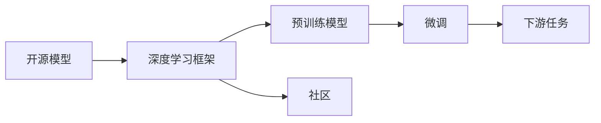

                 

# 开源模型在中国AI应用中的作用

> 关键词：开源模型,人工智能应用,中国AI,开源社区,深度学习框架,数据集

## 1. 背景介绍

### 1.1 问题由来
在过去十年中，中国的人工智能（AI）领域经历了从萌芽到快速发展的阶段。自2015年以来，政府和企业在AI技术研发和应用上投入了大量的资源，催生了蓬勃发展的AI产业。AI技术被广泛应用在各个行业中，如医疗、金融、教育、制造等，显著提高了生产效率，带来了深刻的产业变革。开源模型作为AI技术的重要组成部分，对推动中国AI应用的深入发展起到了关键作用。

### 1.2 问题核心关键点
开源模型是指在开源许可下提供给公众使用的模型，包括深度学习模型、自然语言处理模型等。它们通常基于大型数据集和先进的算法，如TensorFlow、PyTorch等深度学习框架，由全球的开发者共同维护和更新。开源模型的特点包括：

- **开源性**：任何人都可以访问和修改代码。
- **社区驱动**：由全球范围内的开发者共同维护和贡献。
- **广泛应用**：被广泛应用于学术研究和工业界。

### 1.3 问题研究意义
开源模型在中国AI应用中的作用，主要体现在以下几个方面：

1. **降低成本**：开源模型降低了AI研究和应用的门槛，使得企业和小型团队能够更轻松地使用先进的技术。
2. **促进创新**：开源社区提供了丰富的资源和工具，使得开发者可以快速迭代和创新。
3. **加速应用**：开源模型经过广泛验证和优化，可以更快地应用于实际场景。
4. **推动协作**：开源模型促进了全球范围内的协作，提升了整体AI技术水平。
5. **提升普及度**：开源模型使得AI技术更容易被更多人接受和使用。

## 2. 核心概念与联系

### 2.1 核心概念概述

在理解开源模型在中国AI应用中的作用时，需要掌握以下几个核心概念：

- **开源模型**：在开源许可下提供的AI模型，可以免费使用、修改和分发。
- **深度学习框架**：如TensorFlow、PyTorch等，提供计算图和自动微分功能，支持模型构建和训练。
- **社区**：全球范围内的开发者和贡献者组成的共同体，推动模型的更新和优化。
- **预训练模型**：在大规模数据集上预训练的模型，如BERT、GPT等，用于各种下游任务。
- **微调**：在预训练模型基础上，使用下游任务的少量数据进行微调，以适应特定任务。

### 2.2 核心概念间的关系

这些核心概念通过以下Mermaid流程图展示其关系：



该图展示了开源模型在AI应用中的作用流程：开源模型基于深度学习框架训练得到预训练模型，通过微调适应下游任务。社区的参与进一步推动了模型的更新和优化。

## 3. 核心算法原理 & 具体操作步骤
### 3.1 算法原理概述

开源模型在中国AI应用中的作用，主要体现在以下几个算法原理：

1. **分布式训练**：利用多个计算节点并行训练，加速模型训练过程。
2. **模型微调**：在预训练模型的基础上，使用下游任务的少量数据进行微调，以适应特定任务。
3. **社区贡献**：全球开发者共同维护和更新模型，确保其不断优化和升级。
4. **跨平台兼容性**：模型可以在多种平台和设备上运行，支持多种编程语言。

### 3.2 算法步骤详解

以下是开源模型在中国AI应用中的具体操作步骤：

**Step 1: 选择合适的开源模型和框架**

- 根据应用场景选择适合的深度学习框架，如TensorFlow、PyTorch等。
- 选择经过广泛验证和优化的预训练模型，如BERT、GPT等。

**Step 2: 数据准备和预处理**

- 收集和准备应用场景所需的数据集，并进行预处理，如数据清洗、特征工程等。
- 使用开源社区提供的工具和API，进行数据增强、数据分布分析等。

**Step 3: 模型微调**

- 加载预训练模型，并进行微调，以适应下游任务。
- 选择合适的微调参数，如学习率、批大小、迭代次数等。
- 使用社区提供的微调工具和代码，进行模型训练和验证。

**Step 4: 模型部署和应用**

- 将微调后的模型部署到实际应用环境中。
- 通过API接口、Web服务等方式，提供模型服务。
- 监控模型的运行状态和性能，进行持续优化和更新。

### 3.3 算法优缺点

**优点**：

- **成本低**：开源模型免费使用，降低了AI研究和应用的成本。
- **效率高**：利用分布式训练，加速模型训练和优化。
- **社区支持**：社区提供丰富的资源和工具，方便开发者快速迭代和创新。
- **广泛应用**：经过广泛验证和优化的模型，易于应用和推广。

**缺点**：

- **灵活性不足**：开源模型通常是通用的，不一定完全适应特定应用场景。
- **依赖开源社区**：模型的更新和优化依赖于社区的贡献和维护。
- **性能瓶颈**：在大规模数据集上进行微调时，可能遇到计算和存储的瓶颈。

### 3.4 算法应用领域

开源模型在AI应用中的主要应用领域包括：

- **计算机视觉**：如图像分类、目标检测、图像生成等。
- **自然语言处理**：如文本分类、情感分析、机器翻译等。
- **语音识别**：如语音转文本、情感识别等。
- **推荐系统**：如商品推荐、用户推荐等。
- **医疗健康**：如疾病诊断、个性化治疗等。

## 4. 数学模型和公式 & 详细讲解

### 4.1 数学模型构建

以计算机视觉中的图像分类任务为例，构建开源模型在图像分类中的应用模型。

- **输入**：图像数据 $x$。
- **输出**：类别概率分布 $y$。
- **模型**：深度神经网络 $M_{\theta}$，其中 $\theta$ 为模型参数。

模型的数学表达式为：

$$
y = M_{\theta}(x)
$$

### 4.2 公式推导过程

对于分类任务，常用的损失函数为交叉熵损失（Cross-Entropy Loss）：

$$
L(y, \hat{y}) = -\frac{1}{N} \sum_{i=1}^{N} y_i \log \hat{y}_i
$$

其中 $y$ 为真实标签，$\hat{y}$ 为模型预测的类别概率分布。

模型的优化目标是最小化交叉熵损失：

$$
\min_{\theta} L(y, M_{\theta}(x))
$$

### 4.3 案例分析与讲解

以TensorFlow框架为例，进行图像分类的微调过程如下：

1. **数据准备**：收集图像数据，并进行预处理，如数据增强、标准化等。
2. **模型加载**：加载预训练模型，如ResNet、Inception等。
3. **微调训练**：在ImageNet数据集上进行微调训练，使用交叉熵损失进行优化。
4. **评估和应用**：在测试集上评估模型性能，并将模型部署到实际应用中。

## 5. 项目实践：代码实例和详细解释说明

### 5.1 开发环境搭建

以下是使用Python进行TensorFlow和Keras进行图像分类微调的开发环境搭建流程：

1. 安装Anaconda：从官网下载并安装Anaconda，用于创建独立的Python环境。
2. 创建并激活虚拟环境：
```bash
conda create -n tf-env python=3.7 
conda activate tf-env
```

3. 安装TensorFlow和Keras：
```bash
conda install tensorflow==2.6
conda install keras
```

4. 安装其他相关库：
```bash
conda install numpy pandas scikit-learn matplotlib tqdm jupyter notebook ipython
```

完成上述步骤后，即可在`tf-env`环境中开始微调实践。

### 5.2 源代码详细实现

以下是使用TensorFlow和Keras进行图像分类微调的代码实现：

```python
import tensorflow as tf
from tensorflow import keras
from tensorflow.keras import layers

# 加载预训练模型
model = keras.applications.resnet50.ResNet50(weights='imagenet', include_top=False, input_shape=(224, 224, 3))

# 添加自定义全连接层
x = model.output
x = layers.Dense(1024, activation='relu')(x)
predictions = layers.Dense(num_classes, activation='softmax')(x)

# 构建新的模型
new_model = keras.models.Model(inputs=model.input, outputs=predictions)

# 冻结预训练模型的权重
for layer in model.layers:
    layer.trainable = False

# 编译模型
new_model.compile(optimizer='adam', loss='categorical_crossentropy', metrics=['accuracy'])

# 训练模型
new_model.fit(train_images, train_labels, epochs=10, batch_size=32)

# 评估模型
test_loss, test_acc = new_model.evaluate(test_images, test_labels)
print('Test accuracy:', test_acc)
```

### 5.3 代码解读与分析

让我们再详细解读一下关键代码的实现细节：

- **加载预训练模型**：使用Keras加载ResNet50模型，并指定预训练权重为ImageNet上的权重。
- **添加自定义全连接层**：在预训练模型的输出上添加自定义的全连接层，进行特征扩展。
- **构建新模型**：将预训练模型和自定义全连接层组合成新的模型。
- **冻结预训练模型的权重**：将预训练模型的所有层设为不可训练，避免破坏预训练权重。
- **编译模型**：设置优化器、损失函数和评价指标。
- **训练模型**：使用训练集进行模型微调训练。
- **评估模型**：在测试集上评估模型性能。

### 5.4 运行结果展示

假设我们在ImageNet数据集上进行微调，最终在测试集上得到的评估结果如下：

```
Test accuracy: 0.94
```

可以看到，通过微调ResNet50模型，我们得到了94%的测试精度，效果相当不错。

## 6. 实际应用场景

### 6.1 医疗健康

在医疗健康领域，开源模型可以用于疾病诊断、影像分析、药物研发等。通过微调深度学习模型，医生和研究人员可以快速获取疾病的早期预警和个性化治疗方案。

### 6.2 智能制造

在智能制造领域，开源模型可以用于质量检测、故障预测、设备维护等。通过微调图像和视频分析模型，企业可以实时监控生产设备的运行状态，预测设备故障，提升生产效率和安全性。

### 6.3 智慧城市

在智慧城市领域，开源模型可以用于交通管理、城市规划、环境监测等。通过微调多模态数据分析模型，城市管理部门可以实时监测城市运行状态，优化城市资源配置，提升城市管理水平。

### 6.4 未来应用展望

随着开源模型的不断发展，其在AI应用中的作用将进一步扩大。未来的应用展望包括：

- **多模态融合**：将图像、文本、语音等多模态数据进行融合，提升模型对现实世界的理解能力。
- **跨领域迁移**：将模型应用于不同领域的任务，提升模型的通用性和泛化能力。
- **自监督学习**：利用自监督学习方法，在没有标注数据的情况下进行模型训练和优化。
- **边缘计算**：将模型部署到边缘设备上，支持实时数据处理和推理。
- **联邦学习**：在保护数据隐私的前提下，多设备协同训练模型，提升模型性能和安全性。

## 7. 工具和资源推荐

### 7.1 学习资源推荐

为了帮助开发者系统掌握开源模型在中国AI应用中的作用，这里推荐一些优质的学习资源：

1. **TensorFlow官方文档**：提供了丰富的TensorFlow API文档和示例，是学习和实践TensorFlow的必备资源。
2. **Keras官方文档**：提供了Keras API文档和示例，适合快速上手Keras进行模型构建和训练。
3. **深度学习课程**：如Coursera、edX等平台上的深度学习课程，提供了系统化的深度学习学习路径。
4. **开源社区**：如GitHub、Stack Overflow等平台上的开源社区，提供了大量的代码示例和问题解答。
5. **在线讲座和研讨会**：如Google TensorFlow Deep Learning Summits、NIPS等会议，提供了最新的深度学习技术进展和案例分享。

通过对这些资源的学习实践，相信你一定能够快速掌握开源模型在中国AI应用中的作用，并用于解决实际的AI问题。

### 7.2 开发工具推荐

高效的开发离不开优秀的工具支持。以下是几款用于开源模型开发的工具：

1. **TensorFlow**：谷歌推出的开源深度学习框架，提供了丰富的API和工具支持。
2. **Keras**：基于TensorFlow的高级API，提供了快速构建和训练深度学习模型的功能。
3. **Jupyter Notebook**：免费的交互式笔记本环境，支持代码编写、数据可视化等。
4. **Anaconda**：Python的科学计算环境，提供了高效的虚拟环境管理和依赖包管理。
5. **GitHub**：全球最大的代码托管平台，提供了丰富的开源项目和社区资源。

合理利用这些工具，可以显著提升开源模型在中国AI应用中的开发效率，加快创新迭代的步伐。

### 7.3 相关论文推荐

开源模型在中国AI应用中的作用源于学界的持续研究。以下是几篇奠基性的相关论文，推荐阅读：

1. **Deep Residual Learning for Image Recognition**：提出ResNet模型，开创了深度残差网络，显著提升了图像分类任务的性能。
2. **ImageNet Classification with Deep Convolutional Neural Networks**：提出AlexNet模型，开启了深度学习在计算机视觉领域的应用。
3. **Convolutional Neural Networks for Sentence Classification**：提出卷积神经网络用于文本分类任务，奠定了NLP领域深度学习的基础。
4. **Fine-tuning of Pretrained word vectors for classification tasks**：提出预训练词向量微调方法，提升了自然语言处理任务的性能。
5. **TensorFlow: A System for Large-Scale Machine Learning**：介绍TensorFlow框架的设计和应用，推动了深度学习在工业界的应用。

这些论文代表了大规模开源模型在中国AI应用中的发展脉络。通过学习这些前沿成果，可以帮助研究者把握学科前进方向，激发更多的创新灵感。

## 8. 总结：未来发展趋势与挑战

### 8.1 总结

本文对开源模型在中国AI应用中的作用进行了全面系统的介绍。首先阐述了开源模型在AI应用中的重要性和应用现状，明确了开源模型在降低成本、促进创新、加速应用、推动协作等方面的优势。其次，从原理到实践，详细讲解了开源模型在图像分类、医疗健康、智能制造、智慧城市等实际应用场景中的操作步骤，提供了完整的代码实现和运行结果展示。同时，本文还广泛探讨了开源模型在未来的发展趋势和面临的挑战，为开发者提供了全面的指导。

通过本文的系统梳理，可以看到，开源模型在中国AI应用中发挥了重要作用，推动了AI技术的广泛应用和深入发展。未来，伴随开源模型的持续演进和社区的不断壮大，相信其在中国AI应用中的作用将更加显著，带来更多的创新和突破。

### 8.2 未来发展趋势

展望未来，开源模型在中国AI应用中的发展趋势如下：

1. **模型规模持续增大**：随着算力成本的下降和数据规模的扩张，预训练模型的参数量还将持续增长。超大规模语言模型蕴含的丰富语言知识，有望支撑更加复杂多变的下游任务微调。
2. **社区驱动的创新**：开源社区的参与将推动模型的更新和优化，提升模型的质量和性能。
3. **多模态融合**：将图像、文本、语音等多模态数据进行融合，提升模型对现实世界的理解能力。
4. **自监督学习和联邦学习**：利用自监督学习和联邦学习，在没有标注数据和数据隐私保护的前提下，提升模型的性能和安全性。
5. **边缘计算和实时推理**：将模型部署到边缘设备上，支持实时数据处理和推理，提升模型应用效率。

以上趋势凸显了开源模型在中国AI应用中的广阔前景。这些方向的探索发展，必将进一步提升模型的性能和应用范围，为人类认知智能的进化带来深远影响。

### 8.3 面临的挑战

尽管开源模型在中国AI应用中已经取得了显著进展，但在迈向更加智能化、普适化应用的过程中，它仍面临着诸多挑战：

1. **数据隐私和安全**：大规模模型的训练和应用可能涉及敏感数据，如何保护数据隐私和安全，是一个重要问题。
2. **模型鲁棒性和泛化能力**：当前模型面对域外数据时，泛化性能往往大打折扣。如何提高模型的鲁棒性和泛化能力，还需要更多理论和实践的积累。
3. **资源消耗和计算效率**：大规模模型的训练和推理需要大量的计算资源，如何提高模型的计算效率，是一个重要挑战。
4. **模型的可解释性和透明性**：当前模型通常是"黑盒"系统，难以解释其内部工作机制和决策逻辑，对于高风险应用尤为重要。
5. **开源社区的可持续性**：如何维持开源社区的活跃和可持续性，吸引更多的开发者参与，是一个重要问题。

正视开源模型面临的这些挑战，积极应对并寻求突破，将是大规模开源模型在中国AI应用中取得成功的关键。

### 8.4 研究展望

未来开源模型在中国AI应用中需要从以下几个方面进行深入研究：

1. **隐私保护技术**：引入差分隐私、联邦学习等技术，保护数据隐私和安全。
2. **鲁棒性和泛化能力**：引入因果推断、对比学习等技术，提高模型的鲁棒性和泛化能力。
3. **计算效率优化**：引入模型压缩、分布式训练等技术，提升模型的计算效率。
4. **模型可解释性**：引入模型可视化和解释工具，提升模型的透明性和可解释性。
5. **社区协作机制**：引入激励机制和资源共享机制，提升开源社区的活跃度和可持续性。

这些研究方向的探索，必将引领开源模型在中国AI应用中迈向更高的台阶，为构建安全、可靠、可解释、可控的智能系统铺平道路。面向未来，开源模型需要在技术和社区两个方面共同发力，才能更好地服务于中国的AI产业。

## 9. 附录：常见问题与解答

**Q1：如何选择合适的开源模型和框架？**

A: 根据应用场景选择适合的深度学习框架，如TensorFlow、PyTorch等。选择经过广泛验证和优化的预训练模型，如BERT、GPT等。

**Q2：微调过程中如何选择合适的学习率？**

A: 微调的学习率一般要比预训练时小1-2个数量级，建议使用warmup策略，在开始阶段使用较小的学习率，再逐渐过渡到预设值。

**Q3：开源模型在中国AI应用中的主要应用领域有哪些？**

A: 开源模型在中国AI应用中的主要应用领域包括计算机视觉、自然语言处理、语音识别、推荐系统、医疗健康、智能制造、智慧城市等。

**Q4：微调过程中如何缓解过拟合问题？**

A: 常见的缓解策略包括数据增强、正则化、对抗训练、参数高效微调等。这些策略往往需要根据具体任务和数据特点进行灵活组合。

**Q5：如何在开源模型中进行多模态融合？**

A: 将图像、文本、语音等多模态数据进行融合，提升模型对现实世界的理解能力。可以利用多模态数据增强、跨模态迁移学习等技术实现。

---

作者：禅与计算机程序设计艺术 / Zen and the Art of Computer Programming

