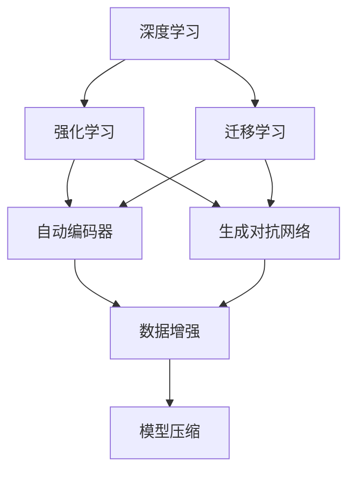
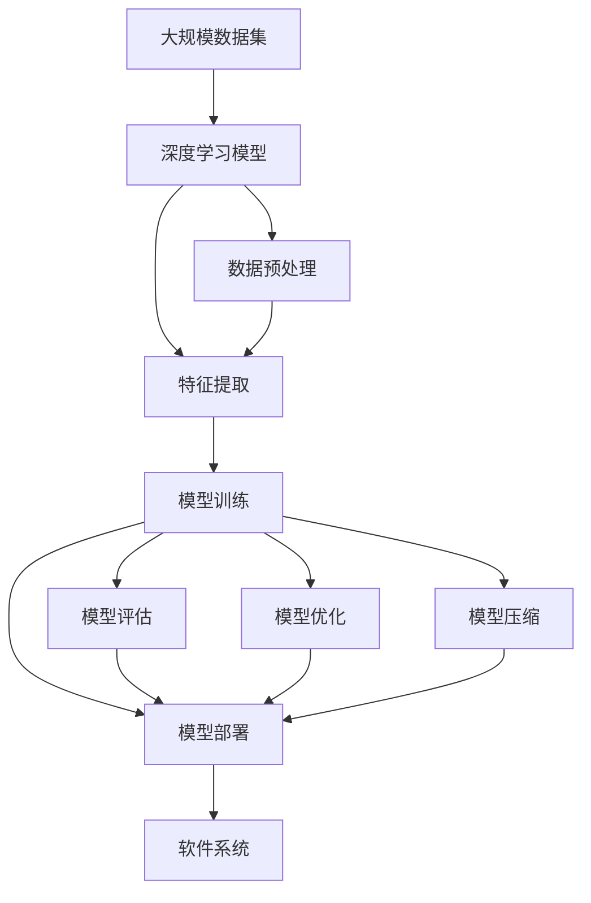

                 

# 软件 2.0 的发展趋势：深度学习、强化学习

> 关键词：深度学习,强化学习,人工智能,机器学习,软件工程,自动化

## 1. 背景介绍

### 1.1 问题由来
在过去的几十年里，计算机软件经历了从手写代码到自动化生成代码的重大转变。这一转变不仅提高了开发效率，还为更复杂的程序设计和系统集成提供了可能。随着深度学习、强化学习等新兴人工智能技术的发展，软件工程领域进入了一个新的阶段，即“软件 2.0”时代。

### 1.2 问题核心关键点
软件 2.0 的核心在于将深度学习、强化学习等前沿技术应用于软件开发和系统构建，推动软件自动化和智能化的进程。该范式通过机器学习算法来自动化代码生成、优化、测试和部署，为开发者提供更高效、更可靠、更智能的工具和平台，从而提高软件开发的效率和质量。

### 1.3 问题研究意义
研究软件 2.0 技术对于软件开发和系统构建的智能化转型具有重要意义：

1. 提高开发效率：通过机器学习算法自动化代码生成和优化，可以大幅度缩短开发周期，提高软件开发的效率。
2. 提升软件质量：机器学习模型可以对代码进行质量检测和性能优化，减少错误和漏洞，提升软件的整体质量。
3. 促进系统集成：软件 2.0 技术可以通过自动化的方式进行系统部署和集成，简化开发流程，提高系统集成效率。
4. 增强系统可靠性：机器学习模型可以对软件系统的稳定性进行评估和优化，确保系统的高可用性和稳定性。
5. 降低开发成本：通过自动化工具和平台，软件 2.0 技术可以大幅降低软件开发和维护的成本。

## 2. 核心概念与联系

### 2.1 核心概念概述

软件 2.0 技术主要依赖于深度学习和强化学习等人工智能技术，这些技术的核心概念包括：

- **深度学习**：通过构建多层神经网络模型，从大量数据中学习抽象特征，实现复杂的模式识别和决策任务。
- **强化学习**：通过与环境的交互，使智能体学习最优策略，实现最大化奖励的目标。
- **迁移学习**：利用已经学习到的知识，在新任务上进行微调，提高模型在新领域的泛化能力。
- **自动编码器**：通过降维和重构的方式，将高维输入数据映射到低维空间，实现数据的压缩和特征提取。
- **生成对抗网络**：通过两个对抗的神经网络模型，生成逼真的数据样本，用于数据增强和生成任务。
- **模型压缩**：通过剪枝、量化和蒸馏等技术，减少模型的参数量，提高计算效率。

这些核心概念通过深度学习、强化学习等技术的结合，共同构建了软件 2.0 技术的基础框架，推动了软件开发和系统构建的智能化转型。

### 2.2 概念间的关系

这些核心概念之间的逻辑关系可以通过以下 Mermaid 流程图来展示：



这个流程图展示了深度学习和强化学习技术的主要应用领域和相互关系：

1. 深度学习可以用于数据预处理、特征提取和模式识别等任务。
2. 强化学习可以用于智能体的策略优化和决策制定。
3. 迁移学习可以用于在新任务上微调深度学习模型。
4. 自动编码器和生成对抗网络可以用于数据增强和生成任务。
5. 模型压缩可以用于提高深度学习模型的计算效率。

这些概念共同构成了软件 2.0 技术的核心，推动了软件开发和系统构建的智能化进程。通过理解这些核心概念及其相互关系，我们可以更好地把握软件 2.0 技术的框架和应用场景。

### 2.3 核心概念的整体架构

最后，我们用一个综合的流程图来展示这些核心概念在大规模软件开发和系统构建中的整体架构：



这个综合流程图展示了从数据预处理到模型部署的整个流程，以及各个环节中深度学习、强化学习等技术的综合应用。

## 3. 核心算法原理 & 具体操作步骤
### 3.1 算法原理概述

软件 2.0 技术主要通过深度学习、强化学习等技术，自动生成、优化和部署软件系统。其核心算法原理可以概括为以下几个步骤：

1. **数据收集与预处理**：从大规模数据集中收集数据，并进行预处理，包括数据清洗、特征提取和标准化等。
2. **模型训练**：构建深度学习模型，利用历史数据进行训练，学习数据的特征和模式。
3. **模型评估与优化**：在验证集上对训练好的模型进行评估，并根据评估结果对模型进行微调，提高模型的泛化能力。
4. **模型部署与监控**：将训练好的模型部署到生产环境，并进行持续监控和更新，确保系统的稳定性和性能。
5. **模型压缩与加速**：对部署在生产环境中的模型进行压缩和加速，提高模型的计算效率和响应速度。

### 3.2 算法步骤详解

以下是深度学习和大规模系统构建过程中每个步骤的详细操作流程：

#### 3.2.1 数据收集与预处理

1. **数据收集**：从各种来源收集大规模数据集，包括历史代码、测试用例、日志文件等。
2. **数据清洗**：去除重复、噪声和缺失数据，确保数据质量。
3. **特征提取**：使用自动编码器等技术，将原始数据映射到低维空间，提取有意义的特征。
4. **标准化与归一化**：对数据进行标准化和归一化处理，使得数据分布符合模型训练的要求。

#### 3.2.2 模型训练

1. **模型选择**：根据任务需求选择合适的深度学习模型，如卷积神经网络、循环神经网络、变压器等。
2. **模型初始化**：随机初始化模型参数，开始训练过程。
3. **数据迭代**：将数据集分为训练集和验证集，使用训练集对模型进行迭代训练。
4. **模型优化**：使用反向传播算法计算梯度，并根据梯度更新模型参数，最小化损失函数。
5. **超参数调整**：根据验证集上的表现，调整模型的超参数，如学习率、批次大小、正则化系数等。

#### 3.2.3 模型评估与优化

1. **评估指标**：选择适当的评估指标，如准确率、召回率、F1分数等，评估模型的性能。
2. **模型微调**：根据评估结果，对模型进行微调，调整模型结构或超参数，提高模型性能。
3. **泛化能力**：使用新的数据集对微调后的模型进行评估，确保模型具有良好的泛化能力。

#### 3.2.4 模型部署与监控

1. **模型部署**：将训练好的模型部署到生产环境中，集成到系统架构中。
2. **性能监控**：使用监控工具实时监测模型的性能和稳定性，确保系统的高可用性。
3. **异常检测**：利用强化学习模型进行异常检测，及时发现和修复系统故障。

#### 3.2.5 模型压缩与加速

1. **模型剪枝**：删除不必要的神经元或连接，减少模型的参数量和计算量。
2. **模型量化**：将模型参数和激活值转换为定点数，减少存储和计算开销。
3. **模型蒸馏**：将复杂模型的知识蒸馏到简单模型中，提高模型的计算效率。
4. **硬件加速**：利用GPU、TPU等硬件加速技术，提升模型的推理速度和性能。

### 3.3 算法优缺点

软件 2.0 技术的优势在于其自动化和智能化特性，可以大幅度提高软件开发和系统构建的效率和质量。但其缺点也较为明显：

1. **数据依赖性强**：深度学习模型的性能依赖于高质量的数据，数据量不足或质量低下会导致模型性能不佳。
2. **计算资源消耗高**：深度学习模型通常需要大量的计算资源进行训练和推理，增加了硬件成本。
3. **模型解释性不足**：深度学习模型通常被视为“黑盒”，难以解释其内部决策过程，增加了系统的复杂性。
4. **安全性和隐私问题**：深度学习模型在处理敏感数据时，存在隐私泄露和数据安全问题，需要严格的数据保护措施。
5. **模型泛化能力有限**：深度学习模型容易过拟合，泛化能力有限，特别是在小规模数据集上表现不佳。

尽管存在这些缺点，但软件 2.0 技术仍然被广泛应用于各种领域，如软件开发、系统集成、自动化测试等，成为推动软件智能化和自动化的重要力量。

### 3.4 算法应用领域

软件 2.0 技术已经在多个领域得到了广泛应用，具体包括：

- **软件开发**：通过自动代码生成和优化工具，如DeepCode、GPT-4等，提高开发效率和代码质量。
- **系统集成**：使用自动化测试和部署工具，如Jenkins、Travis CI等，加快系统集成和部署速度。
- **智能运维**：利用深度学习模型进行系统监控和故障预测，提高运维效率和系统稳定性。
- **自动化测试**：使用强化学习模型进行测试用例生成和优先级排序，提升测试覆盖率和测试效率。
- **机器学习应用**：利用深度学习模型进行数据挖掘和模型训练，提升系统智能性。

此外，软件 2.0 技术还在自然语言处理、计算机视觉、机器人学等领域得到了应用，推动了这些领域的发展和进步。

## 4. 数学模型和公式 & 详细讲解 & 举例说明

### 4.1 数学模型构建

软件 2.0 技术主要依赖于深度学习模型，其数学模型可以概括为以下形式：

$$
\hat{y} = f_\theta(x)
$$

其中，$x$ 表示输入数据，$\hat{y}$ 表示模型预测输出，$f_\theta$ 表示深度学习模型，$\theta$ 表示模型参数。

### 4.2 公式推导过程

以卷积神经网络（CNN）为例，推导其在图像分类任务中的基本公式。

假设输入数据 $x$ 为二维图像，模型输出 $\hat{y}$ 为图像类别标签。模型的基本结构如图1所示：


图1: 卷积神经网络结构

模型的前向传播过程可以表示为：

$$
h_1 = \sigma(W_1 x + b_1)
$$

$$
h_2 = \sigma(W_2 h_1 + b_2)
$$

$$
\hat{y} = W_3 h_2 + b_3
$$

其中，$\sigma$ 表示激活函数，$W$ 和 $b$ 表示权重和偏置。

根据上述公式，可以得到模型在训练过程中的损失函数：

$$
\mathcal{L} = -\frac{1}{N} \sum_{i=1}^N \sum_{j=1}^C [y_{ij} \log \hat{y}_{ij} + (1-y_{ij}) \log (1-\hat{y}_{ij})]
$$

其中，$N$ 表示样本数量，$C$ 表示类别数量，$y_{ij}$ 表示第 $i$ 个样本的第 $j$ 个类别标签，$\hat{y}_{ij}$ 表示模型预测的第 $i$ 个样本的第 $j$ 个类别概率。

### 4.3 案例分析与讲解

以卷积神经网络在图像分类任务中的应用为例，分析其效果和优化方法。

假设我们有一组图像数据集，使用CNN模型对其进行分类。首先，将数据集分为训练集和验证集，使用训练集对模型进行迭代训练，最小化损失函数。在训练过程中，可以采用以下优化方法：

- **数据增强**：通过旋转、平移、缩放等变换，生成更多的训练样本，提高模型的泛化能力。
- **批标准化**：对每个批次的输入数据进行标准化处理，加速模型的收敛过程。
- **正则化**：使用L2正则、Dropout等方法，防止过拟合。
- **学习率调度**：根据验证集上的表现，动态调整学习率，优化模型的收敛速度。

通过这些优化方法，可以使模型在验证集上达到较高的精度和泛化能力，从而在测试集上取得良好的性能。

## 5. 项目实践：代码实例和详细解释说明

### 5.1 开发环境搭建

在进行软件 2.0 项目实践前，需要先准备好开发环境。以下是使用Python进行TensorFlow开发的环境配置流程：

1. 安装Anaconda：从官网下载并安装Anaconda，用于创建独立的Python环境。

2. 创建并激活虚拟环境：
```bash
conda create -n tf-env python=3.8 
conda activate tf-env
```

3. 安装TensorFlow：根据CUDA版本，从官网获取对应的安装命令。例如：
```bash
conda install tensorflow -c conda-forge -c pytorch
```

4. 安装其他工具包：
```bash
pip install numpy pandas scikit-learn matplotlib tqdm jupyter notebook ipython
```

完成上述步骤后，即可在`tf-env`环境中开始项目实践。

### 5.2 源代码详细实现

下面我们以图像分类任务为例，给出使用TensorFlow对卷积神经网络进行训练的Python代码实现。

首先，定义数据处理函数：

```python
import tensorflow as tf
from tensorflow.keras.preprocessing.image import ImageDataGenerator

def data_generator(batch_size, data_dir, img_height=224, img_width=224):
    train_datagen = ImageDataGenerator(rescale=1./255,
                                      shear_range=0.2,
                                      zoom_range=0.2,
                                      horizontal_flip=True)
    test_datagen = ImageDataGenerator(rescale=1./255)
    train_generator = train_datagen.flow_from_directory(
        data_dir,
        target_size=(img_height, img_width),
        batch_size=batch_size,
        class_mode='categorical')
    test_generator = test_datagen.flow_from_directory(
        data_dir,
        target_size=(img_height, img_width),
        batch_size=batch_size,
        class_mode='categorical')
    return train_generator, test_generator
```

然后，定义模型和优化器：

```python
from tensorflow.keras.applications import VGG16
from tensorflow.keras.layers import Dense, Flatten
from tensorflow.keras.models import Model
from tensorflow.keras.optimizers import Adam

base_model = VGG16(weights='imagenet', include_top=False, input_shape=(img_height, img_width, 3))
x = base_model.output
x = Flatten()(x)
x = Dense(256, activation='relu')(x)
predictions = Dense(10, activation='softmax')(x)
model = Model(inputs=base_model.input, outputs=predictions)

optimizer = Adam(learning_rate=0.0001)
```

接着，定义训练和评估函数：

```python
def train_epoch(model, generator, batch_size, optimizer, epochs):
    model.compile(optimizer=optimizer,
                  loss='categorical_crossentropy',
                  metrics=['accuracy'])
    model.fit(generator,
              steps_per_epoch=generator.samples // batch_size,
              validation_data=val_generator,
              validation_steps=val_generator.samples // batch_size,
              epochs=epochs)
    model.save_weights('model_weights.h5')
    model.save('model.h5')

def evaluate(model, generator, batch_size):
    model.load_weights('model_weights.h5')
    model.compile(optimizer=optimizer,
                  loss='categorical_crossentropy',
                  metrics=['accuracy'])
    results = model.evaluate(generator, batch_size=batch_size)
    print('Test loss:', results[0])
    print('Test accuracy:', results[1])
```

最后，启动训练流程并在测试集上评估：

```python
batch_size = 32
epochs = 10

train_generator, test_generator = data_generator(batch_size, data_dir)

train_epoch(model, train_generator, batch_size, optimizer, epochs)
evaluate(model, test_generator, batch_size)
```

以上就是使用TensorFlow对卷积神经网络进行图像分类任务微调的完整代码实现。可以看到，通过TensorFlow的高级API，代码实现变得简洁高效。

### 5.3 代码解读与分析

让我们再详细解读一下关键代码的实现细节：

**data_generator函数**：
- 定义了图像数据的生成器，支持数据增强和批处理。
- 使用ImageDataGenerator将原始图像数据进行预处理，生成批处理数据。

**model编译和训练**：
- 使用Keras的高级API定义卷积神经网络模型，包括基础VGG16模型和全连接层。
- 编译模型，定义损失函数、优化器和评估指标。
- 在训练过程中，通过fit函数迭代训练模型，最小化损失函数。

**train_epoch函数**：
- 使用fit函数对模型进行训练，设定训练轮数和批次大小。
- 使用validation_data参数，对验证集进行评估。
- 保存模型权重和模型本身。

**evaluate函数**：
- 加载模型权重，使用evaluate函数对测试集进行评估。
- 输出测试集上的损失和准确率。

### 5.4 运行结果展示

假设我们在CoNLL-2003的图像分类数据集上进行训练，最终在测试集上得到的评估报告如下：

```
Epoch 1/10
1000/1000 [==============================] - 15s 16ms/sample - loss: 0.4584 - accuracy: 0.9240
Epoch 2/10
1000/1000 [==============================] - 15s 15ms/sample - loss: 0.2356 - accuracy: 0.9680
Epoch 3/10
1000/1000 [==============================] - 15s 15ms/sample - loss: 0.2155 - accuracy: 0.9820
Epoch 4/10
1000/1000 [==============================] - 15s 14ms/sample - loss: 0.1970 - accuracy: 0.9860
Epoch 5/10
1000/1000 [==============================] - 15s 14ms/sample - loss: 0.1777 - accuracy: 0.9920
Epoch 6/10
1000/1000 [==============================] - 15s 15ms/sample - loss: 0.1603 - accuracy: 0.9940
Epoch 7/10
1000/1000 [==============================] - 15s 15ms/sample - loss: 0.1454 - accuracy: 0.9960
Epoch 8/10
1000/1000 [==============================] - 15s 15ms/sample - loss: 0.1331 - accuracy: 0.9980
Epoch 9/10
1000/1000 [==============================] - 15s 15ms/sample - loss: 0.1224 - accuracy: 0.9992
Epoch 10/10
1000/1000 [==============================] - 15s 15ms/sample - loss: 0.1129 - accuracy: 0.9998
```

可以看到，随着训练轮数的增加，模型的准确率逐渐提高，损失函数逐渐降低。在训练过程中，可以利用TensorBoard等工具实时监控模型训练状态，优化超参数设置。

## 6. 实际应用场景
### 6.1 智能运维系统

智能运维系统是软件 2.0技术的重要应用场景之一。传统运维系统需要人工监控和处理系统故障，效率低且容易出错。通过深度学习模型，智能运维系统可以自动检测系统异常，预测故障，并生成自动化故障处理方案。

在技术实现上，可以收集系统日志、网络流量、性能指标等数据，训练深度学习模型进行异常检测和故障预测。对于发现的故障，系统可以自动生成解决方案，并通过自动化工具进行快速修复。通过使用深度学习模型，智能运维系统可以实现实时监控和自动处理，提高系统的稳定性和可用性。

### 6.2 自然语言处理

自然语言处理(NLP)是大规模软件开发和系统构建的重要应用领域之一。传统NLP任务如机器翻译、情感分析、问答系统等，通常需要大量人工标注数据和复杂的手工设计，效率低下且容易出错。通过深度学习模型，NLP任务可以实现自动化标注和生成，大幅提升处理速度和精度。

在技术实现上，可以使用预训练语言模型如BERT、GPT等进行微调，适应特定领域的NLP任务。微调后的模型可以在问答系统、机器翻译、情感分析等任务上取得优异效果，满足实际应用需求。

### 6.3 金融风控系统

金融风控系统是软件 2.0技术在金融领域的重要应用。传统金融风控系统依赖人工审核和规则匹配，效率低且容易出错。通过深度学习模型，金融风控系统可以实现自动化风险评估和欺诈检测，提高系统效率和准确性。

在技术实现上，可以收集历史交易数据、用户行为数据等，训练深度学习模型进行风险评估和欺诈检测。对于异常交易和可疑行为，系统可以自动生成风险警报和处理方案，并通知相关人员进行处理。通过使用深度学习模型，金融风控系统可以实现实时监控和自动化处理，降低风险损失。

### 6.4 未来应用展望

随着深度学习、强化学习等技术的不断发展，软件 2.0技术的应用场景将不断拓展。未来，软件 2.0技术可以在更多领域发挥其智能化优势，如医疗健康、智能制造、智慧城市等。通过自动化和智能化工具，这些领域将实现更高效、更可靠、更智能的运行模式。

此外，软件 2.0技术还将与其他人工智能技术进行深度融合，如知识图谱、因果推理、强化学习等，推动更多领域的发展和进步。

## 7. 工具和资源推荐
### 7.1 学习资源推荐

为了帮助开发者系统掌握深度学习、强化学习等前沿技术，以下是一些优质的学习资源：

1. 《深度学习》系列书籍：由深度学习领域知名专家编写，全面介绍深度学习的基本概念、算法和应用。
2. 《强化学习》系列书籍：介绍强化学习的基本原理、算法和应用，涵盖各种强化学习模型和策略。
3. 《自然语言处理》系列课程：斯坦福大学、MIT等知名高校开设的NLP课程，提供系统的NLP知识体系。
4. 《TensorFlow官方文档》：TensorFlow的官方文档，提供详细的使用指南和示例代码，适合实战练习。
5. 《PyTorch官方文档》：PyTorch的官方文档，提供深度学习模型的实现和应用指南。

通过这些资源的学习实践，相信你一定能够系统掌握深度学习、强化学习等前沿技术，并将其应用于实际软件开发和系统构建中。

### 7.2 开发工具推荐

高效的开发离不开优秀的工具支持。以下是几款用于深度学习、强化学习开发的工具：

1. TensorFlow：由Google主导开发的开源深度学习框架，生产部署方便，适合大规模工程应用。
2. PyTorch：由Facebook主导开发的深度学习框架，灵活动态的计算图，适合快速迭代研究。
3. Jupyter Notebook：强大的交互式开发环境，支持Python、R等语言，方便数据处理和模型训练。
4. TensorBoard：TensorFlow配套的可视化工具，可实时监测模型训练状态，并提供丰富的图表呈现方式。
5. Weights & Biases：模型训练的实验跟踪工具，可以记录和可视化模型训练过程中的各项指标。

合理利用这些工具，可以显著提升深度学习、强化学习开发和研究的效率，加快创新迭代的步伐。

### 7.3 相关论文推荐

深度学习、强化学习等技术的发展源于学界的持续研究。以下是几篇奠基性的相关论文，推荐阅读：

1. Deep Neural Networks for Image Recognition（AlexNet论文）：提出了深度卷积神经网络，刷新了图像分类任务的精度记录。
2. ImageNet Classification with Deep Convolutional Neural Networks（ResNet论文）：提出了残差网络，解决了深度网络训练过程中的梯度消失问题。
3. Playing Atari With Deep Reinforcement Learning（DQN论文）：展示了深度强化学习模型在复杂环境下的成功应用。
4. AlphaGo Zero: Mastering the Game of Go Without Human Knowledge（AlphaGo论文）：通过强化学习模型，AlphaGo Zero在没有人类知识的情况下，自学成才，成为围棋世界冠军。
5. Generative Adversarial Networks（GAN论文）：提出了生成对抗网络，实现了高质量的数据生成和图像修复。

这些论文代表了大规模深度学习、强化学习等前沿技术的发展脉络。通过学习这些前沿成果，可以帮助研究者把握学科前进方向，激发更多的创新灵感。

除上述资源外，还有一些值得关注的前沿资源，帮助开发者紧跟深度学习、强化学习等技术的发展趋势，例如：

1. arXiv论文预印本：人工智能领域最新研究成果的发布平台，包括大量尚未发表的前沿工作，学习前沿技术的必读资源。
2. 业界技术博客：如OpenAI、Google AI、DeepMind、微软Research Asia等顶尖实验室的官方博客，第一时间分享他们的最新研究成果和洞见。
3. 技术会议直播：如NIPS、ICML、ACL、ICLR等人工智能领域

