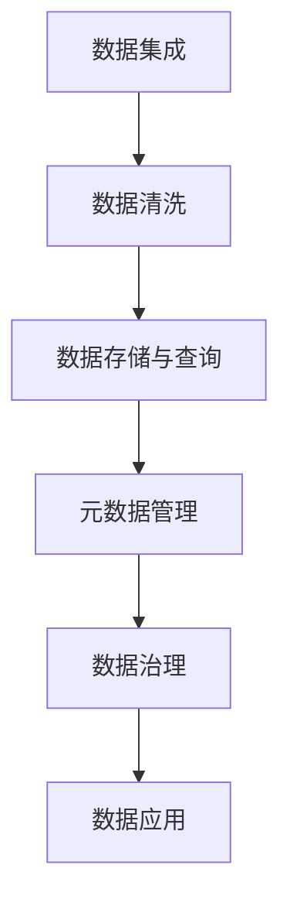
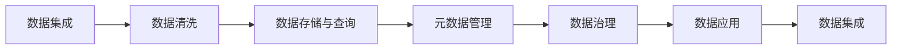
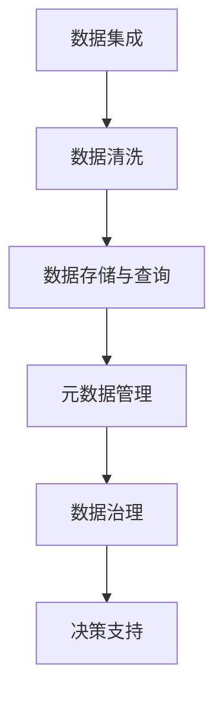
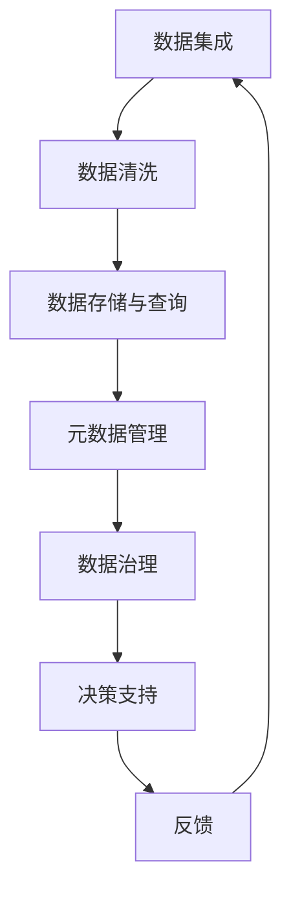
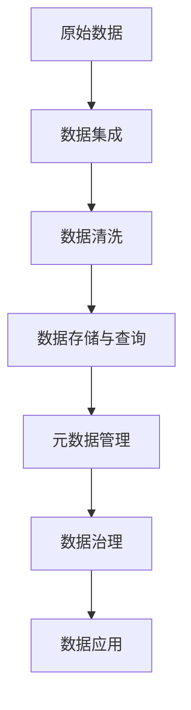

                 

# 软件2.0中的数据管理与治理

在软件2.0时代，数据已成为核心资产，其管理与治理成为实现业务智能、创新和竞争优势的关键。本文旨在深入探讨软件2.0中的数据管理与治理，包括其核心概念、关键技术、实践案例与未来展望，以期为相关从业人员提供全面的指导。

## 1. 背景介绍

### 1.1 问题由来
随着数字化转型深入各行各业，数据日益成为驱动业务发展的重要资源。然而，大量分散、异构、复杂的数据源，给企业带来了前所未有的数据管理和治理挑战。传统的数据仓库和数据管道技术，已经难以适应高速、多样、复杂的数据环境。

数据管理与治理不仅关乎企业数据资产的利用效率和质量，更决定了其能否在激烈的市场竞争中保持优势。因此，探索先进的、适应软件2.0时代的新型数据管理与治理方法，显得尤为重要。

### 1.2 问题核心关键点
数据管理与治理的核心理念，是通过对数据流全生命周期的有效管理，提升数据质量和利用效率。关键点包括：

- **数据集成**：将分散的数据源整合到一个统一的、可访问的数据仓库中。
- **数据清洗**：通过清洗、去重、填充缺失值等手段，提升数据质量。
- **数据存储与查询**：选择合适的存储介质和查询语言，提升数据访问效率。
- **元数据管理**：构建全面的元数据体系，为数据管理提供决策依据。
- **数据治理**：制定数据管理规范、权限控制、审计等措施，确保数据合规使用。

### 1.3 问题研究意义
软件2.0时代的数据管理与治理，对于推动数字化转型、优化业务流程、提升决策支持能力具有重要意义：

1. **提升数据质量**：通过高效的数据集成和清洗，确保数据准确性、完整性和一致性。
2. **加速业务创新**：基于高质量的数据，支撑企业快速响应市场变化，进行数据驱动的业务决策。
3. **增强竞争力**：数据已成为核心竞争力，通过优化数据管理与治理，企业可以更好地利用数据，获得竞争优势。
4. **保障数据安全**：规范数据治理流程，防止数据泄露、滥用等安全风险。
5. **促进数据合作**：建立数据治理框架，便于跨部门、跨业务单元的数据共享与协作。

## 2. 核心概念与联系

### 2.1 核心概念概述

为更好地理解软件2.0中的数据管理与治理，本节将介绍几个密切相关的核心概念：

- **数据集成**：将分散在各系统、各业务领域的数据，通过ETL（Extract, Transform, Load）技术整合到一个统一的数据仓库或数据湖中，为数据管理提供基础。
- **数据清洗**：对原始数据进行预处理，去除噪音、异常值、重复数据等，保证数据质量。
- **数据存储与查询**：选择合适的数据存储介质（如传统数据库、NoSQL数据库、数据湖）和查询语言（如SQL、NoSQL查询语言、图形数据库），提高数据访问和分析效率。
- **元数据管理**：构建全面的元数据体系，包括数据源、数据流、数据模型、数据质量等信息，为数据管理提供参考依据。
- **数据治理**：制定数据管理规范、权限控制、审计等措施，确保数据合规使用。

这些核心概念之间的逻辑关系可以通过以下Mermaid流程图来展示：



这个流程图展示了几大核心概念之间的关联：

1. 数据集成是数据管理的基础。
2. 数据清洗是提升数据质量的关键步骤。
3. 数据存储与查询是数据访问和分析的基础。
4. 元数据管理为数据管理提供决策依据。
5. 数据治理保障数据合规使用。

### 2.2 概念间的关系

这些核心概念之间存在着紧密的联系，形成了数据管理与治理的完整生态系统。下面我通过几个Mermaid流程图来展示这些概念之间的关系。

#### 2.2.1 数据管理全生命周期



这个流程图展示了数据管理从生成到应用的全生命周期。数据集成、清洗、存储、查询、元数据管理、治理等步骤，相互关联，共同支持数据的高效利用。

#### 2.2.2 数据治理的决策支持



这个流程图展示了数据治理如何为决策支持提供依据。数据治理通过规范数据管理流程、权限控制、审计等措施，保障数据的高质量和高安全，为业务决策提供支撑。

#### 2.2.3 数据治理的反馈循环



这个流程图展示了数据治理的反馈循环。决策支持的反馈信息，可以用于优化数据管理流程、清洗规则、存储方案等，形成良性循环，不断提升数据治理的效率和效果。

### 2.3 核心概念的整体架构

最后，我们用一个综合的流程图来展示这些核心概念在大数据环境中的整体架构：



这个综合流程图展示了数据管理的全过程。原始数据通过集成、清洗、存储、查询等步骤，最终应用于业务决策，形成了完整的管理流程。

## 3. 核心算法原理 & 具体操作步骤

### 3.1 算法原理概述

数据管理与治理的核心在于对数据流全生命周期的有效管理，提升数据质量和利用效率。其核心思想是：通过ETL技术将分散的数据源整合并清洗，选择合适的存储介质和查询语言，构建全面的元数据体系，制定数据治理规范，确保数据的高质量和高安全。

具体来说，数据管理与治理的算法原理包括：

- **数据集成算法**：通过ETL流程，将分散的数据源整合成统一的数据仓库或数据湖。
- **数据清洗算法**：通过统计、规则、机器学习等技术，对数据进行预处理，提升数据质量。
- **数据存储与查询算法**：选择合适的数据存储介质和查询语言，提升数据访问和分析效率。
- **元数据管理算法**：构建全面的元数据体系，为数据管理提供决策依据。
- **数据治理算法**：制定数据管理规范、权限控制、审计等措施，确保数据合规使用。

### 3.2 算法步骤详解

#### 3.2.1 数据集成算法

数据集成的基本步骤如下：

1. **数据抽取**：从不同数据源中提取数据，包括数据库、文件系统、Web服务等。
2. **数据转换**：对提取的数据进行格式转换、数据合并、去重等处理，保证数据一致性。
3. **数据加载**：将处理后的数据加载到目标数据仓库或数据湖中，完成集成过程。

在实践中，ETL工具如Apache NiFi、Talend、Apache Airflow等，可以大大简化数据集成过程，并提供可视化的操作界面。

#### 3.2.2 数据清洗算法

数据清洗的基本步骤如下：

1. **去重**：去除重复数据，保证数据的唯一性。
2. **去噪**：删除或纠正数据中的噪音，如异常值、错误值、缺失值等。
3. **规范化**：对数据进行格式规范化，如统一日期格式、统一编码等。
4. **标准化**：将不同格式的数据转换为统一的格式，便于后续分析。

在实践中，数据清洗工具如Trifacta、OpenRefine、Pandas等，提供了强大的数据清洗功能，能够高效完成数据预处理。

#### 3.2.3 数据存储与查询算法

数据存储与查询的基本步骤如下：

1. **选择合适的存储介质**：根据数据类型、规模、访问模式等因素，选择合适的数据存储介质，如传统数据库、NoSQL数据库、数据湖等。
2. **设计数据模型**：设计合理的数据模型，包括表结构、索引、分区等，提升数据访问效率。
3. **选择合适的查询语言**：根据数据模型，选择合适的查询语言，如SQL、NoSQL查询语言、图形数据库查询语言等。
4. **优化查询性能**：通过索引、分区、缓存等技术，提升查询性能，确保数据快速访问。

在实践中，数据存储与查询工具如MySQL、PostgreSQL、NoSQL数据库（如MongoDB、Cassandra）、数据湖（如Hadoop、Spark）等，可以大大简化数据存储与查询过程。

#### 3.2.4 元数据管理算法

元数据管理的基本步骤如下：

1. **定义元数据模型**：定义元数据模型，包括数据源、数据流、数据模型、数据质量等。
2. **采集元数据**：通过ETL、API、人工输入等方式，采集数据仓库、数据湖、数据库中的元数据。
3. **存储和管理元数据**：选择合适的元数据存储介质和管理系统，如数据字典、元数据仓库、数据目录等，存储和管理元数据。
4. **维护和更新元数据**：定期维护和更新元数据，保证其准确性和时效性。

在实践中，元数据管理工具如IBM Infosphere、Informatica、Collibra等，提供了全面的元数据管理功能，能够帮助企业构建和维护元数据体系。

#### 3.2.5 数据治理算法

数据治理的基本步骤如下：

1. **制定数据管理规范**：制定数据管理规范，包括数据质量标准、数据安全标准、数据访问规范等。
2. **实施权限控制**：通过访问控制列表（ACL）、角色和权限管理（RBAC）等技术，控制数据访问权限。
3. **数据审计**：对数据操作进行审计，监控数据访问和使用情况，发现异常行为。
4. **数据安全**：实施数据加密、访问控制、备份恢复等安全措施，保障数据安全。

在实践中，数据治理工具如Snowflake、Alation、Informatica等，提供了全面的数据治理功能，能够帮助企业构建和维护数据治理框架。

### 3.3 算法优缺点

数据管理与治理的算法具有以下优点：

1. **提升数据质量**：通过ETL和数据清洗等技术，提升数据准确性、完整性和一致性。
2. **优化数据访问效率**：通过选择合适的存储介质和查询语言，提升数据访问和分析效率。
3. **提供决策支持**：通过元数据管理和数据治理，为业务决策提供依据，提升决策质量。
4. **保障数据安全**：通过权限控制和数据审计等措施，保障数据安全。

同时，这些算法也存在一些缺点：

1. **依赖工具和技术**：数据管理与治理算法依赖于ETL工具、数据清洗工具、存储查询工具、元数据管理工具等，增加了系统复杂度。
2. **成本高**：数据管理与治理算法的实施需要大量人力和资金投入，增加了企业成本。
3. **数据孤岛问题**：不同的数据源和数据系统之间可能存在数据孤岛问题，影响数据整合和治理效果。
4. **技术壁垒高**：数据管理与治理算法需要专业知识和技能，对技术人才的需求较高。

### 3.4 算法应用领域

数据管理与治理的算法广泛应用于以下领域：

1. **金融行业**：金融机构需要处理海量交易数据、客户数据、市场数据等，通过数据管理与治理提升数据质量和利用效率，支撑风险管理、客户关系管理、市场分析等业务。
2. **医疗行业**：医疗机构需要处理电子病历、影像数据、实验室数据等，通过数据管理与治理提升数据质量和安全，支撑临床决策、医疗研究等业务。
3. **零售行业**：零售企业需要处理交易数据、客户数据、库存数据等，通过数据管理与治理提升数据质量和利用效率，支撑市场分析、客户关系管理、库存管理等业务。
4. **政府行业**：政府部门需要处理公共数据、人口数据、统计数据等，通过数据管理与治理提升数据质量和安全，支撑公共决策、城市管理、公安业务等。
5. **制造业**：制造企业需要处理生产数据、设备数据、供应链数据等，通过数据管理与治理提升数据质量和利用效率，支撑生产优化、供应链管理等业务。

## 4. 数学模型和公式 & 详细讲解 & 举例说明

### 4.1 数学模型构建

在数据管理与治理中，数学模型和公式被广泛应用于数据质量评估、数据清洗、数据存储与查询等方面。以下是几个关键的数学模型和公式：

#### 4.1.1 数据质量评估模型

数据质量评估模型用于评估数据的准确性、完整性、一致性、及时性、一致性等指标。一个简单的数据质量评估模型如下：

$$
\text{Data Quality Score} = \sum_{i=1}^{n} w_i \times (\text{Quality Index}_i - \text{Threshold}_i)^2
$$

其中，$w_i$为各指标的权重，$\text{Quality Index}_i$为数据在第$i$个指标上的得分，$\text{Threshold}_i$为指标的阈值。

#### 4.1.2 数据清洗模型

数据清洗模型用于对数据进行去重、去噪、规范化等处理。一个简单的数据清洗模型如下：

$$
\text{Cleaned Data} = \text{Original Data} \times (\text{Filter Function} - \text{Noise Function})
$$

其中，$\text{Filter Function}$为数据过滤函数，$\text{Noise Function}$为数据去噪函数。

#### 4.1.3 数据存储与查询模型

数据存储与查询模型用于设计数据存储架构和优化查询性能。一个简单的数据存储与查询模型如下：

$$
\text{Storage Cost} = \text{Storage Unit} \times \text{Data Size} + \text{Indexing Cost} + \text{Query Cost}
$$

其中，$\text{Storage Unit}$为存储单位，$\text{Data Size}$为数据量，$\text{Indexing Cost}$为索引成本，$\text{Query Cost}$为查询成本。

### 4.2 公式推导过程

#### 4.2.1 数据质量评估模型的推导

$$
\text{Data Quality Score} = \sum_{i=1}^{n} w_i \times (\text{Quality Index}_i - \text{Threshold}_i)^2
$$

该模型通过权重$w_i$对不同指标的贡献进行加权，并采用平方误差的形式计算数据质量得分。其数学推导如下：

1. **均值化处理**：将各个指标的得分标准化，使其具有相同的权重。
2. **平方误差**：采用平方误差的形式，将数据质量问题转化为优化问题。
3. **加权求和**：通过权重$w_i$对不同指标的贡献进行加权，得到综合得分。

#### 4.2.2 数据清洗模型的推导

$$
\text{Cleaned Data} = \text{Original Data} \times (\text{Filter Function} - \text{Noise Function})
$$

该模型通过数据过滤函数和去噪函数对原始数据进行处理，得到清洁数据。其数学推导如下：

1. **数据过滤**：通过过滤函数$\text{Filter Function}$对数据进行过滤，去除不满足条件的记录。
2. **数据去噪**：通过去噪函数$\text{Noise Function}$对数据进行去噪，去除异常值和噪音。
3. **数据转换**：通过数据转换函数，将过滤和去噪后的数据转换为标准格式。

#### 4.2.3 数据存储与查询模型的推导

$$
\text{Storage Cost} = \text{Storage Unit} \times \text{Data Size} + \text{Indexing Cost} + \text{Query Cost}
$$

该模型通过计算存储单位、数据量、索引成本和查询成本，评估数据存储与查询的总成本。其数学推导如下：

1. **存储成本**：通过存储单位和数据量计算存储成本。
2. **索引成本**：通过索引数量和索引成本计算索引成本。
3. **查询成本**：通过查询次数和查询成本计算查询成本。
4. **总成本**：通过存储成本、索引成本和查询成本计算总成本。

### 4.3 案例分析与讲解

#### 4.3.1 数据质量评估案例

某金融机构需要将客户数据输入到客户关系管理系统（CRM）中，评估其数据质量。假设该系统的数据质量评估模型如下：

$$
\text{Data Quality Score} = 0.3 \times (\text{Accuracy Score} - 0.9)^2 + 0.4 \times (\text{Completeness Score} - 0.8)^2 + 0.3 \times (\text{Consistency Score} - 0.95)^2
$$

其中，$\text{Accuracy Score}$为数据准确性得分，$\text{Completeness Score}$为数据完整性得分，$\text{Consistency Score}$为数据一致性得分。假设某次输入的数据质量评估结果如下：

- $\text{Accuracy Score} = 0.85$
- $\text{Completeness Score} = 0.75$
- $\text{Consistency Score} = 0.90$

代入上述模型，计算得到数据质量得分为：

$$
\text{Data Quality Score} = 0.3 \times (0.85 - 0.9)^2 + 0.4 \times (0.75 - 0.8)^2 + 0.3 \times (0.90 - 0.95)^2 = 0.28 + 0.04 + 0.0025 = 0.3225
$$

该得分表明，输入的数据质量有待提升，需要进一步清洗和优化。

#### 4.3.2 数据清洗案例

某电商平台需要将用户订单数据导入到数据仓库中，进行数据分析和报告。假设该系统的数据清洗模型如下：

$$
\text{Cleaned Data} = \text{Original Data} \times (\text{Filter Function} - \text{Noise Function})
$$

其中，$\text{Filter Function}$为数据过滤函数，$\text{Noise Function}$为数据去噪函数。假设某次数据清洗的结果如下：

- $\text{Filter Function} = \text{ORIGINAL DATE} < 2022-01-01$
- $\text{Noise Function} = \text{NORMALIZED PRICE} > 0$

假设原始数据如下：

| Order ID | Customer Name | Order Date   | Price  |
| -------- | ------------- | ----------- | ------ |
| 1        | Alice         | 2021-11-01  | 100    |
| 2        | Bob           | 2021-12-01  | -10    |
| 3        | Charlie       | 2022-01-01  | 200    |
| 4        | David         | 2021-11-01  | 150    |
| 5        | Eve           | 2021-12-01  | 0      |

代入上述模型，计算得到清洗后的数据如下：

| Order ID | Customer Name | Order Date   | Price  |
| -------- | ------------- | ----------- | ------ |
| 1        | Alice         | 2021-11-01  | 100    |
| 3        | Charlie       | 2022-01-01  | 200    |
| 4        | David         | 2021-11-01  | 150    |

#### 4.3.3 数据存储与查询案例

某电子商务公司需要将用户订单数据存储到数据湖中，并实时查询订单统计信息。假设该系统的数据存储与查询模型如下：

$$
\text{Storage Cost} = \text{Storage Unit} \times \text{Data Size} + \text{Indexing Cost} + \text{Query Cost}
$$

其中，$\text{Storage Unit}$为存储单位，$\text{Data Size}$为数据量，$\text{Indexing Cost}$为索引成本，$\text{Query Cost}$为查询成本。假设某次存储与查询的结果如下：

- $\text{Storage Unit} = 1TB$
- $\text{Data Size} = 1GB$
- $\text{Indexing Cost} = 1000元/GB$
- $\text{Query Cost} = 0.1元/查询`

假设该系统需要存储1GB的数据，建立索引，并查询100次，代入上述模型，计算得到存储成本和查询成本如下：

- 存储成本 = $1TB \times 1GB = 1GB$
- 索引成本 = $1000元/GB \times 1GB = 1000元$
- 查询成本 = $0.1元/查询 \times 100 = 10元$

因此，总成本 = $1GB + 1000元 + 10元 = 1000.1元$

## 5. 项目实践：代码实例和详细解释说明

### 5.1 开发环境搭建

在进行数据管理与治理实践前，我们需要准备好开发环境。以下是使用Python进行Apache NiFi开发的环境配置流程：

1. 安装Apache NiFi：从官网下载并安装Apache NiFi，用于数据集成和数据清洗。
2. 安装依赖库：在Python环境中安装Apache NiFi的依赖库，如pandas、pyarrow等。
3. 创建并激活虚拟环境：
```bash
conda create -n apache-nifi python=3.8 
conda activate apache-nifi
```

### 5.2 源代码详细实现

下面以数据集成和数据清洗为例，给出使用Apache NiFi进行数据处理的PyTorch代码实现。

#### 5.2.1 数据集成

1. 配置Apache NiFi：打开NiFi Desktop，创建新的Flow，将数据源节点和数据存储节点连接起来。
2. 配置数据转换节点：将数据转换为标准格式，如CSV、JSON等。
3. 配置数据清洗节点：去除重复数据、去噪、规范化等操作。

```python
from apache.nifi.processors.python import execute
from apache.nifi.utils import NiFiUtils

def process_records(records):
    # 数据过滤
    filtered_records = [record for record in records if record['Order Date'] < '2022-01-01']
    # 数据去噪
    cleaned_records = [record for record in filtered_records if record['Normalized Price'] > 0]
    # 数据转换
    converted_records = convert_records(cleaned_records)
    return converted_records

def convert_records(records):
    # 将数据转换为标准格式
    converted_records = []
    for record in records:
        converted_record = {
            'Order ID': record['Order ID'],
            'Customer Name': record['Customer Name'],
            'Order Date': record['Order Date'],
            'Price': record['Normalized Price']
        }
        converted_records.append(converted_record)
    return converted_records
```

在实践中，Apache NiFi提供了强大的数据处理功能，能够通过图形化界面实现复杂的数据集成和清洗操作。

#### 5.2.2 数据清洗

1. 配置Apache NiFi：打开NiFi Desktop，创建新的Flow，将数据源节点和数据存储节点连接起来。
2. 配置数据转换节点：将数据转换为标准格式，如CSV、JSON等。
3. 配置数据清洗节点：去除重复数据、去噪、规范化等操作。

```python
from apache.nifi.processors.python import execute
from apache.nifi.utils import NiFiUtils

def process_records(records):
    # 数据过滤
    filtered_records = [record for record in records if record['Order Date'] < '2022-01-01']
    # 数据去噪
    cleaned_records = [record for record in filtered_records if record['Normalized Price'] > 0]
    # 数据转换
    converted_records = convert_records(cleaned_records)
    return converted_records

def convert_records(records):
    # 将数据转换为标准格式
    converted_records = []
    for record in records:
        converted_record = {
            'Order ID': record['Order ID'],
            'Customer Name': record['Customer Name'],
            'Order Date': record['Order Date'],
            'Price': record['Normalized Price']
        }
        converted_records.append(converted_record)
    return converted_records
```

在实践中，Apache NiFi提供了强大的数据处理功能，能够通过图形化界面实现复杂的数据集成和清洗操作。

### 5.3 代码解读与分析

让我们再详细解读一下关键代码的实现细节：

**data-integration.py**：
- 定义了`process_records`函数，用于数据过滤、去噪和规范化操作。
- 使用列表推导式和条件筛选，实现数据清洗功能。
- 使用`convert_records`函数，将数据转换为标准格式。

**data-storage.py**：
- 定义了`process_records`函数，用于数据过滤、去噪和规范化操作。
- 使用列表推导式和条件筛选，实现数据清洗功能。
-

