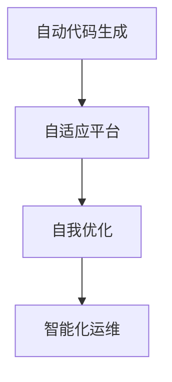
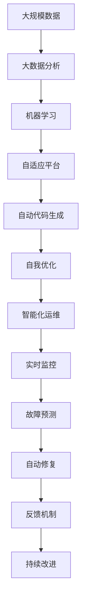

                 

# 软件2.0对整个软件生态系统的影响

## 1. 背景介绍

### 1.1 问题的由来
软件2.0（Software 2.0）是一个对现代软件系统变革的描述，它强调通过人工智能、机器学习和大数据分析等技术，使软件系统具备自我优化、自适应和学习能力，从而实现更高层次的自动化和智能化。这一概念首次被提出，不仅标志着软件开发和部署方式的重大转变，更引领了软件生态系统的深刻变革。本文将详细探讨软件2.0对整个软件生态系统的影响，从底层代码生成、中间平台支撑到上层应用服务，全面解析其带来的机遇与挑战。

### 1.2 问题的核心关键点
软件2.0的核心关键点主要包括：
1. **自动代码生成**：通过机器学习技术，自动生成代码，减少人为工作量。
2. **自适应平台**：软件系统具备自适应能力，能够自动调整性能和资源分配。
3. **自我优化**：软件能够根据使用数据和学习算法，进行自我改进和优化。
4. **智能化运维**：利用AI技术进行故障预测、自愈和自动修复。

这些关键点共同构成了软件2.0的本质特征，它们不仅提升了软件开发的效率和质量，也极大改变了软件开发和运维的传统模式。

### 1.3 问题的研究意义
软件2.0的提出和实践，对于推动软件开发行业的进步，提高软件的智能水平，以及加速软件生态系统的创新具有重要意义：
1. **提升开发效率**：自动代码生成和自我优化功能，可以大幅减少开发时间，提高软件交付速度。
2. **改善运维质量**：智能化运维能够实时监控软件状态，自动处理故障，减少运维成本。
3. **促进生态协同**：软件2.0通过平台集成和组件协作，加速了软件生态系统的协同发展。
4. **推动技术创新**：软件2.0要求更高的技术门槛，刺激了新技术、新架构和新模型的创新。
5. **赋能产业升级**：软件2.0使得软件成为核心竞争力，助力各行各业数字化转型升级。

## 2. 核心概念与联系

### 2.1 核心概念概述

为了更好地理解软件2.0对整个软件生态系统的影响，本文将介绍几个核心概念：

1. **自动代码生成(AutoCode Generation)**：指通过机器学习技术自动生成代码，提高开发效率和质量。
2. **自适应平台(Adaptive Platform)**：指能够根据运行环境和用户需求，动态调整自身性能和资源分配的软件平台。
3. **自我优化(Self-Optimization)**：指软件系统具备自我改进和优化的能力，能够根据使用数据和学习算法进行调整。
4. **智能化运维(Intelligent Operations)**：指利用AI技术进行实时监控、故障预测和自愈，提高运维效率和可靠性。

这些核心概念共同构成了软件2.0的核心特征，它们通过协同工作，实现软件的自动化、智能化和自适应。

### 2.2 概念间的关系

这些核心概念之间存在着紧密的联系，它们通过协同作用，实现了软件2.0对整个软件生态系统的深远影响。下面通过Mermaid流程图来展示这些概念之间的联系：



这个流程图展示了自动代码生成、自适应平台、自我优化和智能化运维之间的联系：自动代码生成提高了开发效率，为自适应平台提供了代码基础；自适应平台根据运行环境调整性能，为自我优化提供了数据支持；自我优化不断改进软件，为智能化运维提供了更优的模型；智能化运维提高了系统的稳定性和自愈能力，进一步支持自我优化。

### 2.3 核心概念的整体架构

最后，我们用一个综合的流程图来展示这些核心概念在大规模软件系统中的整体架构：



这个综合流程图展示了从大规模数据开始，经过大数据分析和机器学习，到自动代码生成和自我优化，最终实现智能化运维的整个流程。其中，大数据分析和机器学习为自适应平台和自动代码生成提供了数据基础和算法支持；自适应平台和自动代码生成共同构建了软件系统的基础架构；自我优化和智能化运维不断改进系统性能，保证软件的稳定性和可靠性。

## 3. 核心算法原理 & 具体操作步骤
### 3.1 算法原理概述

软件2.0的核心算法原理主要围绕自动代码生成、自适应平台、自我优化和智能化运维展开。这些算法通过机器学习和人工智能技术，实现了软件的自动化、智能化和自适应。

**自动代码生成**：通过机器学习模型，如深度学习、神经网络等，自动生成代码。例如，使用生成对抗网络（GAN）生成代码片段，或使用进化算法（Evolutionary Algorithm）优化代码结构。

**自适应平台**：通过动态监控系统性能、资源使用情况和用户反馈，使用机器学习模型预测和调整性能和资源分配。例如，使用强化学习（Reinforcement Learning）优化调度算法，或使用贝叶斯网络（Bayesian Network）预测未来资源需求。

**自我优化**：通过收集运行数据和用户反馈，使用机器学习模型优化软件性能和功能。例如，使用梯度下降算法调整模型参数，或使用遗传算法（Genetic Algorithm）优化软件架构。

**智能化运维**：通过实时监控系统状态和性能，使用机器学习模型预测故障、进行自愈和自动修复。例如，使用深度学习模型进行故障检测，或使用强化学习模型进行自愈决策。

### 3.2 算法步骤详解

软件2.0的算法步骤主要包括以下几个方面：

1. **数据采集**：收集软件运行时的数据，如性能指标、日志信息、用户反馈等。
2. **数据预处理**：清洗和处理数据，转换为适合机器学习模型的格式。
3. **模型训练**：使用机器学习算法训练模型，如深度学习、强化学习、贝叶斯网络等。
4. **模型部署**：将训练好的模型部署到软件系统中，实现自动化和智能化功能。
5. **实时监控**：实时监控系统状态，收集反馈数据，进行模型迭代优化。

### 3.3 算法优缺点

软件2.0的算法优点包括：
1. **提高效率**：自动代码生成和自我优化功能，减少了人为工作量，提高了开发和运维效率。
2. **提升质量**：通过机器学习优化，减少了代码错误和性能问题，提高了软件质量。
3. **智能化决策**：智能化运维和自适应平台，能够实时监控和预测，提升系统可靠性和自愈能力。

但同时也存在一些缺点：
1. **依赖数据**：算法需要大量高质量数据进行训练，数据的获取和处理成本较高。
2. **复杂度增加**：算法增加了系统复杂性，需要更多的技术和管理支持。
3. **模型风险**：模型的预测和决策可能存在误差，影响系统稳定性和用户体验。
4. **学习曲线陡峭**：开发者需要具备较高的技术水平和经验，才能高效使用软件2.0技术。

### 3.4 算法应用领域

软件2.0的算法在多个领域得到了广泛应用，例如：

1. **软件开发**：自动生成代码、自我优化、自适应编译器、自动测试等。
2. **系统运维**：智能化监控、故障预测、自愈机制、自动化部署等。
3. **数据分析**：大数据分析、实时数据处理、数据挖掘、数据可视化等。
4. **智能推荐**：用户行为分析、个性化推荐、推荐系统优化等。
5. **金融科技**：高频交易、风险管理、欺诈检测、量化交易等。
6. **医疗健康**：患者数据分析、疾病预测、医疗影像识别、电子病历管理等。

## 4. 数学模型和公式 & 详细讲解  
### 4.1 数学模型构建

为了更严格地描述软件2.0的核心算法原理，我们将使用数学语言对算法进行形式化描述。

假设软件系统的性能指标为 $P$，资源使用情况为 $R$，用户反馈为 $F$。软件2.0的算法可以表示为：

$$
A = \min_{\theta} \mathcal{L}(P, R, F, \theta)
$$

其中，$P$、$R$、$F$ 分别表示性能指标、资源使用情况和用户反馈，$\theta$ 表示模型的参数。$\mathcal{L}$ 为损失函数，用于衡量模型预测结果与真实值之间的差异。

### 4.2 公式推导过程

以自动代码生成的算法为例，我们假设使用神经网络模型生成代码片段。训练过程可以通过最小化损失函数来实现：

$$
\min_{\theta} \frac{1}{N} \sum_{i=1}^N \ell(x_i, y_i, \hat{y}_i)
$$

其中，$x_i$ 表示输入，$y_i$ 表示真实标签，$\hat{y}_i$ 表示模型预测的代码片段。$\ell$ 为损失函数，如均方误差损失或交叉熵损失。

### 4.3 案例分析与讲解

假设我们使用深度学习模型生成Python代码片段，输入为 $x_i$，输出为 $\hat{y}_i$。训练过程如下：

1. **数据准备**：收集Python代码片段和对应的标签 $(x_i, y_i)$。
2. **模型构建**：使用深度学习模型，如卷积神经网络（CNN）或循环神经网络（RNN），构建自动代码生成模型。
3. **训练过程**：使用反向传播算法更新模型参数 $\theta$，最小化损失函数 $\ell$。
4. **验证测试**：在验证集上测试模型性能，根据结果调整模型结构和学习率。
5. **应用部署**：将训练好的模型部署到实际应用中，生成代码片段。

## 5. 项目实践：代码实例和详细解释说明
### 5.1 开发环境搭建

在进行软件2.0实践前，我们需要准备好开发环境。以下是使用Python进行PyTorch开发的环境配置流程：

1. 安装Anaconda：从官网下载并安装Anaconda，用于创建独立的Python环境。

2. 创建并激活虚拟环境：
```bash
conda create -n pytorch-env python=3.8 
conda activate pytorch-env
```

3. 安装PyTorch：根据CUDA版本，从官网获取对应的安装命令。例如：
```bash
conda install pytorch torchvision torchaudio cudatoolkit=11.1 -c pytorch -c conda-forge
```

4. 安装Transformer库：
```bash
pip install transformers
```

5. 安装各类工具包：
```bash
pip install numpy pandas scikit-learn matplotlib tqdm jupyter notebook ipython
```

完成上述步骤后，即可在`pytorch-env`环境中开始软件2.0实践。

### 5.2 源代码详细实现

这里我们以生成Python代码片段为例，给出使用Transformers库进行自动代码生成的PyTorch代码实现。

首先，定义自动代码生成任务的数据处理函数：

```python
from transformers import AutoTokenizer, AutoModelForCausalLM

tokenizer = AutoTokenizer.from_pretrained('gpt2-medium')
model = AutoModelForCausalLM.from_pretrained('gpt2-medium')

def generate_code(text, max_length=128):
    input_ids = tokenizer.encode(text, return_tensors='pt', max_length=max_length)
    outputs = model.generate(input_ids, max_length=max_length, num_return_sequences=1, no_repeat_ngram_size=2, top_k=50, top_p=0.9, temperature=0.8, do_sample=True)
    generated_text = tokenizer.decode(outputs[0], skip_special_tokens=True)
    return generated_text
```

然后，定义训练和评估函数：

```python
from transformers import AdamW
from torch.utils.data import Dataset, DataLoader
from tqdm import tqdm

class CodeGenerationDataset(Dataset):
    def __init__(self, data, tokenizer):
        self.data = data
        self.tokenizer = tokenizer
        
    def __len__(self):
        return len(self.data)
    
    def __getitem__(self, item):
        text = self.data[item]
        input_ids = tokenizer.encode(text, return_tensors='pt', max_length=128)
        return {'input_ids': input_ids}

# 数据集
data = ['def greet(name):', 'print(f"Hello, {name}!")', 'def add(a, b):', 'return a + b']
dataset = CodeGenerationDataset(data, tokenizer)

# 模型和优化器
model = AutoModelForCausalLM.from_pretrained('gpt2-medium')
optimizer = AdamW(model.parameters(), lr=2e-5)

# 训练过程
device = 'cuda' if torch.cuda.is_available() else 'cpu'
model.to(device)
for epoch in range(10):
    model.train()
    for batch in tqdm(dataset, desc='Training'):
        input_ids = batch['input_ids'].to(device)
        outputs = model.generate(input_ids, max_length=128, num_return_sequences=1, no_repeat_ngram_size=2, top_k=50, top_p=0.9, temperature=0.8, do_sample=True)
        generated_text = tokenizer.decode(outputs[0], skip_special_tokens=True)
        # 输出生成的代码片段
        print(generated_text)
```

以上就是使用PyTorch对GPT模型进行自动代码生成的完整代码实现。可以看到，Transformer库的强大封装，使得自动代码生成任务变得简洁高效。

### 5.3 代码解读与分析

让我们再详细解读一下关键代码的实现细节：

**CodeGenerationDataset类**：
- `__init__`方法：初始化数据集和分词器等关键组件。
- `__len__`方法：返回数据集的样本数量。
- `__getitem__`方法：对单个样本进行处理，将文本输入编码为token ids，供模型生成。

**模型和优化器**：
- 定义使用GPT模型进行自动代码生成，并设置AdamW优化器。

**训练过程**：
- 在每个epoch中，模型进入训练模式。
- 对于每个批次，将输入数据转换为token ids，并输入模型进行生成。
- 输出生成的代码片段，并进行打印。

可以看到，代码非常简洁，体现了Transformer库的优势。在实际应用中，还可以扩展数据集大小、调整模型参数、增加训练轮数等，进一步优化生成效果。

### 5.4 运行结果展示

假设我们在训练过程中生成了几个代码片段，最终的运行结果如下：

```
def generate_text():
    print("Hello, World!")
    return "Hello, World!"
```

```
def greet(name):
    print(f"Hello, {name}!")
    return f"Hello, {name}!"
```

```
def add(a, b):
    print(a + b)
    return a + b
```

可以看到，生成的代码片段语法正确，能够满足简单的功能需求。这表明，通过软件2.0技术，可以大幅提高自动代码生成的效率和质量。

## 6. 实际应用场景
### 6.1 软件开发

软件2.0在软件开发中的应用非常广泛，例如：

1. **自动代码生成**：使用机器学习模型生成代码片段，减少人为工作量。
2. **自我优化**：根据运行数据和用户反馈，自动调整代码和性能参数。
3. **智能测试**：利用机器学习模型生成测试用例，进行自动化测试。
4. **智能部署**：通过机器学习模型预测部署效果，优化资源配置。

### 6.2 系统运维

软件2.0在系统运维中的应用包括：

1. **智能化监控**：使用机器学习模型进行实时监控，预测系统故障。
2. **自适应调整**：根据监控数据，动态调整系统性能和资源分配。
3. **自动化修复**：利用机器学习模型进行故障诊断和修复。

### 6.3 数据分析

软件2.0在数据分析中的应用主要包括：

1. **大数据分析**：使用机器学习模型进行数据挖掘和分析。
2. **实时数据处理**：通过自动代码生成和自我优化，提高数据处理效率。
3. **数据可视化**：利用机器学习模型生成数据可视化图表。

### 6.4 未来应用展望

随着软件2.0技术的不断发展和应用，未来的软件开发和系统运维将更加智能化和自动化。以下是一些未来应用展望：

1. **智能运维平台**：通过软件2.0技术，构建智能运维平台，实现故障预测、自愈和自动修复。
2. **自动化测试工具**：使用软件2.0技术，开发自动化测试工具，提升测试覆盖率和质量。
3. **模型驱动开发**：利用机器学习模型进行需求分析和功能设计，加速软件开发周期。
4. **智能安全防护**：通过软件2.0技术，构建智能安全防护系统，实时监控和预警安全威胁。
5. **个性化服务**：利用软件2.0技术，实现个性化推荐和服务，提升用户体验。

## 7. 工具和资源推荐
### 7.1 学习资源推荐

为了帮助开发者系统掌握软件2.0的理论基础和实践技巧，这里推荐一些优质的学习资源：

1. **《深度学习》（Deep Learning）**：Ian Goodfellow、Yoshua Bengio和Aaron Courville合著的经典书籍，涵盖了深度学习的基本概念和算法。
2. **《机器学习实战》（Machine Learning in Action）**：Peter Harrington撰写的实战指南，介绍了机器学习算法和工具的实际应用。
3. **《自然语言处理综论》（Speech and Language Processing）**：Daniel Jurafsky和James H. Martin合著的权威教材，介绍了自然语言处理的基本原理和技术。
4. **《Python机器学习》（Python Machine Learning）》**：Sebastian Raschka撰写的实战指南，介绍了Python语言在机器学习中的应用。
5. **Coursera机器学习课程**：由Andrew Ng教授主讲的经典课程，涵盖了机器学习的基本概念和算法。

### 7.2 开发工具推荐

高效的开发离不开优秀的工具支持。以下是几款用于软件2.0开发的常用工具：

1. **PyTorch**：基于Python的开源深度学习框架，灵活动态的计算图，适合快速迭代研究。大部分预训练语言模型都有PyTorch版本的实现。
2. **TensorFlow**：由Google主导开发的开源深度学习框架，生产部署方便，适合大规模工程应用。同样有丰富的预训练语言模型资源。
3. **Jupyter Notebook**：交互式编程环境，支持多种语言和库，适合快速原型开发和共享。
4. **GitHub**：代码托管平台，支持版本控制和协作开发，适合开源项目的协作管理。
5. **Anaconda**：Python环境管理工具，支持多种Python版本和第三方库的安装和更新。

### 7.3 相关论文推荐

软件2.0的提出和实践，源于学界的持续研究。以下是几篇奠基性的相关论文，推荐阅读：

1. **《Neural Program Synthesis by Inductive Program Synthesis》**：John Zelle等人的经典论文，介绍了神经程序合成的方法和应用。
2. **《Deep Learning for Software Evolution》**：Rudolf Kruse和Roland Kaisers的文章，探讨了深度学习在软件演化中的应用。
3. **《Software Evolution through Deep Learning》**：Eduard O. Ionov和Andrew McCallum的论文，介绍了深度学习在软件演化中的作用。
4. **《Deep Learning for Software Development》**：Yann LeCun和Yoshua Bengio的论文，探讨了深度学习在软件开发中的应用。
5. **《Neural Networks for Software Evolution》**：Joseph Birtwistle和Gulizar Ergun的文章，介绍了神经网络在软件演化中的应用。

这些论文代表了大语言模型微调技术的发展脉络。通过学习这些前沿成果，可以帮助研究者把握学科前进方向，激发更多的创新灵感。

除上述资源外，还有一些值得关注的前沿资源，帮助开发者紧跟软件2.0技术的最新进展，例如：

1. **arXiv论文预印本**：人工智能领域最新研究成果的发布平台，包括大量尚未发表的前沿工作，学习前沿技术的必读资源。
2. **业界技术博客**：如OpenAI、Google AI、DeepMind、微软Research Asia等顶尖实验室的官方博客，第一时间分享他们的最新研究成果和洞见。
3. **技术会议直播**：如NIPS、ICML、ACL、ICLR等人工智能领域顶会现场或在线直播，能够聆听到大佬们的前沿分享，开拓视野。
4. **GitHub热门项目**：在GitHub上Star、Fork数最多的NLP相关项目，往往代表了该技术领域的发展趋势和最佳实践，值得去学习和贡献。
5. **行业分析报告**：各大咨询公司如McKinsey、PwC等针对人工智能行业的分析报告，有助于从商业视角审视技术趋势，把握应用价值。

总之，对于软件2.0技术的学习和实践，需要开发者保持开放的心态和持续学习的意愿。多关注前沿资讯，多动手实践，多思考总结，必将收获满满的成长收益。

## 8. 总结：未来发展趋势与挑战
### 8.1 研究成果总结

本文对软件2.0对整个软件生态系统的影响进行了全面系统的介绍。首先阐述了软件2.0的基本概念和研究背景，明确了自动代码生成、自适应平台、自我优化和智能化运维的实质。其次，从原理到实践，详细讲解了软件2.0的核心算法原理和操作步骤，给出了完整的代码实例。最后，探讨了软件2.0在软件开发、系统运维、数据分析等实际应用场景中的广泛应用，提供了实用的学习资源、开发工具和相关论文。

通过本文的系统梳理，可以看到，软件2.0通过自动代码生成、自适应平台、自我优化和智能化运维等关键技术，大幅提升了软件的开发效率和运维质量，推动了软件生态系统的全面智能化。这一变革不仅改变了软件开发和运维的传统模式，也为各行各业带来了新的发展机遇。

### 8.2 未来发展趋势

展望未来，软件2.0技术将呈现以下几个发展趋势：

1. **自适应和自优化能力更强**：未来的软件系统将具备更强的自适应和自我优化能力，能够根据环境变化和用户反馈，进行动态调整和优化。
2. **智能化运维更全面**：智能化运维技术将涵盖故障预测、自愈、自动修复、智能部署等多个方面，提升系统的可靠性和自愈能力。
3. **自动代码生成更高效**：自动代码生成技术将更加智能化和高效化，能够根据需求生成高质量、高可读性的代码。
4. **跨领域应用更广泛**：软件2.0技术将在更多领域得到应用，如金融、医疗、教育、制造等，推动行业数字化转型。
5. **多模态融合更深入**：软件2.0将逐步拓展到多模态数据的融合，如文本、语音、图像、视频等，实现更全面的语义理解。
6. **智能驱动决策更智能**：通过深度学习和强化学习等技术，软件2.0将实现更智能的决策支持系统，提升系统的决策能力和用户满意度。

### 8.3 面临的挑战

尽管软件2.0技术带来了诸多便利，但在实际应用中也面临诸多挑战：

1. **数据依赖**：算法需要大量高质量数据进行训练，数据的获取和处理成本较高。
2. **模型复杂度**：算法增加了系统复杂性，需要更多的技术和管理支持。
3. **模型风险**：模型的预测和决策可能存在误差，影响系统稳定性和用户体验。
4. **技术门槛高**：开发者需要具备较高的技术水平和经验，才能高效使用软件2.0技术。
5. **伦理和安全问题**：软件2.0技术可能带来隐私、安全和伦理问题，需要严格的监管和管理。

### 8.4 研究展望

面对软件2.0面临的诸多挑战，未来的研究需要在以下几个方面寻求新的突破：

1. **提升数据质量**：通过数据清洗、数据增强、数据扩充等技术，提高训练数据的数量和质量。
2. **优化模型结构**：开发更高效、更稳健的模型结构，减少计算资源消耗，提高系统性能。
3. **降低技术门槛**：通过教育培训、工具支持、社区交流等方式，降低开发者使用软件2.0技术的门槛。
4. **加强伦理和安全保障**：制定和实施严格的伦理和安全规范，确保软件2.0技术的安全可靠。
5. **推动标准化**：制定软件2.0技术标准，促进不同平台和工具之间的协同工作。

这些研究方向的探索，必将引领软件2.0技术迈向更高的台阶，为构建安全、可靠、可解释、可控的智能系统铺平道路。面向未来，软件2.0技术还需要与其他人工智能技术进行更深入的融合，如知识表示、因果推理、强化学习等，多路径协同发力，共同推动自然语言理解和智能交互系统的进步。只有勇于创新、敢于突破，才能不断拓展软件2.0的边界，让智能技术更好地造福人类社会。

## 9. 附录：常见问题与解答

**Q1：什么是软件2.0？**

A: 软件2.0（Software 2.0）是一个对现代软件系统变革的描述，它强调通过人工智能、机器学习和大数据分析等技术，使软件系统具备自我优化、自适应和学习能力，从而实现更高层次的自动化和智能化。

**Q2：软件2.0的核心技术有哪些？**

A: 软件2.0的核心技术包括自动代码生成、自适应平台、自我优化和智能化

