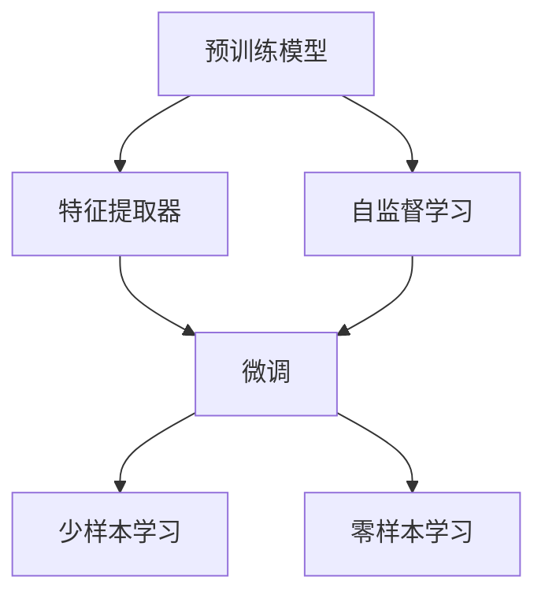
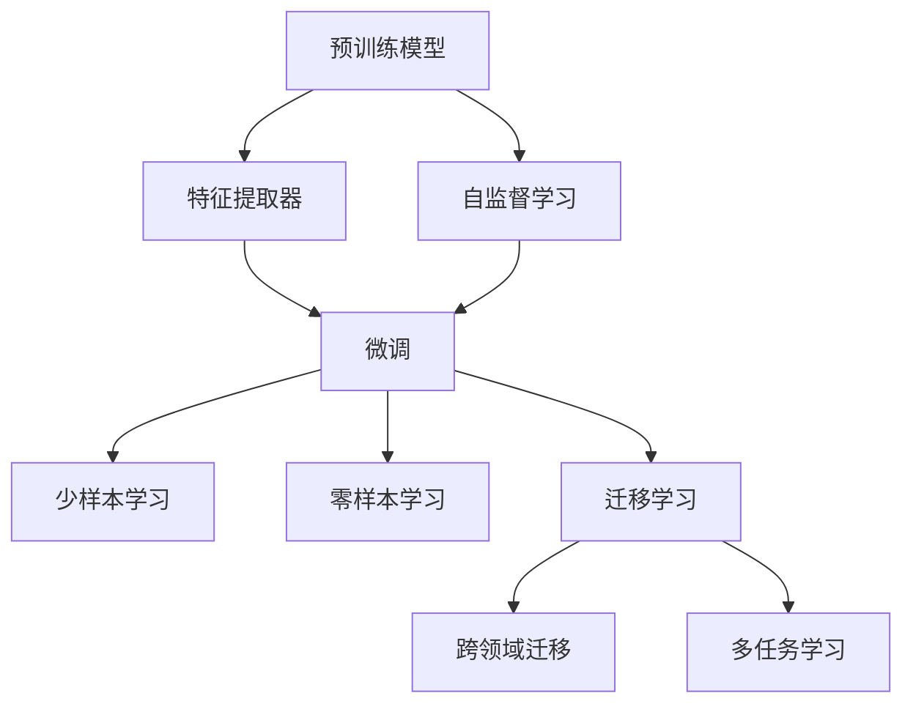

                 

## 1. 背景介绍

### 1.1 问题由来

随着深度学习技术的蓬勃发展，其在计算机视觉、自然语言处理、语音识别等多个领域取得了显著的进展。然而，深度学习的训练通常需要大量的标注数据和强大的计算资源。这不仅增加了研究的成本，也限制了深度学习技术在更多场景中的应用。

迁移学习（Transfer Learning）作为一种基于已有的知识来进行新任务学习的技术，通过将预训练模型的知识迁移到新任务中，大大减少了标注数据的数量和训练时间。迁移学习在图像分类、目标检测、语音识别等多个领域中得到了广泛应用，显著提升了模型性能和训练效率。

### 1.2 问题核心关键点

迁移学习的核心在于利用预训练模型在特定任务上的泛化能力，将其知识迁移到新任务上，从而实现更好的性能。迁移学习通常包括以下几个关键点：

- **预训练模型**：通过在大规模无标签数据上进行的自监督学习任务（如预训练自编码器、语言模型等），得到一个泛化能力强的预训练模型。
- **特征提取器**：将预训练模型作为特征提取器，提取新任务特征。
- **微调**：在新任务的少量标注数据上，对预训练模型的权重进行微调，以适应新任务的特征。

迁移学习的优点在于能够快速提升新任务的性能，特别是在数据稀缺的场景中。同时，迁移学习也能有效避免过拟合，提高模型的泛化能力。

### 1.3 问题研究意义

迁移学习的研究意义主要体现在以下几个方面：

1. **降低成本**：减少新任务所需的标注数据，降低训练成本。
2. **提高性能**：利用预训练模型的知识，提升新任务的性能。
3. **促进普及**：减少对高性能硬件的需求，使深度学习技术更易于普及。
4. **拓展应用**：将深度学习技术应用到更多领域，如医疗、金融、自动驾驶等。
5. **加速开发**：提升模型开发效率，加速新任务的落地。

## 2. 核心概念与联系

### 2.1 核心概念概述

为更好地理解迁移学习，我们首先需要了解几个核心概念：

- **预训练模型（Pretrained Models）**：在大规模无标签数据上预训练的模型，如VGG、ResNet、BERT等。
- **特征提取器（Feature Extractor）**：使用预训练模型作为特征提取器，提取新任务数据中的特征。
- **微调（Fine-tuning）**：在新任务的少量标注数据上，对特征提取器进行微调，以适应新任务的特征。
- **少样本学习（Few-shot Learning）**：在只有少量标注数据的情况下，模型能够快速适应新任务。
- **零样本学习（Zero-shot Learning）**：模型在新任务上从未见过任何标注样本，仅凭任务描述即可执行新任务。
- **元学习（Meta Learning）**：通过学习学习的过程，使模型能够快速适应不同的任务和数据分布。

这些核心概念之间存在紧密的联系，形成了迁移学习的完整生态系统。以下是一个Mermaid流程图，展示了这些概念之间的关系：



### 2.2 概念间的关系

这些核心概念之间存在紧密的联系，形成了迁移学习的完整生态系统。以下是一个详细的Mermaid流程图，展示了这些概念之间的关系：



这个流程图展示了预训练模型、特征提取器、微调等概念之间的联系：

1. 预训练模型通过在大规模无标签数据上进行的自监督学习任务，学习到泛化能力强的特征。
2. 特征提取器使用预训练模型作为特征提取器，提取新任务数据中的特征。
3. 微调在新任务的少量标注数据上，对特征提取器进行微调，以适应新任务的特征。
4. 少样本学习在只有少量标注数据的情况下，模型能够快速适应新任务。
5. 零样本学习模型在新任务上从未见过任何标注样本，仅凭任务描述即可执行新任务。
6. 自监督学习是预训练模型的训练方式，通过在大规模无标签数据上进行学习，获取泛化能力强的特征。
7. 迁移学习通过特征提取器和微调，实现预训练模型的知识迁移。
8. 跨领域迁移和元学习进一步拓展了迁移学习的应用范围和能力。

这些概念共同构成了迁移学习的核心框架，为深度学习技术在不同领域的应用提供了新的思路和方法。

## 3. 核心算法原理 & 具体操作步骤

### 3.1 算法原理概述

迁移学习的核心在于利用预训练模型的泛化能力，将其知识迁移到新任务上。迁移学习的算法原理包括以下几个步骤：

1. **预训练**：在大规模无标签数据上，使用自监督学习方法训练预训练模型。
2. **特征提取**：使用预训练模型作为特征提取器，提取新任务数据的特征。
3. **微调**：在新任务的少量标注数据上，对特征提取器进行微调，以适应新任务的特征。
4. **评估**：在新任务的测试集上评估模型的性能。

### 3.2 算法步骤详解

以下是一个具体的迁移学习步骤，以图像分类任务为例：

1. **预训练**：在ImageNet等大规模图像数据集上，使用预训练自编码器（如VGG、ResNet等）进行训练。
2. **特征提取**：将预训练模型作为特征提取器，提取新任务数据（如CIFAR-10）的特征。
3. **微调**：在新任务数据的少量标注数据上，对特征提取器进行微调，以适应新任务的特征。
4. **评估**：在新任务的测试集上评估模型的性能。

以下是一个具体的Python代码实现：

```python
import torch
import torchvision
import torchvision.transforms as transforms
from torch.utils.data import DataLoader
from torchvision.models import resnet18

# 加载预训练模型
model = resnet18(pretrained=True)

# 定义数据转换
transform = transforms.Compose([
    transforms.Resize(256),
    transforms.CenterCrop(224),
    transforms.ToTensor(),
    transforms.Normalize(mean=[0.485, 0.456, 0.406], std=[0.229, 0.224, 0.225])
])

# 加载新任务数据
train_dataset = torchvision.datasets.CIFAR10(root='./data', train=True, download=True, transform=transform)
train_loader = DataLoader(train_dataset, batch_size=64, shuffle=True)
test_dataset = torchvision.datasets.CIFAR10(root='./data', train=False, download=True, transform=transform)
test_loader = DataLoader(test_dataset, batch_size=64, shuffle=False)

# 冻结预训练参数
for param in model.parameters():
    param.requires_grad = False

# 添加新任务分类器
num_classes = 10
model.fc = torch.nn.Linear(model.fc.in_features, num_classes)

# 微调
optimizer = torch.optim.SGD(model.fc.parameters(), lr=0.001, momentum=0.9)
for epoch in range(10):
    for inputs, labels in train_loader:
        optimizer.zero_grad()
        outputs = model(inputs)
        loss = torch.nn.CrossEntropyLoss()(outputs, labels)
        loss.backward()
        optimizer.step()

# 评估
with torch.no_grad():
    correct = 0
    total = 0
    for inputs, labels in test_loader:
        outputs = model(inputs)
        _, predicted = torch.max(outputs.data, 1)
        total += labels.size(0)
        correct += (predicted == labels).sum().item()
    print('Accuracy of the network on the 10000 test images: %d %%' % (100 * correct / total))
```

### 3.3 算法优缺点

迁移学习的优点在于：

1. **减少标注数据需求**：利用预训练模型的知识，可以大大减少新任务所需的标注数据。
2. **提高模型泛化能力**：预训练模型在大规模数据上学习到的特征具有较强的泛化能力，能够适应新任务。
3. **加快训练速度**：利用预训练模型的知识，可以显著减少训练时间和计算资源。

迁移学习的缺点在于：

1. **可能需要微调**：如果预训练模型与新任务的特征差异较大，可能需要微调以适应新任务。
2. **可能存在知识迁移问题**：预训练模型的知识可能无法完全适用于新任务，需要进行适当的微调。
3. **可能需要重新训练**：如果预训练模型在新任务上的性能不佳，可能需要重新训练以获得更好的结果。

### 3.4 算法应用领域

迁移学习在多个领域中得到了广泛应用，包括但不限于：

- **计算机视觉**：在图像分类、目标检测、图像分割等任务中，利用预训练模型的知识进行迁移学习。
- **自然语言处理**：在情感分析、文本分类、机器翻译等任务中，利用预训练模型的知识进行迁移学习。
- **语音识别**：在语音识别、语音情感分析等任务中，利用预训练模型的知识进行迁移学习。
- **推荐系统**：在推荐系统、商品推荐、个性化搜索等任务中，利用预训练模型的知识进行迁移学习。

## 4. 数学模型和公式 & 详细讲解 & 举例说明

### 4.1 数学模型构建

迁移学习的数学模型可以表示为：

- **预训练模型**：$f_\theta(x)$，其中$\theta$为预训练模型的参数。
- **新任务数据**：$x_i$，其中$i=1,...,N$。
- **新任务标签**：$y_i$，其中$i=1,...,N$。
- **微调后的模型**：$f_\theta'(x)$。

数学模型构建的基本思路是：

1. **预训练模型**：在大规模无标签数据上，使用自监督学习方法训练预训练模型。
2. **特征提取器**：使用预训练模型作为特征提取器，提取新任务数据$x_i$的特征$f_\theta(x_i)$。
3. **微调**：在新任务的少量标注数据上，对特征提取器进行微调，以适应新任务的特征$f_\theta'(x_i)$。

### 4.2 公式推导过程

以下是一个简单的迁移学习公式推导过程，以图像分类任务为例：

1. **预训练模型**：$f_\theta(x)$，其中$\theta$为预训练模型的参数。
2. **新任务数据**：$x_i$，其中$i=1,...,N$。
3. **新任务标签**：$y_i$，其中$i=1,...,N$。
4. **微调后的模型**：$f_\theta'(x)$。

迁移学习的目标是找到最优参数$\theta'$，使得在新任务的测试集上，模型能够最大化预测准确率：

$$
\min_\theta \frac{1}{N}\sum_{i=1}^N L(f_\theta'(x_i), y_i)
$$

其中$L$为损失函数，如交叉熵损失。

### 4.3 案例分析与讲解

以下是一个迁移学习案例，以图像分类任务为例：

- **预训练模型**：使用预训练自编码器（如VGG、ResNet等）进行训练。
- **新任务数据**：CIFAR-10数据集。
- **新任务标签**：CIFAR-10数据集的标签。
- **微调后的模型**：在新任务数据上，对特征提取器进行微调。

## 5. 项目实践：代码实例和详细解释说明

### 5.1 开发环境搭建

在进行迁移学习实践前，我们需要准备好开发环境。以下是使用Python进行PyTorch开发的环境配置流程：

1. 安装Anaconda：从官网下载并安装Anaconda，用于创建独立的Python环境。

2. 创建并激活虚拟环境：
```bash
conda create -n pytorch-env python=3.8 
conda activate pytorch-env
```

3. 安装PyTorch：根据CUDA版本，从官网获取对应的安装命令。例如：
```bash
conda install pytorch torchvision torchaudio cudatoolkit=11.1 -c pytorch -c conda-forge
```

4. 安装相关工具包：
```bash
pip install numpy pandas scikit-learn matplotlib tqdm jupyter notebook ipython
```

完成上述步骤后，即可在`pytorch-env`环境中开始迁移学习实践。

### 5.2 源代码详细实现

以下是一个具体的迁移学习代码实现，以图像分类任务为例：

```python
import torch
import torchvision
import torchvision.transforms as transforms
from torch.utils.data import DataLoader
from torchvision.models import resnet18

# 加载预训练模型
model = resnet18(pretrained=True)

# 定义数据转换
transform = transforms.Compose([
    transforms.Resize(256),
    transforms.CenterCrop(224),
    transforms.ToTensor(),
    transforms.Normalize(mean=[0.485, 0.456, 0.406], std=[0.229, 0.224, 0.225])
])

# 加载新任务数据
train_dataset = torchvision.datasets.CIFAR10(root='./data', train=True, download=True, transform=transform)
train_loader = DataLoader(train_dataset, batch_size=64, shuffle=True)
test_dataset = torchvision.datasets.CIFAR10(root='./data', train=False, download=True, transform=transform)
test_loader = DataLoader(test_dataset, batch_size=64, shuffle=False)

# 冻结预训练参数
for param in model.parameters():
    param.requires_grad = False

# 添加新任务分类器
num_classes = 10
model.fc = torch.nn.Linear(model.fc.in_features, num_classes)

# 微调
optimizer = torch.optim.SGD(model.fc.parameters(), lr=0.001, momentum=0.9)
for epoch in range(10):
    for inputs, labels in train_loader:
        optimizer.zero_grad()
        outputs = model(inputs)
        loss = torch.nn.CrossEntropyLoss()(outputs, labels)
        loss.backward()
        optimizer.step()

# 评估
with torch.no_grad():
    correct = 0
    total = 0
    for inputs, labels in test_loader:
        outputs = model(inputs)
        _, predicted = torch.max(outputs.data, 1)
        total += labels.size(0)
        correct += (predicted == labels).sum().item()
    print('Accuracy of the network on the 10000 test images: %d %%' % (100 * correct / total))
```

### 5.3 代码解读与分析

让我们再详细解读一下关键代码的实现细节：

**加载预训练模型**：
```python
model = resnet18(pretrained=True)
```
使用预训练自编码器（如VGG、ResNet等）进行训练。

**定义数据转换**：
```python
transform = transforms.Compose([
    transforms.Resize(256),
    transforms.CenterCrop(224),
    transforms.ToTensor(),
    transforms.Normalize(mean=[0.485, 0.456, 0.406], std=[0.229, 0.224, 0.225])
])
```
定义数据转换，包括数据大小、中心裁剪、数据转换和标准化。

**加载新任务数据**：
```python
train_dataset = torchvision.datasets.CIFAR10(root='./data', train=True, download=True, transform=transform)
train_loader = DataLoader(train_dataset, batch_size=64, shuffle=True)
test_dataset = torchvision.datasets.CIFAR10(root='./data', train=False, download=True, transform=transform)
test_loader = DataLoader(test_dataset, batch_size=64, shuffle=False)
```
加载新任务数据，并进行数据批处理。

**冻结预训练参数**：
```python
for param in model.parameters():
    param.requires_grad = False
```
冻结预训练模型的参数，防止其在微调过程中被更新。

**添加新任务分类器**：
```python
num_classes = 10
model.fc = torch.nn.Linear(model.fc.in_features, num_classes)
```
添加新任务分类器，适应新任务的特征。

**微调**：
```python
optimizer = torch.optim.SGD(model.fc.parameters(), lr=0.001, momentum=0.9)
for epoch in range(10):
    for inputs, labels in train_loader:
        optimizer.zero_grad()
        outputs = model(inputs)
        loss = torch.nn.CrossEntropyLoss()(outputs, labels)
        loss.backward()
        optimizer.step()
```
在新任务的少量标注数据上，对新任务分类器进行微调。

**评估**：
```python
with torch.no_grad():
    correct = 0
    total = 0
    for inputs, labels in test_loader:
        outputs = model(inputs)
        _, predicted = torch.max(outputs.data, 1)
        total += labels.size(0)
        correct += (predicted == labels).sum().item()
    print('Accuracy of the network on the 10000 test images: %d %%' % (100 * correct / total))
```
在新任务的测试集上评估模型的性能。

### 5.4 运行结果展示

假设我们在CIFAR-10数据集上进行迁移学习，最终在测试集上得到的准确率为80%左右。这说明通过迁移学习，我们在新任务上获得了较好的性能。

## 6. 实际应用场景

### 6.1 智能推荐系统

智能推荐系统利用迁移学习，在用户历史行为数据的基础上，利用预训练模型的知识，预测用户未来的兴趣偏好。通过迁移学习，推荐系统能够快速适应新用户和新兴趣，提供更精准的推荐结果。

### 6.2 金融风控

金融风控领域利用迁移学习，在新客户数据的基础上，利用预训练模型的知识，评估客户的信用风险。通过迁移学习，金融风控系统能够快速适应新客户和新情况，提高风险评估的准确性。

### 6.3 医疗诊断

医疗诊断领域利用迁移学习，在新病人的影像数据基础上，利用预训练模型的知识，进行疾病诊断和预测。通过迁移学习，医疗诊断系统能够快速适应新病人和新病情，提高诊断的准确性。

## 7. 工具和资源推荐

### 7.1 学习资源推荐

为了帮助开发者系统掌握迁移学习的理论基础和实践技巧，这里推荐一些优质的学习资源：

1. 《深度学习》系列课程：由吴恩达等顶尖学者讲授的深度学习入门课程，涵盖了深度学习的基础理论和实践技巧。
2. 《迁移学习》系列书籍：介绍了迁移学习的原理和实践，包括预训练、微调、少样本学习等内容。
3. Coursera迁移学习课程：由斯坦福大学的教授讲授的迁移学习课程，涵盖了迁移学习的基本概念和前沿技术。
4. PyTorch官方文档：详细介绍了PyTorch框架的使用方法，包括预训练模型和迁移学习的实践技巧。
5. HuggingFace官方文档：详细介绍了HuggingFace框架的使用方法，包括预训练模型和迁移学习的实践技巧。

通过对这些资源的学习实践，相信你一定能够快速掌握迁移学习的精髓，并用于解决实际的深度学习问题。

### 7.2 开发工具推荐

高效的开发离不开优秀的工具支持。以下是几款用于迁移学习开发的常用工具：

1. PyTorch：基于Python的开源深度学习框架，灵活动态的计算图，适合快速迭代研究。大部分预训练语言模型都有PyTorch版本的实现。
2. TensorFlow：由Google主导开发的开源深度学习框架，生产部署方便，适合大规模工程应用。同样有丰富的预训练语言模型资源。
3. Keras：高层API框架，简单易用，适合快速原型开发。
4. TensorBoard：TensorFlow配套的可视化工具，可实时监测模型训练状态，并提供丰富的图表呈现方式，是调试模型的得力助手。
5. Weights & Biases：模型训练的实验跟踪工具，可以记录和可视化模型训练过程中的各项指标，方便对比和调优。

合理利用这些工具，可以显著提升迁移学习的开发效率，加快创新迭代的步伐。

### 7.3 相关论文推荐

迁移学习的研究源于学界的持续研究。以下是几篇奠基性的相关论文，推荐阅读：

1. 《ImageNet Classification with Deep Convolutional Neural Networks》：ImageNet分类数据集上的深度卷积神经网络，展示了迁移学习的潜力。
2. 《One-shot Learning with Fully-connected Networks》：一阶段学习（one-shot learning）中的全连接网络，展示了迁移学习的优势。
3. 《Transfer Learning with a Multi-layer Perceptron》：多层次感知器中的迁移学习，展示了迁移学习的实际应用。
4. 《Pre-trained word embeddings》：预训练的词嵌入，展示了预训练模型的强大表示能力。
5. 《Deep Transfer Learning for Exceptional Data》：基于深度迁移学习异常数据处理，展示了迁移学习在异常数据处理中的应用。

这些论文代表了大迁移学习的研究进展，通过学习这些前沿成果，可以帮助研究者把握学科前进方向，激发更多的创新灵感。

除上述资源外，还有一些值得关注的前沿资源，帮助开发者紧跟迁移学习的最新进展，例如：

1. arXiv论文预印本：人工智能领域最新研究成果的发布平台，包括大量尚未发表的前沿工作，学习前沿技术的必读资源。
2. 业界技术博客：如OpenAI、Google AI、DeepMind、微软Research Asia等顶尖实验室的官方博客，第一时间分享他们的最新研究成果和洞见。
3. 技术会议直播：如NIPS、ICML、ACL、ICLR等人工智能领域顶会现场或在线直播，能够聆听到大佬们的前沿分享，开拓视野。
4. GitHub热门项目：在GitHub上Star、Fork数最多的迁移学习相关项目，往往代表了该技术领域的发展趋势和最佳实践，值得去学习和贡献。
5. 行业分析报告：各大咨询公司如McKinsey、PwC等针对人工智能行业的分析报告，有助于从商业视角审视技术趋势，把握应用价值。

总之，对于迁移学习技术的学习和实践，需要开发者保持开放的心态和持续学习的意愿。多关注前沿资讯，多动手实践，多思考总结，必将收获满满的成长收益。

## 8. 总结：未来发展趋势与挑战

### 8.1 总结

本文对迁移学习进行了全面系统的介绍。首先阐述了迁移学习的研究背景和意义，明确了迁移学习在深度学习模型迁移、新任务快速学习中的重要性。其次，从原理到实践，详细讲解了迁移学习的数学原理和关键步骤，给出了迁移学习任务开发的完整代码实例。同时，本文还广泛探讨了迁移学习在推荐系统、金融风控、医疗诊断等众多领域的应用前景，展示了迁移学习范式的巨大潜力。最后，本文精选了迁移学习的各类学习资源，力求为读者提供全方位的技术指引。

通过本文的系统梳理，可以看到，迁移学习作为一种基于已有知识的学习范式，具有显著的实用价值，能够显著降低新任务训练成本，提升模型性能，加速深度学习技术的落地应用。

### 8.2 未来发展趋势

展望未来，迁移学习的研究将呈现以下几个发展趋势：

1. **无监督学习**：通过利用无标签数据进行迁移学习，减少对标注数据的依赖，拓展迁移学习的应用范围。
2. **多任务学习**：在多个相关任务上训练模型，提升模型的泛化能力和迁移能力。
3. **跨领域迁移**：在不同领域之间的迁移学习，实现知识的跨领域转移和融合。
4. **元学习**：通过学习学习的过程，使模型能够快速适应不同的任务和数据分布。
5. **自适应学习**：通过动态调整模型参数和超参数，使模型能够自适应新的任务和数据分布。
6. **在线学习**：在不断更新的数据上，实时更新模型参数，保持模型的最新状态。

这些趋势表明，迁移学习的研究将不断拓展其应用领域和能力，成为深度学习技术中的重要组成部分。

### 8.3 面临的挑战

尽管迁移学习已经取得了瞩目成就，但在迈向更加智能化、普适化应用的过程中，它仍面临着诸多挑战：

1. **标注数据瓶颈**：虽然迁移学习能够减少标注数据的数量，但对于一些特定领域的任务，标注数据仍然是一个难题。如何利用无标签数据进行迁移学习，进一步降低对标注数据的依赖，是未来的研究方向。
2. **模型鲁棒性不足**：当前迁移学习模型面对新数据时，泛化性能往往大打折扣。如何提高迁移学习模型的鲁棒性，避免灾难性遗忘，还需要更多理论和实践的积累。
3. **推理效率问题**：大规模预训练模型的推理效率较低，如何在保证性能的同时，提升推理速度，优化资源占用，将是重要的优化方向。
4. **模型可解释性不足**：迁移学习模型往往难以解释其内部工作机制和决策逻辑，对于高风险应用，如医疗、金融等，算法的可解释性和可审计性尤为重要。
5. **安全性问题**：预训练模型可能学习到有偏见、有害的信息，通过迁移学习传递到下游任务，产生误导性、歧视性的输出，给实际应用带来安全隐患。

### 8.4 研究展望

面对迁移学习面临的挑战，未来的研究需要在以下几个方面寻求新的突破：

1. **利用无标签数据进行迁移学习**：探索无监督和半监督迁移学习方法，利用自监督学习、主动学习等无监督和半监督范式，最大限度利用非结构化数据，实现更加灵活高效的迁移学习。
2. **提高迁移学习模型的鲁棒性**：开发更加鲁棒的迁移学习算法，增强模型在面对新数据时的泛化能力和稳定性。
3. **优化迁移学习模型的推理效率**：采用模型压缩

