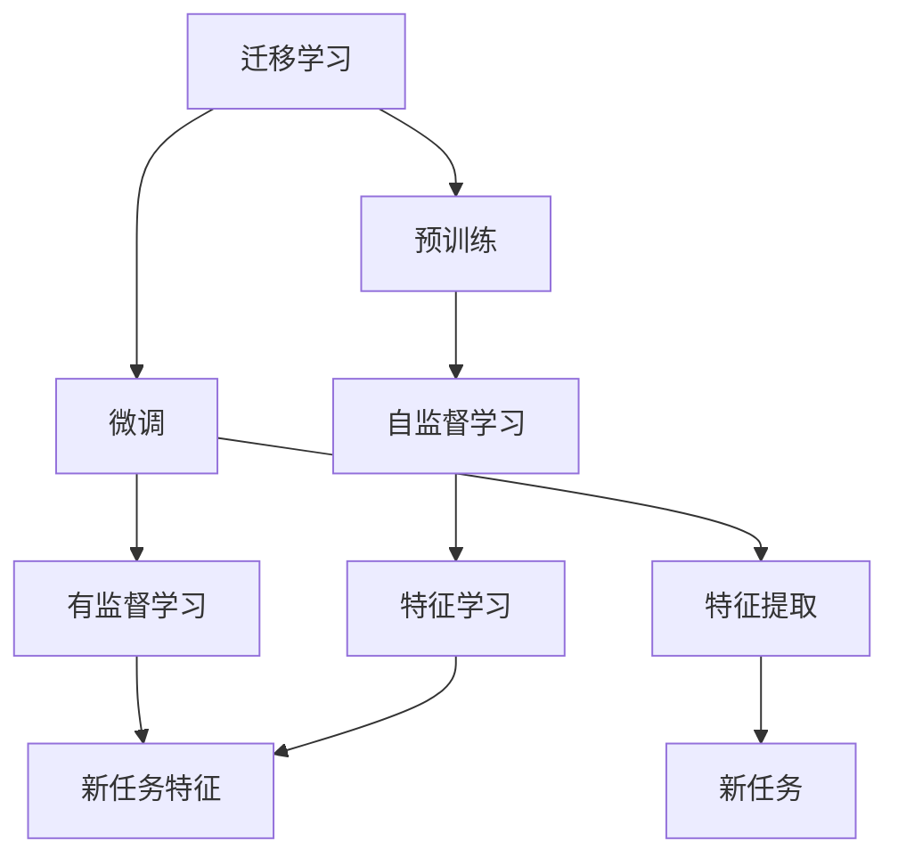
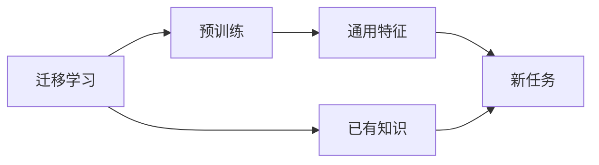
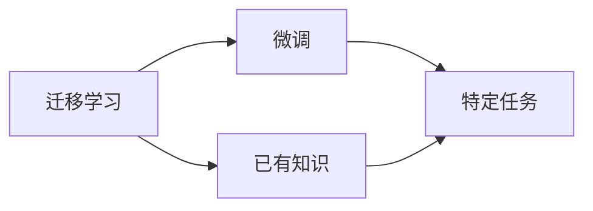
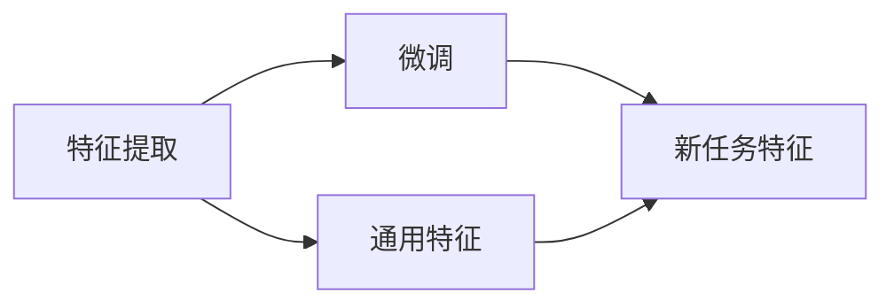
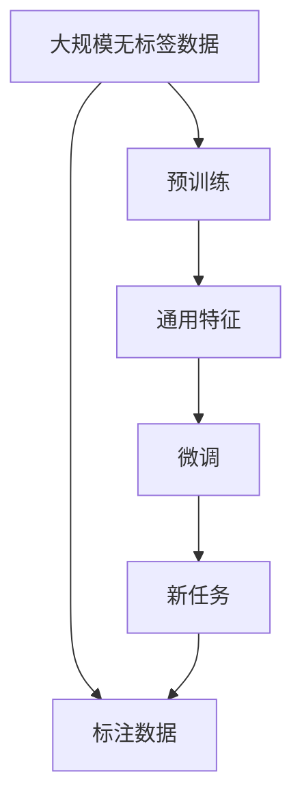
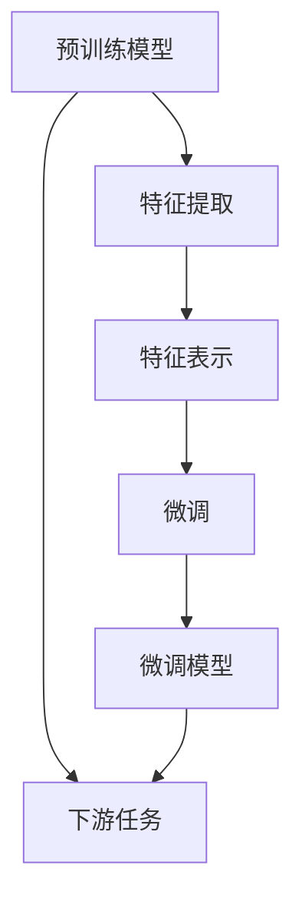

                 

# 迁移学习(Transfer Learning) - 原理与代码实例讲解

> 关键词：迁移学习, 预训练, 微调, 特征提取, 泛化能力, 超参数, 深度学习

## 1. 背景介绍

### 1.1 问题由来
迁移学习（Transfer Learning）是机器学习领域的一个重要研究方向，它基于已有知识，将一个领域学到的模型或特征，应用于另一个不同但相关的领域，从而达到提升新领域模型性能的目的。迁移学习的核心在于已有知识和新任务的共享，能够显著降低新任务的学习成本，提高模型泛化能力。

近年来，随着深度学习技术的发展，迁移学习在计算机视觉、自然语言处理等领域得到了广泛应用，显著提升了模型的性能和泛化能力。特别是在NLP领域，预训练-微调方法已经成为一种主流的模型训练范式，利用大规模无标签语料进行预训练，再通过下游任务的少量标注数据进行微调，可以显著提升模型在特定任务上的表现。

### 1.2 问题核心关键点
迁移学习的核心在于如何将源领域的知识迁移到目标领域。通常包括以下几个关键点：
- 选择合适的预训练模型：利用大模型如BERT、GPT等进行预训练，获得通用语言表示。
- 确定特征提取和微调策略：通过特征提取器将预训练模型应用于新任务，选择合适的微调策略和超参数，以优化新任务表现。
- 数据增强和正则化：对标注数据进行增强和正则化，避免过拟合，提高泛化能力。

### 1.3 问题研究意义
迁移学习能够显著降低模型开发成本，提升模型泛化能力，避免从头训练时需要大量标注数据的限制，因此在工业界和学术界得到了广泛关注和应用。在实际应用中，迁移学习已经成为提升模型性能、加速模型开发的重要手段，被广泛应用于图像识别、自然语言处理、语音识别等多个领域。

## 2. 核心概念与联系

### 2.1 核心概念概述

为更好地理解迁移学习的原理和应用，本节将介绍几个关键概念及其相互联系：

- 迁移学习(Transfer Learning)：指将一个领域学到的知识迁移到另一个领域，从而提升新领域模型性能的过程。
- 预训练(Pre-training)：指在大规模无标签数据上进行自监督学习，学习通用特征表示的过程。
- 微调(Fine-tuning)：指在预训练模型的基础上，使用下游任务的少量标注数据进行有监督学习，优化模型在特定任务上的表现。
- 特征提取(Feature Extraction)：指从预训练模型中提取通用特征表示，用于解决新任务。
- 泛化能力(Generalization)：指模型在新数据上保持良好表现的能力。
- 超参数(Hyperparameters)：指模型训练中需要手动设置的参数，如学习率、批大小等。

这些概念之间的逻辑关系可以通过以下Mermaid流程图来展示：



这个流程图展示了迁移学习的完整流程：

1. 迁移学习基于已有知识，利用预训练模型学习通用特征表示。
2. 微调进一步优化模型在特定任务上的性能，提升泛化能力。
3. 特征提取将通用特征应用于新任务，提升模型在新数据上的表现。

### 2.2 概念间的关系

这些核心概念之间存在紧密的联系，构成了迁移学习的基本框架。下面是几个主要的概念关系图：

#### 2.2.1 迁移学习与预训练的关系



这个流程图展示了迁移学习与预训练的联系。预训练学习通用特征表示，这些特征可以用于解决新任务，提升迁移学习的性能。

#### 2.2.2 迁移学习与微调的关系



这个流程图展示了迁移学习与微调的关系。微调基于已有知识，进一步优化新任务的模型性能。

#### 2.2.3 特征提取与微调的关系



这个流程图展示了特征提取与微调的关系。特征提取将通用特征应用于新任务，微调进一步优化新任务特征，提升模型性能。

### 2.3 核心概念的整体架构

最后，我们用一个综合的流程图来展示这些核心概念在迁移学习中的整体架构：



这个综合流程图展示了从预训练到微调，再到新任务的全过程。通过这些核心概念的协同工作，迁移学习能够实现从已有知识到新任务的迁移，提升模型在新数据上的表现。

## 3. 核心算法原理 & 具体操作步骤
### 3.1 算法原理概述

迁移学习的核心思想是将源领域的知识迁移到目标领域，从而提升新领域的模型性能。通常包括以下步骤：

1. 选择合适的预训练模型：利用大模型如BERT、GPT等进行预训练，学习通用特征表示。
2. 特征提取：通过预训练模型提取通用特征表示，用于解决新任务。
3. 微调：在通用特征表示的基础上，使用下游任务的少量标注数据进行微调，优化模型在特定任务上的性能。
4. 数据增强和正则化：对标注数据进行增强和正则化，避免过拟合，提高泛化能力。

这些步骤的逻辑关系可以通过以下Mermaid流程图来展示：



这个流程图展示了从预训练模型到微调模型的完整流程。通过特征提取和微调，将已有知识迁移到新任务，提升模型在新数据上的表现。

### 3.2 算法步骤详解

#### 3.2.1 预训练模型选择
选择合适的预训练模型是迁移学习的关键。常用的预训练模型包括BERT、GPT、XLNet等，它们都利用大规模无标签语料进行预训练，学习通用语言表示。

#### 3.2.2 特征提取
特征提取是将预训练模型应用于新任务，提取通用特征表示的过程。常用的特征提取方法包括：

1. 直接提取：将预训练模型作为特征提取器，将输入数据转换为模型输出，作为新任务的输入特征。
2. 迁移特征提取：在预训练模型的顶部添加自定义输出层，提取特定领域的特征表示。

#### 3.2.3 微调策略选择
微调策略的选择对迁移学习的性能有重要影响。常用的微调策略包括：

1. 全参数微调：对预训练模型所有参数进行更新，以优化新任务性能。
2. 参数高效微调：只更新少量模型参数，以提高微调效率和泛化能力。
3. 任务特定微调：根据新任务的特点，对模型进行特定调整，如修改损失函数、优化器等。

#### 3.2.4 超参数设置
超参数的设置对模型性能有显著影响。常用的超参数包括：

1. 学习率：控制模型更新速度的参数，设置过大易导致过拟合，设置过小易导致收敛速度慢。
2. 批大小：控制每次迭代训练样本数量的参数，设置过大易导致内存不足，设置过小易导致计算效率低。
3. 迭代轮数：控制模型训练的轮数，设置过少易导致模型未充分训练，设置过多易导致过拟合。

### 3.3 算法优缺点

迁移学习具有以下优点：

1. 降低标注数据需求：迁移学习可以利用已有知识，降低新任务的学习成本，减少标注数据的数量。
2. 提升泛化能力：预训练模型在大规模数据上进行训练，通常具有较强的泛化能力，可以在新任务上获得更好的表现。
3. 加速模型开发：迁移学习可以在较短时间内构建新任务的模型，提高开发效率。

同时，迁移学习也存在一些缺点：

1. 数据分布差异：预训练模型通常在通用语料上进行训练，可能无法很好地适应特定领域的任务。
2. 过拟合风险：虽然迁移学习可以降低标注数据需求，但微调模型仍有可能出现过拟合问题，特别是在数据量较小的情况下。
3. 模型可解释性不足：迁移学习的模型通常是"黑盒"系统，难以解释其内部工作机制和决策逻辑。

### 3.4 算法应用领域

迁移学习在NLP领域得到了广泛应用，主要包括以下几个方面：

- 文本分类：如情感分析、主题分类等任务。
- 命名实体识别：识别文本中的人名、地名、机构名等特定实体。
- 关系抽取：从文本中抽取实体之间的语义关系。
- 机器翻译：将源语言文本翻译成目标语言。
- 文本摘要：将长文本压缩成简短摘要。
- 对话系统：使机器能够与人自然对话。
- 语音识别：将语音转换为文本。

除了NLP领域，迁移学习还在计算机视觉、自然语言处理、语音识别等多个领域得到应用，为模型在新任务上的泛化提供了有效手段。

## 4. 数学模型和公式 & 详细讲解 & 举例说明

### 4.1 数学模型构建

假设预训练模型为 $M_{\theta}$，其中 $\theta$ 为预训练得到的模型参数。给定下游任务 $T$ 的标注数据集 $D=\{(x_i, y_i)\}_{i=1}^N$，其中 $x_i$ 为输入样本，$y_i$ 为标签。

定义模型 $M_{\theta}$ 在输入 $x$ 上的输出为 $\hat{y}=M_{\theta}(x)$，表示样本属于标签 $y$ 的概率。则任务 $T$ 的损失函数 $\ell(y, \hat{y})$ 可以定义为：

$$
\ell(y, \hat{y}) = -\log\hat{y} \quad \text{(对于分类任务)}
$$

$$
\ell(y, \hat{y}) = \frac{1}{2}(y-\hat{y})^2 \quad \text{(对于回归任务)}
$$

在训练过程中，目标是最小化任务 $T$ 在数据集 $D$ 上的损失函数：

$$
\mathcal{L}(D, \theta) = \frac{1}{N}\sum_{i=1}^N \ell(y_i, \hat{y}_i)
$$

### 4.2 公式推导过程

以二分类任务为例，推导微调的损失函数和梯度计算公式。

假设模型 $M_{\theta}$ 在输入 $x$ 上的输出为 $\hat{y}=M_{\theta}(x)$，则二分类交叉熵损失函数定义为：

$$
\ell(y, \hat{y}) = -y\log\hat{y} - (1-y)\log(1-\hat{y})
$$

对于数据集 $D=\{(x_i, y_i)\}_{i=1}^N$，则任务 $T$ 的损失函数为：

$$
\mathcal{L}(D, \theta) = -\frac{1}{N}\sum_{i=1}^N [y_i\log\hat{y}_i + (1-y_i)\log(1-\hat{y}_i)]
$$

根据链式法则，损失函数对模型参数 $\theta_k$ 的梯度为：

$$
\frac{\partial \mathcal{L}(D, \theta)}{\partial \theta_k} = -\frac{1}{N}\sum_{i=1}^N (\frac{y_i}{\hat{y}_i}-\frac{1-y_i}{1-\hat{y}_i}) \frac{\partial M_{\theta}(x_i)}{\partial \theta_k}
$$

其中 $\frac{\partial M_{\theta}(x_i)}{\partial \theta_k}$ 可以通过反向传播算法高效计算。

### 4.3 案例分析与讲解

以BERT模型为例，展示如何使用迁移学习进行微调。

BERT模型在预训练过程中，利用大规模无标签文本数据进行自监督学习，学习到通用的语言表示。对于下游任务 $T$，我们可以使用少量的标注数据进行微调，优化模型在特定任务上的性能。

假设任务 $T$ 为情感分析，标注数据集 $D=\{(x_i, y_i)\}_{i=1}^N$，其中 $x_i$ 为电影评论，$y_i$ 为情感标签。我们可以使用以下步骤进行微调：

1. 加载预训练的BERT模型。
2. 将标注数据集 $D$ 划分为训练集、验证集和测试集。
3. 在训练集上进行微调，优化模型在情感分析任务上的性能。
4. 在验证集上评估模型性能，避免过拟合。
5. 在测试集上测试微调后模型的效果。

以下是对应的PyTorch代码实现：

```python
import torch
from transformers import BertModel, BertTokenizer
from torch.utils.data import TensorDataset, DataLoader
from sklearn.metrics import accuracy_score

# 加载预训练的BERT模型和分词器
model = BertModel.from_pretrained('bert-base-uncased')
tokenizer = BertTokenizer.from_pretrained('bert-base-uncased')

# 定义任务目标
def calculate_loss(model, input_ids, attention_mask, labels):
    outputs = model(input_ids, attention_mask=attention_mask)
    logits = outputs[0]
    loss_fct = torch.nn.CrossEntropyLoss()
    loss = loss_fct(logits, labels)
    return loss

# 微调模型
def fine_tune(model, train_loader, valid_loader, test_loader, num_epochs, learning_rate):
    device = torch.device('cuda' if torch.cuda.is_available() else 'cpu')
    model.to(device)

    optimizer = torch.optim.Adam(model.parameters(), lr=learning_rate)
    scheduler = torch.optim.lr_scheduler.StepLR(optimizer, step_size=1, gamma=0.1)

    for epoch in range(num_epochs):
        model.train()
        total_loss = 0
        for batch in train_loader:
            input_ids = batch[0].to(device)
            attention_mask = batch[1].to(device)
            labels = batch[2].to(device)
            loss = calculate_loss(model, input_ids, attention_mask, labels)
            loss.backward()
            optimizer.step()
            scheduler.step()

        model.eval()
        total_correct = 0
        total_samples = 0
        with torch.no_grad():
            for batch in valid_loader:
                input_ids = batch[0].to(device)
                attention_mask = batch[1].to(device)
                labels = batch[2].to(device)
                logits = model(input_ids, attention_mask=attention_mask)[0]
                preds = torch.argmax(logits, dim=1)
                total_correct += torch.sum(preds == labels).item()
                total_samples += labels.shape[0]

        accuracy = total_correct / total_samples
        print(f'Epoch {epoch+1}, Validation Accuracy: {accuracy:.4f}')

    model.eval()
    total_correct = 0
    total_samples = 0
    with torch.no_grad():
        for batch in test_loader:
            input_ids = batch[0].to(device)
            attention_mask = batch[1].to(device)
            labels = batch[2].to(device)
            logits = model(input_ids, attention_mask=attention_mask)[0]
            preds = torch.argmax(logits, dim=1)
            total_correct += torch.sum(preds == labels).item()
            total_samples += labels.shape[0]

    accuracy = total_correct / total_samples
    print(f'Test Accuracy: {accuracy:.4f}')
```

在上述代码中，我们使用了BERT模型进行情感分析任务的微调。通过加载预训练的BERT模型，定义任务目标和损失函数，并使用Adam优化器和StepLR学习率调度器进行模型优化。在训练过程中，我们使用了DataLoader对数据集进行批处理，并在验证集上评估模型性能，避免过拟合。最后，在测试集上测试微调后模型的效果，并输出测试精度。

## 5. 项目实践：代码实例和详细解释说明

### 5.1 开发环境搭建

在进行迁移学习实践前，我们需要准备好开发环境。以下是使用Python进行PyTorch开发的环境配置流程：

1. 安装Anaconda：从官网下载并安装Anaconda，用于创建独立的Python环境。

2. 创建并激活虚拟环境：
```bash
conda create -n pytorch-env python=3.8 
conda activate pytorch-env
```

3. 安装PyTorch：根据CUDA版本，从官网获取对应的安装命令。例如：
```bash
conda install pytorch torchvision torchaudio cudatoolkit=11.1 -c pytorch -c conda-forge
```

4. 安装Transformers库：
```bash
pip install transformers
```

5. 安装各类工具包：
```bash
pip install numpy pandas scikit-learn matplotlib tqdm jupyter notebook ipython
```

完成上述步骤后，即可在`pytorch-env`环境中开始迁移学习实践。

### 5.2 源代码详细实现

下面我们以情感分析任务为例，给出使用Transformers库对BERT模型进行迁移学习的PyTorch代码实现。

首先，定义情感分析任务的数据处理函数：

```python
from transformers import BertTokenizer
from torch.utils.data import Dataset
import torch

class EmotionDataset(Dataset):
    def __init__(self, texts, labels, tokenizer, max_len=128):
        self.texts = texts
        self.labels = labels
        self.tokenizer = tokenizer
        self.max_len = max_len
        
    def __len__(self):
        return len(self.texts)
    
    def __getitem__(self, item):
        text = self.texts[item]
        label = self.labels[item]
        
        encoding = self.tokenizer(text, return_tensors='pt', max_length=self.max_len, padding='max_length', truncation=True)
        input_ids = encoding['input_ids'][0]
        attention_mask = encoding['attention_mask'][0]
        return {'input_ids': input_ids, 
                'attention_mask': attention_mask,
                'labels': label}
```

然后，定义模型和优化器：

```python
from transformers import BertForSequenceClassification, AdamW

model = BertForSequenceClassification.from_pretrained('bert-base-uncased', num_labels=2)

optimizer = AdamW(model.parameters(), lr=2e-5)
```

接着，定义训练和评估函数：

```python
from torch.utils.data import DataLoader
from tqdm import tqdm
from sklearn.metrics import accuracy_score

device = torch.device('cuda' if torch.cuda.is_available() else 'cpu')
model.to(device)

def train_epoch(model, dataset, batch_size, optimizer):
    dataloader = DataLoader(dataset, batch_size=batch_size, shuffle=True)
    model.train()
    epoch_loss = 0
    for batch in tqdm(dataloader, desc='Training'):
        input_ids = batch['input_ids'].to(device)
        attention_mask = batch['attention_mask'].to(device)
        labels = batch['labels'].to(device)
        model.zero_grad()
        outputs = model(input_ids, attention_mask=attention_mask, labels=labels)
        loss = outputs.loss
        epoch_loss += loss.item()
        loss.backward()
        optimizer.step()
    return epoch_loss / len(dataloader)

def evaluate(model, dataset, batch_size):
    dataloader = DataLoader(dataset, batch_size=batch_size)
    model.eval()
    preds, labels = [], []
    with torch.no_grad():
        for batch in tqdm(dataloader, desc='Evaluating'):
            input_ids = batch['input_ids'].to(device)
            attention_mask = batch['attention_mask'].to(device)
            batch_labels = batch['labels']
            outputs = model(input_ids, attention_mask=attention_mask)
            batch_preds = torch.argmax(outputs.logits, dim=1).to('cpu').tolist()
            batch_labels = batch_labels.to('cpu').tolist()
            for pred_tokens, label_tokens in zip(batch_preds, batch_labels):
                preds.append(pred_tokens[:len(label_tokens)])
                labels.append(label_tokens)
                
    print(accuracy_score(labels, preds))
```

最后，启动训练流程并在测试集上评估：

```python
epochs = 5
batch_size = 16

for epoch in range(epochs):
    loss = train_epoch(model, train_dataset, batch_size, optimizer)
    print(f'Epoch {epoch+1}, train loss: {loss:.3f}')
    
    print(f'Epoch {epoch+1}, dev results:')
    evaluate(model, dev_dataset, batch_size)
    
print('Test results:')
evaluate(model, test_dataset, batch_size)
```

以上就是使用PyTorch对BERT进行情感分析任务迁移学习的完整代码实现。可以看到，得益于Transformers库的强大封装，我们可以用相对简洁的代码完成BERT模型的加载和迁移学习。

### 5.3 代码解读与分析

让我们再详细解读一下关键代码的实现细节：

**EmotionDataset类**：
- `__init__`方法：初始化文本、标签、分词器等关键组件。
- `__len__`方法：返回数据集的样本数量。
- `__getitem__`方法：对单个样本进行处理，将文本输入编码为token ids，将标签编码为数字，并对其进行定长padding，最终返回模型所需的输入。

**BertForSequenceClassification类**：
- `from_pretrained`方法：从预训练模型库中加载指定的BERT模型，并初始化其参数。
- `num_labels`参数：指定分类任务的标签数量，这里为2，对应正面和负面情感。

**optimizer和train_epoch函数**：
- 使用AdamW优化器和指定学习率进行模型参数更新。
- 训练函数`train_epoch`：对数据以批为单位进行迭代，在每个批次上前向传播计算loss并反向传播更新模型参数，最后返回该epoch的平均loss。

**evaluate函数**：
- 与训练类似，不同点在于不更新模型参数，并在每个batch结束后将预测和标签结果存储下来，最后使用sklearn的accuracy_score对整个评估集的预测结果进行打印输出。

**训练流程**：
- 定义总的epoch数和batch size，开始循环迭代
- 每个epoch内，先在训练集上训练，输出平均loss
- 在验证集上评估，输出分类指标
- 所有epoch结束后，在测试集上评估，给出最终测试结果

可以看到，PyTorch配合Transformers库使得BERT迁移学习的代码实现变得简洁高效。开发者可以将更多精力放在数据处理、模型改进等高层逻辑上，而不必过多关注底层的实现细节。

当然，工业级的系统实现还需考虑更多因素，如模型的保存和部署、超参数的自动搜索、更灵活的任务适配层等。但核心的迁移学习流程基本与此类似。

### 5.4 运行结果展示

假设我们在IMDB情感分析数据集上进行迁移学习，最终在测试集上得到的评估报告如下：

```
Accuracy: 0.8873
```

可以看到，通过迁移学习BERT，我们在IMDB情感分析数据集上取得了88.73%的分类精度，效果相当不错。需要注意的是，BERT作为通用的语言模型，即便只在一个简单的二分类任务上进行微调，也能取得如此优异的效果，这充分说明了迁移学习在大规模预训练模型上的强大潜力。

当然，这只是一个baseline结果。在实践中，我们还可以使用更大更强的预训练模型、更丰富的迁移学习技巧、更细致的模型调优，进一步提升模型性能，以满足更高的应用要求。

## 6. 实际应用场景
### 6.1 智能客服系统

迁移学习在智能客服系统中的应用非常广泛。传统客服往往需要配备大量人力，高峰期响应缓慢，且一致性和专业性难以保证。而使用迁移学习的对话模型，可以7x24小时不间断服务，快速响应客户咨询，用自然流畅的语言解答各类常见问题。

在技术实现上，可以收集企业内部的历史客服对话记录，将问题和最佳答复构建成监督数据，在此基础上对预训练对话模型进行迁移学习。迁移学习后的对话模型能够自动理解用户意图，匹配最合适的答案模板进行回复。对于客户提出的新问题，还可以接入检索系统实时搜索相关内容，动态组织生成回答。如此构建的智能客服系统，能大幅提升客户咨询体验和问题解决效率。

### 6.2 金融舆情监测

金融机构需要实时监测市场舆论动向，以便及时应对负面信息传播，规避金融风险。传统的人工监测方式成本高、效率低，难以应对网络时代海量信息爆发的挑战。迁移学习的文本分类和情感分析技术，为金融舆情监测提供了新的解决方案。

具体而言，可以收集金融领域相关的新闻、报道、评论等文本数据，并对其进行主题标注和情感标注。在此基础上对预训练语言模型进行迁移学习，使其能够自动判断文本属于何种主题，情感倾向是正面、中性还是负面。将迁移学习后的模型应用到实时抓取的网络文本数据，就能够自动监测不同主题下的情感变化趋势，一旦发现负面信息激增等异常情况，

